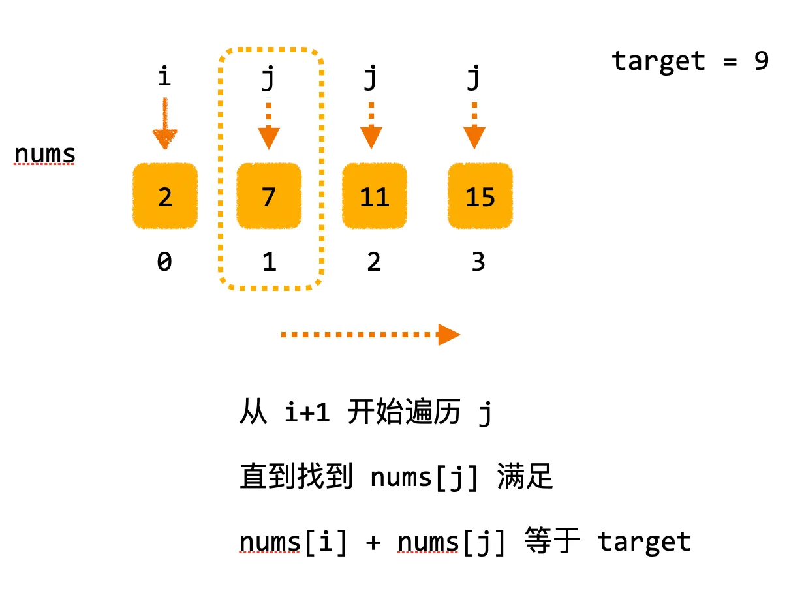
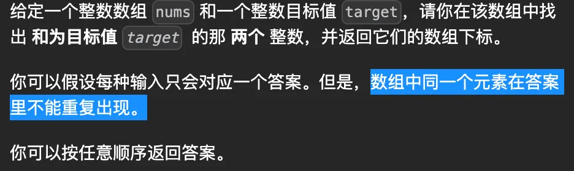

# [0001. 两数之和【简单】](https://github.com/Tdahuyou/leetcode/tree/main/0001.%20%E4%B8%A4%E6%95%B0%E4%B9%8B%E5%92%8C%E3%80%90%E7%AE%80%E5%8D%95%E3%80%91)

- [leetcode](https://leetcode.cn/problems/two-sum/)
- [bilibili](https://www.bilibili.com/video/BV1DivNejEb1)

## 📝 Description

给定一个整数数组 `nums` 和一个整数目标值 `target`，请你在该数组中找出 **和为目标值** `target`  的那 **两个** 整数，并返回它们的数组下标。

你可以假设每种输入只会对应一个答案。但是，数组中同一个元素在答案里不能重复出现。
你可以按任意顺序返回答案。

**示例 1：**

- 输入：nums = [2,7,11,15], target = 9
- 输出：[0,1]
- 解释：因为 nums[0] + nums[1] == 9 ，返回 [0, 1] 。

**示例 2：**

- 输入：nums = [3,2,4], target = 6
- 输出：[1,2]

**示例 3：**

- 输入：nums = [3,3], target = 6
- 输出：[0,1]

**提示：**

- `2 <= nums.length <= 10^4`
- `-10^9 <= nums[i] <= 10^9`
- `-10^9 <= target <= 10^9`
- 只会存在一个有效答案

进阶：你可以想出一个时间复杂度小于 `O(n^2)` 的算法吗？

## 💻 题解 - 1. 双指针暴力求解



```js
var twoSum = function (nums, target) {
  for (let i = 0; i < nums.length - 1; i++)
    for (let j = i + 1; j < nums.length; j++)
      if (target === nums[j] + nums[i]) return [i, j]
}
```

- 时间复杂度：`O(n^2)`
- 空间复杂度：`O(1)`

这种方法的一个缺点是，当 `n` 较大时，时间复杂度可能会变得非常高。我们可以通过使用一种叫做哈希映射的数据结构来改进这个算法，这种数据结构可以在常数时间内完成查找操作，从而将算法的时间复杂度降低到 `O(n)`。但是，这将使空间复杂度增加到 `O(n)`，因为我们需要存储 `n` 个元素的哈希映射。

## 💻 题解 - 2. 静态哈希表


```js
var twoSum = function (nums, target) {
  // 初始化哈希表
  const map = new Map();
  for (let i = 0; i < nums.length; i++) {
    map.set(nums[i], i);
  }

  // 查询哈希表
  for (let i = 0; i < nums.length; i++) {
    const anotherNum = target - nums[i];
    if (map.has(anotherNum) && map.get(anotherNum) !== i) {
      return [i, map.get(anotherNum)];
    }
  }
}
```

- 时间复杂度：`O(n)`
- 空间复杂度：`O(n)`

【第一步】这种解法首先将数组中的每个元素及其索引添加到哈希表中

【第二步】然后在第二个循环中检查每个元素所对应的目标元素（即 `target - nums[i]`）是否存在于哈希表中

注意，该目标元素不能是 `nums[i]` 本身（即 `map.get(anotherNum) !== i`）

## 💻 题解 - 3. 动态哈希表


```js
var twoSum = function (nums, target) {
  const map = new Map();
  for (let i = 0; i < nums.length; i++) {
    const item = nums[i];
    const anotherNum = target - item;
    if (map.has(anotherNum)) {
      return [i, map.get(anotherNum)];
    }
    map.set(item, i);
  }
};
```

- 时间复杂度：`O(n)`
- 空间复杂度：`O(n)`

每次在查的时候，都会将所有之前写入的值都查一边，不可能会存在遗漏的情况。任意俩数字组合，都只会被查一次。

## 📒 notes

**对比“静态”哈希表和“动态”哈希表之间的差异**
- 静态：先把整个哈希表准备好，然后再查询。
- 动态：一边查询，一边构建哈希表。

---

**思考：在上述题解（题解 - 动态哈希表）中是“先查后写”，现在改写程序“先写后查”。比如在判断 `map.has(anotherNum)` 之前执行 `map.set(item, i)`，请问这么做会出现什么问题？**



事先明确一点，描述中提到“数组中同一个元素在答案里不能重复出现”。

思考这个问题时，不妨结合以下两个测试用例来辅助思考。

**示例 2：**

- 输入：nums = [3,2,4], target = 6
- 输出：[1,2]

**示例 3：**

- 输入：nums = [3,3], target = 6
- 输出：[0,1]

**先写再查**

```js
var twoSum = function (nums, target) {
  const map = new Map();
  for (let i = 0; i < nums.length; i++) {
    const item = nums[i];
    map.set(item, i); // 写哈希表
    const anotherNum = target - item;
    if (map.has(anotherNum)) { // 查询
      return [i, map.get(anotherNum)];
    }
  }
};

twoSum([3, 4, 2], 6) // [0, 0]
twoSum([3, 3], 6) // [0, 0]
```

两次实际返回的结果都将是 [0, 0]，因为第一个成员 3 刚被写入哈希表，立刻就被查了，所以返回了错误的结果。

每次查找，应该是去查其他成员，而非自身。如果先完成写操作，那么在查操作的时候，自身就会被查一边。

认识到问题之后，让我们来完善一下程序，加一条约束 map.get(anotherNum) !== i，防止查到的是自身是不是就 OK 了呢？

答案是依旧有问题，这种做法将会导致旧数据被覆盖。

**添加约束**

```js
var twoSum = function (nums, target) {
  const map = new Map();
  for (let i = 0; i < nums.length; i++) {
    const item = nums[i];
    map.set(item, i); // 写哈希表
    const anotherNum = target - item;
    if (map.has(anotherNum) && map.get(anotherNum) !== i) { // 查询
      return [i, map.get(anotherNum)];
    }
  }
};

twoSum([3, 2, 3], 6) // undefined
```

在哈希表中，对于重复的 key 值，后面的会覆盖前面的。第一次存入的 `3 => 0` 还没被查询，就被 `3 => 2` 给覆盖了，那你还查个 der。