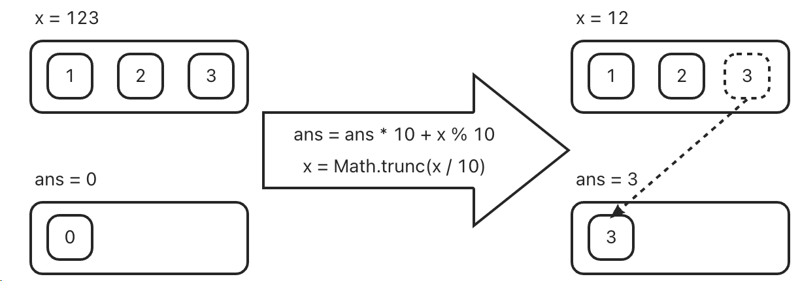
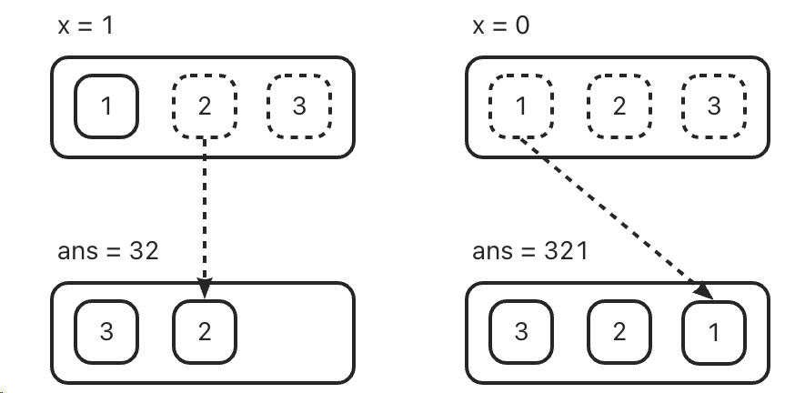
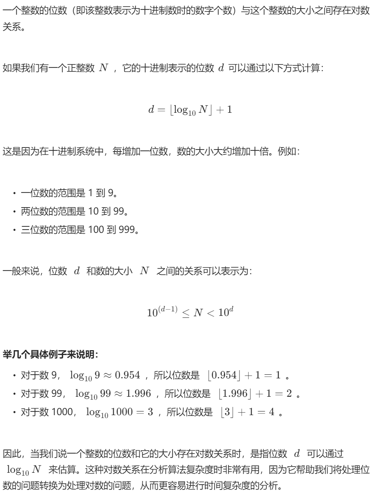
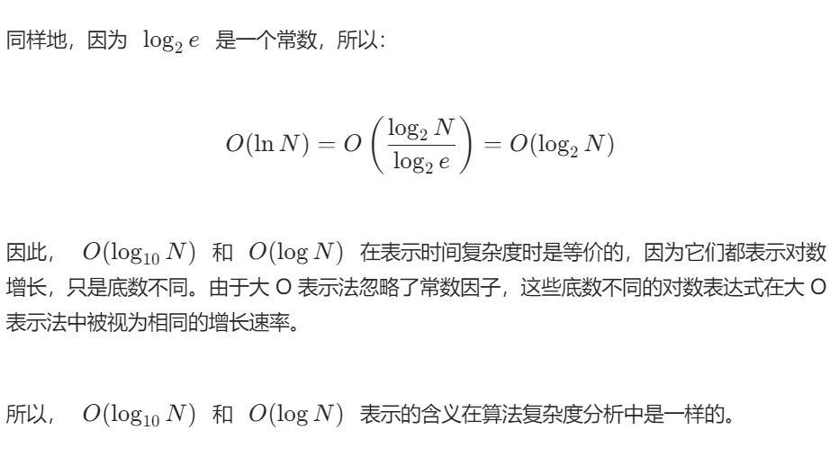

# [0007. 整数反转【中等】](https://github.com/Tdahuyou/leetcode/tree/main/0007.%20%E6%95%B4%E6%95%B0%E5%8F%8D%E8%BD%AC%E3%80%90%E4%B8%AD%E7%AD%89%E3%80%91)

<!-- region:toc -->
- [1. 📝 Description](#1--description)
- [2. 💻 题解.1 - 暴力解法（转为字符串求解）](#2--题解1---暴力解法转为字符串求解)
- [3. 💻 题解.2 - 数学方法](#3--题解2---数学方法)
- [4. 📒 Math.trunc 的基本用法](#4--mathtrunc-的基本用法)
- [5. 🤖 markdown 书写数学公式的语法](#5--markdown-书写数学公式的语法)
  - [5.1. 内联公式](#51-内联公式)
  - [5.2. 独立行公式（块级公式）](#52-独立行公式块级公式)
  - [5.3. 常见的 LaTeX 数学符号](#53-常见的-latex-数学符号)
  - [5.4. 示例](#54-示例)
- [6. 🤖 整数位数和它的大小之间对数关系](#6--整数位数和它的大小之间对数关系)
- [7. 🤖 对比 $O(log_{10} N)$ 和 $O(log N)$](#7--对比-olog_10-n-和-olog-n)
<!-- endregion:toc -->
- [leetcode](https://leetcode.cn/problems/reverse-integer/)
- [bilibili](https://www.bilibili.com/video/BV1DivNejEb1/)

## 1. 📝 Description

给你一个 32 位的有符号整数 `x` ，返回将 `x` 中的数字部分反转后的结果。

如果反转后整数超过 32 位的有符号整数的范围 [−2<sup>31</sup>,  2<sup>31</sup> − 1] ，就返回 0。

**假设环境不允许存储 64 位整数（有符号或无符号）。**

**示例 1：**

- 输入：x = 123
- 输出：321

**示例 2：**

- 输入：x = -123
- 输出：-321

**示例 3：**

- 输入：x = 120
- 输出：21

**示例 4：**

- 输入：x = 0
- 输出：0

**提示：**

- `-2<sup>31</sup> <= x <= 2<sup>31</sup> - 1`

## 2. 💻 题解.1 - 暴力解法（转为字符串求解）


```javascript
var reverse = function (x) {
  let ans
  if (x < 0) { // x 为负数
    ans = ('-' + x.toString().substring(1).split('').reverse().join('')) - 0
  } else { // x 为正数
    ans = x.toString().split('').reverse().join('') - 0
  }

  const max = (2 ** 31) - 1
  const min = -(2 ** 31)

  if (ans < min || ans > max) {
    return 0
  } else {
    return ans
  }
}
```

- 时间复杂度：O(n)
- 空间复杂度：O(n)

其中 n 是整数 x 转换为字符串后的字符数，字符串操作过程中生成了多个长度为 n 的中间结果，时间和空间消耗主要集中在这些字符串操作上。

这种转为字符串的处理方案，优点在于**易理解**，缺点在于**性能不佳**。字符串操作相对于纯数学运算会有较高的时间和空间开销，对于大数可能会影响性能。

上述做法还依赖于特定语言的字符串处理能力，**不具有普遍性**。在某些低级语言或环境中可能不适用，需要手写高级语言预设的 API（比如 `toString`、`substring`、`split` 等）的功能。

**注意：**

`x.toString().split('').reverse().join('') - 0` 这种隐式类型转换的写法，在 js 中 OK，但是在 ts 中默认是不被允许的，可以使用显示转换的写法 `Number(x.toString().split('').reverse().join(''))`

## 3. 💻 题解.2 - 数学方法


> 记录：
> 作图的时候，平板横屏看，感觉图的大小刚好，如果是在手机或者 PC 上预览（限制宽度的话），显然偏小了很多，需要放大来看。接下来作图的时候尽可能不要横向扩展 —— 把宽度弄得太宽，可以纵向扩展 - 让图片长一些，这样预览的效果也许会更好一些。


```javascript
var reverse = function (x) {
  const min = -Math.pow(2, 31)
  const max = Math.pow(2, 31) - 1
  let ans = 0
  while (x !== 0) {
    ans = ans * 10 + x % 10
    x = Math.trunc(x / 10)
  }
  if (ans < min || ans > max) {
    return 0
  } else {
    return ans
  }
}
```

- 时间复杂度：O(logN)

函数的核心是一个 `while` 循环，循环的次数由整数 `x` 的位数决定。假设 `x` 有 d 位，则循环执行 d 次。因此，时间复杂度为 O(d)。由于一个整数的位数与它的大小是对数关系，若 `x` 的绝对值为 `N`，则 d = log10 N，因此时间复杂度可以表示为 O(log10 N)。在大多数分析中，我们用自然对数，所以时间复杂度也可以表示为 O(log N)。

- 空间复杂度：O(1)

没有使用任何额外的数据结构（如数组或对象），所有操作都是就地进行的。因此，空间复杂度为 O(1)。

---

**原理简述：**

每一次遍历，都将 x 的最低位搬运到 ans 的最高位。

- `ans = ans * 10 + x % 10;`
- `x = Math.trunc(x / 10);`






## 4. 📒 Math.trunc 的基本用法


在 `Math.trunc` 中，`trunc` 的全称是 truncate（v. 截短，缩短 `英 /'trʌŋkeɪt/` `美 /trʌŋ'ket/`）。`Math.trunc` 方法用于截取数字的小数部分，只保留其整数部分，无论数字是正数还是负数。

```javascript
console.log(Math.trunc(4.9));    // 输出: 4
console.log(Math.trunc(-4.9));   // 输出: -4
console.log(Math.trunc(4.1));    // 输出: 4
console.log(Math.trunc(-4.1));   // 输出: -4
```

`Math.trunc` 会简单地删除小数点后的所有内容，而不会进行舍入操作。这与 `Math.floor` 和 `Math.ceil` 的行为不同，`Math.floor` 总是向下舍入到最接近的整数，`Math.ceil` 总是向上舍入到最接近的整数。

## 5. 🤖 markdown 书写数学公式的语法

在 Markdown 中书写数学公式，通常会使用 LaTeX 语法。许多 Markdown 解析器支持通过特定的分隔符来包含 LaTeX 数学表达式。以下是一些常见的方法和示例：

### 5.1. 内联公式
内联公式是指嵌入到文本中的公式，可以使用单个美元符号 `$` 或反引号加 `latex` 来包裹公式。

- **单个美元符号**：这是最常见的方式。
  ```markdown
  Euler's identity is $e^{i\pi} + 1 = 0$.
  ```
- **反引号加 `latex`**：这种方法在一些 Markdown 编辑器中被支持，例如 GitHub 的 Markdown。
  ```markdown
  Euler's identity is `\( e^{i\pi} + 1 = 0 \)`.
  ```

### 5.2. 独立行公式（块级公式）
独立行公式是指单独成行显示的公式，通常使用双美元符号 `$$` 或反引号加 `latex` 来包裹公式。

- **双美元符号**：
  ```markdown
  $$ E = mc^2 $$
  ```

- **反引号加 `latex`**：
  ```markdown
  $$
  E = mc^2
  $$
  ```

### 5.3. 常见的 LaTeX 数学符号

- **上标和下标**：
  - 上标: `x^2`
  - 下标: `x_2`

- **分数**：
  - `\frac{a}{b}`

- **根号**：
  - 平方根: `\sqrt{x}`
  - n 次方根: `\sqrt[n]{x}`

- **求和符号**：
  - `\sum_{i=1}^{n} x_i`

- **积分符号**：
  - `\int_{a}^{b} f(x) dx`

- **希腊字母**：
  - 小写 alpha: `\alpha`
  - 大写 Alpha: `\Alpha`
  - 其他希腊字母类似，只需替换相应的字母名。

- **特殊函数**：
  - 对数: `\log x`
  - 自然对数: `\ln x`
  - 正弦: `\sin x`
  - 余弦: `\cos x`
  - 正切: `\tan x`

- **矩阵**：
  ```latex
  \begin{pmatrix}
  a & b \\
  c & d
  \end{pmatrix}
  ```

- **多行公式**：
  ```latex
  \begin{align*}
  a &= b + c \\
  d &= e + f
  \end{align*}
  ```

### 5.4. 示例

```markdown
Euler's identity is $e^{i\pi} + 1 = 0$.

The quadratic formula is:
$$ x = \frac{-b \pm \sqrt{b^2 - 4ac}}{2a} $$

A matrix:
$$
\begin{pmatrix}
1 & 2 & 3 \\
4 & 5 & 6 \\
7 & 8 & 9
\end{pmatrix}
$$

A system of equations:
\begin{align*}
x + y &= 2 \\
2x - y &= 4
\end{align*}
```

这些示例应该能够帮助你在 Markdown 中正确地书写数学公式。如果你使用的 Markdown 解析器不直接支持 LaTeX 语法，你可能需要查看该解析器的具体文档，了解它支持的数学公式格式。

## 6. 🤖 整数位数和它的大小之间对数关系



## 7. 🤖 对比 $O(log_{10} N)$ 和 $O(log N)$





