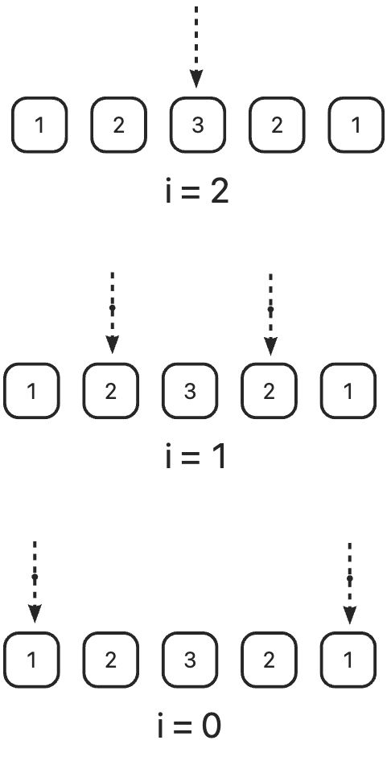

# [0009. 回文数【简单】](https://github.com/Tdahuyou/leetcode/tree/main/0009.%20%E5%9B%9E%E6%96%87%E6%95%B0%E3%80%90%E7%AE%80%E5%8D%95%E3%80%91)

<!-- region:toc -->
- [1. 📝 Description](#1--description-4)
- [2. 💻 sols.1 - 暴力解法（转为字符串来比较）](#2--sols1---暴力解法转为字符串来比较)
- [3. 💻 sols.2 - 先反转再比较](#3--sols2---先反转再比较)
- [4. 💻 sols.3 - 二分对比](#4--sols3---二分对比)
<!-- endregion:toc -->
- [leetcode](https://leetcode.cn/problems/palindrome-number/)
- [bilibili](https://www.bilibili.com/video/BV1DivNejEb1/)

## 1. 📝 Description

给你一个整数 `x` ，如果 `x` 是一个回文整数，返回 `true` ；否则，返回 `false`。

**回文数** 是指正序（从左向右）和倒序（从右向左）读都是一样的整数。例如，`121` 是回文，而 `123` 不是。

> 回文数：
> 如果一个数向前和向后读都相同，则它是一个 **回文数**。例如，`121` 是回文数，而 `123` 不是。

**示例 1：**

- 输入：x = 121
- 输出：true

**示例 2：**

- 输入：x = -121
- 输出：false
- 解释：从左向右读, 为 -121 。 从右向左读, 为 121- 。因此它不是一个回文数。

**示例 3：**

- 输入：x = 10
- 输出：false
- 解释：从右向左读, 为 01 。因此它不是一个回文数。

**提示：**

- `-2^31 <= x <= 2^31 - 1`

**进阶：**你能不将整数转为字符串来解决这个问题吗？

## 2. 💻 sols.1 - 暴力解法（转为字符串来比较）

```javascript
var isPalindrome = function (x) {
  if (x < 0) return false
  return x.toString() === x.toString().split('').reverse().join('')
}
```

- 时间复杂度：$O(n)$
- 空间复杂度：$O(n)$

**特殊情况：**

如果 `x` 是负数的话，直接 `return false` 即可。

## 3. 💻 sols.2 - 先反转再比较

```javascript
var isPalindrome = function (x) {
  if (x < 0) return false
  const originalNum = x // 原始值
  let resultNum = 0 // 经过反转后的结果
  while (x !== 0) {
    resultNum = resultNum * 10 + x % 10
    x = parseInt(x / 10)
  }
  return originalNum === resultNum
}
```

- 时间复杂度：$O(n)$
- 空间复杂度：$O(1)$

核心逻辑跟【0007. 整数反转】中的【solutions - 数学方法】是一样的。

## 4. 💻 sols.3 - 二分对比



```javascript
var isPalindrome = function (x) {
  if (x < 0) return false
  const arr = x.toString().split('') // 转化为数组
  const len = arr.length
  let endIndex = len - 1 // 数组的最后一个下标
  for (let i = 0; i <= len / 2; i++) {
    if (arr[i] !== arr[endIndex - i]) return false
  }
  return true
}
```

- 时间复杂度：$O(n)$
- 空间复杂度：$O(n)$

俩指针从两端向中间走，检查走过的每一个成员的值，一旦发现不同的就返回 `false`。若遍历结束了，还是没有找到不同的成员，那么返回 `true`。


