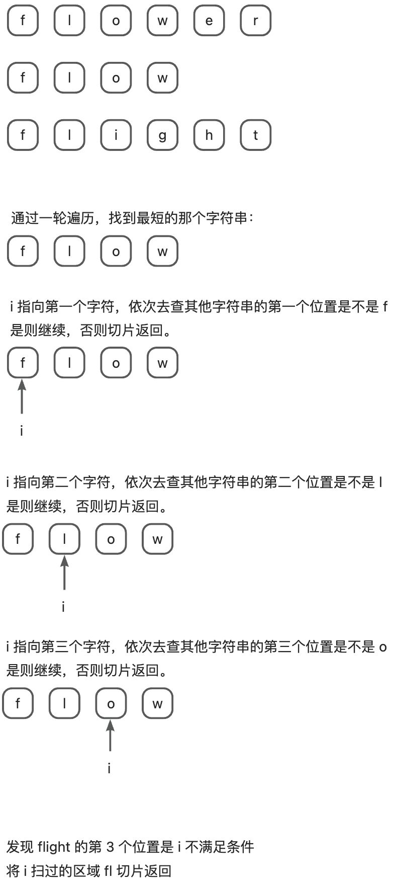

# [0014. 最长公共前缀【简单】](https://github.com/Tdahuyou/leetcode/tree/main/0014.%20%E6%9C%80%E9%95%BF%E5%85%AC%E5%85%B1%E5%89%8D%E7%BC%80%E3%80%90%E7%AE%80%E5%8D%95%E3%80%91)

<!-- region:toc -->
- [1. 📝 Description](#1--description)
- [2. 💻 题解.1 - 暴力解法](#2--题解1---暴力解法)
- [3. 💻 题解.2 - 横向扫描](#3--题解2---横向扫描)
- [4. 💻 题解.3 - 纵向扫描](#4--题解3---纵向扫描)
<!-- endregion:toc -->
- [leetcode](https://leetcode.cn/problems/longest-common-prefix)
- [bilibili](https://www.bilibili.com/video/BV1DivNejEb1/)

## 1. 📝 Description

编写一个函数来查找字符串数组中的最长公共前缀。

如果不存在公共前缀，返回空字符串 `""`。

**示例 1：**

- 输入：strs = ["flower","flow","flight"]
- 输出："fl"

**示例 2：**

- 输入：strs = ["dog","racecar","car"]
- 输出：""
- 解释：输入不存在公共前缀。

**提示：**

- `1 <= strs.length <= 200`
- `0 <= strs[i].length <= 200`
- `strs[i]` 仅由小写英文字母组成

## 2. 💻 题解.1 - 暴力解法



```javascript
var longestCommonPrefix = function (strs) {
  // 找到长度最小的字符串
  let minStr = strs[0]
  for (let i = 1; i < strs.length; i++) minStr = strs[i].length < minStr.length ? strs[i] : minStr

  // 挨个遍历每个成员，从每个成员的首字符开始检查
  for (let i = 0; i < minStr.length; i++)
    for (let j = 0; j < strs.length; j++)
      if (strs[j][i] !== minStr[i]) return minStr.slice(0, i)

  return minStr
};
```

- 时间复杂度： $O(m*n)$
- 空间复杂度： $O(1)$

这种暴力解法的时间复杂度取决于最短字符串的长度，记为 m，以及字符串数组的长度，记为 n。在算法中，我们需要遍历最短字符串的每个字符，并且对于每个字符，需要检查字符串数组中的每个字符串的相应位置是否相等。因此，时间复杂度为 $O(m*n)$。

对于空间复杂度，算法并没有使用额外的空间，除了一些常量级别的辅助变量。因此，空间复杂度为 $O(1)$。

**核心逻辑：**

1. 找到长度最短的字符串。
2. 依次遍历最短字符串的每个字符以及字符串数组的每一项，从头开始比较，一旦发现不等的字符直接 return 切片结果。

## 3. 💻 题解.2 - 横向扫描


> 为了方便演示，再插入一个 foo。

```javascript
var longestCommonPrefix = function (strs) {
  let str = strs[0]
  for (let i = 1; i < strs.length; i++) {
    while (strs[i].indexOf(str) !== 0) {
      str = str.substring(0, str.length - 1) // 不断的截去最后一个字符
      if (str === '') return str
    }
  }
  return str
}
```

- 时间复杂度： $O(m*n)$
- 空间复杂度： $O(1)$

其中 n 是字符串数组的长度，m 是公共前缀的长度。

**解题思路：**

在这个算法中，我们首先将第一个字符串设置为初始公共前缀 str。然后，我们依次遍历字符串数组中的每个字符串，并在每一步中，我们不断地将 str 与当前字符串进行匹配，直到 str 是当前字符串的前缀为止。这个过程中，我们会逐渐缩短 str 的长度，直到它成为所有字符串的公共前缀。

- `strs[i].indexOf(str) === 0` 要求 `strs[i]` 中存在子串 `str`，并且是从 `strs[i]` 的第一个字符开始匹配的。
- while循环执行完第一轮，意味着已确定 strs 中的第一项和第二项的最长公共前缀 `flow`；
- while 循环执行完第二轮，意味着已确定前一次 while 循环得到的结果 `flow` 与 strs 中的第三项的最长公共前缀 `fl`；
- 。。。以此类推，直到 strs 遍历结束；

## 4. 💻 题解.3 - 纵向扫描


```javascript
var longestCommonPrefix = function (strs) {
  for (let i = 0; i < strs[0].length; i++) {
    const char = strs[0][i]
    for (let j = 1; j < strs.length; j++) {
      if (i === strs[j].length || strs[j][i] !== char) {
        return strs[0].substring(0, i)
      }
    }
  }
  return strs[0]
}
```

- 时间复杂度： $O(m*n)$
- 空间复杂度： $O(1)$

**解题思路：**

逐个字符地对比所有字符串的相同位置的字符，直到遇到不匹配的字符或到达某个字符串的末尾。


