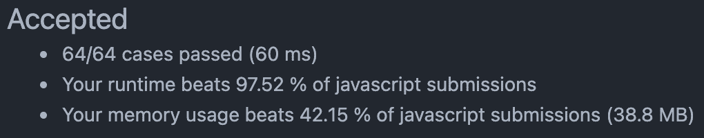
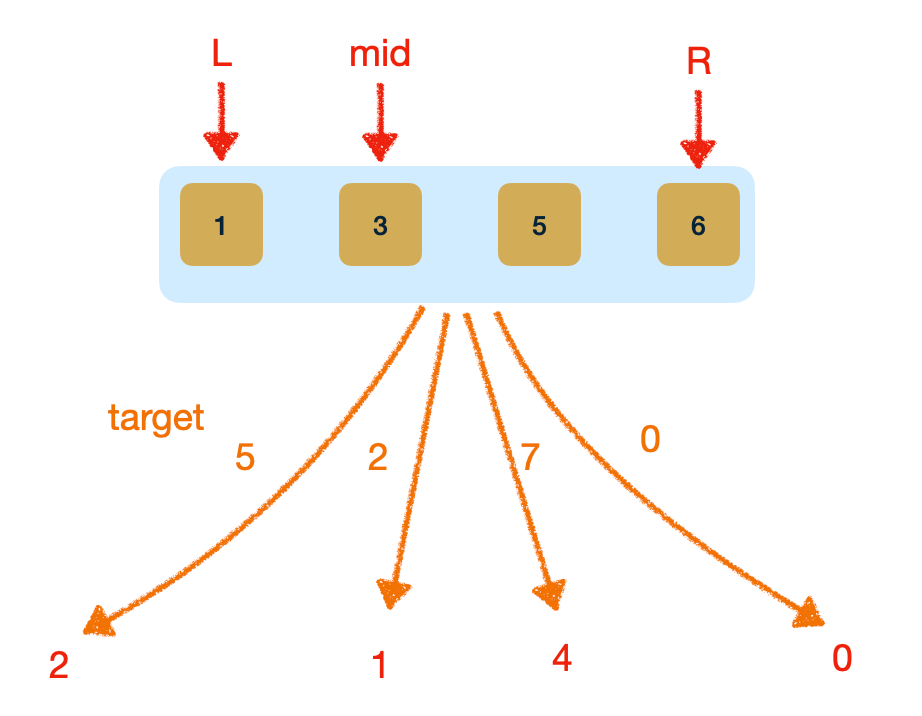
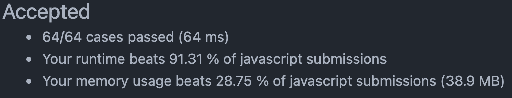
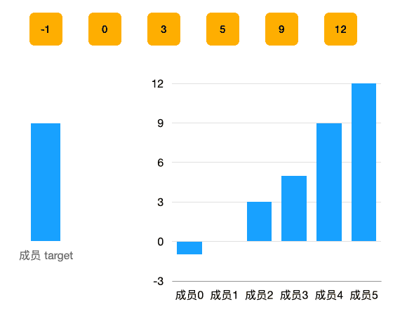

# 0035. 搜索插入位置【简单】

- [leetcode](https://leetcode.cn/problems/search-insert-position/)
- 相似：[0162]
- 相似：[0035]
- 相似：[0704]
- 相似：[0074]

## 📝 Description

给定一个排序数组和一个目标值，在数组中找到目标值，并返回其索引。如果目标值不存在于数组中，返回它将会被按顺序插入的位置。

请必须使用时间复杂度为 `O(log n)` 的算法。


**示例 1:**
```
输入: nums = [1,3,5,6], target = 5
输出: 2
```
**示例 2:**
```
输入: nums = [1,3,5,6], target = 2
输出: 1
```
**示例 3:**
```
输入: nums = [1,3,5,6], target = 7
输出: 4
```
**提示:**

- `1 <= nums.length <= 10^4`
- `-10^4 <= nums[i] <= 10^4`
- `nums` 为 **无重复元素** 的 **升序** 排列数组
- `-10^4 <= target <= 10^4`

## 💻 题解 - 二分查找

```javascript
var searchInsert = function (nums, target) {
  const len = nums.length;
  // 特殊情况处理
  if (target > nums[len - 1]) return len;
  // 二分
  let l = 0, r = len - 1, mid = (r - l >> 1) + l;
  while (l < r) {
    if (target === nums[mid]) return mid;
    else if (target > nums[mid]) l = mid + 1;
    else r = mid;
    mid = (r - l >> 1) + l;
  }
  return mid;
};
```

- 
- 
- 特殊情况
  - 当 target 比 nums 中每一个成员都大时，返回 nums.length。由于在这种情况下，插入位置并不在 [L, R] 区间内，所以要单独处理。
- 二分 - 若不是特殊情况，那么进行二分查找，不断细分区间。细分区间的逻辑：
  1. 看拿目标值 target 与当前区间 [L, R] 的中间成员 nums[mid] 比较，若相等，则直接返回 mid 即可；
  2. 若目标值 target > nums[mid]，则插入位置不可能位于左区间，包括当前 mid 所在位置也不可能是插入位置，所以将 l 赋值为 mid + 1，舍弃掉左侧区间，将查找的区间进一步细分；
  3. 若目标值 target < nums[mid]，则插入位置不可能位于右区间，但是，当前 mid 所在的位置有可能是插入位置，所以将 r 赋值为 mid，舍弃掉右侧区间，将查找的区间进一步细分；
  4. 循环以上 3 步，直到循环结束「区间不能再细分了，即 `l === r === mid`」，此时区间所指的位置，就是要找的插入位置。

## 💻 题解 - 暴力解法

```javascript
var searchInsert = function (nums, target) {
  for (let i = 0; i < nums.length; i++) {
    if (nums[i] >= target) return i;
  }
  return nums.length;
};
```

- 
- 
- 直接用 leetcode.0704 题解的图，思路完全几乎是一样的。