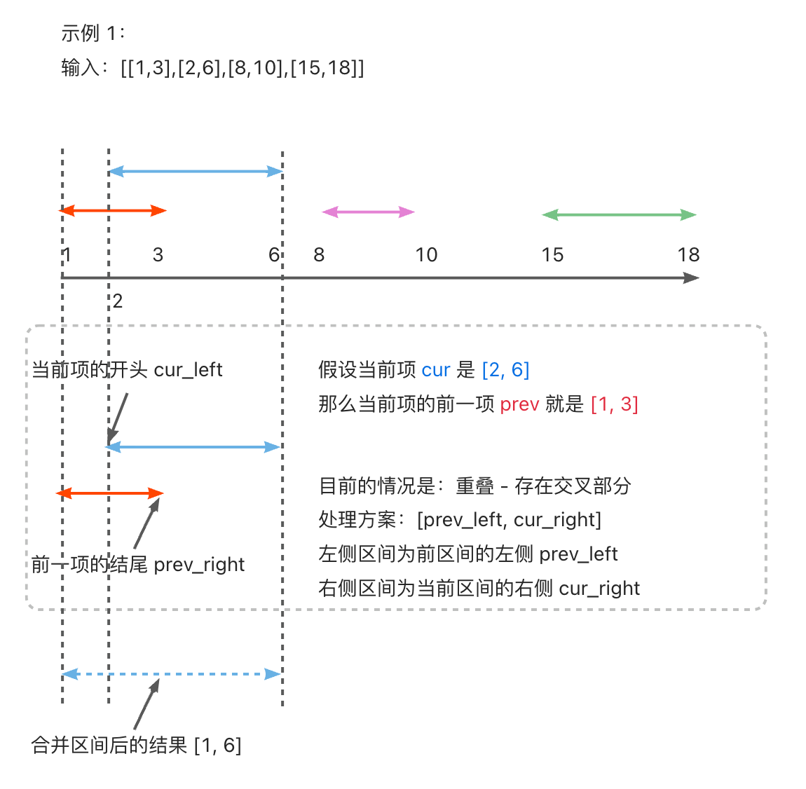

# [0056. 合并区间【中等】](https://github.com/Tdahuyou/leetcode/tree/main/0056.%20%E5%90%88%E5%B9%B6%E5%8C%BA%E9%97%B4%E3%80%90%E4%B8%AD%E7%AD%89%E3%80%91)

<!-- region:toc -->
- [1. 📝 summary](#1--summary)
- [2. 📝 Description](#2--description)
- [3. 💻 题解 - 暴力解法1](#3--题解---暴力解法1)
- [4. 💻 题解 - 暴力解法2](#4--题解---暴力解法2)
- [5. 📒 手写 reduce](#5--手写-reduce)
<!-- endregion:toc -->

## 1. 📝 summary

- [leetcode](https://leetcode.cn/problems/merge-intervals)

## 2. 📝 Description

以数组 `intervals` 表示若干个区间的集合，其中单个区间为 `intervals[i] = [starti, endi]` 。请你合并所有重叠的区间，并返回 *一个不重叠的区间数组，该数组需恰好覆盖输入中的所有区间* 。

**示例 1：**

```
输入：intervals = [[1,3],[2,6],[8,10],[15,18]]
输出：[[1,6],[8,10],[15,18]]
解释：区间 [1,3] 和 [2,6] 重叠, 将它们合并为 [1,6].
```

**示例 2：**

```
输入：intervals = [[1,4],[4,5]]
输出：[[1,5]]
解释：区间 [1,4] 和 [4,5] 可被视为重叠区间。
```

**提示：**

- `1 <= intervals.length <= 10^4`
- `intervals[i].length == 2`
- `0 <= starti <= endi <= 10^4`

## 3. 💻 题解 - 暴力解法1

```js
/**
 * 22-09-18
 * @param {number[][]} intervals
 * @return {number[][]}
 */
var merge = function (intervals) {
  // 排序
  intervals.sort((a, b) => a[0] - b[0])

  let prev_left = intervals[0][0],
    prev_right = intervals[0][1],
    i = 1

  while (i < intervals.length) {
    const [cur_left, cur_right] = intervals[i]
    if (prev_right >= cur_left) {
      if (prev_right <= cur_right) { // 重叠 - 交叉
        intervals.splice(i - 1, 2, [prev_left, cur_right])
        prev_right = cur_right
      } else { // 重叠 - 覆盖
        intervals.splice(i, 1)
      }
    } else { // 无重叠
      prev_left = cur_left
      prev_right = cur_right
      i++
    }
  }

  return intervals
}
```

- **思路：**
  - 
  1. 先对数组按照区间左侧值的大小进行升序排序。
  2. 再逐一比较 **当前项的左侧** 和 **前一项的右侧** 判断区间是否有重叠。
  3. 根据不同的情况做不同的处理：
     1. 重叠 - 存在交叉部分：`[prev_left, cur_right]`
     2. 重叠 - 当前区间覆盖前者：`[cur_left, cur_right]` 直接使用当前区间
     3. 无重叠：不处理
- **注意：**
  - 上述做法会直接修改原数据 `intervals` 的值，在遍历的过程中，`intervals` 可能也会随之变化。题目若要求不能改动 `intervals`，那么需要在实现上加上 `intervals` 的拷贝逻辑。
- **🤔 思考：下面这种写法存在什么问题？**

```js
const len = intervals.length
while (i < len) {
  // ...
}
```

- 数组的 splice 这个 API，是会修改原数组的，在执行循环体的过程中，对数组进行截取之后，数组的长度会发生变化。所以上述这种提前将数组长度存到变量中的做法是有问题的，应该在每次循环条件判断时，都去重新读数组的长度。

```js
while (i < intervals.length) {
  // ...
}
```

## 4. 💻 题解 - 暴力解法2

```js
/**
 * 22-09-19
 * @param {number[][]} intervals
 * @return {number[][]}
 */
var merge = function (intervals) {
  intervals.sort((a, b) => a[0] - b[0])

  return intervals.reduce((prev, cur_item) => {
    let prev_item = prev[prev.length - 1]
    const [cur_left, cur_right] = cur_item
    if (prev_item[1] >= cur_left) prev_item[1] = Math.max(prev_item[1], cur_right) // 有交集
    else prev.push(cur_item) // 无交集
    return prev
  }, [intervals[0]])
}
```

- 实现思路和上述的【暴力解法1】是一样的，只不过这里通过数组的 reduce API 做了些许简化。

## 5. 📒 手写 reduce

```js
Array.prototype.myReduce = function (cb, initialValue) {
  for (let i = 0; i < this.length; i++) {
    if (typeof initialValue === 'undefined') {
      initialValue = cb(this[i], this[i + 1], i + 1, this)
      i++
    } else {
      initialValue = cb(initialValue, this[i], i, this)
    }
  }
  return initialValue
}
```