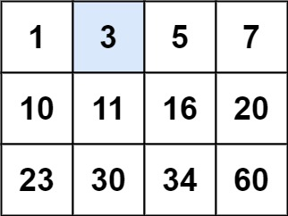

# 0074. 搜索二维矩阵【中等】

- [leetcode](https://leetcode.cn/problems/search-a-2d-matrix/)

## 📝 Description

给你一个满足下述两条属性的 `m x n` 整数矩阵：

- 每行中的整数从左到右按非严格递增顺序排列。
- 每行的第一个整数大于前一行的最后一个整数。

给你一个整数 `target` ，如果 `target` 在矩阵中，返回 `true` ；否则，返回 `false` 。

**示例 1：**



```
输入：matrix = [[1,3,5,7],[10,11,16,20],[23,30,34,60]], target = 3
输出：true
```

**示例 2：**


```
输入：matrix = [[1,3,5,7],[10,11,16,20],[23,30,34,60]], target = 13
输出：false
```

**提示：**

- `m == matrix.length`
- `n == matrix[i].length`
- `1 <= m, n <= 100`
- `-10^4 <= matrix[i][j], target <= 10^4`

## 💻 题解

```

```
