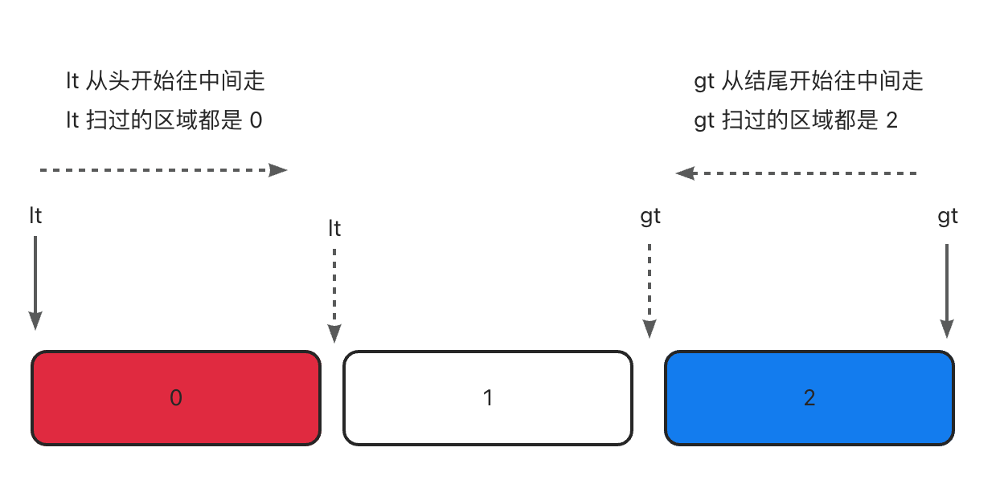

# [0075. 颜色分类【中等】](https://github.com/Tdahuyou/leetcode/tree/main/0075.%20%E9%A2%9C%E8%89%B2%E5%88%86%E7%B1%BB%E3%80%90%E4%B8%AD%E7%AD%89%E3%80%91)

<!-- region:toc -->
- [1. 📝 Description](#1--description)
- [2. 💻 sols.1 - 调用自带的 sort 函数](#2--sols1---调用自带的-sort-函数)
- [3. 💻 sols.2 - 冒泡排序](#3--sols2---冒泡排序)
- [4. 💻 sols.3 - 三路快速排序方法](#4--sols3---三路快速排序方法)
- [5. 💻 sols.4 - 基排序](#5--sols4---基排序)
<!-- endregion:toc -->
- [leetcode](https://leetcode.cn/problems/sort-colors)
- [bilibili](https://www.bilibili.com/video/BV1DivNejEb1/)
- 本质是考察升序排序。

## 1. 📝 Description

给定一个包含红色、白色和蓝色、共 `n` 个元素的数组 `nums` ，**[原地](https://baike.baidu.com/item/%E5%8E%9F%E5%9C%B0%E7%AE%97%E6%B3%95)** 对它们进行排序，使得相同颜色的元素相邻，并按照红色、白色、蓝色顺序排列。

我们使用整数 `0`、 `1` 和 `2` 分别表示红色、白色和蓝色。

必须在不使用库内置的 sort 函数的情况下解决这个问题。

**示例 1：**
```
输入：nums = [2,0,2,1,1,0]
输出：[0,0,1,1,2,2]
```

**示例 2：**
```
输入：nums = [2,0,1]
输出：[0,1,2]
```

**提示：**

- `n == nums.length`
- `1 <= n <= 300`
- `nums[i]` 为 `0`、`1` 或 `2`

**进阶：**

- 你能想出一个仅使用常数空间的一趟扫描算法吗？

## 2. 💻 sols.1 - 调用自带的 sort 函数

```js
/**
 * 22-08-29
 * @param {number[]} nums
 * @return {void} Do not return anything, modify nums in-place instead.
 */
var sortColors = function(nums) {
  nums.sort()
};
```

- 虽然题目描述中明确表示不能使用库内置的 sort 函数，但实际上在开发时，这么做效率反而可能是更好的，因为内置的 sort 排序已经帮我们做了不少的优化。
- 提交记录：
  - 

## 3. 💻 sols.2 - 冒泡排序

```js
/**
 * 22-08-29
 * @param {number[]} nums
 * @return {void} Do not return anything, modify nums in-place instead.
 */
var sortColors = function (nums) {
  const len = nums.length
  for (let i = 0; i < len - 1; i++)
    for (let j = 0; j < len - 1 - i; j++)
      if (nums[j] > nums[j + 1])
        [nums[j], nums[j + 1]] = [nums[j + 1], nums[j]]
}
```

## 4. 💻 sols.3 - 三路快速排序方法

```js
/**
 * 22-08-30
 * @param {number[]} nums
 * @return {void} Do not return anything, modify nums in-place instead.
 */
var sortColors = function (nums) {
  const len = nums.length

  let lt = -1, gt = len, i = 0

  while (i < gt) {
    if (nums[i] < 1) { // 0
      lt++
      [nums[i], nums[lt]] = [nums[lt], nums[i]]
      i++
    } else if (nums[i] > 1) { // 2
      gt--
      [nums[i], nums[gt]] = [nums[gt], nums[i]]
    } else { // 1
      i++
    }
  }
}
```

- 设置三个 `lt`, `gt`, `i` 定义：`nums[0...lt] == 0`，`nums[lt+1...i-1] = 1`，`nums[gt...n-1] == 2`，每次遍历的时候保持这个定义。
- 

## 5. 💻 sols.4 - 基排序

```js
/**
 * 22-08-30
 * @param {number[]} nums
 * @return {void} Do not return anything, modify nums in-place instead.
 */
var sortColors = function (nums) {
  // 初始化一个辅助数组 arr
  const arr = [0, 0, 0]
  for (let i = 0; i < nums.length; i++) arr[nums[i]]++
  // 依据 arr 来设置 nums
  let j = 0
  for (let i = 0; i < arr.length; i++) while ((arr[i]--) > 0) nums[j++] = i
}
```

- **思路：**
  1. 用一个辅助数组 `arr` 记录下 `nums` 中的 0，1，2 的出现次数。
  2. 根据 `arr` 来重写 `nums`


