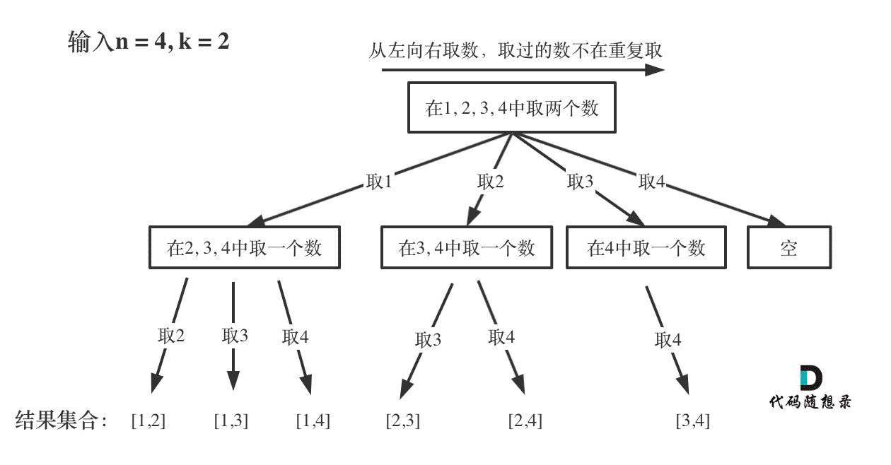

# [0077. 组合【中等】](https://github.com/Tdahuyou/leetcode/tree/main/0077.%20%E7%BB%84%E5%90%88%E3%80%90%E4%B8%AD%E7%AD%89%E3%80%91)

<!-- region:toc -->
- [1. 📝 Description](#1--description-20)
- [2. 💻 sols.1 - 回溯](#2--sols1---回溯-1)
<!-- endregion:toc -->
- [leetcode](https://leetcode.cn/problems/combinations/)
- [bilibili](https://www.bilibili.com/video/BV1DivNejEb1/)

## 1. 📝 Description

给定两个整数 `n` 和 `k`，返回范围 `[1, n]` 中所有可能的 `k` 个数的组合。

你可以按 **任何顺序** 返回答案。

**示例 1：**
```
输入：n = 4, k = 2
输出：
[
  [2,4],
  [3,4],
  [2,3],
  [1,2],
  [1,3],
  [1,4],
]
```
**示例 2：**
```
输入：n = 1, k = 1
输出：[[1]]
```
**提示：**

- `1 <= n <= 20`
- `1 <= k <= n`

## 2. 💻 sols.1 - 回溯

```javascript
var combine = function(n, k) {
  // 初始化选择列表
  const nums = [];
  for (let i = 1; i <= n; i++) {
    nums.push(i);
  }
  const ans = [];
  const backtracking = (path, startIndex) => {
    // console.log('已选', path, '选择列表', nums.slice(startIndex));
    if (path.length === k) {
      ans.push(path.slice());
      return;
    }
    for (let i = startIndex; i < nums.length; i++) {
      path.push(nums[i]); // 做选择
      // console.log('选择', nums[i]);
      backtracking(path, i + 1);
      path.pop(); // 撤销选择
      // console.log('撤销', nums[i]);
    }
  }
  backtracking([], 0);
  return ans;
};
```

- 下面是图解的流程，可结合打印结果来分析回溯的过程。
- 

```md
已选 [] 选择列表 [ 1, 2, 3, 4 ]
选择 1
已选 [ 1 ] 选择列表 [ 2, 3, 4 ]
选择 2
已选 [ 1, 2 ] 选择列表 [ 3, 4 ]
撤销 2
选择 3
已选 [ 1, 3 ] 选择列表 [ 4 ]
撤销 3
选择 4
已选 [ 1, 4 ] 选择列表 []
撤销 4
撤销 1
选择 2
已选 [ 2 ] 选择列表 [ 3, 4 ]
选择 3
已选 [ 2, 3 ] 选择列表 [ 4 ]
撤销 3
选择 4
已选 [ 2, 4 ] 选择列表 []
撤销 4
撤销 2
选择 3
已选 [ 3 ] 选择列表 [ 4 ]
选择 4
已选 [ 3, 4 ] 选择列表 []
撤销 4
撤销 3
选择 4
已选 [ 4 ] 选择列表 []
撤销 4
```

- 
- **回溯的其他写法**

```javascript
var combine = function(n, k) {
  const ans = [];
  const backtracking = (path, startIndex, endIndex) => {
    if (path.length === k) {
      ans.push([...path]);
      return;
    }
    for (let i = startIndex; i <= endIndex; i++) {
      path.push(i); // 做选择
      backtracking(path, i + 1, endIndex);
      path.pop(); // 撤销选择
    }
  }
  backtracking([], 1, n);
  return ans;
};
// 由于 n 它是一个整数，选择列表就是 1~n，其实没有必要再去初始化一个选择列表。
```

- 

```javascript
var combine = function(n, k) {
  const ans = [];
  const backtracking = (path, startIndex, endIndex) => {
    if (path.length + (endIndex - startIndex + 1) < k) return; // 剪枝优化
    if (path.length === k) {
      ans.push([...path]);
      return;
    }
    for (let i = startIndex; i <= endIndex; i++) {
      path.push(i); // 做选择
      backtracking(path, i + 1, endIndex);
      path.pop(); // 撤销选择
    }
  }
  backtracking([], 1, n);
  return ans;
};
// 剪枝优化，就是去掉没有必要遍历的分支。
// 在这个组合问题中，若已选项加可选项小于目标长度，那么就可以剪枝。
```

- 

```javascript
var combine = function(n, k) {
  const ans = [];
  const backtracking = (path, startIndex, endIndex) => {
    if (path.length + (endIndex - startIndex + 1) < k) return;
    if (path.length === k) {
      ans.push([...path]);
      return;
    }
    path.push(startIndex); // 选择
    backtracking(path, startIndex + 1, endIndex);
    path.pop(); // 撤销
    backtracking(path, startIndex + 1, endIndex);
  }
  backtracking([], 1, n);
  return ans;
};
// 结合上述的「循环」+「递归」来看，会发现每次撤销选择后，再次进入下次循环时，发生变化的仅有 startIndex，直接在撤销时，再次调用 backtracking 也同样能实现循环的效果。
```

- 

```javascript
var combine = function(n, k) {
  const ans = [];
  const backtracking = (path, startIndex, endIndex) => {
    if (path.length + (endIndex - startIndex + 1) < k) return;
    if (path.length === k) {
      ans.push(path);
      return;
    }
    backtracking([...path, startIndex], startIndex + 1, endIndex);
    backtracking([...path], startIndex + 1, endIndex);
  }
  backtracking([], 1, n);
  return ans;
};
// 写法上还可以简化为上面这种形式，将「选择」「撤销」操作合并到递归函数的参数中。
// 若采用上面这种写法，那么我们在记录结果 ans.push(path) 时，就不用再去 path.slice() 拷贝 path 了，因为每次传入的 path 都是一个全新的 path，和之前的 path 没有关系。
```

- 


