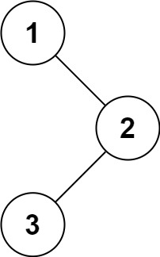
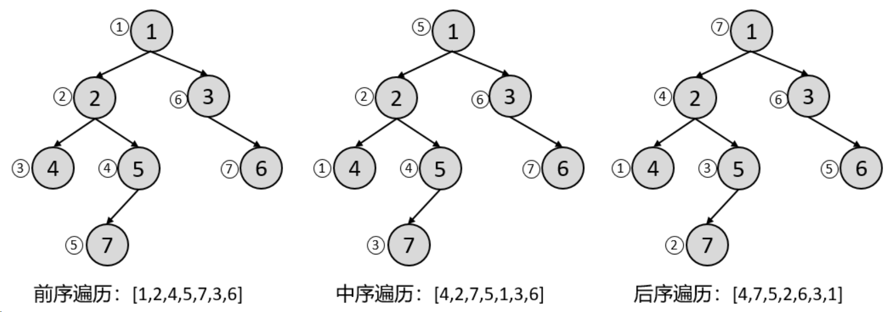

# [0094. 二叉树的中序遍历](https://github.com/Tdahuyou/leetcode/tree/main/0094.%20%E4%BA%8C%E5%8F%89%E6%A0%91%E7%9A%84%E4%B8%AD%E5%BA%8F%E9%81%8D%E5%8E%86)

- [leetcode](https://leetcode.cn/problems/binary-tree-inorder-traversal)
- [bilibili](https://www.bilibili.com/video/BV1DivNejEb1)
  - leetcode.0094.递归
- 相似：[0144. 二叉树的前序遍历【简单】](https://github.com/Tdahuyou/leetcode/tree/main/0144.%20%E4%BA%8C%E5%8F%89%E6%A0%91%E7%9A%84%E5%89%8D%E5%BA%8F%E9%81%8D%E5%8E%86%E3%80%90%E7%AE%80%E5%8D%95%E3%80%91) <!-- [locale](./0144.%20%E4%BA%8C%E5%8F%89%E6%A0%91%E7%9A%84%E5%89%8D%E5%BA%8F%E9%81%8D%E5%8E%86%E3%80%90%E7%AE%80%E5%8D%95%E3%80%91/README.md) -->
- 相似：[0145. 二叉树的后序遍历【简单】](https://github.com/Tdahuyou/leetcode/tree/main/0145.%20%E4%BA%8C%E5%8F%89%E6%A0%91%E7%9A%84%E5%90%8E%E5%BA%8F%E9%81%8D%E5%8E%86%E3%80%90%E7%AE%80%E5%8D%95%E3%80%91) <!-- [locale](./0145.%20%E4%BA%8C%E5%8F%89%E6%A0%91%E7%9A%84%E5%90%8E%E5%BA%8F%E9%81%8D%E5%8E%86%E3%80%90%E7%AE%80%E5%8D%95%E3%80%91/README.md) -->

## 🔗 links

- https://wansuanfa.com/index.php/701 - 玩算法，二叉树的 DFS 遍历。

## 📝 Description

给定一个二叉树的根节点 `root` ，返回它的 **中序** 遍历。

**示例 1：**



- 输入：root = [1,null,2,3]
- 输出：[1,3,2]

**示例 2：**

- 输入：root = []
- 输出：[]

**示例 3：**

- 输入：root = [1]
- 输出：[1]

**提示：**

- 树中节点数目在范围 `[0, 100]` 内
- `-100 <= Node.val <= 100`

**进阶:** 递归算法很简单，你可以通过迭代算法完成吗？

## 💻 题解 - 递归

```javascript
/**
 * Definition for a binary tree node.
 * function TreeNode(val, left, right) {
 *     this.val = (val===undefined ? 0 : val)
 *     this.left = (left===undefined ? null : left)
 *     this.right = (right===undefined ? null : right)
 * }
 */
/**
 * @param {TreeNode} root
 * @return {number[]}
 */
var inorderTraversal = function(root, res = []) {
  if (!root) return res
  inorderTraversal(root.left, res)
  res.push(root.val)
  inorderTraversal(root.right, res)
  return res
}
```


## 📝 笔记 - 二叉树的遍历

- 前序遍历（先根次序遍历）：**根节点** -> 左子树 -> 右子树
- 中序遍历（中根次序遍历）：左子树 -> **根节点** -> 右子树
- 后序遍历（后根次序遍历）：左子树 -> 右子树 -> **根节点**



> 图片来源：https://wansuanfa.com/index.php/701