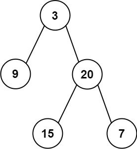

# 0106. 从中序与后序遍历序列构造二叉树

- 原题：https://leetcode.cn/problems/construct-binary-tree-from-inorder-and-postorder-traversal
- 难度：中等
- 标签：树、数组、哈希表、分治、二叉树
- 相似题目：105. 从前序与中序遍历序列构造二叉树

## 📝 题目描述

给定两个整数数组 `inorder` 和 `postorder` ，其中 `inorder` 是二叉树的中序遍历， `postorder` 是同一棵树的后序遍历，请你构造并返回这颗 _二叉树_ 。

**示例 1:**



- 输入：inorder = [9,3,15,20,7], postorder = [9,15,7,20,3]
- 输出：[3,9,20,null,null,15,7]

**示例 2:**

- 输入：inorder = [-1], postorder = [-1]
- 输出：[-1]

**提示:**

- `1 <= inorder.length <= 3000`
- `postorder.length == inorder.length`
- `-3000 <= inorder[i], postorder[i] <= 3000`
- `inorder` 和 `postorder` 都由 **不同** 的值组成
- `postorder` 中每一个值都在 `inorder` 中
- `inorder` **保证**是树的中序遍历
- `postorder` **保证**是树的后序遍历

## 💻 题解

```javascript
/**
 * Definition for a binary tree node.
 * function TreeNode(val, left, right) {
 *     this.val = (val===undefined ? 0 : val)
 *     this.left = (left===undefined ? null : left)
 *     this.right = (right===undefined ? null : right)
 * }
 */
/**
 * @param {number[]} inorder
 * @param {number[]} postorder
 * @return {TreeNode}
 */
var buildTree = function(inorder, postorder) {
  if (inorder.length === 0 || postorder.length === 0) return null

  const rootVal = postorder[postorder.length - 1]
  const root = new TreeNode(rootVal)
  const idx = inorder.indexOf(rootVal)

  root.left = buildTree(inorder.slice(0, idx), postorder.slice(0, idx))
  root.right = buildTree(inorder.slice(idx + 1), postorder.slice(idx, postorder.length - 1))

  return root
}
```
