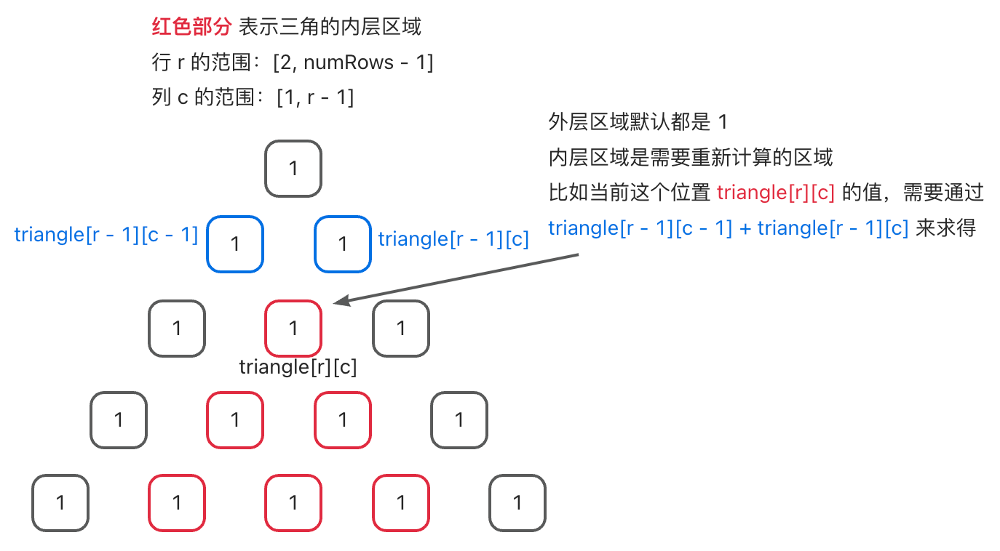

# 0118. 杨辉三角【简单】

- [leetcode](https://leetcode.cn/problems/pascals-triangle)

## 📝 Description

给定一个非负整数 *`numRows`*，生成「杨辉三角」的前 *`numRows`* 行。

在「杨辉三角」中，每个数是它左上方和右上方的数的和。


**示例 1:**
```
输入: numRows = 5
输出: [[1],[1,1],[1,2,1],[1,3,3,1],[1,4,6,4,1]]
```

**示例 2:**
```
输入: numRows = 1
输出: [[1]]
```

**提示:**

- `1 <= numRows <= 30`

## 💻 题解 - 暴力解法

```js
/**
 * @param {number} numRows
 * @return {number[][]}
 */
var generate = function (numRows) {
  if (numRows === 1) return [[1]]
  if (numRows === 2) return [[1], [1, 1]]

  // 初始化
  const triangle = []
  for (let i = 1; i <= numRows; i++) triangle.push(new Array(i).fill(1))

  // 内层求和
  for (let r = 2; r <= numRows - 1; r++)
    for (let c = 1; c <= r - 1; c++)
      triangle[r][c] = triangle[r - 1][c - 1] + triangle[r - 1][c]

  return triangle
};
```

- **解题思路：**
  - 
  - 首先初始化一个全为 `1` 的 `triangle` 三角。
  - 对内层的每个位置进行重新求和，求和的逻辑：`triangle[r][c] = triangle[r - 1][c - 1] + triangle[r - 1][c]`
