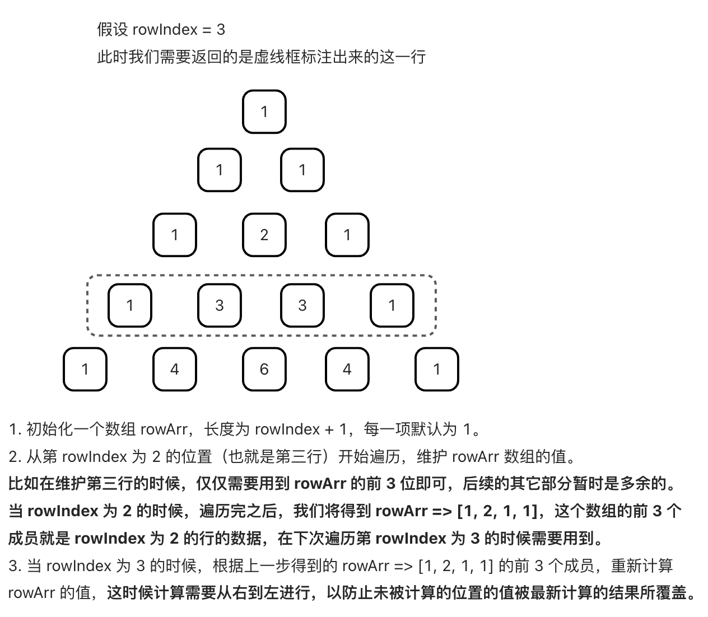

# [0119. 杨辉三角 II【简单】](https://github.com/Tdahuyou/leetcode/tree/main/0119.%20%E6%9D%A8%E8%BE%89%E4%B8%89%E8%A7%92%20II%E3%80%90%E7%AE%80%E5%8D%95%E3%80%91)

<!-- region:toc -->
- [1. 📝 Description](#1--description)
- [2. 💻 题解 - 暴力解法](#2--题解---暴力解法)
- [3. 💻 题解 - 暴力解法优化](#3--题解---暴力解法优化)
<!-- endregion:toc -->


- [leetcode](https://leetcode.cn/problems/pascals-triangle-ii)

## 1. 📝 Description

给定一个非负索引 `rowIndex`，返回「杨辉三角」的第 `rowIndex` 行。

在「杨辉三角」中，每个数是它左上方和右上方的数的和。


**示例 1:**
```
输入: rowIndex = 3
输出: [1,3,3,1]

```
**示例 2:**
```
输入: rowIndex = 0
输出: [1]

```
**示例 3:**
```
输入: rowIndex = 1
输出: [1,1]

```
**提示:**

- `0 <= rowIndex <= 33`

**进阶：**

你可以优化你的算法到 `O(rowIndex)` 空间复杂度吗？

## 2. 💻 题解 - 暴力解法

```js
/**
 * @param {number} rowIndex
 * @return {number[]}
 */
var getRow = function (rowIndex) {
  if (rowIndex === 0) return [1]
  if (rowIndex === 1) return [1, 1]

  // 初始化
  const triangle = []
  for (let i = 0; i <= rowIndex; i++) triangle.push(new Array(i + 1).fill(1))

  // 内层求和
  for (let r = 2; r <= rowIndex; r++)
    for (let c = 1; c <= r - 1; c++)
      triangle[r][c] = triangle[r - 1][c - 1] + triangle[r - 1][c]

  return triangle[rowIndex]
};
```

- 时间复杂度：O(rowIndex^2)
- 空间复杂度：O(rowIndex^2)
- 这种解法的逻辑跟 0118 几乎完全一致，可以参考 0118 的题解。

## 3. 💻 题解 - 暴力解法优化

```js
/**
 * 24-11-10
 * @param {number} rowIndex
 * @return {number[]}
 */
var getRow = function (rowIndex) {
  if (rowIndex === 0) return [1]
  if (rowIndex === 1) return [1, 1]

  const rowArr = new Array(rowIndex + 1).fill(1)

  for (let r = 2; r <= rowIndex; r++)
    for (let c = r - 1; c > 0; c--) rowArr[c] = rowArr[c] + rowArr[c - 1]

  return rowArr;
};
```

- 时间复杂度：O(rowIndex^2)
- 空间复杂度：O(rowIndex)
- **优化逻辑：**
  - **我们只需要维护当前行和上一行的数据，而不需要存储整个杨辉三角。**
  - 我们可以通过一个长度为 `rowIndex + 1` 的数组 `rowArr` 来存储当前行的数据，并在计算过程中更新这个数组。
  - 要理解优化逻辑，核心在于理解上一行的数据是如何通过 `rowArr` 数组来维护的，比如现在要取 rowIndex 为 3 位置的行（也就是第 4 行）的数据，那么 rowIndex 为 2 位置的行（也就是第 3 行）的数据是哪来的呢？
    - `for (let r = 2; r <= rowIndex; r++)` 外层循环每走一轮，将明确 rowIndex 为 r 时的行的数据，比如 r 为 2 的遍历，将得到 rowArr 为 `[1, 2, 1, 1]`，仔细观察会发现我们需要的数据已经记录在 rowArr 中了，就是前边的 1 2 1。也就是说当 r 遍历结束，将会得到一个新的 rowArr，而新的 rowArr 的前 r + 1 位，就是这一行的数据。这就说明在遍历下一行的时候，上一行的数据始终都是可以获取到的。
  - 
- **注意：**
  - **内层循环从 `c = r - 1` 到 `c = 1`，表示从右向左更新当前行的值。这样可以避免在更新过程中覆盖未计算的值。**


