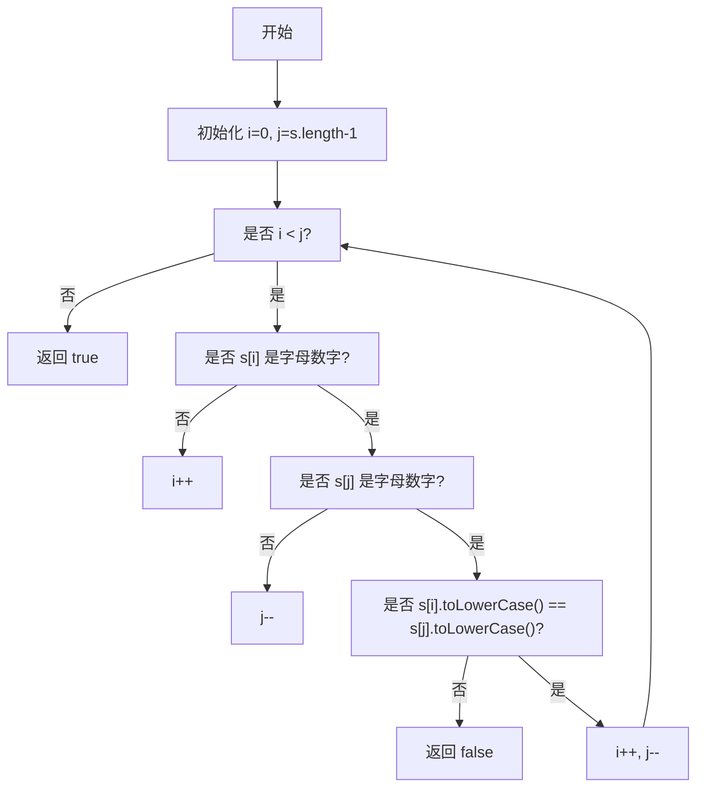
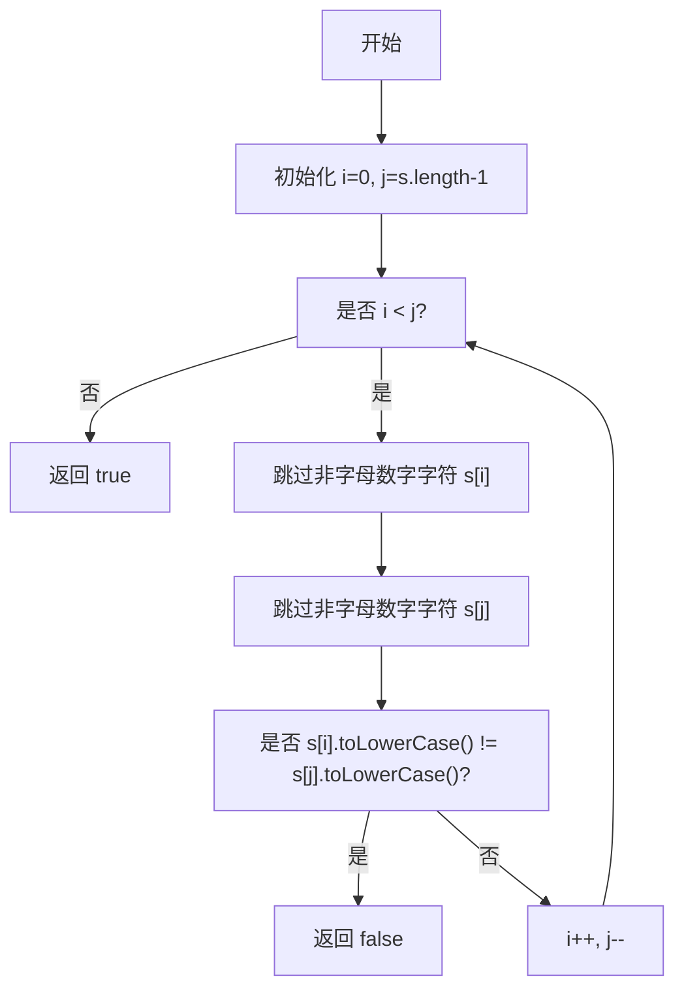

# 0125. 验证回文串【简单】

- [leetcode](https://leetcode.cn/problems/valid-palindrome)

## 📝 Description

如果在将所有大写字符转换为小写字符、并移除所有非字母数字字符之后，短语正着读和反着读都一样。则可以认为该短语是一个 **回文串** 。

字母和数字都属于字母数字字符。

给你一个字符串 `s`，如果它是 **回文串** ，返回 `true` ；否则，返回 `false` 。

**示例 1：**
```
输入: s = "A man, a plan, a canal: Panama"
输出：true
解释："amanaplanacanalpanama" 是回文串。
```

**示例 2：**
```
输入：s = "race a car"
输出：false
解释："raceacar" 不是回文串。
```

**示例 3：**
```
输入：s = " "
输出：true
解释：在移除非字母数字字符之后，s 是一个空字符串 "" 。
由于空字符串正着反着读都一样，所以是回文串。
```

**提示：**

- `1 <= s.length <= 2 * 10^5`
- `s` 仅由可打印的 ASCII 字符组成

## 💻 题解 - 暴力解法

```js
var isPalindrome = function (s) {
  // 1. 将所有字母统一转为小写
  // 2. 替换掉所有非法字符：空白字符、非字母字符、非数字字符
  // 3. 字符串逆置
  // 4. 返回比较原字符串和逆置后的字符串的结果
  s = s.toLowerCase().replace(/[^a-z0-9]|\s/g, '')
  return s === [...s].reverse().join("")
}
```

1. 将所有字母统一转为小写 `s.toLowerCase()`
2. 替换掉所有非法字符：空白字符、非字母字符、非数字字符 `s.toLowerCase().replace(/[^a-z0-9]|\s/g, '')`
3. 字符串逆置 `[...s].reverse().join("")`
4. 返回比较原字符串和逆置后的字符串的结果 `return s === [...s].reverse().join("")`

## 💻 题解 - 双指针

```js
/**
 * @param {string} s
 * @return {boolean}
 */
var isPalindrome = function (s) {
  let i = 0;
  let j = s.length - 1;
  while (i < j) {
    if (!/[a-zA-Z0-9]/.test(s[i])) {
      ++i;
    } else if (!/[a-zA-Z0-9]/.test(s[j])) {
      --j;
    } else if (s[i].toLowerCase() !== s[j].toLowerCase()) {
      return false;
    } else {
      ++i;
      --j;
    }
  }
  return true;
};
```

- 实现流程：



```js
/**
 * @param {string} s
 * @return {boolean}
 */
var isPalindrome = function (s) {
  let i = 0;
  let j = s.length - 1;

  while (i < j) {
    // 跳过非字母数字字符
    while (i < j && !isAlphanumeric(s[i])) i++;
    while (i < j && !isAlphanumeric(s[j])) j--;

    // 比较字符
    if (s[i].toLowerCase() !== s[j].toLowerCase()) {
      return false;
    }

    // 移动指针
    i++;
    j--;
  }

  return true;
};

// 辅助函数，判断字符是否为字母或数字
function isAlphanumeric(char) {
  return /[a-zA-Z0-9]/.test(char);
}
```

- 实现流程：



