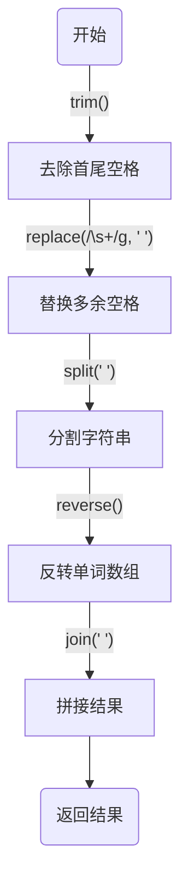
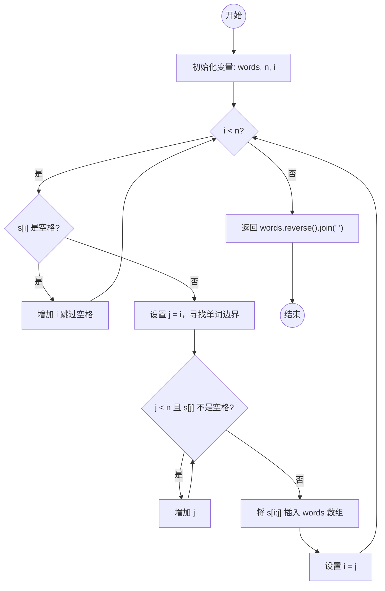

# 0151. 反转字符串中的单词【中等】

- [leetcode](https://leetcode.cn/problems/reverse-words-in-a-string)
- ⏰ TODO
  - 录制视频 - 暴力解法 - 双指针

## 📝 Description

给你一个字符串 `s` ，请你反转字符串中 **单词** 的顺序。

**单词** 是由非空格字符组成的字符串。`s` 中使用至少一个空格将字符串中的 **单词** 分隔开。

返回 **单词** 顺序颠倒且 **单词** 之间用单个空格连接的结果字符串。

**注意：** 输入字符串 `s`中可能会存在前导空格、尾随空格或者单词间的多个空格。返回的结果字符串中，单词间应当仅用单个空格分隔，且不包含任何额外的空格。

**示例 1：**
```
输入：s = "the sky is blue"
输出："blue is sky the"
```

**示例 2：**
```
输入：s = "  hello world  "
输出："world hello"
解释：反转后的字符串中不能存在前导空格和尾随空格。
```

**示例 3：**
```
输入：s = "a good   example"
输出："example good a"
解释：如果两个单词间有多余的空格，反转后的字符串需要将单词间的空格减少到仅有一个。  
```

**提示：**

- `1 <= s.length <= 10^4`
- `s` 包含英文大小写字母、数字和空格 `' '`
- `s` 中 **至少存在一个** 单词

**进阶：** 如果字符串在你使用的编程语言中是一种可变数据类型，请尝试使用 `O(1)` 额外空间复杂度的 **原地** 解法。

## 💻 题解 - 暴力解法 - 字符串分割

```js
var reverseWords = function (s) {
  return s.trim().replace(/\s+/g, ' ').split(' ').reverse().join(' ')
}
```

**实现流程：**

1. **去除首尾空格**：使用 `trim()` 方法去除字符串 `s` 的首尾空格。
2. **替换多余空格**：使用 `replace(/\s+/g, ' ')` 方法将字符串中多余的空格替换为单个空格。
3. **分割字符串**：使用 `split(' ')` 方法将字符串按空格分割成单词数组。
4. **反转单词数组**：使用 `reverse()` 方法将单词数组反转。
5. **拼接结果**：使用 `join(' ')` 方法将反转后的单词数组拼接成最终的字符串。



## 💻 题解 - 暴力解法 - 双指针

```js
var reverseWords = function (s) {
  const words = []
  const n = s.length
  let i = 0
  while (i < n) {
    while (s[i] === ' ') i++ // 过滤掉空格
    // 找单词
    if (i < n) {
      let j = i
      while (j < n && s[j] !== ' ') j++
      words.push(s.slice(i, j)) // 将单词插入 words 数组
      i = j
    }
  }
  return words.reverse().join(' ') // 反转、拼接
}
```

- 实现流程：


