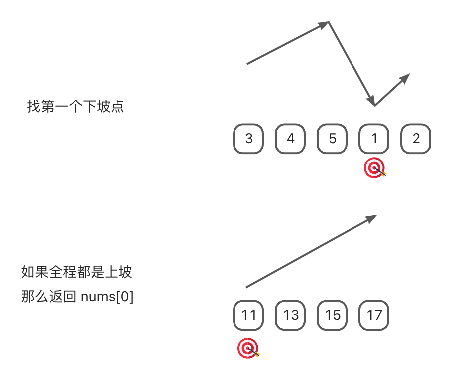
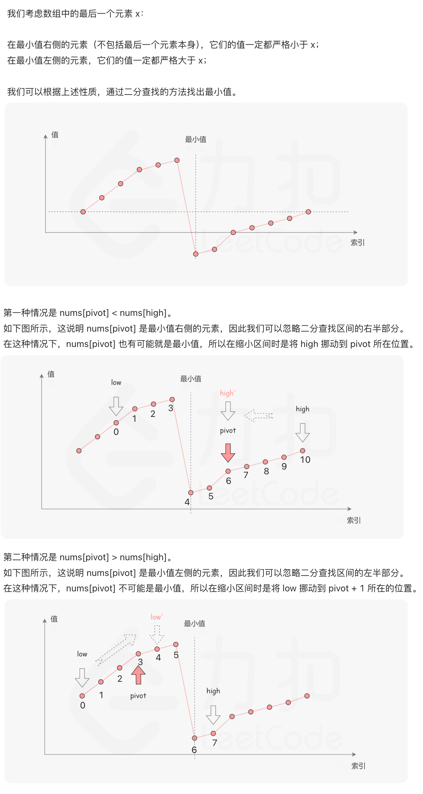

# 0153. 寻找旋转排序数组中的最小值【中等】

- [leetcode](https://leetcode.cn/problems/find-minimum-in-rotated-sorted-array)

## 🔗 links

- https://leetcode.cn/problems/find-minimum-in-rotated-sorted-array/solutions/698479/xun-zhao-xuan-zhuan-pai-xu-shu-zu-zhong-5irwp/
  - leetcode 官方题解

## 📝 Description

已知一个长度为 `n` 的数组，预先按照升序排列，经由 `1` 到 `n` 次 **旋转** 后，得到输入数组。例如，原数组 `nums = [0,1,2,4,5,6,7]` 在变化后可能得到：

- 若旋转 `4` 次，则可以得到 `[4,5,6,7,0,1,2]`
- 若旋转 `7` 次，则可以得到 `[0,1,2,4,5,6,7]`

注意，数组 `[a[0], a[1], a[2], ..., a[n-1]]` **旋转一次** 的结果为数组 `[a[n-1], a[0], a[1], a[2], ..., a[n-2]]` 。

给你一个元素值 **互不相同** 的数组 `nums` ，它原来是一个升序排列的数组，并按上述情形进行了多次旋转。请你找出并返回数组中的 **最小元素** 。

你必须设计一个时间复杂度为 `O(log n)` 的算法解决此问题。

**示例 1：**
```
输入：nums = [3,4,5,1,2]
输出：1
解释：原数组为 [1,2,3,4,5] ，旋转 3 次得到输入数组。
```

**示例 2：**
```
输入：nums = [4,5,6,7,0,1,2]
输出：0
解释：原数组为 [0,1,2,4,5,6,7] ，旋转 3 次得到输入数组。
```

**示例 3：**
```
输入：nums = [11,13,15,17]
输出：11
解释：原数组为 [11,13,15,17] ，旋转 4 次得到输入数组。  
```

**提示：**

- `n == nums.length`
- `1 <= n <= 5000`
- `-5000 <= nums[i] <= 5000`
- `nums` 中的所有整数 **互不相同**
- `nums` 原来是一个升序排序的数组，并进行了 `1` 至 `n` 次旋转

## 💻 题解 - 双指针1

```js
/**
 * 22-10-12
 * @param {number[]} nums
 * @return {number}
 */
var findMin = function(nums) {
  const len = nums.length

  if (len === 1) return nums[0]

  let slow = 0, fast = 1

  while (fast < len) {
    if (nums[slow] > nums[fast]) return nums[fast]
    // 继续走
    fast++
    slow++
  }

  return nums[0]
};
```

- 图解：
  - 

## 💻 题解 - 二分查找

```js
/**
 * 22-10-12
 * @param {number[]} nums
 * @return {number}
 */
var findMin = function(nums) {
  const n = nums.length
  if (n === 1) return nums[0]

  let low = 0, high = n - 1, pivot = low + ((high - low) >> 1)
  while (low < high) {
    if (nums[pivot] < nums[high]) high = pivot
    else low = pivot + 1
    pivot = low + ((high - low) >> 1)
  }
  
  return nums[pivot]
};
```

- 图解：
  - 
  - 注意：题目描述中提到每一个元素都是不相同的，因此在比较的时候，不可能存在相等的情况。