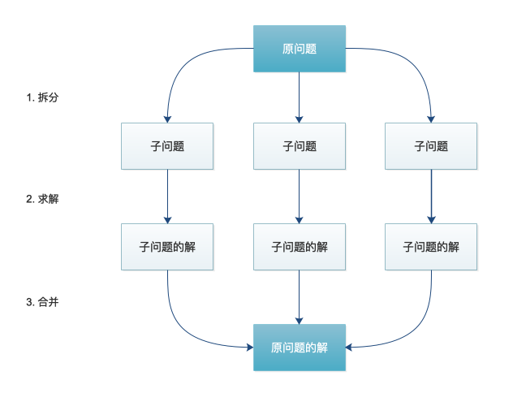
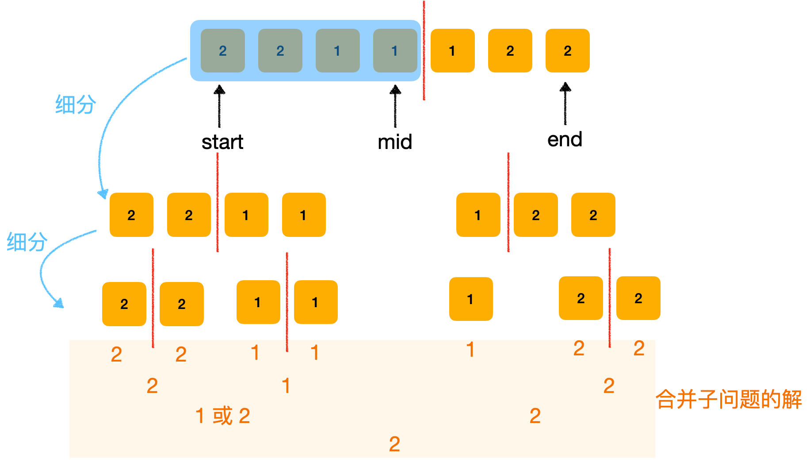

# [0169. 多数元素【简单】](https://github.com/Tdahuyou/leetcode/tree/main/0169.%20%E5%A4%9A%E6%95%B0%E5%85%83%E7%B4%A0%E3%80%90%E7%AE%80%E5%8D%95%E3%80%91)

<!-- region:toc -->
- [1. 📝 Description](#1--description)
- [2. 💻 题解 - 排序](#2--题解---排序)
- [3. 💻 题解 - hash-table](#3--题解---hash-table)
- [4. 💻 题解 - 分治](#4--题解---分治)
<!-- endregion:toc -->


- [leetcode](https://leetcode.cn/problems/majority-element/)

## 1. 📝 Description

给定一个大小为 `n` 的数组 `nums` ，返回其中的多数元素。多数元素是指在数组中出现次数 **大于** `⌊ n/2 ⌋` 的元素。

你可以假设数组是非空的，并且给定的数组总是存在多数元素。

**示例 1：**
```
输入：nums = [3,2,3]
输出：3
```
**示例 2：**
```
输入：nums = [2,2,1,1,1,2,2]
输出：2
```

**提示：**

- `n == nums.length`
- `1 <= n <= 5 * 10^4`
- `-10^9 <= nums[i] <= 10^9`

**进阶：** 尝试设计时间复杂度为 O(n)、空间复杂度为 O(1) 的算法解决此问题。

## 2. 💻 题解 - 排序

```js
var majorityElement = function(nums) {
  return nums.sort((a, b) => a - b)[Math.floor(nums.length / 2)];
};
```

## 3. 💻 题解 - hash-table

```js
var majorityElement = function(nums) {
    const len = nums.length, map = new Map()
    for (let i = 0; i < len; i++) {
      const item = nums[i]
      map.set(item, (map.get(item) || 0) + 1)
      if (map.get(item) > (len / 2)) return item
    }
}
```

## 4. 💻 题解 - 分治

```js
/**
 * @param {number[]} nums
 * @return {number}
 */
var majorityElement = function (nums) {
  // 统计数组 nums 的区间 [start, end] 中，num 出现的次数。
  const countInRange = (start, end, num) => {
    let count = 0
    for (let i = start; i <= end; i++) {
      if (nums[i] === num) count++
    }
    return count
  };

  // 获取数组 nums 的区间 [start, end] 中的众数。
  const majorityElementRec = (start, end) => {
    if (start === end) return nums[start]

    // 细分区间，找众数
    let mid = start + Math.floor((end - start) / 2)
    const l_majority = majorityElementRec(start, mid) // 左侧子区间的众数
    const r_majority = majorityElementRec(mid + 1, end) // 右侧子区间的众数
    if (l_majority === r_majority) return l_majority

    // 合并区间，找众数
    const l_count = countInRange(start, end, l_majority)
    const r_count = countInRange(start, end, r_majority)
    return l_count > r_count ? l_majority : r_majority
  };

  return majorityElementRec(0, nums.length - 1)
}
```

- 分治是什么
  - 在计算机科学中，分治法（英语：Divide and conquer）是建基于多项分支递归的一种很重要的算法范型。字面上的解释是“分而治之”，就是把一个复杂的问题分成两个或更多的相同或相似的子问题，直到最后子问题可以简单的直接求解，原问题的解即子问题的解的合并。
- 
- 
- 如果两个区间中的众数相同，那么直接返回该众数。否则，将两区间合并，在合并后的区间中计算出这两个众数出现的次数，将出现次数多的返回。
- 特殊情况：若两个子区间中的众数在合并后的区间中出现次数依旧相同，则随便返回一个，继续合并即可（此时必然还没有合并到头）。因为如果合并后的区间为 `[0, nums.length - 1]`，那么是不可能会有这种情况出现的。

