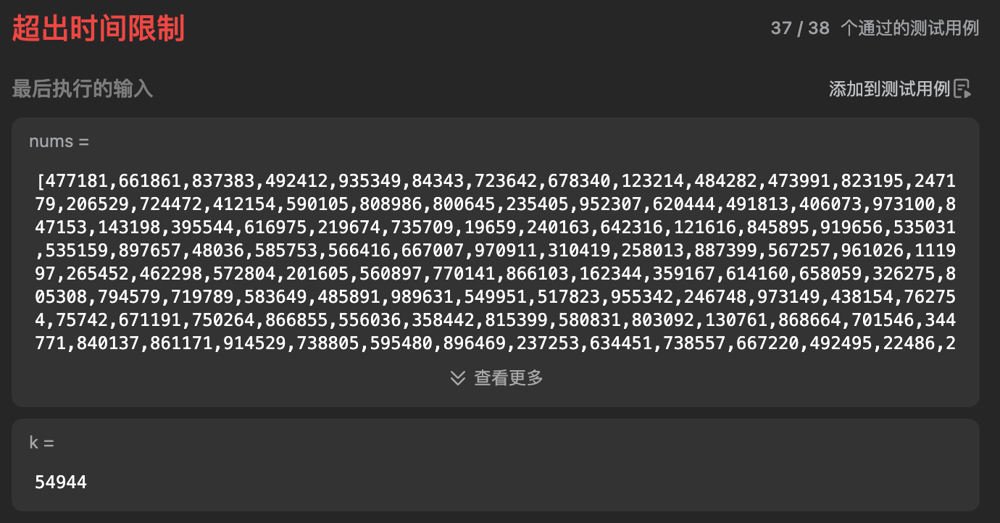

# [0189. 轮转数组【中等】](https://github.com/Tdahuyou/leetcode/tree/main/0189.%20%E8%BD%AE%E8%BD%AC%E6%95%B0%E7%BB%84%E3%80%90%E4%B8%AD%E7%AD%89%E3%80%91)

<!-- region:toc -->
- [1. 📝 Description](#1--description)
- [2. 💻 题解 - 暴力解法1 - 使用原生 API - unshift、pop](#2--题解---暴力解法1---使用原生-api---unshiftpop)
- [3. 💻 题解 - 暴力解法2](#3--题解---暴力解法2)
- [4. 💻 题解 - 暴力解法3 - 使用原生 API - splice、reverse](#4--题解---暴力解法3---使用原生-api---splicereverse)
- [5. 💻 题解 - 暴力解法4](#5--题解---暴力解法4)
- [6. 💻 题解 - 双指针](#6--题解---双指针)
<!-- endregion:toc -->
- [leetcode](https://leetcode.cn/problems/rotate-array/)
- 注意：
  - 本题的解题思路有很多，很多思路可能没问题，但是在 leetcode 提交后会提示超时。

## 1. 📝 Description

给定一个整数数组 `nums`，将数组中的元素向右轮转 `k` 个位置，其中 `k` 是非负数。

**示例 1:**
```
输入: nums = [1,2,3,4,5,6,7], k = 3
输出: [5,6,7,1,2,3,4]
解释:
向右轮转 1 步: [7,1,2,3,4,5,6]
向右轮转 2 步: [6,7,1,2,3,4,5]
向右轮转 3 步: [5,6,7,1,2,3,4]
```
**示例 2:**
```
输入：nums = [-1,-100,3,99], k = 2
输出：[3,99,-1,-100]
解释:
向右轮转 1 步: [99,-1,-100,3]
向右轮转 2 步: [3,99,-1,-100]
```

**提示：**

- `1 <= nums.length <= 10^5`
- `-2^31 <= nums[i] <= 2^31 - 1`
- `0 <= k <= 10^5`

**进阶：**

- 尽可能想出更多的解决方案，至少有 **三种** 不同的方法可以解决这个问题。
- 你可以使用空间复杂度为 `O(1)` 的 **原地** 算法解决这个问题吗？

## 2. 💻 题解 - 暴力解法1 - 使用原生 API - unshift、pop

```js
var rotate = function(nums, k) {
  while (k) {
    nums.unshift(nums.pop())
    k--
  }
}
```

- 会超时
  - 思路或许没问题，不过这么写在 leetcode 上提交后会提示运行超时。
  - 

## 3. 💻 题解 - 暴力解法2

```js
var rotate = function (nums, k) {
  const len = nums.length
  k %= len
  let last_num = nums[len - 1] // 最后一个成员
  while (k) {
    for (let i = len - 1; i > 0; i--) {
      nums[i] = nums[i - 1]
    }
    nums[0] = last_num
    last_num = nums[len - 1]
    k--
  }
}
```

- 会超时

## 4. 💻 题解 - 暴力解法3 - 使用原生 API - splice、reverse

```js
var rotate = function (nums, k) {
  k %= nums.length;
  const reverse = nums.reverse(),                   // [7, 6, 5, 4, 3, 2, 1]
   splice_part1 = reverse.splice(0, k).reverse(),   // [5, 6, 7]
   splice_part2 = reverse.reverse(),                // [1, 2, 3, 4]
   newArr = [...splice_part1, ...splice_part2]      // [5, 6, 7, 1, 2, 3, 4]
  for (let i = 0; i < newArr.length; i++) nums[i] = newArr[i]
}
```

- 实现逻辑：
  - 整体反转
  - 切片
  - 对切片再进行反转
  - 拼接
- 注意：在使用 API splice、reverse 的时候，需要注意它们都是会直接影响到原数组的。

```js
const months = ['Jan', 'March', 'April', 'June'];
months.splice(1, 0, 'Feb');
// Inserts at index 1
console.log(months);
// Expected output: Array ["Jan", "Feb", "March", "April", "June"]

months.splice(4, 1, 'May');
// Replaces 1 element at index 4
console.log(months);
// Expected output: Array ["Jan", "Feb", "March", "April", "May"]
```

## 5. 💻 题解 - 暴力解法4

```js
var rotate = function (nums, k) {
  const newArr = [], len = nums.length
  k %= len

  for (let i = len - k; i < len; i++) newArr.push(nums[i])
  // newArr => [5, 6, 7]

  for (let i = 0; i < len - k; i++) newArr.push(nums[i])
  // newArr => [5, 6, 7, 1, 2, 3, 4]

  // nums = newArr
  for (let i = 0; i < len; i++) nums[i] = newArr[i]
}
```

- 实现逻辑：
  - 切片
  - 先把后半部分装入原数组
  - 再把前半部分装入原数组

## 6. 💻 题解 - 双指针

```js
// 反转数组(left_index ~ right_index)
/* 示例：
输入：[1, 2, 3, 4] 1, 3
输出：[1, 4, 3, 2]
注解：将数组 [1, 2, 3, 4] 索引 1 到 3 的部分进行反转
 */
const reverseArr = (arr, left_index, right_index) => {
  while (left_index <= right_index) {
    let temp = arr[left_index]
    arr[left_index] = arr[right_index]
    arr[right_index] = temp
    left_index++
    right_index--
  }
  return arr;
}

var rotate = function (nums, k) {
  const len = nums.length;
  k %= len;
  reverseArr(nums, 0, len - 1) // 整体反转
  reverseArr(nums, 0, k - 1) // 前半部分反转
  reverseArr(nums, k, len - 1) // 后半部分反转
};
```

- 这解法，勉勉强强算是双指针吧，就是封装了一个 reverseArr 函数，实现原理前边的都差不多。
- 这种解法比前边的做法的性能都好。


