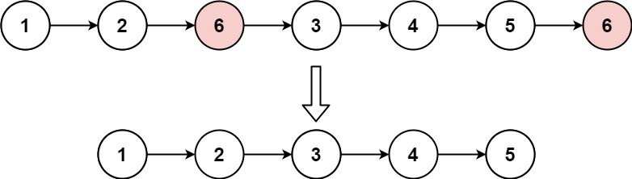

# [0203. 移除链表元素【简单】](https://github.com/Tdahuyou/leetcode/tree/main/0203.%20%E7%A7%BB%E9%99%A4%E9%93%BE%E8%A1%A8%E5%85%83%E7%B4%A0%E3%80%90%E7%AE%80%E5%8D%95%E3%80%91)

- [leetcode](https://leetcode.cn/problems/remove-linked-list-elements/)

## 📝 Description

给你一个链表的头节点 `head` 和一个整数 `val` ，请你删除链表中所有满足 `Node.val == val` 的节点，并返回 **新的头节点** 。

**示例 1：**



```
输入：head = [1,2,6,3,4,5,6], val = 6
输出：[1,2,3,4,5]
```

**示例 2：**

```
输入：head = [], val = 1
输出：[]
```

**示例 3：**

```
输入：head = [7,7,7,7], val = 7
输出：[]
```

**提示：**

- 列表中的节点数目在范围 `[0, 10^4]` 内
- `1 <= Node.val <= 50`
- `0 <= val <= 50`

## 💻 题解

```

```
