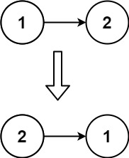

# [0206. 反转链表](https://github.com/Tdahuyou/leetcode/tree/main/0206.%20%E5%8F%8D%E8%BD%AC%E9%93%BE%E8%A1%A8)

- [leetcode|*](https://leetcode.cn/problems/reverse-linked-list)
- [bilibili](https://www.bilibili.com/video/BV1DivNejEb1)
  - leetcode.0206.递归

## 📝 Description

给你单链表的头节点 `head` ，请你反转链表，并返回反转后的链表。

**示例 1：**


- 输入：head = [1,2,3,4,5]
- 输出：[5,4,3,2,1]

**示例 2：**



- 输入：head = [1,2]
- 输出：[2,1]

**示例 3：**

- 输入：head = []
- 输出：[]

**提示：**

- 链表中节点的数目范围是 `[0, 5000]`
- `-5000 <= Node.val <= 5000`

**进阶：**链表可以选用迭代或递归方式完成反转。你能否用两种方法解决这道题？

## 💻 题解 - 递归

```javascript
/**
 * Definition for singly-linked list.
 * function ListNode(val, next) {
 *     this.val = (val===undefined ? 0 : val)
 *     this.next = (next===undefined ? null : next)
 * }
 */
/**
 * @param {ListNode} head
 * @return {ListNode}
 */
var reverseList = function(head) {
  if (head === null || head.next === null) return head

  const newHead = reverseList(head.next)

  head.next.next = head
  head.next = null

  return newHead
};
```

