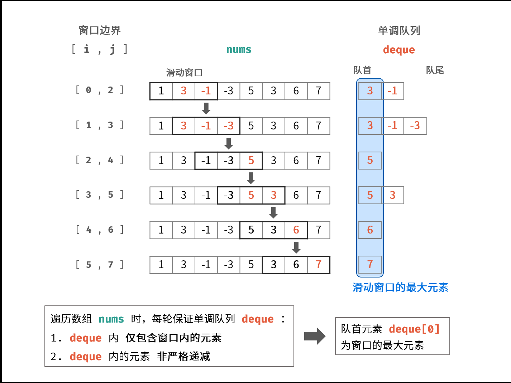

# [0239. 滑动窗口最大值【困难】](https://github.com/Tdahuyou/leetcode/tree/main/0239.%20%E6%BB%91%E5%8A%A8%E7%AA%97%E5%8F%A3%E6%9C%80%E5%A4%A7%E5%80%BC%E3%80%90%E5%9B%B0%E9%9A%BE%E3%80%91)

<!-- region:toc -->
- [1. 📝 Description](#1--description)
- [2. 💻 题解 - 1. Deque](#2--题解---1-deque)
- [3. 🤖 AI - 什么是双端队列？](#3--ai---什么是双端队列)
  - [3.1. 特性](#31-特性)
  - [3.2. 常见操作](#32-常见操作)
  - [3.3. 用途](#33-用途)
  - [3.4. 示例](#34-示例)
  - [3.5. 关键点](#35-关键点)
<!-- endregion:toc -->


- [leetcode](https://leetcode.cn/problems/sliding-window-maximum)


## 1. 📝 Description

给你一个整数数组 `nums`，有一个大小为 `k` 的滑动窗口从数组的最左侧移动到数组的最右侧。你只可以看到在滑动窗口内的 `k` 个数字。滑动窗口每次只向右移动一位。

返回 _滑动窗口中的最大值_ 。

**示例 1：**

- 输入：nums = [1,3,-1,-3,5,3,6,7], k = 3
- 输出：[3,3,5,5,6,7]
- 解释：

| 滑动窗口的位置            | 最大值 |
| ------------------------- | ------ |
| [1  3  -1] -3  5  3  6  7 | 3      |
| 1 [3  -1  -3] 5  3  6  7  | 3      |
| 1  3 [-1  -3  5] 3  6  7  | 5      |
| 1  3  -1 [-3  5  3] 6  7  | 5      |
| 1  3  -1  -3 [5  3  6] 7  | 6      |
| 1  3  -1  -3  5 [3  6  7] | 7      |

**示例 2：**

- 输入：nums = [1], k = 1
- 输出：[1]

**提示：**

- `1 <= nums.length <= 10^5`
- `-10^4 <= nums[i] <= 10^4`
- `1 <= k <= nums.length`

## 2. 💻 题解 - 1. Deque



> 图片来源：https://leetcode.cn/problems/sliding-window-maximum/solutions/2361228/239-hua-dong-chuang-kou-zui-da-zhi-dan-d-u6h0

```javascript
/**
 * @param {number[]} nums
 * @param {number} k
 * @return {number[]}
 */
var maxSlidingWindow = function(nums, k) {
  const deque = [] // 用于维护成员索引的一个双端队列
  const max = [] // 存储每个窗口的最大值

  for (let i = 0; i < nums.length; i++) {
    // 1. 把溢出窗口尺寸的成员移除
    if (deque.length > 0 && deque[0] < i - k + 1) deque.shift()

    // 2. 确保 deque 中存放的索引对应的成员是非严格递减（<）、严格递减（<=）
    while (deque.length > 0 && nums[deque[deque.length - 1]] <= nums[i]) deque.pop()

    // 3. 把当前项加入到 deque 中
    deque.push(i)

    // 4. 将 deque[0] 丢到 max 里边
    if (i >= k - 1) max.push(nums[deque[0]])
  }

  return max
};
```

- 时间复杂度：$O(n)$
- 空间复杂度：$O(n)$

---

**执行流程示例**

下面以示例 1 为例来进行分析。

**示例 1：**

- 输入：nums = [1,3,-1,-3,5,3,6,7], k = 3
- 输出：[3,3,5,5,6,7]
- 解释：

| 滑动窗口的位置            | 最大值 |
| ------------------------- | ------ |
| [1  3  -1] -3  5  3  6  7 | 3      |
| 1 [3  -1  -3] 5  3  6  7  | 3      |
| 1  3 [-1  -3  5] 3  6  7  | 5      |
| 1  3  -1 [-3  5  3] 6  7  | 5      |
| 1  3  -1  -3 [5  3  6] 7  | 6      |
| 1  3  -1  -3  5 [3  6  7] | 7      |

1. **初始化**
- `deque = []` 双端队列
- `max = []` 存放每个窗口的最大值
2. **遍历数组**
- **i = 0**：
    - 当前元素是 `1`
    - 队列为空，直接添加元素索引 `0` 到 `deque`
    - `deque = [0]`
    - 当前窗口长度小于 `k`，不记录最大值
- **i = 1**：
    - 当前元素是 `3`
    - 队列不为空，移除队列中所有小于 `3` 的元素
    - `nums[0] 结果是 1 < 3`，移除索引 `0`
    - 添加元素索引 `1` 到 `deque`
    - `deque = [1]`
    - 当前窗口长度小于 `k`，不记录最大值
- **i = 2**：
    - 当前元素是 `-1`
    - 队列不为空，没有元素小于 `-1`
    - 添加元素索引 `2` 到 `deque`
    - `deque = [1, 2]`
    - 当前窗口长度等于 `k`，记录当前窗口的最大值
    - `max = [nums[1]] = [3]`
- **i = 3**：
    - 当前元素是 `-3`
    - 队列不为空，没有元素小于 `-3`
    - 添加元素索引 `3` 到 `deque`
    - `deque = [1, 2, 3]`
    - 当前窗口长度等于 `k`，记录当前窗口的最大值
    - `max = [3, nums[1]] = [3, 3]`
- **i = 4**：
    - 当前元素是 `5`
    - 移除不在当前窗口范围内的元素
    - `deque[0] = 1`，在窗口范围内，不移除
    - 移除队列中所有小于 `5` 的元素
    - `nums[3] 结果是 -3 < 5`，移除索引 `3`
    - `nums[2] 结果是 -1 < 5`，移除索引 `2`
    - `nums[1] 结果是 3 < 5`，移除索引 `1`
    - 添加元素索引 `4` 到 `deque`
    - `deque = [4]`
    - 当前窗口长度等于 `k`，记录当前窗口的最大值
    - `max = [3, 3, nums[4]] = [3, 3, 5]`
- **i = 5**：
    - 当前元素是 `3`
    - 队列不为空，没有元素小于 `3`
    - 添加元素索引 `5` 到 `deque`
    - `deque = [4, 5]`
    - 当前窗口长度等于 `k`，记录当前窗口的最大值
    - `max = [3, 3, 5, nums[4]] = [3, 3, 5, 5]`
- **i = 6**：
    - 当前元素是 `6`
    - 移除不在当前窗口范围内的元素
    - `deque[0] = 4`，在窗口范围内，不移除
    - 移除队列中所有小于 `6` 的元素
    - `nums[5] 结果是 3 < 6`，移除索引 `5`
    - `nums[4] 结果是 5 < 6`，移除索引 `4`
    - 添加元素索引 `6` 到 `deque`
    - `deque = [6]`
    - 当前窗口长度等于 `k`，记录当前窗口的最大值
    - `max = [3, 3, 5, 5, nums[6]] = [3, 3, 5, 5, 6]`
- **i = 7**：
    - 当前元素是 `7`
    - 移除不在当前窗口范围内的元素
    - `deque[0] = 6`，在窗口范围内，不移除
    - 移除队列中所有小于 `7` 的元素
    - `nums[6] 结果是 6 < 7`，移除索引 `6`
    - 添加元素索引 `7` 到 `deque`
    - `deque = [7]`
    - 当前窗口长度等于 `k`，记录当前窗口的最大值
    - `max = [3, 3, 5, 5, 6, nums[7]] = [3, 3, 5, 5, 6, 7]`

最终返回的结果是`[3, 3, 5, 5, 6, 7]`。

## 3. 🤖 AI - 什么是双端队列？

双端队列（Deque，全称为 Double-Ended Queue）是一种线性数据结构，允许在两端进行插入和删除操作。它结合了 **栈** 和 **队列** 的特性，因此既可以高效地从两端插入和删除元素，又能像队列一样按顺序访问元素。

### 3.1. 特性
- **插入和删除操作**：可以在队首（front）和队尾（rear）进行元素的插入和删除。
- **双向操作**：允许从两端进行访问、插入和删除操作。

### 3.2. 常见操作
- `push_front(item)`：在队首插入元素。
- `push_back(item)`：在队尾插入元素。
- `pop_front()`：从队首移除元素。
- `pop_back()`：从队尾移除元素。
- `front()`：返回队首的元素。
- `back()`：返回队尾的元素。
- `is_empty()`：检查队列是否为空。
- `size()`：返回队列中的元素个数。

### 3.3. 用途
双端队列在很多算法和应用中都有广泛的使用，特别是在需要在两端进行高效插入和删除操作的场景。例如：

- 实现滑动窗口的最大值或最小值算法。
- 实现任务调度，支持在队列两端插入和处理任务。
- 实现浏览器的前进和后退功能，允许用户在访问历史记录中前后移动。

### 3.4. 示例
以下是一个使用双端队列实现滑动窗口最大值的示例：

```javascript
class Deque {
  constructor() {
    this.items = [];
  }

  push_front(item) {
    this.items.unshift(item);
  }

  push_back(item) {
    this.items.push(item);
  }

  pop_front() {
    return this.items.shift();
  }

  pop_back() {
    return this.items.pop();
  }

  front() {
    return this.items[0];
  }

  back() {
    return this.items[this.items.length - 1];
  }

  is_empty() {
    return this.items.length === 0;
  }

  size() {
    return this.items.length;
  }
}

// 使用双端队列实现滑动窗口最大值
function maxSlidingWindow(nums, k) {
  const deque = new Deque();
  const max = [];

  for (let i = 0; i < nums.length; i++) {
    // 移除不在当前窗口范围内的元素
    if (!deque.is_empty() && deque.front() < i - k + 1) {
      deque.pop_front();
    }

    // 移除队列中所有小于当前元素的元素
    while (!deque.is_empty() && nums[deque.back()] <= nums[i]) {
      deque.pop_back();
    }

    // 将当前元素添加到队列
    deque.push_back(i);

    // 当窗口长度大于等于 k 时，记录当前窗口的最大值
    if (i >= k - 1) {
      max.push(nums[deque.front()]);
    }
  }

  return max;
}

const nums = [1, 3, -1, -3, 5, 3, 6, 7];
const k = 3;
console.log(maxSlidingWindow(nums, k)); // 输出: [3, 3, 5, 5, 6, 7]
```

### 3.5. 关键点
- 使用双端队列可以高效地实现滑动窗口的最大值问题，时间复杂度为 $O(n)$。
- 双端队列能够在常数时间内完成从两端的插入和删除操作，使得一些复杂的算法能够更高效地实现。


