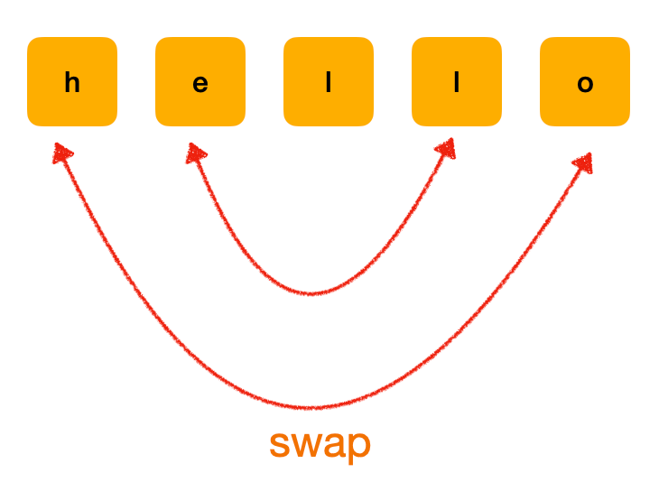

# [0344. 反转字符串【简单】](https://github.com/Tdahuyou/leetcode/tree/main/0344.%20%E5%8F%8D%E8%BD%AC%E5%AD%97%E7%AC%A6%E4%B8%B2%E3%80%90%E7%AE%80%E5%8D%95%E3%80%91)

<!-- region:toc -->
- [1. 📝 Description](#1--description)
- [2. 💻 题解.1 - 暴力解法 - 直接调用原生 API](#2--题解1---暴力解法---直接调用原生-api)
- [3. 💻 题解.2 - 双指针](#3--题解2---双指针)
- [4. 💻 题解.3 - 递归](#4--题解3---递归)
<!-- endregion:toc -->
- [leetcode](https://leetcode.cn/problems/reverse-string/)

- https://developer.mozilla.org/zh-CN/docs/Web/JavaScript/Reference/Global_Objects/Array/reverse
  - mdn - `Array.prototype.reverse()`

## 1. 📝 Description

编写一个函数，其作用是将输入的字符串反转过来。输入字符串以字符数组 `s` 的形式给出。

不要给另外的数组分配额外的空间，你必须 **[原地](https://baike.baidu.com/item/原地算法)修改输入数组**、使用 O(1) 的额外空间解决这一问题。

**示例 1：**
```
输入：s = ["h","e","l","l","o"]
输出：["o","l","l","e","h"]
```
**示例 2：**
```
输入：s = ["H","a","n","n","a","h"]
输出：["h","a","n","n","a","H"]
```
**提示：**

- `1 <= s.length <= 10^5`
- `s[i]` 都是 [ASCII](https://baike.baidu.com/item/ASCII) 码表中的可打印字符

## 2. 💻 题解.1 - 暴力解法 - 直接调用原生 API

```js
var reverseString = function (s) {
  s.reverse()
}
```

## 3. 💻 题解.2 - 双指针

```js
var reverseString = function (s) {
  let l = 0, r = s.length - 1
  while (l < r) {
    [s[l], s[r]] = [s[r], s[l]]
    l++
    r--
  }
}
```

- 

## 4. 💻 题解.3 - 递归

```js
var reverseString = function (s) {
  const convert = (l, r) => {
    if (l > r) return
    [s[l], s[r]] = [s[r], s[l]]
    convert(l + 1, r - 1)
  }
  convert(0, s.length - 1)
};
```

- 思路和双指针是相同的。


