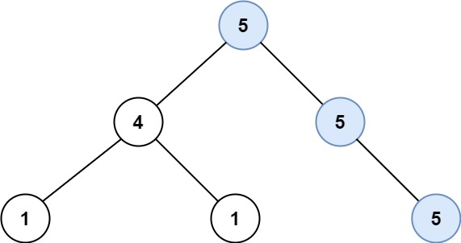
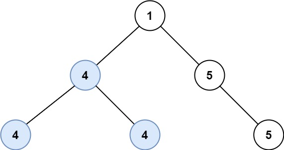

# [0687. 最长同值路径【中等】](https://github.com/Tdahuyou/leetcode/tree/main/0687.%20%E6%9C%80%E9%95%BF%E5%90%8C%E5%80%BC%E8%B7%AF%E5%BE%84%E3%80%90%E4%B8%AD%E7%AD%89%E3%80%91)

- [leetcode](https://leetcode.cn/problems/longest-univalue-path/)

## 📝 Description

给定一个二叉树的 `root` ，返回 *最长的路径的长度* ，这个路径中的 *每个节点具有相同值* 。 这条路径可以经过也可以不经过根节点。

**两个节点之间的路径长度** 由它们之间的边数表示。

**示例 1:**


```
输入：root = [5,4,5,1,1,5]
输出：2
```
**示例 2:**


```
输入：root = [1,4,5,4,4,5]
输出：2
```
**提示:**

- 树的节点数的范围是 `[0, 10^4]` 
- `-1000 <= Node.val <= 1000`
- 树的深度将不超过 `1000`

## 💻 题解

```

```
