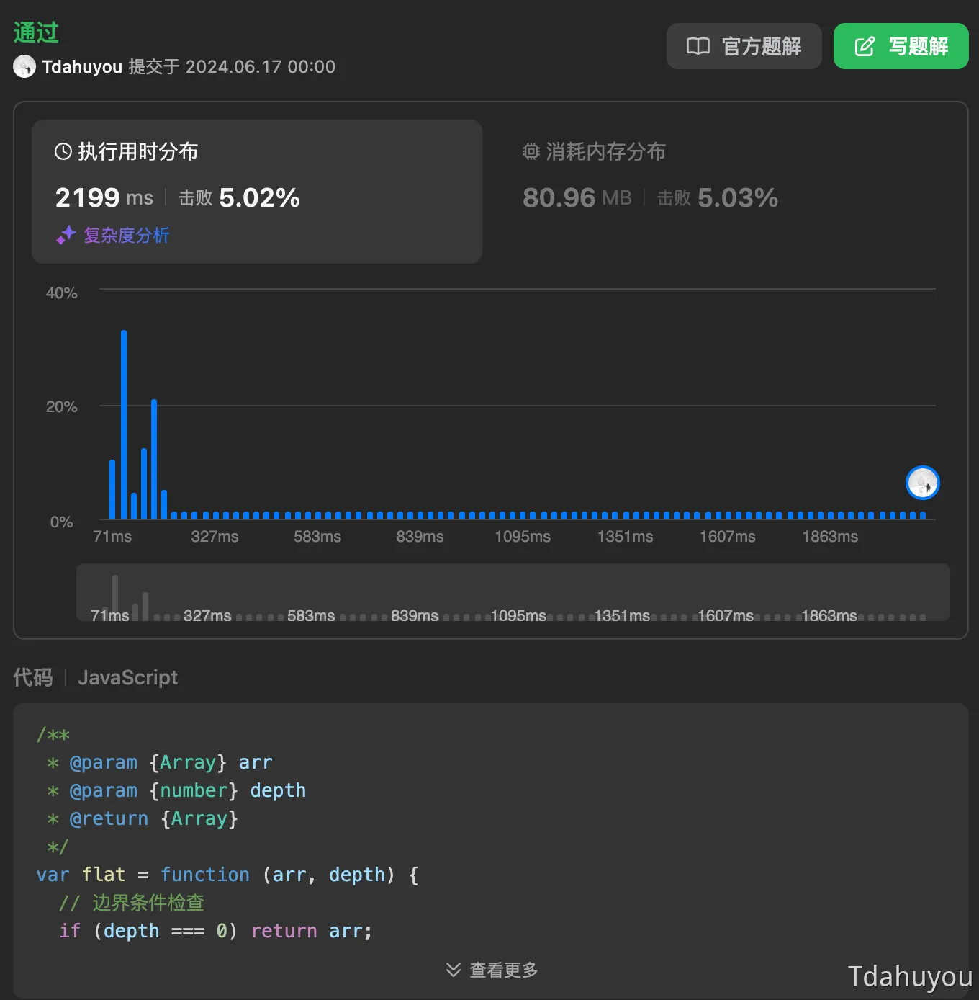
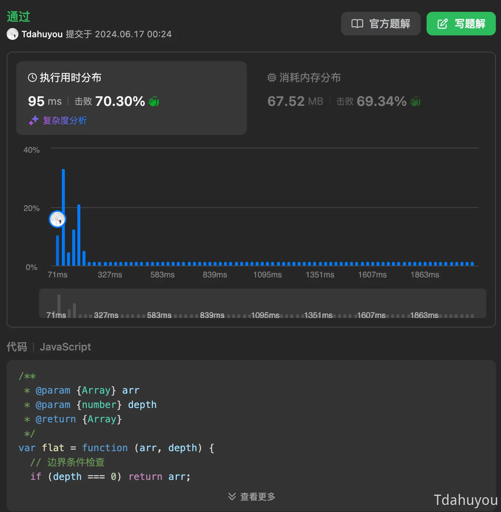

# [2625. 扁平化嵌套数组【中等】](https://github.com/Tdahuyou/leetcode/tree/main/2625.%20%E6%89%81%E5%B9%B3%E5%8C%96%E5%B5%8C%E5%A5%97%E6%95%B0%E7%BB%84%E3%80%90%E4%B8%AD%E7%AD%89%E3%80%91)

<!-- region:toc -->
- [1. 🔗 links](#1--links)
- [2. 📝 Description](#2--description)
- [3. 💻 题解.暴力解法](#3--题解暴力解法)
- [4. 💻 题解.递归](#4--题解递归)
<!-- endregion:toc -->
- [leetcode](https://leetcode.cn/problems/flatten-deeply-nested-array/description/)


## 1. 🔗 links

- https://developer.mozilla.org/en-US/docs/Web/JavaScript/Reference/Global_Objects/Array/flat
  - MDN Array.flat()

## 2. 📝 Description

请你编写一个函数，它接收一个 **多维数组** `arr` 和它的深度 `n` ，并返回该数组的 **扁平化** 后的结果。

**多维数组** 是一种包含整数或其他 **多维数组** 的递归数据结构。

数组 **扁平化** 是对数组的一种操作，定义是将原数组部分或全部子数组删除，并替换为该子数组中的实际元素。只有当嵌套的数组深度大于 `n` 时，才应该执行扁平化操作。第一层数组中元素的深度被认为是 0。

请在没有使用内置方法 `Array.flat` 的前提下解决这个问题。

**示例 1：**
```
输入
arr = [1, 2, 3, [4, 5, 6], [7, 8, [9, 10, 11], 12], [13, 14, 15]]
n = 0
输出
[1, 2, 3, [4, 5, 6], [7, 8, [9, 10, 11], 12], [13, 14, 15]]

解释
传递深度 n=0 的多维数组将始终得到原始数组。这是因为 子数组(0) 的最小可能的深度不小于 n=0 。因此，任何子数组都不应该被平面化。
```
**示例 2：**
```
输入
arr = [1, 2, 3, [4, 5, 6], [7, 8, [9, 10, 11], 12], [13, 14, 15]]
n = 1
输出
[1, 2, 3, 4, 5, 6, 7, 8, [9, 10, 11], 12, 13, 14, 15]

解释
以 4 、7 和 13 开头的子数组都被扁平化了，这是因为它们的深度为 0 ， 而 0 小于 1 。然而 [9,10,11] 其深度为 1 ，所以未被扁平化。
```
**示例 3：**
```
输入
arr = [[1, 2, 3], [4, 5, 6], [7, 8, [9, 10, 11], 12], [13, 14, 15]]
n = 2
输出
[1, 2, 3, 4, 5, 6, 7, 8, 9, 10, 11, 12, 13, 14, 15]

解释
所有子数组的最大深度都为 1 。因此，它们都被扁平化了。
```
**提示：**

-   `0 <= arr 的元素个数 <= 10^5`
-   `0 <= arr 的子数组个数 <= 10^5`
-   `maxDepth <= 1000`
-   `-1000 <= each number <= 1000`
-   `0 <= n <= 1000`

## 3. 💻 题解.暴力解法

```js
/**
 * @param {Array} arr
 * @param {number} depth
 * @return {Array}
 */
var flat = function (arr, depth) {
  if (depth === 0) return arr;

  while (depth > 0) {
    let nextArr = []

    for (let i = 0; i < arr.length; i++) {
      if (Array.isArray(arr[i])) {
        nextArr.push(...arr[i])
      } else {
        nextArr.push(arr[i])
      }
    }

    arr = nextArr
    depth--
  }

  return arr
}
```

- 每次都是从头开始找，然后新建一个临时的数组 nextArr 来存储最新展开的数据。空间方面问题不太大，时间方面的问题很明显，随着展开的层次越多，遍历的次数也将会不断递增。
- 这种解法虽然通过了，但是距离超时已经不远了，很可能再补充一些测试示例之后，这种法子就没法用了。
- 

## 4. 💻 题解.递归

```js
/**
 * @param {Array} arr
 * @param {number} depth
 * @return {Array}
 */
var flat = function (arr, depth) {
  if (depth === 0) return arr

  const result = []

  function flatten(array, currentDepth) {
    for (const item of array) {
      if (Array.isArray(item) && currentDepth > 0) {
        flatten(item, currentDepth - 1)
      } else {
        result.push(item)
      }
    }
  }

  flatten(arr, depth)
  return result
}
```

- 


