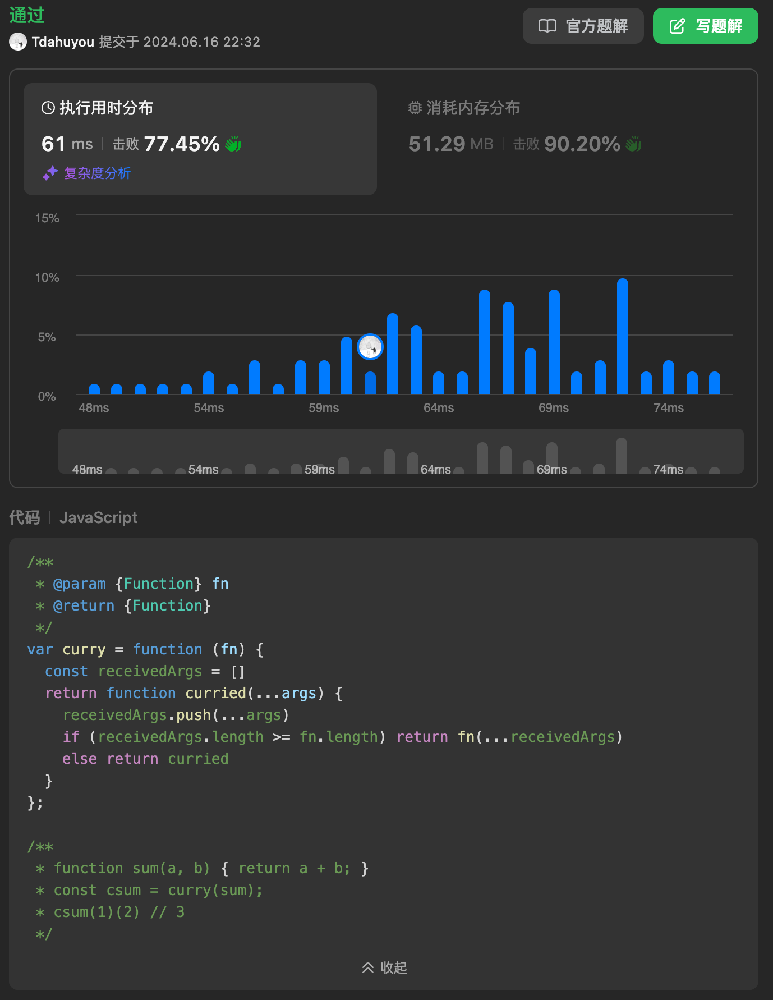
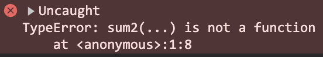

# [2632. 柯里化【中等】](https://github.com/Tdahuyou/leetcode/tree/main/2632.%20%E6%9F%AF%E9%87%8C%E5%8C%96%E3%80%90%E4%B8%AD%E7%AD%89%E3%80%91)

<!-- region:toc -->
- [1. 📝 Description](#1--description)
- [2. 📒 函数的 length 属性](#2--函数的-length-属性)
- [3. 💻 题解 - 题解1](#3--题解---题解1)
- [4. 💻 题解 - 题解2](#4--题解---题解2)
<!-- endregion:toc -->


- [leetcode](https://leetcode.cn/problems/curry)


## 1. 📝 Description

请你编写一个函数，它接收一个其他的函数，并返回该函数的 **柯里化** 后的形式。

**柯里化** 函数的定义是接受与原函数相同数量或更少数量的参数，并返回另一个 **柯里化** 后的函数或与原函数相同的值。

实际上，当你调用原函数，如 `sum(1,2,3)` 时，它将调用 **柯里化** 函数的某个形式，如 `csum(1)(2)(3)`， `csum(1)(2,3)`， `csum(1,2)(3)`，或 `csum(1,2,3)` 。所有调用 **柯里化** 函数的方法都应该返回与原始函数相同的值。

**示例 1：**

输入：
```js
fn = function sum(a, b, c) { return a + b + c; }
inputs = [[1],[2],[3]]
```

输出：`6`

解释 - 执行的代码是：

- `const curriedSum = curry(fn);`
- `curriedSum(1)(2)(3) === 6;`
- `curriedSum(1)(2)(3)` 应该返回像原函数 `sum(1, 2, 3)` 一样的值。

**示例 2：**

输入：
```js
fn = function sum(a, b, c) { return a + b + c; }
inputs = [[1,2],[3]]]
```

输出：`6`

解释：`curriedSum(1, 2)(3)` 应该返回像原函数 `sum(1, 2, 3)` 一样的值。

**示例 3：**

输入：
```js
fn = function sum(a, b, c) { return a + b + c; }
inputs = [[],[],[1,2,3]]
```

输出：`6`

解释：你应该能够以任何方式传递参数，包括一次性传递所有参数或完全不传递参数。`curriedSum()()(1, 2, 3)` 应该返回像原函数 `sum(1, 2, 3)` 一样的值。

**示例 4：**

输入：
```js
fn = function life() { return 42; }
inputs = [[]]
```

输出：`42`

解释：柯里化一个没有接收参数，没做有效操作的函数。`curriedLife() === 42`

**提示：**

- `1 <= inputs.length <= 1000`
- `0 <= inputs[i][j] <= 10^5`
- `0 <= fn.length <= 1000`
- `inputs.flat().length == fn.length`
- `函数参数需要被显式定义`
- 如果 `fn.length > 0` 则最后一个数组 `inputs` 不为空
- 如果 `fn.length === 0` 则 `inputs.length === 1`

## 2. 📒 函数的 length 属性

- 函数的形参数量可以通过函数的 length 属性来读取。
- 清空一个数组可以通过给数组的 length 属性赋值为 0 来实现。

```javascript
function testFunction(a, b, c) {
  return a + b + c;
}
console.log(testFunction.length); // 输出 3


const arr = [1, 2, 3]
arr // [1, 2, 3]
arr.length = 0
arr // []
```

## 3. 💻 题解 - 题解1

```javascript
/**
 * @param {Function} fn
 * @return {Function}
 */
var curry = function (fn) {
  const receivedArgs = []
  return function curried(...args) {
    receivedArgs.push(...args)
    if (receivedArgs.length >= fn.length) return fn(...receivedArgs)
    else return curried
  }
};

/**
 * function sum(a, b) { return a + b; }
 * const csum = curry(sum);
 * csum(1)(2) // 3
 */
```

**实现逻辑：**

通过闭包来维护一个 `receivedArgs` 变量，所有传入的参数都 push 到这个数组中，直到接收的参数数量 ≥ 函数 fn 的形参数量 `fn.length` 为止，调用 fn 函数并将结果返回。

在接收的参数数量不够的情况下，直接将 `curried` 返回，继续收集参数。

---

**分析上述程序存在的问题**

在 `2024.06.16 22:32` 这个时间点，官方提供的测试用例都是可以顺利通过的。



但是，实际上这种写法是存在一些问题的，问题就在于没有重置 `receivedArgs` 数组。可以看看以下测试用例。

```javascript
var curry = function (fn) {
  const receivedArgs = []
  return function curried(...args) {
    receivedArgs.push(...args)
    if (receivedArgs.length >= fn.length) return fn(...receivedArgs)
    else return curried
  }
}

function sum1(a, b, c, d, e) {
  return a + b + c + d + e
}

const sum2 = curry(sum1)
console.log(sum2(1)(2)(3)(4, 5)) // 15 ✅
console.log(sum2(1)(2)(3, 4, 5)) // 15 ❌
console.log(sum2(1)(2, 3, 4, 5)) // 15 ❌

// 只有第一次执行 sum2 时，才能确保正确输出。
// 后续调用 sum2 就会出问题。
```



问题在于首次调用之后，`receivedArgs` 数组中记录的上一次调用所需的参数并没有被清空，清楚问题之后，解决起来就很简单了。

```javascript
/**
 * @param {Function} fn
 * @return {Function}
 */
var curry = function (fn) {
  const receivedArgs = []
  return function curried(...args) {
    receivedArgs.push(...args)
    if (receivedArgs.length >= fn.length) {
      const res = fn(...receivedArgs) // 缓存结果
      receivedArgs.length = 0 // 清空之前调用的参数
      return res // 返回结果
    }
    else return curried
  }
}

/**
 * function sum(a, b) { return a + b; }
 * const csum = curry(sum);
 * csum(1)(2) // 3
 */
```

处理过之后，再提交试试。


## 4. 💻 题解 - 题解2

```javascript
/**
 * @param {Function} fn
 * @return {Function}
 */
var curry = function (fn, ...rest1) {
  return (...rest2) => {
    const receivedArgs = rest1.concat(rest2)
    return receivedArgs.length >= fn.length ?
      fn(...receivedArgs) :
      curry(fn, ...receivedArgs)
  }
}

/**
 * function sum(a, b) { return a + b; }
 * const csum = curry(sum);
 * csum(1)(2) // 3
 */
```

这种做法通过递归 curry 来收集剩余参数，如果参数数量不够，就返回 `curry(fn, ...receivedArgs)`。从写法上来看，这种写法显然会更加简洁一些。


