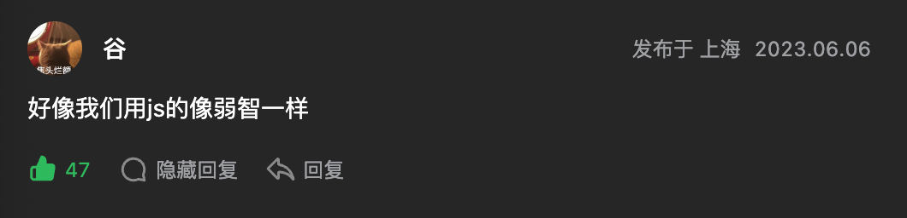

# 2703. 返回传递的参数的长度

- 原题：https://leetcode.cn/problems/return-length-of-arguments-passed
- 难度：简单
- 标签：
  - JavaScript
  - TypeScript
  - arguments

## 📝 题目描述

请你编写一个函数 `argumentsLength`，返回传递给该函数的参数数量。

**示例 1：**

- 输入：`args = [5]`
- 输出：`1`
- 解释：`argumentsLength(5); // 1`

只传递了一个值给函数，因此它应返回 `1`。

**示例 2：**

- 输入：`args = [{}, null, "3"]`
- 输出：`3`
- 解释：`argumentsLength({}, null, "3"); // 3`

传递了三个值给函数，因此它应返回 `3`。

**提示：**

- `args` 是一个有效的 JSON 数组
- `0 <= args.length <= 100`

## 💻 题解

```javascript
var argumentsLength = function(...args) {
  return args.length
}
```

- 评论区点个赞～
  - 