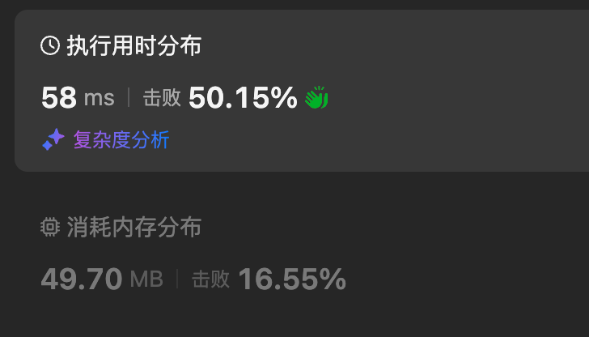
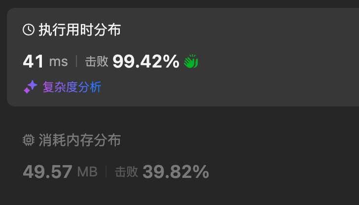

# [2727. 判断对象是否为空【简单】](https://github.com/Tdahuyou/leetcode/tree/main/2727.%20%E5%88%A4%E6%96%AD%E5%AF%B9%E8%B1%A1%E6%98%AF%E5%90%A6%E4%B8%BA%E7%A9%BA%E3%80%90%E7%AE%80%E5%8D%95%E3%80%91)

<!-- region:toc -->
- [1. 📝 Description](#1--description-100)
- [2. 💻 题解](#2--题解-43)
<!-- endregion:toc -->
- [leetcode](https://leetcode.cn/problems/is-object-empty)
- [bilibili](https://www.bilibili.com/video/BV1DivNejEb1/)

## 1. 📝 Description

给定一个对象或数组，判断它是否为空。

- 一个空对象不包含任何键值对。
- 一个空数组不包含任何元素。

你可以假设对象或数组是通过 `JSON.parse` 解析得到的。

**示例 1：**

- 输入：`obj = {"x": 5, "y": 42}`
- 输出：`false`
- 解释：这个对象有两个键值对，所以它不为空。

**示例 2：**

- 输入：`obj = {}`
- 输出：`true`
- 解释：这个对象没有任何键值对，所以它为空。

**示例 3：**

- 输入：`obj = [null, false, 0]`
- 输出：`false`
- 解释：这个数组有 `3` 个元素，所以它不为空。

**提示：**

- `obj` 是一个有效的 JSON 对象或数组
- `2 <= JSON.stringify(obj).length <= 10^5`

**你可以在 `O(1)` 时间复杂度内解决这个问题吗？**

## 2. 💻 题解

```javascript
/**
 * @param {Object|Array} obj
 * @return {boolean}
 */
var isEmpty = function(obj) {
  return Object.keys(obj).length === 0
}
```

`Object.keys(obj)` 这个操作是 `O n`

**题目描述：“你可以在 O(1) 时间复杂度内解决这个问题吗？”**

**答：不能。数组可以，对象不行。**

`if (Array.isArray(obj)) return obj.length === 0`

---

`JSON.stringify(obj) === "{}" || JSON.stringify(obj) === "[]"`、`JSON.stringify(obj).length === 2`

在 `JSON.stringify` 方法中，它需要遍历整个对象或数组以将其转换为 JSON 字符串。因此，这种写法的复杂度也是 `O n`，其中 n 是对象或数组中的元素或属性的数量。

从官方测试用例的执行结果来分析，`Object.keys` 这种解法的效果要比 `JSON.stringify` 好一些。应该是 JS 引擎内部对 `Object.keys` 等相关 API 做了优化处理，复杂度也许到不了 `O n`，且比字符串处理的效果略好。

JSON.stringify



Object.keys




