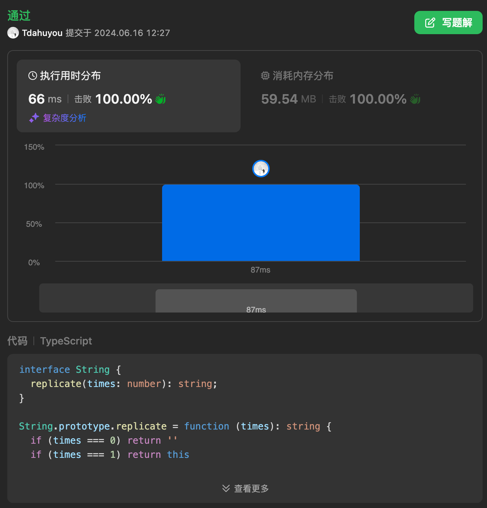

# [2796. 重复字符串（Plus）【简单】](https://github.com/Tdahuyou/leetcode/tree/main/2796.%20%E9%87%8D%E5%A4%8D%E5%AD%97%E7%AC%A6%E4%B8%B2%EF%BC%88Plus%EF%BC%89%E3%80%90%E7%AE%80%E5%8D%95%E3%80%91)

<!-- region:toc -->
- [1. 📝 Description](#1--description)
- [2. 💻 题解.1 - 循环拼接](#2--题解1---循环拼接)
- [3. 💻 题解.2 - 分治法，递归拼接](#3--题解2---分治法递归拼接)
- [4. 📒 双百提交](#4--双百提交)
<!-- endregion:toc -->
- [leetcode](https://leetcode.cn/problems/repeat-string/description/)
- [bilibili](https://www.bilibili.com/video/BV1DivNejEb1/)
- replicate 复制
- conquer `divide and conquer` 分而治之；各个击破

## 1. 📝 Description

编写代码实现字符串方法 `string.replicate(x)` ，它将返回重复的字符串 `x` 次。

请尝试在不使用内置方法 `string.repeat` 的情况下实现它。

**示例 1：**

- 输入：`str = "hello", times = 2`
- 输出：`"hellohello"`
- 解释："hello" 被重复了 2 次

**示例 2：**

- 输入：`str = "code", times = 3`
- 输出：`codecodecode"`
- 解释： "code" 被重复了 3 次

**示例 3：**

- 输入：`str = "js", times = 1`
- 输出：`"js"`
- 解释："js" 被重复了 1 次

**提示：**

- `1 <= times <= 10^5`
- `1 <= str.length <= 1000`

**进阶**：为了简化分析，让我们假设连接字符串是一个常数时间操作 `O(1)`。考虑到这个假设，您能编写时间复杂度为 `O(log n)` 的算法吗？

## 2. 💻 题解.1 - 循环拼接

```javascript
/**
 * @param {number} times
 * @return {string}
 */
String.prototype.replicate = function(times) {
  let ans = ''
  for (let i = 0; i < times; i++) {
    ans += this
  }
  return ans
}
```

- 时间复杂度： $O(n)$
- 空间复杂度： $O(m * n)$

其中 m 是原字符串的长度，n 就是 times，也就是复制的次数。

题目中提到 m 是 1（假设连接字符串是一个常数时间操作 `O(1)`），因此时间复杂度 `O(m * n)` 可以简写为 `O(n)`。

## 3. 💻 题解.2 - 分治法，递归拼接

```javascript
/**
 * @param {number} times
 * @return {string}
 */
String.prototype.replicate = function (times) {
  // 归 - base case
  if (times === 0) return ''
  if (times === 1) return this

  // 递 - divide and conquer
  let half = Math.floor(times / 2)
  let halfReplicated = this.replicate(half)

  // 合并结果
  return halfReplicated + halfReplicated + (times % 2 === 0 ? '' : this)
}
```

- 时间复杂度： $O(log(n))$
- 空间复杂度： $O(m * n)$

其中 m 是原字符串的长度，n 就是 times，也就是复制的次数。

每次递归调用将 `times` 减半，因此递归的深度为 `log(times)` 即 `log(n)`。

**算法逻辑分析：**

- **归 - base case**：当 `times` 为 0 时，返回空字符串；当 `times` 为 1 时，返回原字符串。
- **递 - divide and conquer**：将 `times` 分成两部分，递归地生成半数的字符串副本。
- **合并结果**：将两个半数的字符串副本拼接在一起，如果 `times` 是奇数，再加上原字符串。

## 4. 📒 双百提交

- 首次见到的双百的提交，记录一下……
  - https://leetcode.cn/problems/repeat-string/submissions/539803907
  - 


