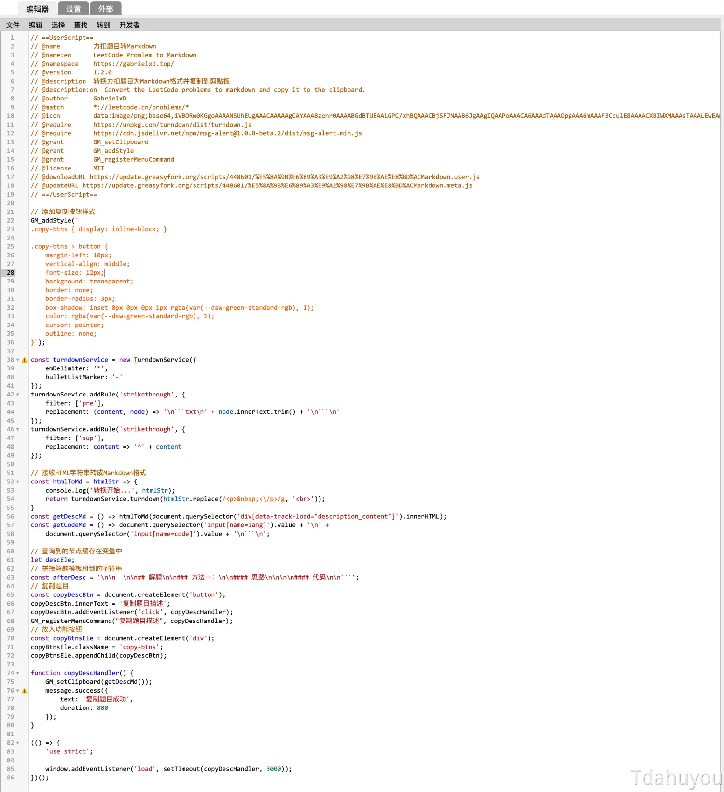
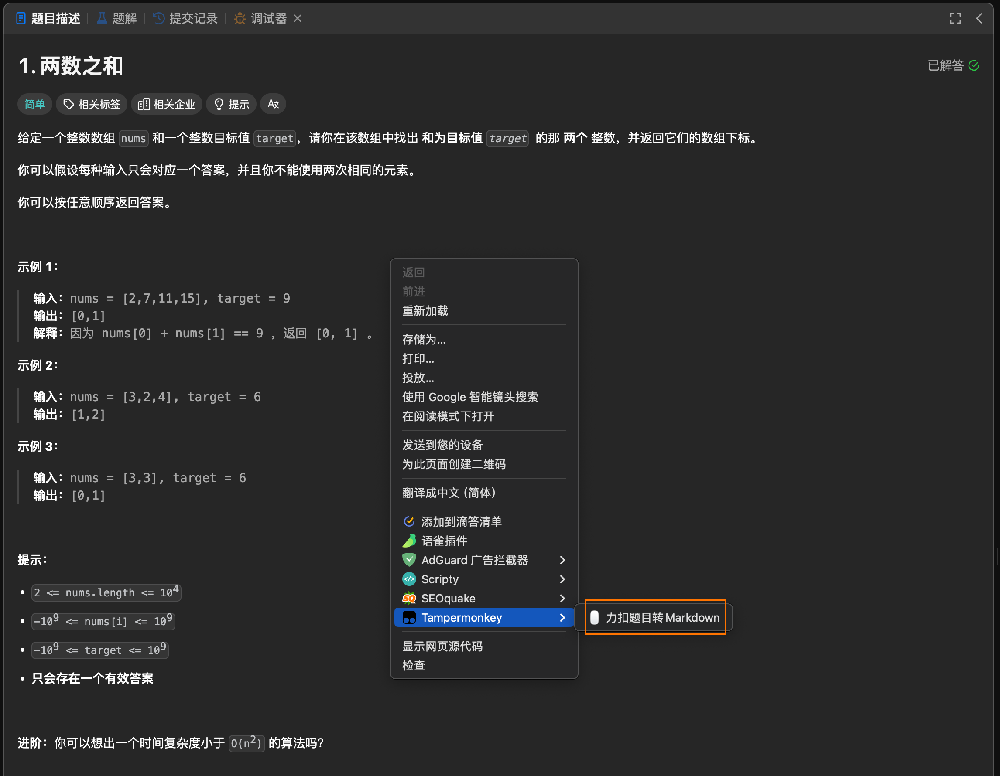

# 9999. 油猴脚本 - LeetCode 题目描述爬取

- 📝 summary
  - 该油猴脚本用于从LeetCode网站上抓取题目描述并转换成Markdown格式，方便用户复制使用。
  - 脚本通过添加一个按钮到页面上，让用户能够一键复制题目描述，并对转换后的Markdown内容进行了一定的格式优化。
  - 使用者可以在题解页面找到新增的“复制题目描述”按钮来快速获取题目信息。

## 💻 demo

- `scripts/youhou.js` 中的内容如下。

```js
/************************************************************
 * 油猴脚本 - LeetCode 题目描述爬取
 ************************************************************/
GM_addStyle(`
.copy-btns { display: inline-block; }

.copy-btns > button {
    margin-left: 10px;
    vertical-align: middle;
    font-size: 12px;
    background: transparent;
    border: none;
    border-radius: 3px;
    box-shadow: inset 0px 0px 0px 1px rgba(var(--dsw-green-standard-rgb), 1);
    color: rgba(var(--dsw-green-standard-rgb), 1);
    cursor: pointer;
    outline: none;
}`);

const turndownService = new TurndownService({
    emDelimiter: '*',
    bulletListMarker: '-'
});
turndownService.addRule('strikethrough', {
    filter: ['pre'],
    replacement: (content, node) => node.innerText.trim() + '\n'
});
turndownService.addRule('strikethrough', {
    filter: ['sup'],
    replacement: content => '^' + content
});

// 接收HTML字符串转成Markdown格式
const htmlToMd = htmlStr => {
    console.log('转换开始...', htmlStr);
    return turndownService.turndown(htmlStr.replace(/<p>&nbsp;<\/p>/g, '<br>'));
}
const getDescMd = () => htmlToMd(document.querySelector('div[data-track-load="description_content"]').innerHTML);
const getCodeMd = () => document.querySelector('input[name=lang]').value + '\n' +
    document.querySelector('input[name=code]').value + '\n```\n';

// 查询到的节点缓存在变量中
let descEle;
// 拼接解题模板用到的字符串
const afterDesc = '\n\n  \n\n## 解题\n\n### 方法一：\n\n#### 思路\n\n\n\n#### 代码\n\n```';
// 复制题目
const copyDescBtn = document.createElement('button');
copyDescBtn.innerText = '复制题目描述';
copyDescBtn.addEventListener('click', copyDescHandler);
GM_registerMenuCommand("复制题目描述", copyDescHandler);
// 放入功能按钮
const copyBtnsEle = document.createElement('div');
copyBtnsEle.className = 'copy-btns';
copyBtnsEle.appendChild(copyDescBtn);

function copyDescHandler() {
    GM_setClipboard(getDescMd());
    message.success({
        text: '复制题目成功',
        duration: 800
    });
}

(() => {
    'use strict';

    window.addEventListener('load', setTimeout(copyDescHandler, 3000));
})();
```

- 将上述脚本直接丢到油猴中，然后保存即可。
- 
- 使用方式也非常简单，只需要在对应的题解描述区域右键，然后点击【力扣题目转 Markdown】即可复制题目描述。
- 
- 下面是以第一题为例复制下来的结果。（其中还是有一些地方是需要调整的）

```md
给定一个整数数组 `nums` 和一个整数目标值 `target`，请你在该数组中找出 **和为目标值** *`target`*  的那 **两个** 整数，并返回它们的数组下标。

你可以假设每种输入只会对应一个答案，并且你不能使用两次相同的元素。

你可以按任意顺序返回答案。


**示例 1：**

输入：nums = [2,7,11,15], target = 9
输出：[0,1]
解释：因为 nums[0] + nums[1] == 9 ，返回 [0, 1] 。

**示例 2：**

输入：nums = [3,2,4], target = 6
输出：[1,2]

**示例 3：**

输入：nums = [3,3], target = 6
输出：[0,1]

**提示：**

-   `2 <= nums.length <= 10^4`
-   `-10^9 <= nums[i] <= 10^9`
-   `-10^9 <= target <= 10^9`
-   **只会存在一个有效答案**


**进阶：**你可以想出一个时间复杂度小于 `O(n^2)` 的算法吗？
```

给定一个整数数组 `nums` 和一个整数目标值 `target`，请你在该数组中找出 **和为目标值** *`target`*  的那 **两个** 整数，并返回它们的数组下标。

你可以假设每种输入只会对应一个答案，并且你不能使用两次相同的元素。

你可以按任意顺序返回答案。


**示例 1：**

输入：nums = [2,7,11,15], target = 9
输出：[0,1]
解释：因为 nums[0] + nums[1] == 9 ，返回 [0, 1] 。

**示例 2：**

输入：nums = [3,2,4], target = 6
输出：[1,2]

**示例 3：**

输入：nums = [3,3], target = 6
输出：[0,1]

**提示：**

-   `2 <= nums.length <= 10^4`
-   `-10^9 <= nums[i] <= 10^9`
-   `-10^9 <= target <= 10^9`
-   **只会存在一个有效答案**


**进阶：**你可以想出一个时间复杂度小于 `O(n^2)` 的算法吗？

- 下面是花费大概 1min 左右的时间调整之后的结果。

```md
给定一个整数数组 `nums` 和一个整数目标值 `target`，请你在该数组中找出 **和为目标值** `target`  的那 **两个** 整数，并返回它们的数组下标。

你可以假设每种输入只会对应一个答案，并且你不能使用两次相同的元素。

你可以按任意顺序返回答案。

**示例 1：**

- 输入：nums = [2,7,11,15], target = 9
- 输出：[0,1]
- 解释：因为 nums[0] + nums[1] == 9 ，返回 [0, 1] 。

**示例 2：**

- 输入：nums = [3,2,4], target = 6
- 输出：[1,2]

**示例 3：**

- 输入：nums = [3,3], target = 6
- 输出：[0,1]

**提示：**

- `2 <= nums.length <= 10^4`
- `-10^9 <= nums[i] <= 10^9`
- `-10^9 <= target <= 10^9`
- **只会存在一个有效答案**

**进阶：**你可以想出一个时间复杂度小于 `O(n^2)` 的算法吗？
```

给定一个整数数组 `nums` 和一个整数目标值 `target`，请你在该数组中找出 **和为目标值** `target`  的那 **两个** 整数，并返回它们的数组下标。

你可以假设每种输入只会对应一个答案，并且你不能使用两次相同的元素。

你可以按任意顺序返回答案。

**示例 1：**

- 输入：nums = [2,7,11,15], target = 9
- 输出：[0,1]
- 解释：因为 nums[0] + nums[1] == 9 ，返回 [0, 1] 。

**示例 2：**

- 输入：nums = [3,2,4], target = 6
- 输出：[1,2]

**示例 3：**

- 输入：nums = [3,3], target = 6
- 输出：[0,1]

**提示：**

- `2 <= nums.length <= 10^4`
- `-10^9 <= nums[i] <= 10^9`
- `-10^9 <= target <= 10^9`
- **只会存在一个有效答案**

**进阶：**你可以想出一个时间复杂度小于 `O(n^2)` 的算法吗？