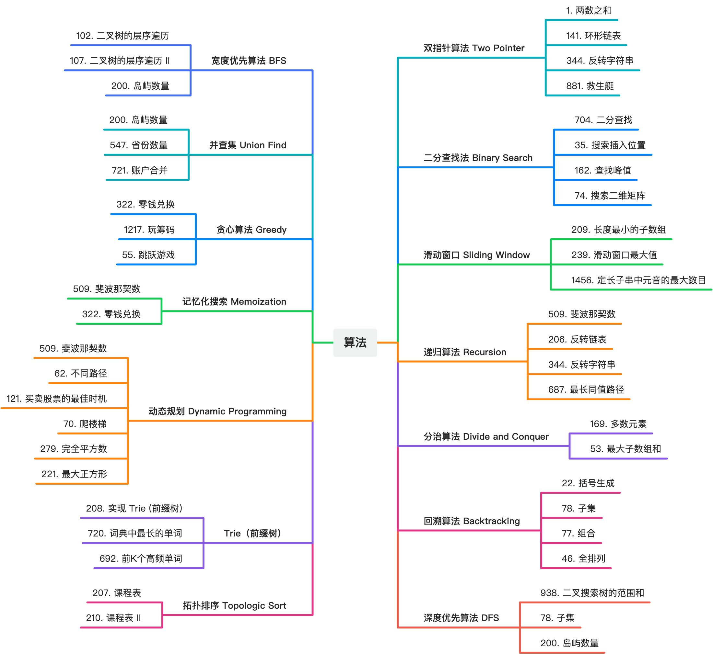

# [README.md](./0001.%20两数之和【简单】/README.md)<!-- !======> SEPERATOR <====== -->
# [0001. 两数之和【简单】](https://github.com/Tdahuyou/leetcode/tree/main/0001.%20%E4%B8%A4%E6%95%B0%E4%B9%8B%E5%92%8C%E3%80%90%E7%AE%80%E5%8D%95%E3%80%91)

<!-- region:toc -->
- [1. 📝 summary](#1--summary)
- [2. 📝 Description](#2--description)
- [3. 💻 题解 - 1. 双指针暴力求解【📺 leetcode.0001.1】](#3--题解---1-双指针暴力求解-leetcode00011)
- [4. 💻 题解 - 2. 静态哈希表【📺 leetcode.0001.2】](#4--题解---2-静态哈希表-leetcode00012)
- [5. 💻 题解 - 3. 动态哈希表【📺 leetcode.0001.3】](#5--题解---3-动态哈希表-leetcode00013)
- [6. 📒 notes](#6--notes)
<!-- endregion:toc -->
- [leetcode](https://leetcode.cn/problems/two-sum/)


## 2. 📝 Description

给定一个整数数组 `nums` 和一个整数目标值 `target`，请你在该数组中找出 **和为目标值** `target`  的那 **两个** 整数，并返回它们的数组下标。

你可以假设每种输入只会对应一个答案。但是，数组中同一个元素在答案里不能重复出现。
你可以按任意顺序返回答案。

**示例 1：**

- 输入：nums = [2,7,11,15], target = 9
- 输出：[0,1]
- 解释：因为 nums[0] + nums[1] == 9 ，返回 [0, 1] 。

**示例 2：**

- 输入：nums = [3,2,4], target = 6
- 输出：[1,2]

**示例 3：**

- 输入：nums = [3,3], target = 6
- 输出：[0,1]

**提示：**

- `2 <= nums.length <= 10^4`
- `-10^9 <= nums[i] <= 10^9`
- `-10^9 <= target <= 10^9`
- 只会存在一个有效答案

进阶：你可以想出一个时间复杂度小于 `O(n^2)` 的算法吗？

## 3. 💻 题解 - 1. 双指针暴力求解【📺 leetcode.0001.1】


```js
var twoSum = function (nums, target) {
  for (let i = 0; i < nums.length - 1; i++)
    for (let j = i + 1; j < nums.length; j++)
      if (target === nums[j] + nums[i]) return [i, j]
}
```

- 时间复杂度：`O(n^2)`
- 空间复杂度：`O(1)`

这种方法的一个缺点是，当 `n` 较大时，时间复杂度可能会变得非常高。我们可以通过使用一种叫做哈希映射的数据结构来改进这个算法，这种数据结构可以在常数时间内完成查找操作，从而将算法的时间复杂度降低到 `O(n)`。但是，这将使空间复杂度增加到 `O(n)`，因为我们需要存储 `n` 个元素的哈希映射。

## 4. 💻 题解 - 2. 静态哈希表【📺 leetcode.0001.2】


```js
var twoSum = function (nums, target) {
  // 初始化哈希表
  const map = new Map();
  for (let i = 0; i < nums.length; i++) {
    map.set(nums[i], i);
  }

  // 查询哈希表
  for (let i = 0; i < nums.length; i++) {
    const anotherNum = target - nums[i];
    if (map.has(anotherNum) && map.get(anotherNum) !== i) {
      return [i, map.get(anotherNum)];
    }
  }
}
```

- 时间复杂度：`O(n)`
- 空间复杂度：`O(n)`

【第一步】这种解法首先将数组中的每个元素及其索引添加到哈希表中

【第二步】然后在第二个循环中检查每个元素所对应的目标元素（即 `target - nums[i]`）是否存在于哈希表中

注意，该目标元素不能是 `nums[i]` 本身（即 `map.get(anotherNum) !== i`）

## 5. 💻 题解 - 3. 动态哈希表【📺 leetcode.0001.3】


```js
var twoSum = function (nums, target) {
  const map = new Map();
  for (let i = 0; i < nums.length; i++) {
    const item = nums[i];
    const anotherNum = target - item;
    if (map.has(anotherNum)) {
      return [i, map.get(anotherNum)];
    }
    map.set(item, i);
  }
};
```

- 时间复杂度：`O(n)`
- 空间复杂度：`O(n)`

每次在查的时候，都会将所有之前写入的值都查一边，不可能会存在遗漏的情况。任意俩数字组合，都只会被查一次。

## 6. 📒 notes

**对比“静态”哈希表和“动态”哈希表之间的差异**
- 静态：先把整个哈希表准备好，然后再查询。
- 动态：一边查询，一边构建哈希表。

---

**思考：在上述题解（题解 - 动态哈希表）中是“先查后写”，现在改写程序“先写后查”。比如在判断 `map.has(anotherNum)` 之前执行 `map.set(item, i)`，请问这么做会出现什么问题？**


事先明确一点，描述中提到“数组中同一个元素在答案里不能重复出现”。

思考这个问题时，不妨结合以下两个测试用例来辅助思考。

**示例 2：**

- 输入：nums = [3,2,4], target = 6
- 输出：[1,2]

**示例 3：**

- 输入：nums = [3,3], target = 6
- 输出：[0,1]

**先写再查**

```js
var twoSum = function (nums, target) {
  const map = new Map();
  for (let i = 0; i < nums.length; i++) {
    const item = nums[i];
    map.set(item, i); // 写哈希表
    const anotherNum = target - item;
    if (map.has(anotherNum)) { // 查询
      return [i, map.get(anotherNum)];
    }
  }
};

twoSum([3, 4, 2], 6) // [0, 0]
twoSum([3, 3], 6) // [0, 0]
```

两次实际返回的结果都将是 [0, 0]，因为第一个成员 3 刚被写入哈希表，立刻就被查了，所以返回了错误的结果。

每次查找，应该是去查其他成员，而非自身。如果先完成写操作，那么在查操作的时候，自身就会被查一边。

认识到问题之后，让我们来完善一下程序，加一条约束 map.get(anotherNum) !== i，防止查到的是自身是不是就 OK 了呢？

答案是依旧有问题，这种做法将会导致旧数据被覆盖。

**添加约束**

```js
var twoSum = function (nums, target) {
  const map = new Map();
  for (let i = 0; i < nums.length; i++) {
    const item = nums[i];
    map.set(item, i); // 写哈希表
    const anotherNum = target - item;
    if (map.has(anotherNum) && map.get(anotherNum) !== i) { // 查询
      return [i, map.get(anotherNum)];
    }
  }
};

twoSum([3, 2, 3], 6) // undefined
```

在哈希表中，对于重复的 key 值，后面的会覆盖前面的。第一次存入的 `3 => 0` 还没被查询，就被 `3 => 2` 给覆盖了，那你还查个 der。


# [README.md](./0003.%20无重复字符的最长子串【中等】/README.md)<!-- !======> SEPERATOR <====== -->
# [0003. 无重复字符的最长子串【中等】](https://github.com/Tdahuyou/leetcode/tree/main/0003.%20%E6%97%A0%E9%87%8D%E5%A4%8D%E5%AD%97%E7%AC%A6%E7%9A%84%E6%9C%80%E9%95%BF%E5%AD%90%E4%B8%B2%E3%80%90%E4%B8%AD%E7%AD%89%E3%80%91)

<!-- region:toc -->
- [1. 📝 summary](#1--summary)
- [2. 📝 Description](#2--description)
- [3. 💻 题解 - 1. 暴力解法](#3--题解---1-暴力解法)
- [4. 💻 题解 - 2. 滑动窗口](#4--题解---2-滑动窗口)
<!-- endregion:toc -->
- [leetcode](https://leetcode.cn/problems/longest-substring-without-repeating-characters/)


## 2. 📝 Description

给定一个字符串 `s` ，请你找出其中不含有重复字符的 **最长子串** 的长度。

> **子字符串** 是字符串中连续的 **非空** 字符序列。

**示例 1:**

- 输入: s = "abcabcbb"
- 输出: 3
- 解释: 因为无重复字符的最长子串是 `"abc"`，所以其长度为 3。

**示例 2:**

- 输入: s = "bbbbb"
- 输出: 1
- 解释: 因为无重复字符的最长子串是 `"b"`，所以其长度为 1。

**示例 3:**

- 输入: s = "pwwkew"
- 输出: 3
- 解释: 因为无重复字符的最长子串是 `"wke"`，所以其长度为 3。请注意，你的答案必须是 **子串** 的长度，`"pwke"` 是一个子序列，不是子串。

**提示：**

- `0 <= s.length <= 5 * 10^4`
- `s` 由英文字母、数字、符号和空格组成

## 3. 💻 题解 - 1. 暴力解法


```javascript
var lengthOfLongestSubstring = function (s) {
  const len = s.length, set = new Set()
  let ans = 0
  for (let i = 0; i < len; i++) { // start
    for (let j = i; j < len; j++) { // end
      if (!set.has(s[j])) {
        set.add(s[j])
        ans = ans > set.size ? ans : set.size
      } else {
        set.clear()
        break // start 右移
      }
    }
  }
  return ans
}
```

- 时间复杂度：O(n^2)
- 空间复杂度：O(n)

---

**原理简述**


`start` 表示每次扫描的开始位置，`end` 表示每次扫描的结束位置，`end` 每次出生的位置就是 `start` 所在的位置。在每次扫描的过程中，`start` 不动，`end` 不断向右偏移，`end` 已经扫过的区域都加入到 `set` 中记录起来。

- 如果 `end` 位置的字符在 `set` 中出现过，那么将 `set` 清空，开启下一次扫描。此时退出内层循环，`start` 向右偏移。
- 如果 `end` 位置的字符在 `set` 中没有出现过，那么将该字符加入 `set` 中，并记录最长子串的长度。

---

**流程分析**

1. **初始化变量**：
    - `len`：保存字符串 `s` 的长度。
    - `set`：一个用于存储字符的 `Set` 集合，用于检查子串中是否有重复字符。
    - `ans`：用于记录最长无重复字符子串的长度，初始值为 0，也是该函数最终返回的结果。
        * **为什么要初始为 0？**
        * **特殊情况：**`s = ""` 输入的 s 为空字符串，此时将不会进入循环，因此需要注意将 `ans` 的初始值设置为 `0`。
2. **双层循环遍历字符串**：
    - 外层循环 `for (let i = 0; i < len; i++)`：`i` 表示子串的起始位置。
    - 内层循环 `for (let j = i; j < len; j++)`：`j` 表示子串的结束位置，每次 `j` 扫描过的区域就是从当前 `i` 位置开始的最长子串。
3. **检查子串中的字符**：
    - 在内层循环中，检查当前字符 `s[j]` 是否已经存在于 `set` 中。
    - 如果当前字符不在 `set` 中：
        * 将字符 `s[j]` 添加到 `set` 中。
        * 更新 `ans` 的值为 `set.size` 和 `ans` 中的较大者。
    - 如果当前字符已经在 `set` 中：
        * 清空 `set`，表示需要重新开始寻找新的子串。
        * 使用 `break` 跳出内层循环，继续外层循环，以 `i+1` 为新的起始位置重新寻找子串。
4. **返回结果**：
    - 外层循环结束后，返回 `ans`，即最长无重复字符子串的长度。

---

**示例执行流程**

假设输入字符串为 `"abcabcbb"`。

1. **初始状态**：
    - `len = 8`
    - `set = new Set()`
    - `ans = 0`
2. **外层循环**（起始位置 `i` 从 0 开始）：
    - **第一轮内层循环**（起始位置 `i = 0`）：
        * `j = 0`，字符 `a` 不在 `set` 中，添加到 `set`，`set = {'a'}`，更新 `ans = 1`。
        * `j = 1`，字符 `b` 不在 `set` 中，添加到 `set`，`set = {'a', 'b'}`，更新 `ans = 2`。
        * `j = 2`，字符 `c` 不在 `set` 中，添加到 `set`，`set = {'a', 'b', 'c'}`，更新 `ans = 3`。
        * `j = 3`，字符 `a` 在 `set` 中，清空 `set`，跳出内层循环。
    - **第二轮内层循环**（起始位置 `i = 1`）：
        * `j = 1`，字符 `b` 不在 `set` 中，添加到 `set`，`set = {'b'}`，更新 `ans = 3`。
        * `j = 2`，字符 `c` 不在 `set` 中，添加到 `set`，`set = {'b', 'c'}`，更新 `ans = 3`。
        * `j = 3`，字符 `a` 不在 `set` 中，添加到 `set`，`set = {'b', 'c', 'a'}`，更新 `ans = 3`。
        * `j = 4`，字符 `b` 在 `set` 中，清空 `set`，跳出内层循环。
    - **第三轮内层循环**（起始位置 `i = 2`）：
        * 以此类推... 直到外层循环结束，将找到无重复的最长子串返回。

---

**如何改进**

- `set.clear()` 每次遇到重复字符后，集合会被清空，可能丢失之前已经统计的有效子串。
- **思考切入点：**如何让收集到的子串能够被充分利用起来，不要每次都清空，然后从 0 继续开始收集。
    - 通过使用滑动窗口和哈希集合，可以优化为线性时间复杂度 O(n)。

## 4. 💻 题解 - 2. 滑动窗口


```javascript
/**
 * @param {string} s
 * @return {number}
 */
var lengthOfLongestSubstring = function (s) {
  const set = new Set()
  let ans = 0, left = 0, right = 0

  while (right < s.length) {
    if (!set.has(s[right])) {
      set.add(s[right])
      right++
      ans = Math.max(ans, set.size)
    } else {
      set.delete(s[left])
      left++
    }
  }
  return ans
};
```

- 时间复杂度：O(n)
- 空间复杂度：O(n)

---

**原理简述**


- 收缩窗口：start 移动，start 扫过的区域，全部都从 set 集合中移除 `set.delete(...)`。
- 扩展窗口：end 移动，end 扫过的区域，全部都丢到 set 集合中 `set.add(...)`。

和上述“题解 - 暴力解法”非常类似，不同点在于 end 指针的移动不再是从 start 开始，而是基于上一次的位置开始。

**`end = -1`、`end` 的移动逻辑**

end 移动时，意味着扩展窗口。但是 end 每次移动之前，需要处理的逻辑：

1. 判断下一个位置是否还有成员，如果没有，则不移动；否则进入下一步。
2. 判断下一个位置的成员是否已经在哈希表中存在，若存在，则不移动；否则进入下一步。
3. 将下一个成员加入到哈希表中
4. 重复以上步骤

end 开始赋值为 -1，也是为了让代码更优雅，好从字符串下标 0 的位置开始判断。

**记录结果的两个时刻：**

1. 在每次收缩窗口之前
2. 在遍历完字符串的时候


# [README.md](./0005.%20最长回文子串【中等】/README.md)<!-- !======> SEPERATOR <====== -->
# [0005. 最长回文子串【中等】](https://github.com/Tdahuyou/leetcode/tree/main/0005.%20%E6%9C%80%E9%95%BF%E5%9B%9E%E6%96%87%E5%AD%90%E4%B8%B2%E3%80%90%E4%B8%AD%E7%AD%89%E3%80%91)

<!-- region:toc -->
- [1. 📝 summary](#1--summary)
- [2. 📝 Description](#2--description)
- [3. 💻 题解 - 中心扩散](#3--题解---中心扩散)
- [4. 📒 notes](#4--notes)
<!-- endregion:toc -->
- [leetcode](https://leetcode.cn/problems/longest-palindromic-substring/)

## 2. 📝 Description

给你一个字符串 `s`，找到 `s` 中最长的 **回文** **子串**。

**示例 1：**

- 输入：s = "babad"
- 输出："bab"
- 解释："aba" 同样是符合题意的答案。

**示例 2：**

- 输入：s = "cbbd"
- 输出："bb"

**提示：**

- `1 <= s.length <= 1000`
- `s` 仅由数字和英文字母组成

## 3. 💻 题解 - 中心扩散

```javascript
var longestPalindrome = function (s) {
  const len = s.length

  if (len < 2) return s

  let maxLen = 0
  let ans = [0, 1]
  // ans[0] 记录起始位置
  // ans[1] 记录长度

  for (let i = 0; i < len - 1; i++) {
    const odd = centerSpread(s, i, i)
    const even = centerSpread(s, i, i + 1)
    const max = odd[1] > even[1] ? odd : even
    if (max[1] > maxLen) {
      ans = max
      maxLen = max[1]
    }
  }

  return s.slice(ans[0], ans[0] + ans[1])
};

function centerSpread(s, l, r) {
  let len = s.length
  while (l >= 0 && r <= len - 1) {
    // 如果不相等，结束循环
    if (s[l] !== s[r]) break

    // 如果相等，则继续往两侧扩散，准备下一次判断
    l--
    r++
  }
  // 两侧各回退到上一步所在的位置（while 循环结束有两种可能：1. 有指针溢出；2. 不满足扩散条件）
  l++
  r--
  return [l, r - l + 1]
}
```

- 时间复杂度：O(n^2)
- 空间复杂度：O(1)

---

**原理简述：**

中心扩散的核心：中心有可能是指定的某个成员，也可能是两个成员之间的间隙。<u>因为回文子串的长度可以是奇数也可以是偶数，而这两种情况必须分别处理。</u>

- 当 `l` 和 `r` 指针，指向的是同一个成员时，表示从指定成员开始向两端扩散。


- 当 `l` 和 `r` 指针，指向的是相邻的两个成员时，表示从两个成员之间的间隙，向两端扩散。


- 每次扩散，指针 `l` 左移一步，指针 `r` 右移一步
- 扩散的条件是满足回文串的特点，也就是 `s[l]` 和 `s[r]` 两者相等
- 每次扩散到没法扩散时，记录下从该位置开始扩散所能扩散到的最长的回文子串

在题解中，记录结果的数据结构，采用的是一个长度为 `2` 的数组，数组的第一位存放子串的起始位置，第二位存放子串的长度。当所有位置都遍历完之后，我们就可以依据该数组，对字符串 `s` 进行截取，最终将结果返回即可。

**特殊情况：**

s 的长度是 1，直接返回 s 即可。

## 4. 📒 notes

- 回文性：如果字符串向前和向后读都相同，则它满足 **回文性**。
- 子字符串：**子字符串** 是字符串中连续的 **非空** 字符序列。


# [README.md](./0007.%20整数反转【中等】/README.md)<!-- !======> SEPERATOR <====== -->
# [0007. 整数反转【中等】](https://github.com/Tdahuyou/leetcode/tree/main/0007.%20%E6%95%B4%E6%95%B0%E5%8F%8D%E8%BD%AC%E3%80%90%E4%B8%AD%E7%AD%89%E3%80%91)

<!-- region:toc -->
- [1. 📝 summary](#1--summary)
- [2. 📝 Description](#2--description)
- [3. 💻 题解 - 暴力解法（转为字符串求解）](#3--题解---暴力解法转为字符串求解)
- [4. 💻 题解 - 数学方法](#4--题解---数学方法)
- [5. 📒 Math.trunc 的基本用法](#5--mathtrunc-的基本用法)
- [6. 🤖 markdown 书写数学公式的语法](#6--markdown-书写数学公式的语法)
  - [6.1. 内联公式](#61-内联公式)
  - [6.2. 独立行公式（块级公式）](#62-独立行公式块级公式)
  - [6.3. 常见的 LaTeX 数学符号](#63-常见的-latex-数学符号)
  - [6.4. 示例](#64-示例)
- [7. 🤖 整数位数和它的大小之间对数关系](#7--整数位数和它的大小之间对数关系)
- [8. 🤖 对比 $O(log_{10} N)$ 和 $O(log N)$](#8--对比-$o(log_{10}-n)$-和-$o(log-n)$)
<!-- endregion:toc -->
- [leetcode](https://leetcode.cn/problems/reverse-integer/)

## 2. 📝 Description

给你一个 32 位的有符号整数 `x` ，返回将 `x` 中的数字部分反转后的结果。

如果反转后整数超过 32 位的有符号整数的范围 [−2<sup>31</sup>,  2<sup>31</sup> − 1] ，就返回 0。

**假设环境不允许存储 64 位整数（有符号或无符号）。**

**示例 1：**

- 输入：x = 123
- 输出：321

**示例 2：**

- 输入：x = -123
- 输出：-321

**示例 3：**

- 输入：x = 120
- 输出：21

**示例 4：**

- 输入：x = 0
- 输出：0

**提示：**

- `-2<sup>31</sup> <= x <= 2<sup>31</sup> - 1`

## 3. 💻 题解 - 暴力解法（转为字符串求解）


```javascript
var reverse = function (x) {
  let ans
  if (x < 0) { // x 为负数
    ans = ('-' + x.toString().substring(1).split('').reverse().join('')) - 0
  } else { // x 为正数
    ans = x.toString().split('').reverse().join('') - 0
  }

  const max = (2 ** 31) - 1
  const min = -(2 ** 31)

  if (ans < min || ans > max) {
    return 0
  } else {
    return ans
  }
}
```

- 时间复杂度：O(n)
- 空间复杂度：O(n)

其中 n 是整数 x 转换为字符串后的字符数，字符串操作过程中生成了多个长度为 n 的中间结果，时间和空间消耗主要集中在这些字符串操作上。

这种转为字符串的处理方案，优点在于**易理解**，缺点在于**性能不佳**。字符串操作相对于纯数学运算会有较高的时间和空间开销，对于大数可能会影响性能。

上述做法还依赖于特定语言的字符串处理能力，**不具有普遍性**。在某些低级语言或环境中可能不适用，需要手写高级语言预设的 API（比如 `toString`、`substring`、`split` 等）的功能。

**注意：**

`x.toString().split('').reverse().join('') - 0` 这种隐式类型转换的写法，在 js 中 OK，但是在 ts 中默认是不被允许的，可以使用显示转换的写法 `Number(x.toString().split('').reverse().join(''))`

## 4. 💻 题解 - 数学方法


> 记录：
> 作图的时候，平板横屏看，感觉图的大小刚好，如果是在手机或者 PC 上预览（限制宽度的话），显然偏小了很多，需要放大来看。接下来作图的时候尽可能不要横向扩展 —— 把宽度弄得太宽，可以纵向扩展 - 让图片长一些，这样预览的效果也许会更好一些。


```javascript
var reverse = function (x) {
  const min = -Math.pow(2, 31)
  const max = Math.pow(2, 31) - 1
  let ans = 0
  while (x !== 0) {
    ans = ans * 10 + x % 10
    x = Math.trunc(x / 10)
  }
  if (ans < min || ans > max) {
    return 0
  } else {
    return ans
  }
}
```

- 时间复杂度：O(logN)

函数的核心是一个 `while` 循环，循环的次数由整数 `x` 的位数决定。假设 `x` 有 d 位，则循环执行 d 次。因此，时间复杂度为 O(d)。由于一个整数的位数与它的大小是对数关系，若 `x` 的绝对值为 `N`，则 d = log10 N，因此时间复杂度可以表示为 O(log10 N)。在大多数分析中，我们用自然对数，所以时间复杂度也可以表示为 O(log N)。

- 空间复杂度：O(1)

没有使用任何额外的数据结构（如数组或对象），所有操作都是就地进行的。因此，空间复杂度为 O(1)。

---

**原理简述：**

每一次遍历，都将 x 的最低位搬运到 ans 的最高位。

- `ans = ans * 10 + x % 10;`
- `x = Math.trunc(x / 10);`


## 5. 📒 Math.trunc 的基本用法


在 `Math.trunc` 中，`trunc` 的全称是 truncate（v. 截短，缩短 `英 /'trʌŋkeɪt/` `美 /trʌŋ'ket/`）。`Math.trunc` 方法用于截取数字的小数部分，只保留其整数部分，无论数字是正数还是负数。

```javascript
console.log(Math.trunc(4.9));    // 输出: 4
console.log(Math.trunc(-4.9));   // 输出: -4
console.log(Math.trunc(4.1));    // 输出: 4
console.log(Math.trunc(-4.1));   // 输出: -4
```

`Math.trunc` 会简单地删除小数点后的所有内容，而不会进行舍入操作。这与 `Math.floor` 和 `Math.ceil` 的行为不同，`Math.floor` 总是向下舍入到最接近的整数，`Math.ceil` 总是向上舍入到最接近的整数。

## 6. 🤖 markdown 书写数学公式的语法

在 Markdown 中书写数学公式，通常会使用 LaTeX 语法。许多 Markdown 解析器支持通过特定的分隔符来包含 LaTeX 数学表达式。以下是一些常见的方法和示例：

### 6.1. 内联公式
内联公式是指嵌入到文本中的公式，可以使用单个美元符号 `$` 或反引号加 `latex` 来包裹公式。

- **单个美元符号**：这是最常见的方式。
  ```markdown
  Euler's identity is $e^{i\pi} + 1 = 0$.
  ```
- **反引号加 `latex`**：这种方法在一些 Markdown 编辑器中被支持，例如 GitHub 的 Markdown。
  ```markdown
  Euler's identity is `\( e^{i\pi} + 1 = 0 \)`.
  ```

### 6.2. 独立行公式（块级公式）
独立行公式是指单独成行显示的公式，通常使用双美元符号 `$$` 或反引号加 `latex` 来包裹公式。

- **双美元符号**：
  ```markdown
  $$ E = mc^2 $$
  ```

- **反引号加 `latex`**：
  ```markdown
  $$
  E = mc^2
  $$
  ```

### 6.3. 常见的 LaTeX 数学符号

- **上标和下标**：
  - 上标: `x^2`
  - 下标: `x_2`

- **分数**：
  - `\frac{a}{b}`

- **根号**：
  - 平方根: `\sqrt{x}`
  - n 次方根: `\sqrt[n]{x}`

- **求和符号**：
  - `\sum_{i=1}^{n} x_i`

- **积分符号**：
  - `\int_{a}^{b} f(x) dx`

- **希腊字母**：
  - 小写 alpha: `\alpha`
  - 大写 Alpha: `\Alpha`
  - 其他希腊字母类似，只需替换相应的字母名。

- **特殊函数**：
  - 对数: `\log x`
  - 自然对数: `\ln x`
  - 正弦: `\sin x`
  - 余弦: `\cos x`
  - 正切: `\tan x`

- **矩阵**：
  ```latex
  \begin{pmatrix}
  a & b \\
  c & d
  \end{pmatrix}
  ```

- **多行公式**：
  ```latex
  \begin{align*}
  a &= b + c \\
  d &= e + f
  \end{align*}
  ```

### 6.4. 示例

```markdown
Euler's identity is $e^{i\pi} + 1 = 0$.

The quadratic formula is:
$$ x = \frac{-b \pm \sqrt{b^2 - 4ac}}{2a} $$

A matrix:
$$
\begin{pmatrix}
1 & 2 & 3 \\
4 & 5 & 6 \\
7 & 8 & 9
\end{pmatrix}
$$

A system of equations:
\begin{align*}
x + y &= 2 \\
2x - y &= 4
\end{align*}
```

这些示例应该能够帮助你在 Markdown 中正确地书写数学公式。如果你使用的 Markdown 解析器不直接支持 LaTeX 语法，你可能需要查看该解析器的具体文档，了解它支持的数学公式格式。

## 7. 🤖 整数位数和它的大小之间对数关系


## 8. 🤖 对比 $O(log_{10} N)$ 和 $O(log N)$


# [README.md](./0009.%20回文数【简单】/README.md)<!-- !======> SEPERATOR <====== -->
# [0009. 回文数【简单】](https://github.com/Tdahuyou/leetcode/tree/main/0009.%20%E5%9B%9E%E6%96%87%E6%95%B0%E3%80%90%E7%AE%80%E5%8D%95%E3%80%91)

<!-- region:toc -->
- [1. 📝 summary](#1--summary)
- [2. 📝 Description](#2--description)
- [3. 💻 题解 - 暴力解法（转为字符串来比较）](#3--题解---暴力解法转为字符串来比较)
- [4. 💻 题解 - 先反转再比较](#4--题解---先反转再比较)
- [5. 💻 题解 - 二分对比](#5--题解---二分对比)
<!-- endregion:toc -->
- [leetcode](https://leetcode.cn/problems/palindrome-number/)

## 2. 📝 Description

给你一个整数 `x` ，如果 `x` 是一个回文整数，返回 `true` ；否则，返回 `false`。

**回文数** 是指正序（从左向右）和倒序（从右向左）读都是一样的整数。例如，`121` 是回文，而 `123` 不是。

> 回文数：
> 如果一个数向前和向后读都相同，则它是一个 **回文数**。例如，`121` 是回文数，而 `123` 不是。

**示例 1：**

- 输入：x = 121
- 输出：true

**示例 2：**

- 输入：x = -121
- 输出：false
- 解释：从左向右读, 为 -121 。 从右向左读, 为 121- 。因此它不是一个回文数。

**示例 3：**

- 输入：x = 10
- 输出：false
- 解释：从右向左读, 为 01 。因此它不是一个回文数。

**提示：**

- `-2^31 <= x <= 2^31 - 1`

**进阶：**你能不将整数转为字符串来解决这个问题吗？

## 3. 💻 题解 - 暴力解法（转为字符串来比较）

```javascript
var isPalindrome = function (x) {
  if (x < 0) return false
  return x.toString() === x.toString().split('').reverse().join('')
}
```

- 时间复杂度：$O(n)$
- 空间复杂度：$O(n)$

**特殊情况：**

如果 `x` 是负数的话，直接 `return false` 即可。

## 4. 💻 题解 - 先反转再比较

```javascript
var isPalindrome = function (x) {
  if (x < 0) return false
  const originalNum = x // 原始值
  let resultNum = 0 // 经过反转后的结果
  while (x !== 0) {
    resultNum = resultNum * 10 + x % 10
    x = parseInt(x / 10)
  }
  return originalNum === resultNum
}
```

- 时间复杂度：$O(n)$
- 空间复杂度：$O(1)$

核心逻辑跟【0007. 整数反转】中的【题解 - 数学方法】是一样的。

## 5. 💻 题解 - 二分对比


```javascript
var isPalindrome = function (x) {
  if (x < 0) return false
  const arr = x.toString().split('') // 转化为数组
  const len = arr.length
  let endIndex = len - 1 // 数组的最后一个下标
  for (let i = 0; i <= len / 2; i++) {
    if (arr[i] !== arr[endIndex - i]) return false
  }
  return true
}
```

- 时间复杂度：$O(n)$
- 空间复杂度：$O(n)$

俩指针从两端向中间走，检查走过的每一个成员的值，一旦发现不同的就返回 `false`。若遍历结束了，还是没有找到不同的成员，那么返回 `true`。


# [README.md](./0011.%20盛最多水的容器【中等】/README.md)<!-- !======> SEPERATOR <====== -->
# [0011. 盛最多水的容器【中等】](https://github.com/Tdahuyou/leetcode/tree/main/0011.%20%E7%9B%9B%E6%9C%80%E5%A4%9A%E6%B0%B4%E7%9A%84%E5%AE%B9%E5%99%A8%E3%80%90%E4%B8%AD%E7%AD%89%E3%80%91)

<!-- region:toc -->
- [1. 📝 summary](#1--summary)
- [2. 🔗 links](#2--links)
- [3. 📝 Description](#3--description)
- [4. 💻 题解 - 暴力枚举](#4--题解---暴力枚举)
- [5. 💻 题解 - 碰撞指针](#5--题解---碰撞指针)
- [6. ❌ 问题解法 - 栈溢出](#6--问题解法---栈溢出)
- [7. ❌ 问题解法 - 超时](#7--问题解法---超时)
<!-- endregion:toc -->
- [leetcode](https://leetcode.cn/problems/container-with-most-water/)

## 2. 🔗 links

- https://leetcode.cn/problems/container-with-most-water/solutions/11491/container-with-most-water-shuang-zhi-zhen-fa-yi-do/
  - 参考题解

## 3. 📝 Description

给定一个长度为 `n` 的整数数组 `height` 。有 `n` 条垂线，第 `i` 条线的两个端点是 `(i, 0)` 和 `(i, height[i])` 。

找出其中的两条线，使得它们与 `x` 轴共同构成的容器可以容纳最多的水。

返回容器可以储存的最大水量。

**说明：** 你不能倾斜容器。

**示例 1：**


- 输入：[1,8,6,2,5,4,8,3,7]
- 输出：49
- 解释：图中垂直线代表输入数组 [1,8,6,2,5,4,8,3,7]。在此情况下，容器能够容纳水（表示为蓝色部分）的最大值为 49。

**示例 2：**

- 输入：height = [1,1]
- 输出：1

**提示：**

- `n == height.length`
- `2 <= n <= 10^5`
- `0 <= height[i] <= 10^4`

## 4. 💻 题解 - 暴力枚举


```javascript
/**
 * @param {number[]} height
 * @return {number}
 */
var maxArea = function (height) {
  const len = height.length
  let maxArea = (len - 1) * Math.min(height[0], height[len - 1])

  // →
  for (let l = 0; l < len; l++) {
    for (let r = len - 1; r > l; r--) {
      if (height[r] >= height[l]) {
        const area = (r - l) * height[l]
        maxArea = maxArea > area ? maxArea : area
        break;
      }
    }
  }

  // ←
  for (let r = len - 1; r > 0; r--) {
    for (let l = 0; l < r; l++) {
      if (height[l] >= height[r]) {
        const area = (r - l) * height[r]
        maxArea = maxArea > area ? maxArea : area
        break;
      }
    }
  }

  return maxArea
}
```

- 时间复杂度：$O(n^2)$
- 空间复杂度：$O(1)$

---

**解题思路：**

- `→` 从左往右扫，每次都把最大的矩形找到，然后丢到 `areaArr` 中。
- `←` 从右往左扫，每次都把最大的矩形找到，然后丢到 `areaArr` 中。

最后，将 `areaArr` 中的最大值返回。

上述是经过优化后的暴力解法，如果更暴力的话，通不过。。。

[暴力枚举导致栈溢出问题](#mCZrn)

[暴力枚举导致超时问题](#Qxt3W)

## 5. 💻 题解 - 碰撞指针

```javascript
var maxArea = function (height) {
  const len = height.length
  let l = 0, r = len - 1, max_area = 0

  while (l < r) {
    max_area = Math.max(max_area, (r - l) * Math.min(height[l], height[r]))
    height[l] < height[r] ? l++ : r--
  }

  return max_area
}
```

- 时间复杂度：$O(n)$
- 空间复杂度：$O(1)$

---

**思考：该解法有遍历所有的可能性吗？**

答：<u>没有，但是却覆盖了所有可能的情况</u>，每次遍历看似只考虑了一种可能，但实际上过滤掉了很多不可能的解。

---

**思考：为什么不会错过最大的面积？**

简单想的话，可以从下面两点入手：

1. 答案 `(ansLeft, ansRight)` 一定存在，并且 `0 <= ansLeft <= ansRight <= len - 1` 一定在区间内部。
2. 我们从端点开始移动指针，每次往中间移动一步矮的指针，每次移动都是在尝试往最大的可能性上靠，确保了单调性。

详细点儿的正确性证明，可以参考下面这篇题解。[链接](https://leetcode.cn/problems/container-with-most-water/solutions/11491/container-with-most-water-shuang-zhi-zhen-fa-yi-do/)


> 吐槽一嘴，语雀提供的“图册”组件在阅读模式下会自动轮播，可以点击图片，然后通过 `←` `→` 方向键来切换图片，预览交互体验会好一些。

## 6. ❌ 问题解法 - 栈溢出

```javascript
/**
 * @param {number[]} height
 * @return {number}
 */
var maxArea = function (height) {
  const areaArr = [], len = height.length

  for (let i = 0; i < len; i++)
    for (let j = i + 1; j < len; j++)
      areaArr.push((j - i) * Math.min(height[i], height[j]))

  return Math.max(...areaArr)
};
```


```plain
height = [28,342,418,485,719,670,878,752,662,994,654,504,929,660,424,855,922,744,600,229,728,33,371,863,561,772,271,178,455,449,426,835,143,845,321,214,867,199,967,881,193,973,386,122,633,810,330,907,906,282,136,986,315,860,849,229,632,473,759,87,922,185,922,418,382,243,632,250,795,599,131,988,924,869,463,558,680,145,465,938,427,954,925,94,814,126,323,798,599,434,885,874,620,159,292,354,755,924,956,550,876,88,890,800,309,705,358,989,850,176,280,629,130,205,724,296,331,399,94,283,186,331,157,806,490,801,512,597,725,469,499,601,909,390,754,218,447,112,560,298,640,840,279,122,397,355,418,80,755,864,363,293,195,872,451,38,673,963,635,751,432,487,352,341,229,458,912,676,923,472,326,563,312,606,686,709,313,456,789,420,321,505,713,868,377,164,258,403,128,246,154,912,733,858,606,962,317,518,990,240,990,317,803,302,275,841,363,588,650,504,9,323,9,74,191,387,239,450,790,367,48,944,279,781,802,885,743,471,755,85,711,745,402,867,399,29,708,762,970,710,267,331,33,276,405,577,15,644,379,157,363,427,453,995,208,608,232,303,79,988,388,791,733,143,658,133,524,718,247,846,429,514,529,814,143,935,743,510,931,122,668,647,901,473,642,461,81,874,764,513,214,505,304,948,0,314,433,876,384,680,75,165,547,604,980,42,891,75,552,823,198,572,822,451,46,816,913,479,42,29,992,257,886,648,557,238,962,990,115,699,22,190,864,921,794,196,315,686,272,868,861,822,792,35,273,190,851,186,670,893,568,662,150,454,311,59,693,625,49,808,324,424,350,189,697,496,737,13,534,9,881,747,831,25,782,457,216,985,643,886,879,211,900,381,18,211,441,711,837,842,871,513,618,573,702,316,69,440,329,956,801,562,703,633,587,486,90,803,471,85,41,702,649,942,436,19,505,877,730,342,71,953,856,690,526,910,6,947,702,335,903,504,249,607,489,836,445,931,992,268,368,33,971,369,327,407,388,833,636,470,527,59,423,735,749,301,646,107,249,700,794,504,556,43,111,397,232,908,328,224,177,49,609,500,418,937,259,159,770,247,629,297,306,405,33,408,706,31,867,955,83,662,460,640,57,923,37,289,832,718,865,361,119,475,213,537,412,472,48,534,71,678,183,377,83,568,137,141,599,5,449,35,19,261,675,76,184,64,366,368,134,583,81,253,58,294,143,822,118,191,356,189,221,892,919,656,460,56,798,412,61,247,447,80,508,474,509,44,538,227,765,673,810,846,278,869,493,421,43,611,613,752,153,834,644,72,491,456,128,641,868,542,888,315,974,748,141,483,144,32,710,909,705,873,108,983,94,601,757,137,564,370,241,69,556,885,141,47,694,622,688,562,516,928,230,490,28,371,326,173,403,388,82,460,613,542,796,707,495,553,197,412,275,438,481,831,676,623,231,370,597,271,284,113,200,514,955,228,238,633,753,993,374,188,806,987,730,602,695,226,507,892,638,782,330,471,965,358,94,196,728,43,468,365,508,20,879,464,600,469,449,354,463,823,542,621,811,624,223,506,850,82,750,840,216,432,312,181,791,758,730,871,802,550,236,310,570,468,126,522,289,576,228,104,751,122,725,562,747,300,420,949,382,170,790,950,603,454,132,746,564,214,969,366,764,206,29,686,26,507,208,315,435,789,420,187,911,145,101,658,446,522,608,180,692,750,131,647,556,615,393,120,181,363,839,945,921,220,983,299,727,543,614,515,332,386,54,244,884,155,254,682,29,214,862,722,964,345,721,520,960,467,993,141,182,832,438,455,52,421,754,131,317,720,646,649,107,52,245,343,208,500,25,589,714,239,311,31,585,385,903,897,852,896,391,386,728,181,841,780,955,595,264,272,315,262,921,774,315,167,117,875,19,494,464,733,86,128,116,671,513,20,920,717,916,663,103,997,845,944,129,800,891,393,72,558,656,345,333,971,512,802,846,883,649,662,617,735,790,733,406,655,105,678,372,374,342,827,371,187,123,500,339,14,246,411,573,902,108,258,225,973,60,423,856,709,85,473,444,876,559,202,531,16,233,256,390,575,83,761,114,559,614,453,573,860,216,498,114,324,756,339,649,169,762,506,230,199,979,27,427,890,581,311,259,814,567,649,389,2,763,855,561,377,660,487,589,228,337,703,905,446,42,554,615,156,60,197,707,392,576,135,282,158,446,541,324,365,543,66,367,306,921,281,35,582,768,624,810,457,327,715,903,721,270,870,229,682,68,936,74,996,423,709,154,221,250,479,586,145,545,306,451,818,587,486,400,707,462,563,164,789,630,420,862,252,290,443,935,358,732,9,355,155,718,861,729,321,692,315,466,237,973,270,56,560,108,808,619,571,723,136,712,354,556,927,958,846,370,893,557,454,255,264,610,325,477,339,998,170,6,817,759,980,87,815,892,547,976,864,470,51,0,183,405,908,462,716,754,184,961,663,639,216,927,249,894,405,940,892,927,298,709,686,630,148,854,523,696,830,387,166,881,739,701,639,647,163,707,401,348,668,417,987,237,344,588,131,101,880,375,28,178,85,67,161,233,921,684,929,103,423,448,984,162,149,975,809,665,682,562,13,703,979,352,940,676,940,423,777,172,798,158,702,883,225,863,469,498,899,750,601,322,198,937,484,348,265,293,365,299,856,378,2,187,82,294,863,374,717,993,546,516,151,248,751,728,464,220,578,363,971,179,686,169,116,522,869,381,168,234,681,376,964,35,563,46,330,427,420,47,420,318,915,923,919,667,3,383,239,581,98,562,760,136,732,228,659,953,962,827,540,995,203,856,30,118,903,712,545,675,112,317,994,27,240,913,46,243,648,638,824,746,200,936,883,284,165,894,590,127,721,130,474,276,986,504,394,241,217,292,269,329,609,263,708,202,528,107,797,176,745,974,274,945,910,157,582,427,403,172,906,124,302,380,752,640,885,499,234,454,791,503,135,752,118,843,954,646,302,104,174,47,78,800,345,988,310,927,416,713,99,322,838,753,55,942,745,940,441,979,746,584,482,881,337,952,76,643,598,379,747,124,778,825,925,123,166,235,402,934,948,853,608,138,606,663,81,704,955,874,683,701,459,518,934,148,470,363,791,421,94,891,545,872,68,822,348,234,57,102,168,358,956,129,496,914,792,929,618,748,804,654,801,263,524,736,411,994,451,554,767,545,797,313,769,866,487,117,452,545,572,973,903,528,102,751,442,246,681,413,994,485,67,148,100,591,236,863,937,687,417,705,232,567,370,353,433,857,823,237,754,395,210,9,923,664,113,717,911,794,482,257,631,549,405,83,492,641,946,782,328,715,839,912,282,561,266,715,418,89,305,525,484,515,534,759,532,999,476,443,793,959,700,776,860,106,859,705,99,805,839,428,873,678,692,155,239,958,223,9,399,528,886,235,395,773,994,927,772,823,722,566,134,423,694,346,881,554,403,332,711,242,760,584,272,805,740,863,763,315,873,515,843,759,750,238,884,745,518,657,568,240,575,54,15,269,400,248,175,804,581,887,398,693,823,671,498,915,534,262,230,759,129,425,871,879,664,755,624,534,412,544,774,987,950,790,257,351,390,784,507,971,671,905,665,847,928,163,762,463,777,345,574,906,770,445,786,786,201,762,320,965,659,95,953,609,237,562,312,979,346,819,951,370,77,616,569,357,131,331,820,909,28,747,167,799,192,953,585,745,68,906,711,727,353,16,688,942,930,1,921,628,172,224,350,601,192,919,959,324,251,131,585,279,878,752,430,423,58,16,168,126,274,231,205,979,247,893,921,177,246,194,158,419,419,508,20,963,428,331,639,31,463,224,662,341,329,93,764,739,461,285,217,735,516,422,714,764,667,987,293,914,533,451,685,304,960,57,268,740,389,907,771,852,484,433,545,165,878,310,904,339,947,121,426,463,895,492,579,914,831,873,828,365,676,865,21,988,923,289,728,312,549,851,516,385,637,61,550,515,723,806,207,670,927,985,134,174,478,713,88,309,938,269,26,615,134,48,955,409,689,684,721,590,887,589,975,524,651,877,392,726,683,599,397,962,584,883,136,414,948,577,724,239,846,102,206,332,150,161,742,192,197,815,782,85,405,758,609,408,635,353,134,671,952,883,633,889,118,122,655,419,699,731,658,897,834,216,229,336,377,323,528,927,139,311,12,896,69,973,304,56,679,790,727,631,674,361,872,792,483,528,563,534,259,221,431,445,437,12,782,167,336,310,94,827,621,458,723,42,783,379,99,462,169,826,446,843,539,670,988,374,550,551,908,162,125,691,607,914,704,389,81,392,52,527,571,673,337,294,716,473,25,167,935,194,993,733,38,885,404,378,259,306,281,168,468,406,211,76,321,915,817,754,659,869,634,230,895,323,876,611,796,253,778,84,448,123,817,838,8,573,216,268,880,849,788,348,256,999,776,929,267,594,683,278,815,669,861,710,993,89,673,789,343,803,225,791,927,43,981,287,968,549,907,848,398,47,549,654,47,325,583,666,271,619,944,439,640,805,149,633,895,175,775,590,978,0,381,257,395,714,545,364,263,804,564,661,852,113,668,899,791,603,917,414,222,861,205,863,19,355,848,914,530,623,856,860,976,237,118,371,303,15,87,566,819,652,579,671,117,247,922,260,851,839,27,425,53,232,640,72,587,489,338,469,464,194,682,440,783,800,812,86,167,899,652,986,903,231,10,21,831,284,281,682,476,308,107,529,893,748,601,832,589,939,302,53,485,336,494,268,136,658,354,303,909,358,641,813,941,651,186,772,288,467,454,764,128,914,293,21,14,246,853,603,537,507,656,22,843,502,290,331,160,996,986,70,706,628,235,647,631,421,420,919,888,226,35,368,492,328,741,506,926,947,461,463,806,118,485,2,972,127,685,133,475,672,555,181,652,790,181,635,211,953,555,451,179,942,820,24,271,913,530,197,212,992,13,19,462,850,373,434,330,58,919,805,82,474,339,734,264,872,370,475,825,277,927,4,219,99,380,842,364,911,392,577,255,405,948,69,255,321,855,585,731,775,743,814,601,434,548,866,306,270,693,131,547,620,487,119,71,868,961,436,131,705,365,738,110,313,159,366,986,14,303,717,141,398,883,743,832,432,961,138,54,654,621,954,627,109,73,698,329,386,486,812,92,851,550,554,516,709,920,502,75,576,572,217,974,455,312,807,239,273,297,646,927,919,600,906,380,25,957,61,763,443,873,207,647,423,762,163,484,34,18,559,610,942,128,937,749,440,96,341,65,393,987,993,664,587,251,396,964,208,457,727,652,330,935,651,105,697,166,589,731,536,501,694,478,981,631,580,422,727,921,839,472,908,832,137,847,84,533,811,644,991,538,296,673,825,299,779,522,466,720,606,2,221,300,833,203,283,413,977,362,334,816,834,594,1,323,441,437,209,604,81,552,142,730,225,968,29,4,842,847,77,448,850,298,100,35,853,735,448,182,97,134,351,284,728,704,959,521,493,168,125,926,720,619,8,946,939,390,302,782,237,731,582,439,30,35,474,235,770,922,770,220,408,473,856,136,529,815,9,374,984,486,300,704,106,661,2,45,51,657,179,640,388,114,80,770,149,554,358,271,829,480,843,237,953,699,726,834,515,735,208,851,222,508,555,680,521,910,77,572,919,609,213,307,723,293,430,872,199,788,495,28,268,339,618,573,38,344,407,905,431,615,756,5,475,664,685,997,574,115,921,493,724,134,152,447,779,582,671,331,370,518,359,990,857,329,563,248,673,322,153,105,289,262,462,765,926,500,114,852,615,35,345,691,522,849,490,653,432,513,984,154,31,696,145,889,25,60,489,51,383,642,508,672,904,970,789,182,470,255,34,437,643,731,128,165,581,618,170,13,483,155,519,515,203,664,756,228,77,245,631,812,239,139,836,496,110,978,678,932,233,713,722,876,796,850,41,377,821,564,742,304,719,262,171,274,278,927,502,355,524,486,519,764,625,356,612,87,334,642,20,567,707,742,444,504,944,837,881,117,401,624,774,472,238,945,746,516,225,601,224,749,87,743,513,64,99,477,152,785,120,524,705,827,266,501,331,562,338,213,32,92,189,806,916,427,103,15,295,328,968,519,78,407,263,943,471,714,421,623,852,541,147,557,368,765,58,700,680,748,265,712,192,454,870,109,233,973,476,528,302,444,48,380,851,663,323,674,729,744,650,581,637,149,490,6,267,548,58,947,297,323,11,841,129,881,950,362,206,778,890,508,222,290,240,425,305,916,100,387,660,102,320,298,251,811,656,518,711,714,817,360,37,828,202,518,61,504,880,268,283,122,128,857,765,369,283,422,637,735,809,297,189,482,947,440,645,955,959,356,669,776,69,58,957,271,576,18,127,808,638,410,931,119,268,48,840,903,470,477,990,632,126,179,114,426,971,759,381,930,467,403,59,536,813,16,159,742,386,287,550,377,49,833,496,317,881,688,572,352,165,914,336,291,445,450,69,417,561,451,699,380,206,110,917,19,478,428,761,217,715,664,594,765,497,442,434,379,130,359,83,647,625,419,290,423,221,360,192,134,163,891,514,369,2,783,740,832,564,854,49,279,518,643,396,15,437,183,746,919,894,829,566,519,600,857,294,173,217,486,307,380,378,174,101,732,309,841,916,873,695,966,505,213,961,253,229,399,788,975,318,682,157,885,554,109,742,848,283,311,335,942,691,65,468,792,149,778,985,65,3,681,31,860,894,345,466,475,744,254,803,62,289,312,299,843,421,393,43,56,704,730,999,747,147,467,891,648,597,877,714,953,558,97,813,804,442,279,632,538,534,787,953,823,99,252,18,872,998,413,929,702,496,280,802,643,747,693,292,697,570,358,650,128,807,463,285,602,95,917,140,629,704,445,804,155,50,174,27,48,939,308,750,435,588,904,431,688,598,723,385,168,433,35,649,592,850,934,194,945,203,687,926,907,132,730,414,182,256,793,582,196,102,685,983,690,589,414,378,187,489,115,356,922,150,357,867,1,291,61,946,494,100,873,753,585,955,167,119,564,312,702,760,414,387,95,457,976,510,187,516,999,303,224,274,453,581,141,806,872,554,105,718,655,978,471,592,285,990,711,849,302,765,961,69,504,57,526,833,567,713,349,918,368,573,192,174,154,333,980,378,888,85,96,895,415,919,487,701,261,550,902,915,668,216,984,172,273,862,5,192,928,706,462,296,279,655,470,785,340,451,163,580,888,611,827,304,882,314,357,143,217,611,59,237,827,395,409,100,258,767,644,186,473,107,482,105,114,305,890,806,756,406,387,996,17,214,300,900,881,9,43,450,621,454,687,448,850,96,901,460,215,897,646,689,356,480,794,470,785,36,277,893,442,16,890,460,230,542,712,111,904,107,913,525,562,600,973,764,49,226,224,264,124,222,953,480,54,99,303,192,136,580,437,578,948,679,390,178,222,102,642,478,210,555,3,772,156,328,888,557,907,464,821,31,38,775,863,444,226,166,636,362,98,74,293,46,753,683,577,327,786,219,157,996,126,160,120,634,841,360,191,748,824,13,131,862,140,994,306,718,513,295,81,611,721,726,10,826,409,587,506,547,158,663,543,284,824,15,919,17,375,462,765,199,475,896,413,967,242,72,686,755,367,119,367,440,845,729,266,606,316,772,154,474,436,697,110,612,65,29,629,440,844,746,992,319,994,405,639,236,829,677,992,548,796,711,988,993,440,255,599,108,27,105,934,815,155,44,427,220,74,408,660,918,154,652,589,148,410,580,737,239,257,729,788,405,792,776,750,584,383,702,692,763,807,626,578,962,670,358,182,96,766,195,366,273,199,308,421,609,240,158,201,850,239,341,255,31,469,6,967,853,60,659,616,867,637,546,182,660,904,364,108,671,911,475,944,111,135,717,72,375,228,273,225,819,614,833,203,84,191,170,289,251,830,905,470,819,803,652,479,708,369,588,731,280,415,27,743,902,744,816,277,324,441,855,144,56,40,347,492,583,869,781,834,51,38,656,871,841,309,350,549,678,290,632,310,705,659,406,607,756,222,237,80,15,444,576,423,484,275,915,419,145,48,253,196,86,909,67,280,570,770,181,600,60,814,263,118,473,669,725,229,243,314,662,258,758,238,682,594,514,597,13,659,998,618,207,436,880,275,716,802,45,250,403,457,64,666,575,889,335,301,471,930,967,133,188,726,723,870,672,237,820,38,248,818,656,456,606,536,83,323,339,128,925,94,937,989,112,513,230,799,166,701,729,133,186,917,211,910,788,884,499,960,922,748,130,930,556,736,819,639,411,510,119,336,604,56,677,716,569,908,515,87,961,244,221,500,513,784,410,653,20,909,613,294,9,743,225,565,480,44,204,891,906,323,580,510,732,257,578,653,517,445,741,479,41,314,979,554,98,741,208,471,2,173,765,12,917,990,577,749,386,134,992,292,809,572,154,541,830,84,195,347,529,288,178,570,602,509,477,52,250,685,523,253,858,641,265,127,631,194,876,370,680,869,14,490,441,169,383,623,253,930,971,135,218,149,705,820,659,534,225,261,219,100,514,430,741,131,909,373,678,138,95,358,7,109,200,800,630,936,424,236,866,747,371,85,248,428,257,259,963,482,521,534,583,387,316,324,871,226,49,549,364,496,259,723,958,812,875,588,748,651,176,614,398,547,51,999,328,309,258,291,143,131,825,726,871,494,403,94,72,804,995,436,301,254,511,611,418,738,199,518,390,376,133,140,275,184,139,603,845,750,246,989,233,424,67,456,918,470,550,990,627,545,778,280,152,641,891,570,379,90,89,121,818,574,262,446,110,753,401,956,855,648,945,441,424,12,249,694,835,800,684,462,697,814,742,849,807,633,772,538,75,213,660,246,787,274,44,249,379,445,205,587,445,502,380,869,867,629,563,54,429,599,868,479,765,610,328,572,595,452,463,22,665,123,620,804,749,664,54,480,110,611,67,907,466,447,129,685,77,692,739,858,644,607,337,761,569,18,686,516,470,149,538,136,624,159,292,373,175,698,853,285,310,273,545,128,720,674,165,149,718,904,8,714,863,345,476,784,715,162,300,186,311,190,674,287,701,966,660,877,665,865,514,327,138,59,807,211,733,972,360,804,876,720,518,91,418,994,875,133,508,175,319,819,717,993,458,419,312,470,296,977,336,810,656,826,870,463,389,955,435,750,759,311,470,630,754,888,624,629,374,133,156,693,304,873,39,763,292,351,233,940,680,921,751,336,100,973,799,489,280,234,239,392,545,62,22,299,302,998,280,676,483,436,722,788,309,761,903,954,464,488,894,144,410,997,480,510,970,279,351,603,513,591,995,410,5,369,61,659,367,341,688,851,129,410,991,438,523,894,744,987,382,639,131,144,988,611,6,311,242,358,914,755,301,261,517,306,630,578,317,349,919,5,552,48,415,543,838,290,789,935,277,524,926,760,668,914,371,675,225,965,33,491,72,686,752,589,992,734,167,661,436,438,667,988,838,434,884,29,725,673,964,354,197,242,115,218,156,838,893,734,804,278,225,876,964,330,466,308,416,985,969,852,776,988,841,614,775,725,995,500,750,311,854,948,553,969,166,62,808,411,796,964,41,373,840,357,703,658,17,120,996,338,324,772,327,165,738,102,242,86,954,993,397,160,293,303,130,459,365,290,222,513,606,615,886,446,972,942,457,989,414,453,327,738,577,6,904,315,460,498,401,414,491,151,575,784,454,57,595,819,699,169,332,305,784,570,103,108,512,560,449,926,365,777,665,942,135,921,610,596,419,11,362,911,514,289,47,968,698,643,787,397,164,471,54,949,42,158,57,906,70,507,833,788,636,850,730,123,123,692,71,542,56,434,805,570,75,853,539,774,848,678,171,12,150,578,313,544,736,723,802,158,230,987,946,218,837,29,693,960,721,765,855,777,199,660,348,274,865,239,400,713,917,924,78,419,502,391,315,590,114,118,748,696,105,47,266,295,428,960,255,149,725,110,279,924,123,979,550,988,218,951,702,135,875,780,907,729,523,222,319,638,340,419,686,798,466,953,93,894,913,700,396,638,163,675,914,286,654,816,274,224,119,328,359,994,460,618,75,984,841,394,974,533,166,660,331,984,613,776,879,526,477,627,516,992,654,430,278,660,599,904,884,718,233,595,65,45,214,140,29,407,887,3,940,53,16,624,37,629,752,268,508,581,895,376,573,901,807,851,561,406,756,445,124,341,393,541,386,607,682,768,14,569,123,306,622,139,282,11,121,35,280,981,616,527,357,190,429,164,393,342,922,149,788,399,842,181,940,229,140,974,997,506,543,120,812,517,612,95,881,733,130,161,714,746,40,71,288,469,588,682,164,862,183,952,613,26,485,906,607,977,880,604,483,776,76,295,645,40,742,526,125,872,39,839,971,80,263,611,901,203,293,65,417,829,369,383,855,206,289,462,183,521,418,18,649,846,314,295,887,408,173,12,633,213,204,604,645,819,567,898,374,213,316,143,42,685,526,897,244,815,711,427,689,481,446,338,327,112,633,566,520,159,931,153,724,487,109,721,306,677,619,32,242,935,175,284,973,54,181,217,869,244,996,910,725,442,249,52,906,234,971,779,393,902,932,469,389,394,190,47,423,810,431,665,97,958,949,70,12,482,639,234,726,636,144,451,430,393,855,337,628,826,116,373,80,400,843,469,794,33,868,569,195,299,234,293,258,183,715,622,17,355,856,743,991,1,546,421,394,402,110,374,228,226,748,309,979,943,130,773,976,351,695,524,2,929,817,612,465,884,235,482,239,91,226,582,92,772,4,839,526,466,213,107,45,313,768,24,256,250,149,585,601,844,109,604,774,278,216,239,162,803,73,402,895,299,984,339,424,340,178,302,159,744,409,204,57,177,228,666,428,729,251,381,574,360,985,700,990,554,291,152,357,364,906,604,16,243,944,792,583,474,94,94,570,504,298,980,33,526,646,813,608,249,195,182,961,532,882,951,438,525,103,796,889,10,752,905,253,696,49,188,523,144,635,93,0,933,425,385,812,71,551,420,320,746,602,281,630,836,584,69,361,688,217,602,50,969,860,655,18,909,195,541,405,830,986,757,764,412,143,928,835,694,348,508,792,302,141,422,490,726,491,851,766,708,805,816,30,665,823,48,927,370,941,332,201,279,90,317,43,585,245,879,279,945,387,71,247,880,845,737,606,689,940,372,749,97,540,779,115,363,179,42,86,120,374,287,400,816,956,443,401,553,674,32,498,413,455,97,294,301,186,900,990,478,625,91,575,165,871,690,881,50,732,967,523,459,606,923,627,914,718,29,467,393,413,317,158,869,766,452]
```

暴力解法的逻辑很简单，将所有可能都罗列出来，丢到一个数组中，最后返回数组中的最大值。这种暴力解法，从逻辑上来说，好像是可以行得通的， 但是最终报了个栈溢出的错误。问题其实就出在了 `Math.max(...areaArr)` 函数调用上。

我们先单独拎一个 demo 出来。

```javascript
// const height = [ ... ]
console.log(height.length) // 5000
// 上面定义了一个 height，一共有 5000 个数字。
const areaArr = [],
  len = height.length

for (let i = 0; i < len; i++)
  for (let j = i + 1; j < len; j++)
    areaArr.push((j - i) * Math.min(height[i], height[j]))

console.log(areaArr.length) // 12497500
// console.log(Math.max(...areaArr)) // 将会导致栈溢出
// 问题不是出在 Math.max 函数身上，而是出在了函数调用上。
// 即便你不调用 Math.max，而是自定义一个 test 函数，然后把 areaArr 展开给传递进去，依旧会栈溢出的错误。
function test(args) {
  console.log(args)
}
// test(...areaArr)
```

在 `Math.max(...areaArr)` 中，展开运算符会尝试将 `areaArr` 中的所有元素作为独立参数传递给 `Math.max` 函数。`areaArr` 有 12,497,500 个元素，使用展开运算符时，相当于调用 `Math.max` 时传递了 12,497,500 个参数（**约 1250 万**）。

JavaScript 引擎对函数参数的数量是有硬性限制的，通常在**数万到数十万**之间，具体取决于引擎的实现和运行环境。传递如此大量的参数会超出这个限制，从而导致栈溢出错误。

可以把 `test(...areaArr)` 注释给取消掉，跑一下代码看看，你发会先只要在调用函数的时候，尝试将展开的 `areaArr` 作为参数传递给函数，就会报栈溢出的错误。


**调用栈的限制**

调用栈是一个用来管理函数调用的内存区域。在递归调用或大量函数调用时，栈空间可能会耗尽。在这个案例中，栈溢出并不是因为递归调用，而是因为尝试在一次函数调用中传递过多的参数，这些参数会占用大量的栈空间。

当你看到 `RangeError: Maximum call stack size exceeded`，也就意味着栈溢出了。

你可以通过下面这俩函数，来粗略地测试一下 JavaScript 引擎的调用栈的深度，以及验证 JavaScript 引擎中函数参数数量的上限。

```javascript
function testMaxArgs(limit) {
  const args = new Array(limit).fill(0)
  try {
    // 使用一个简单的函数来测试
    ;((...args) => {})(...args)
    return true // 没有抛出异常，测试通过
  } catch (e) {
    return false // 捕获到异常，测试失败
  }
}

function findMaxArgs() {
  let l = 1 // 起始点
  let r = 1000000 // 假设上限为 100 万个参数
  let mid

  // 用二分查找法来查你当前开发环境下，函数最大支持的参数数量。
  while (l < r - 1) {
    mid = Math.floor((l + r) / 2)
    testMaxArgs(mid) ? l = mid : r = mid
  }
  return l // low 应该是最大的支持参数数量
}

console.log(findMaxArgs()) // 110223
```

`testMaxArgs` 一旦参数溢出，就会报错，并 `return false`，否则正常执行，并 `return true`。以此来判断二分查找区间应该如何变化，通过不断的试错，直到头尾指针相撞。


```javascript
function testStackDepth(depth) {
  try {
    return testStackDepth(depth + 1)
  } catch (e) {
    return depth
  }
}

console.log(testStackDepth(0)) // 9186
```

每次递归调用时，将参数 depth 的值加 1，并尝试继续递归调用 testStackDepth 函数。当调用栈的深度超过 JavaScript 引擎的限制时，会抛出异常，并通过 catch 语句捕获异常并返回当前的调用栈深度。

## 7. ❌ 问题解法 - 超时


```javascript
var maxArea = function (height) {
  const len = height.length
  let maxArea = (len - 1) * Math.min(height[0], height[len - 1])

  for (let i = 0; i < len; i++) {
    for (let j = i + 1; j < len; j++) {
      const area = (j - i) * Math.min(height[i], height[j])
      maxArea = maxArea > area ? maxArea : area
    }
  }
  return maxArea
}
```

```plain
height = [3846,7214,9316,9869,2423,4235,4921,5878,9832,5302,4298,4312,8571,531,3206,7504,8321,9385,657,3095,1486,8099,1635,2735,1160,228,3388,1557,7094,4465,8611,3020,6142,182,4742,2507,3284,2005,7686,6688,3987,3137,781,5463,3098,3637,9384,7166,7751,6068,5560,9329,8846,6705,6672,7069,8478,7126,1758,1313,7419,1087,9752,4609,4133,821,6526,897,4482,7483,4920,6017,938,882,9106,6324,7766,8094,6619,8662,3577,1415,8896,1432,1104,95,4291,1289,5920,8682,9432,6298,3931,1803,401,6743,69,7138,2465,5315,6997,4722,2557,4915,7727,2196,9478,1355,8706,5934,1019,984,5214,800,8195,4819,8201,1796,3767,4032,40,4107,4219,2593,4688,9805,966,5597,5426,5532,2747,9954,1749,3301,153,807,759,6921,5094,1780,9993,8560,9992,5660,7071,9204,3621,192,4119,9603,9674,9420,706,8089,4300,8636,2108,6314,3537,6891,532,1810,9538,162,9776,9457,89,7941,165,4397,8630,4089,9710,1275,3187,7333,5428,1965,7125,1097,5741,5652,2158,1601,4160,5353,7806,6324,322,8684,2245,4585,7469,6817,3629,3305,2182,5236,535,900,4492,3610,3898,437,2581,2529,8729,3421,6821,4662,1850,3793,3449,3546,7550,9002,2793,7530,6107,5866,2012,7023,199,6029,535,333,4237,9118,3929,5695,2813,1645,80,6919,3373,13,7123,3286,8928,3191,4770,9441,8278,9669,6089,2489,2956,3970,4345,6127,8328,3535,4321,3468,7923,9811,842,7326,2076,1600,1995,7744,7854,9774,1029,7859,2425,592,6966,3952,2699,4060,1388,3463,5428,3653,6696,7254,585,8262,886,5626,8555,9638,5954,727,2972,1862,26,6140,4892,6756,6241,5886,2674,5324,6967,6528,6986,8020,5651,5867,6374,5550,8676,5024,4149,4837,6774,965,7857,7761,7804,7323,8312,545,2232,5001,6498,3920,1374,8504,7776,9789,6135,9623,2727,1211,7427,7440,5792,5730,4246,5545,3914,7909,223,5042,3857,6793,7682,9552,3402,9218,5161,9195,9495,9556,2127,9430,8839,30,9458,367,8485,2541,9537,7740,8888,7762,6237,9955,6230,4430,9572,7342,713,10,6198,9655,7546,1508,5874,1213,422,1611,5046,3878,1585,5181,4527,7680,1898,5003,123,9517,9365,4746,3095,6184,3058,1015,9829,4127,4448,8240,4212,8040,6251,2753,4846,185,1285,2205,3927,7895,5306,2109,4533,1135,3344,7144,4610,8898,9550,2607,6203,7170,6082,6151,8410,1147,4885,5976,2895,8551,2828,199,4196,2361,2115,8340,9120,3777,5619,763,1750,9836,441,4556,9446,4950,1424,8502,5408,5596,5897,5387,948,7572,8922,5718,9148,6146,8230,3913,7817,3257,8853,5649,4090,4716,7382,3324,2894,8391,4260,5519,651,6612,3844,4548,4493,6954,5894,6774,9223,6376,8795,3360,8826,9362,12,4145,718,5485,5970,7820,6876,9220,7889,4587,9424,9759,8738,6098,8536,9442,4419,4337,313,3516,4787,6385,7604,1054,1633,5734,2734,5921,3006,5343,3581,1973,6189,190,4127,4026,3952,4085,3053,7065,311,3601,5767,7906,9958,9269,4539,2166,267,5569,3261,4114,5961,708,5307,1863,6531,6962,608,1865,7571,6040,5180,5550,2419,5860,3430,3125,6315,6772,976,6340,9290,2382,3871,5779,9309,9469,8350,5137,9493,6943,8341,8013,2184,6157,8740,4193,251,4025,4730,8695,3825,6582,2636,3058,7980,4048,1990,5075,2668,3283,9909,9256,3584,5956,3194,7371,3825,8403,3359,8849,9015,5638,7008,2008,4896,2980,8978,5856,2578,2397,659,9364,9527,2075,456,1239,7744,3154,6226,8245,6333,1327,6291,1064,45,5225,3642,4600,349,6252,2191,479,4823,5318,7256,2370,6608,5018,8472,6014,9016,2590,2810,6169,6192,6214,4851,8525,3323,2426,8892,3277,2356,6501,9196,3396,5234,9335,7878,5136,6070,238,2570,3301,1526,3783,5322,2824,8780,1161,6471,3292,5834,1328,5954,7033,979,6621,3427,5582,2149,7813,5537,2876,6540,6698,63,9866,4047,4163,162,7455,6773,2912,1407,6476,4956,9775,4689,8620,8758,431,8426,7087,8761,1514,7322,4111,2126,9374,284,3370,9360,4724,3894,9743,3114,3944,293,7923,8860,9771,5804,6732,3289,8437,5038,7518,8683,2377,4834,6649,4306,705,3699,251,5295,8387,3320,568,1100,6312,1584,9920,6545,8669,6752,1913,3004,309,5494,9105,7776,3591,4075,3604,4331,7908,1979,9074,985,3904,8041,5651,9556,7557,2522,1226,4424,3700,2033,1234,8658,4792,7056,9454,5247,7166,3775,9235,5750,6329,6426,2303,6809,6775,8310,4693,4862,6667,3162,8646,9731,1361,8302,7375,746,3241,9884,9063,9241,2670,3179,9476,9325,9448,2371,343,1919,6701,4705,340,640,5195,7551,7945,4211,1277,4230,1940,8045,9306,4175,6152,3730,1898,6313,1163,4484,4183,5585,8555,3035,272,6829,3230,1137,3569,7868,4673,8353,197,3367,3251,7336,3468,3362,590,7884,7773,1783,3165,1277,1804,9593,6132,8179,7722,7855,2070,3388,3173,7582,2308,8124,8621,9915,1534,1137,5547,8205,2088,35,4920,2460,9324,5950,1357,5555,6618,9074,7283,1135,8725,591,5502,1554,6699,9593,6237,6808,3699,4566,2673,8475,8309,2825,8544,2248,7755,1063,3113,1260,714,4703,3647,6838,2987,7765,8468,4209,6288,3859,3272,3688,4571,9990,2639,7520,6306,4732,1080,5188,3394,5510,2291,3646,1912,6891,7018,831,2874,106,4760,8091,6154,3864,6833,6830,8883,6946,1045,4234,386,6918,850,9052,4437,9068,6362,5338,7033,5735,2770,7368,8065,6535,416,111,2733,719,8310,3658,2648,890,3688,3875,8068,7847,3116,7626,5128,5655,2784,7030,6822,6589,6734,9213,1643,8120,6671,2222,593,9452,7929,4279,9160,5462,4912,1138,2697,5197,8945,3950,7480,5872,863,1244,2064,5003,4523,3501,779,4586,6957,3933,1982,1992,1782,9684,5280,6822,2325,5544,1582,4765,5136,1273,2851,996,4098,7855,7313,8287,8836,2906,7483,2722,7878,5842,61,9657,2062,5644,466,9570,2387,3919,8842,7539,4149,883,225,8706,8049,2082,9242,407,6673,5368,4666,7194,3693,9793,8506,8872,781,4890,4642,7529,5441,2906,7792,5207,7466,8164,5568,6691,7598,3842,6575,4144,3956,8146,9035,4536,8752,49,2225,8697,9108,3478,5537,2442,8768,9545,6391,9476,2977,3271,7271,7009,2769,9762,8268,2545,4822,6927,2857,5535,7678,4831,8042,5954,4131,7650,5336,2750,4262,9515,255,5407,6662,4895,8692,652,8403,9643,2354,2887,2612,7217,1632,3097,6742,1556,126,9555,7454,4385,2303,7308,3212,8022,8348,1628,4040,403,9946,4850,392,17,7569,1089,4099,74,8543,8587,8932,3746,7618,9706,5771,9799,1195,4468,7531,9994,2266,8531,9761,1065,587,5277,6526,7600,643,3588,1671,8292,7361,928,6845,8764,4245,1968,6975,9530,6445,6354,8956,7367,5124,7220,3318,1584,3887,9983,1510,8245,9261,2717,2151,9317,9191,7138,2414,6230,4719,5622,3881,9915,7078,3527,92,8560,6141,5857,7146,9061,7233,7201,2883,6333,7025,936,2966,4000,4838,4287,8255,9816,8824,9903,2185,7888,5107,6693,1576,383,9652,8018,2698,4692,4462,6679,4212,6167,9035,4299,6083,4878,4303,2339,154,2631,3489,3213,4296,4381,9582,8893,5642,5353,2080,6844,4556,5844,8031,3163,6087,4042,2006,6480,9586,8527,1526,92,7302,1712,7336,4390,1777,1649,4675,5696,1351,9725,5137,6480,6299,4086,7808,3531,6284,1597,4091,8823,7639,2494,9721,1083,5398,7796,2000,1669,7245,8607,962,5542,1152,618,9701,9501,9813,2680,3076,7156,6105,9209,5305,8827,7577,8247,7791,653,848,6365,5085,4687,2767,2653,7926,1558,3767,7044,1239,5318,8611,6536,5761,8622,2251,7050,8990,2989,7986,6989,4591,5946,241,7430,9058,8724,1005,2054,7439,5010,4321,5527,7882,1941,5651,1578,3352,3522,4510,228,8451,2180,5277,9314,2158,1429,411,5643,4843,2106,2082,62,8405,8267,3853,9817,1543,6318,7462,9959,3331,5868,7164,3197,6888,3221,3479,6688,4769,3791,406,8050,633,5939,1265,3263,4801,1454,2514,2785,5463,5665,8090,3499,4828,9002,3910,1472,3987,898,9059,6064,654,1309,5706,5459,218,4132,500,1562,904,7696,6067,5112,582,6924,8920,9951,9241,222,8767,1731,5544,123,2759,9895,5767,374,9222,1624,1671,1544,8654,5033,6213,1435,8544,4514,8042,6251,8540,2428,1124,5654,2881,1367,1807,2285,407,8432,5078,1933,6410,164,6598,4657,2174,8965,3255,6319,1290,101,5622,9986,9732,1518,1354,6477,1186,2604,323,1126,4520,3552,6499,7790,6726,2099,9480,7450,9756,404,2690,4830,6390,7091,4804,4079,8285,4993,5412,9887,1624,8246,2308,3218,9325,9280,4472,3514,9609,2728,7468,8292,8203,3715,7123,6468,5543,4947,3787,572,4851,2257,1444,2572,116,2149,4222,9411,1045,563,202,8719,8564,3473,3786,7961,1451,8412,7781,2756,3368,6579,4211,9,3495,1036,8696,4791,1104,2156,1213,9826,2680,8516,8940,2406,7181,7477,1774,9088,6688,2942,7581,8726,6195,6871,8474,3210,2695,3480,9098,7955,1778,653,1432,9008,9149,4801,2750,5198,5787,8816,7219,7308,4065,5157,2586,6805,4555,4910,5433,2329,3178,9226,5665,4213,1311,1342,9826,4753,2802,7546,1298,8465,369,6916,6298,7714,6455,4442,9687,8491,6938,2050,6850,965,2148,5418,3613,882,3089,7731,5140,2391,8320,4670,9307,9324,6106,5599,7084,6180,2034,5220,1629,2432,632,1689,6668,8042,1637,3582,4201,6199,7675,9714,9924,9803,776,3949,8669,7788,7020,5627,4733,6105,3495,8158,3940,4448,6408,6924,9168,5408,2403,5894,8664,9919,1926,8921,5625,7772,6647,8810,6100,3299,1390,8300,9007,4248,2384,2912,7088,5961,8633,3912,7691,2845,6236,217,1557,1185,558,3141,1389,4558,2960,2898,7543,7662,71,5649,4468,2586,7934,4379,9840,4214,6991,4634,4108,3844,3409,3551,1286,9638,1507,3961,4158,5346,1393,3674,7570,5038,3384,5685,4199,8327,4800,4413,2916,9482,8868,4009,7774,2004,1915,913,8773,9217,1620,248,4126,1666,5335,8201,8730,9465,9706,1872,3417,1437,1731,8360,8504,3961,9998,9305,4312,3516,4873,2614,4607,5379,6977,6698,1369,9413,2362,5160,3377,9740,2190,4279,198,8120,5346,7727,2752,8442,5453,7218,1740,9129,6907,6093,1645,3246,7387,9208,1768,2694,5353,4098,8831,4122,6031,7704,2337,3335,23,2065,3553,5795,4186,4813,5616,6849,5830,7091,4647,3033,5885,3483,7522,590,9360,4170,6779,2440,4181,2351,6068,1954,2460,7921,2788,7535,2983,2490,7964,396,2365,7701,5126,1454,450,4425,6596,9814,7902,2485,261,9062,2994,1536,5610,9803,2404,8447,938,2010,1078,3663,5972,4961,8078,4781,7871,5898,7890,986,9047,3773,2104,9086,4593,356,4675,838,804,9363,7194,5065,7916,6932,3642,4741,8870,5850,5864,4858,9402,5095,7647,3570,6853,9927,6656,4535,1523,4251,2874,3993,4801,4631,3184,2078,5360,3947,8126,7390,9443,6025,8241,3321,5779,2181,3933,6181,4737,33,4444,3615,595,5244,1236,9815,8366,2619,4736,7411,8349,3697,5481,6536,6124,417,5543,8446,358,6195,2576,6503,4981,6952,6200,3988,2084,5060,6482,2212,418,4060,5635,7782,129,4556,4103,6069,9956,3116,5733,385,6671,8563,4823,7710,4248,3410,479,9033,209,4203,1818,6568,5774,7916,1312,6008,7036,2840,6642,6113,9270,4089,362,4572,5449,5785,6168,4997,1527,6718,4703,550,9839,2754,1430,3077,9079,3974,2597,9997,4581,8810,4030,1646,7251,4987,3665,1019,6984,1828,1432,7709,3469,8628,112,4560,9157,582,6703,277,4311,2408,538,5264,4196,8083,1709,6329,2275,2330,455,2628,7228,3249,853,4383,1644,4874,3663,7851,3812,5469,9422,2388,4682,6638,866,5812,6393,1381,7779,1664,6100,3980,2150,1169,1568,2865,2035,9293,5318,8643,9302,7411,2703,5470,3828,726,1032,9843,5977,6436,1530,1936,1803,2810,3867,6987,8318,3774,6260,6260,7862,5907,3411,7834,1799,7246,7066,9822,4595,8276,4644,9524,4466,39,6120,5996,6107,4477,1506,4431,1446,2275,6865,8724,4094,6791,8235,5353,356,2141,8541,9212,9113,2445,5690,5206,7372,790,5881,2791,2659,2600,3759,9966,2262,6867,5149,6524,2333,6780,3544,4553,3083,1010,6720,1852,2023,3375,3133,8031,433,5448,4302,7795,8499,6530,8909,4274,9513,934,3128,5257,6568,8201,8375,4468,4086,4178,9859,998,6127,2504,4233,2792,8128,9735,3554,388,7686,1805,6258,5516,6703,8938,9407,373,3973,170,5809,3529,1845,4502,9968,6261,8433,7680,5435,9926,3703,8144,554,5573,9539,1610,9166,6439,2811,9032,8409,392,2698,911,9726,7976,8605,7975,1075,6736,5496,5800,5317,8006,5605,4570,4969,6969,5347,1645,1259,250,3241,8537,6225,2246,3433,5124,6490,1216,6759,3618,3066,3174,763,2883,9392,1727,25,1551,5968,5214,3197,271,6816,7652,3187,2349,5259,3916,905,8688,5515,9434,4006,3315,8018,9826,5961,3065,7332,1294,787,5849,9785,4988,8406,1783,8656,8815,8848,9375,5457,125,7867,9022,7965,487,8458,3139,2529,7513,611,8141,3728,7656,5978,750,7116,5609,7399,2445,7567,7477,4316,2423,2032,5327,644,7280,6100,8858,9241,3545,142,4782,411,1556,1808,3706,6420,7902,3050,9682,1130,4069,6815,5915,8346,1591,8618,5079,5388,2042,2476,586,3143,9856,1752,8456,8696,7919,4256,4656,6462,8915,3247,5425,4899,7785,3785,8740,3113,9758,8827,1218,5315,2927,6092,2011,7938,3451,9566,432,7320,9366,9025,4166,4209,5755,585,8538,8607,9646,3560,731,3443,5432,9887,1796,6203,7847,3182,7209,7586,2239,2280,1749,3105,2195,3845,4195,7085,9789,2203,1192,8731,5309,1192,9524,9212,2036,8703,1031,192,5191,5308,6608,4596,3721,906,4195,3699,8670,7868,7051,9206,6273,7626,3001,1542,742,4170,5610,6143,4284,4946,6318,5942,5282,9873,9793,1867,4597,1462,6673,1184,6025,2946,2676,1618,3087,2445,8719,3079,6352,4954,1448,7949,2947,1633,1194,4714,9176,8731,5537,5688,6139,6290,127,7832,9841,6934,6281,1966,1815,4300,4780,9909,8608,4602,8429,1316,1511,1199,8553,2504,2497,7556,2109,202,7044,805,9380,7608,5726,1345,9353,1209,3170,3531,3261,5801,2507,197,1789,7222,7703,3713,144,2057,4302,5313,9478,7222,3558,1543,8312,9960,5826,6645,6614,1171,4487,933,6289,8137,9753,2611,6637,8453,3616,6904,324,8388,2033,5576,1870,9435,4190,2279,2466,3148,6220,9369,5345,6643,5446,982,9147,8936,655,9930,2047,2742,1035,6778,8393,9257,5488,579,839,9041,6380,3979,1982,6360,9998,3668,8901,8771,5827,1382,7635,9353,989,4772,7608,1750,9995,4136,4459,3050,6521,9208,7638,4092,9321,7293,2893,1715,1172,1759,7997,1745,2238,3427,6699,1091,3702,4356,7949,4688,3384,5316,2863,6788,299,2774,3434,2430,7820,2519,5013,4151,8119,6054,1145,1002,5905,7265,3018,9251,1324,9940,5270,7011,9183,3530,5254,8378,554,3649,1112,3953,9830,9491,9446,9178,2289,1203,8461,6471,5710,1880,2155,6304,6500,6154,4917,1160,8632,8178,7099,3638,5312,5534,7174,1942,6493,5472,739,3940,350,8,6037,5875,3017,9398,1884,6451,4149,7394,7450,3761,4791,8361,6484,4283,8199,1516,8363,9587,2824,513,603,7630,6854,3835,8831,2571,909,1726,8193,6652,7275,808,5705,6667,7147,8294,7631,2014,2009,6708,5819,9834,2023,8792,4182,5833,6208,4741,6210,3517,9351,8168,7406,5015,7595,5800,4024,1493,8434,9281,1062,7243,3155,4774,6237,9199,7262,9055,2455,4831,5189,3355,8261,5516,6609,9660,9226,4588,4663,3247,2458,9382,444,4010,5324,8835,2726,1828,9764,2435,9119,1967,39,1415,3740,3631,7523,9049,9231,7179,9166,7896,3396,9924,7213,8386,6603,4845,1002,9053,4212,6465,1004,8687,8392,6397,6905,2019,6373,5265,2816,2063,9855,4696,3119,4831,9168,2119,5705,207,3420,5481,4389,9467,852,2461,6965,3797,2070,4856,5297,4316,1356,1730,3980,6172,4171,7628,8622,3787,2088,1061,3729,4006,9735,190,8727,3063,2063,4101,5729,9069,3843,3108,2955,6925,4807,5237,6355,8604,6189,9698,2510,6098,1984,6746,384,5575,2332,8947,3520,2739,2584,2503,762,1239,1800,7929,8504,7512,3711,1480,2869,8147,2306,357,603,6390,370,2866,7141,5295,5516,4360,6858,7619,8833,322,5924,8485,459,7058,2350,4752,4612,6058,484,7358,1704,5257,2921,7847,9168,6881,8559,7308,8268,532,8084,8362,2207,3125,5026,7771,7233,1861,3934,6196,7291,5062,4812,607,4593,8903,2620,3375,6416,4824,2011,3615,769,5480,6103,1953,3195,3815,9044,1586,9285,3645,6627,3070,6005,8892,1043,8345,8762,3812,1462,5226,5258,5703,9560,1441,4160,6170,3024,2305,2095,7642,1732,9303,5460,6270,6951,7389,8146,704,4837,9943,6620,7987,108,5051,8589,3509,2138,1351,1030,4789,2252,4210,6254,4951,2525,3577,5588,3479,7375,919,1514,7000,3689,1089,8671,9353,8805,4811,9793,6243,8780,1903,6068,371,4833,7119,564,7773,4455,5882,524,1009,4258,8540,5011,2018,9812,4443,3912,5584,3020,0,8200,8506,5422,2346,6827,6083,6941,5614,4126,763,1255,9822,9763,1598,1040,6922,6535,4792,2811,4902,2239,5100,4191,8618,417,2944,1815,7553,3999,4524,5995,962,8698,1278,4158,3593,7170,9000,6529,6611,7920,1330,9256,8846,7250,4513,1407,7947,6222,9523,1895,1066,6998,4325,691,5441,5152,5477,3602,190,5850,3195,8628,3936,5353,5875,1947,1844,9633,4117,2983,2741,3927,2552,4419,1392,1938,7502,2792,9152,8956,7973,6114,3989,9131,8991,9443,9994,4209,8953,3134,4520,7758,9744,1245,6159,1446,7546,4762,5622,1687,9086,4591,9517,3440,9483,4906,7890,2175,9482,2333,100,9331,3149,6331,9316,2794,6260,1143,4363,311,7260,6409,2449,9917,5048,2411,9071,4718,8738,733,1793,7584,4323,2041,7601,6380,3435,343,5738,992,7923,1578,7700,9505,2865,1947,9035,8656,5499,8985,2665,4587,8266,1224,9041,9802,4349,9889,1108,318,8187,555,7378,3078,5970,4303,6622,75,1626,4762,9819,5787,1700,4581,6679,1745,3623,8828,6723,7741,4346,652,5329,96,4414,5496,5813,117,4717,2459,3061,4617,8205,9335,3053,297,9549,9927,1718,5013,6161,1186,2332,7697,277,6437,5452,4723,508,2610,5838,3328,7149,8144,7722,1190,9536,1670,1607,8594,2972,996,4114,2237,5314,3948,3296,9922,1415,2716,6262,4688,339,4320,4130,4173,2797,9407,3156,7075,6387,310,2021,4467,7292,657,7427,6583,9802,1245,585,6621,9746,8031,3911,2082,8959,8270,5700,6022,5034,9399,6791,8834,1521,9333,9523,6868,4187,889,4396,3274,5726,4147,8527,3407,2171,336,8711,3446,6110,6706,522,7311,1986,4250,9579,3923,5419,6176,3674,571,4563,4113,8331,1810,7300,7652,1741,9724,6564,4864,7109,808,3625,2199,3715,7132,5582,8084,2687,7081,5625,8529,9338,2273,3402,3437,4571,2766,354,3339,378,8389,2403,3985,6519,9596,9679,8689,5171,1539,6875,5323,833,8516,6793,8932,121,3857,1122,7588,1161,2871,2941,9965,7834,6707,685,3015,6684,3850,5131,9181,8778,8773,9211,1446,7374,328,3930,6837,4497,3112,9432,9774,6652,7453,9048,1337,6939,5237,1948,5804,4241,289,6794,7747,1051,4037,6271,4755,3014,9083,332,1078,3725,4369,9665,2373,7626,4064,8105,6112,1618,3317,9429,2170,5265,7120,8684,1224,2361,6697,8017,8772,635,8559,8984,4688,6032,4105,2449,4810,2595,9633,1194,8405,1134,8175,4722,5043,2477,8504,8562,5446,5087,8431,568,9533,3926,1910,6360,2566,3187,2672,2582,3106,4794,3218,2142,8071,16,5153,223,2954,3782,9839,2040,4775,6634,9704,9895,8663,2632,6946,9908,6120,1432,1011,2044,8969,4202,2634,8440,3375,4241,6557,7813,2067,6194,9237,2692,2369,1531,4813,917,4234,8324,3260,8287,3635,3390,6485,4746,1966,911,6966,6726,3933,6428,8174,9211,4271,5759,5046,7296,3561,7065,6161,1475,3597,1192,5998,1708,4329,2874,1993,348,8347,3774,3157,806,9175,6110,2190,8177,6077,2567,9824,5149,5287,9100,3213,4763,5658,5452,5979,5769,7056,1246,3634,4524,1655,9222,923,4801,1150,3722,9989,8552,6047,8489,4371,5395,7021,129,1644,7979,6291,5503,7017,4373,4616,9749,2355,3633,7992,8067,5209,3635,5286,9906,405,7381,1645,7293,92,1765,4400,458,2800,8678,9937,1217,7195,5379,1446,2337,1428,1538,5526,2373,1377,351,9722,9133,1211,4156,6218,2091,4905,2942,8462,1699,1210,4235,98,9850,759,4142,3717,2559,8355,629,3392,5748,9747,411,2029,1931,7736,7353,16,168,8290,7383,5637,8141,9204,8461,1,5173,6680,4286,9261,3229,3541,2701,3527,3779,7853,7348,6646,170,3974,8722,9754,7363,7631,1641,1879,7846,8705,4376,1244,6498,4026,1126,3274,8931,5649,8487,900,8889,7550,5945,170,78,2787,6533,961,6985,5388,3791,3922,6033,5215,6170,3875,3916,1507,7580,9116,8078,4544,5511,7064,7455,7525,6145,2279,9285,9845,3000,9429,1871,917,2067,4888,8267,681,715,375,3380,4143,5210,2823,573,9652,9784,1796,1892,3625,2902,122,9793,6054,600,4262,552,1183,5676,9217,2075,1327,8155,7010,1156,5940,1206,171,1261,5311,5314,4987,7189,3310,4027,1622,7418,1570,1656,7112,1490,3926,1477,3876,8171,4629,8306,7396,3866,8947,3388,6111,160,1257,9602,3579,2742,9817,7952,2241,6526,6830,700,8884,5947,7434,3811,2990,254,1411,3694,9163,52,1538,7714,4925,7263,2598,1753,3977,597,7983,7140,7038,310,7231,3069,6600,8693,6216,9058,5906,4041,2517,7741,8681,6733,3070,7421,8548,6438,2393,2639,6037,1309,8259,5625,2623,9201,9751,5346,3327,4381,8966,809,8633,321,6588,8189,3604,7132,6868,3330,6592,6722,3964,2498,3202,270,647,3100,4490,9999,4262,5005,4755,7792,3443,8248,7641,8035,7970,4533,2836,3693,5153,5249,5030,7592,2975,9856,1370,8969,2263,8969,3193,8994,7643,4538,6188,345,2279,1246,5540,2598,5481,7686,6489,2854,9525,9600,4267,2171,7742,3601,4446,3903,5371,616,3455,7888,3861,6395,6661,5708,203,8696,6824,4704,8135,7400,8128,5244,495,1639,9774,8681,5976,7879,5247,8436,5890,4320,723,1539,9544,850,1591,5721,5302,4485,2971,5674,2811,306,909,354,3436,7968,3753,1512,5427,7725,8817,6380,9633,4138,9649,7043,1137,4785,1734,6913,2523,4733,6465,5365,7859,8847,7295,2503,8263,9189,8697,3708,702,9344,5595,1792,9893,6043,1819,859,105,1568,6973,5462,3177,5613,6882,9719,5973,3242,3839,4993,5739,463,3354,8888,8984,9976,7767,1238,1410,5433,9707,6157,3662,2479,2514,6094,2227,8671,720,1476,241,9905,6552,195,5557,1814,9107,5701,7002,5593,9073,3217,7312,3049,3321,9902,8842,9143,1150,5308,6661,1716,3433,2106,9318,5109,5253,9055,4577,9539,9592,8953,4692,3792,9003,1938,1981,7858,8285,3386,9351,6723,3193,6813,2733,7994,7447,5809,7539,7491,2964,1870,5802,8284,270,7939,1235,6077,5742,6347,2939,3206,1265,9883,27,5544,7261,5961,745,8116,6401,417,372,9890,5528,3782,5649,8909,584,6585,6346,4698,5531,5932,2114,5269,6712,7281,8337,2171,1184,7332,3560,7722,5193,7108,9349,1831,6206,3739,6862,847,433,8019,2143,5180,6380,8950,5268,5546,7122,3945,9826,1985,6549,1388,938,9606,2230,2854,8664,9246,7500,4195,4614,4344,8936,8683,368,4692,7428,8693,6373,4751,7601,6419,4067,4635,1490,2645,9532,9302,1945,9451,5632,2842,7380,8018,8043,9158,1560,5510,2728,5048,8921,857,45,6496,1112,625,9801,9224,637,3236,5673,9035,6285,4434,6775,3951,606,2091,3633,5204,9467,2487,3839,6156,2690,9888,3104,5544,1473,880,4491,5492,3448,9395,6458,8824,3815,2075,7132,2220,3842,3758,4901,245,1141,4146,546,1001,4972,9423,80,7793,1066,2317,7614,834,4781,7554,8311,1350,7060,2405,2222,4939,2534,8631,7994,1983,1987,1159,2464,250,1996,8975,688,6680,9700,493,6678,466,467,804,9625,3918,3030,2079,4727,9863,6367,7066,8116,3453,2066,4926,1510,9174,9254,1944,8619,643,4252,6274,641,6513,324,2262,4637,1094,9819,5571,2064,3755,1584,1707,5564,3189,757,6785,1200,2833,4430,370,7109,8867,9256,2241,346,4658,253,2264,6072,3505,1634,6325,5118,5569,3305,659,6283,3347,6225,4613,2048,4324,9507,3110,5862,2495,8281,6459,6333,7022,6120,2767,8234,9669,2029,7561,9387,2080,6295,7173,2515,2894,325,5785,2796,1292,5383,9109,3067,8734,5071,5100,2333,405,3403,2721,7790,5827,41,9384,6642,6083,2506,5937,3020,7227,5203,9688,2613,1026,7170,973,6863,6042,1760,245,4722,4129,5614,1037,7698,1173,8937,6646,2998,4222,5725,7518,6857,3123,7001,4938,9576,6907,8500,1037,7195,3730,1232,5752,5075,5105,5546,6279,7116,2054,943,7704,8382,4186,1268,4537,722,6584,1941,7628,508,9314,4848,7732,1183,8610,1889,4024,4696,7085,3362,4378,4438,9732,824,5706,9137,8527,6021,8906,4229,5785,3534,7724,875,3703,3316,2801,185,5614,3495,5056,8860,7407,6516,2753,4544,4849,4280,3670,7486,7086,4968,7959,1617,7756,9213,8454,6822,1736,2341,1742,567,5351,8678,7919,94,6274,5526,8707,6686,8205,6539,9055,3678,534,7824,5071,7807,8892,4941,8848,9708,7426,6986,445,2737,9092,77,3886,9502,3021,8862,1196,7688,546,8184,3515,2316,7637,5174,9385,48,7379,1208,8398,4641,4294,5924,8188,8167,3437,935,5134,3899,5068,4130,3691,8381,7118,5425,4382,2532,3234,5289,6523,8124,4815,4138,76,1212,976,9315,4695,1634,4278,9011,4798,5238,7195,518,5377,2309,6000,853,5053,8406,2326,3193,4785,9465,5245,2751,6134,7265,3425,6873,594,1251,7809,9146,2540,2203,3588,3915,2706,3118,4678,2549,6370,1817,8891,9149,3839,8587,7146,2672,5337,9661,9628,2078,27,2387,3619,2874,2455,7405,472,961,4464,2979,6688,2211,851,6233,5269,2084,4454,4380,2179,1117,1453,6768,5916,2578,9582,7782,5278,784,3962,3108,8572,3361,4855,7646,7611,6584,4446,2861,194,2112,8151,2428,5230,2743,3626,4904,4610,6571,3174,1834,8870,5252,8483,6181,5455,6391,1367,8313,7802,7703,5776,6776,4638,4215,935,7235,3096,7706,496,2165,6219,520,4209,6462,2345,1964,1671,9393,2173,7813,2470,7888,339,7756,2376,7834,2049,1846,4207,259,5021,5425,6898,1591,6534,4234,1457,5463,4367,4942,8604,9461,9467,7590,9193,3179,2276,7293,1766,5376,801,1689,1656,3261,6741,701,4620,8315,1794,3001,4741,5216,6646,7217,3546,2411,1317,3155,1463,2961,3539,4975,6136,4058,3847,5895,7000,4030,1342,1671,4240,3424,8137,2807,2761,9182,7513,5578,4913,2329,6774,2925,3774,1959,5134,5543,1519,4152,6780,9277,1660,3889,7278,2251,945,2381,4389,907,1582,8378,9005,1833,4384,1240,8485,7483,2807,6522,3939,7122,6698,4439,1786,5760,6330,4919,8772,5144,6491,9953,6644,8715,3201,1022,7986,9735,4874,2759,4583,2675,7169,6615,3563,4424,1251,2636,6460,5881,7410,6148,537,3950,295,2912,2690,6941,3853,1180,7502,4237,6856,7907,4620,4828,2755,5382,2433,4329,291,135,9387,8327,7247,416,2150,9441,1474,1750,3603,394,6719,1440,3268,2363,9321,2586,5171,1602,8134,1400,5719,6968,1499,8451,6566,4942,367,1849,343,364,4089,909,9245,4778,9109,1825,6066,2340,3488,541,6591,8738,9274,3184,7450,2231,4545,8550,5833,1204,5962,575,7077,4327,6277,7630,5367,470,2464,9163,4290,148,3138,1554,3636,3889,4306,5944,5702,2925,718,9697,1006,2405,5996,4313,9218,4475,3561,5962,5257,4783,9016,6552,4396,235,3411,5938,7129,9088,5056,902,2556,6079,8276,3325,7762,391,1777,1562,1019,6050,9300,4998,6114,5757,2355,4563,5772,8990,4397,8956,9162,4922,1117,8702,9851,3545,3088,8951,5151,9490,5726,8376,9339,5088,1619,5806,1710,3157,6127,9664,6653,1379,7193,5731,4472,136,5791,9252,4308,9620,2241,8958,5480,3663,4415,9053,632,4895,553,8949,540,858,3368,5033,8952,1199,8896,9208,248,691,9223,910,8155,2380,9550,7093,3066,4942,1765,5724,6407,9036,1527,8137,3299,5995,4230,2617,6018,4234,2690,7962,1876,6474,4609,2905,7306,7836,8167,5396,7878,7636,2551,314,2249,552,9065,348,1939,8126,5772,1369,8917,9600,8605,4214,7406,986,3554,438,197,9468,6471,1916,7175,4377,126,529,6639,7091,2324,8339,7334,8210,3233,8292,7995,5683,2862,9222,7393,3411,9475,3246,9640,9848,5539,724,7218,6894,9741,7481,3414,8274,7109,2014,3697,4747,3056,9894,6520,6517,2762,6836,1977,53,547,6036,7082,7047,3568,8840,8934,1294,6578,5169,8197,188,6397,3567,4463,4173,2606,5809,5658,4690,5197,3423,7488,7954,9441,1971,5067,6423,1299,4569,5266,5666,4944,4416,1666,4295,4027,2931,5348,7857,8540,8840,1472,719,7382,4697,2060,4244,2077,6306,6587,3168,7994,9869,2053,7500,8168,4474,7141,7489,2765,9122,857,3025,8427,2688,4076,4777,7579,6402,5095,9087,7245,7417,8975,3504,2700,6903,6659,8162,9341,6713,6374,7207,955,3814,5908,5919,1028,7148,6651,9669,1418,9864,359,7942,4097,3868,1569,3737,8256,874,2806,5046,6693,7707,703,4011,4040,7052,3085,5678,5381,7052,1273,6560,7921,3698,3797,5409,3164,6531,2651,8272,2029,6005,9572,6493,5939,9990,2660,4154,782,9557,5290,6079,8590,9038,6433,4159,5912,7773,5663,5881,6554,6155,4259,2628,4459,4803,1666,4017,3582,7296,778,4655,4789,6994,6961,4017,4517,4809,9095,1665,5777,3701,967,2392,3796,3113,8134,1257,7350,2078,6175,8532,7567,666,7403,7274,5215,6557,5307,985,5702,6213,617,6891,2166,6297,5657,8857,3984,3226,9167,8283,8944,4391,6187,4000,1621,4585,9616,7985,2636,7322,9996,9437,9365,5297,6146,1382,9211,2434,7345,918,9586,5917,5671,6314,5093,8961,4339,4688,377,4454,4860,3840,2317,3682,3117,5410,7938,7184,5252,4540,9721,1233,316,3660,7315,3975,4557,9052,2359,6181,9551,9894,3214,2532,2311,5933,3565,2061,1732,5995,8114,8336,3150,3182,2079,3264,4959,6066,9694,921,1109,7696,6393,1032,2445,6315,6833,3769,2841,3144,5860,6831,8493,1432,3133,5397,4122,7386,5282,138,3389,7676,2834,3163,2452,9827,4355,175,1934,452,6080,2789,4621,2864,8811,5604,2316,7141,9355,5228,8554,4143,8047,8706,1544,8448,4185,9426,851,4314,835,5917,7210,4145,6129,1383,4285,1864,4643,5867,9715,1244,693,7863,5278,8113,6379,6765,8650,2712,1974,5248,9117,1744,8240,4856,6444,1016,4329,2567,6151,5336,1257,7752,4724,1091,390,6980,6647,829,5438,2523,1388,8264,1871,9633,2368,504,9635,4573,4222,3561,9865,4272,7050,5299,8838,7375,2507,1949,1846,5106,4188,2634,2746,4122,1495,7581,7718,7586,547,9969,6216,8101,4592,8189,8621,3922,5553,4170,1600,9103,3698,4642,2293,4148,8295,6120,5338,1887,3641,5374,9429,901,5638,5192,8420,2326,2955,3033,4338,9791,7823,1755,6192,3745,8010,738,7355,3384,3910,8186,2787,9268,7003,4828,790,9671,90,8512,1592,5214,3945,9608,9056,2473,425,7405,5618,6968,7052,365,9654,7304,9137,1187,4454,185,5419,3008,5928,4351,2166,631,9396,7621,3649,4786,7861,5941,3042,2529,6336,1655,8635,2561,176,3473,7124,3064,8112,401,9650,4728,9812,2844,2082,1221,1999,6023,1184,4718,824,7441,6524,634,3089,6113,8921,23,7886,7761,8591,7145,6429,2775,6371,2799,6891,2819,141,755,1550,4336,7098,3127,4046,5178,993,1644,6005,4279,3342,7413,4505,9115,9685,4261,7775,8676,7843,5475,2280,454,6204,3597,2811,2248,8938,8497,6678,9165,9782,7479,5853,1874,8088,1825,2059,3360,9747,3316,5885,682,8939,5144,6391,923,2279,1145,9411,6917,5891,6047,1271,2788,663,8195,1969,885,5541,8954,6234,2493,6992,6720,4581,119,1231,4070,6011,4130,725,7586,2264,6926,9721,4697,9979,7568,6949,2537,2593,3141,2819,122,2021,3940,3598,9607,4344,2314,2646,8759,3015,4870,8911,7748,2536,3870,2820,7214,3991,9358,176,5460,687,4685,8548,3711,361,3727,8182,7619,8091,9078,870,3877,8450,3572,8902,4932,8274,5177,7184,5979,9539,514,5105,7565,5312,4646,5753,7244,4758,5199,5755,507,8884,8778,4671,2936,9532,9327,6301,1980,2624,912,2936,522,1174,5698,5675,7210,2361,9565,2517,3506,950,3159,2848,8265,5333,5503,8453,7081,6680,2562,8075,5658,2519,1895,5787,8221,3240,6316,2688,858,9843,3177,9007,5406,6276,8973,559,956,5174,4550,4582,3108,2202,3059,3263,5455,9346,7710,7029,4952,981,8903,3151,6223,356,3832,2804,4169,4578,8816,4281,4339,2866,5151,1727,5353,6870,3527,1591,6904,3698,2080,8232,2485,7925,2990,5492,4269,6229,1771,110,666,9680,3821,3183,5048,3655,8944,2553,3389,9787,8391,3389,1549,6963,1637,6915,9709,417,5864,4310,6560,4184,5777,6581,7666,8153,5533,1082,3299,7467,6210,3182,1159,3799,554,755,8708,7666,9824,7830,3682,3569,9524,3287,2219,1539,5848,3967,4270,9826,7959,3545,4701,6967,5646,2588,6495,6752,5873,236,3812,3823,777,9234,2164,5071,1242,2131,2001,9220,4019,776,8238,9021,2053,2893,2507,9174,9643,3676,9812,4924,7816,9631,4455,5449,673,5928,5466,8952,6594,9929,9758,3836,6318,7056,8546,7732,4450,8551,1137,16,5840,818,8172,2802,1526,9409,7369,8451,9209,1689,5815,2018,2797,8885,2368,4726,7469,5690,2995,7324,278,3374,5331,735,5550,3047,7233,2238,3441,5176,7139,3713,2642,1210,7969,8161,8437,4901,3353,3848,915,9147,3160,2808,6665,6856,5617,6992,4746,701,939,5795,7529,9510,9974,9235,2504,7286,1890,7797,5153,1660,335,557,419,2929,7047,9249,298,9845,6799,4649,5861,544,3611,7558,3535,917,4246,2416,5952,6741,6887,8035,3237,5464,1819,6497,1382,461,7295,9040,73,4423,4368,3753,7184,3232,9147,2599,5394,8581,2381,6228,3438,1284,7772,3444,582,8418,4985,4187,5740,7296,5630,6289,9754,3337,9952,4366,6101,2148,3808,1178,1380,2562,2045,730,4399,6630,1970,6585,6509,8210,6928,5830,5902,106,8698,8625,5004,9836,8455,530,7765,9665,9491,2115,8039,6251,9192,8790,7017,5212,1649,7976,8495,8917,777,3153,1668,22,8030,4572,5397,9316,1003,1665,5354,8276,3597,6182,6370,7169,5258,1060,3032,7179,1606,9356,8209,1033,5510,3837,2347,5042,4474,1670,7688,4793,2468,6690,3292,4868,510,9179,1365,332,8864,855,1860,3764,3779,2236,2197,6247,8933,5599,1893,7701,9859,3466,2856,9263,8333,4669,7670,1959,8994,705,8308,9031,5981,6562,682,9907,7503,4299,7537,6774,1073,6317,9868,7121,2017,3557,1650,3746,6711,3499,9562,1008,2441,330,7789,8244,2026,7442,3274,4388,9023,3593,7662,1097,9015,889,5921,4390,9851,9723,5996,9509,5968,4304,4638,3540,8680,1531,6543,373,3642,9559,4306,7774,2402,6603,6360,1966,8631,9098,6523,1026,5325,8594,4591,8632,9358,194,9540,1681,4038,5380,4980,9387,1271,5025,4409,8093,7927,6703,3960,7210,8649,9924,8325,7661,3434,3092,9858,9009,7440,8460,38,2708,1928,6585,8100,9710,4283,2392,3100,4185,1997,4494,4484,5746,5979,2314,1456,5447,1326,5290,5990,7711,4169,8988,3149,5496,2007,6620,8215,8077,22,2290,6498,7201,9255,155,6285,7099,5553,9973,7946,3505,9265,2734,1917,289,5789,1315,9135,369,1564,4393,3260,5254,5261,9721,6793,8774,3196,2727,268,7299,3235,8974,1228,5905,7954,9174,8016,9796,1899,1379,3205,4093,9174,2514,944,7486,5523,6125,7436,5855,4255,36,7126,1724,218,6921,1725,4284,1921,9330,696,1504,939,5110,3006,1147,5363,9909,506,5002,7635,5884,4499,3202,180,5627,2680,5116,8085,1723,7393,3022,7898,6330,6610,1164,9341,1061,1464,4060,2204,9968,5897,1509,7199,7730,2443,8027,1735,1112,3317,9997,6782,3900,6519,7258,2273,3091,6904,1075,1938,6289,2645,9330,4619,8487,5206,7417,164,4954,6246,9083,5067,7092,34,7555,5334,2742,989,2304,1753,3412,7207,1056,8805,803,4292,1726,4099,4546,5556,4585,2533,401,4445,6339,3346,1154,6791,1549,5373,7158,9769,5892,7363,6419,1754,4055,2292,1196,7167,2537,3156,3591,446,3331,7493,29,9701,1598,518,7611,5626,674,7785,2658,6006,9009,5201,2379,3116,2940,2255,3542,4512,9469,4796,9323,3925,449,4948,8741,935,9714,4065,841,7999,2099,3262,1016,8444,7949,6287,3444,4005,9133,477,3308,2763,7357,2740,8529,1121,6350,4976,9693,1123,5025,576,5325,6399,1714,8092,5535,6519,9879,6616,7282,7126,6029,5056,5505,1485,5875,3516,4281,1491,5691,2822,4876,7191,3262,1696,7718,8471,1978,9614,7324,4274,5120,9670,6647,4528,5937,6972,8519,9107,3633,9599,7740,5373,9717,2368,4306,2306,915,6166,3920,5549,8616,2120,3645,6091,8145,9738,4312,2647,8164,4485,5592,8298,3707,318,4407,9756,7155,9084,3184,2439,2688,3214,9903,8198,650,7536,6351,2771,3360,1998,2926,5571,316,5135,1012,7745,5115,2371,6111,9053,9491,5326,9636,8176,9949,7884,322,167,2010,5797,506,6909,5026,1477,303,8188,4131,9672,6202,6851,6332,7378,6362,5561,5704,4550,6071,4496,7457,2559,5821,1436,5694,5873,3014,123,6376,7430,5318,7906,9386,7057,9598,401,4319,504,6901,4849,6974,7493,7489,3243,5880,8078,3469,3759,4878,2745,8228,359,6439,3564,1049,6741,1751,7627,2324,6361,149,2630,9199,170,3895,8604,6007,9648,3088,5784,8787,7899,1762,8974,1724,5234,9388,4048,5778,5838,5258,4889,9608,2195,2118,265,2437,9335,6433,8247,116,6288,3584,3119,84,7626,4175,625,9461,4185,948,6948,3315,7853,6462,4005,4322,9553,3146,721,4332,6772,4012,5561,5311,7038,7493,6409,5512,3189,7353,2364,8562,9564,1705,1922,5599,8171,1551,1739,1632,3175,8405,3106,9706,5402,8661,8499,7236,3210,5026,801,4496,1992,7478,6495,5071,9872,9240,1945,4981,3805,7992,5990,2099,6206,1214,3769,4257,7360,1608,8117,748,9126,2630,6978,4560,9039,7642,7351,6261,25,7393,5620,1014,9373,6340,7741,6259,745,6123,9200,2350,1147,3790,2966,4274,722,7615,2514,5990,8461,8566,7311,5684,6043,478,3181,9675,1527,3471,7136,3513,7122,3359,5263,5990,3604,7715,2453,7791,8729,7882,7605,5470,8667,7049,6195,217,7016,7051,5921,1887,6373,9846,1721,1404,815,3225,5923,7036,2468,4405,5741,4299,7791,9314,2735,3799,7518,4962,9559,2710,7163,239,3954,1842,6147,9105,8118,2011,5092,6682,7679,2467,4150,1114,2421,7228,9121,4496,4188,3583,9499,4807,7960,977,6804,306,9747,4704,9992,5327,926,2980,5475,4917,9213,3296,1552,696,3687,120,8635,1228,4833,2111,3537,2173,5978,4736,9582,3245,3070,2982,9804,579,3068,9719,7278,3354,2682,1351,5321,3881,6364,6086,2508,676,1076,3437,9155,6959,768,129,8957,9682,796,9236,9103,1084,1727,5617,3521,1550,3992,9575,6167,6734,7841,7626,1539,6508,565,9248,705,37,1904,3056,7031,5007,5109,4092,4181,9334,7915,6448,4853,4013,1750,3474,4358,5560,528,2640,3240,5315,9658,4857,9546,1703,8348,149,9547,1300,3695,3430,6606,7757,3600,5545,603,8345,3909,9598,5364,7271,8861,8523,47,865,2346,9721,5885,3296,4085,9223,3045,3553,4761,3430,3189,8290,3528,6087,7553,9330,2464,7035,7973,9854,9497,7750,932,9946,9470,1326,9231,9476,8499,8576,5079,2801,377,6726,9855,9681,2902,6473,3344,9221,4927,7625,7007,3494,1316,6592,5,9154,7356,2254,3027,5145,5775,1645,1500,39,4399,200,4231,5870,468,8291,1025,418,1843,5009,6118,7198,396,4370,6152,7506,6532,1351,8692,5081,292,4760,9860,9902,5782,947,5247,3024,8129,167,1922,4270,9963,2576,7910,687,3595,7590,4778,5032,7190,6824,9153,5455,9791,8569,8899,4336,1461,4987,6810,7211,4595,3751,3402,3543,9137,2067,7341,8857,510,9447,4542,1191,4462,7325,6194,3576,9911,3684,3268,2027,1698,5157,3704,9369,6117,9299,2115,9859,2385,1900,7819,8190,872,6438,183,375,8280,9067,3748,1074,8793,6133,3461,7826,802,1908,14,740,7189,1036,6678,4521,9823,2822,5186,1988,889,3112,6076,8661,3515,2168,8868,1499,30,858,5401,7409,5474,4935,9087,5847,5231,2768,9707,7832,7097,4812,3208,8098,379,8913,8114,8204,3541,503,2327,9716,5400,4971,3626,3260,8764,5507,1666,5890,1806,2396,3583,9460,5355,7910,9222,3372,3280,7508,948,2256,661,9914,6643,1226,5410,1185,7967,3325,5583,7770,45,1678,6192,9851,5821,6333,7333,2001,9325,508,2324,7825,3098,8681,9608,2028,9993,3921,3963,2805,918,581,4639,3496,5536,100,4166,1160,959,565,3272,9141,2031,9398,5734,1535,8185,7252,973,1362,7541,2455,5934,2856,3387,9281,9293,9501,148,8874,850,5533,4419,9816,4233,1783,6797,6830,8675,2368,3232,5697,7823,5347,6772,3726,7229,5305,2983,5765,6300,5955,3256,2705,5092,9727,3844,651,9412,9210,5511,8398,1819,8373,496,6003,9769,5346,6781,6166,9286,4545,3531,1078,7175,9892,3315,4482,5099,2500,1030,6956,4444,6137,8016,2733,7631,3337,6510,5139,8645,6580,1171,1912,8420,7024,9356,2761,1005,5231,1929,3795,4181,2792,4696,66,7772,2326,2626,1240,7730,2620,5830,6968,9167,6678,3445,632,9045,5960,2718,1872,2928,6257,6678,8620,9157,2616,3114,9351,1202,4554,4736,8781,291,3316,9010,1479,3882,9876,3429,6507,897,1138,8110,7565,6510,4005,5452,5049,1593,9786,6862,4607,9468,8193,9782,1502,577,1777,9629,5580,2235,2415,2526,1680,588,8107,7375,595,3032,2608,2337,6208,3880,3304,1252,3122,1127,4265,4176,105,4401,9540,323,5007,1925,7488,1298,8110,2462,6961,5054,7645,5551,663,2819,145,7406,8290,364,3821,5883,524,9759,62,8611,2807,4403,893,8512,2693,7376,4793,3537,3924,6266,5640,4381,3326,7343,8760,5683,1379,2242,591,1616,7525,1237,1471,7955,486,1901,6272,5824,1265,556,1835,1760,4284,2636,1290,8021,6149,6363,5582,2536,5967,1248,6591,6782,6336,1792,5864,4745,7880,5918,3914,3872,2572,2631,3698,7814,2335,8388,6640,361,3686,5893,407,9371,7026,4269,5693,7306,6832,8587,2157,2918,4071,2568,7838,3946,6958,735,3870,652,8739,6377,2242,159,4622,8784,9889,5259,4424,7934,3775,7886,1062,3865,6062,2034,9853,6315,300,5658,574,5210,6950,7983,3022,3425,3276,332,2746,8253,9714,8156,7876,4551,5232,4026,5535,2545,3089,5200,9726,4267,5485,2903,6525,3075,9217,8312,6126,8164,4808,1887,9662,6471,9253,33,3291,1186,9081,1061,3906,7833,5375,3659,4415,2469,5429,7870,1767,5086,8537,6365,6118,693,2361,6481,8949,9168,7688,9658,513,8176,3476,6101,3269,4262,5636,9365,5862,787,569,1225,879,5243,7840,7877,3781,2801,8149,5127,1272,9340,3184,4621,1122,7170,3685,4343,9294,1316,1653,6792,7036,7666,9268,8101,2559,3874,6121,8901,1351,5598,588,9494,2300,8491,5120,2178,4215,6272,536,4396,4069,9859,307,5601,8376,6534,3181,2829,7909,8323,6480,8914,6763,7835,8997,817,5767,7923,6160,7386,2130,9531,9201,1995,3500,4687,2369,849,1829,56,5616,4203,3460,2965,8646,6126,6479,6254,370,8317,2000,2089,1861,8977,9633,7283,8686,4661,846,7129,2244,5407,3481,1743,5703,4815,1573,3103,8272,14,1578,2035,2439,1190,703,617,2700,4246,3292,2092,2246,4662,1419,5603,2547,7585,3875,4685,490,7873,361,9543,514,9874,4310,6240,6219,5435,4862,3410,198,8494,5710,8049,8541,1767,72,2322,9113,4415,1638,2734,2599,7116,4530,7761,8901,5244,7897,6832,8567,2938,1024,7685,9394,4163,5754,7347,4054,4716,4784,1031,8619,6735,1691,9396,6567,1372,3716,836,5526,7083,6491,2036,6056,6064,860,9837,5375,944,6101,1723,3358,5028,9333,6935,3970,7675,9100,2893,7404,9404,1497,4464,1321,2208,2149,2353,9479,4327,7378,3210,2091,4979,7498,6849,2624,1499,3539,1104,4090,6367,1379,7965,5308,2062,6698,4766,2228,3728,3116,6340,1587,7374,2380,3499,1843,1492,6233,8431,4491,1457,1091,5039,5175,821,5224,2451,543,3345,3125,1019,498,807,2103,2912,2840,3115,988,2510,5194,607,2869,9092,3264,9938,1344,7974,3276,8898,368,8962,6723,6587,3686,7724,2364,773,6444,7733,1352,9649,167,2225,9314,8421,2179,2036,3555,3658,7323,2523,6000,2255,4555,6858,2027,2476,8362,1759,2788,8376,9350,5836,3920,4694,1802,5588,7949,2456,260,1140,7909,5647,6038,4981,6471,7047,4290,3438,7957,7828,7208,2680,3028,5533,6106,375,2240,7782,7326,6347,380,512,2755,5186,7365,1771,5206,7707,2213,6851,4195,491,9792,2821,444,5906,7846,4731,9997,3414,8199,5880,465,8045,7184,2508,754,3653,3946,1220,5282,1905,780,9278,6202,5327,7492,8143,8714,2780,569,8242,6702,5755,8186,6960,9453,8185,5704,3465,2395,1702,7019,4318,3656,6402,1203,6931,55,589,3978,2699,3681,8096,9911,1370,6913,7724,6343,3442,5516,4980,9996,6772,9078,3849,2024,9265,4069,4218,3429,5710,1523,3761,4004,6119,1190,264,5619,8478,1124,8688,3996,6663,3006,4985,3242,4237,4474,2072,6168,9546,3913,5603,2122,367,6868,7564,7408,7373,1657,8481,8211,7615,5613,6908,8327,3416,4382,115,8162,3657,3263,4607,7653,2439,6417,9373,4942,2862,5297,5570,5163,7505,8544,1014,4089,6709,74,3347,8231,6104,2704,9586,9090,1839,7238,9802,2561,479,8847,2193,7901,2929,186,1071,3279,6096,1236,2764,7309,5499,1944,5256,6023,8313,7425,5247,2554,82,9173,8987,6961,7906,1991,4847,1936,4875,6133,1221,6517,8489,4973,827,2433,9063,4675,7881,5291,5546,8925,8129,1506,7996,4254,9035,9599,1894,3450,3344,8282,9727,5449,9841,5332,1871,8155,7756,709,4133,5614,9549,8600,289,380,8426,693,5586,1489,3125,3920,5641,4801,2610,3017,9994,304,7024,9231,4718,8983,9243,5795,9239,6205,210,4863,5870,1996,5079,3188,7258,6157,4419,3331,2463,4514,3930,8024,7822,3122,6779,1336,969,1032,4408,3179,3366,8272,1319,3612,935,3148,8536,482,9908,698,3704,8307,3394,3666,9714,617,9065,1331,4055,8279,6141,7876,9415,2403,3081,942,3271,9294,3863,9634,2427,2694,7389,4182,476,5533,2049,5552,6831,2559,2634,6818,343,3543,355,2680,193,1639,2654,8567,4786,6828,8528,2043,3001,797,4758,6777,8067,1653,2625,6697,7470,2548,8190,3390,62,9298,1764,6634,945,731,5731,4098,5941,5003,9456,8375,8359,9729,4441,6042,8435,8270,8790,1950,4299,5685,7430,2701,4535,3722,9832,3944,7772,9157,8577,9542,4346,7686,7238,4381,6557,2097,5701,8385,4919,4292,3930,4452,4163,7728,7221,3496,162,4551,7568,9660,3457,9442,8908,5523,9239,6072,9011,3180,5704,5705,4259,3787,1914,7699,7164,8285,1736,1946,1183,9232,2934,1974,3619,6584,5959,3166,3030,7162,3811,4320,4980,1966,8780,7240,3832,5647,9006,7793,3353,1839,8272,751,5151,7832,8270,6998,337,8675,4663,5533,6101,122,9652,4602,7120,4300,6854,5766,5496,8047,7826,6728,2493,4025,9149,2781,3737,1755,7644,6333,5596,1337,7703,7797,812,8815,7404,5800,5320,1807,2754,6584,1081,3547,9111,1597,7490,4283,6798,6923,793,6342,9417,4157,8765,9110,8976,5430,9820,1851,6319,3422,6058,2521,7723,3908,3766,2835,1890,177,5774,6741,2581,6584,948,3705,6981,7136,2525,2348,7968,9114,839,9617,5940,2529,6524,2778,4774,2774,85,6415,4356,6879,5371,2583,5329,3682,924,3903,6702,9,6306,2983,6495,4381,7509,8506,9772,3803,6341,315,4039,9790,8006,861,5847,6168,6586,3255,302,4539,5126,1176,1853,1834,734,6098,1037,5271,9715,9889,7473,7492,1772,8075,1436,2979,4204,5540,903,1040,2253,1629,3560,4049,6445,3554,4660,5653,8707,4781,76,3894,9059,9886,1409,4182,6556,4449,9286,5933,628,4195,6018,9060,203,68,5796,3088,4070,5842,894,7237,39,2345,9952,9837,3541,7386,4025,7574,7777,8635,4897,3402,7521,9088,1428,3412,8959,1889,8697,417,8594,791,3188,3149,7284,5872,1856,2014,9485,1009,3668,4877,9575,1483,1665,8794,3358,1721,4275,4942,3295,629,3571,4901,3337,1112,9306,2360,8903,2129,1669,7497,4340,6235,4239,9703,8965,7410,5440,8920,9856,9573,5851,466,5833,5578,6540,2939,1843,3141,2001,3566,7175,6454,3269,2462,6828,259,8307,3837,9818,9384,6290,2491,4020,2819,6545,7022,693,3451,5709,5329,670,8872,2209,3493,7751,3575,8277,331,9734,9882,3774,1389,6168,4197,2448,5656,5806,4556,1028,1023,8302,257,6395,5561,7151,168,6967,7083,9860,1484,5524,4112,1870,2218,198,6002,4008,7671,9335,5160,8281,9030,7594,7692,1158,6214,5909,6654,606,129,7363,4815,6727,1739,6390,364,9665,5903,1093,3445,6428,8477,533,6441,6968,2264,9400,3651,9195,2897,6891,1808,4246,9969,2237,9433,2978,6335,1244,6816,4046,1373,8019,7796,5490,9962,4638,1309,5870,3893,6872,9205,2076,1441,1486,4896,6421,3262,7998,9989,6771,44,5769,6381,6672,5529,3249,1497,5413,2372,6213,9822,4512,1194,3690,2717,1735,7605,3650,86,9797,6919,6700,7730,8838,8281,2438,6074,7665,1127,6672,3183,8123,5831,3225,5552,3007,4871,1575,7030,8876,6772,4596,9209,5573,3348,460,6502,8057,1768,7605,678,6509,9072,5361,1885,9125,2872,4143,9730,1737,303,458,5859,7992,9794,9429,2089,5345,1228,6490,4458,4417,8860,2129,729,3893,1489,8748,2103,5654,5942,1084,7800,8997,9496,2488,8774,5204,8933,4189,80,8879,8982,1654,6931,4927,6959,8674,6727,5967,7147,8729,4016,5968,883,2323,9459,2966,2598,253,2697,2998,7606,2713,5670,1387,9142,4077,8095,2081,9669,7771,1465,1734,6033,8692,6281,8585,8404,5858,6838,8078,2700,2728,8992,9084,7577,7339,6853,5649,6234,585,6448,5400,5542,2273,4268,1197,2407,5809,2708,2042,3353,2017,3232,8223,4752,4594,5150,7189,5903,644,5407,6793,7735,8002,3081,8202,3302,6501,927,6988,2732,7999,9103,2135,5763,8106,6179,1885,2836,8670,10000,7358,3041,8661,5987,3754,4762,2923,6890,656,7828,5777,8080,2870,3968,6403,1488,2201,6218,9351,8798,7952,2016,5265,9298,5917,1010,6962,8898,7042,1195,1531,2257,6865,9163,7447,3936,2014,2993,4236,787,1305,3389,3333,5071,1828,1660,1798,6006,3910,5888,544,7541,6501,901,2968,3056,4635,3709,2813,4730,9625,5629,5479,2770,670,62,2692,9310,5974,323,3548,3143,4008,6232,7940,4469,9457,2021,3392,2767,1229,4229,1731,6105,1762,3407,157,2288,1708,236,5733,1310,972,1231,5145,1129,4025,8287,3777,6552,9279,2915,9749,4455,3313,8916,8504,4391,2667,4851,488,8774,5771,1188,1510,6039,5452,1277,3304,9544,1660,3906,7224,9219,6515,1251,7383,6353,4414,9118,8471,6402,177,7300,5236,3128,2972,8044,6119,6571,5140,5869,2233,5808,8690,6887,2537,2277,5111,9328,5571,3667,2420,8705,6504,4513,3613,9399,8501,1547,2029,4078,3508,312,4775,3163,7361,6076,8418,2680,7680,4172,6606,3055,1805,2619,9378,2480,359,9933,5175,5719,9875,6643,6113,244,1227,7924,3396,2566,2682,1361,8462,9700,2287,7719,3150,9086,1258,5399,170,2784,8046,4299,7675,1091,151,6198,6903,7077,9809,3800,6920,6113,4980,3272,6458,5550,8423,3802,2663,9580,5793,1764,8172,7075,6606,2132,5655,5850,7477,3318,1141,4330,6906,4856,5011,8068,5903,6945,8372,8595,9345,5814,5264,458,6243,7735,9471,7413,1100,9575,8645,4093,8226,3428,8286,8419,919,9844,1197,4183,904,9225,415,2559,1907,1955,1192,7319,3328,2848,9347,6636,3358,3680,6702,6562,8057,8281,6552,5247,6001,2442,4442,9457,986,6136,2140,8220,4602,9767,52,1166,3162,902,3992,3590,2674,234,3859,865,1818,8211,4764,3978,4063,1942,1208,7619,341,7094,9201,8989,5104,6301,1132,1894,1018,6951,4558,1258,8032,6164,4938,6310,9927,3526,5692,3290,8199,1212,6071,3521,2826,5276,206,6689,3622,8980,2193,1383,1849,8599,134,840,461,3662,6231,8909,3307,3654,2171,8341,784,4199,3107,7813,4393,1820,1204,8648,202,3235,4186,1750,5056,1131,4508,2203,5354,5229,8712,6766,8107,8668,3112,6895,4510,5493,4062,7130,8216,3796,4347,3814,2071,6556,6321,5199,76,5178,1563,9253,1510,9746,661,7117,1003,4704,1090,353,3332,1963,9027,364,2368,9665,3188,7593,7444,4016,9084,9619,3864,255,7542,3639,6325,2116,7933,4361,9781,3612,11,22,968,4496,6958,8230,4427,4181,3603,7805,5233,9438,994,6449,7615,8235,4038,1219,4237,1344,640,618,1736,8610,6534,6035,8496,4376,9351,5456,8248,6543,2800,486,4560,699,1937,1591,8454,3800,8369,6986,8727,5633,214,3698,9824,3789,8385,6700,8478,8301,4970,2537,9033,572,3222,9420,5544,841,458,3938,7820,2310,7921,929,4944,1320,1480,3233,2508,6488,6556,614,9498,9918,1655,9162,7247,8139,3437,1298,2619,6384,7115,4519,4898,2775,3137,1592,7120,2641,3852,371,7548,7028,9555,5347,1782,9798,88,8263,8287,2750,3628,3368,574,1445,1391,5920,3693,7220,2053,2556,3380,3765,4625,8783,1749,1304,5582,2406,5773,4739,3333,1473,7793,1342,6917,5824,9278,2774,5706,7239,1321,7999,5542,992,3538,7219,8206,3051,981,9927,7323,2189,930,3252,5838,2832,7747,9180,3579,1534,507,350,4370,2521,5645,2589,2130,8885,5230,6896,510,7490,5508,4337,9556,586,1020,2356,4674,7762,2605,4161,89,2629,803,3074,339,2064,3545,5314,2551,669,8394,8525,4456,2610,8723,8866,8814,1455,110,661,9197,6600,1815,8461,7004,3810,3956,3395,5825,2023,9240,5751,1541,6999,51,2122,8743,2195,2954,7823,7426,484,1943,4039,5424,1273,2046,7664,4739,4769,4385,663,5868,5261,3798,2818,5178,885,7061,5369,6837,5047,3585,2142,3644,7590,8722,7880,5477,6426,3189,5903,6774,1588,9457,8154,5343,1313,5905,6984,6511,4694,6617,9782,1253,5411,9660,1493,187,1899,5809,7767,9146,7533,6259,8898,3623,6423,9480,4245,255,3373,9251,4126,7427,6726,4447,6865,8314,275,4719,6962,7532,4899,7764,9475,8731,3266,7119,569,6125,6940,3126,1859,5458,9005,6990,7533,5508,4373,3918,7638,7936,944,6593,648,1080,5475,8028,7980,9399,7003,118,790,4024,3101,9727,411,6392,1990,590,3829,6218,3748,7661,4084,2235,1212,1164,6280,6618,1405,781,8608,1618,8965,7487,7173,9081,3171,1633,3398,7061,2501,8779,1773,8506,7176,5197,192,5876,3638,3622,4701,9219,3049,924,1333,2315,3925,9017,8057,2204,2011,241,5229,1690,9534,2713,5341,4102,3212,7982,9428,6391,1064,295,2770,1874,7921,6242,9938,9319,5662,1002,5207,4948,3335,4695,5068,21,2719,2,7992,8609,3692,9937,2032,1752,8448,7303,1422,428,6387,1457,9899,9977,4671,8522,4557,7676,8687,2017,8043,5613,2342,7542,5284,2111,6849,2314,5358,5588,3455,6065,2918,6605,2933,3598,7565,9067,3197,2401,8280,8361,4865,1704,770,515,7202,3118,9116,2468,2419,9099,4884,7171,6763,3422,6706,2660,2189,7042,3695,6664,5026,3335,7411,4752,1186,3756,6819,7605,4044,9211,2461,5023,2832,3958,134,5106,4759,7491,5967,8346,6104,6501,1927,783,8649,9941,3703,9780,2101,9994,8955,3518,6320,9594,450,9076,68,5821,3908,6991,7519,7443,495,608,7772,4221,3259,718,8971,9534,2380,4646,9785,3021,7984,2481,7719,560,3261,5093,5140,3657,6385,2568,5823,8253,4019,3207,5860,3342,6089,5190,2556,8358,7465,7069,7637,5052,4674,7955,7119,6831,162,5795,6801,5610,762,9313,4972,4203,4414,3298,1242,2833,3626,6993,3224,5318,7234,5281,4486,8300,8627,1294,3019,4762,6671,9090,6380,6693,8107,7113,1281,3797,6380,6724,5258,521,9864,143,4175,2065,431,1911,8730,2725,5269,3985,3891,9806,6998,7570,6397,7287,768,9215,5626,2141,9859,8171,5167,536,1220,9843,956,775,4939,2334,7537,6323,5110,1575,192,5119,3333,1162,710,304,1478,8689,8730,6225,6583,2890,9292,3500,7104,2800,9801,6095,4005,2667,6191,3274,231,2838,7387,3482,3026,6247,8092,9278,6042,5591,6252,2464,4705,5216,589,1113,9695,7215,4170,5069,2062,9561,9588,3557,4312,2413,4489,6740,3581,3298,4595,7625,8903,4417,8473,2410,8891,8098,429,5170,8934,7920,9786,317,3842,5226,6034,6567,2921,4986,248,1804,6454,8880,2282,4393,9974,4456,4063,8818,6555,4254,743,337,255,2721,8464,6000,3004,7805,3896,1704,358,8656,4134,257,5362,1746,6492,614,4404,6476,5069,8667,301,1843,5016,3338,5389,8861,2181,9432,4370,1197,7170,1158,7509,2381,8631,6786,8452,7486,1524,6639,6650,1936,591,8474,7638,8981,1738,2349,9155,9638,8353,7077,130,7562,6760,1302,420,2831,4395,4411,4389,6729,8146,146,8806,6,4168,8943,8615,8532,7954,2594,1089,9087,6895,3768,5775,8735,4225,8977,6861,447,205,7502,614,4588,1798,5470,1953,1146,2052,5064,9347,6660,7411,2870,338,8431,9738,5158,6692,1321,1201,1866,2084,2312,6921,3687,8782,9760,8043,3868,6638,7468,7595,9817,9072,5547,8482,9546,922,3856,2671,344,5303,6428,6768,2678,8028,380,3513,2154,6196,4365,813,3404,758,2471,8417,929,1933,7708,7139,3695,6038,4795,3102,325,9399,2030,1925,5007,3600,7324,929,2563,2995,9149,5841,66,7196,5275,2095,307,2887,674,1726,4112,1074,2824,881,7326,1288,2666,9069,2145,5049,8018,4136,5481,670,9901,5770,7107,6038,8560,8010,2898,3378,2709,7879,6804,7746,7163,5122,2445,6619,7988,7074,8829,7939,8653,1193,4837,792,5471,4007,1940,815,3008,8151,2898,5294,3363,2733,8104,6893,3465,7465,1390,342,6987,2770,6540,7432,4876,1707,8034,5298,9909,3298,3256,4304,2878,883,7030,5320,726,1241,8191,3443,722,1904,3284,979,9636,9593,3064,1182,5966,9666,2487,7227,1388,8486,4588,7657,8495,9761,8172,1627,8225,6469,8825,4882,5463,5131,2315,5602,2883,2358,1386,6555,2635,5330,1552,5997,9739,3564,5459,9269,1813,5983,7247,328,2781,6046,1310,1584,6677,5006,3128,9720,692,6374,507,4464,3251,8463,4511,3176,1849,2565,6,6816,3184,1981,7386,8222,8611,111,5956,7158,3709,8079,726,5474,190,6555,6299,6754,4193,423,3934,2566,1289,6992,9078,6576,9471,1110,1012,6670,4300,6201,4741,7576,2426,9299,7662,9100,9894,4130,1446,3625,7191,2795,8151,9634,6849,8290,1854,8390,1094,196,8931,9962,1370,8429,3761,5381,9038,3103,216,8555,9220,4433,5783,5034,8412,7301,5274,1842,5909,6101,247,7540,410,1542,430,2220,4855,8248,8168,7306,1288,3166,1299,1315,5612,3610,2306,2378,9706,1282,3332,6003,9385,6147,3437,6202,3953,1493,4703,706,147,460,1265,2000,231,7124,9938,6296,1054,6745,3867,9028,6503,9944,8389,3142,1056,7183,6236,5896,7156,4512,3778,6648,8355,2336,3157,516,5430,4698,8822,6014,6178,2366,3585,5322,8353,1799,3644,7484,6508,5718,177,1667,5495,5987,1279,185,9815,8660,9369,1753,6517,9546,9305,7604,1362,2940,9474,1886,8294,9238,2149,968,759,6034,3592,6866,3662,8559,9989,6163,4850,4624,2290,1943,299,5042,2381,4636,8143,5952,7427,2583,2300,520,2455,1728,6921,8523,9263,8877,5145,544,8721,3492,3286,7455,383,2103,2737,7213,7066,6400,2105,8121,8402,7496,2188,1472,6401,4077,2329,3384,5485,9544,6733,7468,1341,5290,7136,4697,7471,8027,4330,2928,8560,7354,9538,503,5395,9905,7810,1680,7509,4177,4890,6699,3219,3988,3976,5592,7315,6391,6257,2375,7121,3707,3517,8797,1526,7392,9618,1231,9983,5467,4271,7816,2302,7367,9968,6760,8946,372,7255,6447,14,549,4056,1709,2832,3361,4018,7040,5910,1106,7931,5758,8668,225,7968,8720,849,5676,6082,6334,2508,9170,2256,7553,4206,8211,3163,444,1208,6693,9987,3797,930,1087,3801,8403,8606,82,313,7934,388,6796,4255,107,2065,9390,3192,2634,8308,1474,7002,271,2234,8291,5737,1586,192,8935,6312,313,5884,4953,5606,2715,7857,2695,6996,3289,4479,9603,3996,2996,5875,1065,8470,3818,2649,6879,3304,1260,9772,7705,867,3527,7469,7595,5529,1716,1424,2724,3404,3530,8335,2746,9853,3943,3927,9250,1797,5204,4374,3153,526,5004,7214,8549,9718,5127,3879,3233,9857,9225,779,5374,9966,9052,3681,9066,2969,9145,421,4984,9620,8571,8051,7074,9479,2712,2901,1926,1812,9247,5496,5978,2487,2419,8701,3291,4632,5902,5631,785,5281,6874,9734,9774,9480,3018,5424,4539,7609,8865,1744,7379,3288,168,7784,3778,7814,6308,6672,8510,4923,2623,5567,7605,3997,2543,2452,8309,3118,6657,2082,3911,9156,7154,7769,6476,9247,3264,1949,4555,9482,9757,5204,616,2055,9041,2419,5833,6274,7617,9091,271,7257,1869,8899,9756,9889,4721,5394,9828,2642,3071,7562,7441,4059,5567,9510,1766,328,7346,7713,7217,3732,1540,9569,3322,5561,480,3215,5670,3967,7459,5813,3812,1051,6084,5975,5770,25,1535,4208,5713,6806,8233,5430,4065,7990,8230,4157,657,7250,4513,469,9798,8712,883,1589,2041,1589,8650,6478,4740,4896,4446,9563,1969,8041,5279,1761,1676,6206,9291,8081,3215,9657,9106,1664,1718,1742,6499,5228,3093,3699,1056,1786,8052,49,777,8548,8419,3213,4799,8347,578,5318,9070,3091,3373,230,2212,7019,6023,215,5973,1438,2496,5579,2910,70,6379,6363,3287,7533,7968,1843,9783,316,3572,1763,6789,8880,7133,1174,2666,6107,3422,5039,829,9255,7694,6581,9480,5368,854,1266,8847,3588,6343,3716,2086,4053,7304,8337,7687,1874,1798,9316,9907,9775,8126,6349,9885,5312,4371,5767,6689,5523,4527,4758,567,1417,7718,668,5804,187,2860,6236,7770,4619,4722,3628,8713,9834,7472,1608,2077,8345,5739,9495,894,8477,5293,4551,8606,9508,1307,1678,3312,7540,3808,8964,2880,5141,7590,8304,5137,3171,6294,9123,4528,7031,3982,9244,4257,3988,3581,8000,7410,4966,9999,6219,4011,4442,1171,2536,4247,9469,5302,4488,1281,2909,3364,1865,2618,4401,9325,9674,5916,4218,3815,8654,9653,348,2012,5037,1930,3204,3839,5670,8500,3021,1198,4988,6989,5092,8333,877,9684,5060,730,972,2773,8010,7838,6843,4061,3677,1778,515,5401,2583,8149,1123,2786,8305,1350,6644,8287,4152,3332,827,1938,9761,8218,9030,9630,1161,5437,8713,2923,3848,6196,9922,3143,1259,125,8927,735,3907,3192,7770,6948,4602,9957,5008,6744,6544,5229,5227,3809,9672,4114,9342,4797,2529,7409,705,3998,6633,1786,128,9035,5756,4715,2340,7182,2225,5439,3200,9031,488,6753,1280,3048,8486,9137,3413,2278,9302,7391,5978,9826,2484,865,5981,1619,8303,5202,7016,8591,6231,6066,5285,5377,1839,194,2239,5608,2497,6341,4135,7983,7769,9661,902,8124,9008,9837,5099,3845,9509,4712,6441,7361,1532,8504,6565,9377,5034,8295,4847,5403,5895,6855,3367,3611,7979,3805,3518,8697,1666,1992,2521,9702,9091,9089,491,396,1792,6543,9420,4994,2242,6869,9006,9311,3360,2229,7596,4431,7011,7590,3868,4832,991,5475,1547,4742,6582,7184,92,2813,7561,9102,5588,2707,8837,6306,5309,1103,2866,1423,8264,304,3611,1877,3982,7993,7881,6329,9862,7330,3158,8601,670,31,1943,8558,4273,5179,2898,2976,1370,2817,7868,5794,5720,8980,1644,9840,6805,8159,6059,3279,8157,5626,4390,1354,1833,2612,366,4046,1523,4889,2948,6335,3316,1267,6809,8967,9658,3574,3544,4015,532,2838,4311,5991,3870,888,2186,1259,7324,6018,2386,9765,9789,8086,5318,4219,1065,3878,3790,4788,8784,1693,1864,1716,8219,4977,9021,7680,5538,5214,2699,8643,4871,1091,1229,7999,1657,3283,6112,1523,9329,6013,7558,3691,3901,8380,5614,799,6598,1743,6378,8652,8409,9391,2559,2149,1872,6677,3320,9204,1002,86,7085,7704,7806,8452,842,3226,3821,1593,2218,6181,8000,234,9285,2248,4697,262,176,3362,2541,5067,9835,7606,4899,8474,1960,5708,1486,9693,3917,7832,3925,1676,6447,1278,4423,2055,2181,5207,2583,1983,3340,6882,349,8379,5023,1721,6127,4370,6657,7505,5008,7358,623,1376,7794,3617,1591,9823,3036,1905,4808,6724,1190,9715,7391,6086,8001,7936,5529,57,2234,2523,5184,890,6551,2519,1915,4209,2230,3620,3089,1544,8488,5293,1242,2271,2326,3839,5546,1425,1562,5142,9055,3898,2323,7340,8224,2033,7617,2983,354,5677,1226,3196,5025,8723,8131,9505,6396,5912,5295,5478,8639,2348,9676,8239,4746,8980,8492,8470,651,1481,7529,1292,728,9479,3469,128,2396,8124,7497,7602,3167,8552,1009,9758,2680,9194,9714,5238,5335,7860,161,6609,1690,6912,5801,3142,461,3200,8134,3085,4331,1549,5161,2282,6535,7196,587,5947,6127,7758,1764,2983,575,5395,1029,8296,6654,45,8197,9849,3291,7266,1131,1696,2689,5144,5429,4193,9937,2330,4128,6502,2624,7862,713,4800,8467,4966,6881,18,7468,8216,5406,975,9766,7697,2833,1331,5825,683,5179,5266,6340,4360,9204,8255,1503,787,3474,554,6139,9461,252,546,7451,8424,9050,9059,9039,7034,9622,2931,668,6516,9888,2551,383,4001,6364,7501,9806,7875,8805,2675,2633,5931,1729,4469,1246,926,6236,7958,6446,2006,3377,7128,5132,5832,3857,9926,6591,1707,4530,3332,4284,5009,7452,9416,8931,628,5238,2428,3744,5101,2643,7144,8514,2063,8597,5206,6384,5119,3644,9787,5029,6874,9773,6968,3765,2285,4053,8640,4750,698,9246,8394,6199,8947,6244,3849,9459,7504,2672,4706,2168,6051,8970,2984,8375,6986,4031,2059,6142,6783,844,4850,4182,4584,8635,8278,9335,1604,4470,2829,1914,5863,5248,3103,3280,433,5213,5530,7072,9453,9080,4176,9453,9856,3144,3406,9393,4901,2389,9694,1297,9027,9056,1779,7438,4613,9661,8433,3714,2473,9390,1092,5448,1826,6413,661,265,9507,3838,92,4138,927,3551,7196,8713,6690,1199,425,3687,9432,1145,8726,3803,1265,1849,9072,5721,1089,7269,4785,396,6275,9527,7862,4921,3479,6175,6368,6719,3573,3184,6006,9457,5274,5534,1117,2967,3596,6962,3224,821,7996,3557,8624,6707,2163,3375,1282,3828,3927,818,2356,9468,4999,6203,465,6204,9992,2276,325,1645,2090,4757,7201,6670,7604,5583,3318,941,7144,277,1390,4617,4809,8163,2423,8346,6578,9267,8301,6681,1783,8481,4957,3107,1748,3802,8408,1850,2684,8170,2627,3482,6977,1770,4251,8539,6212,4631,3594,7030,3341,3515,4611,4034,8277,3182,7197,4693,9567,6596,2344,778,844,8930,369,4671,554,6131,9207,8560,8927,3287,31,3133,6016,8377,7497,9669,1482,3279,3269,2469,6512,9157,2828,9773,7271,1764,6405,7107,5672,2075,1819,9376,7406,6095,852,191,6745,3659,6667,7455,2281,9270,6145,3806,7820,6345,6073,6293,9381,2390,2733,1830,4991,5819,7394,1535,4668,9175,9684,1945,2438,3242,4590,4031,7892,4539,7521,8523,5868,7256,2555,7275,5405,3133,2079,1018,6027,5680,1299,7991,3827,3536,4245,7738,9842,3076,438,8474,5303,7351,8423,593,7321,8663,7318,9242,6348,2782,9127,3251,3219,5444,448,9256,6320,4796,7804,7969,4739,6139,842,7061,3659,2341,3001,7614,5698,965,7607,6371,5872,9613,5,5051,9371,9036,5447,1921,4201,9038,4358,1043,1498,4094,961,74,5998,9991,4849,9723,6404,4630,3529,5598,4891,8272,7843,4680,9407,1037,5157,8339,2094,1100,1888,7736,8528,9954,3259,4909,742,445,6492,6135,5892,1236,7559,4392,7152,2256,1589,8827,89,4985,9030,9340,3139,6178,8951,9174,4926,2000,2444,6714,1991,4534,7394,9459,1830,4538,3211,9806,6177,8990,7642,9406,5071,1790,6059,2474,4108,7746,2358,3413,2550,6045,4337,2901,3351,84,3547,3613,2735,6638,9958,9758,4921,4238,9425,1598,6396,2053,6610,6304,4340,7549,9404,7248,8944,1925,2172,1500,1384,3414,9770,1778,4308,9400,3231,4343,1725,3676,357,4216,9453,3552,3317,529,2876,1990,4193,9891,8178,4403,4268,917,9801,2108,6075,8058,6155,7123,6962,7428,583,2242,2093,9407,216,6122,8953,4243,2402,3892,693,4655,4006,8228,3405,9153,2029,2708,537,1307,1099,6048,6524,903,3107,2163,6175,1269,7412,5157,8329,4716,1963,1438,5163,3112,8055,375,2761,9516,1776,2193,4169,3626,7471,6840,2033,7073,2332,4284,2121,4655,6,1573,4038,5743,4941,2883,1172,9999,2071,4665,6756,4264,7108,9023,7887,8288,5462,236,4320,7352,9689,7434,9403,4617,6368,4582,2047,1804,5527,6760,4237,8329,1920,8371,7170,7043,5982,3901,2821,4605,976,3692,2589,2760,4251,5384,6826,3903,6766,8517,9627,6187,2037,6623,1138,5895,2556,3089,5584,8920,7103,3339,9511,9861,7844,158,541,3839,778,6181,6618,4780,2854,1198,655,5048,2271,1865,2816,9862,4237,8583,2376,7936,9427,4736,9747,4157,5344,8431,1176,1213,8985,1621,3033,1887,2425,3665,7038,5406,2748,2074,9400,325,2059,6579,3884,7888,5630,9310,990,2351,2949,1905,2067,7618,3619,9430,6768,4031,5418,5303,2527,4563,73,8517,426,6661,6079,9068,8454,6846,378,4103,5342,7072,3531,7919,3385,5787,3422,7877,8320,1204,9526,2277,30,1130,9933,114,8193,2627,53,9971,3227,9725,3222,4068,5235,7838,8824,2404,1170,2084,9211,7927,724,7247,1247,8010,4372,1986,2881,4440,9972,3544,1474,292,8547,4800,2225,9228,1692,5989,4568,672,6695,2170,4805,4042,1506,3168,2298,6512,3771,3384,4543,1634,6705,4915,5867,9435,6698,9096,8314,2063,1388,21,3893,1101,9076,5893,636,5762,919,1629,3894,4666,855,9167,3211,5849,2824,2514,5773,6430,6537,519,6939,8702,6095,3086,8267,8164,7740,6213,9523,5351,6190,4780,2687,6425,2031,9960,7073,1518,7947,9685,7007,2810,7831,3095,5717,9101,885,2512,2526,3015,3392,8769,2906,194,1366,7289,6236,6774,433,6277,3788,3615,5337,7407,5927,6034,2688,6470,3673,7593,2972,2205,7327,8106,3623,2719,9850,2917,7441,779,2015,749,6776,8670,8072,7409,1824,4184,7801,1249,6688,680,9562,9896,5029,3689,9935,9918,9328,8571,8119,9809,866,5215,1012,7853,3564,7488,4628,3365,2867,2514,6048,8829,1033,6534,3460,3982,4870,9423,3063,4159,6662,3737,5317,8049,199,8693,9482,284,3797,9681,1903,3436,1868,9804,2362,9492,9746,2571,4751,483,5262,1783,4809,9761,9705,3501,3201,2352,6676,3636,3315,2405,6529,3961,3336,449,6617,6727,7742,704,1423,8872,6231,3083,507,4066,2016,3825,2474,6147,7966,2466,3324,680,9486,347,4558,857,7483,5479,720,680,9835,6224,2355,8949,5778,3446,6331,7161,8064,9152,2364,9936,3424,530,3141,6403,2911,3700,1995,5936,7228,8822,3919,453,1534,9480,440,8705,4414,8278,8470,4296,497,7741,1652,1805,3881,6685,6939,8404,2313,1901,9467,2728,5536,7948,1267,945,1717,8440,7716,9524,5434,6582,3362,1410,9995,89,125,139,931,7289,4391,3829,8655,8737,1976,4024,3756,5170,6492,3440,8753,706,2813,7152,2134,1661,2305,6008,2728,139,7199,7720,5364,6947,53,3684,6670,2047,2449,2531,5692,8311,3211,2375,3930,3456,7831,2717,4118,4992,5797,1872,7744,8792,2536,7214,927,2156,117,5878,1020,7315,8100,9656,8029,3204,4427,6530,1623,1756,7949,3475,6260,8581,5383,7229,3442,7979,1271,1926,8037,6718,4957,9823,3225,7439,3701,3084,9358,4469,6603,9994,7518,982,6272,352,7534,3334,9986,7974,4163,8191,3024,9976,1944,6072,6649,8270,2229,3962,7166,4056,3589,745,1605,9252,3425,8169,6178,742,4273,3772,349,866,5091,2099,4720,9099,6810,1388,6676,9551,7810,4742,2232,1193,8376,1257,9575,4243,6490,6186,7306,5095,3944,5077,5618,2328,4679,5173,2310,664,4736,814,6660,9367,3424,3431,9923,6159,6007,9628,1736,5312,4613,7152,9818,4382,9028,4715,7446,4047,1756,8930,5690,8237,2440,7853,355,5215,1945,5454,1657,8703,2649,4181,4077,8126,2151,6852,8178,3452,5995,7200,6694,8477,1437,2243,2201,3327,9224,1650,1438,7733,6478,9823,2476,8689,1433,6442,6826,2204,5510,9570,4453,6002,8042,986,3067,7870,7458,5173,4694,3204,5255,3040,3728,4533,8590,3074,9803,198,5651,1116,5907,263,1920,6166,8807,3608,4103,7943,9094,4042,3185,1303,7558,6100,6364,9481,358,756,6946,4463,6645,831,1185,4777,9247,6944,5867,4432,2741,2823,453,1678,5085,4865,6953,1090,1092,945,6709,9006,6998,9844,6057,960,2239,5841,7996,1084,3134,4088,9260,4362,2763,6296,1391,1157,3631,4906,2671,160,5026,7729,5037,3340,4716,6366,6770,9037,6605,5624,4081,1669,6647,7514,3358,4001,9935,4493,4281,118,8227,6882,1216,4198,753,6974,403,9436,8339,7077,8128,838,1545,1983,9183,3176,4266,7226,8099,8537,2471,3562,7636,5945,8345,4725,2480,6545,7032,9682,6793,7399,2264,8337,9077,667,889,2271,6904,1477,2341,8267,345,9285,9011,6683,852,4279,2620,2541,4607,1399,9589,135,7498,2558,5677,8767,3613,3923,5005,6500,2714,5983,9552,3593,5360,1851,3396,8092,1869,6290,8505,1902,3540,2742,2373,8844,4763,6132,3062,3104,1739,4546,6687,7494,133,6190,2647,1419,9464,9466,4968,3258,5033,7146,8820,349,6744,1417,3144,8854,636,7756,3520,2125,5034,9606,9493,3989,4340,953,8313,5627,2381,501,7467,1648,8366,3425,4526,4355,5250,6062,933,9262,7602,1815,4240,3076,9312,6667,6390,3965,4327,2078,6160,48,4069,409,9564,7994,4380,2648,6193,2635,1110,2295,4034,4288,8024,3956,385,4880,929,1578,4313,9521,5870,5202,1007,1796,9984,2805,8382,4629,6721,6728,7258,9682,8895,20,4969,2905,5610,451,4554,2130,5871,2111,9492,1641,5188,8619,321,5970,2619,6318,5264,5773,7731,361,8628,3874,4767,8967,2592,312,2127,7184,4717,6474,2362,3764,8351,3621,8467,8560,4096,4954,321,1289,1753,6401,9369,210,5357,9945,8402,9323,7750,6847,1754,5744,9897,3142,6278,2801,3336,269,1210,4189,1291,2780,4833,6506,4716,8757,2147,926,2396,6612,747,2850,1219,6962,3147,677,275,7218,8618,6153,5295,2334,3837,9157,1925,2567,6949,9640,7056,5900,9424,8719,2770,9814,9327,3038,8973,5326,7959,7857,122,5687,1378,8084,1504,6893,232,8445,1404,8784,641,6185,3479,121,4557,4593,4126,3364,1817,9281,753,5478,8820,5320,9262,6417,6735,3221,5776,7394,7483,7131,820,6684,3868,1460,8707,8081,412,7218,4836,6026,5923,5718,318,7498,4669,1879,1429,8131,6315,770,5930,267,9288,196,343,8739,3608,3501,1118,7178,6530,7256,3550,4790,6458,4193,2772,2158,7548,5229,4565,8842,4241,9595,7142,1867,8616,5714,5412,5127,9080,2394,8166,8642,5611,5002,3932,5598,1451,562,7658,4971,9642,5480,445,1116,7738,8331,1417,3884,7754,8494,3760,7798,5014,720,5586,5145,3490,8478,3229,1664,4651,3435,7355,8829,6526,9634,4997,2436,659,905,4380,6872,8579,5203,5160,3449,5762,9947,7457,8263,3254,6387,2658,2525,1532,8638,3975,6114,5289,8168,5900,6711,848,8023,8384,8419,3915,7882,8800,3737,4043,2713,5782,8917,1196,5206,9244,6584,6786,9105,8954,5398,2775,4304,8324,1189,1479,2335,9830,525,2087,1027,4934,2310,3572,7244,606,8442,6883,9683,5619,9989,5087,4033,6460,9951,1310,1790,1283,141,9596,9650,9943,8023,9891,4902,1594,148,7546,6714,7363,467,4279,3954,2613,844,8974,5225,8377,6793,8752,3016,6412,5969,9348,7915,9226,4762,2621,3232,9001,4412,9686,9240,5669,2919,2911,6654,9588,2791,4965,2337,5450,1067,8933,4709,4916,1794,4471,660,6171,7808,5415,539,4476,5395,2238,5430,4590,8725,8498,6722,3066,2730,8950,8666,9253,3664,6854,2392,614,1977,6943,8948,9356,3606,6554,9002,5349,7367,2384,6398,5346,8145,3497,3055,90,2152,1226,747,9544,533,9552,404,897,7002,4835,5558,9808,906,208,8697,1793,9632,7930,1385,3672,5316,94,9020,1528,1116,7203,5393,803,5472,7940,7879,9810,7625,1205,5134,2831,1531,6910,797,7717,3789,248,7545,6795,8734,8828,3882,8446,663,3418,7465,8436,2896,8522,7452,9620,9217,8338,4691,1467,4874,6350,2270,9482,9800,9407,8765,2805,1453,7857,1142,2042,6911,5808,2656,3865,8507,1464,7963,1236,2510,6099,9648,1373,8961,8931,1640,6497,7402,1955,5468,6792,9901,8713,2140,1966,5762,7254,885,740,2298,6919,163,1934,4489,1341,5316,2825,9801,6236,9212,7198,8936,5252,8002,7226,949,1357,9429,6758,5474,6655,4706,9669,1074,6473,7843,8434,1301,1988,9883,9737,3548,4180,5160,5045,4846,9088,7675,172,2176,7530,654,4091,540,7187,9861,3811,9232,3843,3117,2306,9387,4279,6834,6869,9906,6573,9265,8078,7161,7987,8634,1049,5495,6497,775,4407,7073,8756,1573,726,9004,6960,2670,9012,5429,2873,6241,6067,389,979,3478,4905,8010,1797,51,9749,5818,720,304,2321,4231,1705,2618,4798,1132,9680,369,3770,1886,6053,363,212,8112,9465,1971,2760,2846,565,5092,2933,5830,7452,2484,6207,6157,1391,9803,8594,5979,7193,9306,5641,1321,519,8076,4653,6833,7637,6050,7968,1295,19,4975,4572,5609,8506,8972,8855,4843,2167,54,1362,8338,3592,4794,5714,7422,2455,8084,9094,869,9151,1962,275,9058,5115,2525,1138,592,9761,1245,2101,2925,7564,7196,4589,2363,2334,4782,554,9832,9134,4094,4244,5980,5173,7195,5819,1987,5098,5366,8297,8963,8550,6414,9114,7597,3779,2445,6364,8098,6319,2724,1652,6139,1793,253,4239,7971,4092,526,532,9646,7252,1286,5669,3332,6071,4954,6153,7296,9251,2348,7995,8208,1583,3770,5586,2252,7475,1570,7100,4491,5425,8868,2935,3912,2167,2807,9224,2316,7705,3429,7780,6957,5227,9421,9194,1718,4597,161,2852,9730,899,5646,3588,9199,7089,9419,2967,9933,3212,7867,4160,977,4314,5092,6510,1891,8721,6357,5511,4959,9238,8684,1848,9645,8906,8117,1310,2647,9670,1699,9750,4843,1441,2492,7132,5572,7331,1156,3676,7645,9077,6804,5583,3525,7708,9453,3868,4735,88,3791,7083,4077,1034,7870,5034,2481,8626,4610,5098,3136,7575,855,2464,5480,9033,5091,8458,215,266,3091,5576,5670,3860,4140,2818,1498,2770,3459,689,3892,3949,7554,6005,3120,3648,4375,2853,1012,2430,5284,6743,6109,3625,1778,7382,8804,7471,5184,2553,6532,8012,4023,1911,6741,6020,6934,3810,8206,7152,5912,6156,2398,2874,4152,1231,2275,7282,6438,5478,12,877,1560,3986,2072,353,1646,7672,9027,7794,2039,1891,1167,6546,2,2622,1886,6941,2297,8974,7935,9704,4509,4115,3978,1257,1734,8998,312,5966,4742,8362,6198,1231,3573,9887,5377,5921,3070,3204,550,7335,7057,1112,4554,184,5920,4237,2045,5028,1193,1046,6082,7007,5014,2862,912,8515,9805,6855,2311,7169,557,6342,8611,1845,3087,4520,8372,7279,768,7255,2019,7745,9108,5616,5839,2469,7638,253,5585,570,1265,4212,1081,2008,6321,6344,2782,2436,9242,6913,7573,4181,9151,7277,1187,9046,93,3130,4540,632,875,3243,4923,9649,1425,2686,2327,6635,3103,1867,5443,9203,3442,3297,7018,4974,6782,5836,1583,2617,6992,5311,6685,9568,6224,7260,9058,1357,3526,2667,2537,6721,3802,723,7391,4800,5037,2738,8266,3916,7835,4778,311,4718,5620,4641,2405,7275,6553,4803,469,8444,6640,3011,2379,4564,6752,3324,3213,5091,7121,8650,6298,610,7557,4910,8749,5127,3875,3082,114,4204,8262,2138,6927,3881,2036,9762,3085,9097,629,2462,6249,2983,6046,7307,2204,6571,2529,7178,7003,933,1937,1482,3004,5246,7144,6497,567,5043,1518,8644,6948,1735,7439,7545,5069,1851,8692,7449,8525,4758,3389,979,8508,3441,1587,1064,3293,6504,2531,3804,4805,1741,8863,7957,6465,3560,8245,8291,2620,9038,3329,1834,7650,5439,3786,7928,705,3484,9946,6056,1348,9887,3813,7610,5649,3448,400,8061,9900,8662,5010,9508,9737,3223,5245,2417,4195,7394,6601,6504,7105,8097,5676,9215,1864,4992,3054,6893,3308,8802,3685,3085,7768,9160,9651,8130,5051,8822,964,2209,7582,2803,1008,6886,5097,1401,3961,4369,3940,3840,1738,3802,3185,257,4322,5515,9248,3245,3783,9259,2832,7,9804,8588,4796,4771,8781,4746,9925,327,6648,7059,2552,3182,1897,9719,1805,3416,6258,2105,6544,2345,8723,9181,4872,849,3328,1695,6375,9743,5541,4609,612,4879,1218,5196,640,9482,3751,8894,3648,9575,3623,1199,1315,75,3179,2836,6349,3912,4107,7774,616,8348,7486,1114,1866,3384,6209,8706,9581,1590,530,2882,5794,9679,8488,2694,4829,6802,8391,5336,5844,4294,2264,4374,1920,1018,2481,776,8797,880,5461,1079,6272,4718,6208,2525,4245,4764,856,9092,2745,5068,2237,4260,7282,2596,5368,7604,5770,7598,3865,5672,4393,9703,7805,6603,3836,2031,9146,1751,7689,3974,619,5748,6486,5992,7118,2911,6153,8171,3004,1966,4250,4117,6366,7607,9437,4150,4442,2705,2691,8381,6,1023,48,5469,7097,2632,1367,9164,1294,430,8703,2136,2018,2194,3564,5747,2851,5075,5207,9380,7334,4558,787,1101,9327,2243,9110,1910,4230,7441,9417,7353,7905,9556,4472,6490,1907,7255,8743,2827,5795,1267,9520,7304,1469,4814,398,6804,6839,3450,9840,8349,5684,7532,9862,6052,3253,5539,1186,5290,9676,4575,705,2539,9570,4761,9919,8861,1166,8273,8188,6619,6532,6740,6948,4052,7440,7772,8435,9381,1291,4413,920,4471,9796,2200,2926,1027,5610,8620,2307,8291,8047,2989,598,5835,3727,4149,449,33,9506,4650,7490,4379,9500,7412,372,5915,276,6731,2318,5774,902,6182,5895,4680,6765,9129,2593,5330,1853,8052,6117,4796,6841,236,3967,9692,5304,4144,6762,7024,9421,868,9157,1769,1849,5394,8579,5871,8644,9313,2848,9421,7617,4520,8203,9083,2740,8521,613,5957,3525,1579,6823,5189,5914,356,8530,2476,7918,4492,3105,8423,4166,7652,6388,8344,3570,1507,6934,232,3982,2131,2616,2944,1803,9953,8345,5985,3802,9093,8980,8503,1101,8090,7667,7151,3521,4255,9092,3123,3771,6345,209,1433,6975,3382,2122,4819,1555,909,8751,517,1015,964,4794,5736,4637,5806,2095,6838,752,5833,7720,4169,6295,5312,4636,7495,7408,285,3804,6415,7707,9762,1652,3801,6144,1963,2105,8775,2642,8287,6511,2880,4641,3968,6626,4106,8328,9609,941,437,3073,5817,4029,4725,2303,7801,9993,2781,6541,9211,7231,147,3276,9424,9360,479,6094,3386,7889,7250,4479,2414,724,1719,2134,7575,3557,4032,5646,9611,3160,7612,2220,6759,8385,4443,5952,3819,5044,3250,7843,160,5551,6186,6082,6594,5946,6545,3033,6204,5593,9777,1472,7634,4955,9637,2665,4560,3415,9030,4363,1726,4977,6450,2220,3654,1218,8586,6464,1129,7321,3729,9074,9714,198,2974,9018,8623,4664,1010,259,2218,1157,7963,5721,5508,3330,2296,1347,4916,6072,3599,3005,8650,6214,642,5617,5445,8436,4593,5503,8414,4751,6066,1473,1348,9357,827,3481,8271,812,2737,3958,2931,9410,2964,248,6472,3778,553,5839,988,2922,5265,30,8252,4872,4455,6138,2271,4581,7839,2673,2074,6235,552,5813,7018,2366,424,722,1696,6084,4824,3588,1339,7965,6818,1049,2769,6611,8155,7683,8552,1339,6020,9870,7225,8573,6451,7413,8864,6800,3309,1487,9875,7504,455,2029,6369,5785,617,1503,4148,7621,272,7330,761,8651,4473,1866,9966,4702,3429,7609,4775,9996,4298,5495,3801,9740,8695,7240,2374,4906,9829,8261,3005,3336,6083,6258,9800,7961,9258,3894,4525,8839,1931,5503,4203,232,2722,6185,7402,627,403,2810,8577,2761,1916,1334,5196,4590,167,4303,5758,7485,4545,3802,9527,1548,619,969,8673,8579,6335,9694,3636,4802,7968,6845,9231,3293,6500,167,9258,831,4681,9921,8083,4678,6581,8655,6158,6902,6068,1623,2297,2676,3311,8927,2602,5935,5380,7627,3759,4988,3171,8171,8972,6009,4451,8610,9472,2916,2246,5560,9021,4256,1386,9907,2920,3290,2559,6417,8389,8290,3871,9519,282,3750,78,965,4429,1084,2165,7673,5804,453,9564,4634,7037,7481,2906,9650,2154,4132,5336,2132,1958,4507,5887,2282,550,9758,1624,2390,1115,7749,8692,6239,9329,9986,4452,2752,6252,6646,5997,3237,1295,8212,3120,522,8907,3216,5931,4023,7772,745,3734,6657,9292,4799,3645,8886,14,156,7850,4997,7728,1068,1089,5522,4924,5737,5177,1840,3431,5896,8559,5273,4824,4571,9140,3295,2305,5666,1936,2363,555,4815,9091,1885,6151,2058,5665,3662,6457,3994,8006,5786,4542,5777,7986,8671,6418,8569,5567,3811,2245,411,5484,8642,2282,7834,1022,4635,3500,9027,7379,9487,9166,8032,4028,7267,4808,6894,453,793,4912,8684,9510,5742,2522,5086,8839,1175,8651,6909,9565,3706,4395,9508,8728,7598,1994,3522,9390,3705,115,2811,9387,5179,7107,6620,7144,9708,2751,364,7981,8824,9326,9096,8007,2374,8327,2757,4511,7813,6065,148,8126,8215,508,8441,5744,8082,3847,7988,7835,2542,6032,6745,7781,1457,2500,4869,5057,9634,894,3184,879,9311,157,7607,9763,4375,3516,3231,6103,6800,4303,1199,2397,2385,5308,422,657,9387,9814,5858,3807,2945,511,1667,9069,1249,7156,4710,7880,1733,5837,2569,3814,3769,5942,793,7128,703,6726,2634,9498,7142,6632,9782,8181,7406,2706,7,2882,7789,2784,163,8236,2128,3911,4826,5191,527,551,776,5035,2851,6768,942,1844,279,1399,7169,9572,6728,8483,345,2955,9166,3580,1013,2348,34,3849,2058,1464,6874,6955,64,7866,5940,5650,196,7654,7622,4132,9711,6470,3552,5946,1810,8224,2056,5935,6533,2213,939,7011,6094,8426,9852,8495,7821,6837,1603,5699,4192,154,3460,5477,7778,3245,6316,8773,5405,7352,4807,8571,6331,4157,9643,4250,359,4007,9018,9688,9643,4703,4570,270,3573,9988,2013,7062,41,2475,9576,1276,2409,1634,745,2233,9528,2284,2531,6067,6899,6209,690,6014,8212,5115,6125,4813,2885,2868,8780,1525,4533,5653,1500,9674,2570,3763,6680,9668,7443,4374,9284,1176,4968,1587,745,3696,3067,8815,1759,1771,2553,9858,4848,4419,3634,7434,5328,4118,5508,9128,7312,492,6774,2534,7262,2060,4396,8216,8575,5555,620,6200,9533,2517,3236,3408,6925,3718,7863,2841,3718,4449,4457,5990,9721,5770,8446,3210,5549,7708,912,9023,5513,8708,6309,1574,5132,8717,6409,17,6354,4116,5257,7295,1031,9540,8394,3134,4333,1467,4052,2129,7173,5161,1532,1293,3549,4487,100,220,5078,139,7925,7464,9642,8294,5993,5855,3749,7502,7314,2196,9717,6739,1331,2627,1341,5562,2694,5952,5713,4951,477,3552,6895,9265,9901,5082,9032,1106,4024,3495,9424,6661,6490,2117,4507,6770,2422,545,9836,6700,3336,41,5345,6326,227,3273,6554,7165,4968,6882,2418,2633,1195,8981,9654,52,8793,55,3472,4193,8757,7859,1544,7494,1649,7140,2362,7694,8035,4109,7679,9415,1257,4890,2924,3955,9471,5481,5931,7224,1113,5788,1234,3046,8477,6724,5641,5757,3946,7746,9289,1768,225,1170,8422,9227,4085,9441,342,4256,2681,1203,1786,7210,8555,7489,6454,7285,966,8460,9997,8499,1262,3461,7671,607,9230,2414,8287,6928,312,5010,6473,458,6804,7667,4159,6679,6465,3461,7035,8664,6826,829,2932,2317,9931,5716,9051,8350,1459,7329,6910,542,1570,9993,1868,6110,810,2853,5939,8724,890,6619,5473,3885,8035,7534,622,5190,5662,8997,4685,5061,7445,9390,4972,3168,219,8524,5685,5320,7257,195,8527,7382,420,3122,972,4235,5457,9021,3713,4641,1983,6008,9077,849,6960,78,4848,1835,1352,3741,1435,6949,9770,6835,3136,9788,1044,6088,5321,2359,1522,5580,3237,8024,9004,4326,2822,3613,3419,8210,6185,9604,8801,6384,2853,4957,7424,2829,5387,605,746,5592,1420,5088,6988,5275,1146,8095,6129,5439,6396,7276,2590,4934,5832,91,1265,375,2145,2394,3879,9037,7934,5312,5308,139,4371,1576,545,3762,3763,5653,7369,3686,6189,8158,1422,6959,2097,6311,9879,8280,5695,8011,4286,4332,2360,8186,7372,5948,5118,4827,1412,3442,3531,1512,2078,3026,7607,7471,3288,1270,1555,1994,7493,187,8254,6630,6379,6199,5241,9327,8646,4770,761,5515,7596,9514,6096,7192,6421,9187,6952,4436,731,6259,522,1180,1510,8165,2242,392,5380,5655,784,4681,2208,7936,4507,3878,903,9786,5582,5965,1364,7511,613,4685,882,3512,5802,385,8529,7274,5688,738,8009,4930,9978,7186,640,9407,173,5236,4497,5097,3407,2308,6009,1585,4801,5730,5097,6828,6992,2023,7025,9007,158,1012,9497,1300,7092,9868,6354,8768,5464,9840,7821,9047,4578,5489,2795,1968,5475,3774,6997,9260,2797,511,4242,8376,4293,17,8262,2714,5211,187,460,3037,543,8163,8350,7446,5718,1455,7916,8783,3891,1377,8645,2804,9556,5329,3722,3814,6325,5551,7529,7362,3013,982,7887,9569,6372,7758,8985,9506,2685,6855,6513,7742,6280,36,451,9348,942,8100,3161,8694,3208,6329,2993,5985,1995,9642,6415,5238,5540,7102,8793,8497,3184,1870,2543,6724,6444,5373,1307,2110,3921,7171,7321,6355,6321,4913,4889,6173,3488,6096,1624,2342,9257,1799,2444,1903,2720,1621,4691,3173,4360,9821,7441,7899,5411,4914,3549,4444,6374,4012,1626,4376,3987,9443,4033,4381,8103,6074,911,1045,2135,4185,3468,7558,4422,9382,9987,2570,738,5646,7184,5049,8293,3755,6687,6938,867,288,7003,5215,3472,1807,3572,486,9254,5836,6808,15,1139,5395,2868,5755,7976,683,5510,8650,1721,6318,4413,8053,933,3769,7159,41,1834,315,4194,1142,7630,6720,251,6019,5383,4702,9356,6483,9562,5564,4014,7097,8782,4740,4428,774,5959,4033,5872,338,3719,8857,7388,7710,6989,3501,3256,8113,4002,8467,3319,7339,4146,919,6378,9547,5316,8030,4195,9551,8063,1147,8006,5645,6692,9423,4614,177,1246,8064,6199,9257,357,2970,7183,3575,7448,1843,8504,7207,8953,6470,6583,8621,7628,1795,495,7878,5469,5535,4520,1597,8002,521,3572,5861,3505,8617,1133,8024,5880,1732,9203,3766,9380,2245,7288,6898,9362,4675,9140,2212,725,7441,7194,8840,3924,2208,220,605,5681,8944,3989,2690,7324,1003,5829,1108,5016,130,3023,9988,3453,260,9180,1441,8658,9058,9225,3404,2851,7937,4529,7813,9025,5838,7855,2173,4890,1666,2979,6325,7703,1769,7112,4659,7387,9309,6976,8100,8734,6049,1621,2199,3305,4219,320,9314,2731,4396,209,3077,69,5389,6148,7659,2853,156,2855,1116,4688,8458,5939,6734,4724,8955,363,570,5282,3725,4517,3487,1875,1094,7481,4501,7807,9846,6625,1008,7395,7364,5989,2814,4093,2150,9104,5410,3663,6831,8081,2696,314,979,6730,9404,6007,751,3434,9103,7103,5078,6829,227,2574,9351,5330,5631,6599,2952,7980,1365,4738,5152,5383,2418,8379,9022,6874,6241,1912,785,9778,4346,9319,6034,5591,4205,7680,1929,1601,9130,3404,1720,8338,8524,6728,3206,6882,5990,9292,6783,6120,3970,3338,1284,2963,1648,566,8309,1932,2898,2204,410,1594,6170,6448,1213,5699,1896,601,7593,1380,7039,8698,4388,5099,2529,4695,531,4428,5250,1736,1732,3108,5227,7252,3977,8339,5948,7239,2050,3465,8225,2598,5878,8406,3086,4362,9199,4074,9164,7351,5353,1708,7656,7761,960,8354,2151,2271,4561,7890,3814,9145,4933,34,5432,1975,8688,136,4637,3622,9314,1862,8054,5648,169,6764,3593,3613,5983,6101,7054,1309,9682,6737,7303,2511,5641,9102,2551,9417,4401,8434,707,3313,3297,5521,8462,9504,749,4642,1346,8196,5589,6451,9071,1178,4252,1163,9119,3549,8756,2706,8596,7536,6027,856,2540,1327,8410,3878,889,1801,6804,5767,3689,2846,5808,4398,6991,6547,2504,6616,2796,1279,8321,3360,9483,7970,1823,9696,1344,2911,1064,270,9505,4293,5889,8987,6695,7958,3691,9281,3208,1953,8722,163,6837,448,8758,3949,8982,1097,56,6149,4142,7290,8176,7236,321,1714,8914,3567,1201,7417,978,8458,9464,1037,2260,5920,5894,8690,4426,6576,7848,3179,5012,8878,9004,1782,8535,7842,919,3693,8517,6724,8423,8773,9464,8739,173,6642,8251,1985,450,249,2559,2191,5448,6926,9552,1746,4614,8028,595,1180,9245,2403,8286,1355,965,7167,3048,7998,9094,3515,1396,940,293,190,1858,9096,546,3765,5007,7861,1729,5261,3070,8032,4148,14,8591,7981,3215,6479,4713,6716,2093,8031,2359,2628,758,3901,6984,9412,4400,7787,3945,7486,7896,9753,2452,9466,6445,971,2504,902,1408,4600,3493,3366,7577,9884,9112,5151,5904,8128,1842,162,7842,132,9010,1530,5889,4751,4048,9154,682,8509,8860,6273,3595,7907,8453,5736,8577,9303,1416,5625,8385,2015,6053,8904,8875,5915,5113,5578,7120,2042,6173,3175,1053,4327,3827,1909,1353,8396,6655,6003,8001,6501,2364,1637,1856,3604,3086,4532,4222,9958,3826,994,7715,3290,9865,3334,4748,6436,3352,8531,987,8553,6011,4019,9820,4339,8588,5299,2991,6178,4903,8833,3782,8145,5590,5980,7415,2238,2894,6737,847,773,619,9279,9664,5451,4760,5342,5019,2037,2821,7640,4950,1336,8817,1275,9792,976,5468,5187,4394,3457,4932,3937,6865,1545,9993,1717,5771,8604,2976,696,3727,2007,6824,4154,5434,9896,6548,2932,4116,1743,2349,9028,5444,7732,6006,5704,1007,5492,3848,702,2100,8432,3160,6321,4718,4072,484,5092,522,7187,8760,4888,6874,1190,3597,8271,31,6715,7651,3252,4037,4827,986,5133,2213,7714,1601,9644,2551,1613,1732,1126,234,3748,9169,6541,8863,5083,3387,1220,788,7484,975,6721,7108,89,3838,609,3052,4393,4580,5259,2847,1257,9739,2224,8829,3535,4048,4926,3167,3035,897,1101,2855,2024,1326,1183,3076,945,7199,9930,2947,8290,9834,9033,5570,4862,6518,8554,3056,8976,3598,1255,53,1960,8315,1922,6228,6699,2374,445,5203,9579,1784,5413,3036,3640,7564,6391,2590,5029,4663,6603,4001,8938,138,7603,6451,1830,7777,2810,5069,5969,7527,5384,626,4514,1221,2718,4435,5023,6670,3593,4275,8014,4591,8127,9964,1217,8101,4374,9510,2592,5148,8526,9478,6908,833,6845,2542,6629,6361,2138,6375,10000,5916,8810,7749,979,535,3487,730,3968,8503,7304,940,4290,9854,5902,921,9562,7837,1056,7365,3135,8589,9123,8374,3790,3571,8777,3445,6228,1582,9698,2721,5605,3389,5864,6434,1798,4797,5316,196,514,3574,6517,5721,8393,6765,709,8570,4851,4895,4589,8887,951,3250,8841,9767,8103,3905,157,8284,8480,5679,7478,3632,5300,2887,7761,4133,1675,8146,6965,9628,9830,515,7462,7432,2813,815,9512,4817,6655,6816,7486,7825,8985,687,2054,8337,3168,8301,1183,2737,9384,6100,2659,5115,773,2760,1369,8042,3247,8755,3726,2295,4529,5943,524,2323,9814,438,8166,2497,1558,8630,1246,1079,4358,7292,4175,8840,4424,7089,6011,4481,6941,2042,43,8765,9355,6968,6747,1428,153,6953,95,2557,9132,5809,7019,2388,9253,4912,7554,5887,5011,9799,9665,2735,4332,3066,4544,8115,3152,7089,8527,2040,1345,5519,7313,6162,9651,8842,2041,8089,6785,1303,6816,421,4407,3544,2192,511,3884,1514,302,2376,9247,2050,1246,2545,2169,2301,803,6572,23,2739,189,4414,3955,5260,1862,1886,8978,4909,1176,4659,6440,2704,7012,7245,2624,6534,104,2551,660,9126,6105,6666,2940,8125,560,2794,1290,1938,4964,1753,4018,4185,282,3492,651,3681,89,9761,4807,8278,3461,9677,5056,8028,9581,3753,5149,765,8444,9771,9915,1096,3983,6997,3243,9537,7713,7857,2800,317,4257,7623,428,5649,6828,5855,754,3403,8977,6709,5369,4178,4326,1209,5417,3577,1881,1829,408,3932,2912,5157,7959,9899,8839,7768,3117,1581,328,8771,9495,7031,449,9890,7685,845,6879,3728,8002,4516,6919,1031,4896,9364,4891,796,7065,9042,658,1826,9562,7137,1572,201,4226,7479,154,3558,8736,7680,119,9648,6992,4092,3652,3982,9873,3496,4964,4329,5940,6129,2987,4670,8498,5165,909,1962,2412,3987,5025,281,5794,9306,746,7574,3907,4048,9677,4156,9144,8592,3904,3983,7225,8819,294,5942,2426,6460,32,981,9682,6214,442,5363,9630,740,4225,5949,3663,1782,7707,713,4997,7672,333,2020,9687,2866,8340,6661,8042,291,1366,1240,5455,2709,8918,3043,2674,5263,4071,1564,8853,2236,4818,3919,5994,5673,1414,4913,8544,2237,9590,868,9457,1785,1470,7463,1981,7977,9278,8212,7932,1729,8798,5089,7945,2051,7019,6971,7467,5098,2623,7348,8792,4483,92,9520,5221,2840,1939,2701,5937,3477,4186,4175,204,8029,5929,5945,9687,4955,7078,8940,1632,8640,8437,1677,4105,5539,8046,3972,830,2337,8786,7935,7595,9820,1493,137,3313,6103,8276,9570,7618,596,3586,3213,5055,8075,7711,9251,2866,5065,7158,7592,7076,4047,5581,3022,6239,6237,7367,3567,8303,954,4973,1353,7839,7887,1175,1940,8514,6279,8248,4322,6920,777,9513,4919,3961,9256,8153,6445,3500,7614,1950,1980,6067,3537,8807,4927,6537,8494,9271,3680,7819,273,7109,7768,7856,6439,1401,1670,9447,5832,4070,7977,8973,7534,2356,6992,7666,7848,5027,3012,5223,9846,2790,1989,8339,3824,9390,5210,5236,3656,1824,1417,8532,8938,1754,6645,5607,4567,1569,8759,6964,8251,7003,9374,9804,1026,3573,2878,1341,183,9760,1538,5293,2331,6882,9012,9849,1084,2749,1974,1893,9040,2400,7982,7189,7353,3727,426,4072,5741,7676,3126,3968,879,4959,30,1014,1467,7963,3582,6748,5914,6186,1086,4138,2789,5029,6101,1271,6072,698,2837,6170,2628,2196,3643,8679,687,2885,1539,819,2562,1877,7372,1384,8994,7026,7475,8737,8110,674,6189,1104,2876,2031,527,4911,4193,1636,5929,3478,703,1571,1053,8019,364,6717,9166,6299,5288,3480,8127,5966,990,8305,4510,7760,6648,1587,2868,9916,539,1844,6852,5379,7735,3934,4212,9593,6912,6385,9998,570,296,5833,6802,6075,4226,8645,8291,1087,76,5738,8201,52,453,7049,5448,50,6593,6610,7783,8045,3617,8837,9887,421,2270,3675,9234,4855,1335,2190,1207,1867,7320,2092,7566,9721,1017,4062,6477,8604,5622,6978,7509,7955,1727,9351,7859,6917,6003,1388,3056,6950,4825,5344,318,4462,2390,8414,771,4269,4884,2646,1325,1468,5318,8211,4285,5629,7641,7362,1614,9761,763,8158,4043,5372,6517,9293,3785,958,9391,9643,3995,9435,6128,9525,8114,9322,4831,4591,9075,8799,6265,4433,3580,594,338,8035,2257,7131,11,3637,778,307,3023,6438,4208,1141,6277,2475,8848,8368,8720,6327,992,6015,3113,5154,4149,3057,5553,2576,9863,4796,8218,7119,2237,6307,4955,9349,8945,5536,9674,6200,9295,5176,2886,6094,4283,6687,7391,442,5095,711,8994,7717,5691,477,6525,7112,8201,959,4848,9082,8645,3602,9818,3598,9109,7640,1452,3489,6044,916,5177,8747,8571,3816,3422,390,8211,2242,6421,6672,5825,4011,2195,8869,8135,1259,7581,5252,6339,362,5313,5508,2991,1685,4839,6139,1507,6830,3608,9899,529,9342,9935,1204,9040,7751,1590,5545,3729,4749,8071,9185,7260,4677,1984,9207,3306,5434,7771,9989,1398,3592,4604,6267,6034,6890,4392,3618,9547,656,7458,2549,1970,5472,5640,9364,9029,2320,3709,8364,8402,392,3293,3733,5627,9471,8515,1252,8448,3219,1794,2426,7991,835,8168,5004,7817,3572,7048,3609,5383,6713,2103,3764,8783,4091,8104,1651,1415,3327,5228,8139,160,9986,4233,8675,5115,2993,8826,2979,5598,8270,769,491,8693,9631,2436,1300,8262,3458,4940,8568,9747,4144,9109,2558,4200,7985,7681,6225,7372,7596,2075,8269,8153,7183,3908,7021,3352,2505,2163,1615,3615,7969,9124,8323,6101,5679,479,3199,2675,3385,4338,5505,7358,7974,5840,9577,9693,2391,1102,3892,4491,7215,6930,21,9779,5307,6865,3401,7134,1184,6152,1730,8186,1364,1525,6416,3815,7373,5455,576,3203,8311,244,3022,8613,761,6010,1016,3547,3456,8708,9557,5804,8905,3318,2819,9705,3868,9836,5867,8675,5300,6702,6939,4055,2837,2553,8019,8776,3132,6210,926,692,8914,7888,1572,6352,729,9761,50,7571,7443,7883,2631,10,4372,482,8194,2532,6224,8752,6158,3147,8251,2998,187,7703,7730,6894,4850,8761,807,53,5199,8864,9200,1165,135,8594,5185,8564,419,8075,6599,2942,5725,1990,9609,8085,7683,5695,9491,8497,2255,5568,2537,5737,238,8095,7750,2550,2618,5910,720,9685,4462,1170,3182,7146,4879,9910,4854,5573,2676,8480,1742,2672,4214,3608,4598,4495,3565,9231,4342,8230,9220,6457,283,8439,2963,3924,6146,3844,3467,4400,4466,6968,6753,4094,9472,2062,9092,6762,3928,8053,8252,9553,1927,5839,5533,9883,474,7839,5711,7777,4905,3024,8240,868,5338,742,7393,8822,3510,7249,7021,925,996,1566,4385,297,2565,6036,4523,4574,6557,1670,6982,2199,1092,1164,3121,632,920,6622,8517,9988,1452,4257,9813,5308,8774,9235,9335,4608,8870,5428,8155,3431,3597,8230,9702,5556,9888,2436,5564,3059,4386,2710,4647,6752,6972,5256,7206,1209,6624,3247,4083,4155,4987,6196,6345,7458,8484,8239,9780,3968,5225,7960,1585,8926,5412,2754,475,913,3424,2427,3076,8707,4633,1419,6534,3796,3374,4200,5615,3136,2316,1575,6692,3709,5753,292,3805,923,8832,8334,5716,1156,3362,3340,6041,7437,143,9905,4838,6818,4012,9547,2649,5108,7778,6760,7396,7031,3277,4083,3271,5688,9286,6190,83,4287,6199,6051,7286,5678,9701,7957,873,5208,9452,9009,9602,1098,6591,5879,2800,6201,8295,5393,5336,577,7527,557,2767,9932,344,519,1629,886,1524,2721,1081,8384,3489,4644,8819,3734,396,2241,7846,6738,6452,1222,314,9422,7052,4901,8838,3948,3982,3642,8160,4839,9664,9681,7685,1975,2406,3048,827,9009,2439,6167,991,6605,8071,9405,3177,6144,3956,1211,3461,2214,9146,7312,2887,2861,4188,6551,9430,4422,5407,8336,6265,2172,1692,8088,1423,2287,892,6276,7494,2043,8302,1428,8120,9504,5018,8066,3568,1510,8463,3061,6325,3613,6056,7089,5438,3311,17,2109,2259,8929,5722,9792,5626,2702,7858,66,5458,5926,5114,8721,9905,9699,6749,6456,2516,5569,4777,8915,3074,6296,9688,798,2158,1753,2735,5476,6449,5467,9890,8683,9240,2652,8440,6377,9821,2300,6634,7268,2822,6318,8935,14,8398,8360,9980,5378,8522,9265,788,5254,8092,7328,8912,3325,4687,7700,2713,8764,3094,9311,5930,5158,9815,245,5492,8263,6348,5331,3261,9147,4708,861,9054,4709,9178,1321,2017,4504,3600,7318,721,6470,3784,3904,9997,3600,7204,6461,888,3915,2765,2410,51,977,853,9889,3053,8308,365,7515,5857,5795,6915,7248,5141,9694,5960,4582,5798,6970,8633,7826,5713,1096,135,3362,4229,3487,6535,1795,7566,9751,3447,6153,9517,6089,905,8178,2985,7723,5969,6287,1231,3417,2674,7440,1086,8201,1256,6944,7538,8337,5679,1050,1774,8428,1174,7802,1813,7400,1048,6163,206,4718,5925,9762,3152,6995,3527,1972,9703,6080,7261,458,7312,1957,6787,2652,4312,800,6946,669,7873,704,2870,6427,9440,9292,6618,8391,1517,3263,1465,6667,5303,9937,2730,7838,3759,9181,7998,2960,8182,7689,2909,7914,3652,7081,8443,6075,8510,4206,2580,9349,8430,6900,9592,801,5903,5609,8952,8205,6962,5921,4248,7392,3514,9459,3913,2741,4651,9722,2114,8190,9171,9502,3354,5029,3726,5656,6308,7620,518,9776,9102,7899,5391,5728,9664,976,183,9800,995,3052,4865,3966,4318,6119,4317,8639,3563,7544,1768,8545,5052,4342,1168,5231,357,7023,1847,8181,7534,4576,9042,7393,5388,5381,9076,3908,4072,5112,9454,4064,3502,8476,2430,4858,983,7271,454,1111,9565,3042,2052,9156,4862,8719,8249,107,7712,2471,2761,7558,9607,5852,3071,2211,5275,1632,6272,4147,2291,8045,5489,2010,5436,3425,1048,1,2847,7375,9363,8243,1107,7428,8037,9172,6653,6224,1177,5973,379,4423,6156,1419,4695,323,4407,5208,9683,3903,1040,7378,445,9143,7659,7848,9477,8998,8501,1795,101,7388,4197,9838,169,8440,8575,598,4753,8764,6414,2992,3383,8315,4665,827,7648,3315,1032,4584,5613,382,5494,2068,7612,7906,9232,3988,4211,8630,4634,5699,3149,2603,7966,284,9285,4220,4262,8854,2691,2799,7907,1607,9062,6517,3643,3520,8484,1480,9373,7539,9148,9826,9991,6308,8315,8386,7191,7608,3288,8890,9543,9346,7824,2320,7864,2246,4647,3343,1554,4759,3808,3511,6486,2257,3950,5910,9515,2600,7661,1622,5616,9855,752,2674,6811,7797,1164,5210,7068,9686,3451,7366,6862,3525,1931,6645,9467,3149,3005,5044,6580,7334,2938,8619,3814,8952,4308,8799,1047,8929,7533,6226,8659,3397,1625,3865,6795,5294,3001,7893,5370,8816,3417,4021,3079,3510,4807,8926,7828,7817,7603,8067,5083,5209,7676,720,4278,7099,5604,7377,6465,6353,2828,8040,9044,7094,9424,2654,2939,6256,9829,8821,4620,3743,2252,107,3337,5187,8998,1642,6757,9092,5415,5632,6502,2343,1073,6878,9102,3752,5938,2575,5547,4298,3695,6800,4755,9783,231,6224,3536,7093,9512,3015,8902,1317,9138,3026,3905,5215,152,3444,3963,9719,8902,4691,8954,484,3968,8076,4833,2098,7094,6684,761,3290,1784,3683,5529,4191,7599,1478,5747,800,8455,7980,1105,9724,1326,5785,6698,9959,2427,6845,9114,8567,8283,7472,3637,6368,8914,6289,1405,3062,9978,6033,2153,9653,5862,9592,9389,1207,5661,3234,4102,3277,1492,7037,6590,4188,8452,4357,968,76,6580,6465,3945,3867,5777,5468,4239,5348,112,8934,5425,5847,5838,6485,8572,3106,5385,319,4377,9520,3923,6052,8130,7888,8431,6908,1681,1148,9678,3304,9320,8432,824,6820,9990,72,5083,4547,7625,9135,3770,7023,9862,5382,4009,9625,2338,773,2073,9502,1119,4220,8493,2513,1203,8174,4461,319,4262,4043,6651,2238,7820,1433,823,1921,8165,4657,9393,1720,936,4553,4318,8287,8770,5188,7310,8595,9599,5405,9496,303,3699,6642,4486,4088,4567,4439,9835,1119,2598,4006,1271,4207,2787,664,2860,583,7419,8229,6956,2560,8343,6503,1220,3652,5450,8186,4795,466,5271,7312,2281,9474,4958,1062,3790,891,44,493,1551,9198,6930,1223,2446,1717,2465,6329,1453,8210,9096,6397,3638,1820,3471,3175,4115,2261,684,4606,4936,8139,9286,4958,1977,9157,4916,1219,910,1411,823,3224,864,3946,4340,5457,7924,4017,5631,5973,8493,795,3376,329,2230,7672,2770,1163,5580,9988,8736,8586,7523,8370,909,1152,4243,6501,9962,2378,9635,4176,3185,6211,9555,5439,8839,8971,3626,4321,98,2711,2386,2152,5731,150,8126,365,308,2500,5233,8100,2199,4219,5106,2949,1612,714,5152,5307,9736,2544,2732,8936,2302,1036,3762,9807,7166,6368,359,4997,9650,7623,5670,3061,6439,5620,5509,8212,2390,1552,2928,1281,5794,6782,9551,9745,3207,854,3981,6652,8640,4933,4691,2462,1910,9702,9123,6426,8063,6954,639,6812,3434,3115,2529,7479,3796,1088,265,6353,9481,4587,9375,3799,889,4037,1998,5614,3878,646,5183,3262,3862,9440,7126,3422,7403,9695,5350,4435,4181,6575,2868,3935,7253,5782,3841,8741,1418,3235,6535,566,7694,5642,8761,3802,3103,6750,5682,9861,8923,6903,2481,7267,8162,4762,8105,6290,7811,5019,5505,7489,567,580,8780,6724,8032,2697,1761,375,9450,7706,3027,6666,3826,396,9088,2031,5284,1993,3638,9678,4115,5052,9230,7817,1822,4541,269,2168,6399,5985,7133,7455,5626,9885,5774,8335,4350,6550,1090,6968,1451,6149,4549,9092,4982,3032,726,1557,5510,2429,5802,65,407,5615,9752,7306,7905,7370,2711,9807,5487,798,5688,566,4555,2087,5536,9023,4875,7103,2903,6408,2928,8376,2624,2241,4321,630,2324,6899,5703,1597,6737,9234,2632,3255,6632,769,1733,9029,8744,1049,4272,1561,723,8015,8866,4837,9119,6865,1183,713,1679,1290,6317,1084,4903,2502,7727,3166,6521,4330,7213,1788,2778,7330,2718,2315,392,2729,337,7663,4604,4146,3857,5020,8646,1455,6352,1452,9471,7003,7011,6209,9936,3288,4255,1414,4693,1043,3112,1931,8454,2112,2674,1603,5340,7703,1230,2238,3283,7054,7801,1316,2972,6129,5969,9385,1263,8307,8436,748,6157,3817,6528,6201,6114,388,3900,281,4071,2473,4468,1599,4022,1272,2592,2706,6961,1380,9623,6283,5323,1209,3167,8410,7009,7714,246,8540,1037,5199,2693,3607,8374,9413,2136,3616,8856,8505,5014,7370,6011,2854,3718,7442,8114,3621,2247,6201,7795,6332,2182,59,5354,6593,1881,5031,1628,6834,6187,8069,1890,2297,4204,9564,4254,6260,5847,3605,2576,3188,6750,5952,4905,4225,6167,1530,78,8676,9325,9873,1189,558,9623,3039,6896,2648,9726,2886,442,6685,4380,7417,6134,9866,8891,2510,357,4255,7000,6953,5990,9273,8347,7382,4649,1879,8765,440,8566,680,5041,5816,1611,6075,1590,6156,9389,9295,5509,1876,2463,2966,3699,5227,595,561,1809,379,9377,4737,5975,5820,9392,6737,7734,7543,7628,2240,9240,988,699,560,6382,4596,3855,9632,859,1788,6996,1628,9275,226,3064,2384,5944,3526,6584,1950,6834,9669,6488,5338,5149,9244,7657,3370,6089,9974,2385,4169,2515,2598,2055,6920,8514,7459,3447,1270,6098,1569,736,521,1324,4401,1647,7092,8170,2150,2666,934,1728,3516,2043,5171,6825,3250,9384,7555,5216,8040,2049,3917,1835,8307,9097,297,1354,4503,730,9426,4855,4955,2737,6230,1156,7675,9566,6811,1688,8090,2696,5745,2634,7375,7481,1168,285,3328,4115,5350,5409,2843,6969,5740,7631,797,1570,1280,376,5253,1584,8141,2418,7067,7908,8265,4931,2117,8204,6194,2655,785,7056,6194,5427,1526,9068,5771,7171,5676,2840,5738,3771,6079,660,1102,9872,9502,1818,1414,1870,1670,6718,405,1639,6376,8696,2025,8782,3496,5645,175,1049,1695,5765,2889,796,1945,5297,4051,5971,6981,6502,6894,9162,6838,8031,4791,7258,6648,2950,158,7849,5200,1108,5772,6055,4525,8923,5893,2085,3739,3512,183,1868,6461,4943,4419,9955,4854,9051,8187,4838,1312,3091,3610,8495,1003,6977,9029,486,6803,3432,3089,152,5571,2352,4750,2063,8360,3839,7413,4727,4393,7967,2984,5942,41,3353,6035,1958,3356,6430,7974,7272,8731,5732,2319,8003,3136,5664,6404,7269,3812,4383,5307,3677,5887,1598,7802,5494,908,9176,791,9540,4191,4444,1962,7110,204,2518,7700,2207,8794,8002,5038,6543,124,801,6154,9567,1005,5904,7590,6113,4040,7289,7014,1198,6431,4591,6035,7642,3150,5508,4944,1538,7091,5703,5242,3221,3017,9622,6623,29,1101,9966,5623,293,9366,7261,5709,8162,8507,7359,1995,4470,133,4082,7002,4217,9292,3273,4395,2374,4208,5453,8577,294,4949,8117,6652,247,8583,3543,870,9361,4672,4500,9105,5466,8957,4697,3673,8861,6522,4152,3869,9446,32,278,5673,4635,2018,6214,8108,3337,1277,8219,3095,7006,983,818,1664,9601,3610,7371,7015,9668,1047,2497,6049,1470,3576,705,6729,9794,5734,2732,1699,5683,7214,236,1662,2927,6904,6487,9006,3813,5148,3123,2242,8101,1259,5309,5389,1520,6313,3539,9045,871,8355,4185,9153,3766,4497,1810,2247,5069,2135,4468,1020,2119,5378,24,8030,7752,3569,2235,1801,1301,2968,6564,5690,5020,1343,3006,4460,7063,5219,6129,2933,7428,7350,5043,7569,3560,1529,562,2434,6292,573,1257,4568,2532,4702,5284,4647,2122,8481,2758,2575,4509,9821,4215,803,8735,4564,8634,6955,4616,3796,5116,8040,7108,9394,9406,860,1575,5754,7882,3245,6197,2715,8728,5608,370,3738,2640,2811,2672,6853,6165,9576,3385,7560,7187,9966,2571,5298,9251,8650,1428,1173,6527,9161,413,7283,5938,8780,4618,4164,1983,6996,4918,2999,5016,8675,4994,3518,5229,547,4459,4553,5007,6593,3747,6811,1975,201,8889,832,7308,7432,3041,9770,3678,8370,7609,1860,1291,7575,3457,387,988,458,4056,6793,5704,5478,273,8287,817,2972,7052,3692,8372,2383,7130,2875,7494,8650,8787,4204,7326,3053,6411,6488,6636,9359,7951,7117,2546,2620,1706,7453,2447,4922,320,6528,1352,8508,5345,6187,3039,1086,6961,955,3408,2571,196,6087,1144,6783,8553,8811,9065,320,1599,5926,8757,9456,5490,1985,5739,512,9241,8961,4066,3426,8997,7975,3538,3861,1879,830,8411,7581,6754,6472,254,1814,6001,8704,3227,4495,1530,6749,8870,9047,2249,2904,5427,9839,5310,6143,2832,7082,1049,6520,1810,7578,6305,1754,7039,8480,6942,5664,9407,4401,1361,6850,9678,2811,7055,7643,4833,6882,7001,4058,9615,4961,3,3102,6080,2845,2962,6377,5811,841,7270,5121,3008,4732,4755,8874,8333,1785,4409,9060,2324,6361,9512,3739,9323,9609,7594,1706,2242,2793,568,250,1606,336,4062,9252,3455,3407,8182,2492,6621,5787,8889,762,2134,3364,614,1844,4878,8522,2504,7820,8048,8321,8568,2888,853,1355,4053,693,2862,9530,6030,5365,9539,5067,8618,6539,2423,1899,9292,3439,7246,1902,1123,826,1363,8450,7211,5348,8418,5483,9414,5690,6980,7330,8369,4700,8827,9809,2991,554,1207,7247,6566,7526,9426,6129,5477,907,5332,7077,3011,9286,6349,3857,642,2904,5354,3121,4789,2515,3235,7380,7850,4816,4935,6388,2351,3792,6886,2154,8964,8714,9298,9114,2503,823,4057,4435,6018,6102,4823,3365,670,6568,6929,1544,9035,5342,7102,3337,619,411,2799,8327,6756,4873,5752,8395,3943,966,2098,3537,464,4639,6349,4114,3457,1954,8873,6419,1991,737,9453,4356,935,8788,4963,4021,7523,9013,4777,3285,3270,5211,9964,8232,9625,9087,9365,6979,7549,425,5878,4843,8139,1184,3848,4498,7059,993,4254,1228,1035,5483,3441,5570,1637,9581,733,9993,9285,3798,9445,4441,8226,114,2948,2628,801,5609,36,9760,4726,7943,4554,4902,3495,520,1050,1141,1537,4055,1958,2510,311,8067,6672,6613,9436,5502,2925,6036,1600,403,1436,7331,514,2732,9809,8290,7553,2644,4298,7895,3852,6171,7456,9291,2015,9946,646,8311,2191,6330,7411,2601,9267,7672,3788,4671,7431,5559,1179,6565,4092,3858,3101,4989,2689,4685,9784,1554,8111,6595,9480,6945,5167,1864,7983,268,8717,6887,8190,7867,3720,151,2687,6846,7555,4898,851,1917,3345,1219,1934,7275,6650,6146,221,2325,7869,898,4870,589,7422,2005,5451,5911,235,7840,2537,3451,5140,120,1371,7181,3725,9255,4403,5589,1381,2123,5337,5594,9843,9558,2295,9312,1227,3404,7461,8450,9387,126,1934,4267,4519,9193,1252,6777,2358,5731,8875,6905,2324,1416,9345,3541,2744,8990,2319,8061,3529,2101,2052,6006,8035,9861,3277,1382,1751,8397,468,9757,7920,6022,5980,9611,516,1159,4128,852,4982,6610,9623,5365,4131,9418,7248,6070,7672,5449,9998,4757,1175,3912,5648,2288,4639,9103,8433,6488,4983,7080,4130,6079,8461,6577,7975,2800,4850,6119,2681,2155,7391,9564,1121,7884,5206,1145,3750,388,560,4313,6902,5977,1516,2279,3891,3581,2665,9138,24,8294,5122,1919,688,5548,6637,2834,151,2246,7281,3171,3402,1891,6978,2292,5174,7075,6417,2281,2792,1194,9181,8587,3915,1411,8763,2691,6387,4005,1949,9203,7279,8362,5917,5873,2745,994,9100,7400,2496,2789,3374,6306,8719,5162,8484,8132,306,5427,2689,2974,8023,1992,1411,6345,4542,2078,6092,6978,2110,3503,1884,5037,8352,7591,3858,2460,8026,5451,4181,3505,7148,8581,7697,1938,7081,4673,7442,6559,5097,1279,9454,711,1459,3433,1697,386,5149,90,5319,1541,9174,1589,8661,3522,7580,2540,2340,9640,431,5850,1613,7795,4854,6121,6917,1358,1297,6068,7165,7350,8469,561,4581,4213,3290,1298,1194,8985,7781,740,9987,6783,6634,3684,1535,6138,3439,4119,5728,1007,7670,8549,2867,8167,1323,6130,7826,2114,4495,4382,9147,3287,8792,1507,7995,3804,1554,3943,9380,4684,8150,3243,815,136,9818,7414,201,3381,5913,848,4386,2592,7329,2143,8348,6466,576,1680,1588,627,7124,4443,1773,7685,2675,8213,9803,3411,923,4507,166,5383,7784,8340,679,657,6112,9097,1510,3965,5544,1289,4908,5035,9064,3226,7129,9036,2664,655,4696,3558,2767,3367,7513,1697,9097,116,3052,1096,8107,9294,8508,592,3832,4009,7374,6988,7489,3606,7371,2909,2148,4726,922,9029,3202,2462,4951,1074,7074,7227,60,1540,6202,3819,6842,7679,3939,5007,531,1236,2941,1314,2382,7751,4833,5361,311,5992,9007,756,283,9532,5927,3892,1399,7998,2510,5942,3239,1228,8488,1465,8409,4058,9219,3242,8112,5908,1982,6750,433,6603,7720,2761,97,2826,5483,6603,9620,2992,3250,8014,4411,33,2390,1088,4832,3948,8158,4147,4955,9544,5436,159,9917,4184,6209,1642,4210,2672,1862,1535,341,2234,5615,5403,4831,9364,2960,5288,5041,9525,1099,7798,9791,4315,6796,6715,7917,1263,2986,7065,4871,7993,1492,8426,4506,7092,1151,7614,5122,6685,7351,8728,8772,7830,4061,2699,5777,7492,7676,6343,8204,2893,1859,6417,928,3883,3755,1836,7219,7671,5427,5879,9813,880,4165,1257,6959,6891,2569,8077,6224,2112,4196,5785,507,9886,4291,5319,6202,726,2696,8331,2313,7513,3799,6660,9631,1127,1277,972,9223,2909,895,9368,8661,3640,8885,9710,7794,9386,4917,254,5490,8637,8413,3088,7291,1388,3454,6487,4619,4432,746,2769,2033,859,4715,555,6135,9544,9275,1834,7037,4845,5833,1673,1833,8011,9873,7523,9220,2407,3125,645,5366,5679,3754,2218,4108,6364,9445,5932,4312,9761,5169,8564,5696,7430,5117,4854,7984,8262,5939,2757,7952,7116,8849,3759,3695,9287,2191,3186,8376,5098,7705,7993,4949,9581,7413,2236,8097,7933,6754,4178,3514,6712,7538,4545,1657,3600,896,6227,4606,1762,8823,7815,146,9069,7665,6638,1975,6217,2228,6088,1063,7652,7992,6880,44,7534,1716,5854,6694,7733,3305,6502,2173,8107,5850,7968,3423,8213,6206,8720,4442,2686,9431,1916,5918,6406,2354,75,9086,3687,9118,3230,8974,1713,3223,2420,7352,92,6587,8739,6082,6267,2819,6661,3073,6855,8279,2432,4754,2404,2364,1553,3511,8225,3468,269,3849,8192,928,4024,4749,8318,6311,3352,9642,3161,8014,7008,3161,9233,5088,8294,4929,7293,7106,8840,9175,9417,3861,9336,6556,8511,3767,1915,6710,6477,2551,5275,2666,9785,1584,2652,4520,7222,4636,7873,2737,5694,3028,3547,5740,800,118,5082,1395,5729,8396,6474,4197,8616,2361,7901,2194,1786,721,5389,7186,1644,1330,3760,8160,6203,590,3260,6095,6686,3768,3064,6569,3448,2239,9344,6211,422,8281,4834,4412,9934,1407,9433,1325,703,691,847,4657,8449,88,9452,5189,9173,2764,8553,8658,7846,169,584,6095,2611,7506,6175,8209,1991,2172,2719,9351,786,3011,1063,9239,5433,6457,240,803,6968,1233,6475,8755,1281,9107,5984,7583,8225,5752,2769,9650,8619,300,9340,5599,8120,7855,5581,6313,7764,5730,2113,8092,3179,635,2961,3880,2201,2119,3155,1281,7409,8858,1306,1520,6224,8108,3291,5968,5721,7162,8387,1401,854,3824,5757,6488,1519,6124,9224,3543,8393,8545,1358,6557,2037,9497,6329,2998,2998,8790,602,8065,9917,5748,964,7273,2955,6238,5152,3597,8703,3695,4947,8518,6251,4285,5539,4494,6270,7788,1663,6960,25,9565,3143,8603,2723,5192,5948,8493,4972,9565,4447,4463,737,4540,7542,2514,3865,1750,3256,8105,8963,481,3637,1511,3499,1169,6899,1664,5993,1203,5592,5616,4969,48,4138,7515,7486,4141,2195,1654,7270,7086,7496,1390,7278,9298,9612,9395,6580,8325,1105,904,3010,2070,7972,6723,4462,3902,5894,5325,3202,3959,7781,4629,679,7086,1611,1738,2185,9412,674,3513,1475,5689,8305,3397,4627,4689,4122,6733,117,5282,9851,8197,3068,8663,3849,206,6489,56,420,6655,6942,6725,1322,8464,8839,6863,5869,7801,6085,856,2191,6045,811,98,3206,9940,9792,9299,3530,2596,4754,8316,2799,5185,8795,7151,1313,4912,4677,8172,633,1152,9462,8508,726,6756,6141,2259,594,9507,706,9378,5568,1010,151,6350,7292,5116,3490,2934,5350,4015,8385,3142,7776,8752,4698,3196,6285,3110,3998,3929,471,4762,5347,2469,5444,345,9887,2440,7489,8807,7120,4095,3440,244,6497,4875,4558,2873,4651,359,3705,2683,9367,3009,9005,5756,6800,588,8973,3981,5766,7770,4882,1831,3169,4288,6404,3420,4595,8155,1076,9108,8549,9031,9641,2312,3827,4629,5981,2044,8679,2251,1250,4826,2450,562,7482,3524,9303,2403,8211,9313,1075,5801,355,5470,3233,918,721,2641,5358,50,4726,6790,3443,4702,4986,8537,5881,3846,5547,1557,931,1036,9259,6357,3166,4830,4517,7997,3798,1113,6116,1295,7047,125,9975,2877,2043,788,3669,7754,1956,4771,135,9793,599,7240,6264,2508,3394,2024,4103,2435,2045,1969,9439,4488,4763,6277,3348,3409,546,7959,6535,8078,4074,2529,2003,4734,8287,7432,7596,3356,6085,8012,9819,109,7524,6881,5959,8246,6062,1505,6080,511,7963,4120,2174,7788,1155,6249,9910,6737,4198,9142,1886,1521,155,1214,2612,4311,5412,7766,6731,1857,9294,6229,6675,9782,218,6298,7411,3389,1485,6487,53,242,8258,5710,3408,6691,4967,3802,9397,5329,4446,6579,4619,9789,8297,1276,1715,1113,9246,4796,2530,4722,9849,6883,1023,5970,3500,6639,5837,8447,453,2668,5495,4671,3618,5735,9496,138,9069,5437,2161,6885,8482,7027,8456,3658,8925,4947,8318,5102,9191,7276,246,306,902,2086,2976,5171,3222,2639,3763,4975,5307,6850,4071,2690,5951,2398,2128,9493,46,2561,8360,6354,8378,4240,5170,1902,3263,282,5864,6946,7258,6556,4755,3872,1157,6874,3183,5635,7699,3669,516,7506,7047,1300,4941,1342,6808,2217,7503,7157,2022,2296,2575,7720,5760,746,8477,9117,6543,7283,7016,8509,4063,5302,6482,1992,4355,7680,7480,8326,5547,9191,6347,608,3044,159,2225,3498,6089,7272,1021,1945,7931,6622,5293,1901,2442,1978,4690,452,3932,943,5510,1801,7199,4618,989,380,5152,8018,4455,469,1248,172,5851,3990,1226,4593,7697,4642,9305,559,6563,5959,7013,9913,5973,4834,1196,6809,7212,2096,4013,351,837,6780,8518,7897,704,339,9900,8106,786,9373,3276,8321,8583,5154,8739,2239,3695,7694,1063,27,8744,3866,8909,7686,8102,4557,2894,812,1057,2703,5288,3703,8263,6675,6815,5761,3334,4251,5644,5641,9900,5296,5600,1529,2256,8128,5191,9719,2080,2982,912,4398,7250,4081,4299,6274,1972,2879,9706,7028,8684,3537,7894,5864,504,4811,2466,9241,9473,8696,722,7760,8506,9845,3170,4557,2194,6778,9990,1064,9373,4889,5286,8478,2203,4228,5973,876,1775,8107,2559,8388,5994,9397,8381,9903,869,1962,9156,8431,7738,4759,536,2520,2370,8825,681,3281,3425,1162,3494,5129,1532,7432,654,1664,7313,2119,5150,3899,5168,2548,5789,415,5427,9953,5895,8195,4164,6026,6954,1102,4504,3910,2732,383,2273,29,3976,4706,3063,7819,5389,7099,3692,6567,8982,6721,3080,6625,9713,5324,7014,5311,9641,3075,7884,3499,1996,3797,2261,6793,7783,3839,8731,1903,5585,2399,742,4172,5412,469,7232,778,9987,3071,5521,1429,2052,3628,3037,6110,7214,409,3297,5379,6497,8240,3716,4727,6995,9559,7000,2861,4653,8644,2279,6397,5076,3718,8231,9595,7592,1619,634,4321,8895,6064,1868,8944,1980,517,6214,5145,5697,8976,9172,9252,8041,1614,2340,9729,5386,1549,6094,6325,4097,4472,3291,6455,876,6406,4084,7583,6714,19,7875,1581,5530,2474,1021,7983,5852,693,1823,1613,8783,8762,345,6110,5706,5175,6787,1129,3147,8729,6041,47,2721,9249,1856,9160,843,4523,8623,9643,7480,8502,7739,4474,6376,1472,3072,2280,6376,3589,4133,2462,1654,8726,5975,1818,4092,7487,9767,3302,3445,8000,559,2992,6853,7502,8480,6213,5808,436,6055,4836,3911,4315,6709,1267,4720,5487,4916,9065,4099,7838,1755,9807,1851,6394,2420,9113,5156,8502,4086,5339,9990,6825,24,1212,9063,7772,8797,1830,2137,5281,447,2482,1371,4418,4313,5233,6566,5176,8839,1639,8072,367,526,2525,84,974,7834,3113,8191,8489,5138,3669,1423,1112,273,9485,7062,6020,5678,6000,4575,3433,471,8798,7961,3097,3107,9162,6760,7568,4666,1647,8939,3078,8904,5782,5204,3759,9272,7210,3697,4336,4077,5427,2490,9454,327,300,2044,9020,1339,7901,3804,3286,5584,1740,2713,6543,643,7251,7039,6271,232,1636,5160,3529,6900,6927,319,1814,8843,3117,8731,6239,6258,7007,7341,8397,3576,4243,1418,8159,3355,6559,9540,8635,9391,2800,2300,5041,3507,9501,6932,67,328,6792,9084,6423,7212,7014,5514,182,9352,3707,7231,3128,1517,9711,9683,6588,9083,8728,9234,2480,2765,7940,3934,9040,8406,9267,1146,9277,6727,1930,4916,8405,8794,9288,8133,206,127,2751,1846,9345,983,6606,9813,8282,3936,5640,7440,1802,7553,7579,6817,6722,1222,8554,7153,1852,1000,6340,776,7167,6764,9804,3393,8822,4908,1972,6506,8506,4629,8661,5987,1178,4882,8696,3170,7673,950,9525,8110,7215,6546,3432,5281,486,561,7748,5505,2462,3404,6418,302,865,5496,859,5387,73,1190,5142,1209,7138,1008,521,1651,2995,3477,3583,7130,6869,8704,6349,8306,6177,5729,1390,7990,8595,480,5846,2580,9791,6609,8818,9747,3666,2027,2039,1543,8461,5225,324,6350,4797,393,5914,8279,8538,2562,6021,6123,7637,3679,6235,7833,210,5831,2879,8785,577,5212,1921,6182,7244,2041,1474,8455,3726,6346,8271,1652,8538,6305,1033,8810,6861,2498,2595,1009,3198,5668,1645,540,5659,3104,3952,5002,9821,6292,9657,5643,6955,3306,7254,4881,4038,3873,2910,2684,4235,8682,2142,5944,8631,2067,4627,7092,6519,2398,971,982,7921,4600,2205,5182,6101,9022,1211,6391,9850,9427,2492,6047,5498,2223,4606,8639,6353,3483,6615,3912,8535,9840,8270,3489,1990,9596,3802,3003,1779,1051,6066,7999,8236,2585,4937,691,9519,5164,5956,2094,2676,2348,6693,8761,5864,1865,2758,116,2664,9331,1714,5773,1550,8155,5409,5740,2833,6205,6180,8532,8148,6544,5503,9356,7050,7140,5901,4950,6888,1440,5631,9047,9197,388,6784,905,3098,8812,3525,6178,1096,2823,1698,3078,4029,7194,4326,8646,6116,3446,1986,9633,7161,3245,7015,5132,4256,9714,9081,1665,7327,2808,7621,4585,7298,5315,9999,4593,4036,3202,8144,381,5062,5176,1248,6489,8737,2536,3196,8356,9658,326,5310,1656,1866,7156,1781,6979,1258,4924,1549,2107,9926,6083,1632,2373,8917,6945,7540,7203,7029,5206,9575,5339,7858,2677,4932,7735,7087,6756,329,9149,8350,2059,5319,5598,2541,1316,9669,2600,1838,7226,3688,1353,1069,4319,4334,5584,8651,9883,3419,1263,6559,95,3617,6324,8740,5073,4642,9288,4564,3439,7822,8049,2790,9091,5088,3101,1775,4333,2971,2862,6182,4247,2387,4007,677,5359,8563,5892,956,4642,5680,7979,2240,2186,1113,8384,94,7412,787,8935,6860,7591,2965,8809,5970,4238,8711,8645,2157,6807,7585,2923,7036,2802,5085,5273,588,8110,3540,6578,5321,2376,1733,1192,8039,1445,5917,6393,3389,1307,435,7113,6304,185,5617,5566,4155,9506,9879,435,2627,4715,6183,3270,5842,3654,4727,3899,9249,1229,6529,3576,3561,8285,8977,8271,5663,2127,117,6365,9146,825,5915,7912,4233,1265,5420,3250,9126,5120,2420,2770,6412,1951,3151,342,1798,405,7052,2866,2759,5149,9457,3860,347,1716,5250,1297,2929,4166,8799,3248,2314,6364,2880,5083,6396,7724,4138,5208,9953,8112,8580,4931,688,2426,9500,3111,7008,6737,5728,7096,5740,5754,8181,492,6033,2475,3693,3767,6028,7313,8038,4859,9888,1603,8276,8437,5937,232,2228,5583,205,1219,3800,7343,8243,4028,1173,4184,2300,5990,6517,5748,9433,3019,7247,1437,8061,5309,306,3414,5387,5460,3739,7673,2068,704,9579,4004,7986,5803,1834,2097,8290,7521,1244,1039,5297,9742,2958,5575,1166,2292,8995,4412,4518,4074,1357,4525,8163,7715,4892,3016,1639,9648,5229,7001,169,9215,7949,7064,687,9915,7416,7333,9871,433,188,9255,4269,1483,6266,6569,3858,9889,6779,1955,9906,5054,8922,9423,8999,9309,5124,6159,7273,6786,1833,2785,2228,1250,1968,9127,2285,1524,872,3535,2724,8434,4953,1863,8193,2927,8477,8492,8464,4574,1990,4936,8766,7469,6696,7812,1094,3639,9327,8203,3089,9034,8887,8288,6980,1667,9750,5772,5880,5900,2143,6203,2704,3217,2753,959,7519,2473,2174,2992,8834,2294,3434,9372,7832,2788,7412,2076,9539,5660,7575,9992,272,6812,2153,2320,7112,739,2665,6799,2587,7710,8698,9228,2075,9058,3112,1826,3798,3266,3229,6633,9150,853,4849,1947,7782,3771,3909,984,1942,2019,1951,9072,8515,8844,5966,8798,8418,9780,5020,203,5655,4785,4322,1529,8577,8335,6065,4175,5018,1024,6641,6477,1764,8534,308,5856,2435,3422,1967,4092,929,2897,596,2102,8818,7759,7155,9149,5788,9040,4567,6483,1829,2580,8003,5583,714,2588,7533,2278,9502,5376,1060,9196,4506,180,4602,7546,916,7818,8848,7354,5816,4352,7196,6360,2266,3938,8460,9464,9558,6121,6422,1710,3196,945,6143,5986,4407,1488,9120,4805,9997,9213,6937,8118,6759,8832,4021,6399,1108,1515,8050,2376,5579,5589,3390,7851,7937,5097,2299,9900,6236,8259,7222,636,625,5166,2242,2443,4027,7648,7799,7009,8494,9639,6493,6403,1225,8836,4770,4678,6242,4380,1100,4621,1606,8507,605,8263,670,1758,4274,9122,5356,8662,8007,8674,5584,5660,6146,7115,7576,8782,4110,6800,9800,8649,7958,8739,8889,77,9871,7946,9581,8023,8668,3267,921,6333,1260,3074,6319,9820,1596,4080,5809,9155,966,499,9494,6905,3373,6563,8818,9666,7605,764,7353,6863,4101,97,7941,8248,3536,2875,9201,3261,2783,1480,5243,8467,2105,4604,3920,3910,5443,1903,4821,3475,433,7213,5915,1850,1165,7711,7484,7991,4220,9610,2624,9914,9423,8517,1124,2958,4511,1704,8598,4243,4960,1253,9909,1712,3814,9793,3167,9871,4777,9498,9608,1034,5370,2400,147,5069,7070,9932,6945,393,152,744,3926,4419,4633,3148,4375,420,82,8092,7951,1012,8374,3828,6225,4303,7959,4081,2099,9038,7009,9729,1790,9513,4973,7486,1269,6020,552,1401,7003,8047,8401,9266,3451,6170,8338,8334,9609,3289,2305,3373,3030,9289,5710,293,9745,8589,1167,1760,9903,7785,9198,9900,8327,7566,3079,870,3814,1794,2019,2013,3448,8878,2815,4420,5731,9219,2187,9410,2387,5700,6579,2083,1738,772,9537,8789,4926,5562,7348,5107,8328,5298,942,7568,3255,2091,3781,6783,200,7754,7920,2458,2195,5478,2532,5826,4054,6718,1262,9212,6162,4038,48,4723,5087,7955,724,9226,8940,9666,380,8563,9919,6515,5882,727,8284,9313,3794,8786,4888,5426,3509,1749,9663,1291,2304,5339,4015,5441,2541,9311,5441,4587,7341,635,1923,4851,7852,776,1061,2094,5000,5801,2210,3974,5672,6337,8646,2697,7233,73,3666,2339,7248,9152,3255,5545,511,3751,6102,8896,4139,9594,6851,9417,2319,2340,1998,3208,9636,5776,3737,6097,3374,1502,4058,627,5110,2752,7139,2756,7911,2237,1773,2347,4971,8358,6700,7680,5023,353,7341,47,9421,8665,8975,6641,4270,4513,8927,3965,6018,4570,7980,9037,7955,8034,6327,3424,6626,6754,3398,1656,3565,8931,9560,5652,6,5227,1523,4611,8973,2066,2028,9398,5837,5936,6130,8727,1842,1144,9916,9651,3300,632,4396,649,1770,4502,7451,9761,1236,4688,7873,7643,8740,6397,1100,6441,5466,631,5726,295,2886,2968,8810,5785,4729,1059,9946,63,6488,5330,2600,3561,3246,6843,8315,6745,6933,1486,7495,7354,9782,1533,6033,2045,4231,8172,178,8323,5843,937,8064,5179,5857,785,2412,5517,4266,3227,2839,1362,3113,3803,3850,3639,4479,3292,8698,2348,5337,8934,8421,873,3748,191,2069,2387,6751,18,9158,5273,1812,750,6491,8453,7880,4676,7648,4027,2999,8526,7544,9686,9945,4684,2059,9278,5272,4401,1070,6429,1122,1748,4099,9532,5787,1993,279,7467,4430,9776,6904,5481,1859,7859,3446,9965,8001,7018,108,3556,7224,3792,252,6059,2268,1888,7642,1956,9617,4017,805,5290,9670,3192,850,550,5954,7693,3831,155,7491,6828,1059,8291,9865,3541,694,9024,8413,8524,9276,6203,5511,3039,9579,8490,6496,4555,1053,7222,7137,6950,9095,7905,7032,4951,5729,6689,7308,6478,2074,2187,702,8324,9606,9128,919,9722,4157,6729,4839,5098,1687,1937,399,9941,7396,7296,1131,4436,383,6552,3790,2991,2582,336,1038,2278,8832,2812,6819,2762,1318,1054,3245,2803,5592,8918,4466,8016,2761,5999,3831,2059,1338,2866,5348,9397,5149,2609,3571,4965,4851,4291,8624,5778,8754,8265,4809,4871,4410,6842,2500,2545,8444,4161,8370,7217,6926,8477,1432,275,9311,2050,39,2986,865,8819,2785,1258,6992,6534,6072,5799,754,5024,104,8140,8209,6233,5730,711,6927,510,3780,1041,3392,8377,3725,6490,5634,6096,7481,4195,8562,3135,7698,9304,8856,6590,2492,4514,6317,7421,833,1650,2881,238,1740,8292,2338,1747,336,3842,7566,6959,2620,5438,258,4186,8147,2582,3505,7095,8945,2324,2308,1599,6574,1783,7241,8820,746,6748,7198,139,3358,5870,6852,2662,5566,1334,6990,3348,9447,2135,6871,4929,5050,4668,7434,5501,981,6970,3882,4155,4286,827,7584,6491,5649,7301,3487,3510,6482,4891,5745,1043,1435,6492,2556,3453,5133,2485,1595,4022,525,944,9550,4475,267,6418,7249,4648,3693,1097,9562,9608,3149,3372,8384,3407,3574,8335,9219,1608,9490,3970,6752,9129,2774,8815,7222,5379,5133,4227,1449,3176,3158,1616,6040,5262,9754,2981,8599,7852,8746,9720,1955,2511,7735,381,1833,8449,120,6467,4433,7710,6898,6195,9799,4058,415,9892,5756,6585,8610,5325,4203,8139,6887,1513,1039,6767,3418,5572,5984,2949,6134,6757,5388,2873,3681,8905,6936,8717,4503,5425,8394,1061,6920,6035,8900,1455,5532,8935,3793,8243,7497,1026,632,1237,5410,2052,2196,8073,8926,1849,134,5025,1567,8642,5594,6648,8458,6161,2040,7019,9394,8583,5391,2807,3701,7763,8193,543,3674,1037,1354,1218,9589,3340,6731,4871,256,6245,1694,7914,4682,890,8193,8884,7699,4562,9577,8047,7279,571,5089,9029,8991,6080,2889,8953,2275,5570,2863,5028,1168,7365,5374,5844,912,5726,4322,8347,3780,2518,4575,3051,4250,6013,1714,3531,6552,879,8750,8005,1993,4012,195,3799,4771,9885,7215,2588,2763,420,7983,9457,1308,9156,6682,7087,7077,7319,8995,8218,1837,7427,1367,2118,4745,6965,712,3581,1878,3072,639,2075,8557,8588,6488,3315,5978,2280,4434,3886,8245,5886,6852,927,8929,6985,8589,1128,3039,6368,9831,4410,6667,6188,2099,6668,9991,5082,4906,6394,7454,2975,789,1340,2340,7574,6679,7703,5035,9225,8479,1916,9029,7934,3057,6864,4617,568,8659,1318,526,1963,7580,1189,6406,6051,454,490,8910,6316,2922,3484,3619,7564,412,9122,5681,1751,4757,5678,8345,9299,2455,7997,6822,9342,2419,2067,1241,2813,1701,6439,30,2166,7440,6926,6174,1032,4708,2943,8870,274,6068,6192,9298,4622,3066,9609,927,2138,5249,1535,8538,8855,8876,8588,3083,4228,1026,103,5935,6203,6063,3058,8212,5047,960,6929,3266,3225,1065,2520,3856,9616,2006,9736,3000,9988,5073,6861,8092,8678,5831,1094,4607,5917,7491,6072,6250,8024,9849,1277,7710,9499,8726,3856,9989,7088,2546,5907,7366,8646,3107,2112,3938,9165,9799,1657,9195,9210,6828,5615,3938,1506,1280,7882,2691,2112,3510,8162,6958,4867,4227,4756,2029,371,1299,1772,6704,8528,8291,6820,7775,8274,3713,9919,2072,1479,4404,3162,9945,6644,8759,8623,2190,2365,7660,7677,9017,7878,1061,8870,7087,1648,988,3200,162,4299,6858,6280,5477,9765,6433,7767,4404,8405,8053,3709,5290,14,1541,1936,4836,318,6434,2093,7476,3962,9318,2434,7415,4377,9675,2682,6882,5257,524,1743,4356,1983,403,1971,3528,6128,9241,380,3156,5974,6885,3001,4221,791,5518,8839,4406,7495,4471,9257,2581,1012,6369,1197,9542,2278,5198,8132,7955,1487,4496,1512,835,9400,1843,4283,3611,1122,1068,6370,187,2091,1871,4122,3787,1133,9694,4715,536,287,7708,5667,7004,6966,7797,8594,504,7059,5690,134,3685,6975,5346,2760,5731,4334,884,508,5071,1215,5334,2546,7547,5404,2615,4991,7894,3438,441,6491,4715,8702,4788,3217,3108,7464,2081,3575,3010,4444,1596,2168,7370,385,783,2837,1281,1436,7221,9238,2956,2316,5625,6234,8235,2463,2000,6312,4995,5200,1522,8726,2543,6174,9430,9317,287,2774,4511,2767,3479,8265,9450,8659,5917,8630,7390,1765,1418,8724,9291,8919,2961,2154,585,8621,5239,2887,4795,8618,8299,955,2013,6855,5823,9401,8034,1611,8504,5437,1572,3191,1759,6196,1669,1838,2030,2325,5725,463,4549,1838,7244,8060,4783,1507,2245,7816,6428,7629,4535,6673,1569,9630,9720,272,9791,7476,7650,9913,7064,4660,31,7973,7371,2981,8693,6776,7558,6065,1403,13,492,3646,358,778,7801,486,1823,2643,7203,5170,2684,1251,4267,8828,4958,9446,4297,5566,4046,7851,9576,322,3552,9570,6107,4900,7689,3773,8656,6511,3056,3440,7136,4613,8782,476,9586,6601,9358,7183,1902,6410,9457,2697,6008,4212,2388,4189,4187,3433,3416,8810,1361,5406,9194,5807,5386,6601,9984,1157,5819,94,4112,7715,7183,2035,9940,7790,6998,3545,7879,2909,3936,7723,4986,4664,4976,948,9249,2570,1485,3645,8425,391,8301,7329,3864,9795,6073,9645,792,6036,2353,1346,1759,1040,6652,4199,5838,5100,870,7599,3825,2560,5421,5558,5005,60,7182,4623,2933,3696,5717,9364,9464,9197,8713,6967,4657,3010,8054,378,7237,3501,4266,2842,1264,4329,6032,8153,9503,4507,3125,5093,6768,2710,4044,6446,4986,1397,3918,3471,1401,4469,9569,6787,7141,8759,5983,5155,6536,8863,6115,6328,6502,2861,2708,9329,3384,5610,9271,312,3857,6510,9725,7700,7773,3352,7147,1228,3885,3058,3911,4895,4007,6916,9385,4077,6693,4129,4554,8614,4360,6598,2629,8594,4205,3033,4211,1181,3660,757,4234,8132,1272,8600,9797,7569,1793,9378,1747,6962,1000,3472,814,7102,142,10000,4726,3950,2390,4731,1435,4385,8712,6407,9714,5371,4129,5590,7276,4030,1563,4133,2845,3357,9564,9853,2346,2721,6309,9445,4976,7780,5958,3597,8835,8534,5910,9322,3499,2012,5275,5017,1443,4110,6175,7073,1219,288,1666,1270,9560,3680,9234,506,9255,7469,6286,7370,6152,9947,2062,8432,2376,6381,1931,3933,5713,9443,7626,5997,7709,6319,1317,396,2366,3808,7893,1099,3633,3367,5621,5366,5852,9605,7470,3069,7279,5567,4553,9274,7179,2144,8801,8317,6338,6012,6724,4358,1867,4371,6594,2813,2270,3385,4012,6353,5481,666,6677,1591,5171,3724,6848,3371,2525,937,3256,2226,7842,3836,6014,2905,1133,1663,1216,6223,6354,7359,9719,953,8867,7084,5545,1588,3897,3795,8007,4057,3923,8273,5735,4172,4399,4607,5464,7446,6403,610,48,5772,8856,1390,1524,6417,9620,3640,3987,3604,6578,9734,2499,4662,3160,6453,8251,6174,2801,9647,715,8772,768,4688,3339,6764,2934,1340,6635,421,8717,5466,9506,2958,7381,4368,4418,8607,4376,1094,4776,6442,6283,5520,8560,4026,5027,1401,1465,307,5138,5987,1878,4881,1918,8804,1278,4050,2897,5779,8173,1702,6411,3996,5454,4942,8673,6395,4596,4965,5418,8008,7702,5776,983,3171,6474,4619,5917,7360,6819,2367,8053,7269,8429,9205,1696,2314,7825,2301,9135,5629,7557,1305,9849,4879,4923,850,218,9845,8129,7932,6152,5640,3367,4896,8575,316,5239,4088,828,525,4190,6430,5643,2326,3036,4078,366,1617,8618,1113,5248,1110,9246,2463,4042,7106,4025,89,6250,7028,106,3545,661,912,5339,6394,2662,3597,7780,5062,1906,9615,8712,2880,8444,4458,5472,4453,7304,5249,6507,3507,8109,619,5273,6869,1622,9354,110,3423,672,4255,5878,313,1606,1392,3237,5189,3191,6450,9366,5336,1306,3874,9922,6871,4921,7746,5968,2069,2608,8157,1070,6313,552,3343,9703,7079,2043,425,2697,3203,2777,6867,8568,8480,5358,5152,4714,3556,8554,4431,6212,7720,5678,6343,8100,2788,2603,246,3088,1386,9117,8772,7886,6843,4154,4875,8939,2228,2119,4447,7463,8780,9071,3319,2714,2115,5465,3944,8642,2170,8872,6304,4919,5941,5034,460,3016,1386,720,5963,3982,6142,7300,5495,5963,3517,8913,5410,6116,1780,3967,30,1170,2051,5392,5879,6347,6916,1737,6235,5637,5575,9893,3189,1898,6264,4881,9776,3402,5345,5740,6957,7734,4005,9583,7476,6489,8530,4392,4252,2585,6984,6083,2465,6122,2324,8227,859,3508,7974,5380,6851,4576,4577,3367,9211,3808,2955,7358,4111,2917,6648,6338,2174,759,1486,9945,8052,4557,3388,9844,7755,7953,5023,4793,8066,2854,117,8346,1865,8416,5103,6760,8947,6541,2911,8606,7643,1956,712,1862,2158,9220,1498,4953,9223,332,3452,8755,4240,9977,7383,5731,9340,5976,3739,1053,2255,3520,5299,4162,7286,5233,6967,2052,5116,6509,6306,7339,5907,2444,7511,1652,7253,2416,6140,5888,7083,8098,8521,769,427,760,6239,4803,129,7514,6244,581,5113,6761,5208,1898,8926,1908,7916,6839,7209,7136,7704,8869,4848,9844,5563,8294,5598,6249,3716,2799,8223,4435,1151,6010,7735,5238,3586,6889,6123,683,2674,488,5331,8438,6807,4206,7419,351,8661,4282,7249,425,1488,989,9314,304,4935,5038,6150,479,9124,5792,7152,1793,2887,1960,1270,2370,1200,3427,3143,6097,4001,1344,4115,7434,9928,5006,4476,7257,8846,1538,4974,9768,1393,6630,9168,7279,7763,6186,2624,6169,3959,5991,8479,5098,1110,5364,3784,4110,2931,4248,3109,6733,7144,2383,98,6863,7981,8489,7021,9022,8971,120,5333,9511,8388,9574,3807,7528,5359,5355,5509,734,9729,7975,7573,9537,8194,6332,4607,9144,6561,4713,3887,8947,9730,3255,8635,5019,5846,6966,7490,9659,8100,831,3127,6792,252,331,9135,4995,1268,8716,7113,3149,2629,9592,5329,7352,5161,3941,24,5080,9172,3132,4289,5188,7377,6049,1824,9449,9562,5326,2088,3551,2295,6919,8546,2733,4486,2358,2808,2116,4656,4740,911,6152,9015,4242,5704,6316,997,1809,3919,2229,4127,7115,8959,3028,6762,6966,9837,9376,9971,7954,2781,5381,9181,3476,6506,9146,7173,3627,9004,2646,884,6584,4724,7454,7227,9399,4002,8491,5322,6481,8813,1306,9468,4361,9498,5915,8815,2806,2951,8055,4980,3877,9617,3395,9214,8718,2787,2434,2902,3911,6213,3391,7259,7449,7883,3653,2167,7180,9023,2125,8617,1454,7503,1797,1154,6473,7313,3013,6224,1138,1035,6298,6035,8332,2738,9820,1900,4483,9,6934,8578,3220,4170,3513,6533,247,5038,8600,2058,6834,8806,7521,7171,33,7888,9468,9637,3137,4945,9241,1029,9015,494,3011,9384,2015,3678,5983,4758,3657,840,4155,7237,9619,4815,950,3255,4897,7428,4167,105,4519,5532,3873,5391,2060,7732,2647,5172,8097,3834,1223,4234,958,100,5098,5486,7527,3053,9820,5792,2337,1707,9297,6878,2182,3715,1222,4486,2696,2090,5440,8548,4531,7442,3156,7618,1868,508,23,8895,6156,9329,2062,2650,3192,2257,5815,2848,2781,5788,4558,1440,8561,2326,88,7552,193,8109,5695,8129,4812,4749,804,5578,7477,9683,8429,197,4573,6441,2736,1240,396,6288,2897,4121,6927,9425,2680,8777,8386,2744,8165,9200,3303,2229,9006,3266,4149,3695,1710,123,5469,5410,7460,6872,4508,8585,5241,5433,6460,7888,5782,6434,2680,7194,6641,7243,6747,8649,9774,9540,2663,4945,2599,9390,4135,749,1352,4373,5715,8523,4620,6147,2845,1699,4927,3022,6690,2834,2908,3557,9262,3265,4813,187,3729,8936,9215,1886,2596,665,9539,8743,3043,3376,247,9544,7685,4923,9804,7328,9588,4054,4540,4447,1643,890,6581,6649,1181,7995,6435,3962,6172,713,4708,2238,1502,535,5314,4975,1536,1977,5611,2185,3536,6203,2425,4293,8682,2515,3590,8378,5544,2862,3898,6010,763,4793,8338,2582,5089,5487,3550,961,1710,7411,2909,7719,8788,4255,2770,8325,4430,7880,324,597,9941,2740,6402,94,3849,5957,5520,7104,6824,9490,532,7540,4773,1546,3857,1704,1812,6301,8455,9728,768,8134,3584,7669,9041,6522,480,6290,82,4817,8160,7195,3068,6283,7357,909,9389,2406,7470,9351,1485,662,577,931,1533,4976,2446,2672,1115,3389,3216,6840,2342,2012,1161,991,3141,5309,1540,7343,8366,6901,3392,3558,5929,4057,5210,9202,1891,9155,9954,6493,3583,3658,2054,7100,4904,6532,5788,5613,9457,1692,2453,9733,6938,2353,9525,3345,9543,3068,5119,7442,6753,8809,7183,2859,8222,4586,5071,8704,5008,7399,9046,6853,1322,2067,2266,2405,6269,2234,6957,4003,2511,3550,9824,8074,7581,8254,2076,1113,5171,1721,6687,7976,8569,5275,2086,311,2903,1977,675,537,2795,2899,7950,592,8012,7331,8486,2645,6078,9998,5564,1291,9135,6555,9158,2962,4,6040,5713,5225,7659,1133,6322,544,1945,2808,2985,6639,8509,2350,4770,4568,5918,878,5303,2503,57,2562,3086,7175,7068,1137,6599,4869,5898,2297,643,8727,6305,5913,4935,6691,2476,1281,3320,5885,3744,6442,2769,8391,6488,1198,666,7007,778,4801,5737,1947,9720,7074,1040,5129,7106,3683,3095,1320,9363,1933,634,63,7730,9672,4354,3796,499,8103,665,4202,6898,1573,4731,6917,238,8298,4118,4416,763,3653,3622,5421,4378,4328,2210,1349,3582,3746,8381,6983,6447,9337,3550,6407,6575,9861,8892,3974,5405,8730,2817,292,6695,1501,9856,3195,4426,7853,9526,5761,6654,5842,3473,7649,4367,4940,3922,3517,3054,4075,6483,3682,1367,356,3925,6972,6441,9468,8931,7072,6001,1555,9336,8653,9479,4822,184,1493,3000,2144,8934,7918,3166,8259,8836,1539,531,450,2277,9067,5235,6682,4982,312,5367,7444,9554,9314,5251,9740,1432,6919,9854,7921,493,8436,1120,8951,9597,2808,1443,6769,369,6844,838,3619,2582,6480,9677,2841,7298,4512,6095,6678,1066,6854,7205,7563,8211,2446,1672,7458,1314,7155,8175,2164,1027,6629,3489,4751,6357,227,9320,5055,1939,1698,3275,3247,2161,8923,1426,7614,891,1050,8756,6714,5068,8319,1016,4947,5723,4257,367,6618,690,9753,7887,9233,5238,2831,516,9598,4442,677,1841,3022,5933,8119,1234,6812,9096,8647,2240,2972,8513,2419,1487,1257,3510,2036,6991,5280,4524,1711,9579,2899,927,5029,4154,7648,8531,6798,2964,497,3204,5025,7271,2069,5453,5581,1220,164,3880,8369,134,1430,2917,8407,7836,9018,4610,3773,9642,5405,410,7523,8063,1173,1971,4973,3677,6620,1940,5514,2574,4337,3115,4167,5209,259,2483,4568,7514,767,2647,9158,4904,3240,2906,561,6936,5256,1084,4488,3251,9947,9673,8036,4933,639,1357,3339,5807,8863,8482,9045,1559,1791,5961,1964,3519,4613,8115,2635,2001,9254,5417,7592,163,4943,7270,3329,1521,3622,4376,4637,5801,7564,537,9315,4610,6237,7538,8571,3576,9480,2062,3215,2157,434,6502,9634,5429,1445,3417,2916,808,9664,7953,4665,580,4176,4398,6774,3691,3212,6545,2614,5326,99,6332,7045,4998,273,307,6537,210,7329,9492,2445,2445,3152,7846,4496,8184,8352,9203,4134,8065,6409,4574,6088,3139,1610,5703,583,7625,428,9603,4236,7168,3073,8324,2919,9581,3802,2621,8375,6717,4770,8474,3707,3640,7131,2804,1214,4288,8067,2418,868,1585,7700,3436,468,4220,5355,3737,5391,5796,9009,182,318,1147,3343,1994,5345,6654,1105,6894,9597,6915,6582,2960,3488,3541,3022,8140,8434,5774,259,5125,8039,6977,2671,5272,9659,3632,9546,5448,1404,1808,2102,5041,7377,7260,1607,4840,5160,6263,707,9714,4133,8765,8113,9750,3246,9968,5426,6674,97,9448,7156,3819,212,3432,4382,2488,3037,6517,819,5167,207,6671,2751,766,9754,6460,4793,9593,3346,8470,7154,615,2409,2513,1578,9753,8959,1015,5447,706,3693,1522,9502,2110,6963,9916,6563,8644,7877,1833,7778,1844,1406,8878,7651,2621,6666,4597,4629,865,8719,9691,639,1565,6736,3183,151,8127,5641,3398,8524,9082,1621,4406,4074,400,1351,5989,7767,3504,3127,8192,1187,8010,8255,1786,4384,8696,8320,3334,4478,3248,3230,7389,5548,6524,3271,5059,8206,8110,1156,3555,8697,6963,1925,2266,5057,9104,6638,6400,1821,4402,8239,8141,427,9202,567,1335,8619,3747,2554,4268,4041,8499,4506,8160,3861,4523,8937,789,5777,7262,1657,7333,7223,8817,1436,7724,7764,4814,6513,6245,3261,9244,2546,8316,8847,4694,6755,2376,228,3092,5710,5124,6792,6131,4752,4742,9991,4669,2951,872,4722,1734,7046,49,5203,6014,9502,3933,6800,13,5635,5501,4538,7616,621,688,7783,9107,3976,1581,1183,7986,1239,6069,2500,2481,7712,1651,8667,7610,8654,166,6305,339,784,6651,5291,2575,1436,4115,9279,6182,5181,6251,9194,3131,2133,9006,7701,8275,2721,5499,5995,5420,2240,1693,6885,6453,9995,4828,4341,5471,2726,1369,5675,7128,6481,6340,3686,5193,7700,5160,2060,6963,8439,9644,2194,1561,8942,5641,1998,1558,6730,590,3451,1627,2137,4587,4634,843,4017,3228,9310,5663,5249,8229,3040,9026,9845,7261,1084,4282,1735,4021,20,4365,70,7787,8426,2654,3722,9901,1888,7034,8863,9379,7219,7972,8704,7640,2673,7779,7769,8598,9371,7554,1483,4923,2404,6660,6443,7316,4611,780,4408,4988,7717,8885,7790,8035,9538,8066,2648,1088,8983,9555,8909,9968,9343,9316,7521,595,8928,9532,8351,4639,4783,7526,7869,309,2602,9507,6251,8987,8602,3127,675,8727,9343,6375,7806,1703,5150,8877,5533,6585,6091,1245,9005,7751,3300,1022,9274,9827,7385,8114,9756,2615,5902,4614,4766,1891,7056,6599,2340,9346,4852,5054,210,9091,7186,7779,2541,9824,2996,1918,5314,2498,9324,8989,2500,1651,2898,8277,2830,2559,4010,6360,285,4487,4876,3199,2854,2683,1707,1827,1549,6064,3627,2247,4711,4454,1246,3654,4615,4895,5933,2028,6199,8516,2301,7928,4596,7939,9959,7557,5472,7179,4658,6855,163,1790,1033,3618,3111,6387,2587,570,7880,2150,3141,7690,5307,7362,721,3390,4344,1384,4402,3282,5064,7111,5881,7295,6468,105,1009,7598,14,7061,3689,8035,8860,3149,9699,2175,6350,9592,4023,9194,5040,9502,32,1794,4530,1029,1507,3483,1672,7599,3323,9975,4339,2749,4338,9357,5860,390,3095,5922,5077,4285,7681,9266,8308,3072,7466,8137,6081,98,8897,5646,3496,1847,5888,4712,2119,9675,5669,409,4667,9056,4564,6642,271,6219,6357,5623,3095,5851,4461,8778,7554,7788,1255,880,1862,5975,7609,7377,5020,5455,7374,2064,4354,358,7181,1984,2605,4015,6904,7612,7685,7866,7689,8946,2227,4378,4356,648,8415,7701,6251,1873,6608,9920,5569,7727,7363,6130,9267,2076,6305,1989,7193,1803,3711,6187,8511,3711,9176,2601,764,7542,378,1271,3809,5612,4676,3995,6116,3972,7492,5949,409,3328,8211,3604,7681,9175,3137,6735,7616,4121,7624,5484,884,8393,2378,211,3500,8528,3664,4836,4420,842,1036,215,6612,4346,4761,7995,7411,121,3275,7103,6940,9176,1596,3192,5795,144,6082,1532,7500,7567,1985,7839,3372,4085,7469,7965,1238,1450,1547,9032,8377,9310,6904,9632,3112,327,5011,2317,2183,1795,8059,4388,1346,3214,6926,4863,6535,1791,8899,5831,4344,6759,4422,3859,3719,7253,1276,1699,4495,4946,4339,6448,2304,7441,3643,193,149,7142,371,7833,5762,7201,9146,1145,1569,3953,4799,6196,9554,1105,9841,6429,4711,7793,642,3901,6427,2236,8094,8023,654,8491,5975,2260,4285,3127,8154,4258,104,6972,1588,892,9622,6202,9339,1067,4562,9896,8947,8630,8553,4944,8697,4292,7616,5725,3509,4775,3164,4897,4473,2155,6907,7985,2100,2887,2125,3530,2642,9860,2755,8902,9840,5830,5741,593,929,7411,9348,762,1758,2645,1822,6393,8846,4006,5962,6660,957,8350,7780,3915,9943,9611,9965,8429,5215,6393,7053,2769,3903,4352,3139,7196,2314,7977,4068,3717,9427,3093,804,1214,1497,781,7632,5940,4583,641,2802,1844,1693,1573,2295,1371,5096,5449,3509,9488,630,6487,7927,5837,8376,6820,1816,4841,2924,889,4406,1047,231,2056,6450,4699,8577,2802,9175,5728,6405,4578,5935,6741,6705,3312,5024,3505,6169,5030,9654,3188,6422,7447,7190,521,512,8430,3449,1439,301,7475,9921,3621,4024,105,335,1318,9696,7518,4719,3496,8883,1243,8594,76,6922,6203,2232,6377,4239,9519,1826,8552,3184,1009,2405,4203,4586,1966,7648,9877,4985,1697,2286,260,765,7418,8144,5756,4478,4593,4598,5810,4846,8062,5421,5449,9694,4915,9389,3071,7389,5328,8321,7087,4853,6435,2739,3838,9217,1286,9621,1800,8809,5153,554,3205,6828,2523,1069,2420,7753,393,5313,9348,810,6676,1693,4632,8905,9276,6931,3209,3617,8566,10000,1677,4400,131,9380,1993,8663,4960,399,8246,7863,229,1773,2965,6475,1205,6917,6444,2745,3275,6532,336,164,8184,3820,620,5803,181,4724,8936,7998,5339,2980,6861,4956,490,3191,5305,4937,5085,4193,5515,759,8007,4266,3127,9081,4997,628,4807,6351,3342,6512,3971,6752,3568,4857,41,519,653,1453,3081,4803,4127,4537,3252,6025,2874,7707,5256,4197,3894,2411,137,2987,1075,9364,8992,280,1745,1185,5829,9585,7780,8124,7724,6196,4736,125,5775,3096,9450,8841,5742,4123,1123,2953,8463,8969,3071,4067,2313,3516,1415,4007,9264,1230,6969,3218,255,526,2180,1393,5781,8608,2971,2315,3336,9362,4808,8746,4970,4016,7992,8831,4776,5465,6176,1066,4989,7104,2445,4098,8446,548,4576,4110,358,4172,6073,3797,5186,603,2190,7926,9232,9620,4004,4221,3028,9494,4655,1471,5985,950,3898,7435,1873,8510,934,5125,4381,7342,6546,4914,7159,1587,7682,5610,9047,8223,5045,8779,8059,7717,7147,8298,569,7129,274,4973,9657,2495,2656,7069,9594,9977,1934,871,3659,1014,8154,2581,4843,1990,945,3658,4534,9691,3329,3684,1969,558,431,9311,9266,7248,5592,7364,1813,5051,4376,1332,1761,4956,5967,9599,9232,1382,3627,1873,3612,1801,5661,6786,7591,5280,3057,1887,9537,2354,4280,7625,503,920,1672,9200,1531,258,3705,7628,4058,7232,7648,8719,5280,9990,3155,3378,6326,2120,1750,8296,125,6311,2241,4951,6290,4141,5556,1234,9938,3345,2787,3088,3870,2047,8723,3911,6532,5374,7057,5963,2815,3195,6738,6570,9988,9687,5602,6462,1588,967,9288,888,6279,3970,2890,1859,5943,7601,9541,3199,7940,4590,3015,7619,8821,5292,2116,7827,9118,7258,2721,8134,9126,7883,1419,3035,4705,1319,4840,2526,3431,4487,5571,5487,9857,3829,5212,2791,9382,3715,1005,9724,2016,381,4795,2915,4021,2084,1703,2926,1341,9922,9920,610,3636,7293,6681,6284,5354,1881,8404,5998,3151,1083,9889,6211,6165,5423,564,332,3022,8415,5001,786,479,4652,2031,4624,4624,8408,1162,5145,58,6762,2563,7762,5010,4982,4958,8733,7764,1922,5613,4263,422,8736,8289,9841,5064,448,9451,5559,4921,6469,1023,1996,2235,5504,3578,5896,7074,1256,4757,6694,9251,1768,3592,5117,4938,6588,6363,651,2170,5893,8254,3674,9261,5234,9492,5755,8747,650,3632,8635,6484,1853,2314,556,1336,4571,4995,4369,1883,7904,4802,5676,7282,7619,8311,3996,6513,8919,8414,915,1992,9377,2648,3256,1734,3577,9610,8513,770,2063,9248,3409,2224,9233,5425,2036,6788,2568,6430,9260,6189,9073,807,3446,1679,6055,7927,5468,7306,7794,551,60,3040,1350,2093,3533,6280,3842,6701,9729,1223,19,5960,9176,7724,204,4776,6265,4321,1032,4316,5917,4201,5608,1313,8936,7310,2122,6383,89,14,9177,2533,6072,3181,3778,116,6108,8977,6803,6472,9997,3531,9691,9465,3656,397,8629,2451,901,551,8970,2044,5712,6891,3629,7342,1296,5025,2178,1860,938,5936,3554,9018,711,6527,7431,8923,9645,7933,1358,392,887,2139,8335,5735,4474,8115,3239,3593,7678,9977,5495,8223,9640,8103,3954,7183,7155,1878,4765,6583,569,8756,8557,7382,4601,8190,9316,4397,5551,374,7086,2658,3269,2417,4616,9530,1911,9242,5131,7018,7743,3773,2316,5604,3743,6129,9496,3015,7624,3853,3400,1152,8163,4955,8135,7556,5768,6026,7013,7121,332,5855,3638,5758,6571,6959,6492,9641,847,122,7781,5646,1567,8005,6884,4723,9031,7546,4889,7100,1147,6600,8836,3770,5052,7688,4312,9732,216,2763,2581,6735,6468,1677,440,5564,8144,1033,4341,3576,7245,798,3822,7731,7365,6066,1410,5385,5902,5536,1191,1031,9763,1641,7890,7220,7632,7142,8963,6982,5410,4447,4809,8217,819,818,7306,5980,3770,9663,8011,4388,2968,6249,1200,8169,1099,3307,9824,2165,6295,8646,1617,6386,715,890,7615,6231,785,7599,7722,6681,2717,5939,8273,159,111,4103,5088,1853,8991,731,7170,1514,8483,6539,4441,7128,2080,940,1484,9782,6981,6798,9338,647,8572,4959,8533,5112,2558,3130,1294,1651,2854,6761,4698,4232,3786,274,6472,3073,8952,5962,6284,3638,5166,4266,4793,7969,8695,7119,3051,1890,9781,7023,8632,3459,2265,6399,2573,8171,7352,9873,2361,1584,452,5083,8921,5850,5317,1467,8076,3020,7600,7596,933,1757,5178,87,1391,4456,4493,1469,2004,3852,1303,3121,7596,8742,9282,6138,8413,2328,3766,9879,8580,8464,6324,7968,2975,9890,8608,6228,5754,1552,4064,6363,6481,7189,2669,1411,3494,6592,5883,3412,6258,9138,1273,1601,3521,6697,4790,7321,3740,1053,3996,3095,2997,8752,596,2918,8440,8780,9980,3254,9363,3016,7104,545,4229,5416,4125,5308,3219,5537,3095,6405,1726,8939,4450,9060,7744,3547,9242,4585,2635,9652,1786,3479,9642,8992,1344,6119,7167,6414,8088,5350,6044,9855,2965,7528,9140,2865,9425,4481,6316,4291,4677,5017,1851,8939,129,209,6628,8821,1596,6156,7823,8586,7061,9570,4712,5505,5843,9765,3615,3203,8740,2863,7711,5617,3408,9767,7488,4179,8140,9255,737,4685,2777,5215,544,6652,6374,1893,7983,6004,8459,9578,4693,7602,3121,9204,9952,4757,4256,3825,9509,9794,2373,5673,9022,8744,7959,7393,8710,7679,5673,4704,6078,9186,5560,8903,2974,9397,7867,3895,2275,7760,3094,5911,4994,8380,4183,4358,9580,2459,9189,5143,3355,5491,6058,8457,3953,1742,4678,2120,7909,4207,5344,1112,6228,8534,484,7577,2263,6360,5821,1113,6692,2757,8715,5222,3226,8121,9056,6267,6281,432,4064,7587,6657,9876,438,5220,4314,3110,1322,291,9635,3951,7226,5758,9515,2533,5494,1536,2671,4708,731,4445,8988,9785,4009,7168,7156,2193,5120,6306,5437,558,6259,2203,8546,8334,7869,270,5905,3963,3318,7983,5152,7470,7722,7521,1222,2843,8890,6346,3667,8189,8280,6979,7424,8885,1470,8467,9675,1516,6526,1118,8032,5894,4448,1062,8125,9716,3977,1915,4955,9758,2201,651,64,6966,1244,9688,5990,5842,4890,1409,4397,447,8021,7074,6820,6282,2107,5789,6086,3200,8703,7821,145,5022,3031,1034,1905,1155,5754,2375,572,6820,2862,5745,5389,6804,6947,1027,5783,195,6718,3581,5956,9242,457,6456,3388,1043,4803,9332,1341,3044,7295,3257,2100,2521,1404,8466,7826,990,9354,6276,3146,8826,1942,3943,2284,8250,8094,1862,7781,1915,3825,3743,7159,7314,7730,8868,6666,7468,7444,3046,2651,909,4536,6636,199,408,6816,7491,6495,4482,336,7897,1103,9063,2511,3435,7807,125,7082,8461,4299,5423,6587,8368,1137,1426,8444,9453,5264,4339,8231,843,4055,1576,1994,1024,9598,3247,5040,9524,8702,6547,8157,4089,3181,8740,4181,8772,3430,1685,2959,2942,7668,2920,2855,9544,1166,1644,8473,6294,7161,1389,7023,7331,6004,7102,6180,1861,835,5703,8962,3900,4131,6067,2840,7965,1740,5713,9442,3157,3822,1634,8428,5335,7676,5552,9499,9606,9579,4233,2008,4771,2790,4864,5912,2994,4866,6301,2849,3975,9320,3157,2764,5094,238,656,2374,2452,2435,8552,7945,9502,6643,8668,348,4861,4868,7657,7420,3786,5011,1802,9492,6810,5720,5660,3018,5852,4891,2216,4439,8373,5035,122,1066,3284,365,1466,5699,9007,2870,8522,6356,3916,608,5514,7955,3502,7551,3239,1281,4545,125,3713,8144,2051,905,6018,4331,4208,604,4660,3411,2923,3865,4867,910,2794,7704,8750,7239,6726,2819,5955,6276,5451,4979,9299,5576,7904,4840,3913,7485,4960,9824,9538,3415,3617,2042,9186,8692,3328,5570,3930,3907,2553,9333,2239,3715,7470,2442,4399,6823,2436,4656,5,9640,1657,5441,4505,3422,4712,9951,5899,2238,9175,4479,2625,4499,6791,2096,184,6467,7796,2525,6562,597,5407,4869,2661,2992,857,1963,4952,4852,7266,8797,6458,1677,4578,4900,5572,5023,8817,6074,2294,512,2662,8240,3332,9177,7960,8977,3222,5740,4405,1095,2914,5368,5751,1061,9555,8789,3048,8859,708,745,58,787,586,6045,7011,3615,9069,5579,7342,6485,1017,9817,5689,8249,8481,8241,9967,881,8062,4293,6717,7618,133,1482,1516,5574,3100,2988,7925,2447,6269,6682,8505,2168,5858,1893,2259,3514,943,3971,6275,895,9565,7585,6185,2332,4786,581,9550,1115,3606,5801,5609,4874,6827,6131,43,6565,6085,7301,8022,5670,8111,4074,9748,9780,8775,2968,9600,4941,685,2208,1057,6757,5574,2766,8794,4708,4992,8227,5712,8845,6715,4501,7406,9662,6451,6925,4028,1526,3609,5340,3072,9269,6768,4862,680,4731,9991,6451,1616,1317,9913,8656,2439,6845,5056,734,2873,911,7632,7543,9918,3415,1076,192,6971,3715,886,1283,3339,248,2708,4451,6600,2594,6735,2846,9662,5163,1156,1893,3177,6177,7554,4675,3297,3727,440,3469,4442,8134,791,742,2197,7117,6894,5183,6428,1318,9693,4676,7573,4069,9529,3622,3389,8541,9719,2035,6867,3589,910,4199,2428,8945,1074,2332,2193,7404,5291,213,5301,3870,3844,1243,8878,9657,2956,9475,9019,8481,6077,2726,1227,4933,2080,2035,2260,9945,545,1767,8290,1073,8853,8914,6599,3613,258,8479,6227,6180,223,9992,1529,4630,3397,8879,4592,6967,3911,6735,9156,3236,8422,1929,6052,9172,1107,2379,2725,4102,9331,8928,6327,9699,7034,6033,7936,1887,4005,9888,2374,8290,2926,8509,7338,4431,771,7119,6551,6669,634,5834,5050,5854,6950,1410,9398,2707,2503,2171,660,3238,8928,3139,8473,4422,4775,5731,6175,2084,8528,5658,4158,130,4184,3719,144,2968,2474,420,9438,6033,9477,8160,25,8805,4853,2460,5610,4161,4799,1668,2351,8348,8835,8313,7276,7289,5859,5199,6210,7483,2160,9870,5622,5037,8505,4192,779,4399,3991,6580,6209,5199,3302,5836,9657,5861,4309,2749,5214,881,1884,5495,790,3483,7914,9257,6095,4111,5802,3461,2760,5144,7887,1589,3202,3346,1505,1401,2873,2508,494,4846,9521,8816,2023,965,7967,2746,9985,3907,988,1278,292,7087,756,779,474,8474,1001,3849,9016,6627,3724,3814,1974,5564,3153,9580,66,7081,3673,567,8862,2815,978,9959,7402,8426,8851,1806,23,8048,1729,9972,704,7036,1766,542,678,5132,8649,510,3624,7130,78,8905,332,7757,2973,4821,1995,163,3157,4315,1645,7590,2128,5250,830,798,5657,9835,7202,1326,4304,4294,323,6621,9885,5949,8456,598,3707,4545,3479,4389,3861,3091,1282,7424,4570,3702,4720,4840,9317,9513,6268,1266,2448,5977,5261,2790,4728,9304,2552,2991,7421,6473,3033,849,8225,9273,3310,2819,804,8864,5057,9635,3365,7017,7244,8721,7219,4130,5737,4704,3959,8322,5217,2052,4709,2420,2405,96,1727,4254,2457,2289,6824,571,870,4663,8085,4546,60,9946,2182,962,815,6163,9080,3229,6570,5461,1562,9664,7922,6626,2172,170,2299,2938,8615,6833,4609,3981,1277,6232,8908,880,3227,4194,3346,9574,394,4039,4789,477,6923,4419,1793,4339,3559,372,7121,8516,1914,8558,4198,5604,7930,8026,4134,5960,788,9299,3522,5863,7847,6959,3466,1603,3337,9845,475,5198,7225,7778,1943,8974,7232,7846,4730,7,7513,5853,4421,5615,8849,8412,9993,8202,529,2040,6881,3368,237,6608,3190,8805,2031,4046,2491,271,2335,5443,32,9794,3280,8422,8168,647,2780,3270,8952,7680,6324,4472,507,6682,1248,8887,3527,3191,5686,7956,1633,2469,1395,9229,8785,465,4803,1257,2294,9670,4215,8275,3797,4214,6904,3509,278,3964,8322,7281,5012,3011,7162,9427,2799,5001,6555,1837,852,5742,1154,9526,4019,668,5093,3067,5051,5344,1403,9189,2553,4763,675,5634,8054,4602,9230,3225,4344,7597,4319,3436,7904,838,4260,4800,52,9270,4730,4171,8750,7464,4130,5872,2359,7280,9681,5565,3387,9328,4079,7319,30,7429,8085,8437,5861,2169,4230,5893,8296,8853,2953,4039,4236,4897,7531,2293,5974,4501,4470,726,8528,4155,8654,8545,8765,8265,8547,1386,4942,7198,9252,314,6268,8427,9125,5105,6580,6680,9163,1106,3241,9565,8508,1492,6318,8455,4431,1744,8315,7890,5952,4822,353,8787,102,168,6615,5988,5686,4971,8286,6971,5894,4679,331,7230,7914,2057,7655,3916,1329,463,877,6847,2692,6968,5476,7518,4938,2718,4902,2797,889,5058,6788,2786,6152,8849,8033,6661,8812,210,8271,8372,2043,9898,6122,7808,7827,2812,8908,9764,3594,2056,4058,2141,4335,9984,356,3714,7559,9718,3413,4166,7224,3205,1762,929,1342,8550,2617,5986,1324,2554,1753,1293,8759,7071,8339,7360,3012,1559,8135,8810,7481,5550,3608,7859,6110,8891,9690,9176,1902,4140,1432,4282,4404,196,2390,2168,7897,5832,1937,8004,133,1410,8221,995,9726,419,9786,8006,7662,4777,6786,8776,4267,4368,9270,2794,6144,1001,4512,7372,9776,1464,6198,7711,5043,8869,7823,398,5913,9250,2929,4900,1551,4413,5329,8363,7830,3526,3802,4940,9139,6049,9112,2524,5148,9816,4605,5447,6618,40,1132,3706,1875,4164,9362,3312,2040,3802,3760,4658,3177,8233,3683,1994,8559,705,7401,9882,8095,4980,9381,4050,5991,7540,4715,6091,9745,9774,402,2874,1456,1487,4544,3773,4042,7883,8774,293,2835,7677,8512,4320,9215,2973,818,2689,5165,4158,9006,118,3072,2003,5495,1541,2184,4181,3968,9653,6439,3973,9615,2155,5826,3334,2863,7056,4035,3338,752,5346,9992,5576,8054,8710,9434,6217,2182,7636,7589,2864,4931,1966,449,7486,1438,5140,5405,2900,9382,4699,5641,3609,9437,6295,5495,2063,2901,6402,8714,5431,6315,1451,1815,9640,5243,3024,2959,4169,4701,1191,6169,7662,3351,6082,7985,5489,7915,1175,387,8849,9994,3225,3445,827,2022,325,6454,5341,2690,7820,4347,3333,9316,6765,7229,6034,2026,4117,3819,2987,9139,580,5097,715,4164,9934,2290,6759,4209,6282,9104,7299,8416,492,437,1078,5498,7849,9514,2399,2013,6978,8117,7126,4584,9387,7863,8742,6954,8277,7717,383,1913,4305,3572,9263,8422,1450,5610,9615,9972,5983,3523,5763,620,2933,3239,6210,1053,3183,2404,453,2213,9984,8671,3395,4084,232,3341,7342,4905,9062,1928,3955,4559,4670,8247,2898,9213,8359,3818,7561,4766,8325,9039,2380,1072,4415,7484,1436,3827,5168,7239,8071,3894,4123,6247,8662,673,9143,3395,8753,1932,6341,5415,4528,4990,8669,1288,5389,8065,7898,7700,448,320,7717,5669,4245,7868,648,8515,2996,6364,45,8070,9708,3136,7775,433,6169,5487,9432,4096,9794,7947,6751,4088,8930,5751,4367,3569,2105,6188,4270,5395,4026,2957,5240,8897,9564,570,5497,3616,3911,5280,6782,7367,6494,9265,4050,3196,5653,4877,849,7072,2550,9072,5207,578,3123,5199,4849,2515,6827,8968,42,2092,469,485,5381,3631,4590,357,3169,5108,1831,8724,4340,1929,1528,6972,5730,5906,2076,7550,5718,3403,9893,2904,8468,1473,4636,1478,2966,9937,333,7106,9998,9463,4880,8196,1713,3005,5566,3042,1110,602,4262,2757,2712,690,9360,9013,8055,4406,1011,8110,190,34,9077,8324,5994,6715,5013,854,1383,4433,2365,4783,4825,4791,5439,623,3732,6227,2149,8371,7180,7235,4210,374,1614,888,7633,5803,4949,7997,6340,8440,7968,9455,2847,6401,9459,1062,2784,5957,7240,8362,5636,4085,4588,4718,602,3392,2407,8537,3201,7630,3793,8219,8130,8301,2647,8931,5574,9377,1968,7753,4149,1634,4903,5455,6085,1172,3833,3251,4244,7612,1556,7943,1262,3820,9994,9542,9146,8784,6103,9267,7277,3439,5106,1976,4610,8888,6077,1531,5241,3189,7564,7362,3524,1634,5734,4720,7228,2405,6746,2901,3742,276,3555,6100,6814,3912,4511,1039,5821,3215,3342,1338,2741,7487,1564,4065,353,2267,2498,6068,5478,7124,1465,6741,8881,8877,5092,4899,6182,7523,1534,1144,7195,1698,2056,3875,8028,4885,4287,8867,9976,2775,2883,4773,3732,5858,7049,8920,4845,4926,2234,6990,3410,2645,5675,8031,4599,4115,2380,2392,9482,1763,2732,2479,2703,6323,1159,2820,3069,5491,98,1698,9156,6209,4656,2759,6189,146,7503,7236,6896,703,6028,6663,7359,9079,6661,5164,6949,4990,1521,783,6317,9056,3737,327,6491,4534,8995,6958,1697,168,8390,5343,2388,757,9081,8623,6844,600,7378,2798,3701,7767,7263,4131,8035,9152,4502,5782,7893,1147,2414,6980,3760,9127,6946,5470,912,9912,3728,503,3077,6364,7237,5693,4253,4216,8956,2834,3940,9517,931,7153,8666,9669,548,1707,5984,9009,1626,913,2,5892,9267,7744,2537,9166,4465,2086,8183,5591,1011,5384,9756,9748,804,8965,2928,3515,1748,8709,3540,6300,2454,3679,2628,5730,4475,2132,2278,6083,8930,9766,6735,6030,403,4503,9034,2840,795,1679,688,114,2772,3406,8623,6145,3122,1301,8978,3971,9855,6051,6457,2537,6021,8243,9051,6501,2550,972,6293,2581,7857,8634,7305,4498,5925,8592,6206,2557,4627,60,3271,3848,4024,8067,9274,7145,7727,9094,1403,9206,7918,4049,1151,4836,3842,2671,6853,2527,913,5178,1139,7313,4420,8496,786,319,7450,9705,673,1039,7363,5793,2351,2654,3185,9063,8935,883,2630,3066,108,3418,5019,391,3060,8754,7695,7452,4980,68,4978,4413,1585,3310,8604,3495,553,7949,4253,5667,1514,5380,7226,8044,3466,2179,5355,1903,9687,5575,1224,2047,9393,7452,8774,9674,8766,876,8231,2619,5752,9225,3604,2093,8728,3140,8393,3378,8211,9728,7498,9839,6413,8536,290,2568,1482,5299,6854,5042,1767,4159,3416,7025,7949,4656,7910,1455,7455,7922,4884,4334,3681,2151,2533,6441,519,5466,3444,6507,4452,6911,5498,4579,2307,4051,6734,1933,3122,6501,1645,6213,5876,4622,1531,8506,9796,9344,9417,7177,6451,4633,4889,3851,7550,7675,6103,8515,9482,3056,7123,1287,1974,8609,8403,3458,8258,485,5723,8394,4014,8883,5653,1523,3281,6029,5992,6959,9315,6363,5838,9268,1566,2916,5076,2409,2985,8333,2055,3938,6503,1408,42,1,7902,2285,89,1412,4551,2805,1010,3456,5648,3861,8406,4833,3336,4637,4444,9973,784,989,26,7811,4284,2797,5399,4743,4045,921,9495,3679,5300,2256,1764,6630,7098,2701,2154,2889,5796,3516,3537,7147,6055,6367,627,8221,7045,576,4330,1036,894,6118,3015,9147,3443,264,1404,7610,8277,5089,2001,6622,4449,6536,4709,4167,2190,7352,7757,7362,1959,6472,2191,8764,5039,709,1067,2908,8863,8070,629,1555,9752,3508,5035,398,8387,2679,7905,7790,7932,7833,2002,1629,6837,428,2470,5327,5598,6238,6815,8367,325,1481,5690,4484,2489,4815,7514,4178,4101,9504,225,631,6742,3127,2132,4118,8198,6947,7350,7178,9806,4078,8698,8617,5499,4414,8547,5031,3264,2804,8736,2766,4160,3694,6257,8946,6595,6683,2495,97,8970,9001,1012,1786,814,190,3061,9794,8476,5554,4445,9155,4720,114,3683,5030,2151,7468,8887,4630,7763,1395,1997,2315,7499,5027,5517,9365,9855,2686,2225,1624,114,2281,6664,5422,4892,1219,1825,1501,9045,9010,7238,2817,8325,7372,4311,4471,1864,4495,5558,4121,8216,9880,7306,3944,8870,333,5913,2378,9591,4220,7504,7822,6431,4716,7736,469,4312,1935,2559,9729,8463,8892,6533,4023,2557,1418,5023,4814,1926,7086,2877,3206,3877,6423,4140,1610,8083,761,8768,3550,8667,2934,6414,5098,1732,3515,8067,4528,5596,9764,1286,9876,5186,537,954,321,676,6066,3895,4647,411,9932,9762,7551,5331,4829,9293,1229,3974,1752,8086,2987,2158,1864,7329,4913,7093,6125,4855,6962,3805,8225,9953,32,2263,2467,4084,5839,3534,7243,3556,677,3767,1660,8286,3947,915,3484,6955,1196,1158,1677,4128,4090,1044,6195,1,6532,4536,7247,4018,2143,5450,9553,3859,9307,3192,3832,6681,5287,8145,1709,4632,9764,4028,6255,2764,8713,9532,8421,4641,9136,6248,5655,6825,6382,1126,6303,1426,9513,4252,2583,7608,1835,2360,6266,1453,1044,740,8369,6122,2412,9595,4126,4237,6558,8188,6308,6636,2853,3851,6473,2336,129,8711,7822,3229,9546,1452,2472,3083,5345,5856,8216,7744,9576,9922,1686,8165,3743,4640,1812,6235,9499,7844,1335,5149,2605,7883,6971,6483,8314,406,6662,1325,128,7014,7479,3503,9724,5455,204,8133,9244,7536,6280,8718,2950,4998,4466,2960,8166,3868,8071,4382,5316,1140,1736,6493,6295,995,7213,4256,5110,8781,7392,5840,7799,1338,8412,9876,9776,7881,4536,4218,6010,7671,173,8277,1993,4656,3386,9586,559,4048,6064,5683,9996,7756,3533,7825,9452,5134,5935,8665,1936,3850,1012,1972,1359,9284,488,1759,2431,4881,9753,1428,2151,7110,8746,5819,4824,5363,1925,7876,4923,7788,8391,1057,5991,2393,2614,778,9459,290,8461,4573,8369,2305,4502,8332,2370,6805,6704,1971,677,9008,1271,2963,5464,5395,2291,2184,4819,9608,6326,994,314,7681,9777,2185,9068,3752,6121,8453,1830,6886,7865,7075,7764,4625,4149,5988,540,6330,2075,8553,8466,7570,1549,3549,3481,3806,1039,5322,1592,3555,7764,5422,5059,438,2144,7126,1538,7161,7943,1168,395,8342,405,7786,1922,7385,5358,1097,2176,9196,2812,7290,5294,8948,3237,2409,3245,9629,2859,9191,3315,3883,8987,3146,2459,7610,2409,6071,6943,6516,7879,3648,5842,28,8782,5597,6721,1008,7539,1673,8333,3381,6337,5598,6595,1698,6986,3619,2395,8979,7731,6136,7619,9298,8369,8407,4214,2607,8420,3790,5322,96,3208,4244,1810,2291,5624,9060,3497,576,3529,6456,7804,3956,1673,431,2695,5056,9035,9641,3849,5462,3121,3266,5951,3937,3754,7664,1527,5790,9896,9803,4610,5029,647,6790,8971,1947,9004,9097,8457,9564,5573,1543,3168,68,6219,9631,1089,1591,7629,5417,1058,4390,7097,511,5104,9141,3731,478,1949,8306,2586,257,2697,6386,9010,6999,8215,6033,1149,6814,5200,2982,4885,958,6562,9706,8974,5445,1831,8199,8730,5661,2351,7513,1290,7476,8210,7885,7912,7734,3288,1222,8379,2547,6950,1569,9679,3869,4977,6504,3823,5605,6984,8972,7080,938,8642,3486,6654,5027,4525,5800,4858,7504,1352,3676,8771,7116,4806,3315,1851,2471,9909,4785,5669,5419,6962,3304,6982,2942,3633,3758,9969,9233,5927,2746,1075,6327,5652,4232,335,2065,6179,8064,6555,2684,8559,5635,4735,9952,9555,7837,481,1827,857,9296,5626,4561,4885,4591,9559,8773,6815,4802,4952,4844,627,5044,5988,7828,9476,4971,3188,9463,1291,8613,5138,7488,4580,8806,7773,1044,783,8345,7588,2266,9950,3035,2585,1121,7757,99,7424,7864,7694,6412,9986,4097,4244,9292,379,1183,5229,6529,5378,9090,8155,1948,7996,3059,6897,8966,9012,4953,5035,1154,2078,5262,622,9768,9270,7566,3751,8753,5058,5676,8770,5364,7486,3416,353,7938,3911,8517,6751,6562,8638,6892,3440,8144,4163,4535,136,5277,9947,1856,2055,9629,6254,6465,4913,6238,6765,2703,4931,9698,501,8076,240,5093,6757,9255,8388,6261,629,952,2863,9958,5987,5104,8012,6524,252,2012,3606,2776,4380,4069,2845,5115,8040,7609,1763,965,8894,5751,8587,1838,9359,5684,7115,893,9109,249,8542,2836,634,2381,2257,4912,4320,9033,6593,2841,9640,1098,9584,404,7547,7970,5318,5970,8619,1526,1444,3326,5968,6498,3551,2164,3777,6388,8553,4570,2371,6508,5817,3877,1015,1962,2460,584,9858,3678,4316,3387,914,3856,9586,921,4010,5317,8370,3171,2805,3065,2390,2843,2613,570,2661,3313,4715,3395,6792,6534,9274,5617,3842,7021,4420,8961,2453,4925,4247,7114,1191,8996,5594,3094,9293,9813,9995,3288,6406,2963,9066,364,6370,5130,1098,8451,5649,7478,535,4339,4800,3613,4356,6034,6353,2594,804,5947,3042,9748,4422,7703,1431,3954,1106,6434,7676,2430,5849,663,5288,7659,558,5309,9540,7796,7961,4193,9356,6179,2025,1489,5290,8292,1714,1689,4030,8613,5743,1042,6114,5342,1457,1551,9333,7474,9328,6132,3472,6536,3709,6436,6575,6574,7245,329,9871,1495,2399,8792,3204,4676,1377,5092,5474,9555,9266,2084,3083,1868,2118,6833,8952,1572,4059,4841,9290,1863,8617,2134,3254,2881,3787,5317,1929,9594,2774,5193,8867,6316,900,2240,1530,9960,7337,1735,8364,2779,4088,6853,5377,7604,4307,1232,5551,9382,5695,6357,6502,3797,2113,4900,4496,9008,2253,9117,9996,4598,9326,1590,3589,4059,7534,9909,4529,6109,799,8823,5467,6144,5205,6959,4550,3301,2543,655,689,9326,507,6351,499,8496,3356,1503,5822,40,5649,20,898,5695,1582,264,7782,2587,3744,821,2465,5478,7336,7313,4893,9185,3008,8389,8851,6051,2582,2364,4135,5594,3234,3831,5413,5544,8812,3754,4179,4628,6834,4016,1828,2090,7111,3361,8272,7970,6404,7441,1908,9187,4756,428,8474,2315,3528,2380,630,3012,9668,5798,3534,8435,1522,7362,7115,2137,2300,6395,5586,8101,5361,9858,6055,1008,2029,2139,3612,6795,3625,8965,9732,9103,126,8643,350,9710,7502,8940,2562,9272,1472,8312,2833,2325,2270,7543,7822,7982,6938,9004,4827,7292,5279,2021,7315,9191,4804,9241,230,9246,7302,2175,2180,2378,6773,3028,4556,8424,821,870,7598,6330,414,9555,8179,720,2461,4533,8104,8923,1259,3975,5273,9158,4790,2934,2736,2279,5338,6240,8017,2202,8012,8314,627,16,185,8312,3651,3076,6033,9638,7620,1417,4142,1398,1298,3070,3333,8518,7982,6639,5143,5451,6395,2151,616,3192,4024,1246,9516,6720,6740,6217,8129,563,6929,5821,3101,2808,6015,1079,7004,6194,8939,5785,2952,4787,7914,8450,4930,1449,3157,413,5738,472,7999,1966,5841,6828,2485,2394,3139,906,1887,2217,6288,5742,8307,3772,8542,3940,9590,7660,7083,8608,7725,7638,815,950,5700,4305,317,3111,538,3714,9165,9780,7058,4845,5568,2691,2601,5403,5905,5548,4058,6198,9472,7955,6630,6185,3037,424,8520,6061,2458,3251,7369,2637,9197,4694,6234,4750,7169,2890,8300,3195,8725,665,1900,4227,7090,5479,9889,571,4676,4208,6742,165,2950,4784,8412,8620,9614,5185,3588,9590,9984,9379,9823,4892,8735,41,5165,9096,5768,2376,7414,1837,534,2359,2058,5329,2123,8412,3881,1825,5118,4799,7494,3903,8589,3595,7872,2574,1344,5794,5206,2979,3441,1802,5197,2283,8710,7881,3653,1713,1930,7464,6512,9232,542,7338,3959,6031,6021,6208,8210,5828,6517,965,8898,1061,6747,8302,9806,9731,7193,2146,7394,7790,3353,6368,1694,1345,5035,5878,5910,1739,860,7914,1348,9764,2599,6472,6243,4397,1545,3436,2052,3161,7385,7575,6539,3966,7044,5033,1249,9875,3528,5607,5247,8520,6063,4721,8393,2245,2418,5579,9185,940,902,2725,7928,4207,6446,1164,6138,9240,5624,8512,643,3053,1722,5019,5308,1035,5471,3512,7718,4925,5847,4381,8437,4535,4778,4894,1896,4860,5693,8729,5855,4867,6915,7833,4656,5901,1455,4210,8119,6990,4391,7488,1780,7213,2085,8123,5198,9283,9021,4769,9921,7940,9202,7152,9552,1979,5851,7210,9265,5490,5459,1954,7063,9199,2955,7171,8483,6541,9951,4002,390,7233,9965,790,6568,2360,9450,8396,8110,8368,3361,4221,1770,9890,8885,7942,2825,2032,8884,9197,4082,2707,18,9581,4355,4681,1369,4053,3520,7623,8322,8453,6443,2154,2137,4711,7266,6836,1536,9427,282,9567,5784,4606,6344,3160,8761,2716,2161,7344,2387,7215,3715,2152,9073,1656,6202,2124,8217,2885,9137,1758,6750,250,4050,8175,8184,3385,1926,1187,5983,5319,4198,8957,9660,3887,7157,512,7904,206,6227,6663,8980,9640,7765,5054,502,6660,112,9810,394,9329,7715,87,4031,447,9280,9156,6771,8907,6261,3640,848,1970,3432,8101,6187,7914,9470,258,7877,3114,5770,611,739,475,3215,9906,222,7547,3641,1677,4742,4184,3437,4544,6450,8273,7996,8381,1763,1839,8508,9363,3451,6186,3416,6463,1832,4743,7347,1883,184,3005,5007,9755,8226,2705,5284,2730,6561,4230,9563,6121,4850,7473,4584,641,2849,6054,5980,5329,4821,4866,4288,7053,2846,8756,3086,9765,2337,15,5643,6722,9155,4536,356,5275,5917,7766,4932,8027,2149,5704,1469,3298,6830,2797,3037,5341,7791,1636,497,9662,1850,8993,8984,8856,1723,3337,2275,7989,7094,1162,4340,8543,83,2157,5693,5779,3469,7204,8510,8142,1878,318,2534,5080,980,4794,8224,3510,7082,8937,2255,9665,2377,8156,221,3878,4089,1500,9719,6706,2075,4319,704,6635,2101,6071,9422,2333,8514,4431,2653,978,9666,8248,6781,7221,7222,2974,2391,2757,609,4927,6650,2953,3113,2810,6527,1515,4685,245,2573,6960,6652,8525,6338,4147,1532,3289,1038,7676,5687,6401,6511,544,2156,1499,1524,6446,8221,763,3367,4498,8814,5468,1845,6583,3570,4932,1980,4727,5557,1929,5923,8544,3058,4811,6998,5065,4439,4123,1956,3487,2551,8826,7799,1471,6834,5176,3361,3369,1652,7236,4590,5870,2062,4564,6481,4900,3250,3868,3005,3893,2553,1358,7446,9461,959,8096,8992,5323,5019,9485,8701,635,226,6461,7840,9299,2165,3507,2297,4814,7159,5059,3864,6125,7072,6904,5810,8739,145,6663,3529,6925,1285,4242,7066,831,3349,7249,2803,8593,138,1552,891,5561,7259,4766,7077,3367,4309,7045,8263,6411,4002,8689,1584,5869,3673,4649,9138,1271,6301,8251,2948,9480,1822,5343,6775,7901,9948,5514,3470,8640,9370,7959,8993,6018,1574,937,6276,2678,9701,1965,2165,5748,5551,9243,1903,3964,527,7649,1110,5129,8028,7222,4264,8269,9131,5851,5253,5271,7841,9956,3634,6795,2281,2522,6162,2682,4961,9976,8132,1033,7965,7109,8856,2572,6568,7397,2172,9502,4577,7358,8532,4872,1196,9363,2169,7263,509,3198,201,8049,7009,7104,1798,9824,7162,1383,5114,8577,2976,6929,3778,9622,2546,4709,1419,778,2523,8086,5256,4578,4233,2688,3434,4050,7158,9206,757,1686,3544,6334,8292,1181,3493,762,588,1821,9061,2165,3088,453,8960,2223,1240,77,4971,3505,326,3171,8872,8600,4577,1665,4009,5621,5614,5844,5913,9570,399,8601,1064,1178,8330,5789,3265,5363,7460,6724,3567,2124,1024,6891,5687,8109,369,4735,659,7443,1882,7806,4231,4626,3921,7031,9235,8161,1018,6419,7742,7827,2443,5516,3846,9002,7621,4764,1184,2234,2999,8367,7919,9631,113,8730,8982,5800,7082,307,562,4118,5408,6917,3489,9141,7199,9341,6174,7665,8364,7057,5766,8517,9119,9482,3977,1798,3480,6213,6503,5582,6011,1757,4118,5568,9790,4337,2133,9476,8070,3669,5419,8063,4312,712,7033,9934,3268,8095,7593,9097,6357,3935,4371,7762,5853,2891,2436,4465,5201,7142,3657,3171,9563,9626,8835,7184,8974,223,4635,3818,2291,3710,8041,208,5554,4763,7089,3481,4158,60,1125,6240,3585,1103,8109,8042,7117,3908,5388,7352,8876,7834,9228,60,6581,1890,4014,9880,2311,7331,5650,7011,4083,4837,4459,6272,1860,1466,5439,3745,5741,1980,4424,8378,7724,7607,803,3863,2026,5621,112,4995,3567,8296,8164,3916,4273,8357,1619,8700,999,6105,6829,4815,5785,8018,7399,2429,9382,2020,5271,4206,5706,5583,9591,710,5354,1592,9747,9134,738,9520,9770,56,9866,1487,5280,7427,2814,5464,3162,6506,8580,7703,4587,1361,7743,3222,4123,6298,9507,9891,3823,3160,1150,1400,736,2055,6002,1645,2592,7597,4962,5275,1530,4082,3349,8859,9881,464,8581,3273,6740,6674,9695,4400,374,2767,1917,5457,6903,8572,317,8986,217,9647,861,1110,510,5152,7909,1884,615,7717,2031,537,1357,666,4868,6095,9343,9256,1714,7252,8216,6624,5853,5984,375,9511,4731,472,1118,6353,3133,4706,6252,4855,499,824,7979,1975,9709,7559,3561,559,4554,5215,188,9642,2636,6719,710,5722,2726,2253,2096,7766,3618,5716,5555,3290,2012,9813,7797,2854,8425,281,584,8038,8695,1904,804,3610,8627,9917,463,155,142,2071,9166,9173,8079,2856,7799,6554,28,8315,7806,2368,3225,1160,3720,7522,7831,1720,3243,5181,7193,5751,6554,2020,5972,5223,2260,9113,6499,8492,283,9412,4235,3430,7651,7511,3677,9182,6284,7005,9958,604,4887,2132,2498,3101,4181,1132,322,3840,8227,5767,1009,8464,9798,9245,493,6643,7189,9551,2488,8379,7158,2197,4492,4404,448,984,1047,425,5411,5766,6794,6614,8869,4265,43,5433,8250,5388,2198,2376,2480,5570,8481,4875,4080,4286,9457,5019,1610,8262,6433,4339,2024,8612,5067,3057,3072,9593,2924,6650,5398,2277,1414,497,9167,9627,5515,3955,4061,9805,1311,7041,4348,1598,8392,3393,9347,1018,8049,1955,3162,2237,7704,7488,7978,2404,2179,3343,6242,6335,6336,9022,7324,2750,6357,3627,8766,7667,7120,6580,828,4043,3729,1242,5812,5063,7634,4199,1880,4939,9788,3472,5956,7754,8172,8063,5666,5288,2829,549,1842,5885,8629,381,1025,8265,1574,1758,4444,4252,255,8131,2922,8008,4594,3931,5693,438,1451,8074,7094,9985,6373,8664,5037,8693,5089,9398,1563,2687,1098,6159,358,559,4376,3717,5489,3781,9097,6093,2623,189,6401,9531,6108,8557,4911,95,7982,3642,5321,1662,6104,4731,2646,4017,2925,3097,7960,219,6874,3891,900,948,1673,2833,657,8201,7102,7038,4976,3702,3845,6094,7359,8818,2217,2762,6118,6094,1258,7950,7197,1212,3175,2068,2297,1464,6526,6780,8968,1512,5936,2195,6190,6102,7821,3333,366,3386,5669,4405,7564,4142,4272,2545,2432,6249,1797,1311,5491,7259,755,9544,5363,5871,8648,7149,5243,4592,3908,9398,2102,1611,9537,4240,553,8692,5870,6097,9096,7018,2404,2630,5269,9741,6115,2066,2426,3614,2668,3816,5904,7483,7967,2890,1390,3898,1748,149,2026,2450,3811,5298,7110,8039,360,445,8967,8750,7770,8064,8637,1027,9325,3753,2105,5332,3518,6866,9173,9960,2569,6238,8175,9753,3481,2412,1725,7850,2639,4695,1382,7968,2475,9370,6357,3781,8541,2536,5532,1945,8297,1509,1642,1772,831,331,3408,5995,8046,3133,4837,1690,3453,5796,4336,8918,619,8387,8863,8432,8320,6519,1142,8243,8400,6737,5,706,6393,6317,7517,2401,6630,6505,2652,7644,9136,2320,6623,6190,3096,4714,1423,979,8264,5846,6066,8729,2017,547,4202,8909,5508,3585,2065,1557,9331,5356,9949,6450,1198,169,7956,7882,9134,3974,173,5100,974,7963,7760,6757,4345,154,9076,9697,3121,7189,6767,4747,7769,8819,4245,4435,8908,8963,8648,9089,8408,1661,9537,7279,1660,9633,6408,4997,4939,9242,9309,4110,8560,73,9005,156,6432,572,7707,8672,3234,879,4399,4050,454,1149,7516,6075,6476,8382,3002,9112,3245,6048,9795,4066,9853,8146,1917,9155,6406,791,8815,3818,6866,4962,9568,7810,208,418,4194,3354,6113,4374,907,5994,8601,8854,4185,1067,8892,3380,9451,2335,3148,7665,6528,5579,9839,1885,2862,3850,9974,8182,5246,6754,4551,9890,973,2107,3829,4653,3394,1553,9403,8966,569,2525,1648,438,3712,3011,7796,180,5413,6927,8562,2082,1107,5881,3454,8444,3071,6245,9792,5281,3464,435,6988,3485,3434,3121,9878,4476,6482,9898,5243,5191,3338,8382,3797,5032,6331,7868,4588,1378,7774,1628,136,5615,1740,2858,4661,1438,3683,6177,7395,1179,9499,134,4582,7269,1796,9982,8657,3858,6511,3547,3946,931,7033,9774,5159,9571,1444,4283,1572,6576,2722,2807,892,145,9940,3849,892,3202,2531,7593,5657,9092,2032,4969,47,2779,3172,3261,2173,6521,5416,6851,2185,6310,3736,5643,9176,7326,5333,7387,2657,5608,5443,6772,8844,2618,8587,8537,1140,9457,5202,1590,2423,8907,5995,9592,2756,6662,1314,2741,1480,5956,9464,2439,2219,5358,7623,7749,2039,2413,403,944,6321,1299,3943,9646,102,1754,5711,1220,3914,5262,7508,56,2254,9858,9500,9843,1224,7164,2058,8894,1966,8855,3845,365,8638,180,8348,6745,7290,1672,1062,877,4003,3513,3060,1767,7555,7240,5,6928,9402,8531,8713,2112,2948,2858,3410,4152,889,3963,5505,6584,5947,2803,8308,8429,9966,4441,5730,4199,1966,2582,8901,659,7962,1960,7636,8554,3752,6865,4243,1900,2845,7400,1855,6293,1987,783,5599,8185,2623,9888,4905,6946,8530,4965,2450,2851,2830,1862,4092,8141,972,919,9154,207,404,8463,6731,4896,102,8500,2535,406,1207,5120,5834,99,393,5468,6112,4477,5159,4789,6301,8333,4119,8079,4956,8594,6244,7169,9075,465,4579,2215,4407,1737,602,7650,415,1581,1845,2042,1890,5030,9226,3512,651,7720,8248,4967,166,9124,3750,7848,7017,6164,2546,3606,1244,1875,9124,3510,4922,4534,2101,4885,4254,8315,3407,7892,2178,1762,3092,5116,1722,574,9713,5002,5972,2848,6174,6531,4999,6012,7425,8577,1589,8242,8699,5243,4311,250,1831,4630,1219,154,8263,7120,7790,4935,6472,5921,5755,5208,3624,7872,1748,6792,9430,937,171,9658,8645,2982,3686,216,2713,4377,7565,1168,4667,3406,6126,751,7762,2205,1188,202,6765,9603,9680,7748,2916,1380,9538,6014,8674,4962,6951,2201,1320,9316,1808,156,4028,6289,8225,3128,8671,9208,1919,3691,9036,3862,1037,1314,9328,3511,3764,3376,9102,5805,2948,4169,3005,8497,5688,2876,3887,6401,718,8697,6616,1539,120,8141,1578,1094,8874,3744,8232,6968,642,394,6420,1596,1306,9743,1708,6259,5104,3714,8240,498,3097,1365,7319,6991,3648,9904,8890,9640,4932,8810,9843,2882,5771,1350,6772,8081,8623,3847,3851,7252,1812,1461,3552,8787,8226,3265,6583,1307,1198,6190,4590,9007,1870,6971,2263,8871,3146,6316,7401,7661,2638,3182,2042,7088,7805,7510,9532,1122,2991,3151,6582,4399,6438,7178,9036,1412,8236,2136,1516,519,3657,4045,9825,6523,3975,9653,7389,6175,1912,7744,1876,1178,9560,279,2352,9911,8111,2576,9968,6761,7375,8630,1589,6011,2890,6316,2737,7475,5962,9244,2340,3774,7091,2124,2127,9645,2447,3031,9516,5088,5164,5869,33,6841,2753,4258,7613,3483,3763,9887,9181,5810,9607,2123,1983,96,3894,7164,5506,5605,2704,2426,7197,6562,2350,4719,3711,6489,3887,9448,6992,7400,8574,5055,4521,448,6693,2868,787,2518,4494,2518,3373,8381,7553,4009,4930,4051,3549,4811,1767,1373,7491,9025,704,3853,8596,3242,4066,9452,5743,2043,8353,2420,631,4814,6693,9056,9248,2285,4826,4744,4083,8658,9026,2941,5037,4341,317,8468,8305,4582,8256,8716,2134,8439,1500,3379,1995,3040,2294,6469,2021,7946,2199,6714,6311,2237,5210,3735,920,4425,1000,7074,1089,6930,5668,7565,8629,9197,8423,7863,5111,1511,7722,5994,2378,4162,367,7460,5841,2439,5201,8868,3683,6672,9949,320,4153,9775,3085,9351,6385,968,8674,6673,2815,8225,3422,8509,6710,5060,2015,8818,9212,187,6823,2247,2077,567,6563,7029,8303,430,8739,4903,2910,3861,1724,7161,6728,2716,8266,5925,6196,203,9830,295,7198,3823,3092,9563,8982,4923,6171,248,5065,7356,3160,6038,9780,9023,9945,4707,9848,3296,8384,5927,9519,3734,3587,987,7289,8075,8417,5316,9070,2578,5359,1398,5344,4002,8618,9383,3877,9263,2960,3070,9185,1675,134,1041,2415,4996,8890,3526,3311,1753,1434,6905,5451,2152,3931,670,9957,8380,1205,2777,6510,1927,3522,7104,7531,3889,5883,7348,7316,3342,4680,3315,6596,619,7098,1292,9524,8240,8801,5632,7678,7000,8911,6248,2351,6541,1896,6233,8348,8223,2621,7436,2252,7954,3910,937,3751,7180,9866,9589,3340,9419,7806,7120,2646,7268,4083,5200,5813,6240,6439,8056,9375,4343,4127,6096,5482,2063,3308,1681,3718,9546,9965,1062,2557,5237,1815,4141,2166,5437,6696,5081,9613,1019,6492,3006,2686,1922,9954,3270,2693,9804,7637,5097,607,1747,6343,5494,7494,5721,3191,5681,9913,5280,1745,8223,5357,4707,5200,3541,3579,5260,4046,3303,4284,3018,2227,5756,4577,6364,4725,7930,381,6977,9831,7857,3728,7340,1829,3960,1811,8340,5571,9832,8247,4069,4634,7541,5278,3726,5301,5003,5357,992,4166,7619,3910,2033,7791,9483,2828,7067,3358,3743,6859,5270,3019,8304,1526,8326,3625,3952,3905,7948,5395,9426,9188,1431,1089,231,7987,8499,1130,6426,7267,2894,7228,6857,3117,2957,3223,1127,1310,1630,7930,6471,1689,9808,1213,8906,2865,3232,4937,1811,9327,3421,21,7053,4344,9655,7381,7353,6985,8309,5201,9043,2776,9482,2469,8079,503,3104,5908,8174,6328,4456,7888,1591,374,1813,9545,1420,6174,7160,7436,7023,6920,7463,9168,8509,3013,3337,1657,4273,502,2507,8935,1752,674,3851,8181,4231,4083,420,8251,701,1728,7864,6305,3892,5979,9698,8627,7025,4126,9993,4901,5421,1095,9292,3685,7404,186,7953,2,998,2508,8810,6978,6633,7480,1083,8655,2823,4904,2877,6989,816,7701,9318,2174,7718,3794,5077,6221,1145,4647,6891,5328,7596,1570,5926,7581,3112,6493,2454,9385,8209,7129,4557,494,4672,1090,964,9541,1777,9917,337,7609,6685,1388,4404,7794,766,8125,5766,1013,7728,9826,7305,1901,4218,2848,1941,8667,5268,6574,9140,1245,9180,2707,6586,1642,6780,4025,5444,3266,4187,882,8139,1675,585,6274,5228,3411,4560,3613,6409,6876,4415,2383,7862,5530,9888,2150,8243,6495,3292,1678,7690,3447,9421,734,2609,3812,7452,9863,7503,1552,7123,6357,8252,3948,1298,3639,9164,8220,6450,9838,6653,2077,9494,3062,7008,1392,5163,755,1988,7112,1082,9457,3476,2836,135,9498,6835,9054,4154,7354,4674,2497,4077,7084,8486,1418,7636,1731,4746,5237,2662,4521,2632,6646,7795,4285,3606,9911,2154,3784,2986,8902,6215,5283,4618,9336,8640,5660,6806,2709,4738,4610,5913,6394,6957,7393,6854,7992,2686,896,8733,6387,8658,3365,3320,4842,1067,4458,6135,9607,6090,8435,5622,9017,4395,9274,2885,2569,8034,8368,524,5183,1297,4302,2852,9155,2289,8480,3168,8928,6625,2305,4853,9945,7211,804,4650,8496,9291,6728,3060,7152,4136,9000,1966,2226,3815,6795,2799,6331,3282,4653,4232,6349,4621,5689,5441,1253,2585,3862,7834,8004,4963,3615,3280,4439,5917,5081,2142,715,8708,4453,5167,2796,3950,3488,2356,5417,4792,6705,7312,2420,1184,8215,8817,6516,322,4013,9151,7785,8095,2658,9822,5844,844,6954,6678,3105,3117,3239,1531,6639,1936,7215,902,9734,3803,8324,6061,8590,4238,4655,1459,8529,1531,6792,3240,3810,1376,9621,7616,2225,4363,9924,3656,5168,6625,1702,7105,5023,9915,6736,1640,573,7021,4168,2377,3005,3383,5981,6542,4292,2437,9155,5272,9497,873,9026,966,671,8617,4253,8420,2767,6254,6950,3603,7048,4869,9569,5996,2556,4170,4280,5034,662,9163,5579,1275,1843,2815,3969,4198,2206,3599,9867,4365,6134,300,7291,5414,1934,2628,3338,102,5633,5105,2834,4494,1266,1007,8442,1836,592,3966,2323,4034,4944,4940,4143,2896,6757,6744,5676,3532,1698,2072,3740,4697,5783,9802,3612,3901,2804,9968,6934,8777,4153,1802,2762,7059,9555,7644,7618,6186,9765,6963,8077,7488,4372,1504,9652,6183,4248,5847,2340,7724,3808,5158,75,1503,8427,5908,2354,5649,6087,5990,4633,441,293,849,3845,5558,2842,5825,2441,4514,7463,5858,9712,1644,2594,2431,898,8675,3883,4511,8369,992,5287,3340,1552,6679,4621,6657,3232,8172,4270,2158,2062,9392,7173,8639,1090,5217,3681,5042,9519,1943,1628,3461,3509,1317,3484,4951,5641,9443,4838,9175,3994,5825,5636,7062,1984,9493,2909,6332,9616,9488,9218,8869,4683,5077,9852,8617,6109,7860,2989,2761,7121,3000,3923,1669,8857,8672,5342,494,5529,4297,6463,1434,3872,6723,3723,9983,5440,1327,3428,2587,5978,748,2540,5834,1367,2184,421,9971,9273,8374,1357,749,6816,4692,2482,2475,6798,6416,1179,9443,7301,1954,7503,5,2517,3242,5192,2553,9344,1484,4628,9453,5415,5607,5733,5112,8026,5243,1914,5566,8150,880,1811,3526,118,4328,8002,5118,8989,6737,2783,5992,5024,9137,4074,6999,4516,8447,318,8614,7614,4204,2755,1707,1114,5786,6897,565,9991,8252,2147,3875,3235,31,2333,2427,2464,3683,8380,2946,2307,4123,7977,4342,1101,7291,5063,8440,7212,7620,4959,5295,6896,7662,5049,2596,5036,3213,9141,7610,5589,4588,2421,1345,1818,9742,4125,969,5140,6191,2930,1070,1780,589,917,9558,9618,885,2633,7054,4852,8367,28,7671,7214,6334,7772,5671,9307,3560,9859,3175,5439,8063,3913,3700,9968,3740,284,3754,1143,6445,185,2874,5270,2750,6617,6305,7107,163,6168,5650,1662,5376,8710,5946,6376,2221,765,3106,2617,8453,4250,8930,5437,983,2532,5791,6111,5711,1055,6474,6760,2866,2724,7837,7932,2391,8570,4308,3024,665,2769,389,5534,3474,5435,5108,2904,322,9904,8977,5470,8411,1086,4272,9026,691,1267,4765,9618,4386,6264,2328,1578,5564,1607,3095,5611,57,4033,9432,7357,7020,7420,7345,6097,4029,8084,7887,2551,5775,7566,678,4586,5796,9770,9183,5802,1661,9817,9954,980,7163,7033,5153,4670,8249,2823,9631,414,9840,7537,7365,8593,9190,7709,677,1583,4080,5469,9856,3697,5620,723,8785,4951,7949,2255,7790,296,5904,9425,1043,9302,4576,8562,3579,3602,754,7928,2496,7601,3637,1602,4065,7013,8004,4734,7094,8921,5573,5948,7275,7367,4410,8596,2145,438,5770,8699,7141,9491,8222,137,5463,3181,2512,4449,6539,7962,3076,8866,3013,5729,4563,6510,5104,6203,5950,7946,6450,1916,841,4454,5620,9064,438,266,4650,3033,7894,4084,5828,6202,7313,2260,1273,359,621,1225,2477,5298,2316,9992,9360,9124,6400,9346,9144,6203,3914,2520,5499,3941,4526,3646,5824,3075,6701,5602,5391,1030,1619,1114,3796,8633,8730,984,7942,4628,4445,8519,2109,2414,8843,8772,6714,3574,302,2937,3399,6865,9703,2989,1034,9774,7559,3429,914,6376,9999,9781,9006,4306,109,731,7918,8170,7487,8776,729,8499,6672,9995,1086,6837,5956,7242,516,4352,8246,4008,1900,7630,110,3734,4660,8758,5825,3993,7681,4494,7729,2553,2526,6479,3400,5146,2453,2309,4894,1753,8962,5103,6718,722,3511,8580,6425,8123,1229,638,1512,4449,7264,9612,5338,372,7880,3079,1301,255,7324,6385,9598,2017,7671,2823,6838,5370,8182,2266,4192,1334,8510,64,8756,6882,4735,4423,7174,4404,3441,1912,4924,7993,7832,1646,6513,7230,3194,6137,8020,8176,544,7867,909,793,956,8344,9403,4368,1942,8383,2274,966,5331,118,6416,8651,1866,1346,4619,6000,7449,1752,6717,857,6856,8729,1069,7604,3227,7704,665,54,6863,3367,3295,8323,7248,8861,3414,1963,8682,4669,3697,9693,7059,8117,1445,2180,1099,2598,8383,8231,2647,181,8596,5512,9828,4707,714,2316,995,6063,7299,5878,3372,977,8068,2332,8688,2825,8198,8242,3823,8426,6151,1456,2946,9212,9733,2587,4681,8470,6453,9895,3546,7914,8681,8482,5957,1124,1271,1709,4003,5477,1824,7448,4400,9285,4544,8817,6348,6344,2316,9091,9375,908,8063,1721,1181,3339,3663,5659,7613,6912,480,6904,4899,7651,2909,6470,2006,3207,1310,6721,626,6705,6592,8510,2204,6637,7041,5837,9904,3804,3864,7247,9357,8331,6808,8741,1729,211,8024,1123,4380,8709,937,5743,8757,8104,9401,5732,3786,692,7701,7776,2844,5810,4001,5479,7874,2992,6917,6729,7477,9221,4185,8025,3600,4821,3962,6647,9961,9577,5185,9861,9475,4822,7858,3072,974,4918,5740,2831,4184,6763,1816,2900,4741,6333,709,396,4312,5033,9989,2529,1838,1665,6711,2770,8150,3572,3963,3123,7619,807,6605,4169,7572,8098,7268,3976,1872,1854,3160,7097,1384,4095,2229,6358,3399,5065,141,1655,536,6639,2685,7575,7108,1774,8159,2248,9210,3575,946,7082,3407,986,4172,2460,9038,7359,143,770,2416,1094,3238,6451,7975,5269,221,2141,6153,6239,7812,7862,2284,5544,6309,732,8705,1383,9971,9170,4184,4423,7348,1253,6206,3162,2390,8128,8630,9839,9134,8531,818,626,5548,1185,5388,5644,3337,6093,7690,3624,6823,5501,2410,5085,2638,8020,3153,4269,4930,7432,3674,6354,1250,3246,7057,5310,8151,6785,9083,8037,2818,6679,8816,2591,7522,7982,38,4320,9626,2538,8218,9366,3279,2972,7831,5000,5135,5317,8887,2715,2426,5590,382,8289,496,5473,8709,9123,6076,909,5176,8079,2073,6838,7772,7746,2455,7374,6443,2861,3008,8445,2824,5509,1080,4292,7114,4125,9636,3077,2678,4528,5904,7856,8074,4959,1175,684,4271,354,7627,186,2538,5764,3366,2502,6437,2000,3076,7886,354,6695,9025,9118,1821,2104,4888,3869,3178,5204,8002,1110,4172,8307,2919,3721,8835,5583,2582,1311,6251,1852,9115,8082,2391,4959,9458,9784,7791,3510,7054,7413,6202,6464,374,5968,4592,902,1260,447,8045,5665,891,9801,1018,6182,9867,5122,5736,6726,8466,2699,9397,2775,2977,4996,5917,5968,3868,1340,6403,5945,5532,5837,9970,8354,8580,4551,7303,967,9256,5861,8044,8356,164,1366,6459,7865,6419,5988,7512,5516,3161,993,9609,6812,7082,147,8062,8679,6458,5547,4167,2703,2451,3812,6255,7690,7159,6557,6505,6606,7733,1512,3158,2870,5163,2670,3714,4007,2160,3833,515,3736,3395,8629,6262,4283,2823,2671,2174,2792,4437,2970,6199,8345,1105,2312,726,3499,2937,3743,4544,8734,7075,8131,6095,5499,9829,534,566,6943,6776,5377,6133,9294,4549,9648,2418,7777,6632,8538,3190,9037,3203,7790,1687,9985,8623,8863,8768,1,7345,1053,1500,8275,3765,5331,8282,4678,8994,3915,1952,7984,2049,2575,9764,554,8316,4310,8233,1816,934,9154,5386,8271,4675,237,5370,927,1307,553,8049,6809,4419,1254,3321,2563,3615,1352,6707,1842,9579,5506,8138,3279,8705,5589,7692,5691,77,4820,4095,528,2538,4011,3757,1755,8152,5929,5236,3824,5457,6154,9876,7026,178,2467,252,1208,850,2118,6963,1158,1031,9222,2504,227,3413,2941,6084,2453,2030,8266,6456,703,8991,1243,7850,4588,4463,9631,1715,8800,8455,6604,3127,5865,3311,3466,6602,2175,282,2185,5188,90,3030,1190,9942,3827,3755,8129,3285,8342,8482,820,5167,8844,2505,8226,4153,8574,66,7761,5008,8730,2029,267,6302,2278,3255,9762,7458,9772,1978,4449,6194,5477,4807,7947,4780,201,4502,6682,7100,5926,6612,5524,1712,9173,9359,3741,1240,4049,1386,394,1859,2902,9228,2919,8292,5055,495,2137,4778,7241,8423,6511,7388,8330,7343,4559,7106,3251,1046,9298,8077,2672,9411,1172,9464,5097,9004,6865,863,1472,6852,6700,5658,763,9233,5140,1625,7968,2188,2591,4596,8668,8730,8366,204,2862,9656,6782,9677,2373,4547,2013,7831,8319,8294,9310,5035,5061,3235,6076,5757,3461,1376,7307,9796,84,6605,4660,3789,8839,1123,6344,9940,599,1874,9753,6764,9811,4906,7951,344,3877,8080,1625,3839,768,4413,1153,1387,3545,6628,1796,5611,8963,4675,1681,709,371,6055,321,1793,3671,6671,2011,585,9181,8715,6526,1379,174,8477,8301,6331,5011,9593,6638,9188,9433,1033,1448,8475,7324,4610,1679,2071,9371,9826,3720,7309,922,9352,6741,329,1726,8337,8300,6410,6677,2110,44,5499,5262,9466,1614,7367,763,8987,3554,1690,7023,7956,1667,2581,3959,7924,7853,8651,3470,6899,6247,2825,2605,7958,5296,3694,3772,6771,4314,6387,3114,3902,9290,2200,5408,4551,5792,2519,7214,8649,7278,5014,7064,91,5945,3243,6673,7854,8347,4295,3752,9552,6043,4447,8982,2094,5826,2689,4846,517,6384,8043,7281,8011,5581,5488,481,5826,9570,9501,5414,3961,7861,6351,9461,3188,6536,9284,2551,7073,2769,2868,1234,1280,258,8476,6199,2378,6977,8292,1712,4625,6111,9231,453,7053,2796,9418,5547,8916,5394,5842,2834,3251,4413,5158,3116,8315,1087,9849,9944,1814,747,8805,6233,2915,8233,2673,85,2312,9194,5224,6189,851,4261,6584,3876,5911,3421,7451,2967,6901,4757,3368,7012,7388,8353,6705,4495,1495,9238,5906,5899,8972,5513,3693,1745,9376,5726,6589,5201,4926,2289,5389,1388,6031,8962,7336,1364,8826,9277,569,5252,1900,4736,519,4673,8101,9395,9116,1523,4734,2082,4871,8471,232,890,5211,170,4524,9291,542,1693,7373,6875,6287,7151,8011,279,3976,2483,9824,4527,3267,265,5120,4358,8905,6668,1250,1341,6405,4484,309,8284,938,3283,2750,4543,4261,6165,9014,9524,7532,7049,4001,4999,5941,7009,2006,4368,875,8250,7857,3571,8321,5531,8767,8857,7107,4739,7938,1839,1385,4844,4616,689,6197,4335,5273,4886,6007,983,4592,4840,2338,5118,8303,4701,1478,3175,5423,5630,1992,2348,9593,8250,4333,9744,8636,1183,7732,6226,9205,4906,946,7490,6098,7320,7281,5778,7181,3658,1784,4768,2475,2920,8489,655,2883,8216,8883,1887,2596,5985,645,6507,7084,8433,6800,5627,8033,7758,2301,3959,5643,322,102,894,3395,8171,1060,3382,4670,2765,159,8879,882,8503,2930,1141,7396,500,9340,541,4745,4777,1244,3281,8776,8623,4273,3175,476,4907,2911,8144,5631,3132,1870,4619,5610,1810,9495,689,835,4120,1496,6498,2329,4667,5265,3548,4881,1143,1343,8318,6395,3841,3903,5480,3119,7589,6631,8291,9745,8202,3826,8945,3486,8038,9602,6781,8097,1862,2910,602,2199,9969,7780,7467,7931,7550,1127,7855,7586,396,4813,3961,3285,8374,2308,7069,7033,2149,8395,7174,2699,1546,5906,6309,451,1472,7005,3679,9247,2676,1138,7872,1539,2396,9614,9937,8559,5098,8888,1419,4774,7209,3592,3968,2891,4445,3623,3010,9489,5770,85,851,8950,1293,1377,2170,3625,4022,2639,6850,9334,2598,5319,2843,5312,4291,9512,9001,9077,8057,1762,3726,9803,5419,9652,6874,9753,9966,3478,2517,3997,9946,1026,5869,7297,1745,4675,3799,8524,9800,2001,3337,5148,2609,4385,8871,4446,3275,2950,6080,1726,8177,6521,2445,9877,6382,2528,2087,7243,4132,1205,7149,556,6894,1578,6129,4349,8600,9259,8187,8848,1711,7514,4173,6931,9553,1847,4753,1975,9607,4059,9340,985,3305,8858,4930,2846,1176,585,934,3987,9125,9517,9154,9851,6812,1188,2667,12,2564,7941,4951,4897,8625,4870,1128,933,9307,8815,3007,5240,5331,850,1463,8055,7299,9987,5618,5668,4906,6603,4764,7682,4882,6209,8142,5843,1542,2030,1435,7789,1696,4235,6837,6302,9250,461,7423,8985,1075,973,1911,8282,2898,7775,240,257,5837,4282,9703,4774,4031,9744,8114,472,7752,9146,3426,8027,5483,3366,9621,4735,2016,9140,6221,5657,9748,1564,6833,718,1741,3465,7604,3493,5501,8759,2650,2075,7122,8164,6899,7096,802,6499,4097,4868,2762,1467,4307,3418,7470,8302,2130,3759,1635,4326,4176,2831,8306,1903,3319,6788,8833,8928,323,6520,9593,3414,6647,8713,5038,3055,6858,4176,1862,4867,4300,8,3222,4343,2560,8870,8158,4716,4065,2877,9665,4618,633,4565,5696,8651,9468,430,4453,6613,361,2954,3136,9213,491,3160,5388,5474,7404,6831,2607,7015,8261,2557,8675,5944,6157,5336,3108,433,2264,4039,3794,5528,1579,5604,4085,7955,1142,6310,9319,5490,9623,2448,6994,8991,1164,4960,4522,736,2011,9526,668,7709,5906,1489,43,9973,3698,8103,1584,4404,1580,5011,7605,6872,2061,5321,135,3648,5805,1336,2829,3813,3062,5411,9046,5493,6457,8593,2492,3891,7270,2808,8536,3942,9411,6114,6080,9435,4388,911,8403,6927,7339,2883,5235,27,8637,7388,4540,965,6995,6180,384,982,4439,6291,7133,3387,5598,9138,2972,5223,7336,482,2773,4821,9474,7781,7109,7748,1593,6884,1191,9859,5199,5412,3900,6631,5297,4421,9301,6006,630,2623,8086,5836,1792,684,1325,9058,8817,5777,3559,6748,6537,4418,8836,2269,3357,5923,6844,6573,522,4206,996,3875,2426,2048,4693,7754,6519,4,8674,5233,374,5395,8290,5902,5447,8612,5462,3890,2299,842,6774,4855,4676,94,9705,5955,8605,9005,1722,7888,7975,763,4698,7005,7466,5118,2984,4471,8038,6533,4965,9064,1580,1077,8931,1091,8667,5980,5554,2356,3555,2135,5347,3527,1889,6745,6630,7200,898,5975,4568,9349,6928,3558,7402,4429,89,9914,2595,82,8314,9189,6657,5165,3297,2532,3223,3002,5825,4107,2545,2690,3860,7607,8782,9457,4735,9425,3459,7250,7170,9562,2244,9691,6662,2887,3772,4938,2458,9088,8457,6460,3760,7974,7888,2092,8491,1164,8879,4434,5900,3092,3732,1601,3081,8272,7530,1444,6820,717,572,8747,9695,4830,7027,9570,4416,278,5870,2701,1130,4746,8294,6335,5568,906,5909,5633,2506,6699,4101,2341,4452,8453,8666,3150,4096,4507,6293,1624,8593,9705,5503,8940,6594,1232,3345,8821,5627,270,3168,7263,2264,7118,7182,7813,4458,110,5196,4158,6382,4867,343,4969,6398,6584,2456,4401,6027,2433,7630,9676,7735,6158,4156,556,3568,3575,8701,6454,9801,6395,2645,7788,8285,990,2848,3226,8860,2283,2355,1199,8549,5824,767,872,2035,3978,1227,1492,6834,226,6025,2074,4800,1497,6240,8666,7208,528,3767,2274,9042,8009,2258,9918,2940,7837,4160,9351,9534,9282,1113,1433,302,4207,6186,84,4343,1080,250,8508,7419,8594,8019,5649,8113,1683,1139,4615,5106,3856,3503,8131,3611,720,5220,3792,2205,8478,7697,9734,5385,9098,9712,4811,1849,6739,9573,5295,286,5596,3392,6559,3992,6058,1738,9521,7030,5708,6269,3659,4385,385,3493,4306,1235,9998,728,5721,2903,5684,2415,4075,3522,2770,2692,351,4433,4674,2635,9513,1324,186,1425,5547,9555,586,8570,6752,1844,2633,3309,2970,7276,4126,8459,7653,814,991,1332,4735,581,7238,1722,2022,6324,8796,1620,1257,4426,2158,9003,4085,784,5882,8141,4291,5467,1872,7551,1619,4162,2218,3705,8479,2332,4049,733,5368,9648,267,2830,2928,8123,4360,2426,5811,8061,189,3271,4830,6576,6471,6280,7991,1495,4675,4810,4710,9537,3144,3989,3731,9720,5102,1810,4106,1871,9757,6063,4282,994,191,9841,4471,5574,5280,7043,898,7488,8371,3551,6662,6026,2488,7975,9174,3651,1741,9960,3286,4358,8844,9008,9392,4914,6302,3624,4769,9046,2685,4624,8125,4850,4804,8998,197,6781,211,3667,8780,4564,4168,9824,6297,516,6612,3398,4377,6464,2714,2267,1678,2298,2588,9001,6174,6640,6703,5129,7391,9193,28,9039,3564,2430,9496,301,1732,9700,4151,6887,9659,988,8085,6701,5817,7085,7071,6011,3646,4519,5945,8896,6317,1706,1243,8782,4190,6075,1490,4694,3145,8995,3921,2792,2210,596,5854,2254,2960,9549,3157,159,8352,4443,3711,8122,1071,8515,7238,5312,7735,4042,8314,9832,6282,4761,3874,3878,9605,2976,4563,9446,7833,7716,1769,2615,8810,5368,9427,1380,9696,1819,2733,17,2135,3385,4072,8268,2485,8897,4473,4972,9318,4525,5450,1335,6178,1009,9694,7677,7245,3783,826,1122,8913,8614,4451,320,8886,7093,9042,5197,4816,5509,5337,8581,7633,7557,2169,5096,731,1490,3830,5623,9156,3025,5689,9025,5367,9,8960,1762,2156,4709,3239,3012,3653,5846,987,6600,1620,9849,6970,7513,6515,4371,7779,5498,6037,1814,8403,9373,6053,798,3214,1925,563,9710,9611,8211,1126,2480,1031,7406,8942,8696,1450,8099,6502,1408,6467,3645,8778,1529,8334,4704,7771,7838,6563,2359,4158,9578,9232,6866,3075,6990,1585,5588,7296,1061,1355,1453,8208,9914,464,6991,9348,3783,9528,1791,3709,8993,2357,1283,7607,3465,8889,853,3453,5416,7989,6428,6201,8134,2196,686,4274,161,4800,3315,7585,7111,138,3836,8085,6902,8947,4664,38,2675,8878,9410,9576,8062,906,3860,4654,5633,8469,2762,1862,9535,2697,8774,7012,9479,1385,9913,2488,950,9133,1132,2764,544,9011,627,9033,4949,8468,1654,2234,1394,6677,3052,8700,6030,3579,6426,7581,6500,6262,3254,8535,3564,4452,545,324,4469,3,4005,8922,4459,3039,9770,9185,7754,6269,3903,9372,7961,844,9525,639,8757,7501,3497,7446,3868,5769,4567,9880,7409,2117,341,175,1532,8668,7546,1455,5131,749,2127,2247,1986,7984,3585,8935,8743,772,529,7768,8509,6479,1670,6663,1776,8562,7429,2419,2894,4053,1049,5099,6402,3253,3391,2918,3699,4331,3759,1654,5444,1690,2546,7024,2641,8261,276,8387,1766,7825,3500,1247,732,7794,980,54,2660,4456,4071,2326,6917,815,9500,7741,9962,5065,562,1245,3593,2435,7152,5663,7436,365,7900,8004,8848,2888,6143,4664,7537,2874,7746,7987,3462,6160,9279,550,9588,158,5841,2814,931,2023,2887,941,1771,5707,8509,5242,3731,2513,1472,4570,7052,7766,5027,2481,9072,2616,1814,7776,7692,388,8222,1199,8432,1251,7369,5077,5701,2759,3156,2296,2562,3188,3201,5345,484,8107,9015,69,2304,7495,1334,1919,7930,2192,9253,1388,3987,6093,655,8487,8517,698,3727,8482,2198,5494,8271,4278,2849,9353,4456,9559,6393,4917,4705,943,9281,8179,8872,1197,7054,321,1404,8160,8347,3552,360,4571,4867,4920,5818,8181,7094,5256,8219,281,787,1258,6379,741,7622,8560,3023,9695,1818,8288,8176,3074,2853,3322,1225,910,3438,3031,7429,6847,6124,2039,3252,1379,3806,1540,5714,1746,2467,5321,8285,3354,722,8063,2461,2987,2414,2931,3378,3027,7787,9184,1938,2712,1390,1169,5154,5356,7095,2024,679,1749,7202,827,886,9364,4542,3592,9090,5141,5870,9543,5376,6469,4703,6201,8149,4218,6617,7325,8766,5795,9179,4613,7963,1103,9932,3120,8099,1116,3730,4893,1416,3181,9699,9148,8287,8867,8539,6133,7437,417,9643,8363,1295,9032,4665,9559,6000,9861,7274,1902,9200,7831,2331,6175,7410,1960,8273,1649,3130,3892,171,9193,789,6726,6983,3491,3193,1669,5571,5482,3587,3775,9294,8655,9955,9081,5507,6706,9363,9771,2118,2416,1702,3758,5273,5943,6671,4337,9813,4271,9431,8012,1231,8685,7377,2258,5675,210,2583,8131,8307,9022,6260,1173,8822,4486,4827,9854,3479,8894,7911,8402,6830,7448,4529,3962,5969,1739,9781,3287,8360,9557,6090,8596,2313,405,7588,3667,5118,5073,5628,9109,6240,6309,783,6345,5591,8319,1863,7918,3057,5886,4082,2246,8461,8474,205,4334,2944,5740,9603,7720,6138,402,1526,5868,9494,3776,8570,6281,3713,1451,5658,5197,3088,5651,6850,5902,4685,8935,5455,4543,1717,4415,7206,5249,2446,143,1940,6160,7919,2981,5530,3885,6346,1409,2301,8330,839,3668,7817,5018,5388,7633,8512,1034,9636,4194,8686,7953,1008,2943,5045,9150,1919,8893,1836,6945,1486,4180,2992,9721,7299,9069,8187,3234,5157,1718,6961,5250,7514,1519,4564,9064,9852,9342,961,1384,2283,9473,5902,9211,117,2665,6231,3833,5426,4544,6736,5743,3632,5063,5962,7188,6139,410,7011,8837,9760,5240,2895,6428,575,7929,8354,8181,9892,3367,8169,6012,3885,6132,3203,4609,2252,3843,3804,6644,351,9483,6170,3574,8515,7251,9311,6291,2803,3432,3426,5680,6280,5400,8021,8107,7652,1050,677,7283,1231,6830,7727,291,2868,2767,7211,9432,2732,3085,3416,3353,5762,4624,8193,4845,3461,7937,1980,6871,2648,4267,474,3083,4342,5090,321,7593,7726,6149,5166,8414,8157,4247,4482,3377,458,3345,1682,7739,8424,4997,3784,5660,7191,8394,1700,742,6438,3010,9963,4551,5421,1626,9390,6928,5768,7026,9124,6508,4724,2656,1855,8918,7865,206,555,2146,4546,3769,6127,550,1769,6411,113,4582,914,4405,6086,7394,2201,5429,4055,5633,6380,1393,3813,4129,7894,5922,6741,3522,631,938,6484,5582,3888,2635,3714,7957,6780,5157,6241,1034,6462,2192,4244,8545,6458,876,397,5398,1729,3263,8632,8980,7604,6231,122,1742,6490,3746,4987,2834,6358,6776,9042,705,7966,1844,8746,9150,1833,6225,1766,1151,1728,8840,5061,5472,807,5480,6999,3625,5038,2713,2861,883,6913,5858,24,7367,2272,2008,1105,4161,1036,1704,780,5211,7827,3992,6526,7748,9360,8275,4459,2338,2173,4027,6325,4026,2244,9958,1798,6155,7643,5283,6418,9966,5815,5801,645,6684,733,5686,5643,8384,6523,8863,8549,4231,1533,3915,389,4615,8596,8623,9877,8461,2483,1321,5293,9055,2290,2612,4898,2194,5777,7815,7425,1669,8666,7540,9243,5745,381,3088,377,1304,3706,4590,3782,456,4719,8322,2967,4785,7112,2362,3553,210,8196,82,6354,1420,500,3968,4450,364,9853,9686,5984,5311,1067,7530,8314,7439,7239,405,3599,7072,7410,2138,7476,8553,6242,599,1813,3310,2016,4517,2665,9286,4326,2654,8670,7804,9866,1371,2517,4611,7832,8267,4883,2068,8303,3963,8198,2131,3042,8949,6573,2024,591,7046,4925,3513,5852,910,9544,8926,2487,5725,4202,1000,1700,2310,8667,9996,7932,9853,8426,4401,6825,4356,7570,5638,488,8747,8373,9542,2278,8896,4825,1115,2887,7145,673,3057,7221,4928,9910,4693,6272,8541,2390,5378,1101,2925,3233,9706,3146,3893,9951,2574,7985,9269,2761,4086,6832,3381,6821,6517,8588,725,5545,3405,4910,2283,4318,9852,4611,8748,7378,3322,7976,1056,7219,2252,6871,7702,9290,77,2913,4601,8701,8033,9000,8120,6103,1644,7130,3971,9488,5435,3123,4413,4832,2310,6602,7925,2095,1898,297,5244,4845,3529,4950,4406,6235,3989,2930,9883,3374,551,5433,9189,7251,8948,9408,4539,5781,4343,5697,5175,5294,1991,7866,4746,2524,6175,3106,5336,509,1137,3812,1320,8198,5837,9789,5696,6317,4833,1660,2915,2757,2017,7262,9375,7031,7027,1676,5106,1339,3846,9756,6936,8798,8009,8317,1987,5114,6272,8816,1416,492,7765,3673,9308,3334,3782,1109,1834,41,343,7636,1064,5574,9255,1492,8342,1169,5699,9460,2496,8692,9301,5833,9698,6482,238,6551,3081,6104,1452,7599,6123,9275,7862,5031,1725,17,6553,5410,3660,2278,6407,4276,9405,3271,2396,7754,4935,9098,3316,4340,7861,1473,4643,5855,3635,8464,8448,3546,4097,6599,2066,3619,8184,4418,3304,3045,6444,682,2280,5228,8297,8070,1276,5113,9611,7098,6025,2903,5196,8223,8396,1116,3760,5337,6859,5425,1848,822,3293,7308,3909,7874,6820,8033,2551,559,5897,7988,6110,4558,7439,2894,3484,2785,8273,5463,515,5547,7875,3950,5807,4040,2682,5662,6260,654,6899,1136,4430,2791,5152,8144,4071,5400,6012,7369,4601,5020,4159,3359,260,6644,7986,7280,739,1615,4217,6239,9595,2951,5902,1579,7633,2368,8681,9246,1886,1684,8275,7333,7229,5969,8127,7617,2254,4367,5371,3879,2232,9594,6190,7755,9069,3058,3975,8216,5672,3065,4790,9918,3423,9220,4547,9659,7701,240,7254,7412,2362,6202,2717,830,9094,6850,2460,1230,8810,1851,4905,7140,7418,752,104,9923,1133,7963,1167,9902,766,4940,1399,4130,7337,3143,6419,4112,167,9609,6599,2726,5385,4822,9948,7289,4379,4094,5039,7864,5048,5608,7004,4082,4217,9381,1345,316,6301,685,4496,3784,1366,3345,339,3596,1892,5544,2907,851,7243,8270,7722,2718,8623,9668,1798,9198,8319,1447,9217,6151,2792,6067,3360,3916,8250,6168,2882,5281,9851,7922,3383,5610,610,901,3943,8277,4990,2274,3598,2943,7633,9077,5587,2847,5971,7080,8182,7327,3102,4384,1660,7452,6498,9062,4716,1024,6014,1061,5841,2733,6732,164,9864,7986,8912,9703,5872,2596,81,2748,1565,4408,7620,3537,1346,3053,8033,4989,5850,6453,1232,8789,2992,9407,1331,2502,2962,8876,2616,9761,9990,4145,1476,6631,799,7706,5370,4122,5440,4513,2462,2749,2463,6463,7195,353,5082,3498,4377,7559,4113,144,4478,6609,8707,1661,6322,114,9111,7410,908,5478,2560,9001,7750,8031,4195,6339,2447,147,5189,6495,6597,2839,2518,5410,2409,3127,2994,7123,4431,8605,5303,4424,9925,3166,6946,3896,4901,2871,1049,1852,1752,9385,357,3290,3628,28,1221,5357,7877,2316,4077,6763,4754,4559,3273,3166,3272,2946,7133,5401,6127,5167,9931,3469,7363,438,5508,4244,2926,7876,9572,2696,1267,1064,2723,5306,5379,2870,7575,1343,8706,9842,9121,7935,3248,2659,4736,3157,1374,4006,741,1008,605,8109,4863,310,5059,2940,5630,3657,1801,602,2559,6806,4163,2574,3203,8398,5526,3798,270,5158,409,8264,8084,8351,1717,7458,3165,8400,8700,7535,6106,8761,1996,1966,7760,4730,4750,3211,6881,3005,5590,3352,1368,9095,7839,9144,7348,9598,1236,7584,1453,3725,2778,6615,9819,1507,7757,69,7583,6449,5479,5381,2037,951,7377,7407,1245,9232,2689,8082,1396,7440,5863,5353,5936,337,770,3553,1595,4325,5212,4057,1139,8031,7345,2546,2483,5558,3362,8376,9338,4940,50,4034,2635,8467,8514,507,9806,6807,879,8828,6447,4217,5448,5711,3274,5972,6231,3116,1744,5535,8719,1385,5261,8835,8883,2521,5897,9820,9947,1146,1817,6305,1688,2434,3786,9235,3283,1110,3603,7806,9629,6521,7560,5131,650,1870,9217,5618,4853,3511,9718,190,9047,3469,7656,6054,5010,9885,2098,4148,7465,7174,1968,2044,745,9235,9385,453,2853,4406,4746,744,1760,8035,7971,6525,7696,336,5289,5140,6193,7894,5362,4320,313,2564,7665,8001,3391,6204,4363,573,4156,7496,2810,4386,9905,4081,9479,686,7433,4040,2910,8352,8311,6246,5123,1897,4989,4739,9434,3823,3298,2095,8779,4345,2957,3653,5376,3209,8559,5137,2423,4475,6923,3445,9152,2559,2249,3235,9043,3012,2130,9191,4954,425,307,4197,4488,2725,9084,5984,4980,7703,3350,798,2589,3240,5460,825,4676,9974,6631,2585,1223,9844,807,6217,3083,7525,4916,717,4359,591,1912,9041,6533,8158,8179,1379,6483,7551,9019,5904,5432,3152,3470,8476,622,3441,6162,2176,728,3983,9628,5411,148,3393,347,9223,2396,9886,207,8649,5279,2256,9933,7618,3434,2862,1633,6402,6303,4995,9856,4779,2358,1160,7825,6770,1606,7530,9622,4922,192,658,5432,1891,6625,801,9660,4737,1621,9586,8060,9829,7732,7335,3247,3875,9520,1215,3867,9790,7305,3424,7940,4849,2485,8944,5621,9585,2666,2529,4514,5017,8302,559,2505,4580,6987,5473,8773,905,9837,5491,7899,4784,7081,3835,481,7037,1862,7895,2570,1430,9018,8923,630,2725,1751,5140,1613,4754,5114,9550,3310,1704,4185,9507,9911,8445,5303,1537,6221,4467,8770,7231,6833,3619,3768,8565,5226,7027,8994,4873,4259,1955,2982,6678,4526,563,257,4568,1587,5930,7303,995,8857,7922,239,1915,2288,7436,1556,7465,6429,9972,773,8678,5352,9363,9394,19,6613,5608,3722,3577,1551,7641,8032,6275,9699,7025,9610,7382,6932,5541,2872,7944,8251,5663,2856,9462,7096,7448,7609,387,2644,1886,4573,5379,1756,9282,5986,9248,5114,4372,6869,7773,6339,2909,2490,5208,1629,104,9571,7321,2412,7224,3752,6399,4424,3163,5345,1515,328,814,5564,2163,9133,5032,5607,7749,3264,2049,3271,5524,9546,61,2426,1422,7735,8977,270,8418,1409,2343,4092,8735,9067,5479,4781,1045,62,5925,3544,2084,3864,1160,1852,2165,9782,1882,6343,2813,3514,1093,3185,7881,8665,5356,2717,6034,4859,4666,8137,7579,518,1939,1567,6333,5444,2028,5930,1894,9196,6638,6746,7818,5884,2594,303,7601,7200,7826,3624,779,8389,3240,5256,6856,9297,6042,7402,2370,8311,2369,4540,4737,8970,6726,682,2541,2499,7025,9174,5193,3656,3328,8053,293,6258,9388,7965,7101,1387,5017,3844,984,1510,2218,3395,9635,358,1248,4207,7493,9283,2544,5664,5431,8178,3744,2470,7611,4684,4748,2520,4695,6042,8198,2033,3343,7726,2478,9865,2553,5770,7226,1055,3130,581,9044,1868,8449,479,5361,2034,7346,3956,4519,7747,5384,4874,8341,7044,8569,7282,7814,5528,8882,2071,9254,4395,5973,9096,7303,9350,3680,8470,980,8605,4241,3563,6055,5456,3136,2670,9475,8874,2487,2597,6620,2306,8509,2095,3318,8135,9108,7459,2924,945,6372,2701,3662,9823,692,4180,8756,4262,6758,6547,783,2678,9034,353,5490,96,9959,5758,1006,750,5452,7819,4222,6285,5980,3117,5561,4603,5431,6154,8307,1301,2006,5674,524,2264,4652,9252,4768,9704,6126,8145,2801,4994,3364,1546,6146,3782,6350,6961,2348,3138,4390,2220,5055,7816,2485,7604,3507,5547,3655,3687,634,7103,4432,2177,9343,7995,2565,8505,8945,2619,4308,9379,4239,5940,6110,4689,9537,7382,4076,748,4282,1358,2565,5305,5936,8943,6483,4589,4589,9986,7326,5157,7946,2919,8002,581,1549,702,8393,242,9561,1905,7266,210,8952,361,7325,4875,7868,9101,289,9336,1934,6690,6474,6626,780,4043,7703,7135,1137,5280,4684,9949,8924,8365,7765,8821,4230,2132,2258,1687,4212,1012,6479,4916,295,3697,8938,5598,9223,5681,6472,323,4996,8004,5534,9260,4238,996,5790,2117,7345,1459,642,6306,8847,648,1375,4223,7133,8406,87,4113,1249,5625,9088,6914,6132,3865,9271,4799,9518,9211,1110,187,3090,3628,6904,6096,3975,1137,5551,5909,3915,7876,7243,525,1883,7682,1279,8276,8157,2292,6955,6013,8774,4498,8048,1615,9343,6683,3340,4071,1956,2429,6669,7511,3246,7497,5388,4132,5825,8997,2568,6355,6360,62,4331,3443,5087,5455,9295,5072,3098,62,1625,826,3004,451,4572,3349,2058,7745,4778,2314,6613,6244,9953,2751,4075,9579,9253,8786,6718,2626,7192,4001,934,1892,44,4516,2922,1383,8086,4365,2032,9297,2828,7914,4154,48,1435,2735,3462,6835,4303,2529,8750,6065,1446,9604,4713,9433,9830,9227,3169,5915,4205,9073,3953,9991,6188,374,3624,892,1326,7122,9689,13,1334,2685,5359,9525,1054,2252,6379,501,8226,499,1671,3601,3402,744,3625,6401,1089,2884,2590,7661,6131,8711,513,6537,3133,5897,6084,2768,159,7252,3605,8517,6795,5805,7564,4296,1710,9255,9945,7351,1898,3124,1460,6231,6004,5465,3317,3499,7168,8978,8360,542,7530,9267,2403,8752,8217,2633,3207,957,7473,7567,5818,9412,8245,4092,8449,8007,4707,6176,8279,6349,8837,4929,131,6074,4523,6388,4302,4605,2567,3283,6278,6263,9143,2040,8570,3770,1284,2001,9566,3159,3971,9047,2503,4561,4349,1267,4941,1754,1769,7750,8243,7505,2882,2237,938,2629,6238,2991,4562,8496,4419,1727,3627,9474,7242,2290,7422,2674,8500,7301,1865,2002,1560,9473,1710,407,6017,7719,5767,2592,1535,2953,6330,2759,3119,1823,8059,6113,6961,6168,7560,9271,2856,5661,7034,5330,8247,9341,3362,2682,2284,3039,9406,3618,9000,9536,133,9874,1175,7421,447,399,6902,3171,298,794,7310,2353,1332,8464,3098,4391,1028,5775,4015,7280,9413,9581,970,614,6711,8358,2354,34,9192,5432,6256,2748,6488,1801,8490,9491,8997,9182,4522,5386,1609,6273,9948,280,1516,3271,250,3011,897,9354,67,9763,8935,7004,1221,7984,7280,5254,2153,6286,2002,5604,9073,9164,8051,8272,8244,1294,2251,6089,9102,5583,5999,6045,1530,2416,521,8759,3471,8383,9588,4605,2041,9593,789,8968,3497,4427,9349,8048,343,1591,5530,2420,6011,855,4959,9979,1104,5340,3627,4018,5039,2403,4190,4098,3763,9391,2852,5131,8606,9575,7145,4305,7080,4573,9521,2537,9929,9442,9891,8996,4799,8442,5356,2130,5292,5687,4621,7403,365,1333,9069,2430,5295,4594,657,5447,3547,4906,3944,9866,9679,2504,4636,9365,8095,4077,617,4354,2016,2806,9743,4958,1674,5521,5800,6501,2546,308,3550,7145,6778,3581,8083,1510,5582,5233,4337,44,1061,8681,6109,7600,1953,697,1263,9362,1785,1474,8954,923,1605,9790,5233,4502,690,7844,661,9497,3836,7242,1483,6575,1721,9251,741,4498,1263,6711,6668,3203,18,3850,6008,6111,8555,3255,9301,8123,6312,4675,287,6502,8683,1885,2346,3836,9486,9051,4449,9200,1181,1504,9342,4685,8433,6756,7414,8192,637,8466,8921,1477,1190,4137,1038,636,2632,9956,8998,5023,9531,1330,3560,5504,784,195,8090,650,6429,4889,2786,8143,7028,6820,3969,7342,9358,846,8640,8558,684,4818,2294,5944,6298,751,5502,6487,9807,8756,1452,655,7931,6723,7964,7076,6689,6796,7799,2692,5905,9804,4596,814,4316,8619,6741,9237,7561,1069,4744,3723,607,1016,3455,4609,1463,5168,7537,7174,1252,117,7765,9558,3670,1962,7857,296,4700,9601,7222,9678,9945,3786,1657,4709,3265,5108,3570,5199,8619,8726,9071,4884,1517,5248,2610,3729,5306,1802,1000,168,7413,3403,8516,2144,5009,3672,6034,7071,6902,7334,2031,3127,7469,3131,4419,4205,8236,7000,6717,4232,9306,4903,4629,5808,8843,4249,6340,9427,3986,2291,6648,7821,3344,1649,9430,449,4513,5686,748,38,9537,5261,2839,4263,1849,295,12,6542,4827,5840,280,258,2024,50,1098,7885,8183,3149,5455,6396,8872,1561,5673,463,5738,1098,3404,1360,4401,5111,6598,5447,4204,372,4890,8531,8232,5592,2658,8885,3230,8787,3287,6755,1779,4068,2625,3195,216,8852,734,9417,1200,3189,6970,7110,3906,3774,1547,9447,2315,6205,7526,7689,3120,3218,3217,9289,4596,2666,1933,9530,3993,4800,571,2341,3907,4542,8581,1263,6753,9590,3422,1048,6374,5498,8308,3638,7342,8111,9305,9733,3962,7788,3640,7675,3685,1779,2488,8410,2647,9889,2698,3899,6418,6889,7770,2509,218,7688,3050,5191,3704,7283,2427,5616,7270,8251,3694,8929,924,1383,2275,7879,7386,5712,8067,9872,9271,4309,9874,1921,9299,3103,2089,8406,7595,8263,1144,4185,9401,9983,2525,829,7135,7486,2992,9723,4092,9742,5136,1153,1698,1038,8414,2569,4106,5304,660,3362,6704,3449,7294,9138,2481,8053,253,4946,8700,5155,460,1564,8303,6854,6173,5103,6887,9033,7477,3293,9788,7038,1627,4850,1989,2312,1410,5206,7269,8278,2489,9632,5360,488,4197,9679,1014,3327,7163,3296,7206,9302,1369,699,1317,8132,3557,9064,9064,3296,4870,800,7921,1848,3548,9160,9447,5991,5436,1790,675,3504,9872,963,3668,6411,8692,4348,7759,8813,9670,4498,4273,3411,9419,3326,5661,3691,1762,7909,8559,782,5768,9525,2123,9095,5234,9914,2695,5044,6010,3755,1776,3363,3612,8471,8098,3963,8563,9393,1679,4898,7761,9588,5910,559,4359,1077,9301,867,8023,5482,1137,7071,9718,1023,4717,2214,5663,5568,4460,2193,4177,1295,9725,2710,8442,4944,9941,4653,4492,4575,9134,507,1826,6110,9930,8038,1498,1708,8223,1292,6797,8555,1902,7083,6489,9305,4544,1493,7960,8401,2843,346,4686,9635,3736,929,3408,6751,4295,3074,5358,5687,6637,548,6153,5728,7852,8858,5757,35,1116,4622,1884,3230,9478,4912,7690,7700,3791,9922,7681,8528,668,3012,546,9384,6336,5835,9521,1132,2066,6609,2431,7817,3459,9338,5273,9402,955,6180,6084,1609,5627,8814,3592,2948,2403,2423,6642,4176,7089,9661,6919,4647,4527,8053,1040,8625,7069,3499,511,7853,7822,6863,851,2894,5495,2661,5581,6486,6477,3486,9651,882,9101,5431,4162,1972,5481,9599,3319,3609,9942,4430,1700,7926,8064,5269,7824,4386,3696,6984,4126,5660,5716,1124,4043,1510,5650,9957,6481,1193,7766,2563]
```


- 时间复杂度：$O(n^2)$
- 空间复杂度：$O(1)$


# [README.md](./0013.%20罗马数字转整数【简单】/README.md)<!-- !======> SEPERATOR <====== -->
# [0013. 罗马数字转整数【简单】](https://github.com/Tdahuyou/leetcode/tree/main/0013.%20%E7%BD%97%E9%A9%AC%E6%95%B0%E5%AD%97%E8%BD%AC%E6%95%B4%E6%95%B0%E3%80%90%E7%AE%80%E5%8D%95%E3%80%91)

<!-- region:toc -->
- [1. 📝 summary](#1--summary)
- [2. 📝 Description](#2--description)
- [3. 💻 题解 - 基于哈希表的逐字符解析法（1）](#3--题解---基于哈希表的逐字符解析法1)
- [4. 💻 题解 - 基于哈希表的逐字符解析法（2）](#4--题解---基于哈希表的逐字符解析法2)
<!-- endregion:toc -->
- [leetcode](https://leetcode.cn/problems/roman-to-integer)
- 备注：本文介绍的两种题解，都是基于哈希表来实现的。

## 2. 📝 Description

罗马数字包含以下七种字符: `I`， `V`， `X`， `L`，`C`，`D` 和 `M`。

| 字符 | 数值 |
| ---- | ---- |
| I    | 1    |
| V    | 5    |
| X    | 10   |
| L    | 50   |
| C    | 100  |
| D    | 500  |
| M    | 1000 |

例如， 罗马数字 `2` 写做 `II` ，即为两个并列的 1 。`12` 写做 `XII` ，即为 `X` + `II` 。 `27` 写做  `XXVII`, 即为 `XX` + `V` + `II` 。

通常情况下，罗马数字中小的数字在大的数字的右边。但也存在特例，例如 4 不写做 `IIII`，而是 `IV`。数字 1 在数字 5 的左边，所表示的数等于大数 5 减小数 1 得到的数值 4 。同样地，数字 9 表示为 `IX`。这个特殊的规则只适用于以下六种情况：

- `I` 可以放在 `V` (5) 和 `X` (10) 的左边，来表示 4 和 9。
- `X` 可以放在 `L` (50) 和 `C` (100) 的左边，来表示 40 和 90。
- `C` 可以放在 `D` (500) 和 `M` (1000) 的左边，来表示 400 和 900。

给定一个罗马数字，将其转换成整数。

**示例 1:**

- 输入: s = "III"
- 输出: 3

**示例 2:**

- 输入: s = "IV"
- 输出: 4

**示例 3:**

- 输入: s = "IX"
- 输出: 9

**示例 4:**

- 输入: s = "LVIII"
- 输出: 58
- 解释: L = 50, V= 5, III = 3.

**示例 5:**

- 输入: s = "MCMXCIV"
- 输出: 1994
- 解释: M = 1000, CM = 900, XC = 90, IV = 4.

**提示：**

- `1 <= s.length <= 15`
- `s` 仅含字符 `('I', 'V', 'X', 'L', 'C', 'D', 'M')`
- 题目数据保证 `s` 是一个有效的罗马数字，且表示整数在范围 `[1, 3999]` 内
- 题目所给测试用例皆符合罗马数字书写规则，不会出现跨位等情况。
- IL 和 IM 这样的例子并不符合题目要求，49 应该写作 XLIX，999 应该写作 CMXCIX 。
- 关于罗马数字的详尽书写规则，可以参考 [罗马数字 - Mathematics](https://www.3dfindit.com/zh-CN/keywords/%e7%bd%97%e9%a9%ac%e6%95%b0%e5%ad%97) 。

> PS：不知道官方给的这个参考链接咋用……

## 3. 💻 题解 - 基于哈希表的逐字符解析法（1）

```javascript
var romanToInt = function (s) {
  const map = new Map()
  map.set('I', 1)
  map.set('V', 5)
  map.set('X', 10)
  map.set('L', 50)
  map.set('C', 100)
  map.set('D', 500)
  map.set('M', 1000)

  // 特殊值
  map.set('IV', 4)
  map.set('IX', 9)
  map.set('XL', 40)
  map.set('XC', 90)
  map.set('CD', 400)
  map.set('CM', 900)

  let result = 0;
  for (let i = 0; i < s.length; i++) {
    if (map.has(`${s[i]}${s[i + 1]}`)) { // 特殊情况
      result += map.get(`${s[i]}${s[i + 1]}`)
      i++
    } else { // 非特殊情况
      result += map.get(s[i])
    }
  }
  return result
}
```

- 时间复杂度： $O(n)$
- 空间复杂度： $O(1)$

准备好转换库，将正常情况和特殊情况都存储起来，直接从转换库中匹配。

## 4. 💻 题解 - 基于哈希表的逐字符解析法（2）

```javascript
var romanToInt = function (s) {
  const map = new Map()
  map.set('I', 1)
  map.set('V', 5)
  map.set('X', 10)
  map.set('L', 50)
  map.set('C', 100)
  map.set('D', 500)
  map.set('M', 1000)

  let ans = 0
  for (let i = 0; i < s.length; i++) {
    if (map.get(s[i]) < map.get(s[i + 1])) { // 特殊情况
      ans += map.get(s[i + 1]) - map.get(s[i])
      i++
    } else { // 正常情况
      ans += map.get(s[i])
    }
  }
  return ans
}
```

- 时间复杂度： $O(n)$
- 空间复杂度： $O(1)$
- 思路：**在存储的时候，只要存储正常情况即可，特殊情况有固定的规律：**
  - 【正常情况】连续字符中，左侧的字符所表示的数字是比右侧的字符所表示的数字大的（或相等），此时累加即可。
  - 【特殊情况】连续字符中，左侧的字符所表示的数字比右侧小，那么左侧的字符表示的是一个负数，即：在累加时，需要对左侧的字符取反，再相加。


# [README.md](./0014.%20最长公共前缀【简单】/README.md)<!-- !======> SEPERATOR <====== -->
# [0014. 最长公共前缀【简单】](https://github.com/Tdahuyou/leetcode/tree/main/0014.%20%E6%9C%80%E9%95%BF%E5%85%AC%E5%85%B1%E5%89%8D%E7%BC%80%E3%80%90%E7%AE%80%E5%8D%95%E3%80%91)

<!-- region:toc -->
- [1. 📝 summary](#1--summary)
- [2. 📝 Description](#2--description)
- [3. 💻 题解 - 暴力解法](#3--题解---暴力解法)
- [4. 💻 题解 - 横向扫描](#4--题解---横向扫描)
- [5. 💻 题解 - 纵向扫描](#5--题解---纵向扫描)
<!-- endregion:toc -->
- [leetcode](https://leetcode.cn/problems/longest-common-prefix)

## 2. 📝 Description

编写一个函数来查找字符串数组中的最长公共前缀。

如果不存在公共前缀，返回空字符串 `""`。

**示例 1：**

- 输入：strs = ["flower","flow","flight"]
- 输出："fl"

**示例 2：**

- 输入：strs = ["dog","racecar","car"]
- 输出：""
- 解释：输入不存在公共前缀。

**提示：**

- `1 <= strs.length <= 200`
- `0 <= strs[i].length <= 200`
- `strs[i]` 仅由小写英文字母组成

## 3. 💻 题解 - 暴力解法


```javascript
var longestCommonPrefix = function (strs) {
  // 找到长度最小的字符串
  let minStr = strs[0]
  for (let i = 1; i < strs.length; i++) minStr = strs[i].length < minStr.length ? strs[i] : minStr

  // 挨个遍历每个成员，从每个成员的首字符开始检查
  for (let i = 0; i < minStr.length; i++)
    for (let j = 0; j < strs.length; j++)
      if (strs[j][i] !== minStr[i]) return minStr.slice(0, i)

  return minStr
};
```

- 时间复杂度： $O(m*n)$
- 空间复杂度： $O(1)$

这种暴力解法的时间复杂度取决于最短字符串的长度，记为 m，以及字符串数组的长度，记为 n。在算法中，我们需要遍历最短字符串的每个字符，并且对于每个字符，需要检查字符串数组中的每个字符串的相应位置是否相等。因此，时间复杂度为 $O(m*n)$。

对于空间复杂度，算法并没有使用额外的空间，除了一些常量级别的辅助变量。因此，空间复杂度为 $O(1)$。

**核心逻辑：**

1. 找到长度最短的字符串。
2. 依次遍历最短字符串的每个字符以及字符串数组的每一项，从头开始比较，一旦发现不等的字符直接 return 切片结果。

## 4. 💻 题解 - 横向扫描


> 为了方便演示，再插入一个 foo。

```javascript
var longestCommonPrefix = function (strs) {
  let str = strs[0]
  for (let i = 1; i < strs.length; i++) {
    while (strs[i].indexOf(str) !== 0) {
      str = str.substring(0, str.length - 1) // 不断的截去最后一个字符
      if (str === '') return str
    }
  }
  return str
}
```

- 时间复杂度： $O(m*n)$
- 空间复杂度： $O(1)$

其中 n 是字符串数组的长度，m 是公共前缀的长度。

**解题思路：**

在这个算法中，我们首先将第一个字符串设置为初始公共前缀 str。然后，我们依次遍历字符串数组中的每个字符串，并在每一步中，我们不断地将 str 与当前字符串进行匹配，直到 str 是当前字符串的前缀为止。这个过程中，我们会逐渐缩短 str 的长度，直到它成为所有字符串的公共前缀。

- `strs[i].indexOf(str) === 0` 要求 `strs[i]` 中存在子串 `str`，并且是从 `strs[i]` 的第一个字符开始匹配的。
- while循环执行完第一轮，意味着已确定 strs 中的第一项和第二项的最长公共前缀 `flow`；
- while 循环执行完第二轮，意味着已确定前一次 while 循环得到的结果 `flow` 与 strs 中的第三项的最长公共前缀 `fl`；
- 。。。以此类推，直到 strs 遍历结束；

## 5. 💻 题解 - 纵向扫描


```javascript
var longestCommonPrefix = function (strs) {
  for (let i = 0; i < strs[0].length; i++) {
    const char = strs[0][i]
    for (let j = 1; j < strs.length; j++) {
      if (i === strs[j].length || strs[j][i] !== char) {
        return strs[0].substring(0, i)
      }
    }
  }
  return strs[0]
}
```

- 时间复杂度： $O(m*n)$
- 空间复杂度： $O(1)$

**解题思路：**

逐个字符地对比所有字符串的相同位置的字符，直到遇到不匹配的字符或到达某个字符串的末尾。


# [README.md](./0015.%20三数之和【中等】/README.md)<!-- !======> SEPERATOR <====== -->
# [0015. 三数之和【中等】](https://github.com/Tdahuyou/leetcode/tree/main/0015.%20%E4%B8%89%E6%95%B0%E4%B9%8B%E5%92%8C%E3%80%90%E4%B8%AD%E7%AD%89%E3%80%91)

<!-- region:toc -->
- [1. 📝 summary](#1--summary)
- [2. 📝 Description](#2--description)
- [3. 💻 题解 - 排序 + 双指针【📺 leetcode.0015.1】](#3--题解---排序-+-双指针-leetcode00151)
<!-- endregion:toc -->
- [leetcode](https://leetcode.cn/problems/3sum/description/)


## 2. 📝 Description

给你一个整数数组 `nums` ，判断是否存在三元组 `[nums[i], nums[j], nums[k]]` 满足 `i != j`、`i != k` 且 `j != k` ，同时还满足 `nums[i] + nums[j] + nums[k] == 0` 。请你返回所有和为 `0` 且不重复的三元组。

**注意：**答案中不可以包含重复的三元组。

**示例 1：**

- 输入：nums = [-1,0,1,2,-1,-4]
- 输出：[[-1,-1,2],[-1,0,1]]
- 解释：
  - nums[0] + nums[1] + nums[2] = (-1) + 0 + 1 = 0 。
  - nums[1] + nums[2] + nums[4] = 0 + 1 + (-1) = 0 。
  - nums[0] + nums[3] + nums[4] = (-1) + 2 + (-1) = 0 。
  - 不同的三元组是 [-1,0,1] 和 [-1,-1,2] 。
  - 注意，输出的顺序和三元组的顺序并不重要。

**示例 2：**

- 输入：nums = [0,1,1]
- 输出：[]
- 解释：唯一可能的三元组和不为 0 。

**示例 3：**

- 输入：nums = [0,0,0]
- 输出：[[0,0,0]]
- 解释：唯一可能的三元组和为 0 。

**提示：**

- `3 <= nums.length <= 3000`
- `-10^5 <= nums[i] <= 10^5`

## 3. 💻 题解 - 排序 + 双指针【📺 leetcode.0015.1】

```javascript
/**
 * @param {number[]} nums
 * @return {number[][]}
 */
var threeSum = function (nums) {
  const ans = []
  const len = nums.length

  nums.sort((a, b) => a - b) // 升序

  for (let i = 0; i < len - 2; i++) {
    // 跳过重复的数字
    if (i > 0 && nums[i] === nums[i - 1]) continue

    let left = i + 1
    let right = len - 1

    while (left < right) {
      const sum = nums[i] + nums[left] + nums[right]

      if (sum === 0) {
        ans.push([nums[i], nums[left], nums[right]])

        // 跳过重复的数字
        while (left < right && nums[left] === nums[left + 1]) left++
        while (left < right && nums[right] === nums[right - 1]) right--

        left++
        right--
      } else if (sum < 0) {
        left++
      } else {
        right--
      }
    }
  }
  return ans
};
```


**实现流程**

1. **初始化结果数组**

创建一个空数组 `ans`，用于存储所有符合条件的三元组结果。

2. **排序**

首先对数组 `nums` 进行升序排序。

这一步非常重要，因为它将有助于后续使用双指针技巧来寻找满足条件的三元组，并且排序后的数组使得相同数字可以集中在一起，便于跳过重复元素。

3. **外层循环遍历数组**

使用一个 `for` 循环，遍历数组中的每一个元素，设定当前元素为 `nums[i]`。该元素将作为三元组的第一个数字。

为了避免重复计算，跳过与 **前一个**元素相同的元素（通过 `if (i > 0 && nums[i] === nums[i - 1]) continue` 实现），从而避免生成重复的三元组。

4. **双指针初始化**

在每次外层循环中，设定两个指针：`left` 指向当前元素 `i` 后面的第一个元素（`i + 1`），`right` 指向数组的最后一个元素（`len - 1`）。

这两个指针用于寻找与 `nums[i]` 组合成和为 0 的两个数字。

5. **双指针查找**

进入 `while (left < right)` 循环，计算当前三元组的和 `sum = nums[i] + nums[left] + nums[right]`。根据 `sum` 的值，进行以下操作：

- **如果 **`sum === 0`：表示找到一个符合条件的三元组，将其添加到结果数组 `ans` 中。然后：
    - **跳过重复元素**：如果 `left` 和 `right` 所指向的元素有重复，分别跳过这些重复的元素（即 `while (left < right && nums[left] === nums[left + 1]) left++` 和 `while (left < right && nums[right] === nums[right - 1]) right--`）。
    - 然后同时移动 `left` 和 `right` 指针，以继续查找新的三元组。
- **如果 **`sum < 0`：表示当前三元组的和小于 0，需要通过移动 `left` 指针向右来增加总和。
- **如果 **`sum > 0`：表示当前三元组的和大于 0，需要通过移动 `right` 指针向左来减少总和。

6. **返回结果**

外层循环结束后，所有可能的三元组都已经被检查并加入到 `ans` 数组中。返回结果数组 `ans`，其中包含所有符合条件的不重复的三元组。


# [README.md](./0019.%20删除链表的倒数第%20N%20个结点【中等】/README.md)<!-- !======> SEPERATOR <====== -->
# [0019. 删除链表的倒数第 N 个结点【中等】](https://github.com/Tdahuyou/leetcode/tree/main/0019.%20%E5%88%A0%E9%99%A4%E9%93%BE%E8%A1%A8%E7%9A%84%E5%80%92%E6%95%B0%E7%AC%AC%20N%20%E4%B8%AA%E7%BB%93%E7%82%B9%E3%80%90%E4%B8%AD%E7%AD%89%E3%80%91)

<!-- region:toc -->
- [1. 📝 summary](#1--summary)
- [2. 📝 Description](#2--description)
- [3. 💻 题解 - 三指针暴力解法](#3--题解---三指针暴力解法)
<!-- endregion:toc -->
- [leetcode](https://leetcode.cn/problems/remove-nth-node-from-end-of-list/description/)
- 本文的题解中提到了一个概念【哑节点（dummy node）、哨兵节点（sentinel node）】这个东西在处理链表中还是蛮常用的，如果不清楚什么是【哑节点（dummy node）、哨兵节点（sentinel node）】，可以结合这道题来了解一下。

## 2. 📝 Description

给你一个链表，删除链表的倒数第 `n` 个结点，并且返回链表的头结点。

**示例 1：**

- 

```
输入：head = [1,2,3,4,5], n = 2
输出：[1,2,3,5]
```

**示例 2：**

```
输入：head = [1], n = 1
输出：[]
```

**示例 3：**

```
输入：head = [1,2], n = 1
输出：[1]
```

**提示：**

- 链表中结点的数目为 `sz`
- `1 <= sz <= 30`
- `0 <= Node.val <= 100`
- `1 <= n <= sz`

**进阶：** 你能尝试使用一趟扫描实现吗？

## 3. 💻 题解 - 三指针暴力解法

```javascript
var removeNthFromEnd = function (head, n) {
  let p1 = p2 = p3 = new ListNode(-1, head), len = 0;
  while (p1 = p1.next) len++;
  let target = len - n + 1;
  // console.log('链表长度：', len, '需要删除的目标元素是第几个元素：', target);
  while (--target) p2 = p2.next;
  p2.next = p2.next.next;
  return p3.next;
};
```

- 解题思路：
  - 核心步骤共两步
    - p1 负责探路，获取到链表的总长度
    - p2 负责找到需要被删除的那一个成员，然后将其从链表中剔除
- 在获取到链表的总长度之后，结合已知的需要被删除的倒数第 n 个成员，就可以获取到需要被删除的那个成员是第几个成员；然后再正向的遍历链表，找到指定成员，并将其删除即可。
- 问：为什么需要新增一个 p3，让 p3 指向 head（即 p3.next === head）然后最终返回 p3.next 而不是直接返回 head？p3 存在的意义是？
  - p3 的作用是作为一个哑节点（dummy node）或哨兵节点（sentinel node）。它的存在主要是为了处理一些边界情况，特别是当需要删除的节点是链表的第一个节点时。使用哑节点可以简化代码逻辑，避免对头节点进行特殊处理。
  - 下面是 p3 这个节点存在的几点意义：
    1. **处理删除头节点的情况**：如果要删除的是头节点（即 `target` 为 1），直接操作 `head` 会比较麻烦，因为你需要更新 `head` 指针。通过引入 `p3` 作为哑节点，你可以统一处理所有情况，包括删除头节点。这样，即使删除了头节点，你也可以简单地返回 `p3.next`，而不需要额外的条件判断。
    2. **保持代码简洁**：使用哑节点可以使代码更加简洁和易于理解。你不需要检查是否需要删除头节点，只需要关注如何找到目标节点并删除它。
    3. **确保链表结构完整**：有了哑节点，你可以确保链表结构始终是完整的，不会因为删除操作导致链表断裂。
  - 详细执行流程描述：
    - 首先，创建一个哑节点 `p3`，它的 `next` 指向 `head`。
    - 然后，计算链表的长度 `len`。
    - 计算出需要删除的目标节点的位置 `target`。
    - 使用 `p2` 来遍历到目标节点的前一个节点。
    - 将 `p2.next` 指向 `p2.next.next`，从而删除目标节点。
    - 最后，返回 `p3.next` 作为新的头节点。
  - 这样做之后，无论删除的是哪个节点，你都可以通过 `p3.next` 返回正确的链表头部，而不需要考虑特殊情况。
  - 如果你不使用哑节点，那么你需要在删除头节点时单独处理这种情况，这会使代码变得更复杂且容易出错。因此，**使用哑节点是一种常见且有效的方法来简化链表操作。**


# [README.md](./0020.%20有效的括号【简单】/README.md)<!-- !======> SEPERATOR <====== -->
# [0020. 有效的括号【简单】](https://github.com/Tdahuyou/leetcode/tree/main/0020.%20%E6%9C%89%E6%95%88%E7%9A%84%E6%8B%AC%E5%8F%B7%E3%80%90%E7%AE%80%E5%8D%95%E3%80%91)

<!-- region:toc -->
- [1. 📝 summary](#1--summary)
- [2. 📝 Description](#2--description)
- [3. 💻 题解 - 栈](#3--题解---栈)
<!-- endregion:toc -->
- [leetcode](https://leetcode.cn/problems/valid-parentheses/)
- ⏰ TODO：本节的 gif 图看起来很不直观，重新制作。

## 2. 📝 Description

给定一个只包括 `'('`，`')'`，`'{'`，`'}'`，`'['`，`']'` 的字符串 `s` ，判断字符串是否有效。

有效字符串需满足：

1. 左括号必须用相同类型的右括号闭合。
2. 左括号必须以正确的顺序闭合。
3. 每个右括号都有一个对应的相同类型的左括号。

**示例 1：**

- 输入：`s = "()"`
- 输出：`true`

**示例 2：**

- 输入：`s = "()[]{}"`
- 输出：`true`

**示例 3：**

- 输入：`s = "(]"`
- 输出：`false`

**示例 4：**

- 输入：`s = "([])"`
- 输出：`true`


**提示：**

- `1 <= s.length <= 10^4`
- `s` 仅由括号 `'()[]{}'` 组成

## 3. 💻 题解 - 栈

```js
/**
 * @param {string} s
 * @return {boolean}
 */
var isValid = function (s) {
  const len = s.length;
  if (len % 2 !== 0) {
    return false; // 如果长度是奇数，直接返回 false，因为有效的括号必须成对出现
  }
  const stack = [];
  for (let i = 0; i < len; i++) {
    const str = s[i];
    if (str === '(') {
      stack.push(')'); // 遇到左括号 (，将对应的右括号 ) 压入栈
    } else if (str === '[') {
      stack.push(']'); // 遇到左括号 [，将对应的右括号 ] 压入栈
    } else if (str === '{') {
      stack.push('}'); // 遇到左括号 {，将对应的右括号 } 压入栈
    } else {
      if (str !== stack.pop()) return false; // 遇到右括号，检查是否与栈顶元素匹配
    }
  }
  return stack.length === 0; // 最后检查栈是否为空，为空则所有括号都匹配
};
```

- 执行流程
  - 先判断传入的字符数量
    - 单数 `return false;`
    - 双数 继续后续操作
  - 遍历传入的字符串，判断当前字符
    - 如果是左括号
      - 令对应的右括号入栈，push
    - 如果是右括号
      - 如果此时栈不为空，那么，pop 出栈，比较从栈中取出的字符是否和当前的右括号相同
        - 相同 -> 继续遍历
        - 不同 -> `return false;`
      - 如果此时栈为空，那么直接 `return false;`
  - 遍历结束
    - 如果栈中还存在成员，那么直接  `return false;`
    - 如果栈为空，说明在遍历过程中，配对过程没有出现问题。直接 `return true;` 即可。
- 
- 问：如何理解这道题中的入栈和出栈的含义？
  - **入栈（Push）**：
   - 当遇到一个左括号（`(`, `[`, `{`）时，我们将对应的右括号（`)`, `]`, `}`）压入栈中。
   - 例如，如果当前字符是 `(`，我们就将 `)` 压入栈中。这样做是为了在后续遇到右括号时，能够与栈顶的右括号进行匹配。
  - **出栈（Pop）**：
   - 当遇到一个右括号时，我们从栈中弹出栈顶元素，并检查它是否与当前的右括号匹配。
   - 如果匹配，说明这对括号是有效的，继续处理下一个字符。
   - 如果不匹配，或者栈为空（意味着没有相应的左括号），则返回 `false`，表示括号无效。
 - 比如示例 1 `s = "()"`
   - 入栈
     - 第一次遍历，遇到了 `(` 括号，将 `)` 入栈，意味着下个位置如果出现了右括号的话，那么一定得是 `)` 才算匹配。
   - 出栈
     - 第二次遍历，遇到了 `)`，和之前入栈压入的 `)` 匹配，那么说明此时的括号是有效的。
 - 比如示例 4 `s = "([])"`
   - 入栈
     - 第一次遍历，遇到了 `(` 括号，将 `)` 入栈，意味着下个位置如果出现了右括号的话，那么一定得是 `)` 才算匹配。
     - 此时栈的状态 `stack = [')']`
   - 入栈
     - 第二次遍历，遇到了 `[` 括号，将 `]` 入栈，意味着下个位置如果出现了右括号的话，那么一定得是 `]` 才算匹配。
     - 此时上一步入栈的 `)` 将等待当前压入的 `]` 被取出后才会被拿来匹配，这是栈的特性 - 后进先出。
     - 此时栈的状态 `stack = [')', ']']`
   - 出栈
     - 第三次遍历，遇到了 `]`，和之前入栈压入的 `]` 匹配，那么说明此时的括号是有效的。
     - 此时栈状态 `stack = [')']`
   - 出栈
     - 第四次遍历，遇到了 `)`，和之前入栈压入的 `)` 匹配，那么说明此时的括号是有效的。
     - 此时栈为空，说明所有括号都已经配对完毕，返回 `true`。
 - 用自然语言很难描述清楚，若写不出来，最好还是画画图，理清思路再写代码。


# [README.md](./0021.%20合并两个有序链表【简单】/README.md)<!-- !======> SEPERATOR <====== -->
# [0021. 合并两个有序链表【简单】](https://github.com/Tdahuyou/leetcode/tree/main/0021.%20%E5%90%88%E5%B9%B6%E4%B8%A4%E4%B8%AA%E6%9C%89%E5%BA%8F%E9%93%BE%E8%A1%A8%E3%80%90%E7%AE%80%E5%8D%95%E3%80%91)

<!-- region:toc -->
- [1. 📝 summary](#1--summary)
- [2. 📝 Description](#2--description)
- [3. 📒 测试代码](#3--测试代码)
- [4. 💻 题解 - 迭代](#4--题解---迭代)
- [5. 💻 题解 - 递归](#5--题解---递归)
<!-- endregion:toc -->
- [leetcode](https://leetcode.cn/problems/merge-two-sorted-lists/)

## 2. 📝 Description

将两个升序链表合并为一个新的 **升序** 链表并返回。新链表是通过拼接给定的两个链表的所有节点组成的。 

**示例 1：**

- 
- 输入：`l1 = [1,2,4], l2 = [1,3,4]`
- 输出：`[1,1,2,3,4,4]`

**示例 2：**

- 输入：`l1 = [], l2 = []`
- 输出：`[]`

**示例 3：**

- 输入：`l1 = [], l2 = [0]`
- 输出：`[0]`

**提示：**

- 两个链表的节点数目范围是 `[0, 50]`
- `-100 <= Node.val <= 100`
- `l1` 和 `l2` 均按 **非递减顺序** 排列

## 3. 📒 测试代码

```js
function ListNode(val, next) {
  this.val = (val === undefined ? 0 : val);
  this.next = (next === undefined ? null : next);
}

function traverseLinkedList(root) {
  let temp = root;
  while (true) {
      if (temp !== null) {
          console.log(temp.val);
      } else {
          break;
      }
      temp = temp.next;
  }
}

// 示例1
const l1_node1 = new ListNode(1);
const l1_node2 = new ListNode(2);
const l1_node4 = new ListNode(4);
l1_node1.next = l1_node2;
l1_node2.next = l1_node4;

const l2_node1 = new ListNode(1);
const l2_node3 = new ListNode(3);
const l2_node4 = new ListNode(4);
l2_node1.next = l2_node3;
l2_node3.next = l2_node4;

const newList1 = mergeTwoLists(l1_node1, l2_node1);
traverseLinkedList(newList1); // 1 1 2 3 4 4

// 示例2
// const newList2 = mergeTwoLists(new ListNode(null), new ListNode(null));
// traverseLinkedList(newList2); // null null

// 示例3
// const newList3 = mergeTwoLists(new ListNode(null), new ListNode(0));
// traverseLinkedList(newList3); // 0 null
```

## 4. 💻 题解 - 迭代

```js
// 22-08-17
/**
 * Definition for singly-linked list.
 * function ListNode(val, next) {
 *     this.val = (val===undefined ? 0 : val)
 *     this.next = (next===undefined ? null : next)
 * }
 */
/**
 * @param {ListNode} list1
 * @param {ListNode} list2
 * @return {ListNode}
 */
var mergeTwoLists = function(list1, list2) {
  if (!list1) return list2
  if (!list2) return list1
  let head, cur
  if (list1.val >= list2.val) {
    head = cur = list2
    list2 = list2.next
  } else {
    head = cur = list1
    list1 = list1.next
  }
  while(list1 && list2) {
    if (list1.val >= list2.val) {
      cur.next = list2
      cur = cur.next
      list2 = list2.next
    } else {
      cur.next = list1
      cur = cur.next
      list1 = list1.next
    }
  }
  cur.next = list1 ? list1 : list2
  return head
};
```

```js
// 官方题解
var mergeTwoLists = function(l1, l2) {
  const prehead = new ListNode(-1);

  let prev = prehead;
  while (l1 != null && l2 != null) {
    if (l1.val <= l2.val) {
      prev.next = l1;
      l1 = l1.next;
    } else {
      prev.next = l2;
      l2 = l2.next;
    }
    prev = prev.next;
  }

  // 合并后 l1 和 l2 最多只有一个还未被合并完，我们直接将链表末尾指向未合并完的链表即可
  prev.next = l1 === null ? l2 : l1;

  return prehead.next;
};
```

- 对比自己写的和官方提供的题解，主要区别：对于空链表的处理
  - 自己的做法：最开始的时候添加判断，如果某个链表是空，那么直接返回另外一个
  - 官方题解的做法：新建一个 prehead 节点，最后返回 prehead.next

## 5. 💻 题解 - 递归

```js
var mergeTwoLists = function(list1, list2) {
  if (!list1) return list2
  if (!list2) return list1
  if (list1.val <= list2.val) {
    list1.next = mergeTwoLists(list1.next, list2)
    return list1
  } else {
    list2.next = mergeTwoLists(list1, list2.next)
    return list2
  }
};
```

- 如果使用递归的方式来写，代码确实会更加简洁，不过性能貌似并没有迭代好。


# [README.md](./0022.%20括号生成【中等】/README.md)<!-- !======> SEPERATOR <====== -->
# [0022. 括号生成【中等】](https://github.com/Tdahuyou/leetcode/tree/main/0022.%20%E6%8B%AC%E5%8F%B7%E7%94%9F%E6%88%90%E3%80%90%E4%B8%AD%E7%AD%89%E3%80%91)

<!-- region:toc -->
- [1. 📝 summary](#1--summary)
- [2. 🔗 links](#2--links)
- [3. 📝 Description](#3--description)
- [4. 💻 题解 - 回溯算法](#4--题解---回溯算法)
<!-- endregion:toc -->
- [leetcode](https://leetcode.cn/problems/generate-parentheses/)

## 2. 🔗 links

- https://leetcode.cn/problems/generate-parentheses/solutions/418884/shou-hua-tu-jie-gua-hao-sheng-cheng-hui-su-suan-fa/
  - 「手画图解」从 22. 括号生成 看回溯算法的三个要点

## 3. 📝 Description

数字 `n` 代表生成括号的对数，请你设计一个函数，用于能够生成所有可能的并且 **有效的** 括号组合。

**示例 1：**
```
输入：n = 3
输出：["((()))","(()())","(())()","()(())","()()()"]
```
**示例 2：**
```
输入：n = 1
输出：["()"]
```
**提示：**

- `1 <= n <= 8`

## 4. 💻 题解 - 回溯算法

```js
var generateParenthesis = function (n) {
  const ans = [];

  const dfs = (lRemain, rRemain, str) => {
    if (str.length === n * 2) {
      ans.push(str);
      return;
    }

    if (lRemain > 0) dfs(lRemain - 1, rRemain, str + '(');
    if (rRemain > lRemain) dfs(lRemain, rRemain - 1, str + ')');
  }

  dfs(n, n, "");
  return ans;
};
```


- 
  - from: 「手画图解」从 22. 括号生成 看回溯算法的三个要点
  - 该图片来自参考题解，图片中标注的顺序，是 dfs 依次入栈的次序。
  - 图片中标注的顺序，是 dfs 依次入栈的次序。
- 已选：`str`
- 可选：由 `lRemain` 和 `rRemain` 决定
- 结束：`str.length === n * 2`
- 回溯的套路中，难点通常在于确定「可选」是什么，「已选」、「结束」往往都很容易明确。


# [README.md](./0026.%20删除有序数组中的重复项【简单】/README.md)<!-- !======> SEPERATOR <====== -->
# [0026. 删除有序数组中的重复项【简单】](https://github.com/Tdahuyou/leetcode/tree/main/0026.%20%E5%88%A0%E9%99%A4%E6%9C%89%E5%BA%8F%E6%95%B0%E7%BB%84%E4%B8%AD%E7%9A%84%E9%87%8D%E5%A4%8D%E9%A1%B9%E3%80%90%E7%AE%80%E5%8D%95%E3%80%91)

<!-- region:toc -->
- [1. 📝 summary](#1--summary)
- [2. 📝 Description](#2--description)
- [3. 💻 题解 - 双指针](#3--题解---双指针)
<!-- endregion:toc -->
- [leetcode](https://leetcode.cn/problems/remove-duplicates-from-sorted-array)

## 2. 📝 Description

给你一个 **非严格递增排列** 的数组 `nums` ，请你 **[原地](http://baike.baidu.com/item/%E5%8E%9F%E5%9C%B0%E7%AE%97%E6%B3%95)** 删除重复出现的元素，使每个元素 **只出现一次** ，返回删除后数组的新长度。元素的 **相对顺序** 应该保持 **一致** 。然后返回 `nums` 中唯一元素的个数。

考虑 `nums` 的唯一元素的数量为 `k` ，你需要做以下事情确保你的题解可以被通过：

- 更改数组 `nums` ，使 `nums` 的前 `k` 个元素包含唯一元素，并按照它们最初在 `nums` 中出现的顺序排列。`nums` 的其余元素与 `nums` 的大小不重要。
- 返回 `k` 。

**判题标准:**

系统会用下面的代码来测试你的题解:
```
int[] nums = [...]; // 输入数组
int[] expectedNums = [...]; // 长度正确的期望答案

int k = removeDuplicates(nums); // 调用

assert k == expectedNums.length;
for (int i = 0; i < k; i++) {
    assert nums[i] == expectedNums[i];
}
```
如果所有断言都通过，那么您的题解将被 **通过**。

**示例 1：**
```
输入：nums = [1,1,2]
输出：2, nums = [1,2,_]
解释：函数应该返回新的长度 2 ，并且原数组 nums 的前两个元素被修改为 1, 2 。不需要考虑数组中超出新长度后面的元素。
```

**示例 2：**
```
输入：nums = [0,0,1,1,1,2,2,3,3,4]
输出：5, nums = [0,1,2,3,4]
解释：函数应该返回新的长度 5 ， 并且原数组 nums 的前五个元素被修改为 0, 1, 2, 3, 4 。不需要考虑数组中超出新长度后面的元素。
```

**提示：**

- `1 <= nums.length <= 3 * 10^4`
- `-10^4 <= nums[i] <= 10^4`
- `nums` 已按 **非严格递增** 排列

## 3. 💻 题解 - 双指针

```js
/**
 * 22-08-15
 * @param {number[]} nums
 * @return {number}
 */
var removeDuplicates = function(nums) {
  let slow = 0, fast = 1
  while(fast < nums.length) {
    if (nums[fast] !== nums[slow]) nums[++slow] = nums[fast++]
    else fast++
  }
  return slow + 1
};
```

- **题解说明：**
  - 定义俩指针 `fast` `slow`，其中快指针 `fast` 不断往后探索，一旦发现 `fast` 指向的成员和 `slow` 指向的成员不等时，`slow` 指针才会往后移动，并将此时 `fast` 指针指向的值赋值给 `slow` 指向的值。直到 `fast` 遍历完整个 `nums`，最后将 `slow + 1` 返回即可。
  - 


# [README.md](./0027.%20移除元素【简单】/README.md)<!-- !======> SEPERATOR <====== -->
# [0027. 移除元素【简单】](https://github.com/Tdahuyou/leetcode/tree/main/0027.%20%E7%A7%BB%E9%99%A4%E5%85%83%E7%B4%A0%E3%80%90%E7%AE%80%E5%8D%95%E3%80%91)

<!-- region:toc -->
- [1. 📝 summary](#1--summary)
- [2. 🔗 links](#2--links)
- [3. 📝 Description](#3--description)
- [4. 📒 JS 测试用例](#4--js-测试用例)
- [5. 💻 题解 - 双指针-1](#5--题解---双指针-1)
- [6. 💻 题解 - 双指针-2](#6--题解---双指针-2)
- [7. 💻 题解 - 调用系统函数](#7--题解---调用系统函数)
<!-- endregion:toc -->
- [leetcode](https://leetcode.cn/problems/remove-element/)

## 2. 🔗 links

- https://www.bilibili.com/video/BV1xa411A76q?p=7
  - Bilibili - 爱学习的饲养员 Leetcode力扣 1-300题视频讲解合集｜手画图解版+代码【持续更新ing】

## 3. 📝 Description

给你一个数组 `nums` 和一个值 `val`，你需要 **[原地](https://baike.baidu.com/item/%E5%8E%9F%E5%9C%B0%E7%AE%97%E6%B3%95)** 移除所有数值等于 `val` 的元素。元素的顺序可能发生改变。然后返回 `nums` 中与 `val` 不同的元素的数量。

假设 `nums` 中不等于 `val` 的元素数量为 `k`，要通过此题，您需要执行以下操作：

- 更改 `nums` 数组，使 `nums` 的前 `k` 个元素包含不等于 `val` 的元素。`nums` 的其余元素和 `nums` 的大小并不重要。
- 返回 `k`。

**用户评测：**

评测机将使用以下代码测试您的解决方案：
```
int[] nums = [...]; // 输入数组
int val = ...; // 要移除的值
int[] expectedNums = [...]; // 长度正确的预期答案。
                            // 它以不等于 val 的值排序。

int k = removeElement(nums, val); // 调用你的实现

assert k == expectedNums.length;
sort(nums, 0, k); // 排序 nums 的前 k 个元素
for (int i = 0; i < actualLength; i++) {
    assert nums[i] == expectedNums[i];
}
```
如果所有的断言都通过，你的解决方案将会 **通过**。

**示例 1：**
```
输入：nums = [3,2,2,3], val = 3
输出：2, nums = [2,2,_,_]
解释：你的函数函数应该返回 k = 2, 并且 nums 中的前两个元素均为 2。
你在返回的 k 个元素之外留下了什么并不重要（因此它们并不计入评测）。
```
**示例 2：**
```
输入：nums = [0,1,2,2,3,0,4,2], val = 2
输出：5, nums = [0,1,4,0,3,_,_,_]
解释：你的函数应该返回 k = 5，并且 nums 中的前五个元素为 0,0,1,3,4。
注意这五个元素可以任意顺序返回。
你在返回的 k 个元素之外留下了什么并不重要（因此它们并不计入评测）。
```
**提示：**

- `0 <= nums.length <= 100`
- `0 <= nums[i] <= 50`
- `0 <= val <= 100`

## 4. 📒 JS 测试用例

```javascript
const nums = [3, 2, 2, 3];
const val = 3;
const len = removeElement(nums, val);
console.log(nums, len); // [2, 2, 3, 3] 2
const nums = [0, 1, 2, 2, 3, 0, 4, 2];
const val = 2;
const len = removeElement(nums, val);
console.log(nums, len); // [0, 1, 3, 0, 4, 2, 2, 2]
```

## 5. 💻 题解 - 双指针-1

```javascript
/**
 * @param {number[]} nums
 * @param {number} val
 * @return {number}
 */
var removeElement = function (nums, val) {
  let len = 0;
  for (let i = 0; i < nums.length; i++) {
    if (nums[i] === val) {
      // 找后续不为 val 的成员与之交换位置
      for (let j = i + 1; j < nums.length; j++) {
        if (nums[j] !== val) {
          nums[i] = nums[j];
          nums[j] = val;
          len++;
          break;
        }
      }
    } else {
      len++;
    }
  };
  return len;
};
```

- 解题思路 - 外层循环找 val
  - 若当前项不等于 val，说明该项不需要移除，那么，满足条件的成员加 1，len++；
  - 若当前项等于 val，那么开启内层循环，从当前项的下一项开始找第一个不为 val 的成员，找到后将它们位置交换，同时，满足条件的成员加 1，len++；
    - 内层循环只要找到第一个不为 val 的成员即可，之后直接 break; 跳出内层循环；
- 注意点
  - 内层循环始终是从外层循环的当前项的下一项开始查找，一旦找到满足条件的成员，意味着数组长度需要加 1。
  - 并非只有在发生交换时，数组长度才需要加 1；若外层循环遍历到的当前项本身就不等于 val，那么也意味着该项是不需要删除的，此时，数组的长度也需要加 1。

## 6. 💻 题解 - 双指针-2

```javascript
var removeElement = function (nums, val) {
  if (nums.length === 0) return 0;
  let l = 0,
    r = nums.length - 1;
  while (l < r) {
    while (nums[l] !== val && l < r) {
      l++;
    }
    while (nums[r] === val && l < r) {
      r--;
    }
    let temp = nums[l];
    nums[l] = nums[r];
    nums[r] = temp;
  }
  return nums[l] === val ? l : l + 1;
};
```

- 解题思路
  - [爱学习的饲养员 Leetcode力扣 1-300题视频讲解合集｜手画图解版+代码【持续更新ing】](https://www.bilibili.com/video/BV1xa411A76q?p=7)
- 注意点
  - 内层两个 while 循环的限制条件 `l < r` 不能少，防止两指针相撞之后继续运动，导致相撞点两侧的数据出现问题。
  - 由于循环结束分两种情况，所以最终返回的新数组长度也分两种情况：
    - 左指针撞向右指针 - 直接返回 l
    - 右指针撞向左指针 - 返回 l + 1

```js
/**
 * 22-08-27
 * @param {number[]} nums
 * @param {number} val
 * @return {number}
 */
var removeElement = function (nums, val) {
  let slow = -1, fast = 0, len = nums.length
  while (fast <= len - 1) {
    if (nums[fast] === val) fast++
    else nums[++slow] = nums[fast++]
  }
  return slow + 1
}
```

## 7. 💻 题解 - 调用系统函数

```javascript
/**
 * @param {number[]} nums
 * @param {number} val
 * @return {number}
 */
var removeElement = function (nums, val) {
  if (!nums.length) return 0;
  for (let i = 0; i < nums.length; i++) {
    if (nums[i] === val) {
      nums.splice(i, 1);
      i--;
    }
  }
  return nums.length;
};
```

- 解题思路
  - 调用原生 api，splice。
  - 很简单，遍历数组，一旦找到不满足条件的，直接将其从原数组中删除即可。
  - splice 这个 api，会改变原数组，所以，最后只要将修改后的原数组 nums 返回即可。
  - **注意：这么写虽然能通过，但并不符合题目要求。**


# [README.md](./0028.%20找出字符串中第一个匹配项的下标【简单】/README.md)<!-- !======> SEPERATOR <====== -->
# [0028. 找出字符串中第一个匹配项的下标【简单】](https://github.com/Tdahuyou/leetcode/tree/main/0028.%20%E6%89%BE%E5%87%BA%E5%AD%97%E7%AC%A6%E4%B8%B2%E4%B8%AD%E7%AC%AC%E4%B8%80%E4%B8%AA%E5%8C%B9%E9%85%8D%E9%A1%B9%E7%9A%84%E4%B8%8B%E6%A0%87%E3%80%90%E7%AE%80%E5%8D%95%E3%80%91)

<!-- region:toc -->
- [1. 📝 summary](#1--summary)
- [2. 🔗 links](#2--links)
- [3. 📝 Description](#3--description)
- [4. 📒 学习一个短语 - Find needle in haystack](#4--学习一个短语---find-needle-in-haystack)
- [5. 💻 题解 - 暴力解法 - 调用原生 API - indexOf](#5--题解---暴力解法---调用原生-api---indexof)
- [6. 📒 KMP 算法简介](#6--kmp-算法简介)
- [7. 💻 题解 - 暴力解法](#7--题解---暴力解法)
- [8. 💻 题解 - KMP](#8--题解---kmp)
<!-- endregion:toc -->
- [leetcode](https://leetcode.cn/problems/find-the-index-of-the-first-occurrence-in-a-string/)
- 本节介绍了 KMP 算法，代码量不多，但理解起来比较费劲儿，不应该是简单题的难度。在查阅资料的过程中，了解到这貌似是考研、竞赛题。

## 2. 🔗 links

- https://leetcode.cn/problems/find-the-index-of-the-first-occurrence-in-a-string/solutions/575568/shua-chuan-lc-shuang-bai-po-su-jie-fa-km-tb86/
  - 参考题解 - 【宫水三叶】简单题学 KMP 算法
- https://leetcode.cn/problems/find-the-index-of-the-first-occurrence-in-a-string/solutions/732236/shi-xian-strstr-by-leetcode-solution-ds6y/
  - leetcode 官方题解
- https://www.bilibili.com/video/BV1AY4y157yL/?spm_id_from=333.337.search-card.all.click&vd_source=f8873530fc00410ea3fbec0d4b875972
  - 哔哩哔哩 - 最浅显易懂的 KMP 算法讲解
  - 理解 next 数组（next 数组有什么用？如何构建 next 数组？）是 KMP 算法的核心，可以多看看视屏中的动画演示。

## 3. 📝 Description

给你两个字符串 `haystack` 和 `needle` ，请你在 `haystack` 字符串中找出 `needle` 字符串的第一个匹配项的下标（下标从 0 开始）。如果 `needle` 不是 `haystack` 的一部分，则返回  `-1` 。

**示例 1：**
```
输入：haystack = "sadbutsad", needle = "sad"
输出：0
解释："sad" 在下标 0 和 6 处匹配。
第一个匹配项的下标是 0 ，所以返回 0 。
```
**示例 2：**
```
输入：haystack = "leetcode", needle = "leeto"
输出：-1
解释："leeto" 没有在 "leetcode" 中出现，所以返回 -1 。
```
**提示：**

- `1 <= haystack.length, needle.length <= 10^4`
- `haystack` 和 `needle` 仅由小写英文字符组成

## 4. 📒 学习一个短语 - Find needle in haystack

- **Find needle in haystack** 大海捞针

## 5. 💻 题解 - 暴力解法 - 调用原生 API - indexOf

```javascript
var strStr = function(haystack, needle) {
  return haystack.indexOf(needle);
};
```

- 在 JS 中，字符串的 indexOf 方法，就是用来查找字符串中某个子串的位置，和题目的要求一致。做法简单粗暴，就是将 indexOf 给调用一下即可。作为算法题，我们应该想的是如何去实现内置的 indexOf 方法，思考它的实现逻辑，并使用代码将其写出来。

## 6. 📒 KMP 算法简介

- KMP（Knuth-Morris-Pratt）算法是一种高效的字符串匹配算法，由Donald Knuth、Vaughan Pratt和James H. Morris独立发明，并于1977年发表。这种算法的主要优点在于它能够在线性时间内完成模式串在文本串中的查找，即其时间复杂度为O(n+m)，其中n是文本串的长度，m是模式串的长度。
  - 文本串 - 待匹配的字符串，也称为主串（haystack）。
  - 模式串 - 要在文本串中查找的字符串，也称为子串（needle）。
- KMP算法因其高效性和实用性，在文本处理、搜索引擎等领域有着广泛的应用。通过预处理模式串，KMP能够在最坏情况下也能保证线性时间复杂度，这使得它成为解决字符串匹配问题的一个非常优秀的算法。
- **KMP 算法的基本思想**
  - KMP算法的核心在于利用已经匹配过的信息，避免从头开始重新匹配。当模式串的一个位置与主串不匹配时，KMP算法可以知道之前已经匹配过的字符信息，并据此决定模式串应该移动的位置，而不是简单地将模式串向后移动一位。
- **KMP 算法的关键组件**【关键在于理解匹配过程】
  1. **部分匹配表（Partial Match Table, PMT），也称为“next数组”**：
     - 这是一个数组，用于存储模式串中每个前缀的最大相同前后缀的长度。
     - 例如，对于模式串 "ABCDABD"，其PMT（或next数组）可能是 [0, 0, 0, 0, 1, 2, 0]。这意味着，如果在模式串的第 `j` 个位置失配，那么模式串应该回退到 `next[j - 1]` 的位置继续匹配。
       - 具体来说，假设匹配到 ABCDAB **D** 加粗的 D 位置时候出现了失配的情况，此时 j 为 6，这时候就需要让 j 回退，如果暴力处理的话，一旦出现了失配的情况，那么直接将 j 回退到开头 0 的位置，一切都从头开始。但是 next 可以对回退的逻辑进行优化，此时只需要回退到 `next[j - 1]` 的位置（也就是 `next[6 - 1] => 2`）即可，表示下次匹配的位置是 AB **C** DABD 中索引为 2 的位置，也就是加粗的 C 的位置开始，这是因为 **AB** CDABD 和 ABCD **AB** D 子串 AB 相同，虽然 D 位置出现了失配，但是没必要回退到开头，D 前边的 AB 子串和开始位置开始的 AB 是相同的，下次直接从 C 开始即可。
     - PMT的构建是KMP算法中较为复杂的部分，但一旦构建好，就能大大提高匹配效率。
  2. **匹配过程**：
     - **在匹配过程中，KMP算法使用两个指针，一个指向主串（haystack），另一个指向模式串（needle）。**
     - **当发生失配时，模式串指针不会回溯到起始位置，而是根据PMT移动到下一个可能匹配的位置。**
     - **如果模式串完全匹配，则返回匹配的起始位置；否则，继续匹配直到主串结束或找到匹配。**

## 7. 💻 题解 - 暴力解法

```js
var strStr = function (haystack, needle) {
  const n = haystack.length;
  const m = needle.length;

  if (m === 0) return 0; // 特殊情况处理：空字符串

  for (let i = 0; i <= n - m; i++) { // 外层循环遍历主串
    let match = true;
    for (let j = 0; j < m; j++) { // 内层循环检查子串是否匹配
      if (haystack[i + j] !== needle[j]) {
        match = false;
        break;
      }
    }
    if (match) return i; // 如果匹配成功，返回起始索引
  }

  return -1; // 如果没有找到匹配的子串，返回 -1
}
```

- 时间复杂度：O(n * m)
  - 其中 n 是 haystack 的长度，m 是 needle 的长度。
- 实现思路：
  - 从主串的开头 0 进行遍历，直到 n - m 为止。
  - 每次遍历，一旦发现子串的某个位置不匹配，就结束本次匹配，下次匹配继续从子串开头进行匹配。

## 8. 💻 题解 - KMP

```javascript
/**
 * 22-09-30
 * @param {string} haystack
 * @param {string} needle
 * @return {number}
 */
var strStr = function (haystack, needle) {
  const n = haystack.length, m = needle.length

  if (m === 0) return 0

  // 初始化 next
  const next = new Array(m).fill(0);
  for (let i = 1, j = 0; i < m; i++) {
    while (j > 0 && needle[j] !== needle[i]) j = next[j - 1] // j 收缩
    if (needle[i] === needle[j]) j++ // j 扩散
    next[i] = j // 更新 next[i]
  }

  // 查找匹配项
  for (let i = 0, j = 0; i < n; i++) {
    while (j > 0 && needle[j] !== haystack[i]) j = next[j - 1]
    if (haystack[i] === needle[j]) j++
    if (j === m) return i - m + 1
  }

  return -1
}
```

- 时间复杂度：O(n + m)
- 简述实现思路：
  - **对暴力匹配做了优化，如果发现不匹配的情况，不会暴力地直接回溯到子串的开头位置，而是根据 next 中记录的索引来决定当本次匹配失败时，下次匹配开始的位置应该是哪。**
  - **理解 next 是理解 KMP 算法的关键。**
- 核心步骤
  - **步骤1. 初始化 next 数组**：这部分代码构建了 PMT（或称 next 数组）。通过遍历模式串，计算每个位置的 **最大相同前后缀长度**，从而指导后续匹配时如何移动模式串。
    - 什么是“最大相同前缀”？
      - `next[i] = xxx` 表示位置 i 的最大相同前后缀长度是 xxx。
      - 示例：`needle = "sad"` 对应的 next 数组为 `[0, 0, 0]`。
      - 示例：`leeto` 对应的 next 数组为 `[0, 0, 0, 0, 0]`。
      - 示例：`needle = "ababca"` 对应的 next 数组为 `[0, 0, 1, 2, 0, 1]`。
        - 
      - 官方提供的示例：
        - 
  - **步骤2. 匹配过程**：使用两个指针i和j分别遍历主串和模式串。当字符匹配时，两个指针都向前移动；如果不匹配，模式串指针j会根据next数组进行调整，以尝试新的匹配位置。如果模式串完全匹配，则返回匹配的起始位置。
  - 步骤 1、2 的实现流程是 KMP 算法的核心，它们的实现逻辑是非常类似的。

```js
// 初始化 next
const next = new Array(m).fill(0);
for (let i = 1, j = 0; i < m; i++) {
  while (j > 0 && needle[j] !== needle[i]) j = next[j - 1]
  if (needle[i] === needle[j]) j++
  next[i] = j
}
```

- m 表示子串 needle 的长度。
- i 表示子串 needle 的第几个位置。
- j 是一个辅助变量，用于记录子串的当前位置失配时，需要回退到哪里。
- `const next = new Array(m).fill(0);` next 数组中存放的成员，表示的含义是如果在匹配过程中，如果子串的某个位置失配了，那么需要根据 next 来决定下次匹配的开始位置，所以在初始化的时候，需要根据子串的长度来初始化。
- `for (let i = 1, j = 0; i < m; i++) { ... }`
  - 循环初始语句：
    - `let i = 1` 如果第一个位置就失配了，不用纠结，直接从头开始，所以不需要去管 `next[0]` 的值，它肯定得是 `0`。
    - `j = 0` 辅助变量 j 默认从 0 开始走。
  - 循环条件：
    - `i < m` 根据子串的长度来决定外层循环的次数，每次循环决定一个当前的 `next[i]` 的值。
  - 循环体：
    - 失配 - 收缩：`while (j > 0 && needle[j] !== needle[i]) j = next[j - 1]` 失配，`j` 回退到 `next[j - 1]` 的位置。
    - 匹配 - 扩散：`if (needle[i] === needle[j]) j++` 匹配，j 向后移动一位。
    - 更新 next：`next[i] = j` 将 j 的值赋给 `next[i]`。
      - next 记录后续【查找匹配项】的流程中，当子串的 `j` 位置失配 `needle[j] !== haystack[i]` 时，指针 `j` 应该回溯到的位置是 `next[j - 1]`。

```js
// 查找匹配项
for (let i = 0, j = 0; i < n; i++) {
  while (j > 0 && needle[j] !== haystack[i]) j = next[j - 1]
  if (haystack[i] === needle[j]) j++
  if (j === m) return i - m + 1
}
```

- i 表示匹配到了主串 haystack 的第几个位置。
- m 表示子串 needle 的长度。
- j 表示当前匹配到了子串 needle 的第几个位置。
- `while (j > 0 && needle[j] !== haystack[i]) j = next[j - 1]` 失配，`j` 回退到 `next[j - 1]` 的位置。
- `if (haystack[i] === needle[j]) j++` 匹配，j 向后移动一位。
- `if (j === m) return i - m + 1` 一旦条件成立，表示在主串中找到了满足条件的连续子串，将匹配的起始位置返回。


# [README.md](./0035.%20搜索插入位置【简单】/README.md)<!-- !======> SEPERATOR <====== -->
# [0035. 搜索插入位置【简单】](https://github.com/Tdahuyou/leetcode/tree/main/0035.%20%E6%90%9C%E7%B4%A2%E6%8F%92%E5%85%A5%E4%BD%8D%E7%BD%AE%E3%80%90%E7%AE%80%E5%8D%95%E3%80%91)

<!-- region:toc -->
- [1. 📝 summary](#1--summary)
- [2. 📝 Description](#2--description)
- [3. 💻 题解 - 二分查找](#3--题解---二分查找)
- [4. 💻 题解 - 暴力解法](#4--题解---暴力解法)
<!-- endregion:toc -->
- [leetcode](https://leetcode.cn/problems/search-insert-position/)

## 2. 📝 Description

给定一个排序数组和一个目标值，在数组中找到目标值，并返回其索引。如果目标值不存在于数组中，返回它将会被按顺序插入的位置。

请必须使用时间复杂度为 `O(log n)` 的算法。

**示例 1:**
```
输入: nums = [1,3,5,6], target = 5
输出: 2
```
**示例 2:**
```
输入: nums = [1,3,5,6], target = 2
输出: 1
```
**示例 3:**
```
输入: nums = [1,3,5,6], target = 7
输出: 4
```
**提示:**

- `1 <= nums.length <= 10^4`
- `-10^4 <= nums[i] <= 10^4`
- `nums` 为 **无重复元素** 的 **升序** 排列数组
- `-10^4 <= target <= 10^4`

## 3. 💻 题解 - 二分查找

```javascript
var searchInsert = function (nums, target) {
  const len = nums.length;
  // 特殊情况处理
  if (target > nums[len - 1]) return len;
  // 二分
  let l = 0, r = len - 1, mid = (r - l >> 1) + l;
  while (l < r) {
    if (target === nums[mid]) return mid;
    else if (target > nums[mid]) l = mid + 1;
    else r = mid;
    mid = (r - l >> 1) + l;
  }
  return mid;
};
```

- 
- 特殊情况
  - 当 target 比 nums 中每一个成员都大时，返回 nums.length。由于在这种情况下，插入位置并不在 [L, R] 区间内，所以要单独处理。
- 二分 - 若不是特殊情况，那么进行二分查找，不断细分区间。细分区间的逻辑：
  1. 看拿目标值 target 与当前区间 [L, R] 的中间成员 nums[mid] 比较，若相等，则直接返回 mid 即可；
  2. 若目标值 target > nums[mid]，则插入位置不可能位于左区间，包括当前 mid 所在位置也不可能是插入位置，所以将 l 赋值为 mid + 1，舍弃掉左侧区间，将查找的区间进一步细分；
  3. 若目标值 target < nums[mid]，则插入位置不可能位于右区间，但是，当前 mid 所在的位置有可能是插入位置，所以将 r 赋值为 mid，舍弃掉右侧区间，将查找的区间进一步细分；
  4. 循环以上 3 步，直到循环结束「区间不能再细分了，即 `l === r === mid`」，此时区间所指的位置，就是要找的插入位置。

```js
var searchInsert = function(nums, target) {
  const len = nums.length

  // 处理特殊情况
  if (target > nums[len - 1]) return len

  // 处理结果在 0 ~ nums.length - 1 的情况
  let l = 0, r = len - 1
  while(l < r) {
    const mid = (r - l >> 1) + l

    if (nums[mid] < target) l = mid + 1
    else r = mid
  }
  return r
}
```

## 4. 💻 题解 - 暴力解法

```javascript
var searchInsert = function (nums, target) {
  for (let i = 0; i < nums.length; i++) if (nums[i] >= target) return i;
  return nums.length;
};
```

- 思路：
  - 从有序数组 `nums` 中查找第一个不小于 `target` 的成员，并返回其下标。若 `target` 比所有成员都大，那么插入位置为 `nums.length`。
  - 思路虽然可行，但是不满足题意，这种解法的时间复杂度是 `O(N)`，题目要求设计一个时间复杂度为 `O(log N)` 的解法。
- 题解：
  - 
  - 直接用 leetcode.0704 题解的图，思路完全几乎是一样的。

```js
// 22-09-18
var searchInsert = function (nums, target) {
  const len = nums.length

  for (let i = 0; i < len; i++) if (target <= nums[i]) return i

  return nums.length
};
```


# [README.md](./0046.%20全排列【中等】/README.md)<!-- !======> SEPERATOR <====== -->
# [0046. 全排列【中等】](https://github.com/Tdahuyou/leetcode/tree/main/0046.%20%E5%85%A8%E6%8E%92%E5%88%97%E3%80%90%E4%B8%AD%E7%AD%89%E3%80%91)

<!-- region:toc -->
- [1. 📝 summary](#1--summary)
- [2. 📝 Description](#2--description)
- [3. 💻 题解 - 回溯](#3--题解---回溯)
<!-- endregion:toc -->
- [leetcode](https://leetcode.cn/problems/permutations/)

## 2. 📝 Description

给定一个不含重复数字的数组 `nums` ，返回其 *所有可能的全排列* 。你可以 **按任意顺序** 返回答案。

**示例 1：**
```
输入：nums = [1,2,3]
输出：[[1,2,3],[1,3,2],[2,1,3],[2,3,1],[3,1,2],[3,2,1]]
```
**示例 2：**
```
输入：nums = [0,1]
输出：[[0,1],[1,0]]
```
**示例 3：**
```
输入：nums = [1]
输出：[[1]]
```
**提示：**

- `1 <= nums.length <= 6`
- `-10 <= nums[i] <= 10`
- `nums` 中的所有整数 **互不相同**

## 3. 💻 题解 - 回溯

```javascript
var permute = function(nums) {
  const ans = [];

  const dfs = (path) => {
    if (path.length === nums.length) {
      ans.push([...path]);
      return;
    }
    for (let i = 0; i < nums.length; i++) {
      if (path.includes(nums[i])) continue;
      path.push(nums[i]);
      dfs(path);
      path.pop();
    }
  }

  dfs([]);
  return ans;
};
```


# [README.md](./0048.%20旋转图像【中等】/README.md)<!-- !======> SEPERATOR <====== -->
# [0048. 旋转图像【中等】](https://github.com/Tdahuyou/leetcode/tree/main/0048.%20%E6%97%8B%E8%BD%AC%E5%9B%BE%E5%83%8F%E3%80%90%E4%B8%AD%E7%AD%89%E3%80%91)

<!-- region:toc -->
- [1. 📝 summary](#1--summary)
- [2. 📝 Description](#2--description)
- [3. 💻 题解 - 暴力解法](#3--题解---暴力解法)
- [4. 💻 题解 - 翻转](#4--题解---翻转)
<!-- endregion:toc -->
- [leetcode](https://leetcode.cn/problems/rotate-image)

## 2. 📝 Description

给定一个 *n* × *n* 的二维矩阵 `matrix` 表示一个图像。请你将图像顺时针旋转 90 度。

你必须在 **[原地](https://baike.baidu.com/item/%E5%8E%9F%E5%9C%B0%E7%AE%97%E6%B3%95)** 旋转图像，这意味着你需要直接修改输入的二维矩阵。**请不要** 使用另一个矩阵来旋转图像。

**示例 1：**

- 

```
输入：matrix = [[1,2,3],[4,5,6],[7,8,9]]
输出：[[7,4,1],[8,5,2],[9,6,3]]
```

**示例 2：**

- 

```
输入：matrix = [[5,1,9,11],[2,4,8,10],[13,3,6,7],[15,14,12,16]]
输出：[[15,13,2,5],[14,3,4,1],[12,6,8,9],[16,7,10,11]]
```

**提示：**

- `n == matrix.length == matrix[i].length`
- `1 <= n <= 20`
- `-1000 <= matrix[i][j] <= 1000`

## 3. 💻 题解 - 暴力解法

```js
/**
 * 22-10-27
 * @param {number[][]} matrix
 * @return {void} Do not return anything, modify matrix in-place instead.
 */
var rotate = function (matrix) {
  const n = matrix.length, arr = []

  for (let c = 0; c < n; c++) {
    for (let r = n - 1; r >= 0; r--) {
      arr.push(matrix[r][c])
    }
  }
  // console.log(arr)
  // => [7, 4, 1, 8, 5, 2, 9, 6, 3]

  for(let i = 0; i < n * n; i++) {
    const r = Math.floor(i / n)
    const c = i % n
    matrix[r][c] = arr[i]
  }
};
```

- 思路：
  - 
  - 把图像顺时针 🔃 旋转 90° 后来看，其实就是从每一列的最后一行开始遍历到第一行的内容。
- 【注意】这种解法不符合题目要求的 **原地** 旋转。

## 4. 💻 题解 - 翻转

```js
/**
 * 22-09-22
 * @param {number[][]} matrix
 * @return {void} Do not return anything, modify matrix in-place instead.
 */
var rotate = function (matrix) {
  const n = matrix.length
  for (let i = 0; i < Math.floor(n / 2); i++) {// 上下翻转
    for (let j = 0; j < n; j++) {
      [matrix[i][j], matrix[n - i - 1][j]] = [matrix[n - i - 1][j], matrix[i][j]]
    }
  }
  for (let i = 0; i < n; i++) {// 对角线不动，以对角线为对称轴交换两侧位置
    for (let j = 0; j < i; j++) {
      if (i === j) continue
      [matrix[i][j], matrix[j][i]] = [matrix[j][i], matrix[i][j]]
    }
  }
}
```

- 思路：先完成垂直反向上的水平翻转，再进行对角线翻转。
  - 
  - 
  - 
- 矩阵类的题目，多在纸上画一画，结合矩阵图形来辅助思考。找到规律后，实现起来可能就很简单，没找到规律那就一头雾水了。
- 优化：垂直反向上的水平翻转可以直接改变整行内容，将第 `i` 行的头指针和第 `n - i - 1` 行的头指针互换即可。
  - 

```js
/**
 * 22-10-27
 * @param {number[][]} matrix
 * @return {void} Do not return anything, modify matrix in-place instead.
 */
var rotate = function (matrix) {
  const n = matrix.length
  for (let i = 0; i < Math.floor(n / 2); i++) {// 上下翻转
    [matrix[i], matrix[n - i - 1]] = [matrix[n - i - 1], matrix[i]]
  }
  for (let i = 0; i < n; i++) {// 对角线不动，以对角线为对称轴交换两侧位置
    for (let j = 0; j < i; j++) {
      if (i === j) continue
      [matrix[i][j], matrix[j][i]] = [matrix[j][i], matrix[i][j]]
    }
  }
}
```


# [README.md](./0053.%20最大子数组和【中等】/README.md)<!-- !======> SEPERATOR <====== -->
# [0053. 最大子数组和【中等】](https://github.com/Tdahuyou/leetcode/tree/main/0053.%20%E6%9C%80%E5%A4%A7%E5%AD%90%E6%95%B0%E7%BB%84%E5%92%8C%E3%80%90%E4%B8%AD%E7%AD%89%E3%80%91)

<!-- region:toc -->
- [1. 📝 summary](#1--summary)
- [2. 📝 Description](#2--description)
- [3. 💻 题解 - 暴力解法](#3--题解---暴力解法)
- [4. 💻 题解 - 动态规划](#4--题解---动态规划)
<!-- endregion:toc -->
- [leetcode](https://leetcode.cn/problems/maximum-subarray/)

## 2. 📝 Description

给你一个整数数组 `nums` ，请你找出一个具有最大和的连续子数组（子数组最少包含一个元素），返回其最大和。

**子数组**

是数组中的一个连续部分。

**示例 1：**
```
输入：nums = [-2,1,-3,4,-1,2,1,-5,4]
输出：6
解释：连续子数组 [4,-1,2,1] 的和最大，为 6 。
```
**示例 2：**
```
输入：nums = [1]
输出：1
```
**示例 3：**
```
输入：nums = [5,4,-1,7,8]
输出：23
```
**提示：**

- `1 <= nums.length <= 10^5`
- `-10^4 <= nums[i] <= 10^4`

**进阶：** 如果你已经实现复杂度为 `O(n)` 的解法，尝试使用更为精妙的 **分治法** 求解。

## 3. 💻 题解 - 暴力解法

```javascript
var maxSubArray = function(nums) {
  const len = nums.length;
  if(len === 1) return nums[0];
  let ans = Math.min(...nums); // 有可能 nums 都是负数
  for (let i = 0; i < len; i++) {
    let count = 0;
    for (let j = i; j < len; j++) {
      count += nums[j];
      ans = Math.max(count, ans);
    }
  }
  return ans;
};
```

- 思想很简单，就是两层循环，将所有可能的子数组都判断一遍，取最值。
- 注：回看提交记录时，发现一开始是通过的，但是现在运行提示超时，应该是新增了一些测试用例，对于一些新的测试用例，该暴力解法在执行后被判定为超时。

## 4. 💻 题解 - 动态规划

```javascript
 var maxSubArray = function(nums) {
  let sum = 0, ans = nums[0];
  for (let i = 0; i < nums.length; i++) {
    sum = Math.max(sum + nums[i], nums[i]);
    ans = Math.max(ans, sum);
  }
  return ans;
};
```

- 动态规划
  - 在现实生活中，有一类活动的过程，由于它的特殊性，可将过程分成若干个互相联系的阶段，在它的每一阶段都需要作出决策，从而使整个过程达到最好的活动效果。因此各个阶段决策的选取不能任意确定，它依赖于当前面临的状态，又影响以后的发展。当各个阶段决策确定后，就组成一个决策序列，因而也就确定了整个过程的一条活动路线。这种把一个问题看作是一个前后关联具有链状结构的多阶段过程就称为多阶段决策过程，这种问题称为多阶段决策问题。在多阶段决策问题中，各个阶段采取的决策，一般来说是与时间有关的，决策依赖于当前状态，又随即引起状态的转移，一个决策序列就是在变化的状态中产生出来的，故有“动态”的含义，称这种解决多阶段决策最优化的过程为动态规划方法。
- 
  - 若一个连续子序列的最后一个元素，比这个序列的和还要大。这意味着，最大的连续子序列不可能包含前面部分，直接将其舍弃即可。


# [README.md](./0056.%20合并区间【中等】/README.md)<!-- !======> SEPERATOR <====== -->
# [0056. 合并区间【中等】](https://github.com/Tdahuyou/leetcode/tree/main/0056.%20%E5%90%88%E5%B9%B6%E5%8C%BA%E9%97%B4%E3%80%90%E4%B8%AD%E7%AD%89%E3%80%91)

<!-- region:toc -->
- [1. 📝 summary](#1--summary)
- [2. 📝 Description](#2--description)
- [3. 💻 题解 - 暴力解法1](#3--题解---暴力解法1)
- [4. 💻 题解 - 暴力解法2](#4--题解---暴力解法2)
- [5. 📒 手写 reduce](#5--手写-reduce)
<!-- endregion:toc -->
- [leetcode](https://leetcode.cn/problems/merge-intervals)

## 2. 📝 Description

以数组 `intervals` 表示若干个区间的集合，其中单个区间为 `intervals[i] = [starti, endi]` 。请你合并所有重叠的区间，并返回 *一个不重叠的区间数组，该数组需恰好覆盖输入中的所有区间* 。

**示例 1：**

```
输入：intervals = [[1,3],[2,6],[8,10],[15,18]]
输出：[[1,6],[8,10],[15,18]]
解释：区间 [1,3] 和 [2,6] 重叠, 将它们合并为 [1,6].
```

**示例 2：**

```
输入：intervals = [[1,4],[4,5]]
输出：[[1,5]]
解释：区间 [1,4] 和 [4,5] 可被视为重叠区间。
```

**提示：**

- `1 <= intervals.length <= 10^4`
- `intervals[i].length == 2`
- `0 <= starti <= endi <= 10^4`

## 3. 💻 题解 - 暴力解法1

```js
/**
 * 22-09-18
 * @param {number[][]} intervals
 * @return {number[][]}
 */
var merge = function (intervals) {
  // 排序
  intervals.sort((a, b) => a[0] - b[0])

  let prev_left = intervals[0][0],
    prev_right = intervals[0][1],
    i = 1

  while (i < intervals.length) {
    const [cur_left, cur_right] = intervals[i]
    if (prev_right >= cur_left) {
      if (prev_right <= cur_right) { // 重叠 - 交叉
        intervals.splice(i - 1, 2, [prev_left, cur_right])
        prev_right = cur_right
      } else { // 重叠 - 覆盖
        intervals.splice(i, 1)
      }
    } else { // 无重叠
      prev_left = cur_left
      prev_right = cur_right
      i++
    }
  }

  return intervals
}
```

- **思路：**
  - 
  1. 先对数组按照区间左侧值的大小进行升序排序。
  2. 再逐一比较 **当前项的左侧** 和 **前一项的右侧** 判断区间是否有重叠。
  3. 根据不同的情况做不同的处理：
     1. 重叠 - 存在交叉部分：`[prev_left, cur_right]`
     2. 重叠 - 当前区间覆盖前者：`[cur_left, cur_right]` 直接使用当前区间
     3. 无重叠：不处理
- **注意：**
  - 上述做法会直接修改原数据 `intervals` 的值，在遍历的过程中，`intervals` 可能也会随之变化。题目若要求不能改动 `intervals`，那么需要在实现上加上 `intervals` 的拷贝逻辑。
- **🤔 思考：下面这种写法存在什么问题？**

```js
const len = intervals.length
while (i < len) {
  // ...
}
```

- 数组的 splice 这个 API，是会修改原数组的，在执行循环体的过程中，对数组进行截取之后，数组的长度会发生变化。所以上述这种提前将数组长度存到变量中的做法是有问题的，应该在每次循环条件判断时，都去重新读数组的长度。

```js
while (i < intervals.length) {
  // ...
}
```

## 4. 💻 题解 - 暴力解法2

```js
/**
 * 22-09-19
 * @param {number[][]} intervals
 * @return {number[][]}
 */
var merge = function (intervals) {
  intervals.sort((a, b) => a[0] - b[0])

  return intervals.reduce((prev, cur_item) => {
    let prev_item = prev[prev.length - 1]
    const [cur_left, cur_right] = cur_item
    if (prev_item[1] >= cur_left) prev_item[1] = Math.max(prev_item[1], cur_right) // 有交集
    else prev.push(cur_item) // 无交集
    return prev
  }, [intervals[0]])
}
```

- 实现思路和上述的【暴力解法1】是一样的，只不过这里通过数组的 reduce API 做了些许简化。

## 5. 📒 手写 reduce

```js
Array.prototype.myReduce = function (cb, initialValue) {
  for (let i = 0; i < this.length; i++) {
    if (typeof initialValue === 'undefined') {
      initialValue = cb(this[i], this[i + 1], i + 1, this)
      i++
    } else {
      initialValue = cb(initialValue, this[i], i, this)
    }
  }
  return initialValue
}
```


# [README.md](./0058.%20最后一个单词的长度【简单】/README.md)<!-- !======> SEPERATOR <====== -->
# [0058. 最后一个单词的长度【简单】](https://github.com/Tdahuyou/leetcode/tree/main/0058.%20%E6%9C%80%E5%90%8E%E4%B8%80%E4%B8%AA%E5%8D%95%E8%AF%8D%E7%9A%84%E9%95%BF%E5%BA%A6%E3%80%90%E7%AE%80%E5%8D%95%E3%80%91)

<!-- region:toc -->
- [1. 📝 summary](#1--summary)
- [2. 📝 Description](#2--description)
- [3. 💻 题解 - 暴力解法 - 直接调用原生 API - trim、split、pop](#3--题解---暴力解法---直接调用原生-api---trimsplitpop)
<!-- endregion:toc -->
- [leetcode](https://leetcode.cn/problems/length-of-last-word/)

## 2. 📝 Description

给你一个字符串 `s`，由若干单词组成，单词前后用一些空格字符隔开。返回字符串中 **最后一个** 单词的长度。

**单词** 是指仅由字母组成、不包含任何空格字符的最大 **子字符串**。

> **子字符串** 是字符串中连续的 **非空** 字符序列。

**示例 1：**
```
输入：s = "Hello World"
输出：5
解释：最后一个单词是“World”，长度为 5。
```
**示例 2：**
```
输入：s = "   fly me   to   the moon  "
输出：4
解释：最后一个单词是“moon”，长度为 4。
```
**示例 3：**
```
输入：s = "luffy is still joyboy"
输出：6
解释：最后一个单词是长度为 6 的“joyboy”。
```
**提示：**

- `1 <= s.length <= 10^4`
- `s` 仅有英文字母和空格 `' '` 组成
- `s` 中至少存在一个单词

## 3. 💻 题解 - 暴力解法 - 直接调用原生 API - trim、split、pop

```javascript
/**
 * @param {string} s
 * @return {number}
 */
var lengthOfLastWord = function(s) {
  return s.trim().split(/\s+/).pop().length
}
```


# [README.md](./0066.%20加一【简单】/README.md)<!-- !======> SEPERATOR <====== -->
# [0066. 加一【简单】](https://github.com/Tdahuyou/leetcode/tree/main/0066.%20%E5%8A%A0%E4%B8%80%E3%80%90%E7%AE%80%E5%8D%95%E3%80%91)

<!-- region:toc -->
- [1. 📝 summary](#1--summary)
- [2. 📝 Description](#2--description)
- [3. 💻 题解 - 逆序循环](#3--题解---逆序循环)
<!-- endregion:toc -->
- [leetcode](https://leetcode.cn/problems/plus-one/)

## 2. 📝 Description

给定一个由 **整数** 组成的 **非空** 数组所表示的非负整数，在该数的基础上加一。

最高位数字存放在数组的首位， 数组中每个元素只存储**单个**数字。

你可以假设除了整数 0 之外，这个整数不会以零开头。

**示例 1：**
```
输入：digits = [1,2,3]
输出：[1,2,4]
解释：输入数组表示数字 123。
```
**示例 2：**
```
输入：digits = [4,3,2,1]
输出：[4,3,2,2]
解释：输入数组表示数字 4321。
```
**示例 3：**
```
输入：digits = [9]
输出：[1,0]
解释：输入数组表示数字 9。
加 1 得到了 9 + 1 = 10。
因此，结果应该是 [1,0]。
```
**提示：**

- `1 <= digits.length <= 100`
- `0 <= digits[i] <= 9`

## 3. 💻 题解 - 逆序循环

```javascript
var plusOne = function (digits) {
  const len = digits.length
  for (let i = len - 1; i >= 0; i--) {
    digits[i]++
    digits[i] %= 10
    if (digits[i] !== 0) return digits
  }
  const result = Array(len + 1).fill(0)
  result[0] = 1
  return result
}
```

- 时间复杂度：O(n)
- 空间复杂度：O(1)
  - 除非发生了全9的情况，这时会创建一个额外的数组，导致空间复杂度变为O(n)。
- 实现流程：
  1. **获取数组长度**：首先，通过 `const len = digits.length` 获取输入数组 `digits` 的长度，这将用于循环遍历数组。
  2. **从末尾开始遍历数组**：使用 `for (let i = len - 1; i >= 0; i--)` 从数组的最后一个元素（即个位）向前遍历到第一个元素（即最高位）。这是因为加法运算通常是从最低位（个位）开始向高位进行的，如果某一位加上1后产生进位，则需要将其余数存回该位置，并将进位加到下一位上。
  3. **加1并取模**：
     - 在循环中，先对当前位 `digits[i]` 加1。
     - 然后使用 `digits[i] %= 10` 对10取模，这是因为如果加1后的结果是10（即产生了进位），那么取模后的值就是0，相当于该位变成了0，而进位则会在下一个循环迭代中被处理。
     - 如果加1后没有产生进位（即 `digits[i]` 不等于0），则直接返回修改后的数组 `digits`，因为这意味着整个加法操作已经完成，无需再处理更高位。
  4. **处理全部为9的情况**：如果循环结束时仍未返回（即所有位都产生了进位，最终变成了 `[0, 0, ..., 0]`），则说明原始数组是一个由全9组成的数字（如999）。此时需要创建一个新的比原数组长一位的新数组 `result`，并将第一位设为1，其余位默认为0，这相当于原来的数字加1后变成了1000...0这样的形式。最后返回这个新数组。
- 流程图：


# [README.md](./0074.%20搜索二维矩阵【中等】/README.md)<!-- !======> SEPERATOR <====== -->
# [0074. 搜索二维矩阵【中等】](https://github.com/Tdahuyou/leetcode/tree/main/0074.%20%E6%90%9C%E7%B4%A2%E4%BA%8C%E7%BB%B4%E7%9F%A9%E9%98%B5%E3%80%90%E4%B8%AD%E7%AD%89%E3%80%91)

<!-- region:toc -->
- [1. 📝 summary](#1--summary)
- [2. 🔗 links](#2--links)
- [3. 📝 Description](#3--description)
- [4. 💻 题解 - flat](#4--题解---flat)
- [5. 💻 题解 - 循环二维数组](#5--题解---循环二维数组)
- [6. 💻 题解 - 二分查找](#6--题解---二分查找)
<!-- endregion:toc -->
- [leetcode](https://leetcode.cn/problems/search-a-2d-matrix/)

## 2. 🔗 links

- https://developer.mozilla.org/zh-CN/docs/Web/JavaScript/Reference/Global_Objects/Array/flat
  - MDN - `Array.prototype.flat()` - 将数组拍扁。

## 3. 📝 Description

给你一个满足下述两条属性的 `m x n` 整数矩阵：

- 每行中的整数从左到右按非严格递增顺序排列。
- 每行的第一个整数大于前一行的最后一个整数。

给你一个整数 `target` ，如果 `target` 在矩阵中，返回 `true` ；否则，返回 `false` 。

**示例 1：**


```
输入：matrix = [[1,3,5,7],[10,11,16,20],[23,30,34,60]], target = 3
输出：true
```

**示例 2：**


```
输入：matrix = [[1,3,5,7],[10,11,16,20],[23,30,34,60]], target = 13
输出：false
```

**提示：**

- `m == matrix.length`
- `n == matrix[i].length`
- `1 <= m, n <= 100`
- `-10^4 <= matrix[i][j], target <= 10^4`

## 4. 💻 题解 - flat

```javascript
var searchMatrix = function(matrix, target) {
  return matrix.flat().includes(target);
};
```

- 将二维数组转换为一维 - `Array.prototype.flat()` - 将数组拍扁。
```js
[0, 1, 2, [3, 4]].flat(); // => [0, 1, 2, 3, 4]
[0, 1, 2, [[[3, 4]]]].flat(2); // => [0, 1, 2, [3, 4]]
// flat() 参数默认值为 1
```
- 

## 5. 💻 题解 - 循环二维数组

```javascript
var searchMatrix = function(matrix, target) {
  const rows = matrix.length, cols = matrix[0].length;
  for (let r = 0; r < rows; r++) {
    for (let c = 0; c < cols; c++) {
      const item = matrix[r][c];
      if (item === target) return true;
    }
  }
  return false;
};
```

- 两个 for 循环，暴力循环二维数组的每一项。
  - 一旦发现与目标值 target 相等的项，则返回 true，表示在该二维数组 matrix 中找到了目标值。
  - 若找完所有项都没找到与目标值相等的值，则返回 false，表明该二维数组 matrix 中不存在目标值。
- 

## 6. 💻 题解 - 二分查找

```javascript
var searchMatrix = function(matrix, target) {
  const rows = matrix.length,
    cols = matrix[0].length;
  let start = 0,
    end = rows * cols - 1;
  while (start <= end) {
    const mid = start + ((end - start) >> 1),
      r = parseInt(mid / cols),
      c = mid % cols,
      item = matrix[r][c];
    if (item === target) return true;
    else if (item < target) start = mid + 1;
    else end = mid - 1;
  }
  return false;
};
```

- 将二维数组视作一维数组来做，并且题目明确该二维数组是有序的。
- 


# [README.md](./0075.%20颜色分类【中等】/README.md)<!-- !======> SEPERATOR <====== -->
# [0075. 颜色分类【中等】](https://github.com/Tdahuyou/leetcode/tree/main/0075.%20%E9%A2%9C%E8%89%B2%E5%88%86%E7%B1%BB%E3%80%90%E4%B8%AD%E7%AD%89%E3%80%91)

<!-- region:toc -->
- [1. 📝 summary](#1--summary)
- [2. 📝 Description](#2--description)
- [3. 💻 题解 - 调用自带的 sort 函数](#3--题解---调用自带的-sort-函数)
- [4. 💻 题解 - 冒泡排序](#4--题解---冒泡排序)
- [5. 💻 题解 - 三路快速排序方法](#5--题解---三路快速排序方法)
- [6. 💻 题解 - 基排序](#6--题解---基排序)
<!-- endregion:toc -->
- [leetcode](https://leetcode.cn/problems/sort-colors)
- 本质是考察升序排序。

## 2. 📝 Description

给定一个包含红色、白色和蓝色、共 `n` 个元素的数组 `nums` ，**[原地](https://baike.baidu.com/item/%E5%8E%9F%E5%9C%B0%E7%AE%97%E6%B3%95)** 对它们进行排序，使得相同颜色的元素相邻，并按照红色、白色、蓝色顺序排列。

我们使用整数 `0`、 `1` 和 `2` 分别表示红色、白色和蓝色。

必须在不使用库内置的 sort 函数的情况下解决这个问题。

**示例 1：**
```
输入：nums = [2,0,2,1,1,0]
输出：[0,0,1,1,2,2]
```

**示例 2：**
```
输入：nums = [2,0,1]
输出：[0,1,2]
```

**提示：**

- `n == nums.length`
- `1 <= n <= 300`
- `nums[i]` 为 `0`、`1` 或 `2`

**进阶：**

- 你能想出一个仅使用常数空间的一趟扫描算法吗？

## 3. 💻 题解 - 调用自带的 sort 函数

```js
/**
 * 22-08-29
 * @param {number[]} nums
 * @return {void} Do not return anything, modify nums in-place instead.
 */
var sortColors = function(nums) {
  nums.sort()
};
```

- 虽然题目描述中明确表示不能使用库内置的 sort 函数，但实际上在开发时，这么做效率反而可能是更好的，因为内置的 sort 排序已经帮我们做了不少的优化。
- 提交记录：
  - 

## 4. 💻 题解 - 冒泡排序

```js
/**
 * 22-08-29
 * @param {number[]} nums
 * @return {void} Do not return anything, modify nums in-place instead.
 */
var sortColors = function (nums) {
  const len = nums.length
  for (let i = 0; i < len - 1; i++)
    for (let j = 0; j < len - 1 - i; j++)
      if (nums[j] > nums[j + 1])
        [nums[j], nums[j + 1]] = [nums[j + 1], nums[j]]
}
```

## 5. 💻 题解 - 三路快速排序方法

```js
/**
 * 22-08-30
 * @param {number[]} nums
 * @return {void} Do not return anything, modify nums in-place instead.
 */
var sortColors = function (nums) {
  const len = nums.length

  let lt = -1, gt = len, i = 0

  while (i < gt) {
    if (nums[i] < 1) { // 0
      lt++
      [nums[i], nums[lt]] = [nums[lt], nums[i]]
      i++
    } else if (nums[i] > 1) { // 2
      gt--
      [nums[i], nums[gt]] = [nums[gt], nums[i]]
    } else { // 1
      i++
    }
  }
}
```

- 设置三个 `lt`, `gt`, `i` 定义：`nums[0...lt] == 0`，`nums[lt+1...i-1] = 1`，`nums[gt...n-1] == 2`，每次遍历的时候保持这个定义。
- 

## 6. 💻 题解 - 基排序

```js
/**
 * 22-08-30
 * @param {number[]} nums
 * @return {void} Do not return anything, modify nums in-place instead.
 */
var sortColors = function (nums) {
  // 初始化一个辅助数组 arr
  const arr = [0, 0, 0]
  for (let i = 0; i < nums.length; i++) arr[nums[i]]++
  // 依据 arr 来设置 nums
  let j = 0
  for (let i = 0; i < arr.length; i++) while ((arr[i]--) > 0) nums[j++] = i
}
```

- **思路：**
  1. 用一个辅助数组 `arr` 记录下 `nums` 中的 0，1，2 的出现次数。
  2. 根据 `arr` 来重写 `nums`


# [README.md](./0077.%20组合【中等】/README.md)<!-- !======> SEPERATOR <====== -->
# [0077. 组合【中等】](https://github.com/Tdahuyou/leetcode/tree/main/0077.%20%E7%BB%84%E5%90%88%E3%80%90%E4%B8%AD%E7%AD%89%E3%80%91)

<!-- region:toc -->
- [1. 📝 summary](#1--summary)
- [2. 📝 Description](#2--description)
- [3. 💻 题解 - 回溯](#3--题解---回溯)
<!-- endregion:toc -->
- [leetcode](https://leetcode.cn/problems/combinations/)

## 2. 📝 Description

给定两个整数 `n` 和 `k`，返回范围 `[1, n]` 中所有可能的 `k` 个数的组合。

你可以按 **任何顺序** 返回答案。

**示例 1：**
```
输入：n = 4, k = 2
输出：
[
  [2,4],
  [3,4],
  [2,3],
  [1,2],
  [1,3],
  [1,4],
]
```
**示例 2：**
```
输入：n = 1, k = 1
输出：[[1]]
```
**提示：**

- `1 <= n <= 20`
- `1 <= k <= n`

## 3. 💻 题解 - 回溯

```javascript
var combine = function(n, k) {
  // 初始化选择列表
  const nums = [];
  for (let i = 1; i <= n; i++) {
    nums.push(i);
  }
  const ans = [];
  const backtracking = (path, startIndex) => {
    // console.log('已选', path, '选择列表', nums.slice(startIndex));
    if (path.length === k) {
      ans.push(path.slice());
      return;
    }
    for (let i = startIndex; i < nums.length; i++) {
      path.push(nums[i]); // 做选择
      // console.log('选择', nums[i]);
      backtracking(path, i + 1);
      path.pop(); // 撤销选择
      // console.log('撤销', nums[i]);
    }
  }
  backtracking([], 0);
  return ans;
};
```

- 下面是图解的流程，可结合打印结果来分析回溯的过程。
- 

```md
已选 [] 选择列表 [ 1, 2, 3, 4 ]
选择 1
已选 [ 1 ] 选择列表 [ 2, 3, 4 ]
选择 2
已选 [ 1, 2 ] 选择列表 [ 3, 4 ]
撤销 2
选择 3
已选 [ 1, 3 ] 选择列表 [ 4 ]
撤销 3
选择 4
已选 [ 1, 4 ] 选择列表 []
撤销 4
撤销 1
选择 2
已选 [ 2 ] 选择列表 [ 3, 4 ]
选择 3
已选 [ 2, 3 ] 选择列表 [ 4 ]
撤销 3
选择 4
已选 [ 2, 4 ] 选择列表 []
撤销 4
撤销 2
选择 3
已选 [ 3 ] 选择列表 [ 4 ]
选择 4
已选 [ 3, 4 ] 选择列表 []
撤销 4
撤销 3
选择 4
已选 [ 4 ] 选择列表 []
撤销 4
```

- 
- **回溯的其他写法**

```javascript
var combine = function(n, k) {
  const ans = [];
  const backtracking = (path, startIndex, endIndex) => {
    if (path.length === k) {
      ans.push([...path]);
      return;
    }
    for (let i = startIndex; i <= endIndex; i++) {
      path.push(i); // 做选择
      backtracking(path, i + 1, endIndex);
      path.pop(); // 撤销选择
    }
  }
  backtracking([], 1, n);
  return ans;
};
// 由于 n 它是一个整数，选择列表就是 1~n，其实没有必要再去初始化一个选择列表。
```

- 

```javascript
var combine = function(n, k) {
  const ans = [];
  const backtracking = (path, startIndex, endIndex) => {
    if (path.length + (endIndex - startIndex + 1) < k) return; // 剪枝优化
    if (path.length === k) {
      ans.push([...path]);
      return;
    }
    for (let i = startIndex; i <= endIndex; i++) {
      path.push(i); // 做选择
      backtracking(path, i + 1, endIndex);
      path.pop(); // 撤销选择
    }
  }
  backtracking([], 1, n);
  return ans;
};
// 剪枝优化，就是去掉没有必要遍历的分支。
// 在这个组合问题中，若已选项加可选项小于目标长度，那么就可以剪枝。
```

- 

```javascript
var combine = function(n, k) {
  const ans = [];
  const backtracking = (path, startIndex, endIndex) => {
    if (path.length + (endIndex - startIndex + 1) < k) return;
    if (path.length === k) {
      ans.push([...path]);
      return;
    }
    path.push(startIndex); // 选择
    backtracking(path, startIndex + 1, endIndex);
    path.pop(); // 撤销
    backtracking(path, startIndex + 1, endIndex);
  }
  backtracking([], 1, n);
  return ans;
};
// 结合上述的「循环」+「递归」来看，会发现每次撤销选择后，再次进入下次循环时，发生变化的仅有 startIndex，直接在撤销时，再次调用 backtracking 也同样能实现循环的效果。
```

- 

```javascript
var combine = function(n, k) {
  const ans = [];
  const backtracking = (path, startIndex, endIndex) => {
    if (path.length + (endIndex - startIndex + 1) < k) return;
    if (path.length === k) {
      ans.push(path);
      return;
    }
    backtracking([...path, startIndex], startIndex + 1, endIndex);
    backtracking([...path], startIndex + 1, endIndex);
  }
  backtracking([], 1, n);
  return ans;
};
// 写法上还可以简化为上面这种形式，将「选择」「撤销」操作合并到递归函数的参数中。
// 若采用上面这种写法，那么我们在记录结果 ans.push(path) 时，就不用再去 path.slice() 拷贝 path 了，因为每次传入的 path 都是一个全新的 path，和之前的 path 没有关系。
```

- 


# [README.md](./0078.%20子集【中等】/README.md)<!-- !======> SEPERATOR <====== -->
# [0078. 子集【中等】](https://github.com/Tdahuyou/leetcode/tree/main/0078.%20%E5%AD%90%E9%9B%86%E3%80%90%E4%B8%AD%E7%AD%89%E3%80%91)

<!-- region:toc -->
- [1. 📝 summary](#1--summary)
- [2. 🔗 links](#2--links)
- [3. 📝 Description](#3--description)
- [4. 💻 题解 - 循环遍历](#4--题解---循环遍历)
- [5. 💻 题解 - 回溯](#5--题解---回溯)
<!-- endregion:toc -->
- [leetcode](https://leetcode.cn/problems/subsets/)
- **⏰ TODO**
  - 合并 keynote-2.key、keynote.key。

## 2. 🔗 links

- https://leetcode.cn/problems/subsets/solutions/420294/zi-ji-by-leetcode-solution/
  - leetcode 官方题解
- https://zhuanlan.zhihu.com/p/93530380
  - 知乎 - 回溯算法套路详解

## 3. 📝 Description

给你一个整数数组 `nums` ，数组中的元素 **互不相同** 。返回该数组所有可能的 **子集** （幂集）。

> 数组的 **子集** 是从数组中选择一些元素（可能为空）。

解集 **不能** 包含重复的子集。你可以按 **任意顺序** 返回解集。

**示例 1：**
```
输入：nums = [1,2,3]
输出：[[],[1],[2],[1,2],[3],[1,3],[2,3],[1,2,3]]
```
**示例 2：**
```
输入：nums = [0]
输出：[[],[0]]
```
**提示：**

- `1 <= nums.length <= 10`
- `-10 <= nums[i] <= 10`
- `nums` 中的所有元素 **互不相同**

## 4. 💻 题解 - 循环遍历

```javascript
var subsets = function(nums) {
  let ans = [[]];
  for(let i = 0; i < nums.length; i++) {
    const temps = [];
    for(let k = 0; k < ans.length; k++) {
      temps.push(ans[k].slice());
    }
    // const temps = [...ans]; // 由于 js 中引用类型的值在赋值时，赋的值是地址，所以这么写不行。
    for(let j = 0; j < temps.length; j++) {
      temps[j].push(nums[i]);
    }
    ans = [...ans, ...temps];
  }
  return ans;
};
```

- 
  - 参考 leetcode 官方题解：https://leetcode-cn.com/problems/subsets/solution/zi-ji-by-leetcode-solution/

## 5. 💻 题解 - 回溯

```javascript
var subsets = function(nums) {
  const t = [];
  const ans = [];
  const dfs = (deep) => {
    if (deep === nums.length) {
      // console.log(t);
      ans.push([...t]);
      return;
    }
    t.push(nums[deep]);
    dfs(deep + 1);
    t.pop();
    dfs(deep + 1);
  }
  dfs(0);
  return ans;
};
```

- 
- 对于当前值，只有两种选择：「选」 | 「不选」。所以，如果 nums 的长度为 3，那么结果有 2^3，也就是 8 个。
  - 绿线：选；红线：不选；
    - 第一个 dfs 走绿线；
    - 第二个 dfs 走红线；
  - 回溯：撤销选择；
  - 结束条件：到底层，即 deep 等于 nums.length，此时记录结果；
- 套路 - 回溯算法需要关注的核心有 3 个点：
  - 路径：已做的选择；`t`
  - 选择列表：可选项；`nums[deep]`
  - 结束条件：到底层，不用继续做选择；`deep === nums.length`
- 回溯的意思就是指撤销我们做的选择，让我们重新选。
  - https://zhuanlan.zhihu.com/p/93530380
  - 详细内容知乎上的这篇参考文章：《回溯算法套路详解》。
- 
- 


# [README.md](./0080.%20删除有序数组中的重复项%20II【中等】/README.md)<!-- !======> SEPERATOR <====== -->
# [0080. 删除有序数组中的重复项 II【中等】](https://github.com/Tdahuyou/leetcode/tree/main/0080.%20%E5%88%A0%E9%99%A4%E6%9C%89%E5%BA%8F%E6%95%B0%E7%BB%84%E4%B8%AD%E7%9A%84%E9%87%8D%E5%A4%8D%E9%A1%B9%20II%E3%80%90%E4%B8%AD%E7%AD%89%E3%80%91)

<!-- region:toc -->
- [1. 📝 summary](#1--summary)
- [2. 📝 Description](#2--description)
- [3. 💻 题解 - 暴力解法](#3--题解---暴力解法)
- [4. 💻 题解 - 快慢指针](#4--题解---快慢指针)
- [5. 📒 尝试正则解法失败](#5--尝试正则解法失败)
<!-- endregion:toc -->
- [leetcode](https://leetcode.cn/problems/remove-duplicates-from-sorted-array-ii)

## 2. 📝 Description

给你一个有序数组 `nums` ，请你 **[原地](http://baike.baidu.com/item/%E5%8E%9F%E5%9C%B0%E7%AE%97%E6%B3%95)** 删除重复出现的元素，使得出现次数超过两次的元素**只出现两次** ，返回删除后数组的新长度。

不要使用额外的数组空间，你必须在 **[原地](https://baike.baidu.com/item/%E5%8E%9F%E5%9C%B0%E7%AE%97%E6%B3%95) 修改输入数组** 并在使用 O(1) 额外空间的条件下完成。

**说明：**

为什么返回数值是整数，但输出的答案是数组呢？

请注意，输入数组是以 **「引用」** 方式传递的，这意味着在函数里修改输入数组对于调用者是可见的。

你可以想象内部操作如下:
```
// nums 是以“引用”方式传递的。也就是说，不对实参做任何拷贝
int len = removeDuplicates(nums);

// 在函数里修改输入数组对于调用者是可见的。
// 根据你的函数返回的长度, 它会打印出数组中 该长度范围内 的所有元素。
for (int i = 0; i < len; i++) {
    print(nums[i]);
}
```

**示例 1：**
```
输入：nums = [1,1,1,2,2,3]
输出：5, nums = [1,1,2,2,3]
解释：函数应返回新长度 length = 5, 并且原数组的前五个元素被修改为 1, 1, 2, 2, 3。 不需要考虑数组中超出新长度后面的元素。
```

**示例 2：**
```
输入：nums = [0,0,1,1,1,1,2,3,3]
输出：7, nums = [0,0,1,1,2,3,3]
解释：函数应返回新长度 length = 7, 并且原数组的前七个元素被修改为 0, 0, 1, 1, 2, 3, 3。不需要考虑数组中超出新长度后面的元素。
```

**提示：**

- `1 <= nums.length <= 3 * 10^4`
- `-10^4 <= nums[i] <= 10^4`
- `nums` 已按升序排列

## 3. 💻 题解 - 暴力解法

```js
/**
 * 22-08-28
 * @param {number[]} nums
 * @return {number}
 */
var removeDuplicates = function(nums) {
  let i = j = 0, len = nums.length, n = 2
  while (i < len) {
    // 找第一个和 nums[i] 不等的成员
    while (++j < len) if (nums[j] !== nums[i]) break
    // 判断下标 i, j 之间的差值
    if (j - i < n) {
      i = j
    } else {
      // 缩减 len
      len -= (j - i - n)
      // 移动 i
      i += n
      // 将后续片段往前挪
      for (let k = i; k < len;) nums[k++] = nums[j++]
      // j 复位，以便下次查找
      j = i
    }
  }
  return len
}
```

- 时间复杂度：O(n)
- 空间复杂度：O(1)
- **流程说明：**
  - 
- 这种解法的优势在于 n 可配置，本题要求重复次数最大两次，如果修改要求，改为 3、4 次，只需要将 n 赋值为 3、4 即可。

## 4. 💻 题解 - 快慢指针

```js
/**
 * 22-08-28
 * @param {number[]} nums
 * @return {number}
 */
var removeDuplicates = function (nums) {
  let len = nums.length
  if (len <= 2) return len

  let i = 1, k = i - 1, j = i + 1
  for (; j < len; j++) {
    // 3 者相等，不做任何处理，j 继续往后挪。
    if (nums[j] === nums[k] && nums[j] === nums[i]) continue
    // 3 者不相等，i、k 往后挪一步
    k++;
    i++;
    // 更新 i，相当于将 nums[j] 插入“新数组”
    nums[i] = nums[j]
  }

  return i + 1
};
```

- 时间复杂度：O(n)
- 空间复杂度：O(1)
- **变量说明：**
  - `i` 是慢指针
  - `j` 是快指针
  - `k` 是一个紧跟着 `i` 的辅助指针
- **流程说明：**
- 

## 5. 📒 尝试正则解法失败

```js
var removeDuplicates = function(nums) {
  const reg = /(\d)\1{0,}/g
  const ansArr = nums.join('').replace(reg, (match) => match.slice(0, 2)).split('')
  for (let i = 0; i < ansArr.length; i++) nums[i] = Number(ansArr[i])
  return ansArr.length
}
```

- 这道题一开始想要使用正则表达式（捕获组、反向引用）来实现，但是由于题目中也许会出现负数，所以正则逻辑还需要优化。目前的逻辑，也许仅适用于 nums 中只出现 0~9 的情况。
- 提交记录：虽然能够通过一些示例，但 `nums[i]` 一旦出现负数或者大于 9 的数，这法子就行不通了。
  - 


# [README.md](./0088.%20合并两个有序数组【简单】/README.md)<!-- !======> SEPERATOR <====== -->
# [0088. 合并两个有序数组【简单】](https://github.com/Tdahuyou/leetcode/tree/main/0088.%20%E5%90%88%E5%B9%B6%E4%B8%A4%E4%B8%AA%E6%9C%89%E5%BA%8F%E6%95%B0%E7%BB%84%E3%80%90%E7%AE%80%E5%8D%95%E3%80%91)

<!-- region:toc -->
- [1. 📝 summary](#1--summary)
- [2. 📝 Description](#2--description)
- [3. 💻 题解 - 暴力解法](#3--题解---暴力解法)
- [4. 💻 题解 - 尾插法](#4--题解---尾插法)
<!-- endregion:toc -->
- [leetcode](https://leetcode.cn/problems/merge-sorted-array)

## 2. 📝 Description

给你两个按 **非递减顺序** 排列的整数数组 `nums1` 和 `nums2`，另有两个整数 `m` 和 `n` ，分别表示 `nums1` 和 `nums2` 中的元素数目。

请你 **合并** `nums2` 到 `nums1` 中，使合并后的数组同样按 **非递减顺序** 排列。

**注意：** 最终，合并后数组不应由函数返回，而是存储在数组 `nums1` 中。为了应对这种情况，`nums1` 的初始长度为 `m + n`，其中前 `m` 个元素表示应合并的元素，后 `n` 个元素为 `0` ，应忽略。`nums2` 的长度为 `n` 。

**示例 1：**
```
输入：nums1 = [1,2,3,0,0,0], m = 3, nums2 = [2,5,6], n = 3
输出：[1,2,2,3,5,6]
解释：需要合并 [1,2,3] 和 [2,5,6] 。
```

合并结果是 [***1***,***2***,2,***3***,5,6] ，其中斜体加粗标注的为 nums1 中的元素。

**示例 2：**
```
输入：nums1 = [1], m = 1, nums2 = [], n = 0
输出：[1]
解释：需要合并 [1] 和 [] 。
合并结果是 [1] 。
```

**示例 3：**
```
输入：nums1 = [0], m = 0, nums2 = [1], n = 1
输出：[1]
解释：需要合并的数组是 [] 和 [1] 。
合并结果是 [1] 。
注意，因为 m = 0 ，所以 nums1 中没有元素。nums1 中仅存的 0 仅仅是为了确保合并结果可以顺利存放到 nums1 中。
```

**提示：**

- `nums1.length == m + n`
- `nums2.length == n`
- `0 <= m, n <= 200`
- `1 <= m + n <= 200`
- `-10^9 <= nums1[i], nums2[j] <= 10^9`

**进阶：** 你可以设计实现一个时间复杂度为 `O(m + n)` 的算法解决此问题吗？

## 3. 💻 题解 - 暴力解法

```js
/**
 * 22-09-02
 * @param {number[]} nums1
 * @param {number} m
 * @param {number[]} nums2
 * @param {number} n
 * @return {void} Do not return anything, modify nums1 in-place instead.
 */
var merge = function (nums1, m, nums2, n) {
  [...nums1.slice(0, m), ...nums2.slice(0, n)] // 1. 切片合并
    .sort((a, b) => a - b) // 2. 排序
    .forEach((it, i) => nums1[i] = it) // 3. 重新给 nums1 赋值
};
```

- **注意：**
  - Do not return anything, modify nums1 in-place instead.
  - 头部注释信息中强调，不需要返回任何内容，直接基于 nums1 原地修改即可。

## 4. 💻 题解 - 尾插法

```js
/**
 * 22-09-03
 * @param {number[]} nums1
 * @param {number} m
 * @param {number[]} nums2
 * @param {number} n
 * @return {void} Do not return anything, modify nums1 in-place instead.
 */
var merge = function (nums1, m, nums2, n) {
  // 处理特殊情况
  if (n < 1) return
  if (m < 1) {
    for (let i = 0; i < nums2.length; i++) nums1[i] = nums2[i]
    return
  }

  let k = m + n - 1, // k 指向 nums1.length - 1 也就是 nums1 的结尾
    i = m - 1, // i 指向 nums1 中参与合并的片段的结尾
    j = n - 1 // j 指向 nums2 中参与合并的片段的结尾

  while (k >= 0) {
    if ((nums1[i] > nums2[j]) || (j < 0)) nums1[k--] = nums1[i--]
    if ((nums2[j] >= nums1[i]) || (i < 0)) nums1[k--] = nums2[j--]
  }
};
```

- **执行流程：**
  - 
- `if ((nums1[i] > nums2[j]) || (j < 0)) nums1[k--] = nums1[i--]`
  - 如果 `nums1[i]` 大于 `nums2[j]` 或者 `nums2` 已经查完了，那么使用 `nums1[i]` 跟 `nums1[k]` 交换，交换后俩指针往前挪一步。
- `if ((nums2[j] >= nums1[i]) || (i < 0)) nums1[k--] = nums2[j--]`
  - 如果 `nums2[j]` 大于等于 `nums1[i]` 或者 `nums1` 已经查完了，那么使用 `nums2[j]` 跟 `nums1[k]` 交换，交换后俩指针往前挪一步。
- **优化：**
  - 可以适当对 while 的循环体做一些优化处理，省去一些不必要的比较。

```js
/**
 * 24-11-10
 * @param {number[]} nums1
 * @param {number} m
 * @param {number[]} nums2
 * @param {number} n
 * @return {void} Do not return anything, modify nums1 in-place instead.
 */
var merge = function (nums1, m, nums2, n) {
  // 处理特殊情况
  if (n < 1) return
  if (m < 1) {
    for (let i = 0; i < nums2.length; i++) nums1[i] = nums2[i]
    return
  }

  let k = m + n - 1, // k 指向 nums1.length - 1 也就是 nums1 的结尾
    i = m - 1, // i 指向 nums1 中参与合并的片段的结尾
    j = n - 1 // j 指向 nums2 中参与合并的片段的结尾

  while (k >= 0) {
    // nums1[i] 和 nums2[j] 中，较大的成员跟 nums1[k] 交换。
    if (nums1[i] > nums2[j]) nums1[k--] = nums1[i--]
    else nums1[k--] = nums2[j--]

    // 若某次交换后，发现 i 和 k 指向相同了，后续就没必要再处理了。
    if (i === k) return
  }
};
```


# [README.md](./0094.%20二叉树的中序遍历【简单】/README.md)<!-- !======> SEPERATOR <====== -->
# [0094. 二叉树的中序遍历【简单】](https://github.com/Tdahuyou/leetcode/tree/main/0094.%20%E4%BA%8C%E5%8F%89%E6%A0%91%E7%9A%84%E4%B8%AD%E5%BA%8F%E9%81%8D%E5%8E%86%E3%80%90%E7%AE%80%E5%8D%95%E3%80%91)

<!-- region:toc -->
- [1. 📝 summary](#1--summary)
- [2. 🔗 links](#2--links)
- [3. 📝 Description](#3--description)
- [4. 💻 题解 - 1. 递归](#4--题解---1-递归)
- [5. 📒 二叉树的遍历](#5--二叉树的遍历)
<!-- endregion:toc -->
- [leetcode](https://leetcode.cn/problems/binary-tree-inorder-traversal)


## 2. 🔗 links

- https://wansuanfa.com/index.php/701 - 玩算法，二叉树的 DFS 遍历。

## 3. 📝 Description

给定一个二叉树的根节点 `root` ，返回它的 **中序** 遍历。

**示例 1：**


- 输入：root = [1,null,2,3]
- 输出：[1,3,2]

**示例 2：**

- 输入：root = []
- 输出：[]

**示例 3：**

- 输入：root = [1]
- 输出：[1]

**提示：**

- 树中节点数目在范围 `[0, 100]` 内
- `-100 <= Node.val <= 100`

**进阶:** 递归算法很简单，你可以通过迭代算法完成吗？

## 4. 💻 题解 - 1. 递归

```javascript
/**
 * Definition for a binary tree node.
 * function TreeNode(val, left, right) {
 *     this.val = (val===undefined ? 0 : val)
 *     this.left = (left===undefined ? null : left)
 *     this.right = (right===undefined ? null : right)
 * }
 */
/**
 * @param {TreeNode} root
 * @return {number[]}
 */
var inorderTraversal = function(root, res = []) {
  if (!root) return res
  inorderTraversal(root.left, res)
  res.push(root.val)
  inorderTraversal(root.right, res)
  return res
}
```


## 5. 📒 二叉树的遍历

- 前序遍历（先根次序遍历）：**根节点** -> 左子树 -> 右子树
- 中序遍历（中根次序遍历）：左子树 -> **根节点** -> 右子树
- 后序遍历（后根次序遍历）：左子树 -> 右子树 -> **根节点**


> 图片来源：https://wansuanfa.com/index.php/701


# [README.md](./0105.%20从前序与中序遍历序列构造二叉树【中等】/README.md)<!-- !======> SEPERATOR <====== -->
# [0105. 从前序与中序遍历序列构造二叉树【中等】](https://github.com/Tdahuyou/leetcode/tree/main/0105.%20%E4%BB%8E%E5%89%8D%E5%BA%8F%E4%B8%8E%E4%B8%AD%E5%BA%8F%E9%81%8D%E5%8E%86%E5%BA%8F%E5%88%97%E6%9E%84%E9%80%A0%E4%BA%8C%E5%8F%89%E6%A0%91%E3%80%90%E4%B8%AD%E7%AD%89%E3%80%91)

<!-- region:toc -->
- [1. 📝 summary](#1--summary)
- [2. 📝 Description](#2--description)
- [3. 💻 题解](#3--题解)
<!-- endregion:toc -->
- [leetcode](https://leetcode.cn/problems/construct-binary-tree-from-preorder-and-inorder-traversal)

## 2. 📝 Description

给定两个整数数组 `preorder` 和 `inorder` ，其中 `preorder` 是二叉树的**先序遍历**， `inorder` 是同一棵树的**中序遍历**，请构造二叉树并返回其根节点。

**示例 1:**


- 输入: preorder = [3,9,20,15,7], inorder = [9,3,15,20,7]
- 输出: [3,9,20,null,null,15,7]

**示例 2:**

- 输入: preorder = [-1], inorder = [-1]
- 输出: [-1]

**提示:**

- `1 <= preorder.length <= 3000`
- `inorder.length == preorder.length`
- `-3000 <= preorder[i], inorder[i] <= 3000`
- `preorder` 和 `inorder` 均 **无重复** 元素
- `inorder` 均出现在 `preorder`
- `preorder` **保证** 为二叉树的前序遍历序列
- `inorder` **保证** 为二叉树的中序遍历序列

## 3. 💻 题解

```javascript
/**
 * Definition for a binary tree node.
 * function TreeNode(val, left, right) {
 *     this.val = (val===undefined ? 0 : val)
 *     this.left = (left===undefined ? null : left)
 *     this.right = (right===undefined ? null : right)
 * }
 */
/**
 * @param {number[]} preorder
 * @param {number[]} inorder
 * @return {TreeNode}
 */
var buildTree = function(preorder, inorder) {
  if (preorder.length === 0 || inorder.length === 0) return null

  const root = new TreeNode(preorder[0])
  const idx = inorder.indexOf(root.val)

  root.left = buildTree(preorder.slice(1, 1 + idx), inorder.slice(0, idx))
  root.right = buildTree(preorder.slice(1 + idx), inorder.slice(1 + idx))

  return root
}
```


# [README.md](./0106.%20从中序与后序遍历序列构造二叉树【中等】/README.md)<!-- !======> SEPERATOR <====== -->
# [0106. 从中序与后序遍历序列构造二叉树【中等】](https://github.com/Tdahuyou/leetcode/tree/main/0106.%20%E4%BB%8E%E4%B8%AD%E5%BA%8F%E4%B8%8E%E5%90%8E%E5%BA%8F%E9%81%8D%E5%8E%86%E5%BA%8F%E5%88%97%E6%9E%84%E9%80%A0%E4%BA%8C%E5%8F%89%E6%A0%91%E3%80%90%E4%B8%AD%E7%AD%89%E3%80%91)

<!-- region:toc -->
- [1. 📝 summary](#1--summary)
- [2. 📝 Description](#2--description)
- [3. 💻 题解](#3--题解)
<!-- endregion:toc -->
- [leetcode](https://leetcode.cn/problems/construct-binary-tree-from-inorder-and-postorder-traversal)

## 2. 📝 Description

给定两个整数数组 `inorder` 和 `postorder` ，其中 `inorder` 是二叉树的中序遍历， `postorder` 是同一棵树的后序遍历，请你构造并返回这颗 _二叉树_ 。

**示例 1:**


- 输入：inorder = [9,3,15,20,7], postorder = [9,15,7,20,3]
- 输出：[3,9,20,null,null,15,7]

**示例 2:**

- 输入：inorder = [-1], postorder = [-1]
- 输出：[-1]

**提示:**

- `1 <= inorder.length <= 3000`
- `postorder.length == inorder.length`
- `-3000 <= inorder[i], postorder[i] <= 3000`
- `inorder` 和 `postorder` 都由 **不同** 的值组成
- `postorder` 中每一个值都在 `inorder` 中
- `inorder` **保证**是树的中序遍历
- `postorder` **保证**是树的后序遍历

## 3. 💻 题解

```javascript
/**
 * Definition for a binary tree node.
 * function TreeNode(val, left, right) {
 *     this.val = (val===undefined ? 0 : val)
 *     this.left = (left===undefined ? null : left)
 *     this.right = (right===undefined ? null : right)
 * }
 */
/**
 * @param {number[]} inorder
 * @param {number[]} postorder
 * @return {TreeNode}
 */
var buildTree = function(inorder, postorder) {
  if (inorder.length === 0 || postorder.length === 0) return null

  const rootVal = postorder[postorder.length - 1]
  const root = new TreeNode(rootVal)
  const idx = inorder.indexOf(rootVal)

  root.left = buildTree(inorder.slice(0, idx), postorder.slice(0, idx))
  root.right = buildTree(inorder.slice(idx + 1), postorder.slice(idx, postorder.length - 1))

  return root
}
```


# [README.md](./0118.%20杨辉三角【简单】/README.md)<!-- !======> SEPERATOR <====== -->
# [0118. 杨辉三角【简单】](https://github.com/Tdahuyou/leetcode/tree/main/0118.%20%E6%9D%A8%E8%BE%89%E4%B8%89%E8%A7%92%E3%80%90%E7%AE%80%E5%8D%95%E3%80%91)

<!-- region:toc -->
- [1. 📝 summary](#1--summary)
- [2. 📝 Description](#2--description)
- [3. 💻 题解 - 暴力解法](#3--题解---暴力解法)
<!-- endregion:toc -->
- [leetcode](https://leetcode.cn/problems/pascals-triangle)

## 2. 📝 Description

给定一个非负整数 *`numRows`*，生成「杨辉三角」的前 *`numRows`* 行。

在「杨辉三角」中，每个数是它左上方和右上方的数的和。


**示例 1:**
```
输入: numRows = 5
输出: [[1],[1,1],[1,2,1],[1,3,3,1],[1,4,6,4,1]]
```

**示例 2:**
```
输入: numRows = 1
输出: [[1]]
```

**提示:**

- `1 <= numRows <= 30`

## 3. 💻 题解 - 暴力解法

```js
/**
 * @param {number} numRows
 * @return {number[][]}
 */
var generate = function (numRows) {
  if (numRows === 1) return [[1]]
  if (numRows === 2) return [[1], [1, 1]]

  // 初始化
  const triangle = []
  for (let i = 1; i <= numRows; i++) triangle.push(new Array(i).fill(1))

  // 内层求和
  for (let r = 2; r <= numRows - 1; r++)
    for (let c = 1; c <= r - 1; c++)
      triangle[r][c] = triangle[r - 1][c - 1] + triangle[r - 1][c]

  return triangle
};
```

- **解题思路：**
  - 
  - 首先初始化一个全为 `1` 的 `triangle` 三角。
  - 对内层的每个位置进行重新求和，求和的逻辑：`triangle[r][c] = triangle[r - 1][c - 1] + triangle[r - 1][c]`


# [README.md](./0119.%20杨辉三角%20II【简单】/README.md)<!-- !======> SEPERATOR <====== -->
# [0119. 杨辉三角 II【简单】](https://github.com/Tdahuyou/leetcode/tree/main/0119.%20%E6%9D%A8%E8%BE%89%E4%B8%89%E8%A7%92%20II%E3%80%90%E7%AE%80%E5%8D%95%E3%80%91)

<!-- region:toc -->
- [1. 📝 summary](#1--summary)
- [2. 📝 Description](#2--description)
- [3. 💻 题解 - 暴力解法](#3--题解---暴力解法)
- [4. 💻 题解 - 暴力解法优化](#4--题解---暴力解法优化)
<!-- endregion:toc -->
- [leetcode](https://leetcode.cn/problems/pascals-triangle-ii)

## 2. 📝 Description

给定一个非负索引 `rowIndex`，返回「杨辉三角」的第 `rowIndex` 行。

在「杨辉三角」中，每个数是它左上方和右上方的数的和。


**示例 1:**
```
输入: rowIndex = 3
输出: [1,3,3,1]

```
**示例 2:**
```
输入: rowIndex = 0
输出: [1]

```
**示例 3:**
```
输入: rowIndex = 1
输出: [1,1]

```
**提示:**

- `0 <= rowIndex <= 33`

**进阶：**

你可以优化你的算法到 `O(rowIndex)` 空间复杂度吗？

## 3. 💻 题解 - 暴力解法

```js
/**
 * @param {number} rowIndex
 * @return {number[]}
 */
var getRow = function (rowIndex) {
  if (rowIndex === 0) return [1]
  if (rowIndex === 1) return [1, 1]

  // 初始化
  const triangle = []
  for (let i = 0; i <= rowIndex; i++) triangle.push(new Array(i + 1).fill(1))

  // 内层求和
  for (let r = 2; r <= rowIndex; r++)
    for (let c = 1; c <= r - 1; c++)
      triangle[r][c] = triangle[r - 1][c - 1] + triangle[r - 1][c]

  return triangle[rowIndex]
};
```

- 时间复杂度：O(rowIndex^2)
- 空间复杂度：O(rowIndex^2)
- 这种解法的逻辑跟 0118 几乎完全一致，可以参考 0118 的题解。

## 4. 💻 题解 - 暴力解法优化

```js
/**
 * 24-11-10
 * @param {number} rowIndex
 * @return {number[]}
 */
var getRow = function (rowIndex) {
  if (rowIndex === 0) return [1]
  if (rowIndex === 1) return [1, 1]

  const rowArr = new Array(rowIndex + 1).fill(1)

  for (let r = 2; r <= rowIndex; r++)
    for (let c = r - 1; c > 0; c--) rowArr[c] = rowArr[c] + rowArr[c - 1]

  return rowArr;
};
```

- 时间复杂度：O(rowIndex^2)
- 空间复杂度：O(rowIndex)
- **优化逻辑：**
  - **我们只需要维护当前行和上一行的数据，而不需要存储整个杨辉三角。**
  - 我们可以通过一个长度为 `rowIndex + 1` 的数组 `rowArr` 来存储当前行的数据，并在计算过程中更新这个数组。
  - 要理解优化逻辑，核心在于理解上一行的数据是如何通过 `rowArr` 数组来维护的，比如现在要取 rowIndex 为 3 位置的行（也就是第 4 行）的数据，那么 rowIndex 为 2 位置的行（也就是第 3 行）的数据是哪来的呢？
    - `for (let r = 2; r <= rowIndex; r++)` 外层循环每走一轮，将明确 rowIndex 为 r 时的行的数据，比如 r 为 2 的遍历，将得到 rowArr 为 `[1, 2, 1, 1]`，仔细观察会发现我们需要的数据已经记录在 rowArr 中了，就是前边的 1 2 1。也就是说当 r 遍历结束，将会得到一个新的 rowArr，而新的 rowArr 的前 r + 1 位，就是这一行的数据。这就说明在遍历下一行的时候，上一行的数据始终都是可以获取到的。
  - 
- **注意：**
  - **内层循环从 `c = r - 1` 到 `c = 1`，表示从右向左更新当前行的值。这样可以避免在更新过程中覆盖未计算的值。**


# [README.md](./0125.%20验证回文串【简单】/README.md)<!-- !======> SEPERATOR <====== -->
# [0125. 验证回文串【简单】](https://github.com/Tdahuyou/leetcode/tree/main/0125.%20%E9%AA%8C%E8%AF%81%E5%9B%9E%E6%96%87%E4%B8%B2%E3%80%90%E7%AE%80%E5%8D%95%E3%80%91)

<!-- region:toc -->
- [1. 📝 summary](#1--summary)
- [2. 📝 Description](#2--description)
- [3. 💻 题解 - 暴力解法](#3--题解---暴力解法)
- [4. 💻 题解 - 双指针](#4--题解---双指针)
- [5. 📒 正则 `\w`、`\W`](#5--正则-\w\w)
<!-- endregion:toc -->
- [leetcode](https://leetcode.cn/problems/valid-palindrome)


## 2. 📝 Description

如果在将所有大写字符转换为小写字符、并移除所有非字母数字字符之后，短语正着读和反着读都一样。则可以认为该短语是一个 **回文串** 。

字母和数字都属于字母数字字符。

给你一个字符串 `s`，如果它是 **回文串** ，返回 `true` ；否则，返回 `false` 。

**示例 1：**
```
输入: s = "A man, a plan, a canal: Panama"
输出：true
解释："amanaplanacanalpanama" 是回文串。
```

**示例 2：**
```
输入：s = "race a car"
输出：false
解释："raceacar" 不是回文串。
```

**示例 3：**
```
输入：s = " "
输出：true
解释：在移除非字母数字字符之后，s 是一个空字符串 "" 。
由于空字符串正着反着读都一样，所以是回文串。
```

**提示：**

- `1 <= s.length <= 2 * 10^5`
- `s` 仅由可打印的 ASCII 字符组成

## 3. 💻 题解 - 暴力解法

```js
var isPalindrome = function (s) {
  // 1. 将所有字母统一转为小写
  // 2. 替换掉所有非法字符：空白字符、非字母字符、非数字字符
  // 3. 字符串逆置
  // 4. 返回比较原字符串和逆置后的字符串的结果
  s = s.toLowerCase().replace(/[^a-z0-9]|\s/g, '')
  return s === [...s].reverse().join("")
}
```

1. 将所有字母统一转为小写 `s.toLowerCase()`
2. 替换掉所有非法字符：空白字符、非字母字符、非数字字符 `s.toLowerCase().replace(/[^a-z0-9]|\s/g, '')`
3. 字符串逆置 `[...s].reverse().join("")`
4. 返回比较原字符串和逆置后的字符串的结果 `return s === [...s].reverse().join("")`

## 4. 💻 题解 - 双指针

```js
var isPalindrome = function (s) {
  let i = 0, j = s.length - 1, reg = /[a-zA-Z0-9]/
  while (i < j) {
    if (!reg.test(s[i])) ++i
    else if (!reg.test(s[j])) --j
    else if (s[i].toLowerCase() !== s[j].toLowerCase()) return false
    else i++, j--
  }
  return true
}
```

**实现流程**

1. **初始化变量**：
   - `i`：一个索引变量，初始值为 0，用于从字符串的开头向后遍历。
   - `j`：一个索引变量，初始值为 `s.length - 1`，用于从字符串的末尾向前遍历。
   - `reg`：一个正则表达式 `[a-zA-Z0-9]`，用于检查字符是否是字母或数字。
2. **遍历字符串**：
   - 使用一个 `while` 循环，条件是 `i < j`，即只要 `i` 小于 `j`，就继续循环。
   - 在每次循环中，进行以下检查和操作：
     - **检查 `s[i]` 是否是合法字符**：
       - 如果 `s[i]` 不是字母或数字（使用 `reg.test(s[i])` 检查），则将 `i` 增加 1，跳过当前字符。
     - **检查 `s[j]` 是否是合法字符**：
       - 如果 `s[j]` 不是字母或数字（使用 `reg.test(s[j])` 检查），则将 `j` 减少 1，跳过当前字符。
     - **比较 `s[i]` 和 `s[j]`**：
       - 如果 `s[i]` 和 `s[j]` 都是字母或数字，并且它们的小写形式不相等（使用 `s[i].toLowerCase() !== s[j].toLowerCase()` 检查），则返回 `false`，表示字符串不是回文。
     - **移动指针**：
       - 如果 `s[i]` 和 `s[j]` 都是字母或数字，并且它们的小写形式相等，则将 `i` 增加 1，`j` 减少 1，继续检查下一个字符。
3. **处理完毕**：
   - 当 `i` 不再小于 `j` 时，说明已经检查完所有需要比较的字符。
   - 返回 `true`，表示字符串是回文。


---

实现原理类似的其它写法：

```js
var isPalindrome = function (s) {
  let i = 0
  let j = s.length - 1

  while (i < j) {
    // 跳过非字母数字字符
    while (i < j && !isAlphanumeric(s[i])) i++
    while (i < j && !isAlphanumeric(s[j])) j--

    // 比较字符
    if (s[i].toLowerCase() !== s[j].toLowerCase()) return false

    // 移动指针
    i++
    j--
  }

  return true
}

// 辅助函数，判断字符是否为字母或数字
function isAlphanumeric(char) {
  return /[a-zA-Z0-9]/.test(char)
}
```

## 5. 📒 正则 `\w`、`\W`

- `\w` 表示单词字符，等价于 `[a-zA-Z0-9_]`。
- `\W` 表示非单词字符，等价于 `[^a-zA-Z0-9_]`。
- 如果你对正则中的 `\w`、`\W` 比较清楚，会发现上述题解中提到的 `[a-zA-Z0-9]` 和 `\w` 是非常类似的。

```js
/**
 * 22-09-06
 * @param {string} s
 * @return {boolean}
 */
var isPalindrome = function(s) {
  s = s.toLowerCase().replace(/[\W|_]/g, '')
  
  const len = s.length
  if (len === 0 || len === 1) return true
  
  let ans = true, start = 0, end = len - 1
  while (start < end) if (s[start++] !== s[end--]) ans = false
  
  return ans
};
```


# [README.md](./0144.%20二叉树的前序遍历【简单】/README.md)<!-- !======> SEPERATOR <====== -->
# [0144. 二叉树的前序遍历【简单】](https://github.com/Tdahuyou/leetcode/tree/main/0144.%20%E4%BA%8C%E5%8F%89%E6%A0%91%E7%9A%84%E5%89%8D%E5%BA%8F%E9%81%8D%E5%8E%86%E3%80%90%E7%AE%80%E5%8D%95%E3%80%91)

<!-- region:toc -->
- [1. 📝 summary](#1--summary)
- [2. 🔗 links](#2--links)
- [3. 📝 Description](#3--description)
- [4. 💻 题解 - 1. 递归](#4--题解---1-递归)
- [5. 📒 二叉树的遍历](#5--二叉树的遍历)
<!-- endregion:toc -->
- [leetcode](https://leetcode.cn/problems/binary-tree-preorder-traversal)


## 2. 🔗 links

- https://wansuanfa.com/index.php/701 - 玩算法，二叉树的 DFS 遍历。

## 3. 📝 Description

给你二叉树的根节点 `root` ，返回它节点值的 **前序** 遍历。

**示例 1：**


- 输入：root = [1,null,2,3]
- 输出：[1,2,3]

**示例 2：**

- 输入：root = []
- 输出：[]

**示例 3：**

- 输入：root = [1]
- 输出：[1]

**示例 4：**


- 输入：root = [1,2]
- 输出：[1,2]

**示例 5：**


- 输入：root = [1,null,2]
- 输出：[1,2]

**提示：**

- 树中节点数目在范围 `[0, 100]` 内
- `-100 <= Node.val <= 100`

**进阶：**递归算法很简单，你可以通过迭代算法完成吗？

## 4. 💻 题解 - 1. 递归

```javascript
/**
 * Definition for a binary tree node.
 * function TreeNode(val, left, right) {
 *     this.val = (val===undefined ? 0 : val)
 *     this.left = (left===undefined ? null : left)
 *     this.right = (right===undefined ? null : right)
 * }
 */
/**
 * @param {TreeNode} root
 * @return {number[]}
 */
var preorderTraversal = function(root, res = []) {
  if (!root) return res
  res.push(root.val)
  preorderTraversal(root.left, res)
  preorderTraversal(root.right, res)
  return res
}
```

**res = []**

由于最终要求返回一个 `number[]` 数组，为了收集每次递归时的 `root.value`，可以给 `preorderTraversal` 扩展一个参数 `res = []`，每次在调用的时候将 `res` 传入，用于继续收集 `root.value`，最后将 `res` 返回。

## 5. 📒 二叉树的遍历

- 前序遍历（先根次序遍历）：**根节点** -> 左子树 -> 右子树
- 中序遍历（中根次序遍历）：左子树 -> **根节点** -> 右子树
- 后序遍历（后根次序遍历）：左子树 -> 右子树 -> **根节点**


> 图片来源：https://wansuanfa.com/index.php/701


# [README.md](./0145.%20二叉树的后序遍历【简单】/README.md)<!-- !======> SEPERATOR <====== -->
# [0145. 二叉树的后序遍历【简单】](https://github.com/Tdahuyou/leetcode/tree/main/0145.%20%E4%BA%8C%E5%8F%89%E6%A0%91%E7%9A%84%E5%90%8E%E5%BA%8F%E9%81%8D%E5%8E%86%E3%80%90%E7%AE%80%E5%8D%95%E3%80%91)

<!-- region:toc -->
- [1. 📝 summary](#1--summary)
- [2. 🔗 links](#2--links)
- [3. 📝 Description](#3--description)
- [4. 💻 题解 - 递归](#4--题解---递归)
- [5. 📒 二叉树的遍历](#5--二叉树的遍历)
<!-- endregion:toc -->
- [leetcode](https://leetcode.cn/problems/binary-tree-postorder-traversal)


## 2. 🔗 links

- https://wansuanfa.com/index.php/701 - 玩算法，二叉树的 DFS 遍历。


## 3. 📝 Description

给你一棵二叉树的根节点 `root` ，返回其节点值的 **后序遍历** 。

**示例 1：**


- 输入：root = [1,null,2,3]
- 输出：[3,2,1]

**示例 2：**

- 输入：root = []
- 输出：[]

**示例 3：**

- 输入：root = [1]
- 输出：[1]

**提示：**

- 树中节点的数目在范围 `[0, 100]` 内
- `-100 <= Node.val <= 100`

**进阶：**递归算法很简单，你可以通过迭代算法完成吗？

## 4. 💻 题解 - 递归

```javascript
/**
 * Definition for a binary tree node.
 * function TreeNode(val, left, right) {
 *     this.val = (val===undefined ? 0 : val)
 *     this.left = (left===undefined ? null : left)
 *     this.right = (right===undefined ? null : right)
 * }
 */
/**
 * @param {TreeNode} root
 * @return {number[]}
 */
var postorderTraversal = function(root, res = []) {
  if (!root) return res
  postorderTraversal(root.left, res)
  postorderTraversal(root.right, res)
  res.push(root.val)
  return res
}
```

## 5. 📒 二叉树的遍历

- 前序遍历（先根次序遍历）：**根节点** -> 左子树 -> 右子树
- 中序遍历（中根次序遍历）：左子树 -> **根节点** -> 右子树
- 后序遍历（后根次序遍历）：左子树 -> 右子树 -> **根节点**


> 图片来源：https://wansuanfa.com/index.php/701


# [README.md](./0151.%20反转字符串中的单词【中等】/README.md)<!-- !======> SEPERATOR <====== -->
# [0151. 反转字符串中的单词【中等】](https://github.com/Tdahuyou/leetcode/tree/main/0151.%20%E5%8F%8D%E8%BD%AC%E5%AD%97%E7%AC%A6%E4%B8%B2%E4%B8%AD%E7%9A%84%E5%8D%95%E8%AF%8D%E3%80%90%E4%B8%AD%E7%AD%89%E3%80%91)

<!-- region:toc -->
- [1. 📝 summary](#1--summary)
- [2. 📝 Description](#2--description)
- [3. 💻 题解 - 1. 字符串分割](#3--题解---1-字符串分割)
- [4. 💻 题解 - 2. 双指针](#4--题解---2-双指针)
<!-- endregion:toc -->
- [leetcode](https://leetcode.cn/problems/reverse-words-in-a-string)


## 2. 📝 Description

给你一个字符串 `s` ，请你反转字符串中 **单词** 的顺序。

**单词** 是由非空格字符组成的字符串。`s` 中使用至少一个空格将字符串中的 **单词** 分隔开。

返回 **单词** 顺序颠倒且 **单词** 之间用单个空格连接的结果字符串。

**注意：** 输入字符串 `s`中可能会存在前导空格、尾随空格或者单词间的多个空格。返回的结果字符串中，单词间应当仅用单个空格分隔，且不包含任何额外的空格。

**示例 1：**
```
输入：s = "the sky is blue"
输出："blue is sky the"
```

**示例 2：**
```
输入：s = "  hello world  "
输出："world hello"
解释：反转后的字符串中不能存在前导空格和尾随空格。
```

**示例 3：**
```
输入：s = "a good   example"
输出："example good a"
解释：如果两个单词间有多余的空格，反转后的字符串需要将单词间的空格减少到仅有一个。  
```

**提示：**

- `1 <= s.length <= 10^4`
- `s` 包含英文大小写字母、数字和空格 `' '`
- `s` 中 **至少存在一个** 单词

**进阶：** 如果字符串在你使用的编程语言中是一种可变数据类型，请尝试使用 `O(1)` 额外空间复杂度的 **原地** 解法。

## 3. 💻 题解 - 1. 字符串分割

```js
var reverseWords = function (s) {
  return s.trim().replace(/\s+/g, ' ').split(' ').reverse().join(' ')
}
```

**实现流程：**

1. **去除首尾空格**：使用 `trim()` 方法去除字符串 `s` 的首尾空格。
2. **替换多余空格**：使用 `replace(/\s+/g, ' ')` 方法将字符串中多余的空格替换为单个空格。
3. **分割字符串**：使用 `split(' ')` 方法将字符串按空格分割成单词数组。
4. **反转单词数组**：使用 `reverse()` 方法将单词数组反转。
5. **拼接结果**：使用 `join(' ')` 方法将反转后的单词数组拼接成最终的字符串。


## 4. 💻 题解 - 2. 双指针

```js
var reverseWords = function (s) {
  const words = []
  const n = s.length
  let i = 0
  while (i < n) {
    while (s[i] === ' ') i++ // 过滤掉空格
    // 找单词
    if (i < n) {
      let j = i
      while (j < n && s[j] !== ' ') j++
      words.push(s.slice(i, j)) // 将单词插入 words 数组
      i = j
    }
  }
  return words.reverse().join(' ') // 反转、拼接
}
```

**实现流程：**

1. **初始化变量**：
   - `words`：一个空数组，用于存储从字符串 `s` 中提取出的单词。
   - `n`：字符串 `s` 的长度。
   - `i`：一个索引变量，初始值为 0，用于遍历字符串 `s`。
2. **遍历字符串**：
   - 使用一个 `while` 循环，条件是 `i < n`，即只要 `i` 没有超出字符串 `s` 的长度，就继续循环。
   - 在循环内部，首先使用一个内层 `while` 循环跳过所有的空格，通过检查 `s[i]` 是否等于空格 `' '` 来实现。如果遇到空格，则将 `i` 增加 1。
   - 检查 `i` 是否仍然小于 `n`，如果是，则说明还没有到达字符串的末尾，可以继续处理单词。
3. **找单词**：
   - 初始化一个变量 `j`，其值与 `i` 相同，用于记录当前单词的结束位置。
   - 使用另一个内层 `while` 循环，条件是 `j < n` 且 `s[j]` 不等于空格 `' '`，即只要 `j` 没有超出字符串 `s` 的长度并且当前字符不是空格，就继续循环。
   - 循环结束后，`j` 就指向了当前单词的结束位置之后的一个空格或者字符串的末尾。
   - 使用 `s.slice(i, j)` 提取从 `i` 到 `j` 的子字符串（不包括 `j` 位置的字符），并将这个子字符串（即一个单词）推入 `words` 数组。
   - 更新 `i` 的值为 `j`，准备处理下一个单词。
4. **处理完毕**：
   - 当外层 `while` 循环结束时，说明已经处理完了字符串 `s` 中的所有单词。
   - 使用 `words.reverse()` 方法将 `words` 数组中的单词顺序反转。
   - 使用 `words.join(' ')` 方法将反转后的单词数组转换为一个由空格分隔的字符串。
5. **返回结果**：
   - 返回上一步得到的字符串，即原字符串 `s` 中所有单词按逆序排列后的新字符串。


# [README.md](./0153.%20寻找旋转排序数组中的最小值【中等】/README.md)<!-- !======> SEPERATOR <====== -->
# [0153. 寻找旋转排序数组中的最小值【中等】](https://github.com/Tdahuyou/leetcode/tree/main/0153.%20%E5%AF%BB%E6%89%BE%E6%97%8B%E8%BD%AC%E6%8E%92%E5%BA%8F%E6%95%B0%E7%BB%84%E4%B8%AD%E7%9A%84%E6%9C%80%E5%B0%8F%E5%80%BC%E3%80%90%E4%B8%AD%E7%AD%89%E3%80%91)

<!-- region:toc -->
- [1. 📝 summary](#1--summary)
- [2. 🔗 links](#2--links)
- [3. 📝 Description](#3--description)
- [4. 💻 题解 - 双指针1](#4--题解---双指针1)
- [5. 💻 题解 - 二分查找](#5--题解---二分查找)
- [6. 🤖 AI - `pivot = low + ((high - low) >> 1)`、`pivot = (high + low) >> 1` 这两种写法等效吗？](#6--ai---pivot-=-low-+-((high---low)->>-1)pivot-=-(high-+-low)->>-1-这两种写法等效吗)
  - [6.1. `pivot = low + ((high - low) >> 1)`](#61-pivot-=-low-+-((high---low)->>-1))
    - [6.1.1. 优点](#611-优点)
    - [6.1.2. 缺点](#612-缺点)
  - [6.2. `pivot = (high + low) >> 1`](#62-pivot-=-(high-+-low)->>-1)
    - [6.2.1. 优点](#621-优点)
    - [6.2.2. 缺点](#622-缺点)
  - [6.3. 等效性分析](#63-等效性分析)
  - [6.4. 示例](#64-示例)
  - [6.5. 结论](#65-结论)
<!-- endregion:toc -->
- [leetcode](https://leetcode.cn/problems/find-minimum-in-rotated-sorted-array)


## 2. 🔗 links

- https://leetcode.cn/problems/find-minimum-in-rotated-sorted-array/solutions/698479/xun-zhao-xuan-zhuan-pai-xu-shu-zu-zhong-5irwp/
  - leetcode 官方题解

## 3. 📝 Description

已知一个长度为 `n` 的数组，预先按照升序排列，经由 `1` 到 `n` 次 **旋转** 后，得到输入数组。例如，原数组 `nums = [0,1,2,4,5,6,7]` 在变化后可能得到：

- 若旋转 `4` 次，则可以得到 `[4,5,6,7,0,1,2]`
- 若旋转 `7` 次，则可以得到 `[0,1,2,4,5,6,7]`

注意，数组 `[a[0], a[1], a[2], ..., a[n-1]]` **旋转一次** 的结果为数组 `[a[n-1], a[0], a[1], a[2], ..., a[n-2]]` 。

给你一个元素值 **互不相同** 的数组 `nums` ，它原来是一个升序排列的数组，并按上述情形进行了多次旋转。请你找出并返回数组中的 **最小元素** 。

你必须设计一个时间复杂度为 `O(log n)` 的算法解决此问题。

**示例 1：**
```
输入：nums = [3,4,5,1,2]
输出：1
解释：原数组为 [1,2,3,4,5] ，旋转 3 次得到输入数组。
```

**示例 2：**
```
输入：nums = [4,5,6,7,0,1,2]
输出：0
解释：原数组为 [0,1,2,4,5,6,7] ，旋转 3 次得到输入数组。
```

**示例 3：**
```
输入：nums = [11,13,15,17]
输出：11
解释：原数组为 [11,13,15,17] ，旋转 4 次得到输入数组。  
```

**提示：**

- `n == nums.length`
- `1 <= n <= 5000`
- `-5000 <= nums[i] <= 5000`
- `nums` 中的所有整数 **互不相同**
- `nums` 原来是一个升序排序的数组，并进行了 `1` 至 `n` 次旋转

## 4. 💻 题解 - 双指针1

```js
/**
 * 22-10-12
 * @param {number[]} nums
 * @return {number}
 */
var findMin = function(nums) {
  const len = nums.length

  if (len === 1) return nums[0]

  let slow = 0, fast = 1

  while (fast < len) {
    if (nums[slow] > nums[fast]) return nums[fast]
    // 继续走
    fast++
    slow++
  }

  return nums[0]
};
```

- 图解：
  - 

## 5. 💻 题解 - 二分查找

```js
/**
 * 22-10-12
 * @param {number[]} nums
 * @return {number}
 */
var findMin = function(nums) {
  const n = nums.length
  if (n === 1) return nums[0]

  let low = 0, high = n - 1, pivot = low + ((high - low) >> 1)
  while (low < high) {
    if (nums[pivot] < nums[high]) high = pivot
    else low = pivot + 1
    pivot = low + ((high - low) >> 1)
  }
  
  return nums[pivot]
};
```

- 图解：
  - 
  - 注意：题目描述中提到每一个元素都是不相同的，因此在比较的时候，不可能存在相等的情况。
- **🤔 思考：** 为什么当两个指针相撞退出循环的时候，pivot 指向的一定就是最小值呢？
  - 当执行到 `return nums[pivot]` 语句的时候，low、high、pivot 都是相等的，此时区间已经缩小到了只有一个成员，所以返回 `nums[pivot]` 就是最小值，返回 `nums[low]`、`nums[high]` 也都是可以的。
- **🤔 思考：** 为什么当两个指针相撞的时候，一定是 low === high 呢？有没有可能会是 low 指向了 high 右边的值，low === high + 1 呢？
  - 特殊情况：n = 1，这时候不需要讨论，直接返回 nums[0] 即可。
  - 普遍情况：**区间的每次缩小，都是对半砍的，倒数第二步一定会收缩到只有两个成员的情况。**
    - 这时候无非左边的大于右边，或者右边的大于左边，无论是哪种情况，最后一次遍历结束后，low、high、pivot 三者一定会变为相等的。你可以假设 nums = [0, 1] 或者 nums = [0, 1] 代入到程序中想想执行流程。
- 补充：
  - 首次计算 pivot 的时候 `pivot = low + ((high - low) >> 1)` 可以简写为 `pivot = high >> 1`
  - 本题中的 `pivot = low + ((high - low) >> 1)` 可以简写为 `pivot = (high + low) >> 1`

```js
var findMin = function(nums) {
  const n = nums.length
  if (n === 1) return nums[0]

  let low = 0, high = n - 1, pivot = high >> 1
  while (low < high) {
    if (nums[pivot] < nums[high]) high = pivot
    else low = pivot + 1
    pivot = (high + low) >> 1
  }

  return nums[pivot]
}
```

## 6. 🤖 AI - `pivot = low + ((high - low) >> 1)`、`pivot = (high + low) >> 1` 这两种写法等效吗？

这两种写法在大多数情况下是等效的，但它们在某些边界情况下可能会有不同的表现。让我们详细分析一下这两种写法的差异和等效性。

### 6.1. `pivot = low + ((high - low) >> 1)`

这种写法是为了防止整数溢出。在某些编程语言中，特别是当 `low` 和 `high` 都是大整数时，`high + low` 可能会导致整数溢出。为了避免这种情况，使用 `low + ((high - low) >> 1)` 可以确保计算结果不会溢出。

#### 6.1.1. 优点
- **防止整数溢出**：适用于大整数的情况，避免 `high + low` 导致的溢出。

#### 6.1.2. 缺点
- **稍微复杂**：相对于 `(high + low) >> 1`，这种写法稍微复杂一些。

### 6.2. `pivot = (high + low) >> 1`

这种写法更简洁，直接计算 `low` 和 `high` 的平均值并右移一位（相当于除以 2）。

#### 6.2.1. 优点
- **简洁**：代码更简洁，易于理解。

#### 6.2.2. 缺点
- **可能溢出**：在某些编程语言中，当 `low` 和 `high` 都是大整数时，`high + low` 可能会导致整数溢出。

### 6.3. 等效性分析

在大多数情况下，这两种写法是等效的，因为它们都计算的是 `low` 和 `high` 的中间位置。具体来说：

- **对于非负整数**：在大多数实际应用中，`low` 和 `high` 都是非负整数，且不会导致溢出。在这种情况下，这两种写法是完全等效的。
- **对于负整数**：在某些情况下，如果 `low` 和 `high` 是负整数，两种写法可能会有不同的结果，但这种情况在实际应用中很少见。

### 6.4. 示例

假设 `low = 2` 和 `high = 8`：

1. **`pivot = low + ((high - low) >> 1)`**：
   - `high - low = 8 - 2 = 6`
   - `(high - low) >> 1 = 6 >> 1 = 3`
   - `pivot = low + 3 = 2 + 3 = 5`

2. **`pivot = (high + low) >> 1`**：
   - `high + low = 8 + 2 = 10`
   - `(high + low) >> 1 = 10 >> 1 = 5`

在这两种情况下，`pivot` 都是 5，结果是相同的。

### 6.5. 结论

- **大多数情况下等效**：在大多数实际应用中，这两种写法是等效的。
- **防止溢出**：如果你担心整数溢出，特别是当 `low` 和 `high` 都是大整数时，建议使用 `pivot = low + ((high - low) >> 1)`。
- **简洁性**：如果你确定不会发生溢出，可以使用 `pivot = (high + low) >> 1`，因为它更简洁。


# [README.md](./0162.%20寻找峰值【中等】/README.md)<!-- !======> SEPERATOR <====== -->
# [0162. 寻找峰值【中等】](https://github.com/Tdahuyou/leetcode/tree/main/0162.%20%E5%AF%BB%E6%89%BE%E5%B3%B0%E5%80%BC%E3%80%90%E4%B8%AD%E7%AD%89%E3%80%91)

<!-- region:toc -->
- [1. 📝 summary](#1--summary)
- [2. 📝 Description](#2--description)
- [3. 💻 题解「二分查找」](#3--题解「二分查找」)
<!-- endregion:toc -->
- [leetcode](https://leetcode.cn/problems/find-peak-element)

## 2. 📝 Description

峰值元素是指其值严格大于左右相邻值的元素。

给你一个整数数组 `nums`，找到峰值元素并返回其索引。数组可能包含多个峰值，在这种情况下，返回 **任何一个峰值** 所在位置即可。

你可以假设 `nums[-1] = nums[n] = -∞` 。

你必须实现时间复杂度为 `O(log n)` 的算法来解决此问题。

**示例 1：**
```
输入：nums = [1,2,3,1]
输出：2
解释：3 是峰值元素，你的函数应该返回其索引 2。
```
**示例 2：**
```
输入：nums = [1,2,1,3,5,6,4]
输出：1 或 5
解释：你的函数可以返回索引 1，其峰值元素为 2；
     或者返回索引 5， 其峰值元素为 6。
```
**提示：**

- `1 <= nums.length <= 1000`
- `-2^31 <= nums[i] <= 2^31 - 1`
- 对于所有有效的 `i` 都有 `nums[i] != nums[i + 1]`

## 3. 💻 题解「二分查找」

```js
var findPeakElement = function(nums) {
  let l = 0, r = nums.length - 1, mid = (r - l >> 1) + l;
  while (r > l) {
    if (nums[mid] > nums[mid + 1]) r = mid; // 下坡
    else l = mid + 1; // 上坡
    mid = (r - l >> 1) + l;
  }
  return mid;
};
```

将 nums 比作是一座山，山的两头，是谷底，并且山是没有水平路段的。一个人从某一个点「mid」向左侧「mid + 1」爬山

- 若这一段路是上坡，那么在区间 [mid + 1, R] 之间，必然存在峰值点，令 L = mid + 1，细分区间；（当前点 mid 不可能是峰值点，因为下一个点比它大）
- 若这一段路是下坡，那么在区间 [L, mid] 之间，必然存在峰值点，令 R = mid，细分区间；（当前点 mid 有可能是峰值点，因为它可能还会比前一个点大）
- 循环上述步骤，直到循环结束，L = R = mid，此时就找到了峰值点；

核心：如果是上坡，就往前走；如果是下坡，就不动。

> 题目中说，假设 `nums[-1] = nums[n] = -∞`，也就是说我们可以将两侧比作是谷底；
>
> 提示中说，对于所有有效的 i 都有 nums[i] != nums[i + 1]，也即是说我们可以认为山是没有水平路段的，要么上坡，要么下坡；

类似的题目还有：
- 35
- 74
- 162
- 704


# [README.md](./0167.%20两数之和%20II%20-%20输入有序数组【中等】/README.md)<!-- !======> SEPERATOR <====== -->
# [0167. 两数之和 II - 输入有序数组【中等】](https://github.com/Tdahuyou/leetcode/tree/main/0167.%20%E4%B8%A4%E6%95%B0%E4%B9%8B%E5%92%8C%20II%20-%20%E8%BE%93%E5%85%A5%E6%9C%89%E5%BA%8F%E6%95%B0%E7%BB%84%E3%80%90%E4%B8%AD%E7%AD%89%E3%80%91)

<!-- region:toc -->
- [1. 📝 summary](#1--summary)
- [2. 📝 Description](#2--description)
- [3. 💻 题解](#3--题解)
<!-- endregion:toc -->
- [leetcode](https://leetcode.cn/problems/two-sum-ii-input-array-is-sorted/)

## 2. 📝 Description

给你一个下标从 **1** 开始的整数数组 `numbers` ，该数组已按 **非递减顺序排列**  ，请你从数组中找出满足相加之和等于目标数 `target` 的两个数。如果设这两个数分别是 `numbers[index1]` 和 `numbers[index2]` ，则 `1 <= index1 < index2 <= numbers.length` 。

以长度为 2 的整数数组 `[index1, index2]` 的形式返回这两个整数的下标 `index1` 和 `index2`。

你可以假设每个输入 **只对应唯一的答案** ，而且你 **不可以** 重复使用相同的元素。

你所设计的解决方案必须只使用常量级的额外空间。

**示例 1：**
```
输入：numbers = [2,7,11,15], target = 9
输出：[1,2]
解释：2 与 7 之和等于目标数 9 。因此 index1 = 1, index2 = 2 。返回 [1, 2] 。
```
**示例 2：**
```
输入：numbers = [2,3,4], target = 6
输出：[1,3]
解释：2 与 4 之和等于目标数 6 。因此 index1 = 1, index2 = 3 。返回 [1, 3] 。
```
**示例 3：**
```
输入：numbers = [-1,0], target = -1
输出：[1,2]
解释：-1 与 0 之和等于目标数 -1 。因此 index1 = 1, index2 = 2 。返回 [1, 2] 。
```
**提示：**

- `2 <= numbers.length <= 3 * 10^4`
- `-1000 <= numbers[i] <= 1000`
- `numbers` 按 **非递减顺序** 排列
- `-1000 <= target <= 1000`
- **仅存在一个有效答案**

## 3. 💻 题解

```

```


# [README.md](./0169.%20多数元素【简单】/README.md)<!-- !======> SEPERATOR <====== -->
# [0169. 多数元素【简单】](https://github.com/Tdahuyou/leetcode/tree/main/0169.%20%E5%A4%9A%E6%95%B0%E5%85%83%E7%B4%A0%E3%80%90%E7%AE%80%E5%8D%95%E3%80%91)

<!-- region:toc -->
- [1. 📝 summary](#1--summary)
- [2. 📝 Description](#2--description)
- [3. 💻 题解 - 排序](#3--题解---排序)
- [4. 💻 题解 - hash-table](#4--题解---hash-table)
- [5. 💻 题解 - 分治](#5--题解---分治)
<!-- endregion:toc -->
- [leetcode](https://leetcode.cn/problems/majority-element/)

## 2. 📝 Description

给定一个大小为 `n` 的数组 `nums` ，返回其中的多数元素。多数元素是指在数组中出现次数 **大于** `⌊ n/2 ⌋` 的元素。

你可以假设数组是非空的，并且给定的数组总是存在多数元素。

**示例 1：**
```
输入：nums = [3,2,3]
输出：3
```
**示例 2：**
```
输入：nums = [2,2,1,1,1,2,2]
输出：2
```

**提示：**

- `n == nums.length`
- `1 <= n <= 5 * 10^4`
- `-10^9 <= nums[i] <= 10^9`

**进阶：** 尝试设计时间复杂度为 O(n)、空间复杂度为 O(1) 的算法解决此问题。

## 3. 💻 题解 - 排序

```js
var majorityElement = function(nums) {
  return nums.sort((a, b) => a - b)[Math.floor(nums.length / 2)];
};
```

## 4. 💻 题解 - hash-table

```js
var majorityElement = function(nums) {
    const len = nums.length, map = new Map()
    for (let i = 0; i < len; i++) {
      const item = nums[i]
      map.set(item, (map.get(item) || 0) + 1)
      if (map.get(item) > (len / 2)) return item
    }
}
```

## 5. 💻 题解 - 分治

```js
/**
 * @param {number[]} nums
 * @return {number}
 */
var majorityElement = function (nums) {
  // 统计数组 nums 的区间 [start, end] 中，num 出现的次数。
  const countInRange = (start, end, num) => {
    let count = 0
    for (let i = start; i <= end; i++) {
      if (nums[i] === num) count++
    }
    return count
  };

  // 获取数组 nums 的区间 [start, end] 中的众数。
  const majorityElementRec = (start, end) => {
    if (start === end) return nums[start]

    // 细分区间，找众数
    let mid = start + Math.floor((end - start) / 2)
    const l_majority = majorityElementRec(start, mid) // 左侧子区间的众数
    const r_majority = majorityElementRec(mid + 1, end) // 右侧子区间的众数
    if (l_majority === r_majority) return l_majority

    // 合并区间，找众数
    const l_count = countInRange(start, end, l_majority)
    const r_count = countInRange(start, end, r_majority)
    return l_count > r_count ? l_majority : r_majority
  };

  return majorityElementRec(0, nums.length - 1)
}
```

- 分治是什么
  - 在计算机科学中，分治法（英语：Divide and conquer）是建基于多项分支递归的一种很重要的算法范型。字面上的解释是“分而治之”，就是把一个复杂的问题分成两个或更多的相同或相似的子问题，直到最后子问题可以简单的直接求解，原问题的解即子问题的解的合并。
- 
- 
- 如果两个区间中的众数相同，那么直接返回该众数。否则，将两区间合并，在合并后的区间中计算出这两个众数出现的次数，将出现次数多的返回。
- 特殊情况：若两个子区间中的众数在合并后的区间中出现次数依旧相同，则随便返回一个，继续合并即可（此时必然还没有合并到头）。因为如果合并后的区间为 `[0, nums.length - 1]`，那么是不可能会有这种情况出现的。


# [README.md](./0189.%20轮转数组【中等】/README.md)<!-- !======> SEPERATOR <====== -->
# [0189. 轮转数组【中等】](https://github.com/Tdahuyou/leetcode/tree/main/0189.%20%E8%BD%AE%E8%BD%AC%E6%95%B0%E7%BB%84%E3%80%90%E4%B8%AD%E7%AD%89%E3%80%91)

<!-- region:toc -->
- [1. 📝 summary](#1--summary)
- [2. 📝 Description](#2--description)
- [3. 💻 题解 - 暴力解法1 - 使用原生 API - unshift、pop](#3--题解---暴力解法1---使用原生-api---unshiftpop)
- [4. 💻 题解 - 暴力解法2](#4--题解---暴力解法2)
- [5. 💻 题解 - 暴力解法3 - 使用原生 API - splice、reverse](#5--题解---暴力解法3---使用原生-api---splicereverse)
- [6. 💻 题解 - 暴力解法4](#6--题解---暴力解法4)
- [7. 💻 题解 - 双指针](#7--题解---双指针)
<!-- endregion:toc -->
- [leetcode](https://leetcode.cn/problems/rotate-array/)
- 注意：
  - 本题的解题思路有很多，很多思路可能没问题，但是在 leetcode 提交后会提示超时。

## 2. 📝 Description

给定一个整数数组 `nums`，将数组中的元素向右轮转 `k` 个位置，其中 `k` 是非负数。

**示例 1:**
```
输入: nums = [1,2,3,4,5,6,7], k = 3
输出: [5,6,7,1,2,3,4]
解释:
向右轮转 1 步: [7,1,2,3,4,5,6]
向右轮转 2 步: [6,7,1,2,3,4,5]
向右轮转 3 步: [5,6,7,1,2,3,4]
```
**示例 2:**
```
输入：nums = [-1,-100,3,99], k = 2
输出：[3,99,-1,-100]
解释:
向右轮转 1 步: [99,-1,-100,3]
向右轮转 2 步: [3,99,-1,-100]
```

**提示：**

- `1 <= nums.length <= 10^5`
- `-2^31 <= nums[i] <= 2^31 - 1`
- `0 <= k <= 10^5`

**进阶：**

- 尽可能想出更多的解决方案，至少有 **三种** 不同的方法可以解决这个问题。
- 你可以使用空间复杂度为 `O(1)` 的 **原地** 算法解决这个问题吗？

## 3. 💻 题解 - 暴力解法1 - 使用原生 API - unshift、pop

```js
var rotate = function(nums, k) {
  while (k) {
    nums.unshift(nums.pop())
    k--
  }
}
```

- 会超时
  - 思路或许没问题，不过这么写在 leetcode 上提交后会提示运行超时。
  - 

## 4. 💻 题解 - 暴力解法2

```js
var rotate = function (nums, k) {
  const len = nums.length
  k %= len
  let last_num = nums[len - 1] // 最后一个成员
  while (k) {
    for (let i = len - 1; i > 0; i--) {
      nums[i] = nums[i - 1]
    }
    nums[0] = last_num
    last_num = nums[len - 1]
    k--
  }
}
```

- 会超时

## 5. 💻 题解 - 暴力解法3 - 使用原生 API - splice、reverse

```js
var rotate = function (nums, k) {
  k %= nums.length;
  const reverse = nums.reverse(),                   // [7, 6, 5, 4, 3, 2, 1]
   splice_part1 = reverse.splice(0, k).reverse(),   // [5, 6, 7]
   splice_part2 = reverse.reverse(),                // [1, 2, 3, 4]
   newArr = [...splice_part1, ...splice_part2]      // [5, 6, 7, 1, 2, 3, 4]
  for (let i = 0; i < newArr.length; i++) nums[i] = newArr[i]
}
```

- 实现逻辑：
  - 整体反转
  - 切片
  - 对切片再进行反转
  - 拼接
- 注意：在使用 API splice、reverse 的时候，需要注意它们都是会直接影响到原数组的。

```js
const months = ['Jan', 'March', 'April', 'June'];
months.splice(1, 0, 'Feb');
// Inserts at index 1
console.log(months);
// Expected output: Array ["Jan", "Feb", "March", "April", "June"]

months.splice(4, 1, 'May');
// Replaces 1 element at index 4
console.log(months);
// Expected output: Array ["Jan", "Feb", "March", "April", "May"]
```

## 6. 💻 题解 - 暴力解法4

```js
var rotate = function (nums, k) {
  const newArr = [], len = nums.length
  k %= len

  for (let i = len - k; i < len; i++) newArr.push(nums[i])
  // newArr => [5, 6, 7]

  for (let i = 0; i < len - k; i++) newArr.push(nums[i])
  // newArr => [5, 6, 7, 1, 2, 3, 4]

  // nums = newArr
  for (let i = 0; i < len; i++) nums[i] = newArr[i]
}
```

- 实现逻辑：
  - 切片
  - 先把后半部分装入原数组
  - 再把前半部分装入原数组

## 7. 💻 题解 - 双指针

```js
// 反转数组(left_index ~ right_index)
/* 示例：
输入：[1, 2, 3, 4] 1, 3
输出：[1, 4, 3, 2]
注解：将数组 [1, 2, 3, 4] 索引 1 到 3 的部分进行反转
 */
const reverseArr = (arr, left_index, right_index) => {
  while (left_index <= right_index) {
    let temp = arr[left_index]
    arr[left_index] = arr[right_index]
    arr[right_index] = temp
    left_index++
    right_index--
  }
  return arr;
}

var rotate = function (nums, k) {
  const len = nums.length;
  k %= len;
  reverseArr(nums, 0, len - 1) // 整体反转
  reverseArr(nums, 0, k - 1) // 前半部分反转
  reverseArr(nums, k, len - 1) // 后半部分反转
};
```

- 这解法，勉勉强强算是双指针吧，就是封装了一个 reverseArr 函数，实现原理前边的都差不多。
- 这种解法比前边的做法的性能都好。


# [README.md](./0203.%20移除链表元素【简单】/README.md)<!-- !======> SEPERATOR <====== -->
# [0203. 移除链表元素【简单】](https://github.com/Tdahuyou/leetcode/tree/main/0203.%20%E7%A7%BB%E9%99%A4%E9%93%BE%E8%A1%A8%E5%85%83%E7%B4%A0%E3%80%90%E7%AE%80%E5%8D%95%E3%80%91)

<!-- region:toc -->
- [1. 📝 summary](#1--summary)
- [2. 📝 Description](#2--description)
- [3. 💻 题解 - 遍历](#3--题解---遍历)
- [4. 💻 题解 - 递归](#4--题解---递归)
<!-- endregion:toc -->
- [leetcode](https://leetcode.cn/problems/remove-linked-list-elements/)

## 2. 📝 Description

给你一个链表的头节点 `head` 和一个整数 `val` ，请你删除链表中所有满足 `Node.val == val` 的节点，并返回 **新的头节点** 。

**示例 1：**


```
输入：head = [1,2,6,3,4,5,6], val = 6
输出：[1,2,3,4,5]
```

**示例 2：**

```
输入：head = [], val = 1
输出：[]
```

**示例 3：**

```
输入：head = [7,7,7,7], val = 7
输出：[]
```

**提示：**

- 列表中的节点数目在范围 `[0, 10^4]` 内
- `1 <= Node.val <= 50`
- `0 <= val <= 50`

## 3. 💻 题解 - 遍历

```js
var removeElements = function (head, val) {
  let root = cur = new ListNode(0, head);
  while (cur.next) {
    if (cur.next.val === val) {
      cur.next = cur.next.next;
    } else {
      cur = cur.next;
    }
  };
  return root.next;
};
```

- 流程图：


- 实现思路：
  - 遍历链表，若链表当前节点的下一个节点的值与 val 相等，那么将下一个节点重新赋值为当前节点的 下下 个节点（即“删除链表上，当前节点的下一个节点。）否则，直接赋值为下一个节点。
- root 是哨兵节点，cur 是辅助节点。
  - 最后返回的是 root.next 而非 cur.next。cur 用于实现功能，它的指向会变，但是 root 的指向始终不变，所以最终返回的是 root.next。
  - 在链表的表头添加一个根节点 root，令 `root.next === head`，主要作用是提供一个固定的起点，以便在最后返回链表表头的时候使用。
  - 定义一个变量 cur，初始值和 root 相同，表示当前节点，主要作用是从头遍历链表，查找需要删除的元素并将其从链表中移除。
- **🤔 思考：为什么要使用当前节点的下一个节点的 val 值去判断，不直接使用当前节点的 val 去判断？**
  - 单向链表中，每个节点都认为自己是头节点，它压根就不知道前边时候还有其它节点，如果使用当前节点来做判断，若判断结果是需要删除当前节点，则意味着需要将上一个节点的指针指向当前节点的下一个节点，可是此时你只能通过当前节点找到下一个节点，找不到上一个节点，导致无法删除当前节点。
  - 试想一下，如果使用当前节点来做判断的话，若当前节点的 val 不满足要求，也就是与传入的 val 值不相等（cur.val !== val），那么，这种情况下是没问题的，直接令 cur = cur.next; 继续判断下一个节点就好。但是，如果当前节点的值满足要求的话（cur.val === val），会出现无法找到当前节点的上一个节点的问题，进而导致当前节点无法被删除。因为我们需要将上一个节点（cur.pre）的 next 指向当前节点的下一个节点 cur.next，以此来删除当前这个需要被删除的节点。
- 🤔 思考：可以去掉 root 这个哨兵节点吗？最后不是返回 `return root.next` 而是直接 `return head;`
  - 不行。
  - 示例 3 通不过。
  - 会报错的特殊情况：若第一个节点就是需要被删除的话，直接 `return head;` 会将原链表直接返回。

```text
输入：[7, 7, 7, 7] 7
期望输出：[]
实际输出：[7, 7, 7, 7]
```

## 4. 💻 题解 - 递归

```js
var removeElements = function (head, val) {
  if (head === null) return head
  head.next = removeElements(head.next, val)
  return head.val === val ? head.next : head
}
```

- 流程图：


- 实现思路：
  - 先找出口：若当前节点是 null，那么意味着 “递” 到了最后一个节点，此时可以开始 “归” 了。
- 递归
  - 递
    - 递的过程，啥也不做，就是将当前指针 “递” 到最后一个节点
  - 归
    - 归的过程，是在 “递” 的过程结束之后，意味着：“归” 也是从最后一个节点开始的；
    - 归的过程，好比从后往前依次遍历各节点，对于遍历到的节点，需要判断是归并当前节点还是当前节点的下一个节点。
      - 若发现当前节点的 val 值与传入的 val 值相同，那么将当前节点的下一个节点归并；（意味着删除当前这个节点）
      - 若发现当前节点的 val 值与传入的 val 值不同，那么直接将当前节点归并；


# [README.md](./0206.%20反转链表【简单】/README.md)<!-- !======> SEPERATOR <====== -->
# [0206. 反转链表【简单】](https://github.com/Tdahuyou/leetcode/tree/main/0206.%20%E5%8F%8D%E8%BD%AC%E9%93%BE%E8%A1%A8%E3%80%90%E7%AE%80%E5%8D%95%E3%80%91)

<!-- region:toc -->
- [1. 📝 summary](#1--summary)
- [2. 📝 Description](#2--description)
- [3. 💻 题解 - 递归](#3--题解---递归)
<!-- endregion:toc -->
- [leetcode](https://leetcode.cn/problems/reverse-linked-list)


## 2. 📝 Description

给你单链表的头节点 `head` ，请你反转链表，并返回反转后的链表。

**示例 1：**


- 输入：head = [1,2,3,4,5]
- 输出：[5,4,3,2,1]

**示例 2：**


- 输入：head = [1,2]
- 输出：[2,1]

**示例 3：**

- 输入：head = []
- 输出：[]

**提示：**

- 链表中节点的数目范围是 `[0, 5000]`
- `-5000 <= Node.val <= 5000`

**进阶：**链表可以选用迭代或递归方式完成反转。你能否用两种方法解决这道题？

## 3. 💻 题解 - 递归

```javascript
/**
 * Definition for singly-linked list.
 * function ListNode(val, next) {
 *     this.val = (val===undefined ? 0 : val)
 *     this.next = (next===undefined ? null : next)
 * }
 */
/**
 * @param {ListNode} head
 * @return {ListNode}
 */
var reverseList = function(head) {
  if (head === null || head.next === null) return head

  const newHead = reverseList(head.next)

  head.next.next = head
  head.next = null

  return newHead
};
```

- 实现思路：
  - 若链表为空，或者只有一个成员，那么直接将原链表返回；
  - 递
    - 找原链表的倒数第二个节点；
      - 借助倒数第二个节点找到尾节点，并将原链表的尾节点返回，作为新链表的表头节点；
      - 将尾节点的指针指向倒数第二个节点（尾节点的指针指向前一个节点），将倒数第二个节点的指针指向空；
  - 归
    - 接收到原链表的尾节点，赋值给 newHead，newHead 将作为最终返回的新链表的表头节点；
    - 将当前节点的下一个节点的指针指向自身，同时将当前节点指向空；（不断地重复，直到原链表的首节点）


# [README.md](./0209.%20长度最小的子数组【中等】/README.md)<!-- !======> SEPERATOR <====== -->
# [0209. 长度最小的子数组【中等】](https://github.com/Tdahuyou/leetcode/tree/main/0209.%20%E9%95%BF%E5%BA%A6%E6%9C%80%E5%B0%8F%E7%9A%84%E5%AD%90%E6%95%B0%E7%BB%84%E3%80%90%E4%B8%AD%E7%AD%89%E3%80%91)

<!-- region:toc -->
- [1. 📝 summary](#1--summary)
- [2. 📝 Description](#2--description)
- [3. 💻 题解](#3--题解)
<!-- endregion:toc -->
- [leetcode](https://leetcode.cn/problems/minimum-size-subarray-sum)

## 2. 📝 Description

给定一个含有 `n` 个正整数的数组和一个正整数 `target` **。**

找出该数组中满足其总和大于等于 `target` 的长度最小的

**子数组**

 `[numsl, numsl+1, ..., numsr-1, numsr]` ，并返回其长度**。**如果不存在符合条件的子数组，返回 `0` 。

**示例 1：**
```
输入：target = 7, nums = [2,3,1,2,4,3]
输出：2
解释：子数组 [4,3] 是该条件下的长度最小的子数组。

```
**示例 2：**
```
输入：target = 4, nums = [1,4,4]
输出：1

```
**示例 3：**
```
输入：target = 11, nums = [1,1,1,1,1,1,1,1]
输出：0

```
**提示：**

- `1 <= target <= 10^9`
- `1 <= nums.length <= 10^5`
- `1 <= nums[i] <= 10^4`

**进阶：**

- 如果你已经实现 `O(n)` 时间复杂度的解法, 请尝试设计一个 `O(n log(n))` 时间复杂度的解法。

## 3. 💻 题解

```

```


# [README.md](./0239.%20滑动窗口最大值【困难】/README.md)<!-- !======> SEPERATOR <====== -->
# [0239. 滑动窗口最大值【困难】](https://github.com/Tdahuyou/leetcode/tree/main/0239.%20%E6%BB%91%E5%8A%A8%E7%AA%97%E5%8F%A3%E6%9C%80%E5%A4%A7%E5%80%BC%E3%80%90%E5%9B%B0%E9%9A%BE%E3%80%91)

<!-- region:toc -->
- [1. 📝 summary](#1--summary)
- [2. 📝 Description](#2--description)
- [3. 💻 题解 - 1. Deque](#3--题解---1-deque)
- [4. 🤖 AI - 什么是双端队列？](#4--ai---什么是双端队列)
  - [4.1. 特性](#41-特性)
  - [4.2. 常见操作](#42-常见操作)
  - [4.3. 用途](#43-用途)
  - [4.4. 示例](#44-示例)
  - [4.5. 关键点](#45-关键点)
<!-- endregion:toc -->
- [leetcode](https://leetcode.cn/problems/sliding-window-maximum)


## 2. 📝 Description

给你一个整数数组 `nums`，有一个大小为 `k` 的滑动窗口从数组的最左侧移动到数组的最右侧。你只可以看到在滑动窗口内的 `k` 个数字。滑动窗口每次只向右移动一位。

返回 _滑动窗口中的最大值_ 。

**示例 1：**

- 输入：nums = [1,3,-1,-3,5,3,6,7], k = 3
- 输出：[3,3,5,5,6,7]
- 解释：

| 滑动窗口的位置            | 最大值 |
| ------------------------- | ------ |
| [1  3  -1] -3  5  3  6  7 | 3      |
| 1 [3  -1  -3] 5  3  6  7  | 3      |
| 1  3 [-1  -3  5] 3  6  7  | 5      |
| 1  3  -1 [-3  5  3] 6  7  | 5      |
| 1  3  -1  -3 [5  3  6] 7  | 6      |
| 1  3  -1  -3  5 [3  6  7] | 7      |

**示例 2：**

- 输入：nums = [1], k = 1
- 输出：[1]

**提示：**

- `1 <= nums.length <= 10^5`
- `-10^4 <= nums[i] <= 10^4`
- `1 <= k <= nums.length`

## 3. 💻 题解 - 1. Deque


> 图片来源：https://leetcode.cn/problems/sliding-window-maximum/solutions/2361228/239-hua-dong-chuang-kou-zui-da-zhi-dan-d-u6h0

```javascript
/**
 * @param {number[]} nums
 * @param {number} k
 * @return {number[]}
 */
var maxSlidingWindow = function(nums, k) {
  const deque = [] // 用于维护成员索引的一个双端队列
  const max = [] // 存储每个窗口的最大值

  for (let i = 0; i < nums.length; i++) {
    // 1. 把溢出窗口尺寸的成员移除
    if (deque.length > 0 && deque[0] < i - k + 1) deque.shift()

    // 2. 确保 deque 中存放的索引对应的成员是非严格递减（<）、严格递减（<=）
    while (deque.length > 0 && nums[deque[deque.length - 1]] <= nums[i]) deque.pop()

    // 3. 把当前项加入到 deque 中
    deque.push(i)

    // 4. 将 deque[0] 丢到 max 里边
    if (i >= k - 1) max.push(nums[deque[0]])
  }

  return max
};
```

- 时间复杂度：$O(n)$
- 空间复杂度：$O(n)$

---

**执行流程示例**

下面以示例 1 为例来进行分析。

**示例 1：**

- 输入：nums = [1,3,-1,-3,5,3,6,7], k = 3
- 输出：[3,3,5,5,6,7]
- 解释：

| 滑动窗口的位置            | 最大值 |
| ------------------------- | ------ |
| [1  3  -1] -3  5  3  6  7 | 3      |
| 1 [3  -1  -3] 5  3  6  7  | 3      |
| 1  3 [-1  -3  5] 3  6  7  | 5      |
| 1  3  -1 [-3  5  3] 6  7  | 5      |
| 1  3  -1  -3 [5  3  6] 7  | 6      |
| 1  3  -1  -3  5 [3  6  7] | 7      |

1. **初始化**
- `deque = []` 双端队列
- `max = []` 存放每个窗口的最大值
2. **遍历数组**
- **i = 0**：
    - 当前元素是 `1`
    - 队列为空，直接添加元素索引 `0` 到 `deque`
    - `deque = [0]`
    - 当前窗口长度小于 `k`，不记录最大值
- **i = 1**：
    - 当前元素是 `3`
    - 队列不为空，移除队列中所有小于 `3` 的元素
    - `nums[0] 结果是 1 < 3`，移除索引 `0`
    - 添加元素索引 `1` 到 `deque`
    - `deque = [1]`
    - 当前窗口长度小于 `k`，不记录最大值
- **i = 2**：
    - 当前元素是 `-1`
    - 队列不为空，没有元素小于 `-1`
    - 添加元素索引 `2` 到 `deque`
    - `deque = [1, 2]`
    - 当前窗口长度等于 `k`，记录当前窗口的最大值
    - `max = [nums[1]] = [3]`
- **i = 3**：
    - 当前元素是 `-3`
    - 队列不为空，没有元素小于 `-3`
    - 添加元素索引 `3` 到 `deque`
    - `deque = [1, 2, 3]`
    - 当前窗口长度等于 `k`，记录当前窗口的最大值
    - `max = [3, nums[1]] = [3, 3]`
- **i = 4**：
    - 当前元素是 `5`
    - 移除不在当前窗口范围内的元素
    - `deque[0] = 1`，在窗口范围内，不移除
    - 移除队列中所有小于 `5` 的元素
    - `nums[3] 结果是 -3 < 5`，移除索引 `3`
    - `nums[2] 结果是 -1 < 5`，移除索引 `2`
    - `nums[1] 结果是 3 < 5`，移除索引 `1`
    - 添加元素索引 `4` 到 `deque`
    - `deque = [4]`
    - 当前窗口长度等于 `k`，记录当前窗口的最大值
    - `max = [3, 3, nums[4]] = [3, 3, 5]`
- **i = 5**：
    - 当前元素是 `3`
    - 队列不为空，没有元素小于 `3`
    - 添加元素索引 `5` 到 `deque`
    - `deque = [4, 5]`
    - 当前窗口长度等于 `k`，记录当前窗口的最大值
    - `max = [3, 3, 5, nums[4]] = [3, 3, 5, 5]`
- **i = 6**：
    - 当前元素是 `6`
    - 移除不在当前窗口范围内的元素
    - `deque[0] = 4`，在窗口范围内，不移除
    - 移除队列中所有小于 `6` 的元素
    - `nums[5] 结果是 3 < 6`，移除索引 `5`
    - `nums[4] 结果是 5 < 6`，移除索引 `4`
    - 添加元素索引 `6` 到 `deque`
    - `deque = [6]`
    - 当前窗口长度等于 `k`，记录当前窗口的最大值
    - `max = [3, 3, 5, 5, nums[6]] = [3, 3, 5, 5, 6]`
- **i = 7**：
    - 当前元素是 `7`
    - 移除不在当前窗口范围内的元素
    - `deque[0] = 6`，在窗口范围内，不移除
    - 移除队列中所有小于 `7` 的元素
    - `nums[6] 结果是 6 < 7`，移除索引 `6`
    - 添加元素索引 `7` 到 `deque`
    - `deque = [7]`
    - 当前窗口长度等于 `k`，记录当前窗口的最大值
    - `max = [3, 3, 5, 5, 6, nums[7]] = [3, 3, 5, 5, 6, 7]`

最终返回的结果是`[3, 3, 5, 5, 6, 7]`。

## 4. 🤖 AI - 什么是双端队列？

双端队列（Deque，全称为 Double-Ended Queue）是一种线性数据结构，允许在两端进行插入和删除操作。它结合了 **栈** 和 **队列** 的特性，因此既可以高效地从两端插入和删除元素，又能像队列一样按顺序访问元素。

### 4.1. 特性
- **插入和删除操作**：可以在队首（front）和队尾（rear）进行元素的插入和删除。
- **双向操作**：允许从两端进行访问、插入和删除操作。

### 4.2. 常见操作
- `push_front(item)`：在队首插入元素。
- `push_back(item)`：在队尾插入元素。
- `pop_front()`：从队首移除元素。
- `pop_back()`：从队尾移除元素。
- `front()`：返回队首的元素。
- `back()`：返回队尾的元素。
- `is_empty()`：检查队列是否为空。
- `size()`：返回队列中的元素个数。

### 4.3. 用途
双端队列在很多算法和应用中都有广泛的使用，特别是在需要在两端进行高效插入和删除操作的场景。例如：

- 实现滑动窗口的最大值或最小值算法。
- 实现任务调度，支持在队列两端插入和处理任务。
- 实现浏览器的前进和后退功能，允许用户在访问历史记录中前后移动。

### 4.4. 示例
以下是一个使用双端队列实现滑动窗口最大值的示例：

```javascript
class Deque {
  constructor() {
    this.items = [];
  }

  push_front(item) {
    this.items.unshift(item);
  }

  push_back(item) {
    this.items.push(item);
  }

  pop_front() {
    return this.items.shift();
  }

  pop_back() {
    return this.items.pop();
  }

  front() {
    return this.items[0];
  }

  back() {
    return this.items[this.items.length - 1];
  }

  is_empty() {
    return this.items.length === 0;
  }

  size() {
    return this.items.length;
  }
}

// 使用双端队列实现滑动窗口最大值
function maxSlidingWindow(nums, k) {
  const deque = new Deque();
  const max = [];

  for (let i = 0; i < nums.length; i++) {
    // 移除不在当前窗口范围内的元素
    if (!deque.is_empty() && deque.front() < i - k + 1) {
      deque.pop_front();
    }

    // 移除队列中所有小于当前元素的元素
    while (!deque.is_empty() && nums[deque.back()] <= nums[i]) {
      deque.pop_back();
    }

    // 将当前元素添加到队列
    deque.push_back(i);

    // 当窗口长度大于等于 k 时，记录当前窗口的最大值
    if (i >= k - 1) {
      max.push(nums[deque.front()]);
    }
  }

  return max;
}

const nums = [1, 3, -1, -3, 5, 3, 6, 7];
const k = 3;
console.log(maxSlidingWindow(nums, k)); // 输出: [3, 3, 5, 5, 6, 7]
```

### 4.5. 关键点
- 使用双端队列可以高效地实现滑动窗口的最大值问题，时间复杂度为 $O(n)$。
- 双端队列能够在常数时间内完成从两端的插入和删除操作，使得一些复杂的算法能够更高效地实现。


# [README.md](./0278.%20第一个错误的版本【简单】/README.md)<!-- !======> SEPERATOR <====== -->
# [0278. 第一个错误的版本【简单】](https://github.com/Tdahuyou/leetcode/tree/main/0278.%20%E7%AC%AC%E4%B8%80%E4%B8%AA%E9%94%99%E8%AF%AF%E7%9A%84%E7%89%88%E6%9C%AC%E3%80%90%E7%AE%80%E5%8D%95%E3%80%91)

<!-- region:toc -->
- [1. 📝 summary](#1--summary)
- [2. 📝 Description](#2--description)
- [3. 💻 题解 - 暴力解法](#3--题解---暴力解法)
- [4. 💻 题解 - 二分查找](#4--题解---二分查找)
<!-- endregion:toc -->
- [leetcode](https://leetcode.cn/problems/first-bad-version/)

## 2. 📝 Description

你是产品经理，目前正在带领一个团队开发新的产品。不幸的是，你的产品的最新版本没有通过质量检测。由于每个版本都是基于之前的版本开发的，所以错误的版本之后的所有版本都是错的。

假设你有 `n` 个版本 `[1, 2, ..., n]`，你想找出导致之后所有版本出错的第一个错误的版本。

你可以通过调用 `bool isBadVersion(version)` 接口来判断版本号 `version` 是否在单元测试中出错。实现一个函数来查找第一个错误的版本。你应该尽量减少对调用 API 的次数。

**示例 1：**
```
输入：n = 5, bad = 4
输出：4
解释：
调用 isBadVersion(3) -> false
调用 isBadVersion(5) -> true
调用 isBadVersion(4) -> true
所以，4 是第一个错误的版本。
```
**示例 2：**
```
输入：n = 1, bad = 1
输出：1
```
**提示：**

- `1 <= bad <= n <= 2^31 - 1`

## 3. 💻 题解 - 暴力解法

```js
var solution = function (isBadVersion) {
  return function (n) {
    for (let i = 1; i <= n; i ++) if (isBadVersion(i)) return i
  }
};
```

- 直接将所有成员都遍历一遍来查找，从最小的开始。
- 超时：
  - 这种解法在早期（21、22 年那会儿）是可以通过的，不过现在（2024 年 11 月 16 日 23:08:01）测试了一下，发现会超时。
  - leetcode 提交记录
    - 

## 4. 💻 题解 - 二分查找

```js
var solution = function (isBadVersion) {
  return function (n) {
    let left = 1, right = n, mid = left + ((right - left) >> 1)
    while (left <= right) {
      if (isBadVersion(mid) && !isBadVersion(mid - 1)) return mid // 若当前版本错误，且前一个版本没错，则当前版本就是第一个错误版本。

      if (isBadVersion(mid)) right = mid - 1 // 当前版本有错 - 切片 - 舍弃后续所有错误版本继续查找。
      else left = mid + 1 // 当前版本没错 - 切片 - 舍弃前边的所有正确版本继续查找。

      mid = left + ((right - left) >> 1) // 重新计算中点
    }
  }
}
```

实现思路：同 `704. 二分查找`，不过得加一个判断，当找到错误的成员之后，必须确保该错误成员的左侧（前一个）成员必须是正确的，这样才能确保当前找到的这个错误成员是第一个出错的成员。


# [README.md](./0283.%20移动零【简单】/README.md)<!-- !======> SEPERATOR <====== -->
# [0283. 移动零【简单】](https://github.com/Tdahuyou/leetcode/tree/main/0283.%20%E7%A7%BB%E5%8A%A8%E9%9B%B6%E3%80%90%E7%AE%80%E5%8D%95%E3%80%91)

<!-- region:toc -->
- [1. 📝 summary](#1--summary)
- [2. 📝 Description](#2--description)
- [3. 💻 题解 - 双指针](#3--题解---双指针)
<!-- endregion:toc -->
- [leetcode](https://leetcode.cn/problems/move-zeroes/)

## 2. 📝 Description

给定一个数组 `nums`，编写一个函数将所有 `0` 移动到数组的末尾，同时保持非零元素的相对顺序。

**请注意** ，必须在不复制数组的情况下原地对数组进行操作。

**示例 1:**
```
输入: nums = [0,1,0,3,12]
输出: [1,3,12,0,0]
```
**示例 2:**
```
输入: nums = [0]
输出: [0]
```
**提示**:

- `1 <= nums.length <= 10^4`
- `-2^31 <= nums[i] <= 2^31 - 1`

**进阶：** 你能尽量减少完成的操作次数吗？

## 3. 💻 题解 - 双指针

```js
var moveZeroes = function (nums) {
  for (let i = 0; i < nums.length; i++) {
    if (nums[i] !== 0) continue
    for (let j = i + 1; j < nums.length; j++) {
      if (nums[j] === 0) continue
      [nums[i], nums[j]] = [nums[j], nums[i]]
      break
    }
  }
};
```

- 实现思路：
  - i 指向 0 的时候，j 找 i 后边第一个不是 0 的跟 i 交换。


# [README.md](./0344.%20反转字符串【简单】/README.md)<!-- !======> SEPERATOR <====== -->
# [0344. 反转字符串【简单】](https://github.com/Tdahuyou/leetcode/tree/main/0344.%20%E5%8F%8D%E8%BD%AC%E5%AD%97%E7%AC%A6%E4%B8%B2%E3%80%90%E7%AE%80%E5%8D%95%E3%80%91)

<!-- region:toc -->
- [1. 📝 summary](#1--summary)
- [2. 📝 Description](#2--description)
- [3. 💻 题解 - 暴力解法 - 直接调用原生 API](#3--题解---暴力解法---直接调用原生-api)
- [4. 💻 题解 - 双指针](#4--题解---双指针)
- [5. 💻 题解 - 递归](#5--题解---递归)
<!-- endregion:toc -->
- [leetcode](https://leetcode.cn/problems/reverse-string/)
- https://developer.mozilla.org/zh-CN/docs/Web/JavaScript/Reference/Global_Objects/Array/reverse
  - mdn - `Array.prototype.reverse()`

## 2. 📝 Description

编写一个函数，其作用是将输入的字符串反转过来。输入字符串以字符数组 `s` 的形式给出。

不要给另外的数组分配额外的空间，你必须 **[原地](https://baike.baidu.com/item/原地算法)修改输入数组**、使用 O(1) 的额外空间解决这一问题。

**示例 1：**
```
输入：s = ["h","e","l","l","o"]
输出：["o","l","l","e","h"]
```
**示例 2：**
```
输入：s = ["H","a","n","n","a","h"]
输出：["h","a","n","n","a","H"]
```
**提示：**

- `1 <= s.length <= 10^5`
- `s[i]` 都是 [ASCII](https://baike.baidu.com/item/ASCII) 码表中的可打印字符

## 3. 💻 题解 - 暴力解法 - 直接调用原生 API

```js
var reverseString = function (s) {
  s.reverse()
}
```

## 4. 💻 题解 - 双指针

```js
var reverseString = function (s) {
  let l = 0, r = s.length - 1
  while (l < r) {
    [s[l], s[r]] = [s[r], s[l]]
    l++
    r--
  }
}
```

- 

## 5. 💻 题解 - 递归

```js
var reverseString = function (s) {
  const convert = (l, r) => {
    if (l > r) return
    [s[l], s[r]] = [s[r], s[l]]
    convert(l + 1, r - 1)
  }
  convert(0, s.length - 1)
};
```

- 思路和双指针是相同的。


# [README.md](./0485.%20最大连续%201%20的个数【简单】/README.md)<!-- !======> SEPERATOR <====== -->
# [0485. 最大连续 1 的个数【简单】](https://github.com/Tdahuyou/leetcode/tree/main/0485.%20%E6%9C%80%E5%A4%A7%E8%BF%9E%E7%BB%AD%201%20%E7%9A%84%E4%B8%AA%E6%95%B0%E3%80%90%E7%AE%80%E5%8D%95%E3%80%91)

<!-- region:toc -->
- [1. 📝 summary](#1--summary)
- [2. 📝 Description](#2--description)
- [3. 📒 性能比较](#3--性能比较)
- [4. 💻 题解 - 暴力解法 - 遍历](#4--题解---暴力解法---遍历)
- [5. 💻 题解 - 暴力解法 - 字符串切片](#5--题解---暴力解法---字符串切片)
- [6. 💻 题解 - 暴力解法 - 正则](#6--题解---暴力解法---正则)
<!-- endregion:toc -->
- [leetcode](https://leetcode.cn/problems/max-consecutive-ones/)

## 2. 📝 Description

给定一个二进制数组 `nums` ， 计算其中最大连续 `1` 的个数。

**示例 1：**
```
输入：nums = [1,1,0,1,1,1]
输出：3
解释：开头的两位和最后的三位都是连续 1 ，所以最大连续 1 的个数是 3.
```
**示例 2:**
```
输入：nums = [1,0,1,1,0,1]
输出：2
```
**提示：**

- `1 <= nums.length <= 10^5`
- `nums[i]` 不是 `0` 就是 `1`.

## 3. 📒 性能比较

- 在本节介绍的提接中，通过【暴力解法 - 遍历】的方式来求解是性能最好的。

## 4. 💻 题解 - 暴力解法 - 遍历

```js
var findMaxConsecutiveOnes = function (nums) {
  let maxLen = 0 // 记录最终的结果
  let len = 0 // 记录当前的长度
  for (let i = 0; i < nums.length; i++) {
    if (nums[i] === 1) {
      len++
    } else {
      maxLen = maxLen > len ? maxLen : len
      len = 0
    }
  }
  maxLen = maxLen > len ? maxLen : len
  return maxLen
};
```

- 遍历数组 nums：
  - 如果当前项是 1，那么将 len 自增。
  - 如果当前项不是 1，那么将 len 的值与最终结果进行比较，将较大的值赋值给 maxLen。同时将 len 清零，意味着当前连续的 1 已经结束，下次需要重新开始计算。
- 注意：循环结束时，需要再判断一次 len 和 maxLen。

## 5. 💻 题解 - 暴力解法 - 字符串切片

- 实现思路：
  - 将数组转为字符串后，按照 0 对字符串进行分割，获取到分割后的新数组 `["11", "111"]`，再从中找出最长的字符串的长度。
  - 写法可以直接简化到一行，但性能很拉胯。

```js
var findMaxConsecutiveOnes = function (nums) {
  const newNums = nums.join("").split("0").filter(item => item.length > 0); // ["11", "111"]
  let maxLen = 0;
  for (let i = 0; i < newNums.length; i++) {
    let len = newNums[i].length;
    maxLen = maxLen > len ? maxLen : len;
  }
  return maxLen;
}
```

```js
var findMaxConsecutiveOnes = function (nums) {
  const newNums = nums.join("").split("0").filter(item => item.length > 0); // ["11", "111"]
  if (newNums.length === 0) return 0;
  return Math.max(...(newNums.map(item => item.length)));
}
```

```js
var findMaxConsecutiveOnes = function (nums) {
  return Math.max(...nums.join("").split(/0+/).map(item => item.length));
}
```

## 6. 💻 题解 - 暴力解法 - 正则

```js
var findMaxConsecutiveOnes = function (nums) { // => [1, 1, 0, 1, 1, 1]
  nums.push(0) // 往 nums 的结尾推一个 0，以便后续做正则匹配，实现切片。
  const str = nums.join(""), reg = /(1+)(?=0+)/g
  const arr = str.match(reg) // => ['11', '111']
  return arr ?
    Math.max(...arr.map(item => item.length)) :
    0
}
```

- 转为字符串，结合正则表达式中的“正向预查”来实现。


# [README.md](./0496.%20下一个更大元素%20I【简单】/README.md)<!-- !======> SEPERATOR <====== -->
# [0496. 下一个更大元素 I【简单】](https://github.com/Tdahuyou/leetcode/tree/main/0496.%20%E4%B8%8B%E4%B8%80%E4%B8%AA%E6%9B%B4%E5%A4%A7%E5%85%83%E7%B4%A0%20I%E3%80%90%E7%AE%80%E5%8D%95%E3%80%91)

<!-- region:toc -->
- [1. 📝 summary](#1--summary)
- [2. 📝 Description](#2--description)
- [3. 💻 题解](#3--题解)
<!-- endregion:toc -->
- [leetcode](https://leetcode.cn/problems/next-greater-element-i/)

## 2. 📝 Description

`nums1` 中数字 `x` 的 **下一个更大元素** 是指 `x` 在 `nums2` 中对应位置 **右侧** 的 **第一个** 比 `x` 大的元素。

给你两个 **没有重复元素** 的数组 `nums1` 和 `nums2` ，下标从 **0** 开始计数，其中`nums1` 是 `nums2` 的子集。

对于每个 `0 <= i < nums1.length` ，找出满足 `nums1[i] == nums2[j]` 的下标 `j` ，并且在 `nums2` 确定 `nums2[j]` 的 **下一个更大元素** 。如果不存在下一个更大元素，那么本次查询的答案是 `-1` 。

返回一个长度为 `nums1.length` 的数组 `ans` 作为答案，满足 `ans[i]` 是如上所述的 **下一个更大元素** 。

**示例 1：**

```
输入：nums1 = [4,1,2], nums2 = [1,3,4,2].
输出：[-1,3,-1]
解释：nums1 中每个值的下一个更大元素如下所述：
- 4 ，用加粗斜体标识，nums2 = [1,3,4,2]。不存在下一个更大元素，所以答案是 -1 。
- 1 ，用加粗斜体标识，nums2 = [1,3,4,2]。下一个更大元素是 3 。
- 2 ，用加粗斜体标识，nums2 = [1,3,4,2]。不存在下一个更大元素，所以答案是 -1 。
```

**示例 2：**

```
输入：nums1 = [2,4], nums2 = [1,2,3,4].
输出：[3,-1]
解释：nums1 中每个值的下一个更大元素如下所述：
- 2 ，用加粗斜体标识，nums2 = [1,2,3,4]。下一个更大元素是 3 。
- 4 ，用加粗斜体标识，nums2 = [1,2,3,4]。不存在下一个更大元素，所以答案是 -1 。
```

**提示：**

- `1 <= nums1.length <= nums2.length <= 1000`
- `0 <= nums1[i], nums2[i] <= 10^4`
- `nums1`和`nums2`中所有整数 **互不相同**
- `nums1` 中的所有整数同样出现在 `nums2` 中


**进阶：** 你可以设计一个时间复杂度为 `O(nums1.length + nums2.length)` 的解决方案吗？

## 3. 💻 题解

```

```


# [README.md](./0509.%20斐波那契数【简单】/README.md)<!-- !======> SEPERATOR <====== -->
# [0509. 斐波那契数【简单】](https://github.com/Tdahuyou/leetcode/tree/main/0509.%20%E6%96%90%E6%B3%A2%E9%82%A3%E5%A5%91%E6%95%B0%E3%80%90%E7%AE%80%E5%8D%95%E3%80%91)

<!-- region:toc -->
- [1. 📝 summary](#1--summary)
- [2. 📝 Description](#2--description)
- [3. 💻 题解 - 递归](#3--题解---递归)
<!-- endregion:toc -->
- [leetcode](https://leetcode.cn/problems/fibonacci-number/)

## 2. 📝 Description

**斐波那契数** （通常用 `F(n)` 表示）形成的序列称为 **斐波那契数列** 。该数列由 `0` 和 `1` 开始，后面的每一项数字都是前面两项数字的和。也就是：

F(0) = 0，F(1) = 1
F(n) = F(n - 1) + F(n - 2)，其中 n > 1

给定 `n` ，请计算 `F(n)` 。

**示例 1：**
```
输入：n = 2
输出：1
解释：F(2) = F(1) + F(0) = 1 + 0 = 1
```
**示例 2：**
```
输入：n = 3
输出：2
解释：F(3) = F(2) + F(1) = 1 + 1 = 2
```
**示例 3：**
```
输入：n = 4
输出：3
解释：F(4) = F(3) + F(2) = 2 + 1 = 3
```
**提示：**

- `0 <= n <= 30`

## 3. 💻 题解 - 递归

```js
var fib = function (n) {
  if (n === 0) return 0;
  if (n === 1 || n === 2) return 1;
  return fib(n - 1) + fib(n - 2);
};
```

- 


# [README.md](./0520.%20检测大写字母【简单】/README.md)<!-- !======> SEPERATOR <====== -->
# [0520. 检测大写字母【简单】](https://github.com/Tdahuyou/leetcode/tree/main/0520.%20%E6%A3%80%E6%B5%8B%E5%A4%A7%E5%86%99%E5%AD%97%E6%AF%8D%E3%80%90%E7%AE%80%E5%8D%95%E3%80%91)

<!-- region:toc -->
- [1. 📝 summary](#1--summary)
- [2. 📝 Description](#2--description)
- [3. 💻 题解](#3--题解)
<!-- endregion:toc -->
- [leetcode](https://leetcode.cn/problems/detect-capital)

## 2. 📝 Description

我们定义，在以下情况时，单词的大写用法是正确的：

- 全部字母都是大写，比如 `"USA"` 。
- 单词中所有字母都不是大写，比如 `"leetcode"` 。
- 如果单词不只含有一个字母，只有首字母大写， 比如 `"Google"` 。

给你一个字符串 `word` 。如果大写用法正确，返回 `true` ；否则，返回 `false` 。

**示例 1：**

输入：word = "USA"
输出：true

**示例 2：**

输入：word = "FlaG"
输出：false

**提示：**

- `1 <= word.length <= 100`
- `word` 由小写和大写英文字母组成

## 3. 💻 题解

```javascript
/**
 * @param {string} word
 * @return {boolean}
 */
var detectCapitalUse = function(word) {
  // 'A'.charCodeAt() // 65
  // 'a'.charCodeAt() // 97
  if (isUpperCase(0)) {
    // 首字母大写
    // 检查第二个字母是否存在，若不存在，则返回 true
    if (!word[1]) return true
    // 后续所有字母必须和第二个字母保持一致，否则返回 false
    let isSecondUpperCase = isUpperCase(1)
    for (let i = 2; i < word.length; i++) {
      if (isUpperCase(i) !== isSecondUpperCase) return false
    }
  } else {
    // 首字母非大写，一旦出现一个大写，返回 false
    for (let i = 1; i < word.length; i++) {
      if (isUpperCase(i)) return false
    }
  }
  return true

  function isUpperCase(index) {
    return word[index].charCodeAt() < 97
  }
};
```


# [README.md](./0557.%20反转字符串中的单词%20III【简单】/README.md)<!-- !======> SEPERATOR <====== -->
# [0557. 反转字符串中的单词 III【简单】](https://github.com/Tdahuyou/leetcode/tree/main/0557.%20%E5%8F%8D%E8%BD%AC%E5%AD%97%E7%AC%A6%E4%B8%B2%E4%B8%AD%E7%9A%84%E5%8D%95%E8%AF%8D%20III%E3%80%90%E7%AE%80%E5%8D%95%E3%80%91)

<!-- region:toc -->
- [1. 📝 summary](#1--summary)
- [2. 📝 Description](#2--description)
- [3. 💻 题解 - 暴力解法 - 使用原生 API](#3--题解---暴力解法---使用原生-api)
- [4. 💻 题解 - 双指针](#4--题解---双指针)
<!-- endregion:toc -->
- [leetcode](https://leetcode.cn/problems/reverse-words-in-a-string-iii/)

## 2. 📝 Description

给定一个字符串 `s` ，你需要反转字符串中每个单词的字符顺序，同时仍保留空格和单词的初始顺序。

**示例 1：**
```
输入：s = "Let's take LeetCode contest"
输出："s'teL ekat edoCteeL tsetnoc"
```
**示例 2:**
```
输入： s = "Mr Ding"
输出："rM gniD"
```

**提示：**

- `1 <= s.length <= 5 * 10^4`
- `s` 包含可打印的 **ASCII** 字符。
- `s` 不包含任何开头或结尾空格。
- `s` 里 **至少** 有一个词。
- `s` 中的所有单词都用一个空格隔开。

## 3. 💻 题解 - 暴力解法 - 使用原生 API

```js
var reverseWords = function(s) {
  return s.split(" ").map(item => item.split("").reverse().join("")).join(" ")
}
```

- 处理逻辑：

```js
// 1. 先将字符串按照空格进行拆分，得到一个新数组
"Let's take LeetCode contest".split(" ")
// => ["Let's", "take", "LeetCode", "contest"]

// 2. 再对每一项进行反转，在反转过程中，需要将其转为 Array 类型
"Let's take LeetCode contest".split(" ").map(item => item.split("").reverse().join(""))
// => ["s'teL", 'ekat', 'edoCteeL', 'tsetnoc']

// 3. 最后将结果拼接为一个字符串即可
"Let's take LeetCode contest".split(" ").map(item => item.split("").reverse().join("")).join(" ")
// => "s'teL ekat edoCteeL tsetnoc"
```

## 4. 💻 题解 - 双指针

```js
/**
示例：
  输入："abcde" 1 3
  输出：adcbe
  注解：将字符串的第1位到第3位进行反转
类似于 344. 反转字符串
 */
var reverseString = function (s) {
  let left = 0, len = s.length, right = len - 1, newArr = new Array(len)
  while (left <= right) {
    newArr[left] = s[right]
    newArr[right] = s[left]
    left++, right--
  }
  return newArr.join("")
};

/**
 * @param {string} s
 * @return {string}
 */
var reverseWords = function (s) {
  return s.split(" ").map(item => reverseString(item)).join(" ");
};
```

- `newArr = new Array(len)`
  - 由于 JavaScript 中 String 是不可变的，所以这里就换成了 Array 来替代一下，实现原理上和 `344. 反转字符串` 都是一样的。


# [README.md](./0617.%20合并二叉树【简单】/README.md)<!-- !======> SEPERATOR <====== -->
# [0617. 合并二叉树【简单】](https://github.com/Tdahuyou/leetcode/tree/main/0617.%20%E5%90%88%E5%B9%B6%E4%BA%8C%E5%8F%89%E6%A0%91%E3%80%90%E7%AE%80%E5%8D%95%E3%80%91)

<!-- region:toc -->
- [1. 📝 summary](#1--summary)
- [2. 📝 Description](#2--description)
- [3. 📒 在 js 中，null 参与加法运算的时候自动被视作 0 处理](#3--在-js-中null-参与加法运算的时候自动被视作-0-处理)
- [4. 💻 题解 - DFS + 递归](#4--题解---dfs-+-递归)
<!-- endregion:toc -->
- [leetcode](https://leetcode.cn/problems/merge-two-binary-trees/)

## 2. 📝 Description

给你两棵二叉树： `root1` 和 `root2` 。

想象一下，当你将其中一棵覆盖到另一棵之上时，两棵树上的一些节点将会重叠（而另一些不会）。你需要将这两棵树合并成一棵新二叉树。合并的规则是：如果两个节点重叠，那么将这两个节点的值相加作为合并后节点的新值；否则，**不为** null 的节点将直接作为新二叉树的节点。

返回合并后的二叉树。

**注意:** 合并过程必须从两个树的根节点开始。

**示例 1：**

- 

```
输入：root1 = [1,3,2,5], root2 = [2,1,3,null,4,null,7]
输出：[3,4,5,5,4,null,7]
```
**示例 2：**
```
输入：root1 = [1], root2 = [1,2]
输出：[2,2]
```

**提示：**

- 两棵树中的节点数目在范围 `[0, 2000]` 内
- `-10^4 <= Node.val <= 10^4`

## 3. 📒 在 js 中，null 参与加法运算的时候自动被视作 0 处理

```js
1 + 2 + null // => 3
```

## 4. 💻 题解 - DFS + 递归

```js
var mergeTrees = function (root1, root2) {
  if (root1 && root2) {
    root1.val += root2.val
    root1.left = mergeTrees(root1.left, root2.left) // 处理左边的树
    root1.right = mergeTrees(root1.right, root2.right) // 处理右边的树
  }
  return root1 || root2;
};
```

- 优先处理 root1，优先返回 root1。
  - `return root1 || root2;`
  - 只要 root1 一开始不是空，那么，最后一次 return 时，会将 root1 返回。所以在 if 条件分支中，都是对二叉树 root1 做处理。


# [README.md](./0622.%20设计循环队列【中等】/README.md)<!-- !======> SEPERATOR <====== -->
# [0622. 设计循环队列【中等】](https://github.com/Tdahuyou/leetcode/tree/main/0622.%20%E8%AE%BE%E8%AE%A1%E5%BE%AA%E7%8E%AF%E9%98%9F%E5%88%97%E3%80%90%E4%B8%AD%E7%AD%89%E3%80%91)

<!-- region:toc -->
- [1. 📝 summary](#1--summary)
- [2. 📝 Description](#2--description)
- [3. 💻 题解 - 设计循环队列](#3--题解---设计循环队列)
<!-- endregion:toc -->
- [leetcode](https://leetcode.cn/problems/design-circular-queue)


## 2. 📝 Description

设计你的循环队列实现。 循环队列是一种线性数据结构，其操作表现基于 FIFO（先进先出）原则并且队尾被连接在队首之后以形成一个循环。它也被称为“环形缓冲器”。

循环队列的一个好处是我们可以利用这个队列之前用过的空间。在一个普通队列里，一旦一个队列满了，我们就不能插入下一个元素，即使在队列前面仍有空间。但是使用循环队列，我们能使用这些空间去存储新的值。

你的实现应该支持如下操作：

- `MyCircularQueue(k)`: 构造器，设置队列长度为 k 。
- `Front`: 从队首获取元素。如果队列为空，返回 -1 。
- `Rear`: 获取队尾元素。如果队列为空，返回 -1 。
- `enQueue(value)`: 向循环队列插入一个元素。如果成功插入则返回真。
- `deQueue()`: 从循环队列中删除一个元素。如果成功删除则返回真。
- `isEmpty()`: 检查循环队列是否为空。
- `isFull()`: 检查循环队列是否已满。

**示例：**

```java
MyCircularQueue circularQueue = new MyCircularQueue(3); // 设置长度为 3
circularQueue.enQueue(1);  // 返回 true
circularQueue.enQueue(2);  // 返回 true
circularQueue.enQueue(3);  // 返回 true
circularQueue.enQueue(4);  // 返回 false，队列已满
circularQueue.Rear();  // 返回 3
circularQueue.isFull();  // 返回 true
circularQueue.deQueue();  // 返回 true
circularQueue.enQueue(4);  // 返回 true
circularQueue.Rear();  // 返回 4
```

**提示：**

- 所有的值都在 0 至 1000 的范围内；
- 操作数将在 1 至 1000 的范围内；
- 请不要使用内置的队列库。

## 3. 💻 题解 - 设计循环队列


```javascript
/**
 * @param {number} k
 */
var MyCircularQueue = function(k) {
  this.queue = new Array(k)
  this.count = 0 // 当前共有多少个成员
  this.capacity = k // 容量上限
  this.head = 0
  this.tail = 0
};

/**
 * @param {number} value
 * @return {boolean}
 */
MyCircularQueue.prototype.enQueue = function(value) {
  if (this.isFull()) return false

  this.tail = (this.head + this.count) % this.capacity
  this.queue[this.tail] = value
  this.count++
  return true
};

/**
 * @return {boolean}
 */
MyCircularQueue.prototype.deQueue = function() {
  if (this.isEmpty()) return false

  this.head = (this.head + 1) % this.capacity
  this.count--
  return true
};

/**
 * @return {number}
 */
MyCircularQueue.prototype.Front = function() {
  return this.isEmpty() ? -1 : this.queue[this.head]
};

/**
 * @return {number}
 */
MyCircularQueue.prototype.Rear = function() {
  return this.isEmpty() ? -1 : this.queue[this.tail]
};

/**
 * @return {boolean}
 */
MyCircularQueue.prototype.isEmpty = function() {
  return this.count === 0
};

/**
 * @return {boolean}
 */
MyCircularQueue.prototype.isFull = function() {
  return this.count === this.capacity
};

/**
 * Your MyCircularQueue object will be instantiated and called as such:
 * var obj = new MyCircularQueue(k)
 * var param_1 = obj.enQueue(value)
 * var param_2 = obj.deQueue()
 * var param_3 = obj.Front()
 * var param_4 = obj.Rear()
 * var param_5 = obj.isEmpty()
 * var param_6 = obj.isFull()
 */
```

**deQueue 删除行为**

- 遵循 FIFO 原则，最先进入的最先出去。
- 并非将元素给删掉，那个位置的值依旧是存在的，仅仅是没有指针再指向它了。

**isFull 判断逻辑**

在第二次执行 `circularQueue.enQueue(4)` 的时候可以往循环队列中插入新成员，此时维护的数组内部每个位置其实都已经是有值的状态了。由此可见在判断循环队列是否已经满了的逻辑，并非看数组的每个位置是否都有值了。


其中一种正确的做法是在内部维护一个变量 count，在每次 enQueue 成功的时候 count++，在每次 deQueue 成功的时候 count--，如果 count 的值和初始化时传入的 k 相同，那么意味着满了，否则没满。


# [README.md](./0641.%20设计循环双端队列【中等】/README.md)<!-- !======> SEPERATOR <====== -->
# [0641. 设计循环双端队列【中等】](https://github.com/Tdahuyou/leetcode/tree/main/0641.%20%E8%AE%BE%E8%AE%A1%E5%BE%AA%E7%8E%AF%E5%8F%8C%E7%AB%AF%E9%98%9F%E5%88%97%E3%80%90%E4%B8%AD%E7%AD%89%E3%80%91)

<!-- region:toc -->
- [1. 📝 summary](#1--summary)
- [2. 📝 Description](#2--description)
- [3. 💻 题解](#3--题解)
<!-- endregion:toc -->
- [leetcode](https://leetcode.cn/problems/design-circular-deque/)

## 2. 📝 Description

设计实现双端队列。

实现 `MyCircularDeque` 类:

- `MyCircularDeque(int k)` ：构造函数,双端队列最大为 `k` 。
- `boolean insertFront()`：将一个元素添加到双端队列头部。 如果操作成功返回 `true` ，否则返回 `false` 。
- `boolean insertLast()` ：将一个元素添加到双端队列尾部。如果操作成功返回 `true` ，否则返回 `false` 。
- `boolean deleteFront()` ：从双端队列头部删除一个元素。 如果操作成功返回 `true` ，否则返回 `false` 。
- `boolean deleteLast()` ：从双端队列尾部删除一个元素。如果操作成功返回 `true` ，否则返回 `false` 。
- `int getFront()` )：从双端队列头部获得一个元素。如果双端队列为空，返回 `-1` 。
- `int getRear()` ：获得双端队列的最后一个元素。 如果双端队列为空，返回 `-1` 。
- `boolean isEmpty()` ：若双端队列为空，则返回 `true` ，否则返回 `false`  。
- `boolean isFull()` ：若双端队列满了，则返回 `true` ，否则返回 `false` 。

**示例 1：**
```
输入
["MyCircularDeque", "insertLast", "insertLast", "insertFront", "insertFront", "getRear", "isFull", "deleteLast", "insertFront", "getFront"]
[[3], [1], [2], [3], [4], [], [], [], [4], []]
输出
[null, true, true, true, false, 2, true, true, true, 4]

解释
MyCircularDeque circularDeque = new MycircularDeque(3); // 设置容量大小为3
circularDeque.insertLast(1);			        // 返回 true
circularDeque.insertLast(2);			        // 返回 true
circularDeque.insertFront(3);			        // 返回 true
circularDeque.insertFront(4);			        // 已经满了，返回 false
circularDeque.getRear();  				// 返回 2
circularDeque.isFull();				        // 返回 true
circularDeque.deleteLast();			        // 返回 true
circularDeque.insertFront(4);			        // 返回 true
circularDeque.getFront();				// 返回 4
```
**提示：**

- `1 <= k <= 1000`
- `0 <= value <= 1000`
- `insertFront`, `insertLast`, `deleteFront`, `deleteLast`, `getFront`, `getRear`, `isEmpty`, `isFull`  调用次数不大于 `2000` 次

## 3. 💻 题解

```

```


# [README.md](./0643.%20子数组最大平均数%20I【简单】/README.md)<!-- !======> SEPERATOR <====== -->
# [0643. 子数组最大平均数 I【简单】](https://github.com/Tdahuyou/leetcode/tree/main/0643.%20%E5%AD%90%E6%95%B0%E7%BB%84%E6%9C%80%E5%A4%A7%E5%B9%B3%E5%9D%87%E6%95%B0%20I%E3%80%90%E7%AE%80%E5%8D%95%E3%80%91)

<!-- region:toc -->
- [1. 📝 summary](#1--summary)
- [2. 📝 Description](#2--description)
- [3. 💻 题解](#3--题解)
<!-- endregion:toc -->
- [leetcode](https://leetcode.cn/problems/maximum-average-subarray-i/)

## 2. 📝 Description

给你一个由 `n` 个元素组成的整数数组 `nums` 和一个整数 `k` 。

请你找出平均数最大且 **长度为 `k`** 的连续子数组，并输出该最大平均数。

任何误差小于 `10^-5` 的答案都将被视为正确答案。

**示例 1：**
```
输入：nums = [1,12,-5,-6,50,3], k = 4
输出：12.75
解释：最大平均数 (12-5-6+50)/4 = 51/4 = 12.75
```
**示例 2：**
```
输入：nums = [5], k = 1
输出：5.00000
```
**提示：**

- `n == nums.length`
- `1 <= k <= n <= 10^5`
- `-10^4 <= nums[i] <= 10^4`

## 3. 💻 题解

```

```


# [README.md](./0687.%20最长同值路径【中等】/README.md)<!-- !======> SEPERATOR <====== -->
# [0687. 最长同值路径【中等】](https://github.com/Tdahuyou/leetcode/tree/main/0687.%20%E6%9C%80%E9%95%BF%E5%90%8C%E5%80%BC%E8%B7%AF%E5%BE%84%E3%80%90%E4%B8%AD%E7%AD%89%E3%80%91)

<!-- region:toc -->
- [1. 📝 summary](#1--summary)
- [2. 📝 Description](#2--description)
- [3. 💻 题解 - DFS](#3--题解---dfs)
<!-- endregion:toc -->
- [leetcode](https://leetcode.cn/problems/longest-univalue-path/)

## 2. 📝 Description

给定一个二叉树的 `root` ，返回 *最长的路径的长度* ，这个路径中的 *每个节点具有相同值* 。 这条路径可以经过也可以不经过根节点。

**两个节点之间的路径长度** 由它们之间的边数表示。

**示例 1:**


```
输入：root = [5,4,5,1,1,5]
输出：2
```
**示例 2:**


```
输入：root = [1,4,5,4,4,5]
输出：2
```
**提示:**

- 树的节点数的范围是 `[0, 10^4]` 
- `-1000 <= Node.val <= 1000`
- 树的深度将不超过 `1000`

## 3. 💻 题解 - DFS

```js
var longestUnivaluePath = function (root) {
  let ans = 0;

  const dfs = (root) => {
    if (root === null) return 0;
    const left = dfs(root.left), right = dfs(root.right);
    let l = 0, r = 0;
    if (root.left && root.left.val === root.val) l = left + 1;
    if (root.right && root.right.val === root.val) r = right + 1;
    ans = Math.max(ans, l + r);
    return Math.max(l, r);
  }

  dfs(root);
  return ans;
};
```

- 思路：
  - 


# [README.md](./0695.%20岛屿的最大面积【中等】/README.md)<!-- !======> SEPERATOR <====== -->
# [0695. 岛屿的最大面积【中等】](https://github.com/Tdahuyou/leetcode/tree/main/0695.%20%E5%B2%9B%E5%B1%BF%E7%9A%84%E6%9C%80%E5%A4%A7%E9%9D%A2%E7%A7%AF%E3%80%90%E4%B8%AD%E7%AD%89%E3%80%91)

<!-- region:toc -->
- [1. 📝 summary](#1--summary)
- [2. 📝 Description](#2--description)
- [3. 💻 题解 - DFS + 递归](#3--题解---dfs-+-递归)
<!-- endregion:toc -->
- [leetcode](https://leetcode.cn/problems/max-area-of-island/)

## 2. 📝 Description

给你一个大小为 `m x n` 的二进制矩阵 `grid` 。

**岛屿** 是由一些相邻的 `1` (代表土地) 构成的组合，这里的「相邻」要求两个 `1` 必须在 **水平或者竖直的四个方向上** 相邻。你可以假设 `grid` 的四个边缘都被 `0`（代表水）包围着。

岛屿的面积是岛上值为 `1` 的单元格的数目。

计算并返回 `grid` 中最大的岛屿面积。如果没有岛屿，则返回面积为 `0` 。

**示例 1：**


```
输入：grid = [[0,0,1,0,0,0,0,1,0,0,0,0,0],[0,0,0,0,0,0,0,1,1,1,0,0,0],[0,1,1,0,1,0,0,0,0,0,0,0,0],[0,1,0,0,1,1,0,0,1,0,1,0,0],[0,1,0,0,1,1,0,0,1,1,1,0,0],[0,0,0,0,0,0,0,0,0,0,1,0,0],[0,0,0,0,0,0,0,1,1,1,0,0,0],[0,0,0,0,0,0,0,1,1,0,0,0,0]]
输出：6
解释：答案不应该是 11 ，因为岛屿只能包含水平或垂直这四个方向上的 1 。
```
**示例 2：**
```
输入：grid = [[0,0,0,0,0,0,0,0]]
输出：0
```
**提示：**

- `m == grid.length`
- `n == grid[i].length`
- `1 <= m, n <= 50`
- `grid[i][j]` 为 `0` 或 `1`

## 3. 💻 题解 - DFS + 递归

```js
/**
 * @param {number[][]} grid
 * @return {number}
 */
var maxAreaOfIsland = function (grid) {
  let result = 0 // 最终结果
  const rowCount = grid.length, colCount = grid[0].length

  // 递归，遍历与当前陆地相连的所有陆地
  const dfs = (grid, i, j) => {
    if (i < 0 || j < 0 || i > rowCount - 1 || j > colCount - 1) return 0 // 越界
    if (grid[i][j] !== 1) return 0 // 不是陆地
    // 这个点是陆地
    grid[i][j] = 0 // 将遍历过的陆地全部置 0，防止重复遍历
    return 1 +              // 1 表示当前这个点是陆地
      dfs(grid, i - 1, j) + // 上
      dfs(grid, i + 1, j) + // 下
      dfs(grid, i, j - 1) + // 左
      dfs(grid, i, j + 1)   // 右
  }

  // 遍历 grid
  for (let i = 0; i < rowCount; i++) { // 遍历行
    for (let j = 0; j < colCount; j++) { // 遍历列
      result = Math.max(result, dfs(grid, i, j))
    }
  }
  return result
}
```

- 如何防止同一个陆地被重复遍历？
  - 但凡是遍历过的陆地（也就是被计数过的陆地），就将其重置为 0；重置以后，下次再遍历到它时，它将不再被识别为陆地。


# [README.md](./0704.%20二分查找【简单】/README.md)<!-- !======> SEPERATOR <====== -->
# [0704. 二分查找【简单】](https://github.com/Tdahuyou/leetcode/tree/main/0704.%20%E4%BA%8C%E5%88%86%E6%9F%A5%E6%89%BE%E3%80%90%E7%AE%80%E5%8D%95%E3%80%91)

<!-- region:toc -->
- [1. 📝 summary](#1--summary)
- [2. 📝 Description](#2--description)
- [3. 💻 题解 - 暴力解法](#3--题解---暴力解法)
- [4. 💻 题解 - 二分查找](#4--题解---二分查找)
- [5. 💻 题解 - 暴力解法 - 使用原生 API - indexOf](#5--题解---暴力解法---使用原生-api---indexof)
<!-- endregion:toc -->
- [leetcode](https://leetcode.cn/problems/binary-search)

## 2. 📝 Description

给定一个 `n` 个元素有序的（升序）整型数组 `nums` 和一个目标值 `target`  ，写一个函数搜索 `nums` 中的 `target`，如果目标值存在返回下标，否则返回 `-1`。


**示例 1:**
```
输入: nums = [-1,0,3,5,9,12], target = 9
输出: 4
解释: 9 出现在 nums 中并且下标为 4
```
**示例 2:**
```
输入: nums = [-1,0,3,5,9,12], target = 2
输出: -1
解释: 2 不存在 nums 中因此返回 -1
```

**提示：**

1. 你可以假设 `nums` 中的所有元素是不重复的。
2. `n` 将在 `[1, 10000]`之间。
3. `nums` 的每个元素都将在 `[-9999, 9999]`之间。

## 3. 💻 题解 - 暴力解法

```js
var search = function (nums, target) {
  for (let i = 0; i < nums.length; i++) {
    if (nums[i] === target) return i // 找到了身高相同的同学，返回该同学的位置。
    if (nums[i] > target) return -1 // 当前同学的身高高于目标同学，后续同学都比当前同学高，不可能存在和目标同学相同身高的了。
  }
  return -1 // 目标同学是最高的。
}
```

- 实现思路：
  - 
  - nums 就好比是从矮到高的一队同学，target 就是要插入到这队同学中的一个新同学。但是，插入规则是，target 只能插入到身高和他相同的那位同学所在的位置「返回该同学所在索引」，如果找不到该同学，那么他无法插入「返回 -1」。

## 4. 💻 题解 - 二分查找

```js
var search = function(nums, target) {
  let l = 0, r = nums.length - 1, mid = (r - l >> 1) + l
  while(l <= r) {
    if (nums[mid] === target) return mid // 找到了和 target 相同的成员，返回改成员的索引。
    else if (nums[mid] < target) l = mid + 1 // 切片 - 舍弃掉左边的所有成员，这些成员均小于 target。
    else r = mid - 1 // 切片 - 舍弃掉右边的所有成员，这些成员均大于 target。

    mid = (r - l >> 1) + l // 重新计算剩余成员的中心位置。
  }
  return -1
}
```

- 实现思路：
  - 
  - 初始情况下，left 指向头，right 指向尾。通过 left 和 right 计算出中间指针 mid 的位置，由于数组已经是有序的了，所以每次循环时，通过比较 nums[mid] 和 target 之间的大小，即可**不断缩小目标值 target 可能存在的区间**。
- 🤔 思考：继续循环的条件，是否可以改为 `l < r`？
  - 不可
  - 设想一种极端情况，`nums.length === 1`，并且 `nums[0] === target`。这种情况下，应该返回的是 0，但实际返回的是 -1。
- 🤔 思考：每次缩减区间时，都要将 `l = mid + 1` 或 `r = mid - 1`，是否可以改为 `l = mid` 或 `r = mid`？
  - 不可
  - 按照以上程序的逻辑，当 l 和 r 之间的差值小于 2 时，那么 mid 将始终指向 l。

```js
输入：nums = [1, 2], target = 2
输出：1
实际：死循环
```

## 5. 💻 题解 - 暴力解法 - 使用原生 API - indexOf

```js
var search = function(nums, target) {
  return nums.indexOf(target)
};
```

- 歪门邪道
  - 题目描述的其实就是 JavaScript 数组原生 api indexOf 的功能。如果仅仅是为了解决问题的话，使用 JavaScript 完全可以使用 indexOf 这个原生的数组 api 来解决。并且在实际开发中，若真遇到此需求，应该也会首先想到使用它。
- 如何选择
  - 实际开发：indexOf
  - 练习算法题：手写 indexOf
  - 练习算法题，主要是锻炼思维，思考思考 indexOf 的实现逻辑。解决实际问题的时候，推荐直接使用 indexOf API 来处理，一方面是简单，只需要一行就搞定了，另外一方面是原生 API 的性能表现很可能会比我们手写的逻辑更好一些。
  - 从本题的提交记录来看，indexOf 的执行时间和消耗的内存都是上述题解中最小的。


# [README.md](./0705.%20设计哈希集合【简单】/README.md)<!-- !======> SEPERATOR <====== -->
# [0705. 设计哈希集合【简单】](https://github.com/Tdahuyou/leetcode/tree/main/0705.%20%E8%AE%BE%E8%AE%A1%E5%93%88%E5%B8%8C%E9%9B%86%E5%90%88%E3%80%90%E7%AE%80%E5%8D%95%E3%80%91)

<!-- region:toc -->
- [1. 📝 summary](#1--summary)
- [2. 📝 Description](#2--description)
<!-- endregion:toc -->
- [leetcode](https://leetcode.cn/problems/design-hashset)

## 2. 📝 Description

不使用任何内建的哈希表库设计一个哈希集合（HashSet）。

实现 `MyHashSet` 类：

- `void add(key)` 向哈希集合中插入值 `key` 。
- `bool contains(key)` 返回哈希集合中是否存在这个值 `key` 。
- `void remove(key)` 将给定值 `key` 从哈希集合中删除。如果哈希集合中没有这个值，什么也不做。

**示例：**

```
输入：
["MyHashSet", "add", "add", "contains", "contains", "add", "contains", "remove", "contains"]
[[], [1], [2], [1], [3], [2], [2], [2], [2]]
输出：
[null, null, null, true, false, null, true, null, false]

解释：
MyHashSet myHashSet = new MyHashSet();
myHashSet.add(1);      // set = [1]
myHashSet.add(2);      // set = [1, 2]
myHashSet.contains(1); // 返回 True
myHashSet.contains(3); // 返回 False ，（未找到）
myHashSet.add(2);      // set = [1, 2]
myHashSet.contains(2); // 返回 True
myHashSet.remove(2);   // set = [1]
myHashSet.contains(2); // 返回 False ，（已移除）
```

**提示：**

- `0 <= key <= 10^6`
- 最多调用 `10^4` 次 `add`、`remove` 和 `contains`


# [README.md](./0733.%20图像渲染【简单】/README.md)<!-- !======> SEPERATOR <====== -->
# [0733. 图像渲染【简单】](https://github.com/Tdahuyou/leetcode/tree/main/0733.%20%E5%9B%BE%E5%83%8F%E6%B8%B2%E6%9F%93%E3%80%90%E7%AE%80%E5%8D%95%E3%80%91)

<!-- region:toc -->
- [1. 📝 summary](#1--summary)
- [2. 📝 Description](#2--description)
- [3. 💻 题解 - DFS](#3--题解---dfs)
<!-- endregion:toc -->
- [leetcode](https://leetcode.cn/problems/flood-fill)

## 2. 📝 Description

有一幅以 `m x n` 的二维整数数组表示的图画 `image` ，其中 `image[i][j]` 表示该图画的像素值大小。你也被给予三个整数 `sr` ,  `sc` 和 `color` 。你应该从像素 `image[sr][sc]` 开始对图像进行上色 **填充** 。

为了完成 **上色工作**：

1. 从初始像素开始，将其颜色改为 `color`。
2. 对初始坐标的 **上下左右四个方向上** 相邻且与初始像素的原始颜色同色的像素点执行相同操作。
3. 通过检查与初始像素的原始颜色相同的相邻像素并修改其颜色来继续 **重复** 此过程。
4. 当 **没有** 其它原始颜色的相邻像素时 **停止** 操作。

最后返回经过上色渲染 **修改** 后的图像 。

**示例 1:**


```
输入：image = [[1,1,1],[1,1,0],[1,0,1]]，sr = 1, sc = 1, color = 2

输出：[[2,2,2],[2,2,0],[2,0,1]]

解释：在图像的正中间，坐标 `(sr,sc)=(1,1)` （即红色像素）,在路径上所有符合条件的像素点的颜色都被更改成相同的新颜色（即蓝色像素）。

注意，右下角的像素 没有 更改为2，因为它不是在上下左右四个方向上与初始点相连的像素点。
```

**示例 2:**

```
输入：image = [[0,0,0],[0,0,0]], sr = 0, sc = 0, color = 0

输出：[[0,0,0],[0,0,0]]

解释：初始像素已经用 0 着色，这与目标颜色相同。因此，不会对图像进行任何更改。
```

**提示:**

- `m == image.length`
- `n == image[i].length`
- `1 <= m, n <= 50`
- `0 <= image[i][j], color < 2^16`
- `0 <= sr < m`
- `0 <= sc < n`

## 3. 💻 题解 - DFS

```js
/**
 * @param {number[][]} image
 * @param {number} sr
 * @param {number} sc
 * @param {number} color
 * @return {number[][]}
 */
var floodFill = function (image, sr, sc, newColor) {
  const row_num = image.length,   // 行数
    col_num = image[0].length,    // 列数
    start_color = image[sr][sc];  // 开始颜色

  if (start_color === newColor) return image;

  // 递归上色
  const fill = (r, c) => {
    if (r < 0 || r >= row_num || c < 0 || c >= col_num) return // 越界
    if (image[r][c] !== start_color) return // 不是开始颜色

    image[r][c] = newColor  // 当前位置
    fill(r - 1, c)          // 上
    fill(r + 1, c)          // 下
    fill(r, c - 1)          // 左
    fill(r, c + 1)          // 右
  }

  fill(sr, sc); // 从初始坐标开始上色
  return image;
}
```


# [README.md](./0876.%20链表的中间结点【简单】/README.md)<!-- !======> SEPERATOR <====== -->
# [0876. 链表的中间结点【简单】](https://github.com/Tdahuyou/leetcode/tree/main/0876.%20%E9%93%BE%E8%A1%A8%E7%9A%84%E4%B8%AD%E9%97%B4%E7%BB%93%E7%82%B9%E3%80%90%E7%AE%80%E5%8D%95%E3%80%91)

<!-- region:toc -->
- [1. 📝 summary](#1--summary)
- [2. 📝 Description](#2--description)
- [3. 💻 题解 - 暴力解法 - 先找长度，再找中间](#3--题解---暴力解法---先找长度再找中间)
- [4. 💻 题解 - 快慢指针 - 一步两步](#4--题解---快慢指针---一步两步)
<!-- endregion:toc -->
- [leetcode](https://leetcode.cn/problems/middle-of-the-linked-list)
- https://leetcode.cn/problems/middle-of-the-linked-list/solutions/165152/kuai-man-zhi-zhen-zhu-yao-zai-yu-diao-shi-by-liwei/
  - 本节笔记中用到的图片来源于这篇题解。

## 2. 📝 Description

给你单链表的头结点 `head` ，请你找出并返回链表的中间结点。

如果有两个中间结点，则返回第二个中间结点。

**示例 1：**


```
输出：[3,4,5]
解释：链表只有一个中间结点，值为 3 。
```

**示例 2：**


```
输入：head = [1,2,3,4,5,6]
输出：[4,5,6]
解释：该链表有两个中间结点，值分别为 3 和 4 ，返回第二个结点。
```

**提示：**

- 链表的结点数范围是 `[1, 100]`
- `1 <= Node.val <= 100`

## 3. 💻 题解 - 暴力解法 - 先找长度，再找中间

```js
var middleNode = function(head) {
  // 获取到链表的总长度
  let len = 1,
  root = head
  while (head.next) {
    len ++
    head = head.next
  }
  // 找中点
  for (let i = 0 i < Math.floor(len / 2) i++) {
    root = root.next
  }
  return root
}
```

## 4. 💻 题解 - 快慢指针 - 一步两步

```js
var middleNode = function(head) {
  let slow = fast = head
  while (fast.next !== null && fast.next.next !== null) {
    slow = slow.next
    fast = fast.next.next
  }
  return slow
}
```

- 
- 


# [README.md](./0881.%20救生艇【中等】/README.md)<!-- !======> SEPERATOR <====== -->
# [0881. 救生艇【中等】](https://github.com/Tdahuyou/leetcode/tree/main/0881.%20%E6%95%91%E7%94%9F%E8%89%87%E3%80%90%E4%B8%AD%E7%AD%89%E3%80%91)

<!-- region:toc -->
- [1. 📝 summary](#1--summary)
- [2. 📝 Description](#2--description)
- [3. 💻 题解「贪心」](#3--题解「贪心」)
<!-- endregion:toc -->
- [leetcode](https://leetcode.cn/problems/boats-to-save-people)

## 2. 📝 Description

给定数组 `people` 。`people[i]`表示第 `i` 个人的体重 ，**船的数量不限**，每艘船可以承载的最大重量为 `limit`。

每艘船最多可同时载两人，但条件是这些人的重量之和最多为 `limit`。

返回 *承载所有人所需的最小船数* 。

**示例 1：**
```
输入：people = [1,2], limit = 3
输出：1
解释：1 艘船载 (1, 2)
```
**示例 2：**
```
输入：people = [3,2,2,1], limit = 3
输出：3
解释：3 艘船分别载 (1, 2), (2) 和 (3)
```
**示例 3：**
```
输入：people = [3,5,3,4], limit = 5
输出：4
解释：4 艘船分别载 (3), (3), (4), (5)
```

**提示：**

- `1 <= people.length <= 5 * 10^4`
- `1 <= people[i] <= limit <= 3 * 10^4`

## 3. 💻 题解「贪心」

```js
var numRescueBoats = function(people, limit) {
  people.sort((p1, p2) => p1 - p2); // 升序
  let light = 0, heavy = people.length - 1, ans = 0;
  while (light <= heavy) {
    if (people[light] + people[heavy] <= limit) {
      light++;
      heavy--;
    } else {
      heavy--;
    }
    ans++;
  }
  return ans;
};
```

**注解**

核心：能装俩，绝不装一。

先将乘客按照体重升序排序，站在最前面的是最轻的，站在最后面的是最重的。每次都先让最重的上艇，若此时最轻的还能上，则上；不能上，则开艇。

**思考**

- 为什么最重和最轻搭，是最优解呢？


比如说，最重的是 7，最轻的是 1；那么 7 和 3 搭显然是要比 7 和 1 搭更“贪心”，看似更能充分地利用资源。但是，我们不妨换一种思维方式来看待这个问题。

`更充分地利用资源 == 尽可能少地浪费资源`

首先，最轻的 2 必然是要走的，那么它如果能和当前最重的一起走，对资源的浪费是最少的，以此类推。所以说最重和最轻的搭，是最优解。

> 会发现，本题的最优解不唯一。
>
> - 3 + 7 | 5 + 5 | 2 => 浪费的资源 0 + 0 + 8 => 8
>
> - 7 + 2 | 5 + 3 | 5 => 浪费的资源 1 + 2 + 5 => 8
> - ... 等等
>
> 但是这些最优解都有一个共同点，浪费的资源量都是一样的。


# [README.md](./0912.%20排序数组【中等】/README.md)<!-- !======> SEPERATOR <====== -->
# [0912. 排序数组【中等】](https://github.com/Tdahuyou/leetcode/tree/main/0912.%20%E6%8E%92%E5%BA%8F%E6%95%B0%E7%BB%84%E3%80%90%E4%B8%AD%E7%AD%89%E3%80%91)

<!-- region:toc -->
- [1. 📝 summary](#1--summary)
- [2. 🔗 links](#2--links)
- [3. 📝 Description](#3--description)
- [4. 💻 题解 - 1. 原生排序方法](#4--题解---1-原生排序方法)
- [5. 💻 题解 - 2. 冒泡排序](#5--题解---2-冒泡排序)
  - [5.1. 冒泡排序 - 标准版](#51-冒泡排序---标准版)
  - [5.2. 冒泡排序 - 加入提前终止标志](#52-冒泡排序---加入提前终止标志)
  - [5.3. 冒泡排序 - 鸡尾酒排序 Cocktail Shaker Sort](#53-冒泡排序---鸡尾酒排序-cocktail-shaker-sort)
- [6. 💻 题解 - 3. 选择排序](#6--题解---3-选择排序)
- [7. 💻 题解 - 4. 快速排序](#7--题解---4-快速排序)
- [8. 📒 排序的本质](#8--排序的本质)
<!-- endregion:toc -->
- [leetcode](https://leetcode.cn/problems/sort-an-array)


## 2. 🔗 links

- https://github.com/hustcc/JS-Sorting-Algorithm
  - Github，JS-Sorting-Algorithm，十大经典排序算法。`5.1k starts`
- https://blog.csdn.net/hlc246/article/details/81064951
  - CSDN，排序算法系列之鸡尾酒排序

## 3. 📝 Description

给你一个整数数组 `nums`，请你将该数组升序排列。

**示例 1：**

- 输入：nums = [5,2,3,1]
- 输出：[1,2,3,5]

**示例 2：**

- 输入：nums = [5,1,1,2,0,0]
- 输出：[0,0,1,1,2,5]

**提示：**

- `1 <= nums.length <= 5 * 10^4`
- `-5 * 10^4 <= nums[i] <= 5 * 10^4`

## 4. 💻 题解 - 1. 原生排序方法

```javascript
/**
 * @param {number[]} nums
 * @return {number[]}
 */
var sortArray = function(nums) {
  // 在 JavaScript 中，数组的原生排序方法是 Array.prototype.sort
  return nums.sort((a, b) => a - b)
}
```

写法最简单，并且性能表现也是最优秀的那一批。


## 5. 💻 题解 - 2. 冒泡排序

> 提示：
> 尝试通过冒泡排序来解答此题，无论如何修改，提交后始终无法通过。
> 逻辑或许是正确的，不过提交后始终会 **超出时间限制**。

### 5.1. 冒泡排序 - 标准版

冒泡排序的标准版本。

```javascript
/**
 * @param {number[]} nums
 * @return {number[]}
 */
var sortArray = function(nums) {
  const len = nums.length
  for (let i = 0; i < len; i++) {
    for (let j = 0; j < len - i - 1; j++) {
      if (compare(nums, j, j + 1)) swap(nums, j, j + 1)
    }
  }
  return nums
};

function compare(arr, a, b) {
  return arr[a] - arr[b] > 0
}

function swap(arr, a, b) {
  const temp = arr[a]
  arr[a] = arr[b]
  arr[b] = temp
}
```


### 5.2. 冒泡排序 - 加入提前终止标志

对【冒泡排序 - 标准版】做了一些优化处理，如果某次排序过程中没有交换，意味着序列已经是有序的了，直接 break 即可。

```javascript
/**
 * @param {number[]} nums
 * @return {number[]}
 */
var sortArray = function(nums) {
  const len = nums.length
  let swapped
  for (let i = 0; i < len; i++) {
    swapped = false
    for (let j = 0; j < len - i - 1; j++) {
      if (compare(nums, j, j + 1)) {
        swap(nums, j, j + 1)
        swapped = true
      }
    }
    // 如果没有交换发生，那么数组已经排序好了，可提前结束排序
    if (!swapped) break
  }
  return nums
};

function compare(arr, a, b) {
  return arr[a] - arr[b] > 0
}

function swap(arr, a, b) {
  const temp = arr[a]
  arr[a] = arr[b]
  arr[b] = temp
}
```

优化完之后依旧是超出时间限制。


### 5.3. 冒泡排序 - 鸡尾酒排序 Cocktail Shaker Sort

**双向冒泡排序（鸡尾酒排序 Cocktail Shaker Sort）**

每一轮从左到右完成后，再从右到左进行一次冒泡排序。

从性能表现来看，这种做法并不一定比传统的冒泡排序性能更好，在数组 **部分有序、接近有序或有较多重复元素 **的情况下，鸡尾酒排序的双向遍历可以更快地缩小未排序部分的范围，从而提高排序效率。

---

**示例 **`**nums: [8, 7, 6, 5, 4, 3, 2, 1]**`** 执行流程**


```javascript
var sortArray = function(nums) {
  const len = nums.length;
  let start = 0;
  let end = len - 1;
  let swapped;

  while (start < end) {
    swapped = false;

    for (let i = start; i < end; i++) {
      if (nums[i] > nums[i + 1]) {
        swap(nums, i, i + 1);
        swapped = true;
      }
    }
    end--;

    for (let i = end; i > start; i--) {
      if (nums[i] < nums[i - 1]) {
        swap(nums, i, i - 1);
        swapped = true;
      }
    }
    start++;

    if (!swapped) break;
  }

  return nums;
};

function swap(arr, a, b) {
  const temp = arr[a];
  arr[a] = arr[b];
  arr[b] = temp;
}
```

优化完之后依旧是超出时间限制。


## 6. 💻 题解 - 3. 选择排序

```javascript
/**
 * @param {number[]} nums
 * @return {number[]}
 */
var sortArray = function (nums) {
  const len = nums.length
  let minIdx

  for (let i = 0; i < len - 1; i++) {
    minIdx = i

    for (let j = i + 1; j < len; j++) {
      if (nums[j] < nums[minIdx]) {
        minIdx = j
      }
    }

    if (minIdx !== i) swap(nums, i, minIdx)
  }
  return nums
}

function swap(arr, a, b) {
  const temp = arr[a]
  arr[a] = arr[b]
  arr[b] = temp
}
```


## 7. 💻 题解 - 4. 快速排序

```javascript
/**
 * @param {number[]} nums
 * @return {number[]}
 */
var sortArray = function(nums) {
  return quickSort(nums, 0, nums.length)
};

function swap(arr, a, b) {
  const temp = arr[a]
  arr[a] = arr[b]
  arr[b] = temp
}

function quickSort(arr, begin, end) {
  if (begin >= end - 1) return arr // 只有一项 直接 return
  let left = begin
  let right = end
  do {
    do left++
    while (left < right && arr[left] < arr[begin])

    do right--
    while (left < right && arr[right] > arr[begin])

    if (left < right) swap(arr, left, right)
  } while (left < right)

  const swapIdx = left === right ? right - 1 : right
  swap(arr, begin, swapIdx)
  quickSort(arr, begin, swapIdx)
  quickSort(arr, swapIdx + 1, end)
  return arr
}
```

## 8. 📒 排序的本质

排序的本质是基于 **比较** 和 **交换**（或移动）来将数据按某种顺序排列起来。

不同的排序算法在比较和交换的方式上有着显著的不同，这也是为什么各种排序算法在时间复杂度和性能上有所差异的原因。

---

**比较**

在排序过程中，算法需要比较两个或多个元素之间的大小关系，以决定它们的顺序。

例如，在冒泡排序中，每次比较 **相邻 **的两个元素，如果它们的顺序不对，就交换它们的位置。

---

**交换/移动**

根据比较的结果，可能需要交换两个元素的位置，或者将某个元素移动到合适的位置。

例如，冒泡排序通过交换相邻元素来排序，而插入排序则通过将一个元素插入到已排序部分的正确位置来实现排序。


# [README.md](./0933.%20最近的请求次数【简单】/README.md)<!-- !======> SEPERATOR <====== -->
# [0933. 最近的请求次数【简单】](https://github.com/Tdahuyou/leetcode/tree/main/0933.%20%E6%9C%80%E8%BF%91%E7%9A%84%E8%AF%B7%E6%B1%82%E6%AC%A1%E6%95%B0%E3%80%90%E7%AE%80%E5%8D%95%E3%80%91)

<!-- region:toc -->
- [1. 📝 summary](#1--summary)
- [2. 📝 Description](#2--description)
- [3. 💻 题解 - 暴力解法 - 使用队列 queue](#3--题解---暴力解法---使用队列-queue)
<!-- endregion:toc -->
- [leetcode](https://leetcode.cn/problems/number-of-recent-calls)

## 2. 📝 Description

写一个 `RecentCounter` 类来计算特定时间范围内最近的请求。

请你实现 `RecentCounter` 类：

- `RecentCounter()` 初始化计数器，请求数为 0 。
- `int ping(int t)` 在时间 `t` 添加一个新请求，其中 `t` 表示以毫秒为单位的某个时间，并返回过去 `3000` 毫秒内发生的所有请求数（包括新请求）。确切地说，返回在 `[t-3000, t]` 内发生的请求数。

**保证** 每次对 `ping` 的调用都使用比之前更大的 `t` 值。

**示例 1：**
```
输入：
["RecentCounter", "ping", "ping", "ping", "ping"]
[[], [1], [100], [3001], [3002]]
输出：
[null, 1, 2, 3, 3]

解释：
RecentCounter recentCounter = new RecentCounter();
recentCounter.ping(1);     // requests = [1]，范围是 [-2999,1]，返回 1
recentCounter.ping(100);   // requests = [1, 100]，范围是 [-2900,100]，返回 2
recentCounter.ping(3001);  // requests = [1, 100, 3001]，范围是 [1,3001]，返回 3
recentCounter.ping(3002);  // requests = [1, 100, 3001, 3002]，范围是 [2,3002]，返回 3
```
**提示：**

- `1 <= t <= 10^9`
- 保证每次对 `ping` 调用所使用的 `t` 值都 **严格递增**
- 至多调用 `ping` 方法 `10^4` 次

## 3. 💻 题解 - 暴力解法 - 使用队列 queue

```js
var RecentCounter = function () {
  this.queue = []
};

/**
 * @param {number} t
 * @return {number}
 */
RecentCounter.prototype.ping = function (t) {
  this.queue.push(t) // 入队
  while (this.queue[0] < t - 3000) this.queue.shift() // 出队
  return this.queue.length; // 返回符合条件的队列成员数量
}

/**
 * Your RecentCounter object will be instantiated and called as such:
 * var obj = new RecentCounter()
 * var param_1 = obj.ping(t)
 */
```

- `this.queue.shift()` 移除第一个成员（第二个成员将变为第一个成员，继续判断是否需要移除新的第一个成员。）


# [README.md](./0977.%20有序数组的平方【简单】/README.md)<!-- !======> SEPERATOR <====== -->
# [0977. 有序数组的平方【简单】](https://github.com/Tdahuyou/leetcode/tree/main/0977.%20%E6%9C%89%E5%BA%8F%E6%95%B0%E7%BB%84%E7%9A%84%E5%B9%B3%E6%96%B9%E3%80%90%E7%AE%80%E5%8D%95%E3%80%91)

<!-- region:toc -->
- [1. 📝 summary](#1--summary)
- [2. 📝 Description](#2--description)
- [3. 💻 题解 - 暴力解法 - 调用原生 API - map、sort](#3--题解---暴力解法---调用原生-api---mapsort)
- [4. 💻 题解 - 双指针](#4--题解---双指针)
<!-- endregion:toc -->
- [leetcode](https://leetcode.cn/problems/squares-of-a-sorted-array)

## 2. 📝 Description

给你一个按 **非递减顺序** 排序的整数数组 `nums`，返回 **每个数字的平方** 组成的新数组，要求也按 **非递减顺序** 排序。

**示例 1：**
```
输入：nums = [-4,-1,0,3,10]
输出：[0,1,9,16,100]
解释：平方后，数组变为 [16,1,0,9,100]
排序后，数组变为 [0,1,9,16,100]
```
**示例 2：**
```
输入：nums = [-7,-3,2,3,11]
输出：[4,9,9,49,121]
```
**提示：**

- `1 <= nums.length <= 10^4`
- `-10^4 <= nums[i] <= 10^4`
- `nums` 已按 **非递减顺序** 排序

**进阶：**

- 请你设计时间复杂度为 `O(n)` 的算法解决本问题

## 3. 💻 题解 - 暴力解法 - 调用原生 API - map、sort

```js
var sortedSquares = function (nums) {
  return nums.map(item => item * item).sort((a, b) => a - b);
}
```

## 4. 💻 题解 - 双指针

```js
var sortedSquares = function (nums) {
  const result = []
  let l = 0, r = nums.length - 1
  while (l <= r) {
    const l_num = Math.abs(nums[l])
    const r_num = Math.abs(nums[r])
    if (l_num > r_num) {
      result.unshift(l_num * l_num)
      l++
    } else {
      result.unshift(r_num * r_num)
      r--
    }
  }
  return result
}
```

- 实现思路：
  - 提前准备好一个数组 result，用于存放最终的结果数据；
  - 从两端向中间依次遍历数组 nums 的每一项，由于数组是升序排序的，所以平方之后的，从两端到中间，必然是由大到小；
  - 依次将偏大的成员插入到 result 的头部，随后向中间偏移，直到两指针碰撞，最后将结果 result 给返回即可；
- 🤔 问：在这种解法中，将 `while (l <= r) { ... }` 改为 `while (l < r) { ... }` 可以吗？
  - 不行。
  - 每次 while 循环遍历一遍，left 或者 right 指针挪动一步，为了确保每个元素都被遍历到，循环条件不能改为 `l < r`，否则会漏掉一个元素（俩指针相撞 `l == r` 的时候）。


# [README.md](./1456.%20定长子串中元音的最大数目【中等】/README.md)<!-- !======> SEPERATOR <====== -->
# [1456. 定长子串中元音的最大数目【中等】](https://github.com/Tdahuyou/leetcode/tree/main/1456.%20%E5%AE%9A%E9%95%BF%E5%AD%90%E4%B8%B2%E4%B8%AD%E5%85%83%E9%9F%B3%E7%9A%84%E6%9C%80%E5%A4%A7%E6%95%B0%E7%9B%AE%E3%80%90%E4%B8%AD%E7%AD%89%E3%80%91)

<!-- region:toc -->
- [1. 📝 summary](#1--summary)
- [2. 📝 Description](#2--description)
- [3. 💻 题解](#3--题解)
<!-- endregion:toc -->
- [leetcode](https://leetcode.cn/problems/maximum-number-of-vowels-in-a-substring-of-given-length)

## 2. 📝 Description

给你字符串 `s` 和整数 `k` 。

请返回字符串 `s` 中长度为 `k` 的单个子字符串中可能包含的最大元音字母数。

英文中的 **元音字母** 为（`a`, `e`, `i`, `o`, `u`）。

**示例 1：**
```
输入：s = "abciiidef", k = 3
输出：3
解释：子字符串 "iii" 包含 3 个元音字母。

```
**示例 2：**
```
输入：s = "aeiou", k = 2
输出：2
解释：任意长度为 2 的子字符串都包含 2 个元音字母。

```
**示例 3：**
```
输入：s = "leetcode", k = 3
输出：2
解释："lee"、"eet" 和 "ode" 都包含 2 个元音字母。

```
**示例 4：**
```
输入：s = "rhythms", k = 4
输出：0
解释：字符串 s 中不含任何元音字母。

```
**示例 5：**
```
输入：s = "tryhard", k = 4
输出：1

```
**提示：**

- `1 <= s.length <= 10^5`
- `s` 由小写英文字母组成
- `1 <= k <= s.length`

## 3. 💻 题解

```

```


# [README.md](./1695.%20删除子数组的最大得分【中等】/README.md)<!-- !======> SEPERATOR <====== -->
# [1695. 删除子数组的最大得分【中等】](https://github.com/Tdahuyou/leetcode/tree/main/1695.%20%E5%88%A0%E9%99%A4%E5%AD%90%E6%95%B0%E7%BB%84%E7%9A%84%E6%9C%80%E5%A4%A7%E5%BE%97%E5%88%86%E3%80%90%E4%B8%AD%E7%AD%89%E3%80%91)

<!-- region:toc -->
- [1. 📝 summary](#1--summary)
- [2. 📝 Description](#2--description)
- [3. 💻 题解 - 1. 滑动窗口](#3--题解---1-滑动窗口)
<!-- endregion:toc -->
- [leetcode](https://leetcode.cn/problems/maximum-erasure-value/)


## 2. 📝 Description

给你一个正整数数组 `nums` ，请你从中删除一个含有 **若干不同元素** 的子数组。删除子数组的 **得分** 就是子数组各元素之 **和** 。

返回 **只删除一个** 子数组可获得的 **最大得分**。

如果数组 `b` 是数组 `a` 的一个连续子序列，即如果它等于 `a[l],a[l+1],...,a[r]` ，那么它就是 `a` 的一个子数组。

**示例 1：**

- 输入：nums = [4,2,4,5,6]
- 输出：17
- 解释：最优子数组是 [2,4,5,6]

**示例 2：**

- 输入：nums = [5,2,1,2,5,2,1,2,5]
- 输出：8
- 解释：最优子数组是 [5,2,1] 或 [1,2,5]

**提示：**

- `1 <= nums.length <= 10^5`
- `1 <= nums[i] <= 10^4`

## 3. 💻 题解 - 1. 滑动窗口

```javascript
/**
 * @param {number[]} nums
 * @return {number}
 */
var maximumUniqueSubarray = function(nums) {
  const set = new Set()
  let ans = 0, left = 0, right = 0, sum = 0

  while (right < nums.length) {
    if (!set.has(nums[right])) {
      set.add(nums[right])
      sum += nums[right]
      ans = Math.max(ans, sum)
      right++
    } else {
      set.delete(nums[left])
      sum -= nums[left]
      left++
    }
  }
  return ans
};
```

题解参考：0003. 无重复字符的最长子串


# [README.md](./2414.%20最长的字母序连续子字符串的长度【中等】/README.md)<!-- !======> SEPERATOR <====== -->
# [2414. 最长的字母序连续子字符串的长度【中等】](https://github.com/Tdahuyou/leetcode/tree/main/2414.%20%E6%9C%80%E9%95%BF%E7%9A%84%E5%AD%97%E6%AF%8D%E5%BA%8F%E8%BF%9E%E7%BB%AD%E5%AD%90%E5%AD%97%E7%AC%A6%E4%B8%B2%E7%9A%84%E9%95%BF%E5%BA%A6%E3%80%90%E4%B8%AD%E7%AD%89%E3%80%91)

<!-- region:toc -->
- [1. 📝 summary](#1--summary)
- [2. 📝 Description](#2--description)
- [3. 💻 题解](#3--题解)
<!-- endregion:toc -->
- [leetcode](https://leetcode.cn/problems/length-of-the-longest-alphabetical-continuous-substring)

## 2. 📝 Description

**字母序连续字符串** 是由字母表中连续字母组成的字符串。换句话说，字符串 `"abcdefghijklmnopqrstuvwxyz"` 的任意子字符串都是 **字母序连续字符串** 。

- 例如，`"abc"` 是一个字母序连续字符串，而 `"acb"` 和 `"za"` 不是。

给你一个仅由小写英文字母组成的字符串 `s` ，返回其 **最长** 的 字母序连续子字符串 的长度。

**示例 1：**

- 输入：s = "abacaba"
- 输出：2
- 解释：共有 4 个不同的字母序连续子字符串 "a"、"b"、"c" 和 "ab" 。
  - "ab" 是最长的字母序连续子字符串。

**示例 2：**

- 输入：s = "abcde"
- 输出：5
- 解释："abcde" 是最长的字母序连续子字符串。

**提示：**

- `1 <= s.length <= 10^5`
- `s` 由小写英文字母组成

## 3. 💻 题解

```javascript
/**
 * @param {string} s
 * @return {number}
 */
var longestContinuousSubstring = function(s) {
  const len = s.length
  if (len === 1) return len

  let ans = curMax = 1
  for (let i = 0; i + 1 < len; i++) {
    if (s[i + 1].codePointAt() - s[i].codePointAt() === 1) {
      curMax++
    } else {
      curMax = 1
    }
    ans = Math.max(curMax, ans)
  }

  return ans
};
```


# [README.md](./2618.%20检查是否是类的对象实例【中等】/README.md)<!-- !======> SEPERATOR <====== -->
# [2618. 检查是否是类的对象实例【中等】](https://github.com/Tdahuyou/leetcode/tree/main/2618.%20%E6%A3%80%E6%9F%A5%E6%98%AF%E5%90%A6%E6%98%AF%E7%B1%BB%E7%9A%84%E5%AF%B9%E8%B1%A1%E5%AE%9E%E4%BE%8B%E3%80%90%E4%B8%AD%E7%AD%89%E3%80%91)

<!-- region:toc -->
- [1. 📝 summary](#1--summary)
- [2. 🔗 links](#2--links)
- [3. 📝 Description](#3--description)
- [4. 📒 使用 Object() 将原始类型的值转为对应的包装对象](#4--使用-object()-将原始类型的值转为对应的包装对象)
- [5. 💻 题解](#5--题解)
<!-- endregion:toc -->
- [leetcode](https://leetcode.cn/problems/check-if-object-instance-of-class)

## 2. 🔗 links

- https://leetcode.cn/problems/check-if-object-instance-of-class/solutions/2288152/2618-jian-cha-shi-fou-shi-lei-de-dui-xia-spyn/ - 题解，2618. 检查是否是类的对象实例。从使用 instanceof 到迭代，递归实现 instanceof。

## 3. 📝 Description

请你编写一个函数，检查给定的值是否是给定类或超类的实例。

**可以传递给函数的数据类型没有限制。**例如，值或类可能是  `undefined` 。

**示例 1：**

- 输入：func = () => checkIfInstance(new Date(), Date)
- 输出：true
- 解释：根据定义，Date 构造函数返回的对象是 Date 的一个实例。

**示例 2：**

- 输入：func = () => { class Animal {}; class Dog extends Animal {}; return checkIfInstance(new Dog(), Animal); }
- 输出：true
- 解释：
  - class Animal {};
  - class Dog extends Animal {};
  - checkIfInstanceOf(new Dog(), Animal); // true

Dog 是 Animal 的子类。因此，Dog 对象同时是 Dog 和 Animal 的实例。

**示例 3：**

- 输入：func = () => checkIfInstance(Date, Date)
- 输出：false
- 解释：日期的构造函数在逻辑上不能是其自身的实例。

**示例 4：**

- 输入：func = () => checkIfInstance(5, Number)
- 输出：true
- 解释：5 是一个 Number。注意，"instanceof" 关键字将返回 false。

## 4. 📒 使用 Object() 将原始类型的值转为对应的包装对象

**提示：**`Object` 函数的参数是各种原始类型的值，转换成对象就是原始类型值对应的包装对象。

```javascript
var obj = Object(1);
obj instanceof Object // true
obj instanceof Number // true

var obj = Object('foo');
obj instanceof Object // true
obj instanceof String // true

var obj = Object(true);
obj instanceof Object // true
obj instanceof Boolean // true
```

## 5. 💻 题解

```javascript
/**
 * @param {*} obj
 * @param {*} classFunction
 * @return {boolean}
 */
var checkIfInstanceOf = function (obj, classFunction) {
  if ([null, undefined].includes(obj) || !(classFunction instanceof Function)) return false
  // else if (['object', 'function', 'array'].includes(typeof obj)) return obj instanceof classFunction
  else return Object(obj) instanceof classFunction
};

/**
 * checkIfInstanceOf(new Date(), Date); // true
 */
```

**难点分析**

难点在于 obj 的几乎涵盖了所有 JS 中可能的类型，编写完程序提交之后，时不时会发现有遗漏的类型没考虑到。除了 obj 之外，classFunction 也有可能是任意类型，不一定是函数，不过是否是函数类型，可以通过检查原型链上是否有 Function 的原型来判断。

**Object()**

程序中的 `Object(obj)` 作用是将一个原始类型的值转为引用类型，以便通过 `instanceof` 关键字来检查其类型。引用类型判断可加可不加，效果都一样，若 obj 已经是引用类型了，那么 `Object(obj) === obj`。

```javascript
if (['object', 'function', 'array'].includes(typeof obj)){
  return obj instanceof classFunction
  // 若 if 条件成立，则 Object(obj) === obj
  // 因此上述写法和下面的写法是等价的
  return Object(obj) instanceof classFunction
}
```


# [README.md](./2619.%20数组原型对象的最后一个元素【简单】/README.md)<!-- !======> SEPERATOR <====== -->
# [2619. 数组原型对象的最后一个元素【简单】](https://github.com/Tdahuyou/leetcode/tree/main/2619.%20%E6%95%B0%E7%BB%84%E5%8E%9F%E5%9E%8B%E5%AF%B9%E8%B1%A1%E7%9A%84%E6%9C%80%E5%90%8E%E4%B8%80%E4%B8%AA%E5%85%83%E7%B4%A0%E3%80%90%E7%AE%80%E5%8D%95%E3%80%91)

<!-- region:toc -->
- [1. 📝 summary](#1--summary)
- [2. 📝 Description](#2--description)
- [3. 💻 题解](#3--题解)
<!-- endregion:toc -->
- [leetcode](https://leetcode.cn/problems/array-prototype-last/)

## 2. 📝 Description

请你编写一段代码实现一个数组方法，使任何数组都可以调用 `array.last()` 方法，这个方法将返回数组最后一个元素。如果数组中没有元素，则返回 `-1` 。

你可以假设数组是 `JSON.parse` 的输出结果。

**示例 1 ：**

- 输入：nums = [null, {}, 3]
- 输出：3
- 解释：调用 nums.last() 后返回最后一个元素： 3。

**示例 2 ：**

- 输入：nums = []
- 输出：-1
- 解释：因为此数组没有元素，所以应该返回 -1。

**提示：**

- `arr` 是一个有效的 JSON 数组
- `0 <= arr.length <= 1000`

## 3. 💻 题解

```javascript
/**
 * @return {null|boolean|number|string|Array|Object}
 */
Array.prototype.last = function () {
  return this.length === 0 ? -1 : this[this.length - 1]
};

/**
 * const arr = [1, 2, 3];
 * arr.last(); // 3
 */
```


# [README.md](./2620.%20计数器【简单】/README.md)<!-- !======> SEPERATOR <====== -->
# [2620. 计数器【简单】](https://github.com/Tdahuyou/leetcode/tree/main/2620.%20%E8%AE%A1%E6%95%B0%E5%99%A8%E3%80%90%E7%AE%80%E5%8D%95%E3%80%91)

<!-- region:toc -->
- [1. 📝 summary](#1--summary)
- [2. 📝 Description](#2--description)
- [3. 💻 题解](#3--题解)
<!-- endregion:toc -->
- [leetcode](https://leetcode.cn/problems/counter/)


## 2. 📝 Description

给定一个整型参数 `n`，请你编写并返回一个 `counter` 函数。这个 `counter` 函数最初返回 `n`，每次调用它时会返回前一个值加 1 的值 ( `n` ,  `n + 1` ,  `n + 2` ，等等)。

**示例 1：**

输入：
```js
n = 10
["call","call","call"]
```

输出：`[10,11,12]`

解释：
```js
counter() = 10 // 第一次调用 counter()，返回 n。
counter() = 11 // 返回上次调用的值加 1。
counter() = 12 // 返回上次调用的值加 1。
```

**示例 2：**

输入：
```js
n = -2
["call","call","call","call","call"]
```

输出：`[-2,-1,0,1,2]`

解释：counter() 最初返回 -2。然后在每个后续调用后增加 1。

**提示：**

- `-1000 <= n <= 1000`
- `0 <= calls.length <= 1000`
- `calls[i] === "call"`

## 3. 💻 题解

```javascript
/**
 * @param {number} n
 * @return {Function} counter
 */
var createCounter = function(n) {
  return () => n++
};

/**
 * const counter = createCounter(10)
 * counter() // 10
 * counter() // 11
 * counter() // 12
 */
```

上述程序是一个用于创建计数器的函数。函数 `createCounter` 接受一个数字参数 `n`，并返回一个函数 `counter`。

`counter` 函数是一个闭包，它内部引用了外部函数 `createCounter` 的参数 `n`。每次调用 `counter` 函数，它都会返回 `n` 的当前值，并且将 `n` 的值加 `1`。

**使用示例**

```javascript
const counter = createCounter(10);
console.log(counter()); // 输出 10
console.log(counter()); // 输出 11
console.log(counter()); // 输出 12
```

在上述示例中，我们首先调用 `createCounter(10)` 来创建一个计数器，并将返回的函数赋值给变量 `counter`。然后，每次调用 `counter()` 函数时，它会返回 `n` 的当前值，并将 `n` 的值增加 1。所以，第一次调用 `counter()` 时，输出为 10，第二次调用时，输出为 11，依此类推。


# [README.md](./2621.%20睡眠函数【简单】/README.md)<!-- !======> SEPERATOR <====== -->
# [2621. 睡眠函数【简单】](https://github.com/Tdahuyou/leetcode/tree/main/2621.%20%E7%9D%A1%E7%9C%A0%E5%87%BD%E6%95%B0%E3%80%90%E7%AE%80%E5%8D%95%E3%80%91)

<!-- region:toc -->
- [1. 📝 summary](#1--summary)
- [2. 📝 Description](#2--description)
- [3. 💻 题解](#3--题解)
<!-- endregion:toc -->
- [leetcode](https://leetcode.cn/problems/sleep/)

## 2. 📝 Description

请你编写一个异步函数，它接收一个正整数参数 `millis` ，并休眠 `millis` 毫秒。要求此函数可以解析任何值。

**示例 1：**

- 输入：millis = 100
- 输出：100
- 解释：在 100ms 后此异步函数执行完时返回一个 Promise 对象

```js
let t = Date.now();
sleep(100).then(() => {
  console.log(Date.now() - t); // 100
});
```

**示例 2：**

- 输入：millis = 200
- 输出：200
- 解释：在 200ms 后函数执行完时返回一个 Promise 对象

**提示：**

- `1 <= millis <= 1000`

## 3. 💻 题解

```javascript
/**
 * @param {number} millis
 */
async function sleep(millis) {
  return new Promise((resolve) => setTimeout(resolve, millis))
}

/**
 * let t = Date.now()
 * sleep(100).then(() => console.log(Date.now() - t)) // 100
 */
```


# [README.md](./2622.%20有时间限制的缓存【中等】/README.md)<!-- !======> SEPERATOR <====== -->
# [2622. 有时间限制的缓存【中等】](https://github.com/Tdahuyou/leetcode/tree/main/2622.%20%E6%9C%89%E6%97%B6%E9%97%B4%E9%99%90%E5%88%B6%E7%9A%84%E7%BC%93%E5%AD%98%E3%80%90%E4%B8%AD%E7%AD%89%E3%80%91)

<!-- region:toc -->
- [1. 📝 summary](#1--summary)
- [2. 📝 Description](#2--description)
- [3. 💻 题解 - 哈希表](#3--题解---哈希表)
<!-- endregion:toc -->
- [leetcode](https://leetcode.cn/problems/cache-with-time-limit/)

## 2. 📝 Description

编写一个类，它允许获取和设置键-值对，并且每个键都有一个 **过期时间** 。

该类有三个公共方法：

`set(key, value, duration)` ：接收参数为整型键 `key` 、整型值 `value` 和以毫秒为单位的持续时间 `duration` 。一旦 `duration` 到期后，这个键就无法访问。如果相同的未过期键已经存在，该方法将返回 `true` ，否则返回 `false` 。如果该键已经存在，则它的值和持续时间都应该被覆盖。

`get(key)` ：如果存在一个未过期的键，它应该返回这个键相关的值。否则返回 `-1` 。

`count()` ：返回未过期键的总数。


**示例 1：**

输入：
```js
actions = ["TimeLimitedCache", "set", "get", "count", "get"]
values = [[], [1, 42, 100], [1], [], [1]]
timeDeays = [0, 0, 50, 50, 150]
```

输出： `[null, false, 42, 1, -1]`

解释：
- 在 t=0 时，缓存被构造。
- 在 t=0 时，添加一个键值对 (1: 42) ，过期时间为 100ms 。因为该值不存在，因此返回false。
- 在 t=50 时，请求 key=1 并返回值 42。
- 在 t=50 时，调用 count() ，缓存中有一个未过期的键。
- 在 t=100 时，key=1 到期。
- 在 t=150 时，调用 get(1) ，返回 -1，因为缓存是空的。

**示例 2：**

输入：
```js
actions = ["TimeLimitedCache", "set", "set", "get", "get", "get", "count"]
values = [[], [1, 42, 50], [1, 50, 100], [1], [1], [1], []]
timeDelays = [0, 0, 40, 50, 120, 200, 250]
```

输出： `[null, false, true, 50, 50, -1]`

解释：
- 在 t=0 时，缓存被构造。
- 在 t=0 时，添加一个键值对 (1: 42) ，过期时间为 50ms。因为该值不存在，因此返回false。
- 在 t=40 时，添加一个键值对 (1: 50) ，过期时间为 100ms。因为一个未过期的键已经存在，返回 true 并覆盖这个键的旧值。
- 在 t=50 时，调用 get(1) ，返回 50。
- 在 t=120 时，调用 get(1) ，返回 50。
- 在 t=140 时，key=1 过期。
- 在 t=200 时，调用 get(1) ，但缓存为空，因此返回 -1。
- 在 t=250 时，count() 返回0 ，因为缓存是空的，没有未过期的键。


**提示：**

- `0 <= key, value <= 10^9`
- `0 <= duration <= 1000`
- `1 <= actions.length <= 100`
- `actions.length === values.length`
- `actions.length === timeDelays.length`
- `0 <= timeDelays[i] <= 1450`
- `actions[i]` 是 "TimeLimitedCache"、"set"、"get" 和 "count" 中的一个。
- 第一个操作始终是 "TimeLimitedCache" 而且一定会以 0 毫秒的延迟立即执行

## 3. 💻 题解 - 哈希表

```ts
class TimeLimitedCache {
    #cache: Map<number, [value: number, expire: number]> = new Map();

    set(key: number, value: number, duration: number): boolean {
        const isExist = this.#cache.has(key);

        if (!this.#isExpired(key)) {
            this.#cache.set(key, [value, Date.now() + duration]);
        }

        return isExist;
    }

    get(key: number): number {
        if (this.#isExpired(key)) return -1;
        const res = this.#cache.get(key)?.[0] ?? -1;
        return res;
    }

    count(): number {
        const xs = Array.from(this.#cache).filter(([key]) => !this.#isExpired(key));
        return xs.length;
    }

    #isExpired = (key: number) =>
        this.#cache.has(key) &&
        (this.#cache.get(key)?.[1] ?? Number.NEGATIVE_INFINITY) < Date.now();
}

/**
 * Your TimeLimitedCache object will be instantiated and called as such:
 * var obj = new TimeLimitedCache()
 * obj.set(1, 42, 1000); // false
 * obj.get(1) // 42
 * obj.count() // 1
 */
```


# [README.md](./2623.%20记忆函数【中等】/README.md)<!-- !======> SEPERATOR <====== -->
# [2623. 记忆函数【中等】](https://github.com/Tdahuyou/leetcode/tree/main/2623.%20%E8%AE%B0%E5%BF%86%E5%87%BD%E6%95%B0%E3%80%90%E4%B8%AD%E7%AD%89%E3%80%91)

<!-- region:toc -->
- [1. 📝 summary](#1--summary)
- [2. 📝 Description](#2--description)
- [3. 📒 将数字数组直接作为 key](#3--将数字数组直接作为-key)
- [4. 💻 题解 - 哈希表](#4--题解---哈希表)
- [5. 💻 题解 - 双哈希表](#5--题解---双哈希表)
<!-- endregion:toc -->
- [leetcode](https://leetcode.cn/problems/memoize)

## 2. 📝 Description

请你编写一个函数 `fn`，它接收另一个函数作为输入，并返回该函数的 **记忆化** 后的结果。

**记忆函数** 是一个对于相同的输入永远不会被调用两次的函数。相反，它将返回一个缓存值。

你可以假设有 **3** 个可能的输入函数：`sum` 、`fib` 和 `factorial` 。

- `sum` 接收两个整型参数 `a` 和 `b` ，并返回 `a + b` 。假设如果参数 `(b, a)` 已经缓存了值，其中 `a != b`，它不能用于参数 `(a, b)`。例如，如果参数是 `(3, 2)` 和 `(2, 3)`，则应进行两个单独的调用。
- `fib` 接收一个整型参数 `n` ，如果 `n <= 1` 则返回 `1`，否则返回 `fib (n - 1) + fib (n - 2)`。
- `factorial` 接收一个整型参数 `n` ，如果 `n <= 1` 则返回  `1` ，否则返回 `factorial(n - 1) * n` 。

**示例 1：**

```
输入：
fnName = "sum"
actions = ["call","call","getCallCount","call","getCallCount"]
values = [[2,2],[2,2],[],[1,2],[]]
输出：[4,4,1,3,2]
解释：
const sum = (a, b) => a + b;
const memoizedSum = memoize(sum);
memoizedSum (2, 2);// "call" - 返回 4。sum() 被调用，因为之前没有使用参数 (2, 2) 调用过。
memoizedSum (2, 2);// "call" - 返回 4。没有调用 sum()，因为前面有相同的输入。
// "getCallCount" - 总调用数： 1
memoizedSum(1, 2);// "call" - 返回 3。sum() 被调用，因为之前没有使用参数 (1, 2) 调用过。
// "getCallCount" - 总调用数： 2
```

**示例 2：**

```
输入：
fnName = "factorial"
actions = ["call","call","call","getCallCount","call","getCallCount"]
values = [[2],[3],[2],[],[3],[]]
输出：[2,6,2,2,6,2]
解释：
const factorial = (n) => (n <= 1) ? 1 : (n * factorial(n - 1));
const memoFactorial = memoize(factorial);
memoFactorial(2); // "call" - 返回 2。
memoFactorial(3); // "call" - 返回 6。
memoFactorial(2); // "call" - 返回 2。 没有调用 factorial()，因为前面有相同的输入。
// "getCallCount" -  总调用数：2
memoFactorial(3); // "call" - 返回 6。 没有调用 factorial()，因为前面有相同的输入。
// "getCallCount" -  总调用数：2
```

**示例 3：**

```
输入：
fnName = "fib"
actions = ["call","getCallCount"]
values = [[5],[]]
输出：[8,1]
解释：
fib(5) = 8 // "call"
// "getCallCount" - 总调用数：1
```

**提示：**

- `0 <= a, b <= 10^5`
- `1 <= n <= 10`
- `actions.length === values.length`
- `actions[i]` 为 "call" 和 "getCallCount" 中的一个
- `fnName` 为 "sum", "factorial" 和 "fib" 中的一个

## 3. 📒 将数字数组直接作为 key

```js
const arr = [1, 2]
const cache = {}
cache[arr] = 3

console.log(arr in cache)                   // true

console.log(JSON.stringify(arr))            // [1,2]

console.log(cache[arr])                     // 3
console.log(cache['[1,2]'])                 // undefined
console.log(cache[JSON.stringify(arr)])     // undefined

console.log(cache)                          // { '1,2': 3 }

console.log(arr.join(','))                  // 1,2
console.log(cache['1,2'])                   // 3
console.log(cache[arr.join(',')])           // 3
```

## 4. 💻 题解 - 哈希表

```js
function memoize(fn) {
    const cache = {};

    return function (...args) {
        if (args in cache) {
            return cache[args];
        }
        const result = fn(...args);
        cache[args] = result;
        return result;
    };
}
```


## 5. 💻 题解 - 双哈希表

如果使用上述的单哈希表 cache 来缓存函数的返回值，当参数是两个对象时，例如 `[{}, {}]`，`[{}, {}]`，`[{}, {}]`，则 `[{}, {}]` 和 `[{}, {}]` 的索引值是相同的，导致缓存命中。

**示例**
```
输入：
getInputs = () => [[{},{}],[{},{}],[{},{}]]
fn = function (a, b) { return a + b; }
输出：[{"val":{},"calls":1},{"val":{},"calls":2},{"val":{},"calls":3}]
解释：
将两个空对象合并总是会得到一个空对象。尽管看起来应该缓存命中并只调用一次 fn()，但是这些空对象彼此之间都不是 === 相等的。
```
> 这是来自【2630. 记忆函数 II】的示例 2。【题解 - 哈希表】无法满足这个示例的要求。而双哈希表的解决，可以同时满足【2623. 记忆函数】和【2630. 记忆函数 II】两道题。根本原因在于内部单独维护了一个 idxMap 用来映射每一个参数的索引值。

```ts
type Fn = (...params: any) => any;

function memoize(fn: Fn): Fn {
    const idxMap: Map<string, number> = new Map();
    const cache: Map<string, any> = new Map();

    const getIdx = (obj: any): number => {
        if (!idxMap.has(obj)) {
            idxMap.set(obj, idxMap.size);
        }
        return idxMap.get(obj)!;
    };

    return function (...params: any) {
        const key = params.map(getIdx).join(',');
        if (!cache.has(key)) {
            cache.set(key, fn(...params));
        }
        return cache.get(key)!;
    };
}

/**
 * let callCount = 0;
 * const memoizedFn = memoize(function (a, b) {
 *   callCount += 1;
 *   return a + b;
 * })
 * memoizedFn(2, 3) // 5
 * memoizedFn(2, 3) // 5
 * console.log(callCount) // 1
 */
```


# [README.md](./2624.%20蜗牛排序【中等】/README.md)<!-- !======> SEPERATOR <====== -->
# [2624. 蜗牛排序【中等】](https://github.com/Tdahuyou/leetcode/tree/main/2624.%20%E8%9C%97%E7%89%9B%E6%8E%92%E5%BA%8F%E3%80%90%E4%B8%AD%E7%AD%89%E3%80%91)

<!-- region:toc -->
- [1. 📝 summary](#1--summary)
- [2. 🔗 links](#2--links)
- [3. 📝 Description](#3--description)
- [4. 💻 题解](#4--题解)
<!-- endregion:toc -->
- [leetcode](https://leetcode.cn/problems/snail-traversal/)

## 2. 🔗 links

- https://developer.mozilla.org/en-US/docs/Web/JavaScript/Reference/Global_Objects/Array/from - MDN Array.from()
- https://github.com/Tdahuyou/javascript - 0076. 使用 Array.form 来创建一个二维数组

## 3. 📝 Description

请你编写一段代码为所有数组实现  `snail(rowsCount，colsCount)` 方法，该方法将 1D 数组转换为以蜗牛排序的模式的 2D 数组。无效的输入值应该输出一个空数组。当 `rowsCount * colsCount !==``nums.length` 时。这个输入被认为是无效的。

蜗牛排序从左上角的单元格开始，从当前数组的第一个值开始。然后，它从上到下遍历第一列，接着移动到右边的下一列，并从下到上遍历它。将这种模式持续下去，每列交替变换遍历方向，直到覆盖整个数组。例如，当给定输入数组  `[19, 10, 3, 7, 9, 8, 5, 2, 1, 17, 16, 14, 12, 18, 6, 13, 11, 20, 4, 15]` ，当 `rowsCount = 5` 且 `colsCount = 4` 时，需要输出矩阵如下图所示。注意，矩阵沿箭头方向对应于原数组中数字的顺序


**示例 1：**
```
输入：
nums = [19, 10, 3, 7, 9, 8, 5, 2, 1, 17, 16, 14, 12, 18, 6, 13, 11, 20, 4, 15]
rowsCount = 5
colsCount = 4
输出：
[
 [19,17,16,15],
 [10,1,14,4],
 [3,2,12,20],
 [7,5,18,11],
 [9,8,6,13]
]
```
**示例 2：**
```
输入：
nums = [1,2,3,4]
rowsCount = 1
colsCount = 4
输出：[[1, 2, 3, 4]]
```
**示例 3：**
```
输入：
nums = [1,3]
rowsCount = 2
colsCount = 2
输出：[]
Explanation: 2 * 2 = 4, 且原数组 [1,3] 的长度为 2; 所以，输入是无效的。
```

**提示：**

- `0 <= nums.length <= 250`
- `1 <= nums[i] <= 1000`
- `1 <= rowsCount <= 250`
- `1 <= colsCount <= 250`

## 4. 💻 题解

```ts
interface Array<T> {
  snail(rowsCount: number, colsCount: number): number[][];
}

Array.prototype.snail = function (
  rowsCount: number,
  colsCount: number
): number[][] {
  // 处理无效输入
  if (rowsCount * colsCount !== this.length) {
    return [];
  }

  // 二维数组初始化
  const ans: number[][] = Array.from({ length: rowsCount }, () =>
    Array(colsCount)
  );

  for (let i = 0, j = 1, r = 0, c = 0; i < this.length; i++) {
    ans[r][c] = this[i];

    r += j; // 偏移

    // 越界处理
    if (r === rowsCount || r === -1) {
      r -= j;
      j = -j;
      c++;
    }
  }
  return ans;
};

/**
 * const arr = [1,2,3,4];
 * arr.snail(1,4); // [[1,2,3,4]]
 */
```


# [README.md](./2625.%20扁平化嵌套数组【中等】/README.md)<!-- !======> SEPERATOR <====== -->
# [2625. 扁平化嵌套数组【中等】](https://github.com/Tdahuyou/leetcode/tree/main/2625.%20%E6%89%81%E5%B9%B3%E5%8C%96%E5%B5%8C%E5%A5%97%E6%95%B0%E7%BB%84%E3%80%90%E4%B8%AD%E7%AD%89%E3%80%91)

<!-- region:toc -->
- [1. 📝 summary](#1--summary)
- [2. 🔗 links](#2--links)
- [3. 📝 Description](#3--description)
- [4. 💻 题解 - 暴力解法](#4--题解---暴力解法)
- [5. 💻 题解 - 递归](#5--题解---递归)
<!-- endregion:toc -->
- [leetcode](https://leetcode.cn/problems/flatten-deeply-nested-array/description/)

## 2. 🔗 links

- https://developer.mozilla.org/en-US/docs/Web/JavaScript/Reference/Global_Objects/Array/flat
  - MDN Array.flat()

## 3. 📝 Description

请你编写一个函数，它接收一个 **多维数组** `arr` 和它的深度 `n` ，并返回该数组的 **扁平化** 后的结果。

**多维数组** 是一种包含整数或其他 **多维数组** 的递归数据结构。

数组 **扁平化** 是对数组的一种操作，定义是将原数组部分或全部子数组删除，并替换为该子数组中的实际元素。只有当嵌套的数组深度大于 `n` 时，才应该执行扁平化操作。第一层数组中元素的深度被认为是 0。

请在没有使用内置方法 `Array.flat` 的前提下解决这个问题。

**示例 1：**
```
输入
arr = [1, 2, 3, [4, 5, 6], [7, 8, [9, 10, 11], 12], [13, 14, 15]]
n = 0
输出
[1, 2, 3, [4, 5, 6], [7, 8, [9, 10, 11], 12], [13, 14, 15]]

解释
传递深度 n=0 的多维数组将始终得到原始数组。这是因为 子数组(0) 的最小可能的深度不小于 n=0 。因此，任何子数组都不应该被平面化。
```
**示例 2：**
```
输入
arr = [1, 2, 3, [4, 5, 6], [7, 8, [9, 10, 11], 12], [13, 14, 15]]
n = 1
输出
[1, 2, 3, 4, 5, 6, 7, 8, [9, 10, 11], 12, 13, 14, 15]

解释
以 4 、7 和 13 开头的子数组都被扁平化了，这是因为它们的深度为 0 ， 而 0 小于 1 。然而 [9,10,11] 其深度为 1 ，所以未被扁平化。
```
**示例 3：**
```
输入
arr = [[1, 2, 3], [4, 5, 6], [7, 8, [9, 10, 11], 12], [13, 14, 15]]
n = 2
输出
[1, 2, 3, 4, 5, 6, 7, 8, 9, 10, 11, 12, 13, 14, 15]

解释
所有子数组的最大深度都为 1 。因此，它们都被扁平化了。
```
**提示：**

-   `0 <= arr 的元素个数 <= 10^5`
-   `0 <= arr 的子数组个数 <= 10^5`
-   `maxDepth <= 1000`
-   `-1000 <= each number <= 1000`
-   `0 <= n <= 1000`

## 4. 💻 题解 - 暴力解法

```js
/**
 * @param {Array} arr
 * @param {number} depth
 * @return {Array}
 */
var flat = function (arr, depth) {
  if (depth === 0) return arr;

  while (depth > 0) {
    let nextArr = []

    for (let i = 0; i < arr.length; i++) {
      if (Array.isArray(arr[i])) {
        nextArr.push(...arr[i])
      } else {
        nextArr.push(arr[i])
      }
    }

    arr = nextArr
    depth--
  }

  return arr
}
```

- 每次都是从头开始找，然后新建一个临时的数组 nextArr 来存储最新展开的数据。空间方面问题不太大，时间方面的问题很明显，随着展开的层次越多，遍历的次数也将会不断递增。
- 这种解法虽然通过了，但是距离超时已经不远了，很可能再补充一些测试示例之后，这种法子就没法用了。
- 

## 5. 💻 题解 - 递归

```js
/**
 * @param {Array} arr
 * @param {number} depth
 * @return {Array}
 */
var flat = function (arr, depth) {
  if (depth === 0) return arr

  const result = []

  function flatten(array, currentDepth) {
    for (const item of array) {
      if (Array.isArray(item) && currentDepth > 0) {
        flatten(item, currentDepth - 1)
      } else {
        result.push(item)
      }
    }
  }

  flatten(arr, depth)
  return result
}
```

- 


# [README.md](./2626.%20数组归约运算【简单】/README.md)<!-- !======> SEPERATOR <====== -->
# [2626. 数组归约运算【简单】](https://github.com/Tdahuyou/leetcode/tree/main/2626.%20%E6%95%B0%E7%BB%84%E5%BD%92%E7%BA%A6%E8%BF%90%E7%AE%97%E3%80%90%E7%AE%80%E5%8D%95%E3%80%91)

<!-- region:toc -->
- [1. 📝 summary](#1--summary)
- [2. 📝 Description](#2--description)
- [3. 💻 题解](#3--题解)
<!-- endregion:toc -->
- [leetcode](https://leetcode.cn/problems/array-reduce-transformation)

## 2. 📝 Description

给定一个整数数组 `nums`、一个 reducer 函数 `fn` 和一个初始值 `init`，返回通过依次对数组的每个元素执行 `fn` 函数得到的最终结果。

通过以下操作实现这个结果：`val = fn(init, nums[0])，val = fn(val, nums[1])，val = fn(val, nums[2])，...` 直到处理数组中的每个元素。然后返回 `val` 的最终值。

如果数组的长度为 0，则函数应返回 `init`。

请你在不使用内置数组方法的 `Array.reduce` 前提下解决这个问题。

**示例 1：**

输入：
```js
nums = [1,2,3,4]
fn = function sum(accum, curr) { return accum + curr; }
init = 0
```

输出：10

解释：

初始值为 init=0 。

```js
(0) + nums[0] = 1
(1) + nums[1] = 3
(3) + nums[2] = 6
(6) + nums[3] = 10
```

Val 最终值为 10。

**示例 2：**

输入：

```js
nums = [1,2,3,4]
fn = function sum(accum, curr) { return accum + curr * curr; }
init = 100
```

输出：130

解释：

初始值为 init=100 。

```js
(100) + nums[0]^2 = 101
(101) + nums[1]^2 = 105
(105) + nums[2]^2 = 114
(114) + nums[3]^2 = 130
```

Val 最终值为 130。

**示例3:**

输入：

```js
nums = []
fn = function sum(accum, curr) { return 0; }
init = 25
```

输出：25

解释：这是一个空数组，所以返回 init 。

**提示：**

- `0 <= nums.length <= 1000`
- `0 <= nums[i] <= 1000`
- `0 <= init <= 1000`

## 3. 💻 题解

```javascript
var reduce = function(nums, fn, init) {
  for(let i = 0; i < nums.length; i++) {
    init = fn(init, nums[i])
  }
  return init
}
```

`init = fn(init, nums[i])`

上一次的处理结果作为下一次的输入之一。


# [README.md](./2627.%20函数防抖【中等】/README.md)<!-- !======> SEPERATOR <====== -->
# [2627. 函数防抖【中等】](https://github.com/Tdahuyou/leetcode/tree/main/2627.%20%E5%87%BD%E6%95%B0%E9%98%B2%E6%8A%96%E3%80%90%E4%B8%AD%E7%AD%89%E3%80%91)

<!-- region:toc -->
- [1. 📝 summary](#1--summary)
- [2. 🔗 links](#2--links)
- [3. 📝 Description](#3--description)
- [4. 💻 题解](#4--题解)
<!-- endregion:toc -->
- [leetcode](https://leetcode.cn/problems/debounce/)


## 2. 🔗 links

- https://lodash.com/docs/4.17.15#debounce - Lodash，`_.debounce(func, [wait=0], [options={}])`
- https://github.com/lodash/lodash/blob/4.17.15/lodash.js#L10304 - github Lodash，debounce 实现源码
- https://github.com/Tdahuyou/javascript - 0037. 防抖、节流

## 3. 📝 Description

请你编写一个函数，接收参数为另一个函数和一个以毫秒为单位的时间 `t` ，并返回该函数的 **函数防抖** 后的结果。

**函数防抖** 方法是一个函数，它的执行被延迟了 `t` 毫秒，如果在这个时间窗口内再次调用它，它的执行将被取消。你编写的防抖函数也应该接收传递的参数。

例如，假设 `t = 50ms` ，函数分别在 `30ms` 、 `60ms` 和 `100ms` 时调用。前两个函数调用将被取消，第三个函数调用将在 `150ms` 执行。如果改为 `t = 35ms` ，则第一个调用将被取消，第二个调用将在 `95ms` 执行，第三个调用将在 `135ms` 执行。


上图展示了了防抖函数是如何转换事件的。其中，每个矩形表示 100ms，反弹时间为 400ms。每种颜色代表一组不同的输入。

请在不使用 lodash 的 `_.debounce()` 函数的前提下解决该问题。

**示例 1：**

输入：

```js
t = 50
calls = [
  {"t": 50, inputs: [1]},
  {"t": 75, inputs: [2]}
]
```

输出：`[{"t": 125, inputs: [2]}]`

解释：
```js
let start = Date.now();
function log(...inputs) {
  console.log([Date.now() - start, inputs ])
}
const dlog = debounce(log, 50);
setTimeout(() => dlog(1), 50);
setTimeout(() => dlog(2), 75);
```

- 第一次调用被第二次调用取消，因为第二次调用发生在 100ms 之前。
- 第二次调用延迟 50ms，在 125ms 执行。输入为 (2)。

**示例 2：**

输入：

```js
t = 20
calls = [
  {"t": 50, inputs: [1]},
  {"t": 100, inputs: [2]}
]
```

输出：`[{"t": 70, inputs: [1]}, {"t": 120, inputs: [2]}]`

解释：
- 第一次调用延迟到 70ms。输入为 (1)。
- 第二次调用延迟到 120ms。输入为 (2)。

**示例 3：**

输入：
```js
t = 150
calls = [
  {"t": 50, inputs: [1, 2]},
  {"t": 300, inputs: [3, 4]},
  {"t": 300, inputs: [5, 6]}
]
```

输出：`[{"t": 200, inputs: [1,2]}, {"t": 450, inputs: [5, 6]}]`

解释：
- 第一次调用延迟了 150ms，运行时间为 200ms。输入为 (1, 2)。
- 第二次调用被第三次调用取消
- 第三次调用延迟了 150ms，运行时间为 450ms。输入为 (5, 6)。

**提示：**

- `0 <= t <= 1000`
- `1 <= calls.length <= 10`
- `0 <= calls[i].t <= 1000`
- `0 <= calls[i].inputs.length <= 10`

## 4. 💻 题解

```javascript
/**
 * @param {Function} fn
 * @param {number} t milliseconds
 * @return {Function}
 */
var debounce = function (fn, t) {
  let timer
  return function (...args) {
    if (timer) clearTimeout(timer)
    timer = setTimeout(_ => fn(...args), t)
  }
};

/**
 * const log = debounce(console.log, 100);
 * log('Hello'); // cancelled
 * log('Hello'); // cancelled
 * log('Hello'); // Logged at t=100ms
 */
```

**逻辑分析**

每次 `debounce` 返回的函数被调用时，都做以下两件事儿：

1. `clearTimeout(timer)` 清空之前的延迟触发器，无论有没有都清空。（这里的 if 判断逻辑没有多大意义，有没有都行）
2. `timer = setTimeout(_ => fn(...args), t)` 绑定新的触发器，延迟时间为 `t`。


# [README.md](./2628.%20完全相等的%20JSON%20字符串【中等】/README.md)<!-- !======> SEPERATOR <====== -->
# [2628. 完全相等的 JSON 字符串【中等】](https://github.com/Tdahuyou/leetcode/tree/main/2628.%20%E5%AE%8C%E5%85%A8%E7%9B%B8%E7%AD%89%E7%9A%84%20JSON%20%E5%AD%97%E7%AC%A6%E4%B8%B2%E3%80%90%E4%B8%AD%E7%AD%89%E3%80%91)

<!-- region:toc -->
- [1. 📝 summary](#1--summary)
- [2. 📝 Description](#2--description)
- [3. 💻 题解 - 递归](#3--题解---递归)
<!-- endregion:toc -->
- [leetcode](https://leetcode.cn/problems/json-deep-equal)

## 2. 📝 Description

给定两个对象 `o1` 和 `o2` ，请你检查它们是否 **完全相等** 。

对于两个 **完全相等** 的对象，必须满足以下条件：

- 如果两个值都是原始类型，它们通过了 `===` 等式检查，则认为这两个值是 **完全相等** 的。
- 如果两个值都是数组，在它们具有相同元素且顺序相同，并且每个元素在这些条件下也 **完全相等** 时，认为这两个值是 **完全相等** 的。
- 如果两个值都是对象，在它们具有相同键，并且每个键关联的值在这些条件下也 **完全相等** 时，认为这两个值是 **完全相等** 的。

你可以假设这两个对象都是 `JSON.parse` 的输出。换句话说，它们是有效的 `JSON` 。

请你在不使用 lodash 的 `_.isEqual()` 函数的前提下解决这个问题。


**示例 1：**
```
输入：o1 = {"x":1,"y":2}, o2 = {"x":1,"y":2}
输出：true
输入：键和值完全匹配。
```
**示例 2：**
```
输入：o1 = {"y":2,"x":1}, o2 = {"x":1,"y":2}
输出：true
解释：尽管键的顺序不同，但它们仍然完全匹配。
```
**示例 3：**
```
输入：o1 = {"x":null,"L":[1,2,3]}, o2 = {"x":null,"L":["1","2","3"]}
输出：false
解释：数字数组不同于字符串数组。
```
**示例 4：**
```
输入：o1 = true, o2 = false
输出：false
解释：true !== false
```

**提示：**

- `1 <= JSON.stringify(o1).length <= 10^5`
- `1 <= JSON.stringify(o2).length <= 10^5`
- `maxNestingDepth <= 1000`

## 3. 💻 题解 - 递归

```js
/**
 * @param {null|boolean|number|string|Array|Object} o1
 * @param {null|boolean|number|string|Array|Object} o2
 * @return {boolean}
 */
var areDeeplyEqual = function (o1, o2) {
    // 如果两者都是原始类型，直接使用 === 比较。
    if (typeof o1 !== 'object' || o1 === null || typeof o2 !== 'object' || o2 === null) return o1 === o2;

    // 如果一个是数组而另一个不是，直接返回 false。
    if (Array.isArray(o1) !== Array.isArray(o2)) return false;

    const keys1 = Object.keys(o1).sort();
    const keys2 = Object.keys(o2).sort();

    if (keys1.length !== keys2.length) return false;

    for (let i = 0; i < keys1.length; i++) {
        const key = keys1[i];
        if (!areDeeplyEqual(o1[key], o2[key])) {
            return false;
        }
    }

    return true;
};
```


# [README.md](./2629.%20复合函数【简单】/README.md)<!-- !======> SEPERATOR <====== -->
# [2629. 复合函数【简单】](https://github.com/Tdahuyou/leetcode/tree/main/2629.%20%E5%A4%8D%E5%90%88%E5%87%BD%E6%95%B0%E3%80%90%E7%AE%80%E5%8D%95%E3%80%91)

<!-- region:toc -->
- [1. 📝 summary](#1--summary)
- [2. 📝 Description](#2--description)
- [3. 💻 题解](#3--题解)
<!-- endregion:toc -->
- [leetcode](https://leetcode.cn/problems/function-composition)


## 2. 📝 Description

请你编写一个函数，它接收一个函数数组 `[f1, f2, f3，…， fn]` ，并返回一个新的函数 `fn` ，它是函数数组的 **复合函数** 。

`[f(x)， g(x)， h(x)]` 的 **复合函数** 为 `fn(x) = f(g(h(x)))` 。

一个空函数列表的 **复合函数** 是 **恒等函数** `f(x) = x` 。

你可以假设数组中的每个函数接受一个整型参数作为输入，并返回一个整型作为输出。

**示例 1：**

- 输入：`functions = [x => x + 1, x => x * x, x => 2 * x], x = 4`
- 输出：`65`
- 解释：
  - 从右向左计算......
  - Starting with x = 4.
  - `2 * (4) = 8`
  - `(8) * (8) = 64`
  - `(64) + 1 = 65`

**示例 2：**

- 输入：`functions = [x => 10 * x, x => 10 * x, x => 10 * x], x = 1`
- 输出：`1000`
- 解释：
  - 从右向左计算......
  - `10 * (1) = 10`
  - `10 * (10) = 100`
  - `10 * (100) = 1000`

**示例 3：**

- 输入：`functions = [], x = 42`
- 输出：`42`
- 解释：空函数列表的复合函数就是恒等函数

**提示：**

- `-1000 <= x <= 1000`
- `0 <= functions.length <= 1000`
- 所有函数都接受并返回一个整型

## 3. 💻 题解

```javascript
/**
 * @param {Function[]} functions
 * @return {Function}
 */
var compose = function (functions) {

  return function (x) {

    let ans, i = functions.length - 1

    while (i >= 0) {
      const func = functions[i]
      ans = ans ? func(ans) : func(x)
      i--
    }

    return ans ? ans : x
  }
};

/**
 * const fn = compose([x => x + 1, x => 2 * x])
 * fn(4) // 9
 */
```

**【复杂度分析】**

- 时间复杂度：$O(n)$
- 空间复杂度：$O(1)$

**【流程分析】**

1. **入参：**输入的参数 `functions` 是一个函数数组，每个函数接收一个整型数据作为参数并返回一个整型数据作为输出。
2. **返回：**最终返回一个整数。
- `compose` 函数返回一个复合函数，这个复合函数接受一个参数 `x`，并 **从最后一个开始** 依次调用 `functions` 数组中的函数。
- 将第 `i` 个函数的输出作为第 `i - 1` 个函数的输入，直到将 `functions` 中的函数都遍历完，将最终的结果返回。

**【注意】**

- **空函数列表的复合函数就是恒等函数：**若入参 `functions` 为空数组 `[]`，那么直接将传入的 `x` 返回即可。


# [README.md](./2630.%20记忆函数%20II【困难】/README.md)<!-- !======> SEPERATOR <====== -->
# [2630. 记忆函数 II【困难】](https://github.com/Tdahuyou/leetcode/tree/main/2630.%20%E8%AE%B0%E5%BF%86%E5%87%BD%E6%95%B0%20II%E3%80%90%E5%9B%B0%E9%9A%BE%E3%80%91)

<!-- region:toc -->
- [1. 📝 summary](#1--summary)
- [2. 📝 Description](#2--description)
- [3. 💻 题解 - 双哈希表](#3--题解---双哈希表)
<!-- endregion:toc -->
- [leetcode](https://leetcode.cn/problems/memoize-ii/)

## 2. 📝 Description

现给定一个函数 `fn` ，返回该函数的一个 **记忆化** 版本。

一个 **记忆化** 的函数是一个函数，它不会被相同的输入调用两次。而是会返回一个缓存的值。

函数 `fn` 可以是任何函数，对它所接受的值类型没有任何限制。如果两个输入值在 JavaScript 中使用 `===` 运算符比较时相等，则它们被视为相同。

**示例 1：**
```
输入：
getInputs = () => [[2,2],[2,2],[1,2]]
fn = function (a, b) { return a + b; }
输出：[{"val":4,"calls":1},{"val":4,"calls":1},{"val":3,"calls":2}]
解释：
const inputs = getInputs();
const memoized = memoize(fn);
for (const arr of inputs) {
  memoized(...arr);
}

对于参数为 (2, 2) 的输入: 2 + 2 = 4，需要调用 fn() 。
对于参数为 (2, 2) 的输入: 2 + 2 = 4，这些输入之前已经出现过，因此不需要再次调用 fn()。
对于参数为 (1, 2) 的输入: 1 + 2 = 3，需要再次调用 fn()，总共调用了 2 次。
```
**示例 2：**
```
输入：
getInputs = () => [[{},{}],[{},{}],[{},{}]]
fn = function (a, b) { return a + b; }
输出：[{"val":{},"calls":1},{"val":{},"calls":2},{"val":{},"calls":3}]
解释：
将两个空对象合并总是会得到一个空对象。尽管看起来应该缓存命中并只调用一次 fn()，但是这些空对象彼此之间都不是 === 相等的。
```
**示例 3：**
```
输入：
getInputs = () => { const o = {}; return [[o,o],[o,o],[o,o]]; }
fn = function (a, b) { return ({...a, ...b}); }
输出：[{"val":{},"calls":1},{"val":{},"calls":1},{"val":{},"calls":1}]
解释：
将两个空对象合并总是会得到一个空对象。因为传入的每个对象都是相同的，所以第二个和第三个函数调用都会命中缓存。
```

**提示：**

- `1 <= inputs.length <= 10^5`
- `0 <= inputs.flat().length <= 10^5`
- `inputs[i][j] != NaN`

## 3. 💻 题解 - 双哈希表

```ts
type Fn = (...params: any) => any;

function memoize(fn: Fn): Fn {
    const idxMap: Map<string, number> = new Map();
    const cache: Map<string, any> = new Map();

    const getIdx = (obj: any): number => {
        if (!idxMap.has(obj)) {
            idxMap.set(obj, idxMap.size);
        }
        return idxMap.get(obj)!;
    };

    return function (...params: any) {
        const key = params.map(getIdx).join(',');
        if (!cache.has(key)) {
            cache.set(key, fn(...params));
        }
        return cache.get(key)!;
    };
}

/**
 * let callCount = 0;
 * const memoizedFn = memoize(function (a, b) {
 *   callCount += 1;
 *   return a + b;
 * })
 * memoizedFn(2, 3) // 5
 * memoizedFn(2, 3) // 5
 * console.log(callCount) // 1
 */
```


# [README.md](./2631.%20分组【中等】/README.md)<!-- !======> SEPERATOR <====== -->
# [2631. 分组【中等】](https://github.com/Tdahuyou/leetcode/tree/main/2631.%20%E5%88%86%E7%BB%84%E3%80%90%E4%B8%AD%E7%AD%89%E3%80%91)

<!-- region:toc -->
- [1. 📝 summary](#1--summary)
- [2. 📝 Description](#2--description)
- [3. 💻 题解](#3--题解)
<!-- endregion:toc -->
- [leetcode](https://leetcode.cn/problems/group-by)

## 2. 📝 Description


## 3. 💻 题解

```

```


# [README.md](./2632.%20柯里化【中等】/README.md)<!-- !======> SEPERATOR <====== -->
# [2632. 柯里化【中等】](https://github.com/Tdahuyou/leetcode/tree/main/2632.%20%E6%9F%AF%E9%87%8C%E5%8C%96%E3%80%90%E4%B8%AD%E7%AD%89%E3%80%91)

<!-- region:toc -->
- [1. 📝 summary](#1--summary)
- [2. 📝 Description](#2--description)
- [3. 📒 函数的 length 属性](#3--函数的-length-属性)
- [4. 💻 题解 - 题解1](#4--题解---题解1)
- [5. 💻 题解 - 题解2](#5--题解---题解2)
<!-- endregion:toc -->
- [leetcode](https://leetcode.cn/problems/curry)


## 2. 📝 Description

请你编写一个函数，它接收一个其他的函数，并返回该函数的 **柯里化** 后的形式。

**柯里化** 函数的定义是接受与原函数相同数量或更少数量的参数，并返回另一个 **柯里化** 后的函数或与原函数相同的值。

实际上，当你调用原函数，如 `sum(1,2,3)` 时，它将调用 **柯里化** 函数的某个形式，如 `csum(1)(2)(3)`， `csum(1)(2,3)`， `csum(1,2)(3)`，或 `csum(1,2,3)` 。所有调用 **柯里化** 函数的方法都应该返回与原始函数相同的值。

**示例 1：**

输入：
```js
fn = function sum(a, b, c) { return a + b + c; }
inputs = [[1],[2],[3]]
```

输出：`6`

解释 - 执行的代码是：

- `const curriedSum = curry(fn);`
- `curriedSum(1)(2)(3) === 6;`
- `curriedSum(1)(2)(3)` 应该返回像原函数 `sum(1, 2, 3)` 一样的值。

**示例 2：**

输入：
```js
fn = function sum(a, b, c) { return a + b + c; }
inputs = [[1,2],[3]]]
```

输出：`6`

解释：`curriedSum(1, 2)(3)` 应该返回像原函数 `sum(1, 2, 3)` 一样的值。

**示例 3：**

输入：
```js
fn = function sum(a, b, c) { return a + b + c; }
inputs = [[],[],[1,2,3]]
```

输出：`6`

解释：你应该能够以任何方式传递参数，包括一次性传递所有参数或完全不传递参数。`curriedSum()()(1, 2, 3)` 应该返回像原函数 `sum(1, 2, 3)` 一样的值。

**示例 4：**

输入：
```js
fn = function life() { return 42; }
inputs = [[]]
```

输出：`42`

解释：柯里化一个没有接收参数，没做有效操作的函数。`curriedLife() === 42`

**提示：**

- `1 <= inputs.length <= 1000`
- `0 <= inputs[i][j] <= 10^5`
- `0 <= fn.length <= 1000`
- `inputs.flat().length == fn.length`
- `函数参数需要被显式定义`
- 如果 `fn.length > 0` 则最后一个数组 `inputs` 不为空
- 如果 `fn.length === 0` 则 `inputs.length === 1`

## 3. 📒 函数的 length 属性

- 函数的形参数量可以通过函数的 length 属性来读取。
- 清空一个数组可以通过给数组的 length 属性赋值为 0 来实现。

```javascript
function testFunction(a, b, c) {
  return a + b + c;
}
console.log(testFunction.length); // 输出 3


const arr = [1, 2, 3]
arr // [1, 2, 3]
arr.length = 0
arr // []
```

## 4. 💻 题解 - 题解1

```javascript
/**
 * @param {Function} fn
 * @return {Function}
 */
var curry = function (fn) {
  const receivedArgs = []
  return function curried(...args) {
    receivedArgs.push(...args)
    if (receivedArgs.length >= fn.length) return fn(...receivedArgs)
    else return curried
  }
};

/**
 * function sum(a, b) { return a + b; }
 * const csum = curry(sum);
 * csum(1)(2) // 3
 */
```

**实现逻辑：**

通过闭包来维护一个 `receivedArgs` 变量，所有传入的参数都 push 到这个数组中，直到接收的参数数量 ≥ 函数 fn 的形参数量 `fn.length` 为止，调用 fn 函数并将结果返回。

在接收的参数数量不够的情况下，直接将 `curried` 返回，继续收集参数。

---

**分析上述程序存在的问题**

在 `2024.06.16 22:32` 这个时间点，官方提供的测试用例都是可以顺利通过的。


但是，实际上这种写法是存在一些问题的，问题就在于没有重置 `receivedArgs` 数组。可以看看以下测试用例。

```javascript
var curry = function (fn) {
  const receivedArgs = []
  return function curried(...args) {
    receivedArgs.push(...args)
    if (receivedArgs.length >= fn.length) return fn(...receivedArgs)
    else return curried
  }
}

function sum1(a, b, c, d, e) {
  return a + b + c + d + e
}

const sum2 = curry(sum1)
console.log(sum2(1)(2)(3)(4, 5)) // 15 ✅
console.log(sum2(1)(2)(3, 4, 5)) // 15 ❌
console.log(sum2(1)(2, 3, 4, 5)) // 15 ❌

// 只有第一次执行 sum2 时，才能确保正确输出。
// 后续调用 sum2 就会出问题。
```


问题在于首次调用之后，`receivedArgs` 数组中记录的上一次调用所需的参数并没有被清空，清楚问题之后，解决起来就很简单了。

```javascript
/**
 * @param {Function} fn
 * @return {Function}
 */
var curry = function (fn) {
  const receivedArgs = []
  return function curried(...args) {
    receivedArgs.push(...args)
    if (receivedArgs.length >= fn.length) {
      const res = fn(...receivedArgs) // 缓存结果
      receivedArgs.length = 0 // 清空之前调用的参数
      return res // 返回结果
    }
    else return curried
  }
}

/**
 * function sum(a, b) { return a + b; }
 * const csum = curry(sum);
 * csum(1)(2) // 3
 */
```

处理过之后，再提交试试。


## 5. 💻 题解 - 题解2

```javascript
/**
 * @param {Function} fn
 * @return {Function}
 */
var curry = function (fn, ...rest1) {
  return (...rest2) => {
    const receivedArgs = rest1.concat(rest2)
    return receivedArgs.length >= fn.length ?
      fn(...receivedArgs) :
      curry(fn, ...receivedArgs)
  }
}

/**
 * function sum(a, b) { return a + b; }
 * const csum = curry(sum);
 * csum(1)(2) // 3
 */
```

这种做法通过递归 curry 来收集剩余参数，如果参数数量不够，就返回 `curry(fn, ...receivedArgs)`。从写法上来看，这种写法显然会更加简洁一些。


# [README.md](./2633.%20将对象转换为%20JSON%20字符串（Plus）【中等】/README.md)<!-- !======> SEPERATOR <====== -->
# [2633. 将对象转换为 JSON 字符串（Plus）【中等】](https://github.com/Tdahuyou/leetcode/tree/main/2633.%20%E5%B0%86%E5%AF%B9%E8%B1%A1%E8%BD%AC%E6%8D%A2%E4%B8%BA%20JSON%20%E5%AD%97%E7%AC%A6%E4%B8%B2%EF%BC%88Plus%EF%BC%89%E3%80%90%E4%B8%AD%E7%AD%89%E3%80%91)

<!-- region:toc -->
- [1. 📝 Description](#1--description)
- [2. 💻 题解](#2--题解)
<!-- endregion:toc -->

## 1. 📝 Description


## 2. 💻 题解

```

```


# [README.md](./2634.%20过滤数组中的元素【简单】/README.md)<!-- !======> SEPERATOR <====== -->
# [2634. 过滤数组中的元素【简单】](https://github.com/Tdahuyou/leetcode/tree/main/2634.%20%E8%BF%87%E6%BB%A4%E6%95%B0%E7%BB%84%E4%B8%AD%E7%9A%84%E5%85%83%E7%B4%A0%E3%80%90%E7%AE%80%E5%8D%95%E3%80%91)

<!-- region:toc -->
- [1. 📝 summary](#1--summary)
- [2. 📝 Description](#2--description)
- [3. 💻 题解](#3--题解)
<!-- endregion:toc -->
- [leetcode](https://leetcode.cn/problems/filter-elements-from-array/)

## 2. 📝 Description

给定一个整数数组 `arr` 和一个过滤函数 `fn`，并返回一个过滤后的数组 `filteredArr` 。

`fn` 函数接受一个或两个参数：

- `arr[i]` - `arr` 中的数字
- `i` - `arr[i]` 的索引

`filteredArr` 应该只包含使表达式 `fn(arr[i], i)` 的值为 **真值** 的 `arr` 中的元素。**真值** 是指 `Boolean(value)` 返回参数为 `true` 的值。

请在不使用内置的 `Array.filter` 方法的情况下解决该问题。

**示例 1：**

- 输入：`arr = [0,10,20,30], fn = function greaterThan10(n) { return n > 10; }`
- 输出：`[20,30]`
- 解释：`const newArray = filter(arr, fn); // [20, 30]` 过滤函数过滤掉不大于 10 的值

**示例 2：**

- 输入：`arr = [1,2,3], fn = function firstIndex(n, i) { return i === 0; }`
- 输出：`[1]`
- 解释：过滤函数 fn 也可以接受每个元素的索引。在这种情况下，过滤函数删除索引不为 0 的元素

**示例 3：**

- 输入：`arr = [-2,-1,0,1,2], fn = function plusOne(n) { return n + 1 }`
- 输出：`[-2,0,1,2]`
- 解释：像 `0` 这样的假值应被过滤掉

**提示：**

- `0 <= arr.length <= 1000`
- `-10^9 <= arr[i] <= 10^9`

## 3. 💻 题解

```javascript
var filter = function (arr, fn) {
  const ans = []
  for (let i = 0; i < arr.length; i++) {
    const item = arr[i]
    const res = fn(item, i)
    if (res) ans.push(item)
  }
  return ans
}
```

- 时间复杂度：$O(n)$，就一个 `for` 循环。
- 空间复杂度：$O(n)$，主要是结果数组 `ans` 占的空间。

**理解回调：**

`fn` 是调用者传入的回调函数，我们需要注入的是每次遍历数组 `arr` 时，当前项的值 `item` 和索引 `index`。然后根据返回结果的真、假，判断是否加入到返回的数组中。


# [README.md](./2635.%20转换数组中的每个元素【简单】/README.md)<!-- !======> SEPERATOR <====== -->
# [2635. 转换数组中的每个元素【简单】](https://github.com/Tdahuyou/leetcode/tree/main/2635.%20%E8%BD%AC%E6%8D%A2%E6%95%B0%E7%BB%84%E4%B8%AD%E7%9A%84%E6%AF%8F%E4%B8%AA%E5%85%83%E7%B4%A0%E3%80%90%E7%AE%80%E5%8D%95%E3%80%91)

<!-- region:toc -->
- [1. 📝 summary](#1--summary)
- [2. 📝 Description](#2--description)
- [3. 💻 题解](#3--题解)
<!-- endregion:toc -->
- [leetcode](https://leetcode.cn/problems/apply-transform-over-each-element-in-array)

- 备注：本题要求 - 实现数组原生 API `Array.map`

## 2. 📝 Description

编写一个函数，这个函数接收一个整数数组 `arr` 和一个映射函数  `fn` ，通过该映射函数返回一个新的数组。

返回数组的创建语句应为 `returnedArray[i] = fn(arr[i], i)` 。

请你在不使用内置方法 `Array.map` 的前提下解决这个问题。

**示例 1:**

- 输入：`arr = [1,2,3], fn = function plusone(n) { return n + 1; }`
- 输出：`[2,3,4]`
- 解释：`const newArray = map(arr, plusone); // [2,3,4]` 此映射函数返回值是将数组中每个元素的值加 1。

**示例 2:**

- 输入：`arr = [1,2,3], fn = function plusI(n, i) { return n + i; }`
- 输出：`[1,3,5]`
- 解释：此映射函数返回值根据输入数组索引增加每个值。

**示例 3:**

- 输入：`arr = [10,20,30], fn = function constant() { return 42; }`
- 输出：`[42,42,42]`
- 解释：此映射函数返回值恒为 `42`。

**提示：**

- `0 <= arr.length <= 1000`
- `-10^9 <= arr[i] <= 10^9`
- `fn` 返回一个数

## 3. 💻 题解

```javascript
var map = function(arr, fn) {
  const ans = new Array(arr.length)
  for (let i = 0; i < arr.length; i++) {
    ans[i] = fn(arr[i], i)
  }
  return ans
}
```


# [README.md](./2636.%20Promise%20对象池（Plus）【中等】/README.md)<!-- !======> SEPERATOR <====== -->
# [2636. Promise 对象池（Plus）【中等】](https://github.com/Tdahuyou/leetcode/tree/main/2636.%20Promise%20%E5%AF%B9%E8%B1%A1%E6%B1%A0%EF%BC%88Plus%EF%BC%89%E3%80%90%E4%B8%AD%E7%AD%89%E3%80%91)

<!-- region:toc -->
- [1. 📝 summary](#1--summary)
- [2. 📝 Description](#2--description)
- [3. 💻 题解](#3--题解)
<!-- endregion:toc -->
- [leetcode](https://leetcode.cn/problems/promise-pool)

## 2. 📝 Description


## 3. 💻 题解

```

```


# [README.md](./2637.%20有时间限制的%20Promise%20对象【中等】/README.md)<!-- !======> SEPERATOR <====== -->
# [2637. 有时间限制的 Promise 对象【中等】](https://github.com/Tdahuyou/leetcode/tree/main/2637.%20%E6%9C%89%E6%97%B6%E9%97%B4%E9%99%90%E5%88%B6%E7%9A%84%20Promise%20%E5%AF%B9%E8%B1%A1%E3%80%90%E4%B8%AD%E7%AD%89%E3%80%91)

<!-- region:toc -->
- [1. 📝 summary](#1--summary)
- [2. 📝 Description](#2--description)
- [3. 💻 题解](#3--题解)
<!-- endregion:toc -->
- [leetcode](https://leetcode.cn/problems/promise-time-limit/)

## 2. 📝 Description


## 3. 💻 题解

```

```


# [README.md](./2648.%20生成斐波那契数列【简单】/README.md)<!-- !======> SEPERATOR <====== -->
# [2648. 生成斐波那契数列【简单】](https://github.com/Tdahuyou/leetcode/tree/main/2648.%20%E7%94%9F%E6%88%90%E6%96%90%E6%B3%A2%E9%82%A3%E5%A5%91%E6%95%B0%E5%88%97%E3%80%90%E7%AE%80%E5%8D%95%E3%80%91)

<!-- region:toc -->
- [1. 📝 summary](#1--summary)
- [2. 📝 Description](#2--description)
- [3. 💻 题解](#3--题解)
<!-- endregion:toc -->
- [leetcode](https://leetcode.cn/problems/generate-fibonacci-sequence)

## 2. 📝 Description

请你编写一个生成器函数，并返回一个可以生成 **斐波那契数列** 的生成器对象。

**斐波那契数列** 的递推公式为 `Xn = Xn-1 + Xn-2` 。

这个数列的前几个数字是 `0, 1, 1, 2, 3, 5, 8, 13` 。

**示例 1：**

- 输入：`callCount = 5`
- 输出：`[0,1,1,2,3]`
- 解释：
  - `const gen = fibGenerator();`
  - `gen.next().value; // 0`
  - `gen.next().value; // 1`
  - `gen.next().value; // 1`
  - `gen.next().value; // 2`
  - `gen.next().value; // 3`

**示例 2：**

输入：`callCount = 0`
输出：`[]`
解释：`gen.next()` 永远不会被调用，所以什么也不会输出

**提示：**

- `0 <= callCount <= 50`

## 3. 💻 题解

```javascript
/**
 * @return {Generator<number>}
 */
var fibGenerator = function* () {
  let a = 0, b = 1
  while (true) {
    yield a
    ;[a, b] = [b, a + b]
  }
};

/**
 * const gen = fibGenerator();
 * gen.next().value; // 0
 * gen.next().value; // 1
 */
```


# [README.md](./2649.%20嵌套数组生成器【中等】/README.md)<!-- !======> SEPERATOR <====== -->
# [2649. 嵌套数组生成器【中等】](https://github.com/Tdahuyou/leetcode/tree/main/2649.%20%E5%B5%8C%E5%A5%97%E6%95%B0%E7%BB%84%E7%94%9F%E6%88%90%E5%99%A8%E3%80%90%E4%B8%AD%E7%AD%89%E3%80%91)

<!-- region:toc -->
- [1. 📝 summary](#1--summary)
- [2. 📝 Description](#2--description)
- [3. 💻 题解](#3--题解)
<!-- endregion:toc -->
- [leetcode](https://leetcode.cn/problems/nested-array-generator)

## 2. 📝 Description


## 3. 💻 题解

```

```


# [README.md](./2650.%20设计可取消函数【困难】/README.md)<!-- !======> SEPERATOR <====== -->
# [2650. 设计可取消函数【困难】](https://github.com/Tdahuyou/leetcode/tree/main/2650.%20%E8%AE%BE%E8%AE%A1%E5%8F%AF%E5%8F%96%E6%B6%88%E5%87%BD%E6%95%B0%E3%80%90%E5%9B%B0%E9%9A%BE%E3%80%91)

<!-- region:toc -->
- [1. 📝 summary](#1--summary)
- [2. 📝 Description](#2--description)
- [3. 💻 题解](#3--题解)
<!-- endregion:toc -->
- [leetcode](https://leetcode.cn/problems/design-cancellable-function/)

## 2. 📝 Description


## 3. 💻 题解

```

```


# [README.md](./2665.%20计数器%20II【简单】/README.md)<!-- !======> SEPERATOR <====== -->
# [2665. 计数器 II【简单】](https://github.com/Tdahuyou/leetcode/tree/main/2665.%20%E8%AE%A1%E6%95%B0%E5%99%A8%20II%E3%80%90%E7%AE%80%E5%8D%95%E3%80%91)

<!-- region:toc -->
- [1. 📝 summary](#1--summary)
- [2. 📝 Description](#2--description)
- [3. 💻 题解](#3--题解)
<!-- endregion:toc -->
- [leetcode](https://leetcode.cn/problems/counter-ii)

- 备注：这道题和 2620 类似，都是考察闭包，只不过这个题目做了一些扩展。可以在衍生作用域的时候多维护一个变量来解决本题。

## 2. 📝 Description

请你写一个函数 `createCounter`。这个函数接收一个初始的整数值 `init`。并返回一个包含三个函数的对象。

这三个函数是：

- `increment()` 将当前值加 1 并返回。
- `decrement()` 将当前值减 1 并返回。
- `reset()` 将当前值设置为 `init` 并返回。

**示例 1：**

- 输入：`init = 5, calls = ["increment","reset","decrement"]`
- 输出：`[6,5,4]`
- 解释：
  - `const counter = createCounter(5);`
  - `counter.increment(); // 6`
  - `counter.reset(); // 5`
  - `counter.decrement(); // 4`

**示例 2：**

- 输入：`init = 0, calls = ["increment","increment","decrement","reset","reset"]`
- 输出：`[1,2,1,0,0]`
- 解释：
  - `const counter = createCounter(0);`
  - `counter.increment(); // 1`
  - `counter.increment(); // 2`
  - `counter.decrement(); // 1`
  - `counter.reset(); // 0`
  - `counter.reset(); // 0`

**提示：**

- `-1000 <= init <= 1000`
- `0 <= calls.length <= 1000`
- `calls[i]` 是 “increment”、“decrement” 和 “reset” 中的一个

## 3. 💻 题解

```javascript
/**
 * @param {integer} init
 * @return { increment: Function, decrement: Function, reset: Function }
 */
var createCounter = function (init) {
  let changedInit = init
  return {
    increment() {
      return ++changedInit
    },
    reset() {
      return changedInit = init
    },
    decrement() {
      return --changedInit
    }
  }
};

/**
 * const counter = createCounter(5)
 * counter.increment(); // 6
 * counter.reset(); // 5
 * counter.decrement(); // 4
 */
```


# [README.md](./2666.%20只允许一次函数调用【简单】/README.md)<!-- !======> SEPERATOR <====== -->
# [2666. 只允许一次函数调用【简单】](https://github.com/Tdahuyou/leetcode/tree/main/2666.%20%E5%8F%AA%E5%85%81%E8%AE%B8%E4%B8%80%E6%AC%A1%E5%87%BD%E6%95%B0%E8%B0%83%E7%94%A8%E3%80%90%E7%AE%80%E5%8D%95%E3%80%91)

<!-- region:toc -->
- [1. 📝 summary](#1--summary)
- [2. 📝 Description](#2--description)
- [3. 💻 题解](#3--题解)
<!-- endregion:toc -->
- [leetcode](https://leetcode.cn/problems/allow-one-function-call)


## 2. 📝 Description

给定一个函数 `fn` ，它返回一个新的函数，返回的函数与原始函数完全相同，只不过它确保 `fn` 最多被调用一次。

- 第一次调用返回的函数时，它应该返回与 `fn` 相同的结果。
- 第一次后的每次调用，它应该返回 `undefined` 。

**示例 1：**

- 输入：`fn = (a,b,c) => (a + b + c), calls = [[1,2,3],[2,3,6]]`
- 输出：`[{"calls":1,"value":6}]`
- 解释：
  - `const onceFn = once(fn);`
  - `onceFn(1, 2, 3); // 6`
  - `onceFn(2, 3, 6); // undefined, fn 没有被调用`

**示例 2：**

- 输入：`fn = (a,b,c) => (a _ b _ c), calls = [[5,7,4],[2,3,6],[4,6,8]]`
- 输出：`[{"calls":1,"value":140}]`
- 解释：
  - `const onceFn = once(fn);`
  - `onceFn(5, 7, 4); // 140`
  - `onceFn(2, 3, 6); // undefined, fn 没有被调用`
  - `onceFn(4, 6, 8); // undefined, fn 没有被调用`

**提示：**

- `calls` 是一个有效的 JSON 数组
- `1 <= calls.length <= 10`
- `1 <= calls[i].length <= 100`
- `2 <= JSON.stringify(calls).length <= 1000`

## 3. 💻 题解

```javascript
/**
 * @param {Function} fn
 * @return {Function}
 */
var once = function (fn) {
  let isCalled = false
  return function (...args) {
    if (!isCalled) {
      isCalled = true
      return fn(...args)
    } else {
      return undefined
    }
  }
};

/**
 * let fn = (a,b,c) => (a + b + c)
 * let onceFn = once(fn)
 *
 * onceFn(1,2,3); // 6
 * onceFn(2,3,6); // returns undefined without calling fn
 */
```

本题考察的依旧是闭包相关的知识点，只需要在函数 `once` 内部维护一个变量，记录 `fn` 是否被调用过即可。


# [README.md](./2667.%20创建%20Hello%20World%20函数【简单】/README.md)<!-- !======> SEPERATOR <====== -->
# [2667. 创建 Hello World 函数【简单】](https://github.com/Tdahuyou/leetcode/tree/main/2667.%20%E5%88%9B%E5%BB%BA%20Hello%20World%20%E5%87%BD%E6%95%B0%E3%80%90%E7%AE%80%E5%8D%95%E3%80%91)

<!-- region:toc -->
- [1. 📝 summary](#1--summary)
- [2. 📝 Description](#2--description)
- [3. 💻 题解](#3--题解)
<!-- endregion:toc -->
- [leetcode](https://leetcode.cn/problems/create-hello-world-function)

- 备注：太看得起我了……

## 2. 📝 Description

请你编写一个名为 `createHelloWorld` 的函数。它应该返回一个新的函数，该函数总是返回 `"Hello World"` 。

**示例 1：**

- 输入：`args = []`
- 输出：`"Hello World"`
- 解释：
  - `const f = createHelloWorld();`
  - `f(); // "Hello World"`

`createHelloWorld` 返回的函数应始终返回 `"Hello World"`。

**示例 2：**

- 输入：`args = [{},null,42]`
- 输出：`"Hello World"`
- 解释：
  - `const f = createHelloWorld();`
  - `f({}, null, 42); // "Hello World"`

可以传递任何参数给函数，但它应始终返回 `"Hello World"`。

**提示：**

- `0 <= args.length <= 10`

## 3. 💻 题解

```javascript
/**
 * @return {Function}
 */
var createHelloWorld = function () {

  return function (...args) {
    return 'Hello World'
  }
};

/**
 * const f = createHelloWorld();
 * f(); // "Hello World"
 */
```


# [README.md](./2675.%20将对象数组转换为矩阵【困难】/README.md)<!-- !======> SEPERATOR <====== -->
# [2675. 将对象数组转换为矩阵【困难】](https://github.com/Tdahuyou/leetcode/tree/main/2675.%20%E5%B0%86%E5%AF%B9%E8%B1%A1%E6%95%B0%E7%BB%84%E8%BD%AC%E6%8D%A2%E4%B8%BA%E7%9F%A9%E9%98%B5%E3%80%90%E5%9B%B0%E9%9A%BE%E3%80%91)

<!-- region:toc -->
- [1. 📝 Description](#1--description)
- [2. 💻 题解](#2--题解)
<!-- endregion:toc -->

## 1. 📝 Description


## 2. 💻 题解

```

```


# [README.md](./2676.%20节流【中等】/README.md)<!-- !======> SEPERATOR <====== -->
# [2676. 节流【中等】](https://github.com/Tdahuyou/leetcode/tree/main/2676.%20%E8%8A%82%E6%B5%81%E3%80%90%E4%B8%AD%E7%AD%89%E3%80%91)

<!-- region:toc -->
- [1. 📝 summary](#1--summary)
- [2. 🔗 links](#2--links)
- [3. 📝 Description](#3--description)
- [4. 💻 题解](#4--题解)
<!-- endregion:toc -->
- [leetcode](https://leetcode.cn/problems/throttle)


## 2. 🔗 links

- https://github.com/Tdahuyou/javascript - 0037. 防抖、节流

## 3. 📝 Description

现给定一个函数 `fn` 和一个以毫秒为单位的时间 `t` ，请你返回该函数的 **节流** 版本。

**节流** 函数首先立即被调用，然后在 `t` 毫秒的时间间隔内不能再次执行，但应该存储最新的函数参数，以便在延迟结束后使用这些参数调用 `fn` 。

例如，`t = 50ms` ，并且函数在 `30ms` 、 `40ms` 和 `60ms` 时被调用。

在 `30ms`，**节流** 函数 `fn` 会以这些函数调用，并且对 **节流** 函数 `fn` 的调用在接下来的 `t` 毫秒会被阻塞。

在 `40ms`，函数应当只是存储参数。

在 `60ms`，参数应该覆盖第二次调用中当前存储的参数，因为第二次和第三次调用是在 `80ms` 之前进行的。延迟结束后，应该使用延迟期间提供的最新参数来调用 **节流** 函数 `fn`，并且它还应该创建另一个 `80ms + t` 的延迟。


上面的图示展示了节流如何转换事件。每个矩形代表100毫秒，节流时间为400毫秒。每种颜色代表不同的输入集合。

**示例 1：**

输入：
```js
t = 100,
calls = [
  {"t":20,"inputs":[1]}
]
```

输出：`[{"t":20,"inputs":[1]}]`

解释：第一次调用总是立即执行，没有延迟。

**示例 2：**

输入：
```js
t = 50,
calls = [
  {"t":50,"inputs":[1]},
  {"t":75,"inputs":[2]}
]
```

输出：`[{"t":50,"inputs":[1]},{"t":100,"inputs":[2]}]`

解释：
- 第一次调用立即执行带有参数 (1) 的函数。
- 第二次调用发生在 75毫秒 时，在延迟期间内，因为 50毫秒 + 50毫秒 = 100毫秒，所以下一次调用可以在 100毫秒 时执行。因此，我们保存第二次调用的参数，以便在第一次调用的回调函数中使用。

**示例 3：**

输入：
```js
t = 70,
calls = [
  {"t":50,"inputs":[1]},
  {"t":75,"inputs":[2]},
  {"t":90,"inputs":[8]},
  {"t": 140, "inputs":[5,7]},
  {"t": 300, "inputs": [9,4]}
]
```

输出：`[{"t":50,"inputs":[1]},{"t":120,"inputs":[8]},{"t":190,"inputs":[5,7]},{"t":300,"inputs":[9,4]}]`

解释：
- 第一次调用立即执行带有参数 (1) 的函数。
- 第二次调用发生在 75毫秒 时，在延迟期间内，因为 50毫秒 + 70毫秒 = 120毫秒，所以它只应保存参数。
- 第三次调用也在延迟期间内，因为我们只需要最新的函数参数，所以覆盖之前的参数。延迟期过后，在 120毫秒时进行回调，并使用保存的参数进行调用。该回调会创建另一个延迟期间，时长为 120毫秒 + 70毫秒 = 190毫秒，以便下一个函数可以在 190毫秒时调用。
- 第四次调用发生在 140毫秒，在延迟期间内，因此应在190毫秒时作为回调进行调用。这将创建另一个延迟期间，时长为 190毫秒 + 70毫秒 = 260毫秒。
- 第五次调用发生在 300毫秒，但它是在 260毫秒 之后，所以应立即调用，并创建另一个延迟期间，时长为 300毫秒 + 70毫秒 = 370毫秒。

**提示：**

- `0 <= t <= 1000`
- `1 <= calls.length <= 10`
- `0 <= calls[i].t <= 1000`
- `0 <= calls[i].inputs[i], calls[i].inputs.length <= 10`

## 4. 💻 题解

```javascript
/**
 * @param {Function} fn
 * @param {number} t
 * @return {Function}
 */
var throttle = function (fn, t) {

  const now = Date.now

  let timer
  let nextTimeToCallFn = 0
  return (...args) => {
    const delay = Math.max(0, nextTimeToCallFn - now())
    clearTimeout(timer)
    timer = setTimeout(() => {
      fn(...args)
      nextTimeToCallFn = now() + t
    }, delay)
  }
}

/**
 * const throttled = throttle(console.log, 100);
 * throttled("log"); // logged immediately.
 * throttled("log"); // logged at t=100ms.
 */
```


# [README.md](./2677.%20分块数组【简单】/README.md)<!-- !======> SEPERATOR <====== -->
# [2677. 分块数组【简单】](https://github.com/Tdahuyou/leetcode/tree/main/2677.%20%E5%88%86%E5%9D%97%E6%95%B0%E7%BB%84%E3%80%90%E7%AE%80%E5%8D%95%E3%80%91)

<!-- region:toc -->
- [1. 📝 summary](#1--summary)
- [2. 🔗 links](#2--links)
- [3. 📝 Description](#3--description)
- [4. 💻 题解](#4--题解)
<!-- endregion:toc -->
- [leetcode](https://leetcode.cn/problems/chunk-array)
- 备注：本题是仿照 Lodash 中的 `_.chunk` 的实现手写一个 `chunk` 函数。

## 2. 🔗 links

- https://lodash.com/docs/4.17.15#chunk - Lodash，Array，`_.chunk`。
- https://github.com/lodash/lodash/blob/4.17.15/lodash.js#L6839 - Github Lodash，Array，`_.chunk` 实现源码。

## 3. 📝 Description

给定一个数组 `arr` 和一个块大小 `size` ，返回一个 **分块** 的数组。

**分块** 的数组包含了 `arr` 中的原始元素，但是每个子数组的长度都是 `size` 。如果 `arr.length` 不能被 `size` 整除，那么最后一个子数组的长度可能小于 `size` 。

你可以假设该数组是 `JSON.parse` 的输出结果。换句话说，它是有效的JSON。

请你在不使用 lodash 的函数 `_.chunk` 的情况下解决这个问题。

**示例 1：**

- 输入：`arr = [1,2,3,4,5], size = 1`
- 输出：`[[1],[2],[3],[4],[5]]`
- 解释：数组 `arr` 被分割成了每个只有一个元素的子数组。

**示例 2：**

- 输入：`arr = [1,9,6,3,2], size = 3`
- 输出：`[[1,9,6],[3,2]]`
- 解释：数组 `arr` 被分割成了每个有三个元素的子数组。然而，第二个子数组只有两个元素。

**示例 3：**

- 输入：`arr = [8,5,3,2,6], size = 6`
- 输出：`[[8,5,3,2,6]]`
- 解释：`size` 大于 `arr.length` ，因此所有元素都在第一个子数组中。

**示例 4：**

- 输入：`arr = [], size = 1`
- 输出：`[]`
- 解释：没有元素需要分块，因此返回一个空数组。

**提示：**

- `arr` 是一个有效的 JSON 数组
- `2 <= JSON.stringify(arr).length <= 10^5`
- `1 <= size <= arr.length + 1`

## 4. 💻 题解

```javascript
/**
 * @param {Array} arr
 * @param {number} size
 * @return {Array}
 */
var chunk = function(arr, size) {
  const len = arr.length
  if (len === 0) return []
  if (size >= len) return [[...arr]]
  const ansLen = Math.ceil(len / size)
  const ans = new Array(ansLen)
  for (let i = 0; i < ansLen; i++) {
    ans[i] = arr.slice(i * size, i * size + size)
  }
  return ans
};
```


# [README.md](./2690.%20无穷方法对象（Plus）【简单】/README.md)<!-- !======> SEPERATOR <====== -->
# [2690. 无穷方法对象（Plus）【简单】](https://github.com/Tdahuyou/leetcode/tree/main/2690.%20%E6%97%A0%E7%A9%B7%E6%96%B9%E6%B3%95%E5%AF%B9%E8%B1%A1%EF%BC%88Plus%EF%BC%89%E3%80%90%E7%AE%80%E5%8D%95%E3%80%91)

<!-- region:toc -->
- [1. 📝 summary](#1--summary)
- [2. 📝 Description](#2--description)
- [3. 💻 题解](#3--题解)
<!-- endregion:toc -->
- [leetcode](https://leetcode.cn/problems/infinite-method-object)

## 2. 📝 Description

请你编写一个函数，返回一个 **无穷方法对象** 。

**无穷方法对象** 被定义为一个对象，它允许您调用任何方法，并始终返回方法的名称。

例如，如果执行 `obj.abc123()` ，它将返回 `"abc123"` 。

**示例 1：**

- 输入：`method = "abc123"`
- 输出：`"abc123"`
- 解释：
  - `const obj = createInfiniteObject();`
  - `obj['abc123'](); // "abc123"`
  - 返回的字符串应始终与方法名称匹配。

**示例 2：**

- 输入：`method = ".-qw73n|^2It"`
- 输出：`".-qw73n|^2It"`
- 解释：返回的字符串应始终与方法名称匹配。

**提示：**

- `0 <= method.length <= 1000`

## 3. 💻 题解

```javascript
/**
 * @return {Object}
 */
var createInfiniteObject = function () {
  return new Proxy({}, {
    get(target, prop) {
      if (typeof prop === 'string') return () => prop
    }
  })
}

/**
 * const obj = createInfiniteObject();
 * obj['abc123'](); // "abc123"
 */
```

**原理简述：**

返回一个 Proxy 代理，包装一层 get，每次访问某个属性的时候，都会被这个 get 拦截，然后我们在这个拦截器里面丢一个 `return () => prop` 函数回去，当函数被调用的时候，将 `prop` 给返回即可。


# [README.md](./2691.%20不可变辅助工具（Plus）【困难】/README.md)<!-- !======> SEPERATOR <====== -->
# [2691. 不可变辅助工具（Plus）【困难】](https://github.com/Tdahuyou/leetcode/tree/main/2691.%20%E4%B8%8D%E5%8F%AF%E5%8F%98%E8%BE%85%E5%8A%A9%E5%B7%A5%E5%85%B7%EF%BC%88Plus%EF%BC%89%E3%80%90%E5%9B%B0%E9%9A%BE%E3%80%91)

<!-- region:toc -->
- [1. 📝 summary](#1--summary)
- [2. 📝 Description](#2--description)
- [3. 💻 题解](#3--题解)
<!-- endregion:toc -->
- [leetcode](https://leetcode.cn/problems/immutability-helper/)

## 2. 📝 Description


## 3. 💻 题解

```

```


# [README.md](./2692.%20使对象不可变（Plus）【中等】/README.md)<!-- !======> SEPERATOR <====== -->
# [2692. 使对象不可变（Plus）【中等】](https://github.com/Tdahuyou/leetcode/tree/main/2692.%20%E4%BD%BF%E5%AF%B9%E8%B1%A1%E4%B8%8D%E5%8F%AF%E5%8F%98%EF%BC%88Plus%EF%BC%89%E3%80%90%E4%B8%AD%E7%AD%89%E3%80%91)

<!-- region:toc -->
- [1. 📝 summary](#1--summary)
- [2. 📝 Description](#2--description)
- [3. 💻 题解](#3--题解)
<!-- endregion:toc -->
- [leetcode](https://leetcode.cn/problems/make-object-immutable/)

## 2. 📝 Description


## 3. 💻 题解

```

```


# [README.md](./2693.%20使用自定义上下文调用函数【中等】/README.md)<!-- !======> SEPERATOR <====== -->
# [2693. 使用自定义上下文调用函数【中等】](https://github.com/Tdahuyou/leetcode/tree/main/2693.%20%E4%BD%BF%E7%94%A8%E8%87%AA%E5%AE%9A%E4%B9%89%E4%B8%8A%E4%B8%8B%E6%96%87%E8%B0%83%E7%94%A8%E5%87%BD%E6%95%B0%E3%80%90%E4%B8%AD%E7%AD%89%E3%80%91)

<!-- region:toc -->
- [1. 📝 summary](#1--summary)
- [2. 📝 Description](#2--description)
- [3. 💻 题解](#3--题解)
<!-- endregion:toc -->
- [leetcode](https://leetcode.cn/problems/call-function-with-custom-context/)

## 2. 📝 Description


## 3. 💻 题解

```

```


# [README.md](./2694.%20事件发射器【中等】/README.md)<!-- !======> SEPERATOR <====== -->
# [2694. 事件发射器【中等】](https://github.com/Tdahuyou/leetcode/tree/main/2694.%20%E4%BA%8B%E4%BB%B6%E5%8F%91%E5%B0%84%E5%99%A8%E3%80%90%E4%B8%AD%E7%AD%89%E3%80%91)

<!-- region:toc -->
- [1. 📝 summary](#1--summary)
- [2. 📝 Description](#2--description)
- [3. 💻 题解](#3--题解)
<!-- endregion:toc -->
- [leetcode](https://leetcode.cn/problems/event-emitter)
- 备注：模拟 NodeJS 中的 EventEmitter 模块的效果，仿写一个 EventEmitter 类。

## 2. 📝 Description

设计一个 `EventEmitter` 类。这个接口与 Node.js 或 DOM 的 Event Target 接口相似，但有一些差异。`EventEmitter` 应该允许订阅事件和触发事件。

你的 `EventEmitter` 类应该有以下两个方法：

- **subscribe** - 这个方法接收两个参数：一个作为字符串的事件名和一个回调函数。当事件被触发时，这个回调函数将被调用。 一个事件应该能够有多个监听器。当触发带有多个回调函数的事件时，应按照订阅的顺序依次调用每个回调函数。应返回一个结果数组。你可以假设传递给 `subscribe` 的回调函数都不是引用相同的。 `subscribe` 方法还应返回一个对象，其中包含一个 `unsubscribe` 方法，使用户可以取消订阅。当调用 `unsubscribe` 方法时，回调函数应该从订阅列表中删除，并返回 undefined。
- **emit** - 这个方法接收两个参数：一个作为字符串的事件名和一个可选的参数数组，这些参数将传递给回调函数。如果没有订阅给定事件的回调函数，则返回一个空数组。否则，按照它们被订阅的顺序返回所有回调函数调用的结果数组。

**示例 1：**

输入：
```js
actions = ["EventEmitter", "emit", "subscribe", "subscribe", "emit"],
values = [[], ["firstEvent", "function cb1() { return 5; }"],  ["firstEvent", "function cb1() { return 5; }"], ["firstEvent"]]
```

输出：`[[],["emitted",[]],["subscribed"],["subscribed"],["emitted",[5,6]]]`

解释：
```js
const emitter = new EventEmitter();
emitter.emit("firstEvent"); // [], 还没有订阅任何回调函数
emitter.subscribe("firstEvent", function cb1() { return 5; });
emitter.subscribe("firstEvent", function cb2() { return 6; });
emitter.emit("firstEvent"); // [5, 6], 返回 cb1 和 cb2 的输出
```

**示例 2：**

输入：
```js
actions = ["EventEmitter", "subscribe", "emit", "emit"],
values = [[], ["firstEvent", "function cb1(...args) { return args.join(','); }"], ["firstEvent", [1,2,3]], ["firstEvent", [3,4,6]]]
```

输出：`[[],["subscribed"],["emitted",["1,2,3"]],["emitted",["3,4,6"]]]`

解释：注意 `emit` 方法应该能够接受一个可选的参数数组。

```js
const emitter = new EventEmitter();
emitter.subscribe("firstEvent, function cb1(...args) { return args.join(','); });
emitter.emit("firstEvent", [1, 2, 3]); // ["1,2,3"]
emitter.emit("firstEvent", [3, 4, 6]); // ["3,4,6"]
```

**示例 3：**

输入：
```js
actions = ["EventEmitter", "subscribe", "emit", "unsubscribe", "emit"],
values = [[], ["firstEvent", "(...args) => args.join(',')"], ["firstEvent", [1,2,3]], [0], ["firstEvent", [4,5,6]]]
```

输出：`[[],["subscribed"],["emitted",["1,2,3"]],["unsubscribed",0],["emitted",[]]]`

解释：
```js
const emitter = new EventEmitter();
const sub = emitter.subscribe("firstEvent", (...args) => args.join(','));
emitter.emit("firstEvent", [1, 2, 3]); // ["1,2,3"]
sub.unsubscribe(); // undefined
emitter.emit("firstEvent", [4, 5, 6]); // [], 没有订阅者
```

**示例 4：**

输入：
```js
actions = ["EventEmitter", "subscribe", "subscribe", "unsubscribe", "emit"],
values = [[], ["firstEvent", "x => x + 1"], ["firstEvent", "x => x + 2"], [0], ["firstEvent", [5]]]
```

输出：`[[],["subscribed"],["emitted",["1,2,3"]],["unsubscribed",0],["emitted",[7]]]`

解释：
```js
const emitter = new EventEmitter();
const sub1 = emitter.subscribe("firstEvent", x => x + 1);
const sub2 = emitter.subscribe("firstEvent", x => x + 2);
sub1.unsubscribe(); // undefined
emitter.emit("firstEvent", [5]); // [7]
```

**提示：**

- `1 <= actions.length <= 10`
- `values.length === actions.length`
- 所有测试用例都是有效的。例如，你不需要处理取消一个不存在的订阅的情况。
- 只有 4 种不同的操作：`EventEmitter`、`emit`、`subscribe` 和 `unsubscribe` 。 `EventEmitter` 操作没有参数。
- `emit` 操作接收 1 或 2 个参数。第一个参数是要触发的事件名，第二个参数传递给回调函数。
- `subscribe` 操作接收 2 个参数，第一个是事件名，第二个是回调函数。
- `unsubscribe` 操作接收一个参数，即之前进行订阅的顺序（从 0 开始）。


## 3. 💻 题解

```javascript
class EventEmitter {
  constructor() {
    this.handlers = []
  }

  /**
   * @param {string} eventName
   * @param {Function} callback
   * @return {Object}
   */
  subscribe(eventName, callback) {
    const eventId = Math.random().toString().slice(2)
    this.handlers.push({eventName, callback, eventId})

    return {
      unsubscribe: () => {
        this.handlers = this.handlers.filter(h => h.eventId !== eventId)
      }
    };
  }

  /**
   * @param {string} eventName
   * @param {Array} args
   * @return {Array}
   */
  emit(eventName, args = []) {
    const ans = []
    const handlers = this.handlers.filter(h => h.eventName === eventName)
    const len = handlers.length
    if (len === 0) return ans
    for (let i = 0; i < len; i++) ans.push(handlers[i].callback(...args))
    return ans
  }
}

/**
 * const emitter = new EventEmitter();
 *
 * // Subscribe to the onClick event with onClickCallback
 * function onClickCallback() { return 99 }
 * const sub = emitter.subscribe('onClick', onClickCallback);
 *
 * emitter.emit('onClick'); // [99]
 * sub.unsubscribe(); // undefined
 * emitter.emit('onClick'); // []
 */
```


# [README.md](./2695.%20包装数组【简单】/README.md)<!-- !======> SEPERATOR <====== -->
# [2695. 包装数组【简单】](https://github.com/Tdahuyou/leetcode/tree/main/2695.%20%E5%8C%85%E8%A3%85%E6%95%B0%E7%BB%84%E3%80%90%E7%AE%80%E5%8D%95%E3%80%91)

<!-- region:toc -->
- [1. 📝 summary](#1--summary)
- [2. 📝 Description](#2--description)
- [3. 📒 notes](#3--notes)
- [4. 💻 题解](#4--题解)
<!-- endregion:toc -->
- [leetcode](https://leetcode.cn/problems/array-wrapper)

## 2. 📝 Description

创建一个名为 `ArrayWrapper` 的类，它在其构造函数中接受一个整数数组作为参数。该类应具有以下两个特性：

- 当使用 `+` 运算符将两个该类的实例相加时，结果值为两个数组中所有元素的总和。
- 当在实例上调用 `String()` 函数时，它将返回一个由逗号分隔的括在方括号中的字符串。例如，`[1,2,3]` 。

**示例 1：**

输入：`nums = [[1,2],[3,4]], operation = "Add"`

输出：`10`

解释：
```js
const obj1 = new ArrayWrapper([1,2]);
const obj2 = new ArrayWrapper([3,4]);
obj1 + obj2; // 10
```

**示例 2：**

输入：`nums = [[23,98,42,70]], operation = "String"`

输出：`"[23,98,42,70]"`

解释：
```js
const obj = new ArrayWrapper([23,98,42,70]);
String(obj); // "[23,98,42,70]"
```

**示例 3：**

输入：`nums = [[],[]], operation = "Add"`

输出：`0`

解释：
```js
const obj1 = new ArrayWrapper([]);
const obj2 = new ArrayWrapper([]);
obj1 + obj2; // 0
```

**提示：**

- `0 <= nums.length <= 1000`
- `0 <= nums[i] <= 1000`
- `注意：nums 是传递给构造函数的数组。`

## 3. 📒 notes

总感觉这题考察的点有点儿偏，你需要知道对象类型的加法运算，实际上会先走 valueOf 然后走 toString。但是平时谁没事会那对象来做加法运算呢？？？

除此之外，你还需要知道在 JS 中，当一个函数被 new 关键字调用的时候，会隐式的在函数作用域的头部新建一个 this，然后在结尾将 this 返回。

```javascript
var ArrayWrapper = function(nums) {
  // const this = {} // 头部会隐式的新建一个对象
  this.nums = nums
  // return this // 结尾会将这个对象给返回
}

new ArrayWrapper(...)
```

只要我们的函数在调用的时候，加上了 new 关键字的话，那么被注释掉的两条语句，相当于是自动执行，是不可见的行为。（这两条语句的内部实际实现应该不是这么简单地写，不过在做题时，我们可以先简单地这么理解。）

## 4. 💻 题解

```javascript
/**
 * @param {number[]} nums
 * @return {void}
 */
var ArrayWrapper = function(nums) {
  this.nums = nums
};

/**
 * @return {number}
 */
ArrayWrapper.prototype.valueOf = function() {
  return this.nums.reduce((pre, cur) => pre + cur, 0)
}

/**
 * @return {string}
 */
ArrayWrapper.prototype.toString = function() {
  return `[${this.nums.toString()}]`
}

/**
 * const obj1 = new ArrayWrapper([1,2]);
 * const obj2 = new ArrayWrapper([3,4]);
 * obj1 + obj2; // 10
 * String(obj1); // "[1,2]"
 * String(obj2); // "[3,4]"
 */
```


# [README.md](./2700.%20两个对象之间的差异（Plus）【中等】/README.md)<!-- !======> SEPERATOR <====== -->
# [2700. 两个对象之间的差异（Plus）【中等】](https://github.com/Tdahuyou/leetcode/tree/main/2700.%20%E4%B8%A4%E4%B8%AA%E5%AF%B9%E8%B1%A1%E4%B9%8B%E9%97%B4%E7%9A%84%E5%B7%AE%E5%BC%82%EF%BC%88Plus%EF%BC%89%E3%80%90%E4%B8%AD%E7%AD%89%E3%80%91)

<!-- region:toc -->
- [1. 📝 Description](#1--description)
- [2. 💻 题解](#2--题解)
<!-- endregion:toc -->

## 1. 📝 Description


## 2. 💻 题解

```

```


# [README.md](./2703.%20返回传递的参数的长度【简单】/README.md)<!-- !======> SEPERATOR <====== -->
# [2703. 返回传递的参数的长度【简单】](https://github.com/Tdahuyou/leetcode/tree/main/2703.%20%E8%BF%94%E5%9B%9E%E4%BC%A0%E9%80%92%E7%9A%84%E5%8F%82%E6%95%B0%E7%9A%84%E9%95%BF%E5%BA%A6%E3%80%90%E7%AE%80%E5%8D%95%E3%80%91)

<!-- region:toc -->
- [1. 📝 summary](#1--summary)
- [2. 📝 Description](#2--description)
- [3. 💻 题解](#3--题解)
<!-- endregion:toc -->
- [leetcode](https://leetcode.cn/problems/return-length-of-arguments-passed)

## 2. 📝 Description

请你编写一个函数 `argumentsLength`，返回传递给该函数的参数数量。

**示例 1：**

- 输入：`args = [5]`
- 输出：`1`
- 解释：`argumentsLength(5); // 1`

只传递了一个值给函数，因此它应返回 `1`。

**示例 2：**

- 输入：`args = [{}, null, "3"]`
- 输出：`3`
- 解释：`argumentsLength({}, null, "3"); // 3`

传递了三个值给函数，因此它应返回 `3`。

**提示：**

- `args` 是一个有效的 JSON 数组
- `0 <= args.length <= 100`

## 3. 💻 题解

```javascript
var argumentsLength = function(...args) {
  return args.length
}
```

- 评论区点个赞～
  - 


# [README.md](./2704.%20相等还是不相等【简单】/README.md)<!-- !======> SEPERATOR <====== -->
# [2704. 相等还是不相等【简单】](https://github.com/Tdahuyou/leetcode/tree/main/2704.%20%E7%9B%B8%E7%AD%89%E8%BF%98%E6%98%AF%E4%B8%8D%E7%9B%B8%E7%AD%89%E3%80%90%E7%AE%80%E5%8D%95%E3%80%91)

<!-- region:toc -->
- [1. 📝 summary](#1--summary)
- [2. 📝 Description](#2--description)
- [3. 💻 题解](#3--题解)
<!-- endregion:toc -->
- [leetcode](https://leetcode.cn/problems/to-be-or-not-to-be)

## 2. 📝 Description

请你编写一个名为 `expect` 的函数，用于帮助开发人员测试他们的代码。它应该接受任何值 `val` 并返回一个包含以下两个函数的对象。

- `toBe(val)` 接受另一个值并在两个值相等（ `===` ）时返回 `true` 。如果它们不相等，则应抛出错误 `"Not Equal"` 。
- `notToBe(val)` 接受另一个值并在两个值不相等（ `!==` ）时返回 `true` 。如果它们相等，则应抛出错误 `"Equal"` 。

**示例 1：**

- 输入：`func = () => expect(5).toBe(5)`
- 输出：`{"value": true}`
- 解释：`5 === 5` 因此该表达式返回 `true`。

**示例 2：**

- 输入：`func = () => expect(5).toBe(null)`
- 输出：`{"error": "Not Equal"}`
- 解释：`5 !== null` 因此抛出错误 `"Not Equal"`.

**示例 3：**

- 输入：`func = () => expect(5).notToBe(null)`
- 输出：`{"value": true}`
- 解释：`5 !== null` 因此该表达式返回 `true`.

## 3. 💻 题解

```javascript
/**
 * @param {string} val
 * @return {Object}
 */
var expect = function (val) {
  return {
    toBe(newVal) {
      if (newVal === val) return true
      else throw new Error('Not Equal')
    },
    notToBe(newVal) {
      if (newVal !== val) return true
      else throw new Error('Equal')
    }
  }
}

/**
 * expect(5).toBe(5); // true
 * expect(5).notToBe(5); // throws "Equal"
 */
```


# [README.md](./2705.%20精简对象【中等】/README.md)<!-- !======> SEPERATOR <====== -->
# [2705. 精简对象【中等】](https://github.com/Tdahuyou/leetcode/tree/main/2705.%20%E7%B2%BE%E7%AE%80%E5%AF%B9%E8%B1%A1%E3%80%90%E4%B8%AD%E7%AD%89%E3%80%91)

<!-- region:toc -->
- [1. 📝 Description](#1--description)
- [2. 💻 题解](#2--题解)
<!-- endregion:toc -->

## 1. 📝 Description


## 2. 💻 题解

```

```


# [README.md](./2715.%20执行可取消的延迟函数【简单】/README.md)<!-- !======> SEPERATOR <====== -->
# [2715. 执行可取消的延迟函数【简单】](https://github.com/Tdahuyou/leetcode/tree/main/2715.%20%E6%89%A7%E8%A1%8C%E5%8F%AF%E5%8F%96%E6%B6%88%E7%9A%84%E5%BB%B6%E8%BF%9F%E5%87%BD%E6%95%B0%E3%80%90%E7%AE%80%E5%8D%95%E3%80%91)

<!-- region:toc -->
- [1. 📝 summary](#1--summary)
- [2. 📝 Description](#2--description)
- [3. 💻 题解](#3--题解)
<!-- endregion:toc -->
- [leetcode](https://leetcode.cn/problems/timeout-cancellation)

## 2. 📝 Description

给定一个函数 `fn` ，一个参数数组 `args` 和一个以毫秒为单位的超时时间 `t` ，返回一个取消函数 `cancelFn` 。

在 `cancelTimeMs` 的延迟后，返回的取消函数 `cancelFn` 将被调用。

`setTimeout(cancelFn, cancelTimeMs)`

最初，函数 `fn` 的执行应该延迟 `t` 毫秒。

如果在 `t` 毫秒的延迟之前调用了函数 `cancelFn`，它应该取消 `fn` 的延迟执行。否则，如果在指定的延迟 `t` 内没有调用 `cancelFn`，则应执行 `fn`，并使用提供的 `args` 作为参数。

**示例 1:**

- 输入：`fn = (x) => x * 5, args = [2], t = 20`
- 输出：`[{"time": 20, "returned": 10}]`
- 解释：
  - `const cancelTimeMs = 50;`
  - `const cancelFn = cancellable((x) => x * 5, [2], 20);`
  - `setTimeout(cancelFn, cancelTimeMs);`

取消操作被安排在延迟了 cancelTimeMs（50毫秒）后进行，这发生在 fn(2) 在20毫秒时执行之后。

**示例 2：**

- 输入：`fn = (x) => x**2, args = [2], t = 100`
- 输出：`[]`
- 解释：
  - `const cancelTimeMs = 50;`
  - `const cancelFn = cancellable((x) => x**2, [2], 100);`
  - `setTimeout(cancelFn, cancelTimeMs);`

取消操作被安排在延迟了 cancelTimeMs（50毫秒）后进行，这发生在 fn(2) 在100毫秒时执行之前，导致 fn(2) 从未被调用。

**示例 3：**

- 输入：`fn = (x1, x2) => x1 * x2, args = [2,4], t = 30`
- 输出：`[{"time": 30, "returned": 8}]`
- 解释：
  - `const cancelTimeMs = 100;`
  - `const cancelFn = cancellable((x1, x2) => x1 * x2, [2,4], 30);`
  - `setTimeout(cancelFn, cancelTimeMs);`

取消操作被安排在延迟了 cancelTimeMs（100毫秒）后进行，这发生在 fn(2,4) 在30毫秒时执行之后。

**提示：**

- `fn` 是一个函数
- `args` 是一个有效的 JSON 数组
- `1 <= args.length <= 10`
- `20 <= t <= 1000`
- `10 <= cancelTimeMs <= 1000`

## 3. 💻 题解

```javascript
var cancellable = function (fn, args, t) {
  const timer = setTimeout(_ => fn(...args), t)
  return _ => clearInterval(timer)
}
```


# [README.md](./2721.%20并行执行异步函数【中等】/README.md)<!-- !======> SEPERATOR <====== -->
# [2721. 并行执行异步函数【中等】](https://github.com/Tdahuyou/leetcode/tree/main/2721.%20%E5%B9%B6%E8%A1%8C%E6%89%A7%E8%A1%8C%E5%BC%82%E6%AD%A5%E5%87%BD%E6%95%B0%E3%80%90%E4%B8%AD%E7%AD%89%E3%80%91)

<!-- region:toc -->
- [1. 📝 Description](#1--description)
- [2. 💻 题解](#2--题解)
<!-- endregion:toc -->

## 1. 📝 Description


## 2. 💻 题解

```

```


# [README.md](./2722.%20根据%20ID%20合并两个数组【中等】/README.md)<!-- !======> SEPERATOR <====== -->
# [2722. 根据 ID 合并两个数组【中等】](https://github.com/Tdahuyou/leetcode/tree/main/2722.%20%E6%A0%B9%E6%8D%AE%20ID%20%E5%90%88%E5%B9%B6%E4%B8%A4%E4%B8%AA%E6%95%B0%E7%BB%84%E3%80%90%E4%B8%AD%E7%AD%89%E3%80%91)

<!-- region:toc -->
- [1. 📝 summary](#1--summary)
- [2. 📝 Description](#2--description)
- [3. 💻 题解](#3--题解)
<!-- endregion:toc -->
- [leetcode](https://leetcode.cn/problems/join-two-arrays-by-id)

## 2. 📝 Description

现给定两个数组 `arr1` 和 `arr2` ，返回一个新的数组 `joinedArray` 。两个输入数组中的每个对象都包含一个 `id` 字段。

`joinedArray` 是一个通过 `id` 将 `arr1` 和 `arr2` 连接而成的数组。`joinedArray` 的长度应为唯一值 `id` 的长度。返回的数组应按 `id` **升序** 排序。

如果一个 `id` 存在于一个数组中但不存在于另一个数组中，则该对象应包含在结果数组中且不进行修改。

如果两个对象共享一个 `id` ，则它们的属性应进行合并：

- 如果一个键只存在于一个对象中，则该键值对应该包含在对象中。
- 如果一个键在两个对象中都包含，则 `arr2` 中的值应覆盖 `arr1` 中的值。

**示例 1：**

输入：
```js
arr1 = [
    {"id": 1, "x": 1},
    {"id": 2, "x": 9}
],
arr2 = [
    {"id": 3, "x": 5}
]
```

输出：
```js
[
    {"id": 1, "x": 1},
    {"id": 2, "x": 9},
    {"id": 3, "x": 5}
]
```

解释：没有共同的 id，因此将 arr1 与 arr2 简单地连接起来。

**示例 2：**

输入：
```js
arr1 = [
    {"id": 1, "x": 2, "y": 3},
    {"id": 2, "x": 3, "y": 6}
],
arr2 = [
    {"id": 2, "x": 10, "y": 20},
    {"id": 3, "x": 0, "y": 0}
]
```

输出：
```js
[
    {"id": 1, "x": 2, "y": 3},
    {"id": 2, "x": 10, "y": 20},
    {"id": 3, "x": 0, "y": 0}
]
```

解释：id 为 1 和 id 为 3 的对象在结果数组中保持不变。id 为 2 的两个对象合并在一起。arr2 中的键覆盖 arr1 中的值。

**示例 3：**

输入：
```js
arr1 = [
    {"id": 1, "b": {"b": 94},"v": [4, 3], "y": 48}
]
arr2 = [
    {"id": 1, "b": {"c": 84}, "v": [1, 3]}
]
```

输出：`[ {"id": 1, "b": {"c": 84}, "v": [1, 3], "y": 48} ]`

解释：具有 id 为 1 的对象合并在一起。对于键 "b" 和 "v" ，使用 arr2 中的值。由于键 "y" 只存在于 arr1 中，因此取 arr1 的值。

**提示：**

- `arr1 和 arr2 都是有效的 JSON 数组`
- `在 arr1 和 arr2 中都有唯一的键值 id`
- `2 <= JSON.stringify(arr1).length <= 10^6`
- `2 <= JSON.stringify(arr2).length <= 10^6`

## 3. 💻 题解

```javascript
/**
 * @param {Array} arr1
 * @param {Array} arr2
 * @return {Array}
 */
var join = function (arr1, arr2) {
  const ans = [...arr1] // 防止修改 arr1

  // 初始化 map
  const map = new Map() // 存储 id -> index 的映射
  for (let i = 0; i < ans.length; i++) map.set(ans[i].id, i)

  // 查 arr2
  for (let i = 0; i < arr2.length; i++) {
    const item = arr2[i]
    if (!map.has(item.id)) { // id 不存在
      ans.push(item)
      map.set(item.id, ans.length - 1)
    } else { // id 存在
      const existedItem = ans[map.get(item.id)]
      ans[map.get(item.id)] = { ...existedItem, ...item }
    }
  }

  return ans.sort((a, b) => a.id - b.id) // 按照 id 升序排序
};
```


# [README.md](./2723.%20两个%20Promise%20对象相加【简单】/README.md)<!-- !======> SEPERATOR <====== -->
# [2723. 两个 Promise 对象相加【简单】](https://github.com/Tdahuyou/leetcode/tree/main/2723.%20%E4%B8%A4%E4%B8%AA%20Promise%20%E5%AF%B9%E8%B1%A1%E7%9B%B8%E5%8A%A0%E3%80%90%E7%AE%80%E5%8D%95%E3%80%91)

<!-- region:toc -->
- [1. 📝 summary](#1--summary)
- [2. 📝 Description](#2--description)
- [3. 💻 题解](#3--题解)
<!-- endregion:toc -->
- [leetcode](https://leetcode.cn/problems/add-two-promises)
- 备注：考察对 Promise 的理解。

## 2. 📝 Description

给定两个 promise 对象 `promise1` 和 `promise2`，返回一个新的 promise。`promise1` 和 `promise2` 都会被解析为一个数字。返回的 Promise 应该解析为这两个数字的和。

**示例 1：**

输入：
```js
promise1 = new Promise(resolve => setTimeout(() => resolve(2), 20)),
promise2 = new Promise(resolve => setTimeout(() => resolve(5), 60))
```

输出：`7`

解释：两个输入的 Promise 分别解析为值 2 和 5。返回的 Promise 应该解析为 2 + 5 = 7。返回的 Promise 解析的时间不作为判断条件。

**示例 2：**

输入：
```js
promise1 = new Promise(resolve => setTimeout(() => resolve(10), 50)),
promise2 = new Promise(resolve => setTimeout(() => resolve(-12), 30))
```

输出：`-2`

解释：两个输入的 Promise 分别解析为值 10 和 -12。返回的 Promise 应该解析为 10 + -12 = -2。

**提示：**

- `promise1 和 promise2` 都是被解析为一个数字的 promise 对象

## 3. 💻 题解

```javascript
/**
 * @param {Promise} promise1
 * @param {Promise} promise2
 * @return {Promise}
 */
var addTwoPromises = async function(promise1, promise2) {
  return await promise1 + await promise2
};

/**
 * addTwoPromises(Promise.resolve(2), Promise.resolve(2))
 *   .then(console.log); // 4
 */
```


# [README.md](./2724.%20排序方式【简单】/README.md)<!-- !======> SEPERATOR <====== -->
# [2724. 排序方式【简单】](https://github.com/Tdahuyou/leetcode/tree/main/2724.%20%E6%8E%92%E5%BA%8F%E6%96%B9%E5%BC%8F%E3%80%90%E7%AE%80%E5%8D%95%E3%80%91)

<!-- region:toc -->
- [1. 📝 summary](#1--summary)
- [2. 🔗 links](#2--links)
- [3. 📝 Description](#3--description)
- [4. 💻 题解](#4--题解)
<!-- endregion:toc -->
- [leetcode](https://leetcode.cn/problems/sort-by)

## 2. 🔗 links

- https://developer.mozilla.org/en-US/docs/Web/JavaScript/Reference/Global_Objects/Array/sort - MDN，Array.prototype.sort

## 3. 📝 Description

给定一个数组 `arr` 和一个函数 `fn`，返回一个排序后的数组 `sortedArr`。你可以假设 `fn` 只返回数字，并且这些数字决定了 `sortedArr` 的排序顺序。`sortedArr` 必须按照 `fn` 的输出值 **升序** 排序。

你可以假设对于给定的数组，`fn` 不会返回重复的数字。

**示例 1：**

- 输入：`arr = [5, 4, 1, 2, 3], fn = (x) => x`
- 输出：`[1, 2, 3, 4, 5]`
- 解释：`fn` 只是返回传入的数字，因此数组按升序排序。

**示例 2：**

- 输入：`arr = [{"x": 1}, {"x": 0}, {"x": -1}], fn = (d) => d.x`
- 输出：`[{"x": -1}, {"x": 0}, {"x": 1}]`
- 解释：`fn` 返回 `"x"` 键的值，因此数组根据该值排序。

**示例 3：**

- 输入：`arr = [[3, 4], [5, 2], [10, 1]], fn = (x) => x[1]`
- 输出：`[[10, 1], [5, 2], [3, 4]]`
- 解释：数组按照索引为 `1` 处的数字升序排序。

**提示：**

- `arr` 是一个有效的 JSON 数组
- `fn` 是一个函数，返回一个数字
- `1 <= arr.length <= 5 * 10^5`

## 4. 💻 题解

```javascript
/**
 * @param {Array} arr
 * @param {Function} fn
 * @return {Array}
 */
var sortBy = function(arr, fn) {
  return arr.sort((next, cur) => fn(next) - fn(cur))
};
```

可以通过 `Array.prototype.sort` 快速解题，题目描述中提到：按照 fn 的输出值排序。最先想到的就是数组的 sort 方法，只需要将数组的每一项作为 fn 函数的入参丢给它然后做差即可。


# [README.md](./2725.%20间隔取消【简单】/README.md)<!-- !======> SEPERATOR <====== -->
# [2725. 间隔取消【简单】](https://github.com/Tdahuyou/leetcode/tree/main/2725.%20%E9%97%B4%E9%9A%94%E5%8F%96%E6%B6%88%E3%80%90%E7%AE%80%E5%8D%95%E3%80%91)

<!-- region:toc -->
- [1. 📝 summary](#1--summary)
- [2. 📝 Description](#2--description)
- [3. 💻 题解](#3--题解)
<!-- endregion:toc -->
- [leetcode](https://leetcode.cn/problems/interval-cancellation)

## 2. 📝 Description

现给定一个函数 `fn`，一个参数数组 `args` 和一个时间间隔 `t`，返回一个取消函数 `cancelFn`。

在经过 `cancelTimeMs` 毫秒的延迟后，将调用返回的取消函数 `cancelFn`。

`setTimeout(cancelFn, cancelTimeMs)`

函数 `fn` 应立即使用参数 `args` 调用，然后每隔 `t` 毫秒调用一次，直到在 `cancelTimeMs` 毫秒时调用 `cancelFn`。

**示例 1：**

输入：`fn = (x) => x * 2, args = [4], t = 35, cancelT = 190`

输出：

```js
[
  {"time": 0, "returned": 8},
  {"time": 35, "returned": 8},
  {"time": 70, "returned": 8},
  {"time": 105, "returned": 8},
  {"time": 140, "returned": 8},
  {"time": 175, "returned": 8}
]
```

解释：

```js
const cancelTimeMs = 190;
const cancelFn = cancellable((x) => x * 2, [4], 35);
setTimeout(cancelFn, cancelTimeMs);
```

- 每隔 35ms，调用 fn(4)。直到 t=190ms，然后取消。
- 第一次调用 fn 是在 0ms。fn(4) 返回 8。
- 第二次调用 fn 是在 35ms。fn(4) 返回 8。
- 第三次调用 fn 是在 70ms。fn(4) 返回 8。
- 第四次调用 fn 是在 105ms。fn(4) 返回 8。
- 第五次调用 fn 是在 140ms。fn(4) 返回 8。
- 第六次调用 fn 是在 175ms。fn(4) 返回 8。
- 在 t=190ms 时取消

**示例 2：**

输入：`fn = (x1, x2) => (x1 * x2), args = [2, 5], t = 30, cancelT = 165`

输出：

```js
[
  {"time": 0, "returned": 10},
  {"time": 30, "returned": 10},
  {"time": 60, "returned": 10},
  {"time": 90, "returned": 10},
  {"time": 120, "returned": 10},
  {"time": 150, "returned": 10}
]
```

解释：

```js
const cancelTimeMs = 165;
const cancelFn = cancellable((x1, x2) => (x1 * x2), [2, 5], 30)
setTimeout(cancelFn, cancelTimeMs)
```

- 每隔 30ms，调用 fn(2, 5)。直到 t=165ms，然后取消。
- 第一次调用 fn 是在 0ms
- 第二次调用 fn 是在 30ms
- 第三次调用 fn 是在 60ms
- 第四次调用 fn 是在 90ms
- 第五次调用 fn 是在 120ms
- 第六次调用 fn 是在 150ms
- 在 165ms 取消

**示例 3：**

输入：`fn = (x1, x2, x3) => (x1 + x2 + x3), args = [5, 1, 3], t = 50, cancelT = 180`

输出：

```js
[
  {"time": 0, "returned": 9},
  {"time": 50, "returned": 9},
  {"time": 100, "returned": 9},
  {"time": 150, "returned": 9}
]
```

解释：

```js
const cancelTimeMs = 180;
const cancelFn = cancellable((x1, x2, x3) => (x1 + x2 + x3), [5, 1, 3], 50)
setTimeout(cancelFn, cancelTimeMs)
```

- 每隔 50ms，调用 fn(5, 1, 3)。直到 t=180ms，然后取消。
- 第一次调用 fn 是在 0ms
- 第二次调用 fn 是在 50ms
- 第三次调用 fn 是在 100ms
- 第四次调用 fn 是在 150ms
- 在 180ms 取消

**提示：**

- `fn` 是一个函数
- `args` 是一个有效的 JSON 数组
- `1 <= args.length <= 10`
- `30 <= t <= 100`
- `10 <= cancelT <= 500`

## 3. 💻 题解

```javascript
/**
 * @param {Function} fn
 * @param {Array} args
 * @param {number} t
 * @return {Function}
 */
var cancellable = function(fn, args, t) {
  fn(...args)
  const timer = setInterval(() => {
    fn(...args)
  }, t)
  return () => clearInterval(timer)
};

/**
 *  const result = [];
 *
 *  const fn = (x) => x * 2;
 *  const args = [4], t = 35, cancelTimeMs = 190;
 *
 *  const start = performance.now();
 *
 *  const log = (...argsArr) => {
 *      const diff = Math.floor(performance.now() - start);
 *      result.push({"time": diff, "returned": fn(...argsArr)});
 *  }
 *
 *  const cancel = cancellable(log, args, t);
 *
 *  setTimeout(cancel, cancelTimeMs);
 *
 *  setTimeout(() => {
 *      console.log(result); // [
 *                           //     {"time":0,"returned":8},
 *                           //     {"time":35,"returned":8},
 *                           //     {"time":70,"returned":8},
 *                           //     {"time":105,"returned":8},
 *                           //     {"time":140,"returned":8},
 *                           //     {"time":175,"returned":8}
 *                           // ]
 *  }, cancelTimeMs + t + 15)
 */
```


# [README.md](./2726.%20使用方法链的计算器【简单】/README.md)<!-- !======> SEPERATOR <====== -->
# [2726. 使用方法链的计算器【简单】](https://github.com/Tdahuyou/leetcode/tree/main/2726.%20%E4%BD%BF%E7%94%A8%E6%96%B9%E6%B3%95%E9%93%BE%E7%9A%84%E8%AE%A1%E7%AE%97%E5%99%A8%E3%80%90%E7%AE%80%E5%8D%95%E3%80%91)

<!-- region:toc -->
- [1. 📝 summary](#1--summary)
- [2. 📝 Description](#2--description)
- [3. 💻 题解](#3--题解)
<!-- endregion:toc -->
- [leetcode](https://leetcode.cn/problems/calculator-with-method-chaining)
- 备注：题目有些长，但逻辑很简单。

## 2. 📝 Description

设计一个类 `Calculator` 。该类应提供加法、减法、乘法、除法和乘方等数学运算功能。同时，它还应支持连续操作的方法链式调用。`Calculator` 类的构造函数应接受一个数字作为 `result` 的初始值。

你的 `Calculator` 类应包含以下方法：

- `add` - 将给定的数字 `value` 与 `result` 相加，并返回更新后的 `Calculator` 对象。
- `subtract` - 从 `result` 中减去给定的数字 `value` ，并返回更新后的 `Calculator` 对象。
- `multiply` - 将 `result` 乘以给定的数字 `value` ，并返回更新后的 `Calculator` 对象。
- `divide` - 将 `result` 除以给定的数字 `value` ，并返回更新后的 `Calculator` 对象。如果传入的值为 `0` ，则抛出错误 `"Division by zero is not allowed"` 。
- `power` - 计算 `result` 的幂，指数为给定的数字 `value` ，并返回更新后的 `Calculator` 对象。（`result = result ^ value` ）
- `getResult` - 返回 `result` 的值。

结果与实际结果相差在 `10^-5` 范围内的解被认为是正确的。

**示例 1：**

输入：
```js
actions = ["Calculator", "add", "subtract", "getResult"],
values = [10, 5, 7]
```

输出：`8`

解释：`new Calculator(10).add(5).subtract(7).getResult() // 10 + 5 - 7 = 8`

**示例 2：**

输入：
```js
actions = ["Calculator", "multiply", "power", "getResult"],
values = [2, 5, 2]
```

输出：`100`

解释：`new Calculator(2).multiply(5).power(2).getResult() // (2 * 5) ^ 2 = 100`

**示例 3：**

输入：
```js
actions = ["Calculator", "divide", "getResult"],
values = [20, 0]
```

输出：`"Division by zero is not allowed"`

解释：`new Calculator(20).divide(0).getResult() // 20 / 0`

由于不能除以零，因此应抛出错误。

**提示：**

- `actions` 是一个有效的 JSON 字符串数组
- `values` 是一个有效的 JSON 字符串数组
- `2 <= actions.length <= 2 * 10^4`
- `1 <= values.length <= 2 * 10^4 - 1`
- `actions[i]` 是 "Calculator", "add", "subtract", "multiply", "divide", "power", 和 "getResult" 其中的元素
- 第一个操作总是 "Calculator"
- 最后一个操作总是 "getResult"

## 3. 💻 题解

```javascript
class Calculator {
  /**
   * @param {number} value
   */
  constructor(value) {
    this.val = value
  }

  /**
   * @param {number} value
   * @return {Calculator}
   */
  add(value) {
    this.val += value
    return this
  }

  /**
   * @param {number} value
   * @return {Calculator}
   */
  subtract(value) {
    this.val -= value
    return this
  }

  /**
   * @param {number} value
   * @return {Calculator}
   */
  multiply(value) {
    this.val *= value
    return this
  }

  /**
   * @param {number} value
   * @return {Calculator}
   */
  divide(value) {
    if (value === 0) throw new Error('Division by zero is not allowed')
    this.val /= value
    return this
  }

  /**
   * @param {number} value
   * @return {Calculator}
   */
  power(value) {
    this.val **= value
    return this
  }

  /**
   * @return {number}
   */
  getResult() {
    return this.val
  }
}
```

**题解分析**

- 链式调用，每次 `return this` 即可。
- 除法运算时校验 value 不能为 0，否则抛出错误 `throw new Error('Division by zero is not allowed')`


# [README.md](./2727.%20判断对象是否为空【简单】/README.md)<!-- !======> SEPERATOR <====== -->
# [2727. 判断对象是否为空【简单】](https://github.com/Tdahuyou/leetcode/tree/main/2727.%20%E5%88%A4%E6%96%AD%E5%AF%B9%E8%B1%A1%E6%98%AF%E5%90%A6%E4%B8%BA%E7%A9%BA%E3%80%90%E7%AE%80%E5%8D%95%E3%80%91)

<!-- region:toc -->
- [1. 📝 summary](#1--summary)
- [2. 📝 Description](#2--description)
- [3. 💻 题解](#3--题解)
<!-- endregion:toc -->
- [leetcode](https://leetcode.cn/problems/is-object-empty)

## 2. 📝 Description

给定一个对象或数组，判断它是否为空。

- 一个空对象不包含任何键值对。
- 一个空数组不包含任何元素。

你可以假设对象或数组是通过 `JSON.parse` 解析得到的。

**示例 1：**

- 输入：`obj = {"x": 5, "y": 42}`
- 输出：`false`
- 解释：这个对象有两个键值对，所以它不为空。

**示例 2：**

- 输入：`obj = {}`
- 输出：`true`
- 解释：这个对象没有任何键值对，所以它为空。

**示例 3：**

- 输入：`obj = [null, false, 0]`
- 输出：`false`
- 解释：这个数组有 `3` 个元素，所以它不为空。

**提示：**

- `obj` 是一个有效的 JSON 对象或数组
- `2 <= JSON.stringify(obj).length <= 10^5`

**你可以在 `O(1)` 时间复杂度内解决这个问题吗？**

## 3. 💻 题解

```javascript
/**
 * @param {Object|Array} obj
 * @return {boolean}
 */
var isEmpty = function(obj) {
  return Object.keys(obj).length === 0
}
```

`Object.keys(obj)` 这个操作是 `O n`

**题目描述：“你可以在 O(1) 时间复杂度内解决这个问题吗？”**

**答：不能。数组可以，对象不行。**

`if (Array.isArray(obj)) return obj.length === 0`

---

`JSON.stringify(obj) === "{}" || JSON.stringify(obj) === "[]"`、`JSON.stringify(obj).length === 2`

在 `JSON.stringify` 方法中，它需要遍历整个对象或数组以将其转换为 JSON 字符串。因此，这种写法的复杂度也是 `O n`，其中 n 是对象或数组中的元素或属性的数量。

从官方测试用例的执行结果来分析，`Object.keys` 这种解法的效果要比 `JSON.stringify` 好一些。应该是 JS 引擎内部对 `Object.keys` 等相关 API 做了优化处理，复杂度也许到不了 `O n`，且比字符串处理的效果略好。

JSON.stringify


Object.keys


# [README.md](./2754.%20将函数绑定到上下文（Plus）【中等】/README.md)<!-- !======> SEPERATOR <====== -->
# [2754. 将函数绑定到上下文（Plus）【中等】](https://github.com/Tdahuyou/leetcode/tree/main/2754.%20%E5%B0%86%E5%87%BD%E6%95%B0%E7%BB%91%E5%AE%9A%E5%88%B0%E4%B8%8A%E4%B8%8B%E6%96%87%EF%BC%88Plus%EF%BC%89%E3%80%90%E4%B8%AD%E7%AD%89%E3%80%91)

<!-- region:toc -->
- [1. 📝 Description](#1--description)
- [2. 💻 题解](#2--题解)
<!-- endregion:toc -->

## 1. 📝 Description


## 2. 💻 题解

```

```


# [README.md](./2755.%20深度合并两个对象（Plus）【中等】/README.md)<!-- !======> SEPERATOR <====== -->
# [2755. 深度合并两个对象（Plus）【中等】](https://github.com/Tdahuyou/leetcode/tree/main/2755.%20%E6%B7%B1%E5%BA%A6%E5%90%88%E5%B9%B6%E4%B8%A4%E4%B8%AA%E5%AF%B9%E8%B1%A1%EF%BC%88Plus%EF%BC%89%E3%80%90%E4%B8%AD%E7%AD%89%E3%80%91)

<!-- region:toc -->
- [1. 📝 Description](#1--description)
- [2. 💻 题解](#2--题解)
<!-- endregion:toc -->

## 1. 📝 Description


## 2. 💻 题解

```

```


# [README.md](./2756.%20批处理查询（Plus）【困难】/README.md)<!-- !======> SEPERATOR <====== -->
# [2756. 批处理查询（Plus）【困难】](https://github.com/Tdahuyou/leetcode/tree/main/2756.%20%E6%89%B9%E5%A4%84%E7%90%86%E6%9F%A5%E8%AF%A2%EF%BC%88Plus%EF%BC%89%E3%80%90%E5%9B%B0%E9%9A%BE%E3%80%91)

<!-- region:toc -->
- [1. 📝 Description](#1--description)
- [2. 💻 题解](#2--题解)
<!-- endregion:toc -->

## 1. 📝 Description


## 2. 💻 题解

```

```


# [README.md](./2757.%20生成循环数组的值（Plus）【中等】/README.md)<!-- !======> SEPERATOR <====== -->
# [2757. 生成循环数组的值（Plus）【中等】](https://github.com/Tdahuyou/leetcode/tree/main/2757.%20%E7%94%9F%E6%88%90%E5%BE%AA%E7%8E%AF%E6%95%B0%E7%BB%84%E7%9A%84%E5%80%BC%EF%BC%88Plus%EF%BC%89%E3%80%90%E4%B8%AD%E7%AD%89%E3%80%91)

<!-- region:toc -->
- [1. 📝 Description](#1--description)
- [2. 💻 题解](#2--题解)
<!-- endregion:toc -->

## 1. 📝 Description


## 2. 💻 题解

```

```


# [README.md](./2758.%20下一天（Plus）【简单】/README.md)<!-- !======> SEPERATOR <====== -->
# [2758. 下一天（Plus）【简单】](https://github.com/Tdahuyou/leetcode/tree/main/2758.%20%E4%B8%8B%E4%B8%80%E5%A4%A9%EF%BC%88Plus%EF%BC%89%E3%80%90%E7%AE%80%E5%8D%95%E3%80%91)

<!-- region:toc -->
- [1. 📝 summary](#1--summary)
- [2. 📝 Description](#2--description)
- [3. 💻 题解](#3--题解)
<!-- endregion:toc -->
- [leetcode](https://leetcode.cn/problems/next-day)

## 2. 📝 Description

请你编写一个有关日期对象的方法，使得任何日期对象都可以调用 `date.nextDay()` 方法，然后返回调用日期对象的下一天，格式为 YYYY-MM-DD 。

**示例 1：**

输入：`date = "2014-06-20"`

输出：`"2014-06-21"`

解释：

```js
const date = new Date("2014-06-20");
date.nextDay(); // "2014-06-21"
```

**示例 2：**

- 输入：`date = "2017-10-31"`
- 输出：`"2017-11-01"`
- 解释：日期 2017-10-31 的下一天是 2017-11-01.

**Constraints:**

- `new Date(date)` 是一个有效的日期对象

## 3. 💻 题解

```javascript
/**
 * @return {string}
 */
Date.prototype.nextDay = function () {
  const nextDate = new Date(this.valueOf());
  nextDate.setDate(this.getDate() + 1);

  const year = nextDate.getFullYear();
  const month = (nextDate.getMonth() + 1).toString().padStart(2, '0');
  const day = nextDate.getDate().toString().padStart(2, '0');

  return `${year}-${month}-${day}`;
}

/**
 * const date = new Date("2014-06-20");
 * date.nextDay(); // "2014-06-21"
 */
```

`const nextDate = new Date(this.valueOf())`，创建一个新的日期对象以避免修改原始日期。


# [README.md](./2759.%20将%20JSON%20字符串转换为对象（Plus）【困难】/README.md)<!-- !======> SEPERATOR <====== -->
# [2759. 将 JSON 字符串转换为对象（Plus）【困难】](https://github.com/Tdahuyou/leetcode/tree/main/2759.%20%E5%B0%86%20JSON%20%E5%AD%97%E7%AC%A6%E4%B8%B2%E8%BD%AC%E6%8D%A2%E4%B8%BA%E5%AF%B9%E8%B1%A1%EF%BC%88Plus%EF%BC%89%E3%80%90%E5%9B%B0%E9%9A%BE%E3%80%91)

<!-- region:toc -->
- [1. 📝 Description](#1--description)
- [2. 💻 题解](#2--题解)
<!-- endregion:toc -->

## 1. 📝 Description


## 2. 💻 题解

```

```


# [README.md](./2774.%20数组的上界（Plus）【简单】/README.md)<!-- !======> SEPERATOR <====== -->
# [2774. 数组的上界（Plus）【简单】](https://github.com/Tdahuyou/leetcode/tree/main/2774.%20%E6%95%B0%E7%BB%84%E7%9A%84%E4%B8%8A%E7%95%8C%EF%BC%88Plus%EF%BC%89%E3%80%90%E7%AE%80%E5%8D%95%E3%80%91)

<!-- region:toc -->
- [1. 📝 summary](#1--summary)
- [2. 🔗 links](#2--links)
- [3. 📝 Description](#3--description)
- [4. 💻 题解](#4--题解)
<!-- endregion:toc -->
- [leetcode](https://leetcode.cn/problems/array-upper-bound)

## 2. 🔗 links

- https://developer.mozilla.org/en-US/docs/Web/JavaScript/Reference/Global_Objects/Array/indexOf - MDN，`Array.prototype.indexOf()`

## 3. 📝 Description

请你编写代码实现一个数组方法，任何数组都可以调用 `upperBound()` 方法，并返回给定目标数字的 **最后** 一个索引。`nums` 是一个可能包含重复数字的按升序排序的数组。如果在数组中找不到目标数字，则返回 -1。

**示例 1：**

- 输入：`nums = [3,4,5], target = 5`
- 输出：`2`
- 解释：目标值的最后一个索引是 `2`

**示例 2：**

- 输入：`nums = [1,4,5], target = 2`
- 输出：`-1`
- 解释：因为数组中没有数字 2，所以返回 -1。

**示例 3：**

- 输入：`nums = [3,4,6,6,6,6,7], target = 6`
- 输出：`5`
- 解释：目标值的最后一个索引是 `5`

**提示：**

- `1 <= nums.length <= 10^4`
- `-10^4 <= nums[i], target <= 10^4`
- `nums` 按升序排序。

**进阶：**你能编写一个时间复杂度为 `O(log n)` 的算法吗？

## 4. 💻 题解

```javascript
/**
 * @param {number} target
 * @return {number}
 */
Array.prototype.upperBound = function(target) {
  // 倒序遍历
  const len = this.length
  for (let i = len - 1; i >= 0; i--) {
    if (target === this[i]) return i
  }
  return -1
};


// [3,4,5].upperBound(5); // 2
// [1,4,5].upperBound(2); // -1
// [3,4,6,6,6,6,7].upperBound(6) // 5
```

类似于 `Array.prototype.indexOf()`，不同点在于本题要求从数组的结尾开始找。


# [README.md](./2775.%20将%20undefined%20转为%20null（Plus）【中等】/README.md)<!-- !======> SEPERATOR <====== -->
# [2775. 将 undefined 转为 null（Plus）【中等】](https://github.com/Tdahuyou/leetcode/tree/main/2775.%20%E5%B0%86%20undefined%20%E8%BD%AC%E4%B8%BA%20null%EF%BC%88Plus%EF%BC%89%E3%80%90%E4%B8%AD%E7%AD%89%E3%80%91)

<!-- region:toc -->
- [1. 📝 summary](#1--summary)
- [2. 📝 Description](#2--description)
- [3. 💻 题解 - 递归](#3--题解---递归)
<!-- endregion:toc -->
- [leetcode](https://leetcode.cn/problems/undefined-to-null/)

## 2. 📝 Description

给定一个深层嵌套的对象或数组 obj ，并创建该对象 obj 的副本，将其中的任何 undefined 值替换为 null 。

当使用 JSON.stringify() 将对象转换为 JSON 字符串时，undefined 值与 null 值的处理方式不同。该函数有助于确保序列化数据不会出现意外错误。


**示例 1：**

- 输入：`obj = {"a": undefined, "b": 3}`
- 输出：`{"a": null, "b": 3}`
- 解释：obj.a 的值已从 undefined 更改为 null 。

**示例 2：**

- 输入：`obj = {"a": undefined, "b": ["a", undefined]}`
- 输出：`{"a": null,"b": ["a", null]}`
- 解释：obj.a 和 obj.b[1] 的值已从 undefined 更改为 null 。

**提示：**

- `obj` 是一个有效的 JSON 对象或数组
- `2 <= JSON.stringify(obj).length <= 105`

## 3. 💻 题解 - 递归

```js
function undefinedToNull(obj) {
    for (const key in obj) {
        if (typeof obj[key] === 'object') {
            obj[key] = undefinedToNull(obj[key]);
        }
        if (obj[key] === undefined) {
            obj[key] = null;
        }
    }
    return obj;
}
```


# [README.md](./2776.%20转换回调函数为%20Promise%20函数（Plus）【中等】/README.md)<!-- !======> SEPERATOR <====== -->
# [2776. 转换回调函数为 Promise 函数（Plus）【中等】](https://github.com/Tdahuyou/leetcode/tree/main/2776.%20%E8%BD%AC%E6%8D%A2%E5%9B%9E%E8%B0%83%E5%87%BD%E6%95%B0%E4%B8%BA%20Promise%20%E5%87%BD%E6%95%B0%EF%BC%88Plus%EF%BC%89%E3%80%90%E4%B8%AD%E7%AD%89%E3%80%91)

<!-- region:toc -->
- [1. 📝 Description](#1--description)
- [2. 💻 题解](#2--题解)
<!-- endregion:toc -->

## 1. 📝 Description


## 2. 💻 题解

```

```


# [README.md](./2777.%20日期范围生成器（Plus）【中等】/README.md)<!-- !======> SEPERATOR <====== -->
# [2777. 日期范围生成器（Plus）【中等】](https://github.com/Tdahuyou/leetcode/tree/main/2777.%20%E6%97%A5%E6%9C%9F%E8%8C%83%E5%9B%B4%E7%94%9F%E6%88%90%E5%99%A8%EF%BC%88Plus%EF%BC%89%E3%80%90%E4%B8%AD%E7%AD%89%E3%80%91)

<!-- region:toc -->
- [1. 📝 Description](#1--description)
- [2. 💻 题解](#2--题解)
<!-- endregion:toc -->

## 1. 📝 Description


## 2. 💻 题解

```

```


# [README.md](./2794.%20从两个数组中创建对象（Plus）【简单】/README.md)<!-- !======> SEPERATOR <====== -->
# [2794. 从两个数组中创建对象（Plus）【简单】](https://github.com/Tdahuyou/leetcode/tree/main/2794.%20%E4%BB%8E%E4%B8%A4%E4%B8%AA%E6%95%B0%E7%BB%84%E4%B8%AD%E5%88%9B%E5%BB%BA%E5%AF%B9%E8%B1%A1%EF%BC%88Plus%EF%BC%89%E3%80%90%E7%AE%80%E5%8D%95%E3%80%91)

<!-- region:toc -->
- [1. 📝 summary](#1--summary)
- [2. 🔗 links](#2--links)
- [3. 📝 Description](#3--description)
- [4. 💻 题解](#4--题解)
<!-- endregion:toc -->
- [leetcode](https://leetcode.cn/problems/create-object-from-two-arrays)

## 2. 🔗 links

- https://github.com/Tdahuyou/javascript - 0043. 判断某个属性是否存在于对象中

## 3. 📝 Description

给定两个数组 `keysArr` 和 `valuesArr`，返回一个新的对象 `obj`。`obj` 中的每个键值对都来自 `keysArr[i]` 和 `valuesArr[i]`。

如果前面的索引中存在重复的键，则应该跳过该键值对。换句话说，只有第一次出现的键会被添加到对象中。

如果键不是字符串，则应通过调用 `String()` 方法将其转换为字符串。

**示例 1：**

- 输入：`keysArr = ["a", "b", "c"], valuesArr = [1, 2, 3]`
- 输出：`{"a": 1, "b": 2, "c": 3}`
- 解释：键 "a"、"b" 和 "c" 分别与值 1、2 和 3 配对。

**示例 2：**

- 输入：`keysArr = ["1", 1, false], valuesArr = [4, 5, 6]`
- 输出：`{"1": 4, "false": 6}`
- 解释：首先，将 arr1 中的所有元素转换为字符串。我们可以看到有两个 "1" 的出现。使用第一次出现 "1" 的关联值：4。

**示例 3：**

- 输入：`keysArr = [], valuesArr = []`
- 输出：`{}`
- 解释：没有键，因此返回一个空对象。

**提示：**

- `keysArr` 和 `valuesArr` 都是有效的 JSON 数组
- `2 <= JSON.stringify(keysArr).length, JSON.stringify(valuesArr).length <= 5 * 10^5`
- `keysArr.length === valuesArr.length`

## 4. 💻 题解

```javascript
/**
 * @param {Array} keysArr
 * @param {Array} valuesArr
 * @return {Object}
 */
var createObject = function (keysArr, valuesArr) {
  const obj = {}
  for (let i = 0; i < keysArr.length; i++) {
    const key = keysArr[i]
    if (!Object.hasOwn(obj, key)) obj[key] = valuesArr[i]
  }
  return obj
};
```

`Object.hasOwn(obj, key)`

检查一个属性是否已存在于对象中，除了上述这种写法，还可以这么写：

- `key in obj`
- `obj.hasOwnProperty(key)`


# [README.md](./2795.%20并行执行%20Promise%20以获取独有的结果（Plus）【中等】/README.md)<!-- !======> SEPERATOR <====== -->
# [2795. 并行执行 Promise 以获取独有的结果（Plus）【中等】](https://github.com/Tdahuyou/leetcode/tree/main/2795.%20%E5%B9%B6%E8%A1%8C%E6%89%A7%E8%A1%8C%20Promise%20%E4%BB%A5%E8%8E%B7%E5%8F%96%E7%8B%AC%E6%9C%89%E7%9A%84%E7%BB%93%E6%9E%9C%EF%BC%88Plus%EF%BC%89%E3%80%90%E4%B8%AD%E7%AD%89%E3%80%91)

<!-- region:toc -->
- [1. 📝 Description](#1--description)
- [2. 💻 题解](#2--题解)
<!-- endregion:toc -->

## 1. 📝 Description


## 2. 💻 题解

```

```


# [README.md](./2796.%20重复字符串（Plus）【简单】/README.md)<!-- !======> SEPERATOR <====== -->
# [2796. 重复字符串（Plus）【简单】](https://github.com/Tdahuyou/leetcode/tree/main/2796.%20%E9%87%8D%E5%A4%8D%E5%AD%97%E7%AC%A6%E4%B8%B2%EF%BC%88Plus%EF%BC%89%E3%80%90%E7%AE%80%E5%8D%95%E3%80%91)

<!-- region:toc -->
- [1. 📝 summary](#1--summary)
- [2. 📝 Description](#2--description)
- [3. 💻 题解 - 循环拼接](#3--题解---循环拼接)
- [4. 💻 题解 - 分治法，递归拼接](#4--题解---分治法递归拼接)
- [5. 📒 单词](#5--单词)
- [6. 📒 ntoes - 双百提交](#6--ntoes---双百提交)
<!-- endregion:toc -->
- [leetcode](https://leetcode.cn/problems/repeat-string/description/)

## 2. 📝 Description

编写代码实现字符串方法 `string.replicate(x)` ，它将返回重复的字符串 `x` 次。

请尝试在不使用内置方法 `string.repeat` 的情况下实现它。

**示例 1：**

- 输入：`str = "hello", times = 2`
- 输出：`"hellohello"`
- 解释："hello" 被重复了 2 次

**示例 2：**

- 输入：`str = "code", times = 3`
- 输出：`codecodecode"`
- 解释： "code" 被重复了 3 次

**示例 3：**

- 输入：`str = "js", times = 1`
- 输出：`"js"`
- 解释："js" 被重复了 1 次

**提示：**

- `1 <= times <= 10^5`
- `1 <= str.length <= 1000`

**进阶**：为了简化分析，让我们假设连接字符串是一个常数时间操作 `O(1)`。考虑到这个假设，您能编写时间复杂度为 `O(log n)` 的算法吗？

## 3. 💻 题解 - 循环拼接

```javascript
/**
 * @param {number} times
 * @return {string}
 */
String.prototype.replicate = function(times) {
  let ans = ''
  for (let i = 0; i < times; i++) {
    ans += this
  }
  return ans
}
```

- 时间复杂度： $O(n)$
- 空间复杂度： $O(m * n)$

其中 m 是原字符串的长度，n 就是 times，也就是复制的次数。

题目中提到 m 是 1（假设连接字符串是一个常数时间操作 `O(1)`），因此时间复杂度 `O(m * n)` 可以简写为 `O(n)`。

## 4. 💻 题解 - 分治法，递归拼接

```javascript
/**
 * @param {number} times
 * @return {string}
 */
String.prototype.replicate = function (times) {
  // 归 - base case
  if (times === 0) return ''
  if (times === 1) return this

  // 递 - divide and conquer
  let half = Math.floor(times / 2)
  let halfReplicated = this.replicate(half)

  // 合并结果
  return halfReplicated + halfReplicated + (times % 2 === 0 ? '' : this)
}
```

- 时间复杂度： $O(log(n))$
- 空间复杂度： $O(m * n)$

其中 m 是原字符串的长度，n 就是 times，也就是复制的次数。

每次递归调用将 `times` 减半，因此递归的深度为 `log(times)` 即 `log(n)`。

**算法逻辑分析：**

- **归 - base case**：当 `times` 为 0 时，返回空字符串；当 `times` 为 1 时，返回原字符串。
- **递 - divide and conquer**：将 `times` 分成两部分，递归地生成半数的字符串副本。
- **合并结果**：将两个半数的字符串副本拼接在一起，如果 `times` 是奇数，再加上原字符串。

## 5. 📒 单词

- replicate 复制
- conquer `divide and conquer` 分而治之；各个击破

## 6. 📒 ntoes - 双百提交

- 首次见到的双百的提交，记录一下……
  - https://leetcode.cn/problems/repeat-string/submissions/539803907
  - 


# [README.md](./2797.%20带有占位符的部分函数（Plus）【简单】/README.md)<!-- !======> SEPERATOR <====== -->
# [2797. 带有占位符的部分函数（Plus）【简单】](https://github.com/Tdahuyou/leetcode/tree/main/2797.%20%E5%B8%A6%E6%9C%89%E5%8D%A0%E4%BD%8D%E7%AC%A6%E7%9A%84%E9%83%A8%E5%88%86%E5%87%BD%E6%95%B0%EF%BC%88Plus%EF%BC%89%E3%80%90%E7%AE%80%E5%8D%95%E3%80%91)

<!-- region:toc -->
- [1. 📝 summary](#1--summary)
- [2. 📝 Description](#2--description)
- [3. 💻 题解](#3--题解)
<!-- endregion:toc -->
- [leetcode](https://leetcode.cn/problems/partial-function-with-placeholders)

## 2. 📝 Description

给定函数 `fn` 和数组 `args`，返回一个函数 `partialFn`。

`args` 中的占位符 `"_"` 需要用 `restArgs` 中索引从 `0` 开始的值替换。 `restArgs` 中剩余的值则添加到 `args` 的末尾。

`partialFn` 应该返回 `fn` 的结果。`fn` 应该使用修改后的 `args` 的元素作为单独的参数调用。

**示例 1：**

- 输入：`fn = (...args) => args, args = [2,4,6], restArgs = [8,10]`
- 输出：`[2,4,6,8,10]`
- 解释：

```js
const partialFn = partial(fn, args)
const result = partialFn(...restArgs)
console.log(result) // [2,4,6,8,10]
```

args 中没有占位符 "_"，因此 restArgs 只是添加到 args 的末尾。然后将 args 的元素作为单独的参数传递给 fn，fn 返回传递的参数作为数组。_

**示例 2：**

- 输入：`fn = (...args) => args, args = [1,2,"_",4,"_",6], restArgs = [3,5]`
- 输出：`[1,2,3,4,5,6]`
- 解释：

```js
const partialFn = partial(fn, args)
const result = partialFn(...restArgs)
console.log(result) // [1,2,3,4,5,6]
```

占位符 "_" 被 restArgs 中的值替换。然后将 args 的元素作为单独的参数传递给 fn，fn 返回传递的参数作为数组。

**示例 3：**

- 输入：fn = (a, b, c) => b + a - c, args = ["_", 5], restArgs = [5, 20]
- 输出：-10
- 解释：

```js
const partialFn = partial(fn, args)
const result = partialFn(...restArgs)
console.log(result) // -10
```

占位符 "_" 被替换为 5，并将 20 添加到 args 的末尾。然后将 args 的元素作为单独的参数传递给 fn，fn 返回 -10（5 + 5 - 20）。

**提示：**

- `fn` 是一个函数
- `args` 和 `restArgs` 都是有效的 JSON 数组
- `1 <= args.length <= 5 * 10^4`
- `1 <= restArgs.length <= 5 * 10^4`
- `0 <= number of placeholders <= restArgs.length`

## 3. 💻 题解

```javascript
/**
 * @param {Function} fn
 * @param {Array} args
 * @return {Function}
 */
var partial = function (fn, args) {
  return function (...restArgs) {
    // 参数处理
    const arr = [...args]
    for (let i = 0; i < restArgs.length; i++) {
      const targetIndex = arr.indexOf('_')
      targetIndex === -1 ? arr.push(restArgs[i]) : arr[targetIndex] = restArgs[i]
    }

    return fn(...arr)
  }
};
```

- 时间复杂度：$O(n^2)$

假设输入参数的长度为 `n`，则在遍历 `restArgs` 时，需要执行 `n` 次循环。在循环内部，对数组进行操作 `arr.indexOf('_')` 的时间复杂度为 `O(n)`，因此总的时间复杂度为 `O(n^2)`。

- 空间复杂度：$O(n)$

在参数处理过程中，需要创建一个长度为 `n` 的数组 `arr`，因此空间复杂度为 `O(n)`。

该解法的时间复杂度和空间复杂度都与输入参数的长度有关。


# [README.md](./2803.%20阶乘生成器（Plus）【简单】/README.md)<!-- !======> SEPERATOR <====== -->
# [2803. 阶乘生成器（Plus）【简单】](https://github.com/Tdahuyou/leetcode/tree/main/2803.%20%E9%98%B6%E4%B9%98%E7%94%9F%E6%88%90%E5%99%A8%EF%BC%88Plus%EF%BC%89%E3%80%90%E7%AE%80%E5%8D%95%E3%80%91)

<!-- region:toc -->
- [1. 📝 summary](#1--summary)
- [2. 📝 Description](#2--description)
- [3. 💻 题解](#3--题解)
<!-- endregion:toc -->
- [leetcode](https://leetcode.cn/problems/factorial-generator)

## 2. 📝 Description

编写一个生成器函数，该函数以一个整数 `n` 作为参数，并返回一个生成器对象，该生成器对象可以生成 **阶乘序列** 。

**阶乘序列** 的定义如下：`n! = n * (n-1) * (n-2) * ... * 2 * 1` 。

0 的阶乘被定义为 1。

**示例 1：**

- 输入：`n = 5`
- 输出：`[1,2,6,24,120]`
- 解释：
```js
const gen = factorial(5)
gen.next().value // 1
gen.next().value // 2
gen.next().value // 6
gen.next().value // 24
gen.next().value // 120
```

**示例 2：**

- 输入：`n = 2`
- 输出：`[1,2]`
- 解释：
```js
const gen = factorial(2)
gen.next().value // 1
gen.next().value // 2
```

**示例 3：**

- 输入：`n = 0`
- 输出：`[1]`
- 解释：
```js
const gen = factorial(0)
gen.next().value // 1
```

**提示：**

- `0 <= n <= 18`

## 3. 💻 题解

```javascript
/**
 * @param {number} n
 * @yields {number}
 */
function* factorial(n) {
  let result = 1;
  if (n === 0) {
    yield 1;
  } else {
    for (let i = 1; i <= n; i++) {
      result *= i;
      yield result;
    }
  }
};

/**
 * const gen = factorial(2);
 * gen.next().value; // 1
 * gen.next().value; // 2
 */
```


# [README.md](./2804.%20数组原型的%20forEach%20方法【简单】/README.md)<!-- !======> SEPERATOR <====== -->
# [2804. 数组原型的 forEach 方法【简单】](https://github.com/Tdahuyou/leetcode/tree/main/2804.%20%E6%95%B0%E7%BB%84%E5%8E%9F%E5%9E%8B%E7%9A%84%20forEach%20%E6%96%B9%E6%B3%95%E3%80%90%E7%AE%80%E5%8D%95%E3%80%91)

<!-- region:toc -->
- [1. 📝 summary](#1--summary)
- [2. 🔗 links](#2--links)
- [3. 📝 Description](#3--description)
- [4. 💻 题解](#4--题解)
<!-- endregion:toc -->
- [leetcode](https://leetcode.cn/problems/array-prototype-foreach/)

## 2. 🔗 links

- https://developer.mozilla.org/en-US/docs/Web/JavaScript/Reference/Global_Objects/Function/call - MDN，Function.prototype.call()
- https://developer.mozilla.org/en-US/docs/Web/JavaScript/Reference/Global_Objects/Array/forEach - MDN，Array.prototype.forEach()

## 3. 📝 Description

编写一个数组方法 `forEach`，使其可以在任何数组上调用 `array.forEach(callback, context)` 方法，它将在数组的每个元素上执行回调函数。`forEach` 方法不应该返回任何内容。

回调函数 `callback` 接受以下参数：

- `value` - 表示数组中当前正在处理的元素的值。
- `index` - 表示数组中当前正在处理的元素的索引。
- `array` - 表示数组本身，在回调函数内部可以访问整个数组。

上下文 `context` 应该是作为函数上下文参数传递给回调函数 `callback` 的对象，确保回调函数 `callback` 内部的 `this` 关键字引用此上下文对象。

尝试在不使用内置数组方法的情况下实现这个方法。

**示例 1：**

输入：
```js
arr = [1,2,3],
callback = (val, i, arr) => arr[i] = val * 2,
context = {"context":true}
```

输出：`[2,4,6]`

解释：
```js
arr.forEach(callback, context) 
console.log(arr) // [2,4,6]
```

回调函数在数组的每个元素上执行。

**示例 2：**

输入：
```js
arr = [true, true, false, false],
callback = (val, i, arr) => arr[i] = this,
context = {"context": false}
```

输出：`[{"context":false},{"context":false},{"context":false},{"context":false}]`

解释：
```js
arr.forEach(callback, context) 
console.log(arr) // [{"context":false},{"context":false},{"context":false},{"context":false}]
```

回调函数在数组的每个元素上以正确的上下文执行。

**示例 3：**

输入：
```js
arr = [true, true, false, false],
callback = (val, i, arr) => arr[i] = !val,
context = {"context": 5}
```

输出：`[false,false,true,true]`

**提示：**

- `arr` 是一个有效的 JSON 数组
- `context` 是一个有效的 JSON 对象
- `fn` 是一个函数
- `0 <= arr.length <= 10^5`

## 4. 💻 题解

```javascript
/**
 * @param {Function} callback
 * @param {Object} context
 * @return {void}
 */
Array.prototype.forEach = function(callback, context) {
  for (let i = 0; i < this.length; i++) {
    callback.call(context, this[i], i, this)
  }
}

/**
 *  const arr = [1,2,3];
 *  const callback = (val, i, arr) => arr[i] = val * 2;
 *  const context = {"context":true};
 *
 *  arr.forEach(callback, context)
 *
 *  console.log(arr) // [2,4,6]
 */
```

- 时间复杂度：$O(n)$
- 空间复杂度：$O(1)$

题目要求 `callback` 在调用的时候，`this` 指向 `context`。这可以通过 `Function.prototype.call()` 来实现，将 `context` 作为 `callback.call(context, ...)` 的第一个参数传入即可。至于 `callback` 后续的剩余参数，继续写在后边儿即可。


# [README.md](./2805.%20自定义间隔（Plus）【中等】/README.md)<!-- !======> SEPERATOR <====== -->
# [2805. 自定义间隔（Plus）【中等】](https://github.com/Tdahuyou/leetcode/tree/main/2805.%20%E8%87%AA%E5%AE%9A%E4%B9%89%E9%97%B4%E9%9A%94%EF%BC%88Plus%EF%BC%89%E3%80%90%E4%B8%AD%E7%AD%89%E3%80%91)

<!-- region:toc -->
- [1. 📝 summary](#1--summary)
- [2. 📝 Description](#2--description)
- [3. 💻 题解](#3--题解)
<!-- endregion:toc -->
- [leetcode](https://leetcode.cn/problems/custom-interval)

## 2. 📝 Description

**函数** `customInterval`

给定一个函数 `fn`、一个数字 `delay` 和一个数字 `period`，返回一个数字 `id`。`customInterval` 是一个函数，它应该根据公式 `delay + period * count` 在间隔中执行提供的函数 `fn`，公式中的 `count` 表示从初始值 `0` 开始执行间隔的次数。

**函数** `customClearInterval`

给定 `id`。`id` 是从函数 `customInterval` 返回的值。`customClearInterval` 应该停止在间隔中执行提供的函数 `fn`。

**注意：**在 Node.js 中，`setTimeout` 和 `setInterval` 函数返回一个对象，而不是一个数字。

**示例 1：**
```
输入：delay = 50, period = 20, stopTime = 225
输出：[50,120,210]
解释：
const t = performance.now()  
const result = []
        
const fn = () => {
    result.push(Math.floor(performance.now() - t))
}
const id = customInterval(fn, delay, period)

setTimeout(() => {
    customClearInterval(id)
}, 225)

50 + 20 * 0 = 50 // 50ms - 第一个函数调用
50 + 20 * 1 = 70 // 50ms + 70ms = 120ms - 第二个函数调用
50 + 20 * 2 = 90 // 50ms + 70ms + 90ms = 210ms - 第三个函数调用
```
**示例 2：**
```
输入：delay = 20, period = 20, stopTime = 150
输出：[20,60,120]
解释：
20 + 20 * 0 = 20 // 20ms - 第一个函数调用
20 + 20 * 1 = 40 // 20ms + 40ms = 60ms - 第二个函数调用
20 + 20 * 2 = 60 // 20ms + 40ms + 60ms = 120ms - 第三个函数调用
```
**示例 3：**
```
输入：delay = 100, period = 200, stopTime = 500
输出：[100,400]
解释：
100 + 200 * 0 = 100 // 100ms - 第一个函数调用
100 + 200 * 1 = 300 // 100ms + 300ms = 400ms - 第二个函数调用
```
**提示：**

- `20 <= delay, period <= 250`
- `20 <= stopTime <= 1000`

## 3. 💻 题解

```

```


# [README.md](./2806.%20取整购买后的账户余额【简单】/README.md)<!-- !======> SEPERATOR <====== -->
# [2806. 取整购买后的账户余额【简单】](https://github.com/Tdahuyou/leetcode/tree/main/2806.%20%E5%8F%96%E6%95%B4%E8%B4%AD%E4%B9%B0%E5%90%8E%E7%9A%84%E8%B4%A6%E6%88%B7%E4%BD%99%E9%A2%9D%E3%80%90%E7%AE%80%E5%8D%95%E3%80%91)

<!-- region:toc -->
- [1. 📝 summary](#1--summary)
- [2. 📝 Description](#2--description)
- [3. 💻 题解 1](#3--题解-1)
- [4. 💻 题解 2](#4--题解-2)
- [5. 💻 题解 3](#5--题解-3)
<!-- endregion:toc -->
- [leetcode](https://leetcode.cn/problems/account-balance-after-rounded-purchase)
- 备注：找规律解题，规律很多，解法也很多。

## 2. 📝 Description

一开始，你的银行账户里有 `100` 块钱。

给你一个整数`purchaseAmount` ，它表示你在一次购买中愿意支出的金额。

在一个商店里，你进行一次购买，实际支出的金额会向 **最近** 的 `10` 的 **倍数** 取整。换句话说，你实际会支付一个 **非负** 金额 `roundedAmount` ，满足 `roundedAmount` 是 `10` 的倍数且 `abs(roundedAmount - purchaseAmount)` 的值 **最小** 。

如果存在多于一个最接近的 `10` 的倍数，**较大的倍数** 是你的实际支出金额。

请你返回一个整数，表示你在愿意支出金额为 `purchaseAmount` 块钱的前提下，购买之后剩下的余额。

**注意：** `0` 也是 `10` 的倍数。

**示例 1：**

- 输入：`purchaseAmount = 9`
- 输出：`90`
- 解释：这个例子中，最接近 9 的 10 的倍数是 10 。所以你的账户余额为 100 - 10 = 90 。

**示例 2：**

- 输入：`purchaseAmount = 15`
- 输出：`80`
- 解释：这个例子中，有 2 个最接近 15 的 10 的倍数：10 和 20，较大的数 20 是你的实际开销。所以你的账户余额为 `100 - 20 = 80`。

**提示：**

- `0 <= purchaseAmount <= 100`

## 3. 💻 题解 1


```javascript
var accountBalanceAfterPurchase = function (purchaseAmount) {
  const total = 100
  const base = 10
  if (purchaseAmount < base / 2) return 100
  const x1 = Math.trunc(purchaseAmount / base)
  const x2 = Math.trunc((purchaseAmount - base / 2) / base)
  if (x1 === x2) return total - (x1 + 1) * base
  else return total - Math.max(x1, x2) * base
}
```

- 时间复杂度：$O(1)$
- 空间复杂度：$O(1)$

**解题思路：**

找规律，假设要付 n * 10 元，那么在数轴上，从 n * 10 开始往前后各推 10/2，观察这些数字之间的规律。

规律有很多，所以解法也有很多。


## 4. 💻 题解 2

**所有金额整除 5 找规律：**

| purchaseAmount          | 整除 5 得到的结果 | 支付的金额 |
| ----------------------- | ----------------- | ---------- |
| 1、2、3、4              | 0                 | 0          |
| 5～14                   | 1、2              | 10         |
| 15～24                  | 3、4              | 20         |
| 25～34                  | 5、6              | 30         |
| ……                      | ……                | ……         |
| 75～84                  | 15、16            | 80         |
| 85～94                  | 17、18            | 90         |
| 95、96、97、98、99、100 | 19、20            | 100        |


支付的金额，规律如下：

1. purchaseAmount 整除 5
2. 得到的结果 + 1
3. 再整除 2
4. 再乘以 10

$$
\text{roundedAmount} = \left\lfloor \frac{(\left\lfloor \frac{\text{purchaseAmount}}{5} \right\rfloor + 1)}{2} \right\rfloor \times 10
$$

```javascript
var accountBalanceAfterPurchase = function (purchaseAmount) {
  return 100 - Math.floor((Math.floor(purchaseAmount / 5) + 1) / 2) * 10
}
```

## 5. 💻 题解 3

**所有金额 ➕ 5 后整除 10 找规律：**

| purchaseAmount          | 整除 10 得到的结果 | 支付的金额 |
| ----------------------- | ------------------ | ---------- |
| 1、2、3、4              | 0                  | 0          |
| 5～14                   | 1                  | 10         |
| 15～24                  | 2                  | 20         |
| 25～34                  | 3                  | 30         |
| ……                      | ……                 | ……         |
| 75～84                  | 8                  | 80         |
| 85～94                  | 9                  | 90         |
| 95、96、97、98、99、100 | 10                 | 100        |


**🤔 为什么这里会想到加 5？**

以 5、6、7、8、9、10、11、12、13、14 这组数据为例。

若加上 5，就能确保这组数组都是 1 开头，11 ～ 19，多找一些共性的部分，有助于查找规律。

```javascript
var accountBalanceAfterPurchase = function (purchaseAmount) {
  return 100 - Math.floor((purchaseAmount + 5) / 10) * 10;
}
```


# [README.md](./2821.%20延迟每个%20Promise%20对象的解析（Plus）【中等】/README.md)<!-- !======> SEPERATOR <====== -->
# [2821. 延迟每个 Promise 对象的解析（Plus）【中等】](https://github.com/Tdahuyou/leetcode/tree/main/2821.%20%E5%BB%B6%E8%BF%9F%E6%AF%8F%E4%B8%AA%20Promise%20%E5%AF%B9%E8%B1%A1%E7%9A%84%E8%A7%A3%E6%9E%90%EF%BC%88Plus%EF%BC%89%E3%80%90%E4%B8%AD%E7%AD%89%E3%80%91)

<!-- region:toc -->
- [1. 📝 summary](#1--summary)
- [2. 📝 Description](#2--description)
- [3. 💻 题解](#3--题解)
<!-- endregion:toc -->
- [leetcode](https://leetcode.cn/problems/delay-the-resolution-of-each-promise)

## 2. 📝 Description

给定一个函数数组 `functions` 和一个数字 `ms`，返回一个新的函数数组。

- `functions` 是一个返回 Promise 对象的函数数组。
- `ms` 表示延迟的时间，以毫秒为单位。它决定了在新数组中的每个函数返回的 Promise 在解析之前等待的时间。

新数组中的每个函数应该返回一个 Promise 对象，在延迟了 `ms` 毫秒后解析，保持原始 `functions` 数组中的顺序。`delayAll` 函数应确保从 `functions` 中的每个 Promise 都被延迟执行，形成返回延迟的 Promise 的函数的新数组。

**示例 1：**
```
输入：
functions = [
   () => new Promise((resolve) => setTimeout(resolve, 30))
],
ms = 50
输出：[80]
解释：数组中的 Promise 在 30 毫秒后解析，但被延迟了 50 毫秒，所以总共延迟了 30 毫秒 + 50 毫秒 = 80 毫秒。
```
**示例 2：**
```
输入：
functions = [
    () => new Promise((resolve) => setTimeout(resolve, 50)),
    () => new Promise((resolve) => setTimeout(resolve, 80))
],
ms = 70
输出：[120,150]
解释：数组中的 Promise 在 50 毫秒和 80 毫秒后解析，但它们被延迟了 70 毫秒，所以总共延迟了 50 毫秒 + 70 毫秒 = 120 毫秒 和 80 毫秒 + 70 毫秒 = 150 毫秒。
```
**提示：**

- `functions` 是一个返回 Promise 对象的函数数组
- `10 <= ms <= 500`
- `1 <= functions.length <= 10`

## 3. 💻 题解

```

```


# [README.md](./2822.%20对象反转【简单】/README.md)<!-- !======> SEPERATOR <====== -->
# [2822. 对象反转【简单】](https://github.com/Tdahuyou/leetcode/tree/main/2822.%20%E5%AF%B9%E8%B1%A1%E5%8F%8D%E8%BD%AC%E3%80%90%E7%AE%80%E5%8D%95%E3%80%91)

<!-- region:toc -->
- [1. 📝 summary](#1--summary)
- [2. 📝 Description](#2--description)
- [3. 💻 题解](#3--题解)
<!-- endregion:toc -->
- [leetcode](https://leetcode.cn/problems/inversion-of-object)

## 2. 📝 Description

给定一个对象 `obj`，返回一个反转的对象 `invertedObj`。

`invertedObj` 应该以 `obj` 的键作为值，以 `obj` 的值作为键。题目保证 `obj` 中的值仅为字符串。该函数应该处理重复值，也就是说，如果在 `obj` 中有多个具有相同值的键，那么 `invertedObj` 应该将该值映射到一个包含所有相应键的数组中。

**示例 1：**

- 输入：`obj = {"a": "1", "b": "2", "c": "3", "d": "4"}`
- 输出：`invertedObj = {"1": "a", "2": "b", "3": "c", "4": "d"}`
- 解释：obj 中的键变成 invertedObj 中的值，而 obj 中的值变成 invertedObj 中的键。

**示例 2：**

- 输入：`obj = {"a": "1", "b": "2", "c": "2", "d": "4"}`
- 输出：`invertedObj = {"1": "a", "2": ["b", "c"], "4": "d"}`
- 解释：在 obj 中有两个具有相同值的键，invertedObj 将该值映射到一个包含所有对应键的数组中。

**示例 3：**

- 输入：`obj = ["1", "2", "3", "4"]`
- 输出：`invertedObj = {"1": "0", "2": "1", "3": "2", "4": "3"}`
- 解释：数组也是对象，因此数组已经转换为一个对象，obj 中的键（索引）变成了 invertedObj 中的值，而 obj 中的值变成了 invertedObj 中的键。

**提示：**

- `obj` 是一个有效的 JSON 对象
- `typeof obj[key] === "string"`
- `2 <= JSON.stringify(obj).length <= 10**5`

## 3. 💻 题解

```javascript
/**
 * @param {Object|Array} obj
 * @return {Object}
 */
var invertObject = function (obj) {
  const ans = {}
  const keysAndVals = Object.entries(obj)
  for (let i = 0; i < keysAndVals.length; i++) {
    const [k, v] = keysAndVals[i]
    if (Object.hasOwn(ans, v)) {
      // ans[v] = Array.isArray(ans[v]) ? [...ans[v], k] : [ans[v], k]
      if (Array.isArray(ans[v])) ans[v].push(k)
      else ans[v] = [ans[v], k]
    } else {
      ans[v] = k
    }
  }
  return ans
};
```

`ans[v] = Array.isArray(ans[v]) ? [...ans[v], k] : [ans[v], k]`

题目描述中提到：**“如果在 **`**obj**`** 中有多个具有相同值的键，那么 **`**invertedObj**`** 应该将该值映射到一个包含所有相应键的数组中”**

因此在对调 key、val 时，还需要做一个校验。如果 `ans[v]` 的值已经是数组了，那么将 k 插入到数组结尾，否则新建一个数组。

```typescript
if (Array.isArray(ans[v])) ans[v].push(k)
else ans[v] = [ans[v], k]
```

若数组已经存在了，其实没必要每次都开辟一块新空间来创建一个新数组 `[...ans[v], k]`。这种写法可以改为 `push` 操作，这样能更有效地使用之前已经创建好的数组的空间。

使用 `Array.prototype.reduce` 方法还能进一步简化代码的书写。

```javascript
/**
 * @param {Object|Array} obj
 * @return {Object}
 */
var invertObject = function (obj) {
  return Object.entries(obj).reduce((ans, [k, v]) => {
    if (!Object.hasOwn(ans, v)) ans[v] = k
    else Array.isArray(ans[v]) ? ans[v].push(k) : ans[v] = [ans[v], k]
    return ans
  }, {})
};
```


# [README.md](./2823.%20深度对象筛选（Plus）【中等】/README.md)<!-- !======> SEPERATOR <====== -->
# [2823. 深度对象筛选（Plus）【中等】](https://github.com/Tdahuyou/leetcode/tree/main/2823.%20%E6%B7%B1%E5%BA%A6%E5%AF%B9%E8%B1%A1%E7%AD%9B%E9%80%89%EF%BC%88Plus%EF%BC%89%E3%80%90%E4%B8%AD%E7%AD%89%E3%80%91)

<!-- region:toc -->
- [1. 📝 summary](#1--summary)
- [2. 📝 Description](#2--description)
- [3. 💻 题解](#3--题解)
<!-- endregion:toc -->
- [leetcode](https://leetcode.cn/problems/deep-object-filter)

## 2. 📝 Description

给定一个对象 `obj` 和一个函数 `fn`，返回一个经过筛选的对象 `filteredObject`。

函数 `deepFilter` 应该在对象 `obj` 上执行深度筛选操作。深度筛选操作应该移除筛选函数 `fn` 输出为 `false` 的属性，以及在键被移除后仍然存在的任何空对象或数组。

如果深度筛选操作导致对象或数组为空，没有剩余属性，`deepFilter` 应该返回 `undefined`，表示在 `filteredObject` 中没有有效数据。

**示例 1：**
```
输入：
obj = [-5, -4, -3, -2, -1, 0, 1],
fn = (x) => x > 0
输出：[1]
解释：所有不大于 0 的值都被移除。
```
**示例 2：**
```
输入：
obj = {"a": 1, "b": "2", "c": 3, "d": "4", "e": 5, "f": 6, "g": {"a": 1}},
fn = (x) => typeof x === "string"
输出：{"b":"2","d":"4"}
解释：所有值不是字符串的键都被移除。在筛选过程中移除键后，任何导致为空的对象也被移除。
```
**示例 3：**
```
输入：
obj = [-1, [-1, -1, 5, -1, 10], -1, [-1], [-5]],
fn = (x) => x > 0
输出：[[5,10]]
解释：所有不大于 0 的值都被移除。在筛选过程中移除值后，任何导致为空的数组也被移除。
```
**示例 4：**
```
输入：
obj = [[[[5]]]],
fn = (x) => Array.isArray(x)
输出：undefined
```
**提示：**

- `fn` 是一个返回布尔值的函数
- `obj` 是一个有效的 JSON 对象
- `2 <= JSON.stringify(obj).length <= 10**5`

## 3. 💻 题解

```

```


# [README.md](./9997.%20GitHub%20技术社区%20Doocs%20开源项目%20leetcode/README.md)<!-- !======> SEPERATOR <====== -->
# [9997. GitHub 技术社区 Doocs 开源项目 leetcode](https://github.com/Tdahuyou/leetcode/tree/main/9997.%20GitHub%20%E6%8A%80%E6%9C%AF%E7%A4%BE%E5%8C%BA%20Doocs%20%E5%BC%80%E6%BA%90%E9%A1%B9%E7%9B%AE%20leetcode)

<!-- region:toc -->
- [1. 📝 summary](#1--summary)
- [2. 🔗 links](#2--links)
<!-- endregion:toc -->


- leetcode 上的相关例题，大多都可以在这个开源项目中找到。包括 leetcode 题库中的 3k 多道题，往期竞赛例题、《剑指 Offer》例题等等。

## 2. 🔗 links

- https://github.com/doocs
  - 这是 GitHub 技术社区 Doocs
- https://github.com/doocs/leetcode
  - 这是 github 项目仓库地址
  - 🔥 LeetCode solutions in any programming language | 多种编程语言实现 LeetCode、《剑指 Offer（第 2 版）》、《程序员面试金典（第 6 版）》题解
- https://doocs.github.io/leetcode/lc/1/
  - LeetCode 全解


# [README.md](./9998.%20leetcode%20刷题指南%20-%20新手快速入门%20-%20数据结构、算法/README.md)<!-- !======> SEPERATOR <====== -->
# [9998. leetcode 刷题指南 - 新手快速入门 - 数据结构、算法](https://github.com/Tdahuyou/leetcode/tree/main/9998.%20leetcode%20%E5%88%B7%E9%A2%98%E6%8C%87%E5%8D%97%20-%20%E6%96%B0%E6%89%8B%E5%BF%AB%E9%80%9F%E5%85%A5%E9%97%A8%20-%20%E6%95%B0%E6%8D%AE%E7%BB%93%E6%9E%84%E3%80%81%E7%AE%97%E6%B3%95)

<!-- region:toc -->
- [1. 📝 summary](#1--summary)
- [2. 📒 LeetCode 刷题指南 - 新手快速入门](#2--leetcode-刷题指南---新手快速入门)
<!-- endregion:toc -->


- 通过思维导图的形式，记录了一些适合入门刷的数据结构、算法例题。

## 2. 📒 LeetCode 刷题指南 - 新手快速入门

- 数据结构
  - 
- 算法
  - 


# [README.md](./9999.%20油猴脚本%20-%20LeetCode%20题目描述爬取/README.md)<!-- !======> SEPERATOR <====== -->
# [9999. 油猴脚本 - LeetCode 题目描述爬取](https://github.com/Tdahuyou/leetcode/tree/main/9999.%20%E6%B2%B9%E7%8C%B4%E8%84%9A%E6%9C%AC%20-%20LeetCode%20%E9%A2%98%E7%9B%AE%E6%8F%8F%E8%BF%B0%E7%88%AC%E5%8F%96)

<!-- region:toc -->
- [1. 📝 summary](#1--summary)
- [2. 💻 demo](#2--demo)
<!-- endregion:toc -->


- 备注：该油猴脚本用于从LeetCode网站上抓取题目描述并转换成Markdown格式，方便用户复制使用。脚本通过添加一个按钮到页面上，让用户能够一键复制题目描述，并对转换后的Markdown内容进行了一定的格式优化。使用者可以在题解页面找到新增的“复制题目描述”按钮来快速获取题目信息。

## 2. 💻 demo

- `scripts/youhou.js` 中的内容如下。

```js
/************************************************************
 * 油猴脚本 - LeetCode 题目描述爬取
 ************************************************************/
GM_addStyle(`
.copy-btns { display: inline-block; }

.copy-btns > button {
    margin-left: 10px;
    vertical-align: middle;
    font-size: 12px;
    background: transparent;
    border: none;
    border-radius: 3px;
    box-shadow: inset 0px 0px 0px 1px rgba(var(--dsw-green-standard-rgb), 1);
    color: rgba(var(--dsw-green-standard-rgb), 1);
    cursor: pointer;
    outline: none;
}`);

const turndownService = new TurndownService({
    emDelimiter: '*',
    bulletListMarker: '-'
});
turndownService.addRule('strikethrough', {
    filter: ['pre'],
    replacement: (content, node) => node.innerText.trim() + '\n'
});
turndownService.addRule('strikethrough', {
    filter: ['sup'],
    replacement: content => '^' + content
});

// 接收HTML字符串转成Markdown格式
const htmlToMd = htmlStr => {
    console.log('转换开始...', htmlStr);
    return turndownService.turndown(htmlStr.replace(/<p>&nbsp;<\/p>/g, '<br>'));
}
const getDescMd = () => htmlToMd(document.querySelector('div[data-track-load="description_content"]').innerHTML);
const getCodeMd = () => document.querySelector('input[name=lang]').value + '\n' +
    document.querySelector('input[name=code]').value + '\n```\n';

// 查询到的节点缓存在变量中
let descEle;
// 拼接解题模板用到的字符串
const afterDesc = '\n\n  \n\n## 解题\n\n### 方法一：\n\n#### 思路\n\n\n\n#### 代码\n\n```';
// 复制题目
const copyDescBtn = document.createElement('button');
copyDescBtn.innerText = '复制题目描述';
copyDescBtn.addEventListener('click', copyDescHandler);
GM_registerMenuCommand("复制题目描述", copyDescHandler);
// 放入功能按钮
const copyBtnsEle = document.createElement('div');
copyBtnsEle.className = 'copy-btns';
copyBtnsEle.appendChild(copyDescBtn);

function copyDescHandler() {
    GM_setClipboard(getDescMd());
    message.success({
        text: '复制题目成功',
        duration: 800
    });
}

(() => {
    'use strict';

    window.addEventListener('load', setTimeout(copyDescHandler, 3000));
})();
```

- 将上述脚本直接丢到油猴中，然后保存即可。
- 
- 使用方式也非常简单，只需要在对应的题解描述区域右键，然后点击【力扣题目转 Markdown】即可复制题目描述。
- 
- 下面是以第一题为例复制下来的结果。（其中还是有一些地方是需要调整的）

```md
给定一个整数数组 `nums` 和一个整数目标值 `target`，请你在该数组中找出 **和为目标值** *`target`*  的那 **两个** 整数，并返回它们的数组下标。

你可以假设每种输入只会对应一个答案，并且你不能使用两次相同的元素。

你可以按任意顺序返回答案。


**示例 1：**

输入：nums = [2,7,11,15], target = 9
输出：[0,1]
解释：因为 nums[0] + nums[1] == 9 ，返回 [0, 1] 。

**示例 2：**

输入：nums = [3,2,4], target = 6
输出：[1,2]

**示例 3：**

输入：nums = [3,3], target = 6
输出：[0,1]

**提示：**

-   `2 <= nums.length <= 10^4`
-   `-10^9 <= nums[i] <= 10^9`
-   `-10^9 <= target <= 10^9`
-   **只会存在一个有效答案**


**进阶：**你可以想出一个时间复杂度小于 `O(n^2)` 的算法吗？
```

给定一个整数数组 `nums` 和一个整数目标值 `target`，请你在该数组中找出 **和为目标值** *`target`*  的那 **两个** 整数，并返回它们的数组下标。

你可以假设每种输入只会对应一个答案，并且你不能使用两次相同的元素。

你可以按任意顺序返回答案。


**示例 1：**

输入：nums = [2,7,11,15], target = 9
输出：[0,1]
解释：因为 nums[0] + nums[1] == 9 ，返回 [0, 1] 。

**示例 2：**

输入：nums = [3,2,4], target = 6
输出：[1,2]

**示例 3：**

输入：nums = [3,3], target = 6
输出：[0,1]

**提示：**

-   `2 <= nums.length <= 10^4`
-   `-10^9 <= nums[i] <= 10^9`
-   `-10^9 <= target <= 10^9`
-   **只会存在一个有效答案**


**进阶：**你可以想出一个时间复杂度小于 `O(n^2)` 的算法吗？

- 下面是花费大概 1min 左右的时间调整之后的结果。

```md
给定一个整数数组 `nums` 和一个整数目标值 `target`，请你在该数组中找出 **和为目标值** `target`  的那 **两个** 整数，并返回它们的数组下标。

你可以假设每种输入只会对应一个答案，并且你不能使用两次相同的元素。

你可以按任意顺序返回答案。

**示例 1：**

- 输入：nums = [2,7,11,15], target = 9
- 输出：[0,1]
- 解释：因为 nums[0] + nums[1] == 9 ，返回 [0, 1] 。

**示例 2：**

- 输入：nums = [3,2,4], target = 6
- 输出：[1,2]

**示例 3：**

- 输入：nums = [3,3], target = 6
- 输出：[0,1]

**提示：**

- `2 <= nums.length <= 10^4`
- `-10^9 <= nums[i] <= 10^9`
- `-10^9 <= target <= 10^9`
- **只会存在一个有效答案**

**进阶：**你可以想出一个时间复杂度小于 `O(n^2)` 的算法吗？
```

给定一个整数数组 `nums` 和一个整数目标值 `target`，请你在该数组中找出 **和为目标值** `target`  的那 **两个** 整数，并返回它们的数组下标。

你可以假设每种输入只会对应一个答案，并且你不能使用两次相同的元素。

你可以按任意顺序返回答案。

**示例 1：**

- 输入：nums = [2,7,11,15], target = 9
- 输出：[0,1]
- 解释：因为 nums[0] + nums[1] == 9 ，返回 [0, 1] 。

**示例 2：**

- 输入：nums = [3,2,4], target = 6
- 输出：[1,2]

**示例 3：**

- 输入：nums = [3,3], target = 6
- 输出：[0,1]

**提示：**

- `2 <= nums.length <= 10^4`
- `-10^9 <= nums[i] <= 10^9`
- `-10^9 <= target <= 10^9`
- **只会存在一个有效答案**

**进阶：**你可以想出一个时间复杂度小于 `O(n^2)` 的算法吗？

