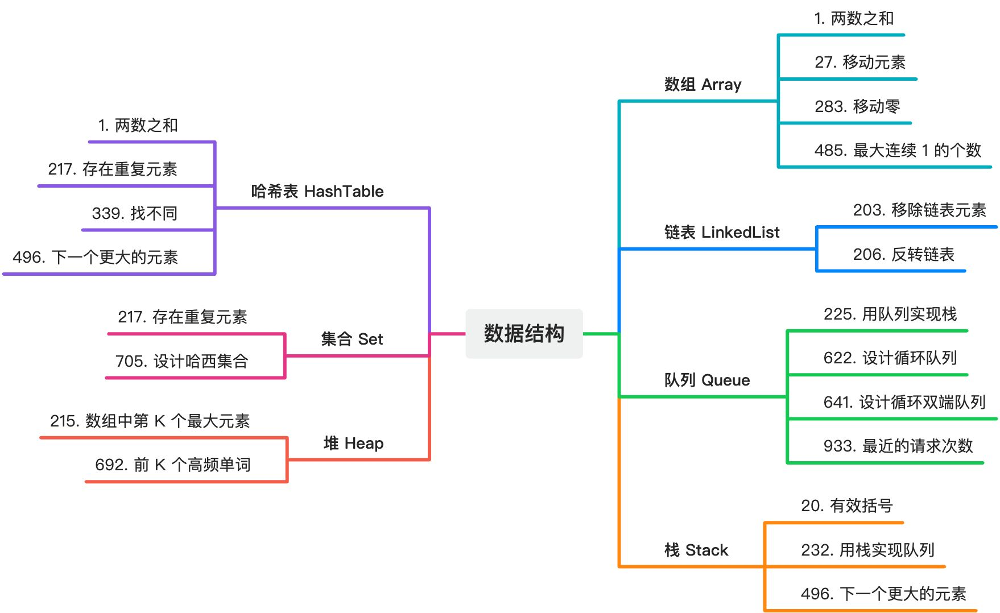

# LeetCode

## 🔗 links

- https://leetcode.cn/ - LeetCode 官网
- https://www.yuque.com/huyouda/leetcode - 语雀 LeetCode 知识库
  - 存储一些通过语雀画板绘制的图片、思维导图等，以便必要的时候二次编辑用。
  - 存储 LeetCode 相关题解的视频。
- https://github.com/doocs - GitHub 技术社区 Doocs
- https://github.com/doocs/leetcode - 🔥 LeetCode solutions in any programming language | 多种编程语言实现 LeetCode、《剑指 Offer（第 2 版）》、《程序员面试金典（第 6 版）》题解
- https://doocs.github.io/leetcode/lc/1/ - LeetCode 全解

## 📝 LeetCode 刷题指南 - 新手快速入门

- 数据结构

- 算法

## 📝 JavaScript 相关算法题汇总

下面记录了所有带有 JavaScript 标签的 LeetCode 算法题。
| 标题                               | 难度 | 视频 |
| ---------------------------------- | ---- | ---- |
| 2618. 检查是否是类的对象实例       | 中等 |      |
| 2619. 数组原型对象的最后一个元素   | 简单 |      |
| 2620. 计数器                       | 简单 | ✔    |
| 2621. 睡眠函数                     | 简单 |      |
| 2626. 数组归约运算                 | 简单 |      |
| 2627. 函数防抖                     | 中等 | ✔    |
| 2629. 复合函数                     | 简单 | ✔    |
| 2632. 柯里化                       | 中等 | ✔    |
| 2634. 过滤数组中的元素             | 简单 |      |
| 2635. 转换数组中的每个元素         | 简单 | ✔    |
| 2648. 生成斐波那契数列             | 简单 |      |
| 2665. 计数器 II                    | 简单 | ✔    |
| 2666. 只允许一次函数调用           | 简单 | ✔    |
| 2667. 创建 Hello World 函数        | 简单 | ✔    |
| 2676. 节流                         | 中等 | ✔    |
| 2677. 分块数组                     | 简单 |      |
| 2690. 无穷方法对象（Plus）         | 简单 |      |
| 2694. 事件发射器                   | 中等 |      |
| 2695. 包装数组                     | 简单 |      |
| 2703. 返回传递的参数的长度         | 简单 |      |
| 2704. 相等还是不相等               | 简单 |      |
| 2715. 执行可取消的延迟函数         | 简单 |      |
| 2722. 根据 ID 合并两个数组         | 中等 |      |
| 2723. 两个 Promise 对象相加        | 简单 |      |
| 2724. 排序方式                     | 简单 |      |
| 2725. 间隔取消                     | 简单 |      |
| 2726. 使用方法链的计算器           | 简单 |      |
| 2727. 判断对象是否为空             | 简单 |      |
| 2758. 下一天（Plus）               | 简单 |      |
| 2774. 数组的上界（Plus）           | 简单 |      |
| 2794. 从两个数组中创建对象（Plus） | 简单 |      |
| 2796. 重复字符串（Plus）           | 简单 |      |
| 2797. 带有占位符的部分函数（Plus） | 简单 |      |
| 2803. 阶乘生成器（Plus）           | 简单 |      |
| 2804. 数组原型的 forEach 方法      | 简单 |      |
| 2822. 对象反转                     | 简单 |      |